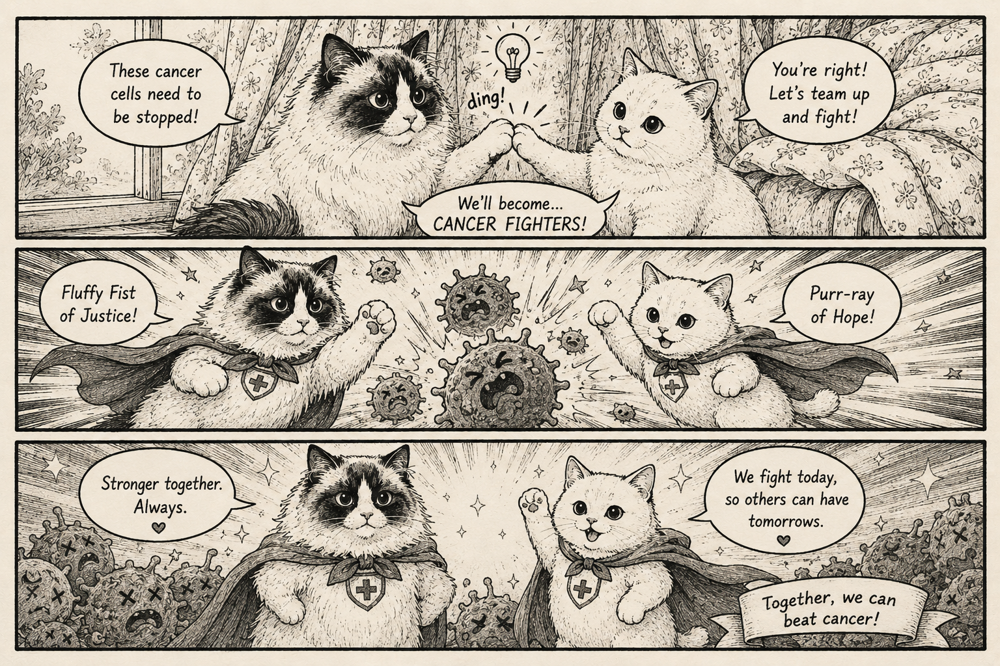

# The Atlas of Multi-Omics Cancer Research



这是一个全自动更新的癌症研究知识库，面向癌症多组学、空间组学、肿瘤免疫、精准预防和转化研究。项目的目标不是简单收藏论文摘要，而是把高水平文献拆解成可学习、可复用、可迁移的科研知识库。

每篇论文笔记都尽量回答几个实际问题：这篇文章的生物学故事从哪里开始？作者真正解决了什么问题？核心图表证明了什么、没有证明什么？方法学和统计学分析应该如何理解？这套研究设计能否迁移到胃癌预防、癌前病变、多组学整合、空间转录组或临床队列研究中？

## 项目初衷

癌症研究中的重要论文往往信息密度很高：结果、图表、方法、统计模型、队列设计和转化意义交织在一起。只读摘要很容易错过关键证据；只看方法又难以把握生物学问题。本项目希望把论文重新组织成更适合科研训练和课题设计的形式。

这个 atlas 特别关注：

- 癌症多组学和空间组学研究设计
- 肿瘤免疫、免疫受体组学和肿瘤微环境
- 胃癌、癌前病变和精准预防相关可迁移思路
- 队列设计、统计分析、机器学习和因果推理
- 从文献证据到可执行课题的转化路径

## 怎么使用

建议从下面的“全书目录”进入具体主题。每篇论文一般包含以下模块：

- 生物学故事前情：先解释领域背景和问题来源，帮助快速进入状态。
- 重要缩写表：提前交代高频缩写和本文语境，减少阅读阻力。
- 本论文主图：列出主图、关键表格和它们在正文中的位置。
- 论文详细解读：按原文逻辑梳理结果、图表证据和证据边界。
- 独立方法学详解：把实验流程、数据处理、模型和复现要点单独讲清楚。
- 统计学分析方法：解释检验、回归、AUC、交叉验证、多重校正、生存分析等方法的输入、目的和局限。
- 深度研究洞察与迁移思路：提炼可用于自己课题设计的概念和方法。

如果只想快速了解一篇文章，建议先读“生物学故事前情”“重要缩写表”“本论文主图”和“作者结论与证据强度”。如果要学习方法或准备复现，再进入“独立方法学详解”和“统计学分析方法”。

## PDF 到笔记的强制解析流程

新增论文时，先把 PDF 转成可审计的 LLM reading pack，再写笔记。不要直接把 PDF 或摘要交给模型概括。

```bash
python scripts/build_pdf_llm_pack.py pdfs/processed/example.pdf \
  -o tmp/example-llm-pack.md \
  --json-manifest tmp/example-llm-manifest.json
```

这个流程会先抽取 PDF 全文，再按页码、章节和句子生成稳定来源 ID。LLM 必须基于这些句子 ID 完成解读；Results 和 Methods 必须句对句翻译、逐句解释，并在最终笔记里给出覆盖审计。若 PDF 版面导致表格错行、断词、图内文字不可读或章节识别不准，应在“PDF 解析质量”和覆盖审计中明确标注，而不是静默跳过。

## 全书目录

- [Overview / 使用说明](README.md)
- Literature Notes
  - [Gastric Cancer](notes/gastric-cancer/README.md)
    - [Mutational Signatures and Clonal Hematopoiesis in Intestinal Metaplasia across Countries with Varying Stomach Cancer Incidence](notes/gastric-cancer/2026-im-mutational-signatures-ch.md)
      - [生物学故事前情](notes/gastric-cancer/2026-im-mutational-signatures-ch.md#生物学故事前情)
      - [重要缩写表](notes/gastric-cancer/2026-im-mutational-signatures-ch.md#重要缩写表)
      - [论文详细解读](notes/gastric-cancer/2026-im-mutational-signatures-ch.md#论文详细解读)
      - [独立方法学详解](notes/gastric-cancer/2026-im-mutational-signatures-ch.md#独立方法学详解)
      - [统计学分析方法](notes/gastric-cancer/2026-im-mutational-signatures-ch.md#统计学分析方法)
    - [Spatial and functional dissection of cancer-associated fibroblasts-mediated immune modulation in H. pylori-associated gastric cancer](notes/gastric-cancer/2025-hp-gc-caf-immune-modulation.md)
      - [生物学故事前情](notes/gastric-cancer/2025-hp-gc-caf-immune-modulation.md#生物学故事前情)
      - [重要缩写表](notes/gastric-cancer/2025-hp-gc-caf-immune-modulation.md#重要缩写表)
      - [论文详细解读](notes/gastric-cancer/2025-hp-gc-caf-immune-modulation.md#论文详细解读)
      - [独立方法学详解](notes/gastric-cancer/2025-hp-gc-caf-immune-modulation.md#独立方法学详解)
      - [统计学分析方法](notes/gastric-cancer/2025-hp-gc-caf-immune-modulation.md#统计学分析方法)
  - [Immunology](notes/immunology/README.md)
    - [Predictability of B cell clonal persistence and immunosurveillance in breast cancer](notes/immunology/2024-b-cell-clonal-persistence-breast-cancer.md)
      - [生物学故事前情](notes/immunology/2024-b-cell-clonal-persistence-breast-cancer.md#生物学故事前情)
      - [重要缩写表](notes/immunology/2024-b-cell-clonal-persistence-breast-cancer.md#重要缩写表)
      - [论文详细解读](notes/immunology/2024-b-cell-clonal-persistence-breast-cancer.md#论文详细解读)
      - [独立方法学详解](notes/immunology/2024-b-cell-clonal-persistence-breast-cancer.md#独立方法学详解)
      - [统计学分析方法](notes/immunology/2024-b-cell-clonal-persistence-breast-cancer.md#统计学分析方法)
    - [Immunosequencing identifies signatures of T cell responses for early detection of nasopharyngeal carcinoma](notes/immunology/2025-npc-tcr-early-detection.md)
      - [生物学故事前情](notes/immunology/2025-npc-tcr-early-detection.md#生物学故事前情)
      - [重要缩写表](notes/immunology/2025-npc-tcr-early-detection.md#重要缩写表)
      - [论文详细解读](notes/immunology/2025-npc-tcr-early-detection.md#论文详细解读)
      - [独立方法学详解](notes/immunology/2025-npc-tcr-early-detection.md#独立方法学详解)
      - [统计学分析方法](notes/immunology/2025-npc-tcr-early-detection.md#统计学分析方法)
    - [Disease diagnostics using machine learning of B cell and T cell receptor sequences](notes/immunology/2025-disease-diagnostics-immune-receptor-sequences.md)
      - [生物学故事前情](notes/immunology/2025-disease-diagnostics-immune-receptor-sequences.md#生物学故事前情)
      - [重要缩写表](notes/immunology/2025-disease-diagnostics-immune-receptor-sequences.md#重要缩写表)
      - [论文详细解读](notes/immunology/2025-disease-diagnostics-immune-receptor-sequences.md#论文详细解读)
      - [独立方法学详解](notes/immunology/2025-disease-diagnostics-immune-receptor-sequences.md#独立方法学详解)
      - [统计学分析方法](notes/immunology/2025-disease-diagnostics-immune-receptor-sequences.md#统计学分析方法)
  - [Methods](notes/methods/README.md)
  - [Multiomics](notes/multiomics/README.md)
  - [Spatial Transcriptomics](notes/spatial-transcriptomics/README.md)
    - [Spatial omics at the forefront: emerging technologies, analytical innovations, and clinical applications](notes/spatial-transcriptomics/2026-spatial-omics-at-the-forefront.md)
      - [生物学故事前情](notes/spatial-transcriptomics/2026-spatial-omics-at-the-forefront.md#生物学故事前情)
      - [重要缩写表](notes/spatial-transcriptomics/2026-spatial-omics-at-the-forefront.md#重要缩写表)
      - [论文详细解读](notes/spatial-transcriptomics/2026-spatial-omics-at-the-forefront.md#论文详细解读)
      - [领域方法学与复现提示](notes/spatial-transcriptomics/2026-spatial-omics-at-the-forefront.md#领域方法学与复现提示)
      - [被综述领域常用的统计与分析方法](notes/spatial-transcriptomics/2026-spatial-omics-at-the-forefront.md#被综述领域常用的统计与分析方法)
  - [Precision Medicine](notes/precision-medicine/README.md)
  - [AI](notes/AI/README.md)
  - [Epidemiology](notes/epidemiology/README.md)

## 内容定位

本书是持续更新的研究笔记，不是临床指南，也不替代原始论文。所有结论都应回到原文证据和图表中理解。文中的“深度研究洞察”和“迁移思路”用于启发课题设计，需要在具体研究场景中重新验证。

## Developer / Contact

Zong-Chao Liu

State Key Laboratory of Holistic Integrative Management of Gastrointestinal Cancers,

Beijing Key Laboratory of Carcinogenesis and Translational Research,

Department of Cancer Epidemiology, Peking University Cancer Hospital & Institute,

52 Fucheng Rd., Haidian Dist., Beijing, 100142, China

Tel: +86-13332865842

E-mail: zongchao.liu@bjmu.edu.cn; zl2860@caa.columbia.edu
