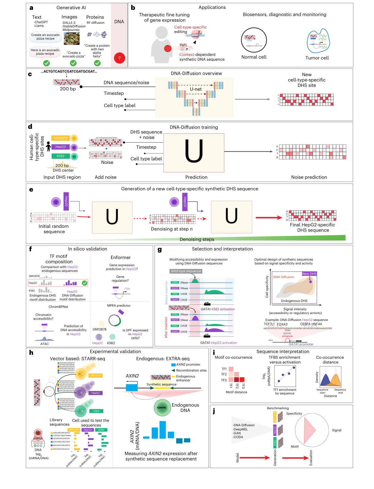
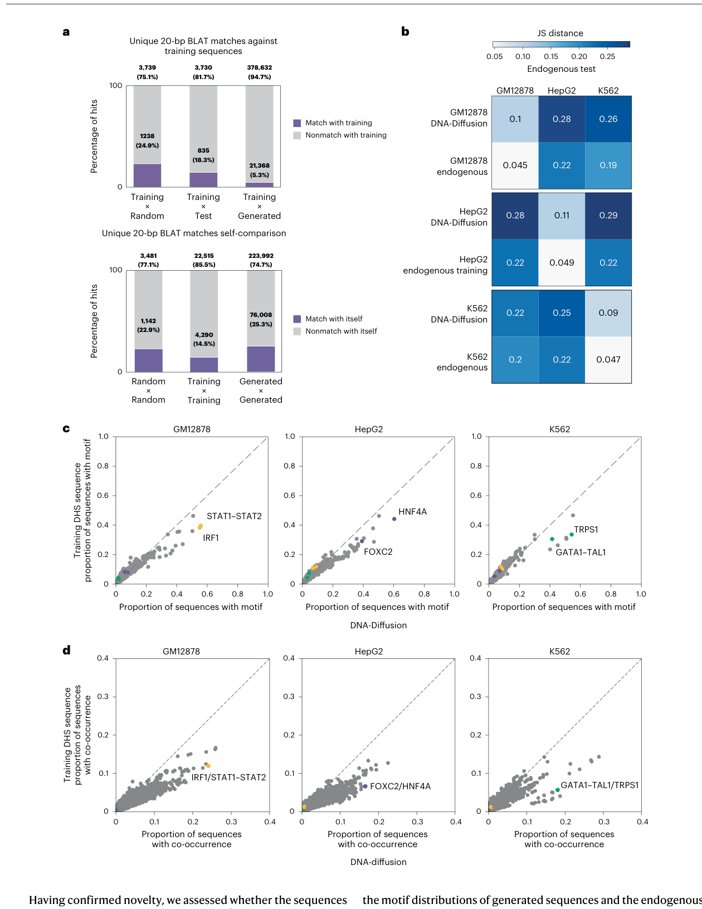
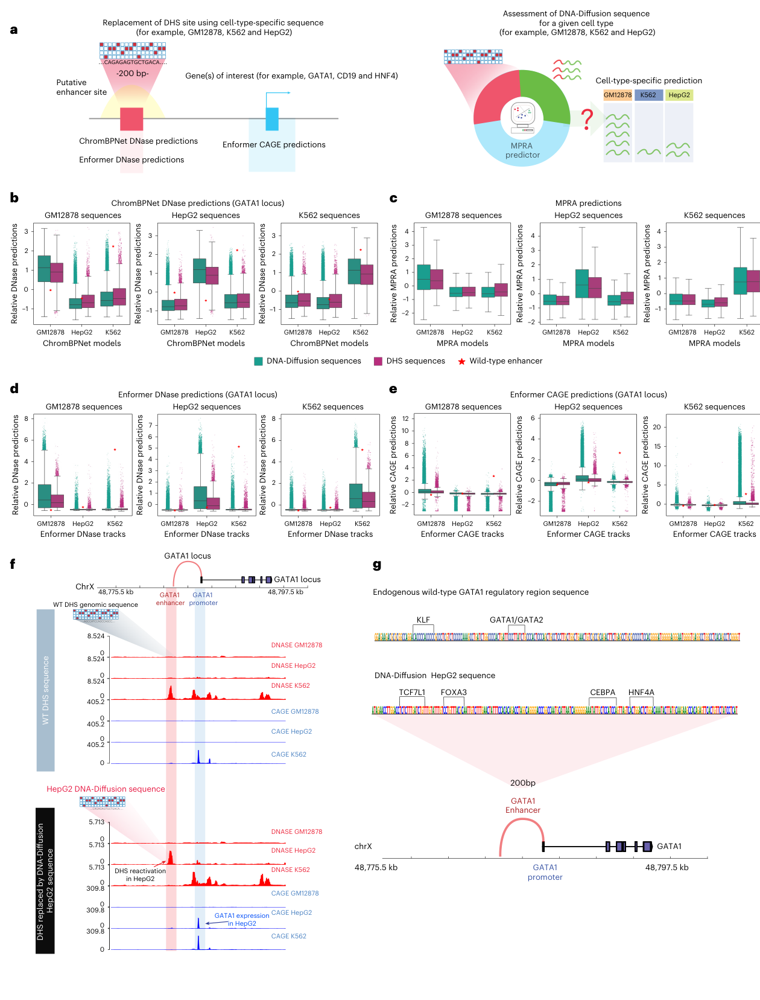
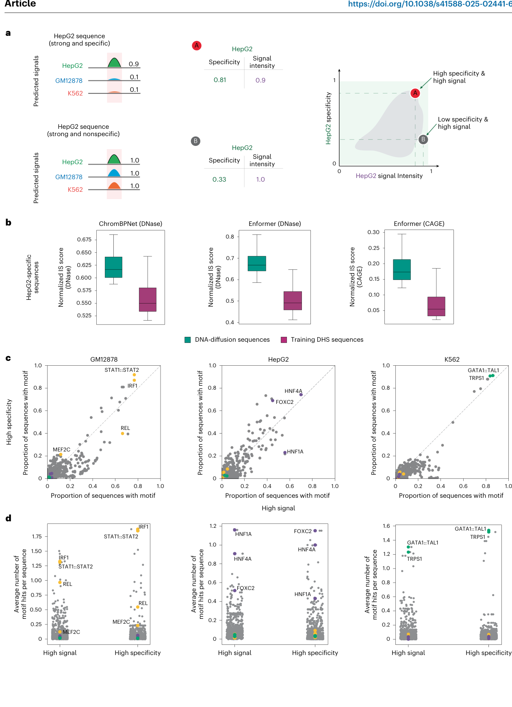
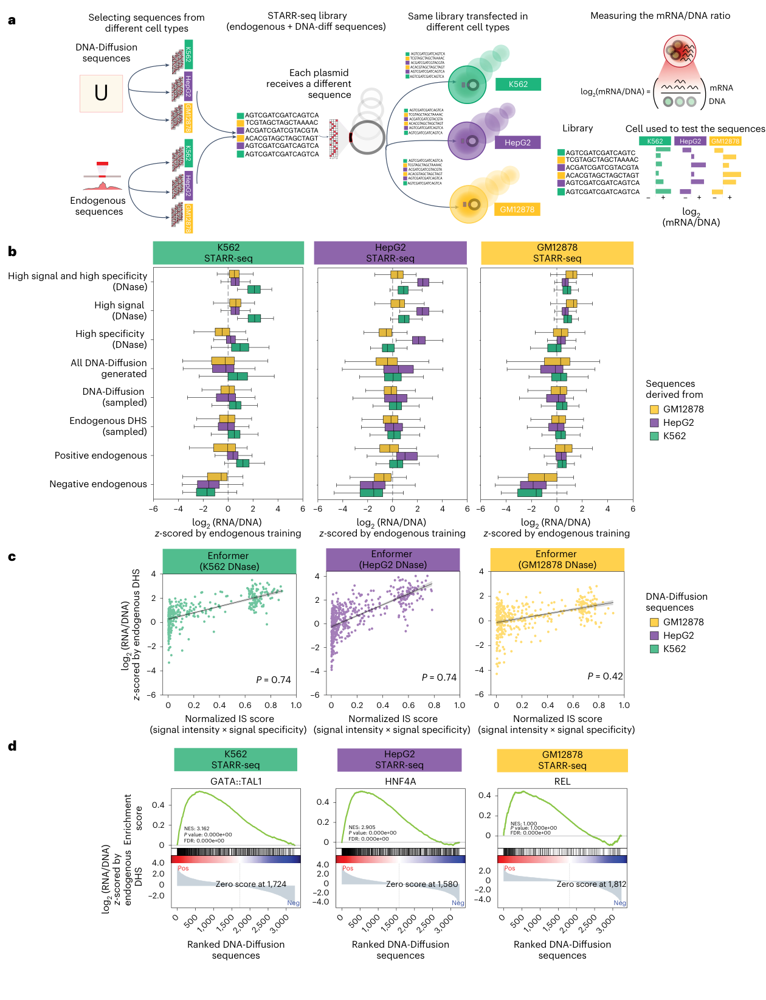
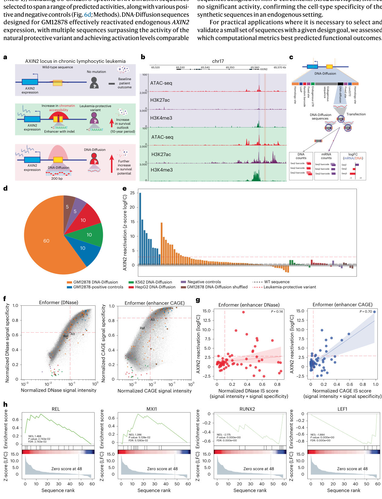
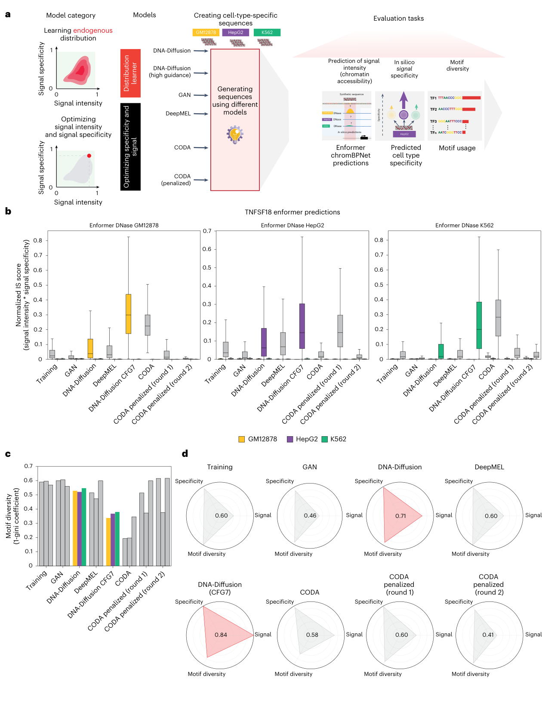

# Designing synthetic regulatory elements using the generative AI framework DNA-Diffusion

<!-- wechat-style-reviewed: 2026-09-12 -->

做基因调控实验时，真正难的不是找到一个“可能有增强子活性”的片段，而是设计一段足够短的 DNA：它要在目标细胞里有足够强的活性，同时尽量不在其他细胞里启动表达。对载荷空间有限的 AAV 等递送系统，这个矛盾尤其具体。

现有图谱已经标注了数以百万计的调控元件，但从“知道天然元件在哪里”到“按目标写出新的 200 bp 序列”仍有距离。既有生成或优化模型还常依赖每个细胞类型单独调参，并主要在游离于染色体之外的报告系统中验证。

这篇论文训练了一个条件扩散模型，在 GM12878、HepG2 和 K562 三种细胞背景下各生成 100,000 条 200 bp 序列。作者随后用 5,850 元件的 STARR-seq 库做跨细胞实验，并在白血病 B 细胞 MEC-1 的内源 AXIN2 位点做进一步验证。

论文给出的答案是：扩散模型可以学到细胞类型相关的转录因子“语法”，再借助计算预测筛出兼顾强度与特异性的候选；其中部分候选在 AXIN2 landing pad 的转录读数超过天然保护性变异。不过，这仍是三种生成/报告细胞背景加一个预工程化 MEC-1 位点的概念验证，不是基因治疗疗效或安全性的证据。

## 01｜为什么“写一段增强子”比识别增强子更难

天然开放染色质区域往往同时包含多个转录因子结合位点、间距和方向关系。只把高分 motif 拼在一起，可能提高某个预测器的信号，却容易牺牲序列多样性，甚至在非目标细胞中也被激活。

另一个问题是验证环境。STARR-seq 等大规模报告实验能高通量测量转录活性，但序列位于质粒上，缺少真实染色质位置、邻近启动子和三维接触。真正进入染色体后是否仍有效，不能由 episomal 结果直接推断。

DNA-Diffusion 因此要同时回答三个问题：生成序列是否新颖、是否保留天然调控语法，以及在计算预测、质粒报告和内源基因组三个层级上是否仍能工作。

## 02｜这项研究到底做了多大规模

训练数据来自包含 733 个生物样本、438 种细胞和组织类型的 DHS index；DHS 是对 DNase I 敏感的开放染色质区域。本文只聚焦三种数据和实验资源较完整的细胞系：B 淋巴母细胞样 GM12878、肝癌来源 HepG2 和白血病来源 K562。

每条输入以 DHS 峰顶为中心截取 200 bp。染色体 1 被整体留作测试集、染色体 2 作验证集，其余染色体用于训练，以减少相邻序列跨集合泄漏。图注给出的训练序列数分别为 GM12878 9,903 条、HepG2 9,833 条和 K562 9,769 条；模型训练后为每种细胞生成 100,000 条，共 300,000 条。

实验验证分两层。第一层是文字设计为 5,850 个元件的 STARR-seq 库，同一库分别进入三种细胞；第二层是在 MEC-1 预工程化的杂合 AXIN2 RMCE landing pad 中交换约 2.5 kb 重构片段。

后一层在主文有四处记录：Results 称测试 100 条；Fig. 6d 的六类扇区由 60 条 GM12878 定向生成序列、10 条 GM12878 阳性对照、K562/HepG2 定向序列各 10 条及阴性/打乱对照各 5 条组成，也闭合为 100；Methods 总述称 105 条，Methods 细项连同 reference/alternative allele 只能合到 92 条。官方 Supplementary Table 7 现把数据对象拆得更清楚：Twist 合成表有 100 条，序列表加上 reference/alternative allele 后有 102 条，LFC 表再含 4 条野生型改造对照而有 106 行；它不能反向消除主文的 100/105/92 冲突。

## 03｜DNA-Diffusion 是怎样从噪声生成 200 bp 序列的

模型先把 200 bp DNA 编码成数值矩阵，再由带细胞类型条件的去噪 U-Net 学习：给它加噪序列、扩散时间和细胞标签，它要恢复原始序列；生成时则从随机噪声出发，逐步写出目标细胞类型的序列。

模型还允许用 classifier-free guidance（CFG，无分类器引导）调节细胞类型信号。CFG 越高，序列越偏向目标细胞特征，但 motif 多样性可能下降；具体张量、标签遮蔽比例、采样步数和训练参数留在技术附录。

这张图把后续证据链放在同一条线上：生成只是第一步，后面还有 motif、预测器、质粒报告和内源置换。

简明图注：Fig. 1 展示 200 bp DHS 序列如何在细胞标签条件下被加噪和去噪，并连接 ChromBPNet、Enformer、MPRA predictor、STARR-seq、EXTRA-seq 和模型比较。该图是研究路线，不是独立效果证据。

## 04｜生成序列是在复制训练集，还是学到了调控语法

主文的 BLAT 比对称，只有 4.7% 的生成序列与训练集存在至少一段 `≥20 bp` 的完全匹配，低于随机基因组片段的 23.1% 和测试 DHS 的 14.5%；阈值提高到 `≥30 bp` 后，这一比例降到 0.6%。不过 Fig. 2A 汇总柱图对应的三个比例是 5.3%、24.9% 和 18.3%，而 `Training × Generated` 柱的分母还是 400,000，不是正文所述三类各 100,000 的 300,000；本文因此不把这些数字当作无争议的绝对复制率。

补充分析解释了部分差异：随机、测试和生成序列与重复区域重叠的比例不同。去掉与重复区域重叠的命中后，三组在 `≥20 bp` 阈值下的命中率分别降到 1.06%、1.86% 和 1.61%，最长匹配中位数也收敛到 23、23 和 22.5 bp；在 `≥30 bp` 阈值下，生成序列仍为 0.6%，低于随机序列 8.6% 和测试序列 3.3%。这让“没有大段复制”更可信，却不能把不一致的原始分母抹掉。

序列虽然不直接复制训练集，motif 分布仍接近对应细胞的天然 DHS，三种细胞相对各自测试集的 Jensen–Shannon divergence 均值为 0.1。更具体地说，HNF4A motif 出现在约 47% 的 HepG2 生成序列中，而训练序列为 29%；GM12878 的 IRF1 为 55% 对 38%；K562 的 GATA1–TAL1 为 41% 对 31%。IRF1–STAT1::STAT2 共现也由训练集的 12% 增至生成序列的 24%。

“语法”也不是原样复制。补充分析中，K562 的 GATA1::TAL1–TRPS1 motif 中位间距从训练序列的 43.5 bp 变成生成序列的 34 bp，同向排列比例从 24.2% 升到 36.1%；GM12878、HepG2 的代表 motif 对间距则更接近训练数据。模型保留了部分组合偏好，也重新加权了间距与方向。

这说明模型更像是在重组细胞类型相关的调控词汇，而不是逐段抄写天然序列；但 motif 富集本身仍不能证明染色质可及或基因表达。

简明图注：Fig. 2A 比较 BLAT 命中，B 比较三种细胞之间的 motif 分布距离，C–D 比较单 motif 与 motif 对的出现比例。图中 BLAT 汇总比例与 Results 文字存在口径差异，已在技术附录保留。

## 05｜计算预测能把“强”与“只在目标细胞强”分开吗

作者用三类计算“生物学 oracle”排序候选：ChromBPNet 和 Enformer 把生成序列放回 GATA1、HNF4A、CD19、TNFSF18 等具体位点，预测局部开放染色质或 DNase I/CAGE 信号；MPRA predictor 则在报告体系的序列层面预测活性，不包含同样的基因组位置语境。三者都是模型推断，不是实验结果。

在 GATA1 调控位点，K562 定向序列的 ChromBPNet 预测中位数为 1.12，高于 K562 训练序列的 0.92；同一批序列在非目标 GM12878 和 HepG2 中分别为 −0.62 和 −0.74，Wilcoxon rank-sum `P < 0.01`。跨全部计算 oracle，超过野生型增强子的生成序列有 GM12878 483 条、HepG2 507 条、K562 553 条；训练集中对应只有 2、1、1 条。

简明图注：Fig. 3 比较生成序列与天然 DHS 在 ChromBPNet、MPRA predictor 和 Enformer 中的预测，并展示一个把 HepG2 定向序列放入 GATA1 位点的例子。所有数值都来自模型推断，不能当作真实基因表达。

为了避免只追求强信号，作者把目标细胞信号强度与相对其他细胞的特异性相乘，得到 intensity–specificity（IS）分数。在多个位点，计算 IS 与实验开放染色质导出的强度、特异性和联合分数相关系数分别为 `r = 0.57–0.67`、`0.70–0.77` 和 `0.65–0.74`；这支持它用于候选排序，但相关并不等于预测器已经捕获全部调控机制。

简明图注：Fig. 4A 定义强度和特异性，B 比较 HepG2 top 100 生成序列与训练 DHS，C–D 展示高信号与高特异性候选采用不同 motif 组合。该图说明筛选目标之间存在取舍。

## 06｜5,850 个元件的 STARR-seq 是否支持计算排序

STARR-seq 的主文、Supplementary Note 8 和补充方法都把设计写成 5,850 个候选与对照：每种目标细胞 1,950 条，同一库再分别转染 K562、HepG2 和 GM12878，以 `log2(mRNA/plasmid DNA)` 量化转录活性。“高信号且高特异”组每个目标细胞各有 100 条；Fig. 5 最终可分析的全部生成序列为 GM12878 1,234 条、HepG2 1,010 条和 K562 992 条。

随机抽取的 DNA-Diffusion 序列大体复现天然 DHS 在对应细胞中更活跃的趋势；经过高信号或高 IS 预筛选的序列，则超过作者选取的强阳性对照。不过，主 PDF 没有报告这些预筛选组相对阳性对照的精确效应差或完整比较检验，因此这里只保留方向，不补写幅度。

实验读数与 Enformer DNase I IS 的 Pearson 相关在 K562 和 HepG2 中均为 0.74，在 GM12878 中为 0.42。作者把较低的 GM12878 相关归因于该细胞转染效率较低，但这仍提示计算排序的可靠性依赖细胞背景。

按实验活性排序后，K562 的 GATA1–TAL1、HepG2 的 HNF4A 和 GM12878 的 REL motif 位于高活性序列一端。这个结果把“motif 富集”与真实报告活性连接起来，但 STARR-seq 测的是 episomal 环境，尚未回答染色体内的局部调控。

官方 Supplementary Table 5 的元数据却列出 6,000 条，即每种细胞 2,000 条；相较 1,950 条设计，它每种细胞另含 50 条“阳性元件按核苷酸打乱”的对照。原始计数表有 5,998 条数据行，LFC 表最终有 4,672 条；其中可分析生成序列为 1,234、1,009、992 条，HepG2 又比 Fig. 5 的 1,010 少 1。设计、元数据、原始计数与最终统计对象不能互换。

简明图注：Fig. 5A 展示同一序列库进入三种细胞，B 比较不同候选选择策略，C 给出计算 IS 与 STARR-seq 的相关，D 将高活性序列与细胞类型相关 motif 相连。补充方法说明须在 9 个 DNA 重复中均非零；Table 5 与 Fig. 5 的 HepG2 计数仍相差 1。

## 07｜这些序列进入内源基因组后还能工作吗

作者选择 AXIN2，是因为慢性淋巴细胞白血病中存在一个距 TSS 约 2.5 kb 的天然 5 bp 保护性 indel（rs143348853）；既往研究把它与 AXIN2 重新表达和较好预后联系起来。本文使用稳定表达 Cre、带重组酶介导盒式交换（RMCE）landing pad 的 MEC-1 细胞和 EXTRA-seq，把候选放入同一内源位置，再用 12 nt barcode 对应的 mRNA/gDNA 比值衡量转录。

Results 报告，多条 GM12878 定向序列的 AXIN2 激活超过天然保护性变异，而 K562、HepG2 定向序列在 B 细胞背景中没有显著活性。Table 7e 的聚合 logFC 点估计把它量化为 GM12878 12/60 条高于 alternative allele（−0.3524），HepG2 和 K562 则均为 0/10；工作簿没有给逐构建的多重校正检验，因此“点估计超过”不等于统计学优效。若只看计算排序，Enformer enhancer CAGE signal 的前 10 条中有 6 条超过保护性变异；CAGE IS 的前 10 条中有 5 条超过，而且该指标的前三条都能较强地激活 AXIN2。CAGE 预测与实验激活的 Spearman `rho = 0.70`，DNase I 可及性预测则几乎不相关。

这一步的价值在于把验证从游离质粒推进到一个固定的染色体 landing-pad 语境；该位点已经预工程化，交换的是含候选、改造 5′UTR 和 barcode 的约 2.5 kb 重构片段，并非在原样野生型位点只替换 200 bp。实验仍没有测量细胞增殖、白血病表型、动物结局、脱靶表达或患者生存，因此“超过保护性变异”只指 AXIN2 转录读数，不能写成提高生存或已具治疗效果。

简明图注：Fig. 6 展示保护性变异背景、预工程化 MEC-1 landing pad 中的 EXTRA-seq 交换、候选组成、AXIN2 mRNA/gDNA 读数和预测—实验相关。A 中“生存改善”是基于既往变异研究的示意，不是本文测得的临床结局。

## 08｜为什么扩散模型能在活性与多样性之间调节

Results 提示两个互补原因。第一，模型学习的是天然 DHS 分布，因此默认生成序列保留较丰富的 motif 组合；第二，CFG 可以把条件概率质量推向更典型的细胞类型特征，让同一模型从“接近天然分布”逐渐转为“偏向高活性优化”。真正的高信号仍依赖 oracle 预筛选，随机生成序列并不会自动优于天然 DHS。

在以 TNFSF18 位点的 Enformer DNase IS 和 `1 − Gini` motif 多样性为指标的比较中，每个生成模型在每种细胞各产生 1,000 条序列，以下分数是三种细胞的平均中位数。标准 DNA-Diffusion（CFG1）为 IS 0.040、多样性 0.53；GAN 为 0.006、0.59，DeepMEL 为 0.041、0.58，天然序列为 0.030、0.58。CODA 的 IS 较高，为 0.168，但多样性只有 0.24；加入 motif penalty 后，其两轮 IS 降为 0.065 和 0.001。

把 CFG 提到 7 后，DNA-Diffusion 的 IS 达 0.215、多样性降到 0.36。每个模型、每种细胞按距离理想点最近的规则取 top 100 后，三轴雷达图的汇总面积由 CFG1 的 0.71 增至 CFG7 的 0.84。这里的“优于”仍由 Enformer 和自定义汇总指标定义，并未在同规模湿实验中逐模型比较。

简明图注：Fig. 7 比较分布学习与直接优化模型在预测信号、细胞特异性和 motif 多样性上的取舍。CFG7 得分最高但多样性下降，说明调参改变的是设计目标，不是无条件提升所有性能。

## 09｜这项工作真正改变了什么

第一，它把“生成—排序—报告实验—内源验证”接成了一条可执行流程。研究者可以先生成大规模候选，再按目标细胞强度、非目标细胞抑制和 motif 组成筛选，而不是只接受一个黑箱总分。

第二，200 bp 元件为载荷受限的递送系统提供了候选设计空间。近期更现实的用途，是为特定细胞和特定位点建立候选库并缩小实验规模，而不是直接进入 AAV 或患者治疗；本文没有进行递送实验。

第三，AXIN2 结果说明固定 landing-pad 语境中的验证可以推翻部分简单预测：CAGE 比 DNase I 更能排序有效候选，RUNX2、LEF1 等 motif 还出现在可及性高却无法激活 AXIN2 的序列中。换句话说，开放染色质只能提供候选线索，不足以代表有效的 AXIN2 转录激活。

## 10｜对我们的研究有什么可借鉴

如果用生成模型设计肿瘤或免疫细胞调控元件，数据切分应至少按染色体或同源序列簇进行，避免相邻片段泄漏；同时报告序列相似性、motif 多样性和功能预测，不能只给一个“活性分数”。

候选筛选应把目标细胞强度和多个非目标细胞的抑制分开定义，并在实验前固定权重。只用目标细胞挑最高分，容易得到跨细胞普遍活跃、但不特异的元件。

验证顺序可以沿用“高通量 episomal 筛选—少量内源同位点置换—表型与脱靶评估”。只有最后两层都完成，才适合讨论疾病机制或递送；STARR-seq 的高活性本身不应被写成治疗证据。

## 11｜这些结果仍需要冷静看待

生成模型训练和 STARR-seq 验证覆盖 GM12878、HepG2、K562 三种细胞；MEC-1 是另用于 AXIN2 内源验证的第四种细胞，而不是同一套三细胞训练对象。K562、HepG2 与 MEC-1 都是肿瘤来源，GM12878 是永生化淋巴母细胞样细胞；能否迁移到原代细胞、组织状态、不同供者或疾病微环境尚未验证。

训练条件来自 DHS 是否开放及细胞类型等离散标签，不是连续的真实增强子活性。候选排序又依赖 ChromBPNet、Enformer 和 MPRA predictor；训练偏差、测序深度与长程调控盲区会进入排序，论文也展示了 Enformer 在 GATA1 位点不能正确反映一个 CRISPRi 验证增强子的失活效应。

STARR-seq 是质粒环境，唯一的内源验证集中在 MEC-1 的 AXIN2 单个位点。没有全基因组脱靶、长期稳定性、细胞表型、动物毒性、递送效率或临床结局，因此不能从 AXIN2 转录提高外推到白血病预防或治疗。

原文及随文文件还有不能静默修复的冲突：BLAT 正文与 Fig. 2 比例不同；STARR-seq 的 5,850 文字设计与 Table 5 的 6,000 条元数据不同；EXTRA-seq 在主文形成 100/100/105/92 四处记录，而 Table 7 又分别给出 100 条合成、102 条序列和 106 行 LFC；四次技术提取与 Supplementary Data 4 所称五个重复并存；PyTorch 2.0.0 与 reporting summary 的 torch 2.3.1 不一致。

本次已补回官方 43 页 Supplementary Information、Supplementary Tables 5 和 7，并核对其来源目录。补充材料填上了 U-Net、MPRA predictor、IS、STARR/EXTRA 和基线模型的关键细节，但双栏抽取、未下载的大型 Source Data 以及原文计数冲突仍限制完全复现；以下技术附录逐项保留这些边界。

---

## 技术附录

### 论文基本信息

- 期刊：Nature Genetics，Volume 58，180–194
- 正式出版年份：2026；在线发表：2025-12-23；收稿：2024-06-21；接收：2025-11-01
- DOI：10.1038/s41588-025-02441-6
- 作者：Lucas Ferreira DaSilva、Simon Senan、Judith F. Kribelbauer-Swietek、Zain Munir Patel、Lithin Karmel Louis、Aniketh Janardhan Reddy 等
- 通讯作者：Luca Pinello
- 研究领域：生成式 AI、顺式调控元件设计、合成生物学、功能基因组学
- 关键词：DNA diffusion、enhancer design、cell-type specificity、STARR-seq、EXTRA-seq、AXIN2
- 数据来源：Meuleman DHS index、ENCODE、PINTS、HiDRA、GEO、ENA、ArrayExpress
- 代码：`https://github.com/pinellolab/DNA-Diffusion`，正文标注 release `0.1.1`
- 主数据与模型：正文主要指向 Zenodo 10.5281/zenodo.17420419；其他记录号冲突见下文
- 官方在线材料：[Supplementary Information](https://media.springernature.com/original/springer-static/esm/art%3A10.1038%2Fs41588-025-02441-6/MediaObjects/41588_2025_2441_MOESM1_ESM.pdf)、[Supplementary Table 5](https://media.springernature.com/original/springer-static/esm/art%3A10.1038%2Fs41588-025-02441-6/MediaObjects/41588_2025_2441_MOESM8_ESM.xlsx)、[Supplementary Table 7](https://media.springernature.com/original/springer-static/esm/art%3A10.1038%2Fs41588-025-02441-6/MediaObjects/41588_2025_2441_MOESM10_ESM.xlsx)；论文页面另列 Supplementary Tables 1–8 与 Fig. 1–7 Source Data
- 本地 PDF：`pdfs/processed/dna-diffusion-synthetic-regulatory-elements-nature-genetics-2026.pdf`
- 本地 PDF SHA-256：`56ca531154334e1da514bf26eeeb110a3c4261aae3ade3ff4a8ddfbb1e7d96ac`
- 本地 Supplementary Information：`tmp/dna-diffusion-supplementary-info.pdf`（43 页；SHA-256 `916403542e638875e35ccfc74a912da1bfba046e9db6b50008ae6170f8c2b20b`）
- 本地官方 Table 5/Table 7：`tmp/dna-diffusion-supp-table-5-official.xlsx`、`tmp/dna-diffusion-supp-table-7-official.xlsx`（SHA-256 分别为 `306b9baf300e33916ad05a23a6102e653fa2a6d6c6c7ad268adfff85713facda`、`4d226dbf074da2332aaed2a1295c925aaf3b91543476776a432800f03acdafc3`）
- 竞争利益：作者声明无竞争利益（`P019.S0085`）

### 主文与补充材料解析质量及覆盖审计

- 抽取方式：主文与 Supplementary Information 均使用 `scripts/build_pdf_llm_pack.py` 和 PyMuPDF；主文来源记为 `P…`，补充 PDF 来源统一加前缀 `SI:P…`，避免页码/句号碰撞。
- 主文总体覆盖：23 页、1,182 个句子 ID；1,182/1,182 已检查并分类，未覆盖 ID：无。
- 主 Results：按原页面连续范围校正为 `P002.S0011–P013.S0045`，531/531 个 ID；其中自动标签只把 400 个标为 `results`，另有 112 个误标 `supplementary`、19 个误标 `methods`。
- 主 Methods：按原文 Methods 标题校正为 `P016.S0002–P018.S0038`，143/143 个 ID；自动标签只正确识别前 34 个，后 109 个误标为 `results` 或 `supplementary`。数据与代码可用性另覆盖 `P018.S0039–P019.S0008` 的 23/23 个 ID。
- 自动 Methods 归账：manifest 标出的 140 个 `methods` ID 已全部检查；其中 34 个属于主 Methods，19 个是 reporting summary 中有效但重复的回答，87 个是摘要、Results/Fig. 7、参考文献、空模板或页脚噪声。
- 版面问题：双栏阅读顺序使图注与正文交错；`P013.S0003` 把 Fig. 7 图注、`n = 1,000` 和 AXIN2 CAGE 结果合并，`P013.S0037–P013.S0038` 把 CFG7 结果跨自动分节拆开；`P016.S0035–P016.S0036` 把 Methods 小标题接到上一句末尾。
- 图像问题：Fig. 1–7 均完整可见，本文用原始页面图像和图注人工核对；图内 OCR 只用于定位，不作为独立数字来源。
- 补充 PDF 覆盖：43 页、431 个句子 ID，431/431 已检查；包括 Supplementary Notes 1–9、Methods 1–8、Figures S1–S20、Tables 1–8 与 Data 1–11 的来源目录。自动标签为 title 3、methods 8、results 96、supplementary 324，但双栏把正文和标题交错，不能把这些标签当语义章节计数。
- 补图边界：Supplementary Fig. S1 是第 20 页的纯图像训练损失曲线，没有可抽取句子 ID，已回看原页；S2–S20 的标题/图注位于 `SI:P021.S0001–P040.S0007`。Table 5 与 Table 7 已做 worksheet/行级审计；其余表和大型 Source Data 本次只核对官方清单，未把未读取的数值写入笔记。
- reporting summary：页面 20–23 有大量模板文本和重复抽取；有效回答包括软件版本、数据位置、细胞来源、四次技术重复和 QC，空白 plant/clinical 模板不作为研究方法。

### 主图与完整 panel 注释

| 原文图表 | 完整 panel 注释 | 样本、比较与统计 | 图像文件 | 正文位置 |
|---|---|---|---|---|
| Fig. 1 | A：生成 AI 示例；B：细胞特异表达、监测等设想；C：200 bp DNA 条件扩散框架；D：DHS 加噪训练；E：50 步条件去噪生成；F：motif、ChromBPNet、Enformer、MPRA predictor；G：按强度/特异性筛选与位点替换；H：STARR-seq 和 EXTRA-seq；I：motif 共现、富集和间距；J：模型比较框架。 | 方法总览；三种细胞各生成 100,000 条，无独立显著性检验。来源 `P002.S0019–P002.S0051` 与图像页 3。 | `fig1-framework.png` | [03](#03｜dna-diffusion-是怎样从噪声生成-200-bp-序列的) |
| Fig. 2 | A：生成、测试和随机序列对训练集的 20 bp BLAT 命中，以及各组自比；B：生成/天然序列对三种测试集的 JS distance；C：单 motif 出现比例；D：motif 对共现比例。 | Fig. 2A 汇总比例与 Results 文字不同；C–D 突出 HNF4A、IRF1、GATA1–TAL1 等。来源 `P004.S0001–P004.S0026`、`P005.S0001–P005.S0018`、`P005.S0025–P005.S0027`。 | `fig2-sequence-motif-composition.png` | [04](#04｜生成序列是在复制训练集，还是学到了调控语法) |
| Fig. 3 | A：在候选增强子位置替换 200 bp；B：ChromBPNet DNase；C：MPRA predictor；D：Enformer DNase；E：Enformer CAGE；F：GATA1 位点野生型与 HepG2 定向序列替换；G：两条序列的 motif。 | 生成序列每细胞 `n = 100,000`；训练 DHS 为 GM12878 9,903、HepG2 9,833、K562 9,769；箱线图为中位数、IQR 和 1.5×IQR。来源 `P005.S0020–P005.S0050` 与图像页 6。 | `fig3-in-silico-enhancer-replacement.png` | [05](#05｜计算预测能把强与只在目标细胞强分开吗) |
| Fig. 4 | A：用目标细胞强度和相对非目标细胞特异性定义二维选择空间；B：HepG2 top 100 生成序列与训练 DHS 在三个 oracle 的 IS；C：高信号和高特异性集合中的 motif 比例；D：每序列 motif 命中数。 | 比较集合为每种细胞 top 100；主图没有独立湿实验终点。来源 `P007.S0001–P007.S0042`、`P008.S0001–P008.S0004` 及相关正文 `P008.S0035–P010.S0012`。 | `fig4-intensity-specificity.png` | [05](#05｜计算预测能把强与只在目标细胞强分开吗) |
| Fig. 5 | A：同一 STARR-seq 库进入 K562、HepG2、GM12878，以 mRNA/DNA 衡量；B：八类序列的活性；C：Enformer DNase IS 与实验读数相关；D：按实验活性排序的 motif GSEA。 | 总库 5,850；图注称 “all generated” 可分析数为 GM12878 1,234、HepG2 1,010、K562 992；Pearson 为 0.74、0.74、0.42。来源 `P008.S0023–P008.S0031`、`P008.S0047–P008.S0054`、`P009.S0001–P009.S0042`、`P010.S0013–P010.S0039`。 | `fig5-starr-seq-validation.png` | [06](#06｜5850-个元件的-starr-seq-是否支持计算排序) |
| Fig. 6 | A：AXIN2 野生型、保护性 indel 和合成序列的概念图；B：参考/indel 个体的 ATAC/H3K27ac/H3K4me3；C：MEC-1 EXTRA-seq；D：候选组成；E：AXIN2 logFC；F：候选的 DNase/CAGE 强度—特异性；G：预测与实验相关；H：REL/MX1/RUNX2/LEF1 motif GSEA。图注另描述 I：最高/最低序列 motif，但主图只见 A–H。 | Results 称 100 条；Fig. 6d 以 60+10+10+10+5+5 闭合为 100；Methods 总述称 105 条，Methods 细项连同 ref/alt 只能合到 92 条。红线为天然保护性变异读数，不是临床阈值。来源 `P010.S0025–P010.S0029`、`P010.S0040–P011.S0044`、`P013.S0003–P013.S0018`。 | `fig6-axin2-endogenous-reactivation.png` | [07](#07｜这些序列进入内源基因组后还能工作吗) |
| Fig. 7 | A：分布学习模型与直接优化模型及三项评价；B：TNFSF18 位点的 Enformer DNase IS；C：`1 − Gini` motif 多样性；D：特异性、信号、多样性雷达面积。 | 每模型每细胞生成 1,000 条；汇总 top 100；所有主比较是 in silico。来源 `P012.S0001–P012.S0039`、`P013.S0001–P013.S0003`、`P013.S0020–P013.S0045`。 | `fig7-model-benchmark.png` | [08](#08｜为什么扩散模型能在活性与多样性之间调节) |

### Results 证据覆盖审计

| 原文句子 ID | 忠实中文含义 | 正文对应位置 | 证据边界 |
|---|---|---|---|
| `P002.S0011–P005.S0019` | 模型输入、DHS 数据、染色体切分、每类 100,000 条生成；BLAT 新颖性、motif 分布、关键 motif 与 CFG 调节。 | [02](#02｜这项研究到底做了多大规模)、[03](#03｜dna-diffusion-是怎样从噪声生成-200-bp-序列的)、[04](#04｜生成序列是在复制训练集，还是学到了调控语法) | 含 Fig. 1–2 图中文字和跨栏图注；BLAT 正文与图不一致；motif 不是功能验证。 |
| `P005.S0020–P008.S0034` | GATA1/HNF4A/CD19 位点的 ChromBPNet、MPRA predictor、Enformer 预测；野生型比较和预测器局限。 | [05](#05｜计算预测能把强与只在目标细胞强分开吗) | 全部是 in silico；Enformer 对 GATA1 CRISPRi 增强子失活预测失败。 |
| `P008.S0035–P010.S0012` | 定义 signal intensity、specificity 与 IS；实验开放染色质相关；top 100 候选和高信号/高特异 motif 差异。 | [05](#05｜计算预测能把强与只在目标细胞强分开吗)、[08](#08｜为什么扩散模型能在活性与多样性之间调节) | 补充方法现给出 quantile normalization、0–1 缩放和 target/三细胞总和的 specificity 公式（`SI:P010.S0007–P011.S0006`）；相关性不代表因果。 |
| `P010.S0013–P010.S0039` | 5,850 元件 STARR-seq 的设计、对照、活性结果、预测—实验相关与 motif GSEA。 | [06](#06｜5850-个元件的-starr-seq-是否支持计算排序) | episomal assay；Supplementary Methods 6 与 Table 5 已审计，但文字 5,850 与工作簿 6,000/5,998/4,672 的对象口径不同。 |
| `P010.S0040–P013.S0018` | AXIN2 保护性变异背景、MEC-1 EXTRA-seq、GM12878 候选激活、CAGE 排序与 motif 解释。 | [07](#07｜这些序列进入内源基因组后还能工作吗) | 预工程化 MEC-1 的单一 landing-pad 位点；Supplementary Methods 7 与 Table 7 已审计，100 条合成、102 条序列和 106 行 LFC 是不同对象；没有疾病表型或生存实验。 |
| `P013.S0019–P013.S0045` | 与 GAN、DeepMEL、CODA 比较；IS—多样性取舍；CFG1/CFG7 和雷达面积。 | [08](#08｜为什么扩散模型能在活性与多样性之间调节) | 依赖 Enformer、TNFSF18 和自定义面积；`P013.S0003`、`S0037–S0038` 有明显跨栏/跨节解析。 |

审计结论：上述范围连续覆盖主 Results 区域的 531/531 个句子 ID；未覆盖 ID：无。自动标记的 Results 共 404 个，其中 400 个属于主 Results，4 个其实是 Methods 的 ChromBPNet 段；404/404 已逐项归类。

### Methods 与复现信息

#### 数据预处理与模型

- DHS index 聚焦 K562、GM12878、HepG2；补充方法先选择三者之一开放、并排除至少在其中两种细胞共同开放的区域，再按最少的 GM12878 11,968 个 cell-type-specific peaks 平衡三组。主图给出的训练子集为 9,903、9,833、9,769（`SI:P009.S0001–P009.S0009`）。
- 以峰顶为中心截取 200 bp；染色体 1/2 分别为 test/validation，其余为 train。补充材料仍没有完整交代重复合并、随机种子和各 split 的全部精确分母。
- 输入 `(batch, 1, 4, 200)`；DDPM 风格 U-Net。编码端每级含两个 ResNet block、linear attention 与下采样，中间为 ResNet–attention–ResNet，解码端镜像并上采样；另以 timestep embedding 为 key/value、噪声表示为 query 做 cross-attention（`SI:P009.S0010–P009.S0014`）。
- 10% 标签随机遮蔽；默认 CFG 1.0；每类生成 100,000 条，采样 50 步。
- 主模型：PyTorch 2.0.0，4 张 40 GB NVIDIA A100，batch 960，2,000 epochs，约 10 小时；单张 PCIe A100 约 15 条/秒。
- Adam `lr = 1 × 10^-4`、`beta1 = 0.9`、`beta2 = 0.999`；线性噪声 `beta_start = 0.0001`、`beta_end = 0.005`；Slurm 分布式。Supplementary Methods 仍未报告完整 channels、attention heads、loss、训练 timestep、EMA、seed 和 checkpoint 规则。

#### 序列、motif 与计算 oracle

- BLAT 参数：`q=dna`、`tileSize=11`、`stepSize=5`、`-minMatch=1`、`repMatch=2253`、`minIdentity=100`、`noHead=True`、`minScore=20 or 30`；重复区域用 hg38 RepeatMasker 与 BedTools 过滤。
- MOODS 1.9.4.1；JASPAR 2024 vertebrate 880 PWMs；`P = 0.0001`、`--ps 0.0001`。
- ChromBPNet 使用 ENCODE 的 K562/GM12878/HepG2 模型，输入 2,114 bp，在 GATA1、CD19、HNF4A、TNFSF18 位点替换序列后取碱基级预测均值。原文给出 245M、68M、323M reads，但第三个 accession 被重复写成 ENCSR000EMT。
- MPRA predictor 取 Enformer 最后一层 transformer 的 200 bp 序列 embedding，经 attention pooling 和全连接层，以 multitask 方式同时预测 5 种细胞的 reporter activity；预训练 Enformer 初始化后，用除 chr7/13/19/21/X 之外的序列训练（约 79%），chr7/13 作验证（约 13%），chr19/21/X 作测试（约 7%）。最多训练 50 epochs，AdamW 的 learning rate/weight decay 均为 `1e-4`，验证集连续 5 epochs 不提升则停止（`SI:P010.S0001–P010.S0011`；该段按原页版面复核，线性抽取把染色体切分与下一节 HepG2/K562 示例错接）。五个测试集 Spearman 依次为 0.4527、0.7285、0.7682、0.7745、0.6682；Pearson 为 0.4479、0.8115、0.8257、0.8199、0.7218。
- Enformer 使用替换位点周围 393,216 bp 窗口，输出约 128 bp 分辨率 DNase/CAGE track，并在增强子或启动子区域取平均。
- 不同 oracle 先做 quantile normalization，再跨所选列 min–max 缩放到 0–1；目标细胞 specificity 为目标信号除以三种细胞信号之和，只有目标有信号时为 1，三者相同时为 0.33；IS 为 intensity 与 specificity 的乘积（`SI:P010.S0007–P011.S0006`）。

#### STARR-seq 与 AXIN2/EXTRA-seq

- Supplementary Note 8 直接给出 STARR-seq 文字设计：每种细胞 1,950 条，包括 400 条无预筛选 CFG1 生成序列、400 条随机 DHS、100 条阳性、50 条阴性和 1,000 条覆盖预测强度/特异性的生成序列；`3 × 1,950 = 5,850`（`SI:P006.S0013–P007.S0001`）。
- 阳性对照来自 K562 PINTS 1,365 条、HepG2 PINTS 112 条和 GM12878 HiDRA 12,946 条；每细胞最终取预测 top 100。阴性从 7,000 条 PINTS 非增强子出发，每细胞取三个 oracle 最低的 50 条。
- 官方 Table 5 的 `Sequences_metadata` 却有 6,000 条：在每细胞上述 1,950 条之外，另有 50 条“阳性元件按核苷酸打乱”的对照；`mra_dna_kallisto_counts` 有 5,998 个数据行、5,997 个唯一 target ID，元数据另含一个完全重复条目、一个跨细胞复用条目和一对共享 22 nt 全 T target ID 的不同序列；`Vroom_limma_lfc` 最终有 4,672 个唯一效应行。文字设计、工作簿元数据、计数矩阵和通过统计流程的对象因此必须分开。
- STARR 文库由 IDT 合成，候选尾端加入 5 个随机核苷酸作 barcode，装入 hSTARR-seq_ORI（Addgene #99296）。每种细胞做 3 个重复，每个重复用 `8 × 10^7` 个细胞、每 `1 × 10^7` 个细胞 20 μg plasmid，转染 6 h 后提取 RNA/DNA；Kallisto 0.46.1 以 `k=23` 计数，只保留三种细胞全部重复中 DNA 均非零的序列，再以 `mpra` 1.14.0/voom/limma 的 `indep groups` 模型估计 log2FC（`SI:P011.S0013–P013.S0006`）。
- AXIN2 实验是在预工程化、杂合 RMCE landing pad 的 MEC-1 上交换约 2.5 kb 重构片段，片段含候选、改造 5′UTR 和 12 bp barcode；这不等同于在未改造野生型位点只换 200 bp（`SI:P013.S0010–P013.S0019`）。
- 官方 Table 7 的 Twist 表含 100 条插入序列：GM12878 定向生成 60、HepG2/K562 各 10、GM12878 endogenous 15、shuffle 5；`sequences and IDS` 再加 reference/alternative allele 后为 102 条；LFC 表再加 4 条无配套序列的 `wt` 改造对照而为 106 行。Methods 总述的 105 未定义排除规则，细项闭合的 92 则不受底表支持；Table 7d 的 locus 坐标还是空白。
- EXTRA-seq 做 8 次独立转染，每次约 `6 × 10^6` 个细胞和 30 μg plasmid；约 9,000 万个 GFP− 细胞分选后只得到约 400 万个，再培养 8 天。gDNA/mRNA 从 500 万个细胞分 4 个技术提取重复；Supplementary Data 4 的目录却称 5 个重复，冲突未解（`SI:P014.S0001–P014.S0011`、`SI:P042.S0005–P042.S0009`）。
- 定制 hg38 模拟 loxP、随机 barcode、固定区、UTR、内源序列、200 bp 插入区和第二固定区。主 Methods、reporting summary、补充方法及 Table 7 对第二个 lox 位点存在 `lox2272`、`lox2722`、`lox227a` 三种拼写，不能静默统一。
- 每个 barcode 计算 `log2(sum RNA/sum DNA)`；mapping 至少 3 reads；在总 RNA count 同一 decile 内，`ratio_diff > 5 × MAD` 的 barcode 被去除；DNA 为 0 时对应 RNA 置 0，最终用 `mpra` package 分析。
- Nanopore barcode—construct 映射只纳入 primary alignment，要求序列两端各 100 bp 均比对、diffusion region 覆盖至少 95%，并且 barcode 同时出现在 Nanopore 结果、在全部 Illumina 结果中计数超过 10（`SI:P014.S0011–P014.S0017`）。主 Methods 另写“4 个 RNA replicates、5 个 DNA replicates”，继续与 4 次提取和 Data 4 的 5 次重复口径并存。
- motif—表达 GSEA 使用 GSEApy 1.1.3 `prerank`，`permutation_num = 500`、`min_size = 1`、`max_size = 5000`。
- MEC-1 为 EBV 阳性 B 细胞系，带稳定 Cre 与 heterozygous RMCE landing pad；STR 按 ANSI/ATCC ASN-0002.1-2021，mycoplasma 阴性，reporting summary 称 ICLAC v13 未发现误识别。

#### 模型比较、统计和软件

- CODA/Malinois、DeepMEL 和 WGAN 在同一数据集重训，每模型每细胞生成 1,000 条；在 TNFSF18 位点用 Enformer DNase IS、cell specificity 和 `1 − Gini` motif diversity 比较。
- CODA/Malinois 在单张 A100 上训练 13 epochs，再对每细胞 1,000 条序列做两轮 motif penalty（K562 0.3、HepG2 0.25、GM12878 0.3），三轮合计 9,000 条；GM12878 penalty 是作者为保持 motif 完整性经验选取，不来自原 CODA 论文（`SI:P014.S0018–P015.S0005`）。
- DeepMEL 把中央 200 bp 两侧各加 200 bp 成为 600 bp，Adam `lr=0.001`、batch 200，虽训练 200 epochs，但因后续过拟合选 epoch 60，validation/test accuracy 均为 0.85；WGAN 输入为中央 200 bp 加两侧各 150 bp，`lr=1e-4`、batch 128、160,000 iterations，每个细胞模型约需单张 A100 13 h（`SI:P015.S0012–P016.S0007`）。
- 每类取距理想点 `(1,1)` 欧氏距离最小的 top 100，再用三轴 radar normalized area 汇总。
- 主要检验包括 Wilcoxon rank-sum、Pearson/Spearman 相关和 GSEA/FDR；主 PDF 没有为所有 STARR/EXTRA 比较提供精确检验、design matrix、多重校正和效应量。
- 正文软件：PyTorch 2.0.0、MOODS 1.9.4.1、GENCODE v42、CrossMap 0.7.0、deepTools 3.5.4、GSEApy 1.1.3。
- reporting summary：Python 3.10、accelerate 0.24.1、einops 0.7.0、genomepy 0.16.1、gimmemotifs 0.18.0、pandas 2.1.3、pybedtools 0.9.1、seaborn 0.13.0、sourmash 4.8.4、torch 2.3.1、torchvision 0.16.0、wandb 0.16.0 等；PyTorch/torch 版本差异未解释。

#### 数据与代码位置

- STARR-seq：GEO GSE293971。
- AXIN2：gRNA GSE269915、mRNA GSE269912、Nanopore GSE269921。
- ATAC-seq：ENA HG00233（reference）、HG00247（indel）。
- H3K4me3/H3K27ac：ArrayExpress NA12282（reference）、NA11931（indel）。
- 模型权重：Supplementary Data 5–9；`mpra/voom` 脚本：Supplementary Data 10。
- GitHub release 0.1.1；正文 Zenodo 10.5281/zenodo.17420419。参考文献 76 又写 10.5281/zenodo.15182968，reporting summary 写 `records/151829699`，三者不能静默视作同一记录。

### Methods 证据覆盖审计

| 原文句子 ID | 忠实中文含义 | 方法学解释 | 复现注意点 |
|---|---|---|---|
| `P016.S0002–P016.S0014` | DHS 选择、DDPM/U-Net、200 bp 张量、细胞标签、10% mask、CFG 与 300,000 条生成。 | 条件扩散学习细胞类型相关的去噪分布。 | Supplementary Methods 1–2 已补回，给出 11,968 个平衡前峰和 U-Net 模块；完整 channels、heads、seed/checkpoint 仍不全。 |
| `P016.S0015–P016.S0019` | GPU、batch、epoch、耗时、Adam 和线性噪声日程。 | 给出主训练资源与核心超参数。 | PyTorch 2.0.0 与 reporting 的 torch 2.3.1 冲突；seed/checkpoint 未报告。 |
| `P016.S0020–P017.S0020` | BLAT、RepeatMasker、MOODS/JASPAR、ChromBPNet、MPRA predictor、Enformer、随机/启动子对照和归一化。 | 多个 oracle 分别评估新颖性、motif、可及性和表达潜能。 | Supplementary Methods 3–5 已补回结构和公式；双栏错序及 ChromBPNet accession 重复仍保留。 |
| `P017.S0021–P017.S0040` | STARR-seq 库的随机生成、DHS、阳性、阴性和广谱候选选择。 | 用同一 pooled library 跨三细胞比较。 | Supplementary Note 8/Methods 6 与 Table 5 已核；文字 5,850 与工作簿 6,000 等分母冲突。 |
| `P017.S0041–P018.S0035` | AXIN2 候选、定制基因组、表观轨迹、GSEA、12 nt barcode、RNA/DNA 定量和离群过滤。 | 在预工程化 landing pad 比较序列对 AXIN2 转录的影响。 | Supplementary Methods 7/Table 7 已核；100 合成、102 序列、106 效应行可分层，但 105 无排除定义、92 不受底表支持，4/5 replicates 仍冲突。 |
| `P018.S0036–P018.S0038` | CODA、DeepMEL、WGAN 在同一数据上的训练与比较。 | 让分布学习和直接优化模型使用共同数据。 | Supplementary Methods 8 已补回核心训练参数；不同模型仍依原论文架构，且比较只在计算 oracle 上完成。 |
| `P018.S0039–P019.S0008` | reporting summary、数据、代码、模型权重和 release。 | 界定可获取资源。 | 官方 Supplementary Information/Table 5/Table 7 已取回；Zenodo 三个记录号仍不一致，大型 Source Data 未重算。 |

审计结论：主 Methods 正文 `P016.S0002–P018.S0038` 的 143/143 个 ID 连续覆盖；数据/代码 `P018.S0039–P019.S0008` 的 23/23 个 ID 连续覆盖；未覆盖 ID：无。

### 官方补充材料覆盖审计

补充 PDF 的 431 个唯一句子 ID 已全部归入下列模块；`SI:` 是补充来源前缀。第 20 页 Fig. S1 只有图像、第 25 页为空白，均没有句子 ID，因此 431/431 的文本闭合另加 Fig. S1 原页人工检查，而不是把空页补造为句子。

| 补充模块 | 连续来源范围 | 状态与进入本文的内容 |
|---|---|---|
| Front matter | `SI:P001.S0001–P001.S0004` | 4/4；题名、DOI 与“作者原格式、未经编辑”的材料属性 |
| Supplementary Notes 1–9 | `SI:P002.S0001–P008.S0026` | 152/152；生成模型背景、重复序列过滤、motif 间距/方向、位点 tiling、5,850 库设计与模型比较边界 |
| Supplementary Methods 1–8 | `SI:P009.S0001–P016.S0007` | 147/147；数据平衡、U-Net、ChromBPNet/MPRA predictor、IS 公式、STARR/EXTRA 流程和三类基线训练 |
| References | `SI:P017.S0001–P019.S0017` | 49/49；仅用于来源核对，不把参考文献条目当作本研究结果 |
| Figures/Tables/Data inventory | `SI:P021.S0001–P043.S0004` | 79/79：54 个补图图注 ID、11 个表目录 ID、14 个 Data 目录 ID；S1 原图另审，未下载对象不补写结果 |

manifest 的 `methods=8` 实为 Supplementary Note 2 的跨栏误标，`results=96` 则实为 Supplementary Methods 6–8；两组自动标签仍已 8/8、96/96 归账，但不用于语义计数。官方 Table 5 与 Table 7 是结构化工作簿，不混入 431 个 PDF 句子分母；前者 3 张 worksheets、后者 7 张 worksheets 均已逐表核对。

### 证据强度、原文冲突与不能外推的结论

**直接数据支持：**

- 模型可生成与训练集低长片段匹配、但保留细胞类型 motif 分布的 200 bp 序列。
- 在三种细胞的 STARR-seq 中，经过 oracle 预筛选的部分生成序列有较高 episomal 转录活性。
- 在 MEC-1 的单一预工程化 AXIN2 landing pad，部分 GM12878 定向序列提高了 AXIN2 mRNA/gDNA 读数，并超过天然保护性变异的同一实验读数。
- CFG 改变了预测 IS 与 motif 多样性的取舍。

**合理但尚未直接证明：**

- 生成序列在原代细胞、体内组织或不同基因组位点仍保持同等特异性。
- AXIN2 转录提高会改善白血病细胞表型、患者预后或治疗反应。
- 200 bp 元件能在 AAV 中安全、高效、长期工作。
- 雷达面积最高的模型会在独立大规模湿实验中总体最优。
- Supplementary Figs. S9–S10 的单条 HepG2 序列 Enformer CAGE tiling 能找到真实实验中的“最优插入位置”；该结果仍只是 in silico 位点扫描（`SI:P005.S0017–P006.S0012`、`SI:P029.S0001–P030.S0001`）。

**原文内部冲突与低置信解析：**

- BLAT：Results 为 generated/test/random 对训练集 4.7%/14.5%/23.1%，Fig. 2A 汇总为 5.3%/18.3%/24.9%；图中 generated 分母为 400,000，与正文总生成量 300,000 不一致。补充材料显示重复序列过滤后差异大幅缩小，但不能改写原始分母冲突（`SI:P003.S0017–P004.S0016`）。
- STARR-seq：主文、Supplementary Note 8 与 Methods 6 均称 5,850；Table 5 元数据实际 6,000，原始 count 5,998 行/5,997 个唯一 target ID，LFC 4,672 行。Fig. 5 的可分析生成序列为 1,234/1,010/992，工作簿按相同类别求和却为 1,234/1,009/992。
- AXIN2 库：Results 与 Fig. 6d 指向 100 条主库；Table 7 证实 100 条 Twist insert、102 条显式序列和 106 行效应值是不同层级。Methods 总述的 105 没有定义排除哪一行，Methods 细项把 K562/HepG2 各写 5 条而闭合为 92，不受底表支持；Supplementary Methods 7 还误引 Table 4a，官方目录实际是 Table 7（`SI:P013.S0016–P013.S0019`、`SI:P041.S0004`）。
- Table 7 完整性：sheet d 的 promoter/replacement 坐标为空；4 个 `wt` 效应行没有配套序列；endogenous 字符串为 657 nt，而坐标跨度和 reference/alternative 序列分别对应 661/656 nt。这些底表差异不能靠主图裁决。
- Fig. 6：完整图注描述 panel I，但主图和图内标签只见 A–H。
- 重复数：STARR 明确为每细胞 3 个 RNA 与 3 个 DNA repeats；EXTRA 方法写 4 个技术提取重复，主文一处写 4 个 RNA/5 个 DNA，Supplementary Data 4 目录又写 5 个 repeats。
- 软件：PyTorch 2.0.0 与 torch 2.3.1 并存；可能是训练和整理环境不同，原文未说明。
- 训练轮数：主 Methods 写 2,000 epochs，纯图像 Supplementary Fig. S1 的 Huber loss 横轴却延伸到约 3,000；图中没有文字解释二者是否对应不同训练。
- ChromBPNet：三个模型先列 ENCSR000EPC/ENCSR000EMT/ENCSR000ENP，读深段却把后两项都写成 ENCSR000EMT。
- lox 位点拼写：主 Methods 为 `lox2272`（`P018.S0015`），reporting summary 为 `lox2722`；补充方法同页先写 `lox2722`、后写 `lox2272`，Table 7 又出现 `Lox2722` 与 `lox227a`，随文材料本身不能统一拼写。
- motif diversity：`P013.S0025` 的文字可读成“Gini = 1 表示高度多样”，Fig. 7C 和后文实际使用 `1 − Gini`；本文按图注解释并保留措辞冲突。
- Zenodo：17420419、15182968、151829699 三个记录号并存。
- 补充材料疑似笔误：Methods 6 写 LB agar 含 `100 mg/ml` ampicillin；Data 7–9 的模型说明把三种细胞列成 GM12878、K562、GM12878，漏写 HepG2。本文不把这些字符串静默改成常见值。
- `P013.S0003`、`P016.S0035–P016.S0036` 和 reporting summary 是明确的双栏/模板解析低置信区间。

**不能从本研究外推：**

- 不能把 AXIN2 mRNA/gDNA 提高写成患者生存获益。
- 不能把 STARR-seq 活性写成内源染色质中的普遍有效性。
- 不能把预测器分数或 radar area 当作临床安全性、脱靶风险或递送效率。
- 不能假定三个细胞系的模型自动适用于原代肿瘤、免疫细胞或其他祖源个体。

### 发布前检查

- [x] 一级标题为论文正式英文原题；
- [x] 开头从 200 bp、细胞特异性和递送限制的具体设计困境切入；
- [x] 前四段给出模型、实验规模和核心答案；
- [x] 正文使用连续 `01｜`–`11｜` 问题式标题；
- [x] 关键结果包含样本、数字和比较对象；
- [x] Fig. 1–7 紧跟相应叙事，完整 panel 注释放在技术附录；
- [x] “可借鉴”前置，并以具体的“这些结果仍需要冷静看待”收尾；
- [x] 全文 1,182/1,182 个 ID 已检查，Results 531/531、Methods 143/143、数据/代码 23/23 完整覆盖；
- [x] 官方 Supplementary Information 431/431 个 ID、Table 5 的 3 张 worksheets 与 Table 7 的 7 张 worksheets 已审计；
- [x] 未下载的大型 Source Data、解析低置信和原文冲突已保留；
- [x] `STYLE_REVIEW_LOG.md` 已更新，一级标题继续与分类 README、`SUMMARY.md` 对齐；
- [x] HonKit 构建和内部链接检查通过。
