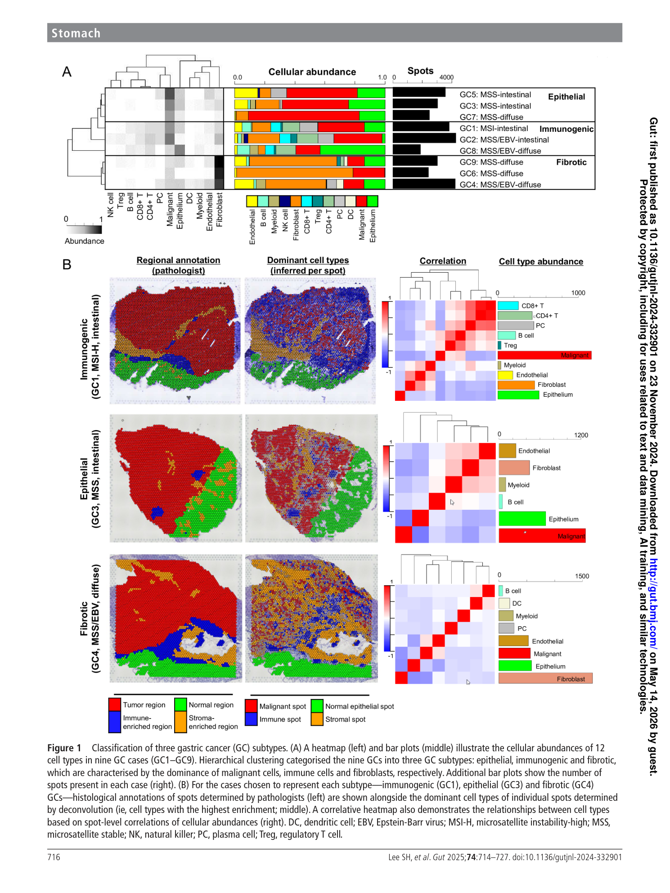
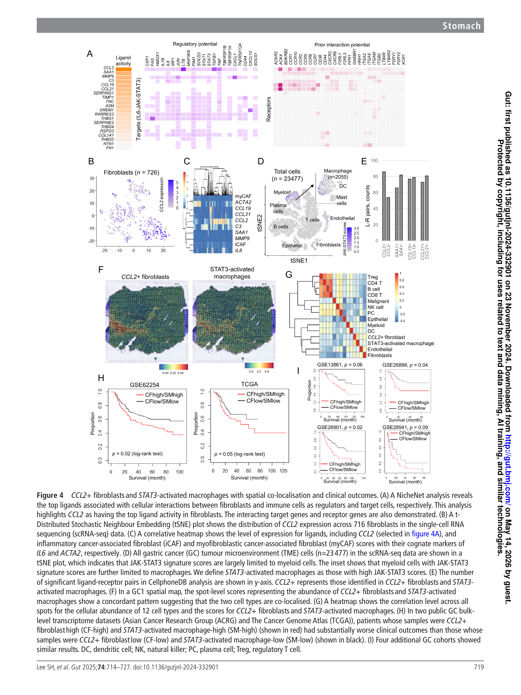
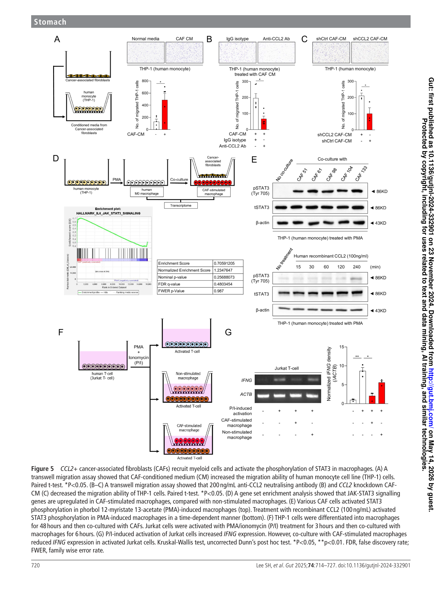
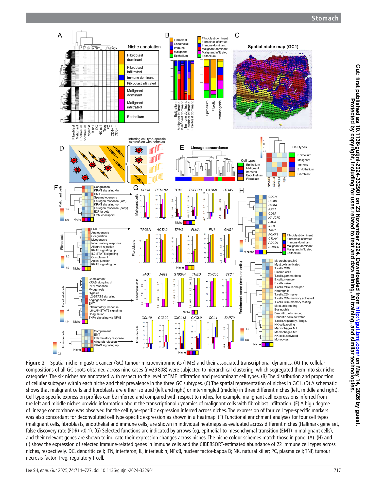
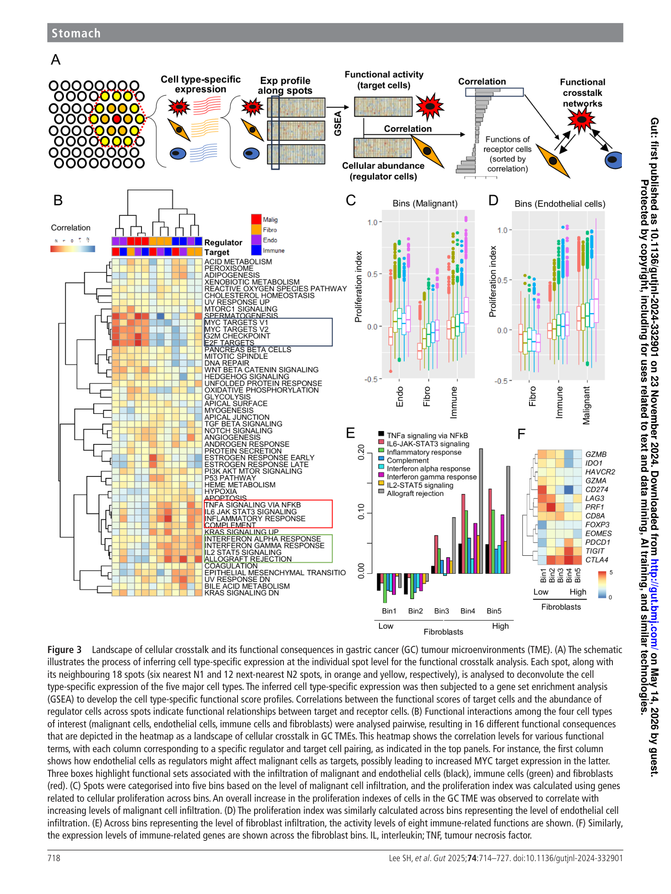
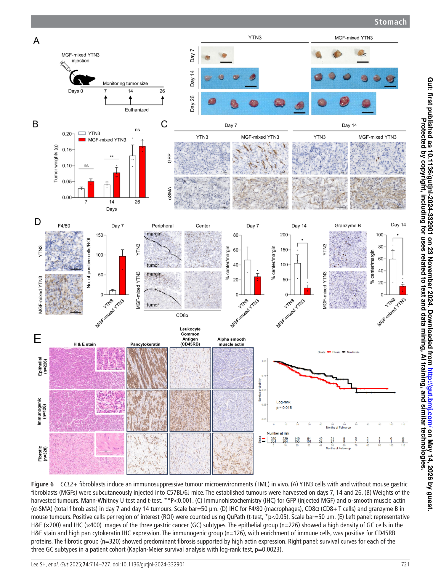
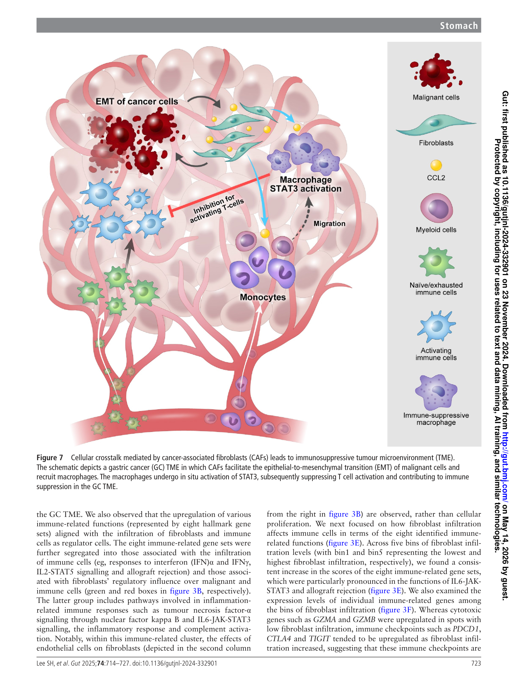

# Spatial dissection of tumour microenvironments in gastric cancers reveals the immunosuppressive crosstalk between CCL2+ fibroblasts and STAT3-activated macrophages

<!-- wechat-style-reviewed: 2026-08-05 -->

同样是胃癌，有些肿瘤里免疫细胞能够进入恶性上皮周围；另一些肿瘤却被致密的成纤维细胞包围，巨噬细胞聚集，真正执行杀伤的 T 细胞很少。病理上可以看到这种差别，但很难回答：究竟是哪类细胞在组织这种“免疫冷”环境？

过去的单细胞测序能把成纤维细胞、巨噬细胞和 T 细胞拆开，却会丢掉它们原本在组织里的位置。传统病理保留了位置，又很难系统追踪细胞之间的信号传递。

这项研究把 9 例原发胃癌的 29,808 个空间转录组 spots，与单细胞数据、公共队列、体外扰动、小鼠模型和 675 例组织芯片连接起来。

作者给出的核心答案是：在纤维化型胃癌中，一群表达 CCL2 的成纤维细胞可能通过招募髓系细胞、激活巨噬细胞 STAT3，进一步压低 T 细胞功能。成纤维细胞在这里不只是“搭支架”，而是在组织免疫抑制。

## 01｜为什么不能只问“间质多不多”

许多研究已经知道，胃癌中的 cancer-associated fibroblast（CAF，癌相关成纤维细胞）与差预后和免疫治疗抵抗有关。但“CAF 多”仍然只是一个组织学现象。

要把它变成可验证的机制，至少要回答三个问题：这些 CAF 位于什么空间生态位？它们邻近哪类免疫细胞？从 CAF 到免疫细胞，究竟是哪条信号在起作用？

作者因此没有先从某个候选分子出发，而是先画出胃癌的空间细胞组成，再从局部邻域中反推最值得验证的细胞对。

## 02｜这项研究到底做了多大规模

发现队列并不大：单中心 9 例手术切除的原发胃癌，而且 9 人均为男性；每张切片包含 1,882–4,274 个 spots，合计 29,808 个。作者用既往胃癌单细胞数据进行去卷积，估计每个 spot 中 12 类细胞的组成。

机制收敛阶段使用了 23,477 个肿瘤微环境单细胞，其中包括 726 个 fibroblasts。验证则分成四层：ACRG、TCGA 和四个 GEO 队列；CAF、THP-1、Jurkat 与人 PBMC 功能实验；小鼠同系移植模型；以及 675 例胃癌组织芯片。

这套设计的价值不在于某一个队列特别大，而在于同一条假说依次经过空间定位、单细胞状态、外部预后、分子扰动和组织验证。

## 03｜胃癌能被拆成哪三种空间生态

作者先按细胞组成把 9 例胃癌分为 epithelial、immunogenic 和 fibrotic 三类。Fibrotic GC 以 fibroblast 浸润为主，T cells 和 plasma cells 相对更少；它不是传统 Lauren 分型的简单替代，而是一种空间细胞组成分型。

## 04｜成纤维细胞丰富的局部区域发生了什么

进一步加入相邻 spot 信息后，29,808 个 spots 被组织成六类 spatial niches。最关键的是 fibroblast-infiltrated niche：这里不仅有更多基质细胞，Treg 中的 PDCD1、CTLA4 等 exhaustion markers 也升高，髓系细胞尤其 macrophages 更丰富。

换句话说，纤维化并不是免疫抑制旁边的背景现象。它与免疫检查点上调、细胞毒基因下降和髓系细胞聚集出现在同一个空间语境中。

## 05｜哪一对细胞把空间状态与患者结局连起来

作者把每个 spot 及其周围 18 个 spots 看作一个局部环境，再分析“某类细胞增多”与“邻近细胞功能程序改变”之间的关系。随着 fibroblast infiltration 增加，immune-cell IL6–JAK–STAT3、炎症反应和 immune checkpoint 程序同步增强。

随后，NicheNet 从 fibroblast ligands 中寻找最能解释免疫细胞靶基因变化的分子，CCL2 排在首位。单细胞数据又把对象进一步缩小：CCL2 主要集中在一个 fibroblast cluster，而高 JAK–STAT3 score 主要集中在 macrophages。

作者最终定义了 251 个 STAT3-activated macrophages，并与其余 1,804 个 macrophages 比较。空间 signature、RNA-ISH 和 multiplex IHC 均支持 CCL2+ fibroblasts 与 pSTAT3+ macrophages 邻近出现。

在 ACRG 和 TCGA 中，两个 signature 同高或同低的病例分别为 252/300（84%）和 338/386（87.6%）。主图只比较同高与同低，双高组总体生存更差，log-rank P 分别为 0.02 和 0.05；四个 GEO 队列的 P 为 0.06、0.04、0.02、0.09。

补充图 S10 换了比较对象：双高组对“其余全部患者”。ACRG 为 126 对 174（P = 0.02），TCGA 为 169 对 217（P = 0.08）；四个 GEO 队列依次为 25 对 40（P = 0.08）、36 对 57（P = 0.03）、44 对 65（P = 0.01）、16 对 24（P = 0.02）。比较口径变化后 TCGA 不再显著，因此不能把两套生存图当成完全相同的复现。

## 06｜空间相关怎样走到功能实验

空间共定位仍然不能证明因果。作者接着测试 CCL2 是否真的能招募髓系细胞并改变免疫功能。

CAF-conditioned medium 可增强 THP-1 单核细胞迁移；加入 200 ng/mL CCL2 中和抗体，或敲低 CAF 中的 CCL2，迁移均下降。CAF 共培养和 100 ng/mL recombinant CCL2 都能提高 macrophage STAT3 phosphorylation。转录组的 JAK–STAT3 GSEA 虽然方向为正，但并不显著（NES = 1.2348，nominal P = 0.2569，FDR = 0.4803）；真正补强这一步的是 pSTAT3 western blot，而不是 GSEA 本身。

更关键的是下游 T 细胞读出。经过 CAF 刺激的 macrophages 会降低激活 Jurkat T cells 的 IFNG 表达；在人 PBMC 分化得到的 macrophages 和 cytotoxic T cells 中，作者也观察到相同方向的结果。

小鼠模型提供了组织层面的补充证据。YTN3 胃癌细胞与 mouse gastric fibroblasts 混合接种后，第 14 天肿瘤更大，macrophages 增多，而肿瘤中心的 CD8+ T cells 和 granzyme B 阳性细胞减少。

## 07｜这项研究真正改变了哪一步

这篇论文把“纤维化胃癌免疫较差”推进成了一条可以逐步检验的候选路径：CCL2+ fibroblast → myeloid recruitment → macrophage STAT3 activation → T-cell suppression。现有扰动把 CCL2 与迁移、CAF/CCL2 与 pSTAT3、CAF-stimulated macrophage 与 T-cell suppression 分别连接起来，但没有用同一个 rescue 实验闭合整条链。

对临床研究而言，更现实的近期价值是定义候选分层变量。Fibrotic subtype、CCL2+ fibroblast 和 pSTAT3+ macrophage 可以在组织中检测，也可以形成外部队列 signature；但 158 例标志物子队列的 disease-free survival 比较并不显著（分别 P = 0.27 和 0.45），所以还不能据此给患者分组或选药。

它也为联合治疗提供了明确假说：与其把 CCL2/CCR2 或 STAT3 阻断当作所有胃癌的单药策略，更合理的试验对象可能是 fibrotic subtype，并与免疫检查点抑制剂联合。不过，这一步仍未在患者中得到验证。

## 08｜这些结果仍需要冷静看待

首先，空间发现队列只有单中心 9 例，而且 9 人均为男性。它适合建立机制假说，不能单独证明三类空间亚型在女性、其他中心或不同人群中稳定存在。

其次，Visium 一个 spot 包含多个细胞。去卷积可以估计细胞组成，却不足以精确解析 CD8 T-cell exhaustion 或 Treg 的全部状态。公开队列中的双 signature 也只是 bulk 推断，不等于两类细胞在组织中直接相邻。

第三，体外实验和小鼠模型支持 CCL2–STAT3 候选链条，但中和/敲低 CCL2 只验证了迁移，没有做 CCL2–STAT3 rescue；小鼠也没有进行轴上干预，且补充材料仍未报告每组动物数。人类胃癌原位环境中还有 IL6、CSF1、缺氧和肿瘤细胞因子等多种 macrophage STAT3 来源，论文没有证明阻断 CCL2、CCR2 或 STAT3 能改善免疫治疗结局。

最后，675 例组织芯片的分组数和生存 P 值在正文、图注与补充表之间存在不一致；158 例标志物子队列只证明两类阳性细胞相关（P < 0.001），没有得到显著 DFS 差异。结论方向可以用于提出假说，但不能当作稳定预后标志。

## 09｜对我们的研究有什么可借鉴

最值得复用的是“空间发现—细胞对收敛—分子扰动—大队列验证”的证据路线。空间组学不应停在聚类图，而应继续回答：谁是 regulator，谁是 target，哪条 ligand–receptor 或 signaling axis 能被实验打断。

如果迁移到胃癌癌前病变或免疫预防队列，可以同时记录 CAF 状态、髓系激活和 T-cell exclusion，而不是只使用一个 stromal score。候选轴进入转化研究前，至少需要一个分子扰动、一个免疫功能读出和一个独立组织队列。

---

## 技术附录

以下内容保留论文基本信息、完整主图说明、Results/Methods 证据、复现参数和覆盖审计。

## 基本信息

- 期刊: Gut
- 年份: 2025，online first 2024-11-23
- 卷页: 74:714-727
- DOI: 10.1136/gutjnl-2024-332901
- 题名: Spatial dissection of tumour microenvironments in gastric cancers reveals the immunosuppressive crosstalk between CCL2+ fibroblasts and STAT3-activated macrophages
- 第一作者: Sung Hak Lee, Dagyeong Lee, Junyong Choi 等
- 通讯作者: Tae-Min Kim, Hoon Hur
- 研究领域: 胃癌、空间转录组、肿瘤微环境、CAF、巨噬细胞、免疫抑制、JAK-STAT3
- 关键词: gastric cancer, Visium, spatial transcriptomics, tumour microenvironment, CCL2, fibroblast, CAF, STAT3-activated macrophage, JAK-STAT3, fibrotic subtype
- 数据来源：本研究空间测序数据为 GEO `GSE251950`；TCGA、ACRG 与其余 GEO accession 见“可重复性资源和迁移注意点”，原文存在编号冲突。
- 代码来源：论文及补充材料未报告独立代码仓库；仅报告 Seurat、SpaceRanger、NicheNet、CellPhoneDB、CIBERSORT/GSVA 等工具与部分版本/参数。
- 本地 PDF: `pdfs/processed/ccl2-fibroblast-stat3-macrophage-gastric-cancer.pdf`
- PDF 解析质量:
  - 使用 `scripts/build_pdf_llm_pack.py` 生成全文句子 ID。
  - 解析结果: 14 页，544 个句子；脚本标注 Results 39 句，Methods 163 句。
  - 重要纠偏: 由于 BMJ/Gut 排版把主文 Results 穿插在第 9-12 页并夹杂图注，脚本把大量真实 Results 句子误分到 `methods` 或 `supplementary`。本笔记按原文版面和小标题重新整理，纳入 `P002.S0017-P002.S0033`, `P009.S0001-P012.S0027` 等真实结果段。
  - 低置信内容: 图注、页眉页脚和版权提示混入正文；`P010.S0014-P011.S0001` 跨页断句；`P011.S0043-P012.S0001` western blot 句子跨页断裂；`P012.S0020-P012.S0021` 临床病理句跨页断裂；Fig. 6 图注和正文中 TMA 分组数、log-rank p 值存在轻微不一致。
  - 补充材料纠偏（2026-08-05）：此前 BMJ 直链受 Cloudflare 403 拦截；本次通过 [PMC12013559](https://pmc.ncbi.nlm.nih.gov/articles/PMC12013559/) 与 [Europe PMC supplementary archive](https://www.ebi.ac.uk/europepmc/webservices/rest/PMC12013559/supplementaryFiles) 获取全部 5 个文件。Supplementary Methods 为 10 页/216 个 ID；第 1–9 页 `s003:P001.S0001–P009.S0002` 共 153/153 个抽取 ID 已分类，其中包含实质方法、标题/断片和 1 个页码噪音。Supplementary Notes 为 5 页/63 个 ID，其中 8 则 notes `s004:P001.S0001–P004.S0003` 为 49/49。Supplementary Figures（27 页）、Tables（16 页）和 graphical abstract（PPTX）均已确认存在。
  - 补充材料解析边界：Supplementary Methods/Notes 的单栏段落整体可读，但抽取器会把相邻小标题和跨页句拼接；Supplementary Tables 的宽表与 425-gene signatures 在文本抽取中严重错列；Supplementary Figures 含大量坐标轴文本。本笔记只引用可与正文、图注或表题交叉核对的数字，不用错列单元格补写结果。
- 图像截取说明: 主图按整页渲染保存，避免漏 panel；后续需要局部 panel 时可再裁剪。
- LLM pack: `tmp/ccl2-fibroblast-stat3-macrophage-llm-pack.md`
- Manifest: `tmp/ccl2-fibroblast-stat3-macrophage-manifest.json`
- 补充材料 packs：`tmp/ccl2-supp-methods-llm-pack.md`、`tmp/ccl2-supp-notes-llm-pack.md`、`tmp/ccl2-supp-tables-llm-pack.md`、`tmp/ccl2-supp-figures-llm-pack.md`；补充 Methods PDF SHA-256 为 `f4edba8f65bb522f716684711ffe377037fd7f0024cc4f313d1672baf7822a1d`。

---

## 本论文主图

| 原文图表 | 原文图题/核心信息 | 是否截取 | 图像文件 | 放置位置 |
|---|---|---|---|---|
| Fig. 1 | 9 例胃癌按空间细胞组成分为 epithelial、immunogenic、fibrotic 三类 | 是 | `assets/gastric-cancer/2025-ccl2-fibroblast-stat3-macrophage/page03.png` | [Spatial cellular maps of three GC subtypes](#spatial-cellular-maps-of-three-gc-subtypes) |
| Fig. 2 | 29,808 个 Visium spots 聚类为六类 spatial niches，并推断 niche 相关转录动态 | 是 | `page04.png` | [Spatially resolved cellular and transcriptional dynamics with respect to GC TME architecture](#spatially-resolved-cellular-and-transcriptional-dynamics-with-respect-to-gc-tme-architecture) |
| Fig. 3 | 构建 regulator-target cell crosstalk landscape，突出 fibroblast infiltration 与 IL6-JAK-STAT3/免疫检查点上调 | 是 | `page05.png` | [Landscape of intercellular crosstalk and its functional consequences](#landscape-of-intercellular-crosstalk-and-its-functional-consequences) |
| Fig. 4 | NicheNet、scRNA-seq、CellphoneDB、空间签名和外部队列支持 CCL2+ fibroblast 与 STAT3-activated macrophage 轴 | 是 | `page06.png` | [CCL2+ cancer-associated fibroblasts regulate JAK-STAT3 signalling in macrophages](#ccl2-cancer-associated-fibroblasts-regulate-jak-stat3-signalling-in-macrophages) |
| Fig. 5 | 体外验证 CAF/CCL2 促进单核细胞迁移、激活巨噬细胞 STAT3，并抑制 T 细胞 IFNG | 是 | `page07.png` | [CCL2+ CAFs recruit myeloid cells via STAT3-activated macrophages](#ccl2-cafs-recruit-myeloid-cells-via-stat3-activated-macrophages) |
| Fig. 6 | 小鼠同系移植和 675 例 TMA 验证 fibrotic GC 的巨噬细胞富集、CD8/GrzB 降低和差预后 | 是 | `page08.png` | [CCL2+ fibroblast-mixed syngeneic mouse tumours recapitulate fibrotic GC](#ccl2-fibroblast-mixed-syngeneic-mouse-tumours-recapitulate-fibrotic-gc) |
| Fig. 7 | 总结模型: CAF 促 EMT，招募并激活 macrophage STAT3，导致 T cell suppression | 是 | `page10.png` | [作者结论与证据强度](#作者结论与证据强度) |

## 补充图表索引

| 补充材料 | 内容与本笔记用途 | 来源范围与边界 |
|---|---|---|
| Fig. S1–S4 | 其余病例的病理/去卷积空间图、GC1 细胞地图、各 niche 细胞丰度和 8 例 niche 分布。 | `s001:P001.S0001–P012.S0001`；S1–S2 占前 10 页，坐标轴和大图文本不能稳定逐格抽取。 |
| Fig. S5–S7 | 各 subtype/niche 的 cell-type GSEA、免疫 marker 和 8 类 fibroblast→immune NicheNet 结果。 | `s001:P013.S0001–P015.S0004`；富集热图用于支持方向，不替代 panel-level FDR。 |
| Fig. S8–S10 | 8 例 CF/SM 空间分布、9 例邻近组织原位验证和 6 个公共队列生存图。 | `s001:P016.S0001–P018.S0015`；S10 的 comparator 是双高对其余患者，与主 Fig. 4 不同。 |
| Fig. S11–S12 | 人源 CCL2/迁移/pSTAT3/CD8 增殖，以及 MGF 建立、Ccl2 和小鼠肿瘤生长。 | `s001:P019.S0001–P020.S0009`；pSTAT3 与 CFSE 主要是定性/半定量 panel，动物每组数未报告。 |
| Fig. S13–S18 | 36-variable 邻域、spot 数稳健性、CCL2+ CAF、macrophage states、158 例 TMA 和三种去卷积方法比较。 | `s001:P021.S0001–P027.S0003`；S17 的 DFS 与分组数字纳入冲突审计。 |
| Tables S1–S4 | 9 例临床特征、测序 QC、两套 425-gene signatures、675 例 TMA 临床病理比较。 | `s002:P001.S0001–P016.S0016`；宽表抽取错列，只有可与表题、行列标题交叉核对的数字进入正文。 |
| Graphical abstract | 研究设计与验证路径概览。 | `s005` PPTX；不是独立 Source Data，其中把 `GSE13861` 写成 `GSE13826`，只作为排版冲突保留。 |

## 生物学故事前情

胃癌的肿瘤微环境不是一团平均化的“免疫浸润”。同一块组织里，恶性上皮、成纤维细胞、内皮细胞、髓系细胞、T 细胞和 B/plasma cell 往往按组织结构分区出现。单细胞 RNA-seq 可以把细胞类型拆开，但会丢掉细胞在组织里的位置；传统病理能看到位置，却难以系统量化不同细胞之间的转录互作。

这篇文章的核心推进，是把胃癌 TME 从“有哪些细胞”推到“哪些细胞在什么空间生态位里互相调控”。作者先用 Visium 空间转录组在 9 例原发胃癌中建立细胞组成地图，再用 spot-level deconvolution 和邻近 spot 结构推断六类 spatial niches。真正的主线是 fibrotic GC: 这一类胃癌成纤维细胞多、T/plasma cell 少，空间上缺乏免疫细胞对 malignant-fibroblast 区域的分隔。

读这篇文章要抓住一个从现象到机制的链条：

1. 空间细胞组成把胃癌分成 epithelial、immunogenic、fibrotic 三类。
2. 六类 niches 揭示 fibroblast-infiltrated 区域是 EMT、血管生成、炎症和免疫抑制信号集中的区域。
3. 细胞互作模型把 fibroblast infiltration 指向 immune-cell IL6-JAK-STAT3 和 immune checkpoint 上调。
4. NicheNet 和 scRNA-seq 把关键配体/细胞对收敛到 CCL2+ fibroblast 和 STAT3-activated macrophage。
5. 体外迁移、pSTAT3、T cell IFNG 抑制，小鼠模型和 TMA 队列共同把这条轴从计算推断推向功能验证。

## 重要缩写表

| 缩写 | 中文含义 | 本文语境中的具体指代 | 阅读时注意 |
|---|---|---|---|
| GC | gastric cancer，胃癌 | 9 例 Visium 原发胃癌、公共胃癌转录组队列和 675 例 TMA 队列 | 不是单一分子亚型，包含 intestinal/diffuse、MSI/EBV 等异质背景 |
| TME | tumour microenvironment，肿瘤微环境 | 恶性细胞、CAF/ fibroblast、内皮、髓系、T/B/NK/plasma cell 等组成的空间生态 | 本文强调空间关系和功能互作，不只是细胞比例 |
| Visium | 10x Genomics 空间转录组平台 | 9 例 FFPE/组织切片上每个 spot 的表达和空间坐标 | spot 不是单细胞，需要 deconvolution |
| spot | 空间转录组采样点 | 每例 1,882-4,274 个 spot，9 例合计 29,808 个 spot | 每个 spot 可混合多种细胞 |
| CAF | cancer-associated fibroblast，癌相关成纤维细胞 | 本文主线中的 fibroblast/CAF，尤其 CCL2+ fibroblast | 文中有时用 fibroblast，有时用 CAF；功能验证主要用 CAF 细胞 |
| CCL2 | C-C motif chemokine ligand 2 | fibroblast 表达的关键 chemokine，NicheNet 指向 IL6-JAK-STAT3 免疫轴 | CCL2 阻断临床单药历史并不理想，本文更支持 subtype/联合策略假说 |
| STAT3-activated macrophage | STAT3 激活巨噬细胞 | JAK-STAT3 signature 高的 macrophage；scRNA-seq 中定义为 251 个 high-score macrophages | 是转录状态定义，不等于所有 pSTAT3 蛋白阳性巨噬细胞 |
| CF-high/SM-high | CCL2+ fibroblast high / STAT3-activated macrophage high | 外部 bulk 队列中两个 signature score 同时高的病例 | 依赖 signature deconvolution，不是直接空间检测 |
| iCAF/myCAF | inflammatory/myofibroblastic CAF | Fig. 4C 中用于解释 CCL2+ fibroblast 与既有 CAF 程序关系 | CCL2+ fibroblast 不应简单等同于 iCAF |
| NicheNet | 配体-靶基因推断框架 | 用 fibroblast ligand 解释 immune-cell IL6-JAK-STAT3 target genes | 预测调控关系，不是物理结合实验 |
| CellphoneDB | ligand-receptor 互作工具 | 比较 CCL2+ fibroblast 与 STAT3-activated macrophage 的 ligand-receptor 对数 | 依赖表达共现和数据库 |
| GSEA | gene set enrichment analysis | 对 cell type-specific inferred expression 做 Hallmark gene set 富集 | 输出是功能程序富集，不直接等于蛋白活性 |
| TMA | tissue microarray，组织芯片 | 675 例胃癌大队列 IHC 验证三类 subtype 和生存差异 | 主要是 histology/IHC 层面的验证，不是空间转录组 |
| PMA/ionomycin | T 细胞激活刺激 | 激活 Jurkat T cells，用 IFNG 作为激活读出 | Jurkat 是模型细胞，不等价于原代肿瘤 T 细胞 |
| GrzB | granzyme B | 小鼠肿瘤 IHC 中免疫激活/细胞毒读出 | 减少支持免疫抑制，但不是完整抗肿瘤免疫功能测定 |

## 论文详细解读

### 研究问题与科学背景

作者要解决的问题不是“胃癌 TME 中有没有 CAF 或 macrophage”，而是这些细胞如何按空间生态位组织，并造成什么功能后果。背景中，作者指出胃癌治疗虽然有 HER2/trastuzumab 这样的分子靶向范式，但整体转化收益有限；胃癌异质性很大程度来自转录和细胞组成异质性（`P001.S0033-P001.S0036`）。既往 scRNA-seq 已能解析细胞亚群，作者自己的前期工作还做过 diffuse-type GC 的 depth-aware scRNA-seq，但单细胞数据不能直接回答局部空间互作（`P002.S0007-P002.S0009`）。

因此本文采用 Visium 空间转录组分析 9 例胃癌，目标是把组织结构、细胞组成、细胞互作和功能后果放在同一张图里（`P002.S0010-P002.S0014`）。摘要中作者直接给出研究目标：将胃癌生态系统的空间组织翻译成 malignant、stromal 和 immune cells 的 functional interaction landscape（`P001.S0004-P001.S0006`）。

### 研究设计与数据结构

主数据是 9 例手术切除原发胃癌的 Visium 空间转录组。每个组织切片获得 1,882-4,274 个 spots，中位数 3,491；总计 29,808 个 spots 用于后续 niche 聚类（`P002.S0017-P002.S0019`, `P004.S0006`, `P009.S0002`）。

细胞注释使用作者既往 5 例胃癌 scRNA-seq 资源做 spot-level deconvolution。原始 11 类细胞中，上皮细胞被进一步拆成 malignant epithelium 和 normal epithelium，因此每个 spot 最终估计 12 类细胞丰度（`P002.S0020-P002.S0021`）。单细胞层面的补充验证还使用了 23,477 个 TME cells，其中包括 726 个 fibroblasts，用于定位 CCL2+ fibroblast 和 JAK-STAT3 high macrophage（`P006.S0009-P006.S0013`, `P011.S0009-P011.S0013`）。

验证数据包括四层。第一，公共 bulk-level RNA-seq/microarray 队列，包括 ACRG、TCGA 和四个 GEO 队列；但主 Results、Supplementary Methods 与数据可用性列出的 GEO 编号彼此不一致，不能静默合并，详见“原文冲突”（`P011.S0024-P011.S0029`；`s003:P004.S0003–P004.S0009`；`P014.S0001-P014.S0004`）。第二，体外 CAF/THP-1/Jurkat/PBMC 实验验证 CCL2 促进迁移、STAT3 磷酸化和 T 细胞 IFNG 抑制（`P011.S0035-P012.S0005`）。第三，YTN3 小鼠胃癌细胞与 GFP+ mouse gastric fibroblast 混合接种的同系肿瘤模型（`P012.S0007-P012.S0016`）。第四，675 例胃癌 TMA 用 H&E/IHC 和部分 RNA-ISH/multiplex IHC 验证 fibrotic subtype、预后和 CCL2+ fibroblast/pSTAT3+ macrophage 共定位（`P012.S0017-P012.S0027`）。

### 方法速览与分析框架

本文的分析框架可以拆成三步。

第一步是“细胞组成分型”。作者对每个 spot 做 12 类细胞丰度 deconvolution，再按每例组织的细胞组成聚类，将 9 例 GC 分为 epithelial、immunogenic、fibrotic 三类（`P002.S0021-P002.S0027`, `P003.S0005-P003.S0011`）。这个分型不是传统 Lauren 或 TCGA 分型，而是空间细胞组成分型。

第二步是“空间 niche 和 cell type-specific expression”。作者把 29,808 个 spots 按本 spot 和邻近 spot 的细胞丰度做层次聚类，得到六类 niches：epithelial-dominant、malignant-dominant、fibroblast-dominant、malignant-infiltrated、fibroblast-infiltrated、immune-dominant（`P009.S0001-P009.S0016`）。再对五类主要细胞推断 cell type-specific expression，并在不同 niches 之间做 GSEA，找出 malignant cells、fibroblasts、endothelial cells 和 immune cells 的 niche-dependent transcriptional dynamics（`P009.S0017-P009.S0025`）。

第三步是“互作和机制收敛”。作者把每个 spot 及其 18 个邻近 spots 作为局部环境，用 regulator cell abundance 与 target cell functional score 的相关性构建 4 类细胞之间 16 种 regulator-target 关系（`P005.S0005-P005.S0013`, `P009.S0036-P010.S0014`）。随后用 NicheNet 在 fibroblast-to-immune 的 IL6-JAK-STAT3 轴上寻找 ligand，CCL2 排到最前；再用 scRNA-seq、CellphoneDB、spatial signature、RNA-ISH/IHC、生存队列和功能实验逐层验证（`P011.S0003-P012.S0027`）。

### 原文结果完整梳理

#### Spatial cellular maps of three GC subtypes

中文图注（基于原文图注）：Fig. 1A 用 heatmap 和 bar plots 展示 9 例 GC 中 12 类细胞的丰度，并通过层次聚类将样本分成 epithelial、immunogenic、fibrotic 三类。Fig. 1B 选取 GC1、GC3、GC4 分别代表 immunogenic、epithelial、fibrotic GC，左侧为病理区域注释，中间为每个 spot 中占优势的 deconvoluted cell type，右侧为 cell-type abundance 的 spot-level correlation heatmap。缩写包括 DC、EBV、MSI-H、MSS、NK、PC 和 Treg（`P003.S0005-P003.S0011`）。

作者首先用 Visium 处理 9 例原发胃癌，获得每例 1,882-4,274 个 spots，中位数 3,491（`P002.S0017-P002.S0019`）。基于既往 scRNA-seq 参考进行 deconvolution 后，作者对 12 类细胞丰度进行聚类，得到三类胃癌空间生态：epithelial、immunogenic、fibrotic（`P002.S0020-P002.S0022`）。

这三类与组织学有一定对应关系，但不是完全等同于 Lauren 分型。intestinal-type GC 被分到 immunogenic 或 epithelial；所有 fibrotic GC 都是 diffuse-type（`P002.S0023`）。Epithelial GC 主要由 malignant 或 normal epithelial cells 组成（`P002.S0024`）。Immunogenic GC 包括 MSI-positive 或 EBV-positive 背景，CD4+ 和 CD8+ T cells 是主要免疫成分（`P002.S0025`）。Diffuse-type 中 GC4、GC6、GC9 被注释为 fibroblast 高浸润的 fibrotic GC（`P002.S0026`）。

这里的第一层结论是：空间细胞组成可以把胃癌拆成三个可解释的生态类型，尤其 fibrotic GC 不是简单“间质多”，而是一个 fibroblast-enriched、T cell/plasma cell 相对少的 TME 类型（`P002.S0027-P002.S0033`）。

#### Spatially resolved cellular and transcriptional dynamics with respect to GC TME architecture

中文图注（基于原文图注）：Fig. 2A 将 9 例 GC 共 29,808 个 spots 按细胞组成和邻近结构聚类为六类 niches，并按 TME infiltration 和优势细胞类型命名。Fig. 2B 展示六类 niches 的细胞组成及其在三类 GC subtype 中的分布。Fig. 2C 展示 GC1 的 niche spatial map。Fig. 2D 用示意图说明 malignant cells 和 fibroblasts 在 isolated 或 intermingled niches 中如何用于推断 cell type-specific expression。Fig. 2E 验证 inferred expression 与 lineage markers 一致。Fig. 2F-G 展示四类主要细胞在不同 niches 中的 Hallmark GSEA 富集和相关基因表达，FDR < 0.1。Fig. 2H-I 展示 immune-related genes 和 CIBERSORT 估计的 22 类免疫细胞丰度（`P004.S0005-P004.S0018`）。

作者将每个 spot 及其区域邻接信息纳入层次聚类，得到六类 spatial niches（`P009.S0001-P009.S0003`）。上皮或恶性上皮为主的区域分别称为 epithelial-dominant 和 malignant-dominant niches；成纤维细胞为主的是 fibroblast-dominant niche；其余三个是 malignant-infiltrated、fibroblast-infiltrated 和 immune-dominant niches（`P009.S0004-P009.S0007`）。

空间上，GC1 中 malignant-dominant 和 fibroblast-dominant niches 各自局限，malignant-infiltrated 和 fibroblast-infiltrated niches 像过渡区，被 immune-dominant niches 围绕；epithelial-dominant niches 则像正常上皮岛状分布（`P009.S0009-P009.S0012`）。作者据此提出，胃癌空间架构主要由 malignant cells 与 fibroblasts 的主导关系塑造，immune cells 在 immunogenic/epithelial GC 中形成分界；fibrotic GC 的免疫细胞耗竭使这种分界减弱（`P009.S0013-P009.S0016`）。

为了看同一细胞类型在不同空间语境中的表达变化，作者对 malignant cells、normal epithelium、fibroblasts、endothelial cells 和 aggregated immune cells 做 cell type-specific expression 推断（`P009.S0017-P009.S0021`）。GSEA 显示，malignant-dominant niches 中 malignant cells 上调 coagulation；fibroblast-infiltrated niches 中 malignant cells 上调 EMT，并且 angiogenesis、allograft rejection 等程序在 malignant cells、fibroblasts、endothelial cells 和 immune cells 中更突出（`P009.S0022-P009.S0025`）。

最关键的是免疫读出。Fibroblast-infiltrated niches 中 immune exhaustion markers 包括 IDO1、CTLA4、PDCD1、EOMES 上调；进一步按免疫细胞类型 deconvolution 后，CTLA4 和 PDCD1 等 exhaustion markers 在 Treg 中上调（`P009.S0026-P009.S0028`）。同时 22 类免疫细胞 abundance 分析显示，fibroblast-infiltrated niches 中 B cells 和 myeloid cells，尤其 DC 和 macrophages 更丰富（`P009.S0029-P009.S0031`）。这为后文 CCL2+ fibroblast 和 macrophage 轴埋下伏笔。

#### Landscape of intercellular crosstalk and its functional consequences

中文图注（基于原文图注）：Fig. 3A 展示 functional crosstalk 分析框架：每个 spot 加 18 个邻近 spots 用于推断五类主要细胞的 cell type-specific expression，再做 GSEA 生成 functional scores，最后用 regulator cell abundance 和 target cell functional scores 的相关性推断功能互作。Fig. 3B 展示 malignant、endothelial、immune、fibroblast 四类细胞两两互作形成的 16 类 functional consequences。Fig. 3C-D 将 spots 按 malignant 或 endothelial infiltration 分成五个 bins，计算 proliferation index。Fig. 3E-F 将 spots 按 fibroblast infiltration 分成五个 bins，展示八类 immune-related functions 和相关免疫基因表达（`P005.S0005-P005.S0019`）。

作者指出，niche 分析能显示某种 TME infiltration 与功能状态相关，但难以判断到底是哪类细胞作为 regulator 造成 target cell 的功能变化。因此他们建立了 regulator-target 细胞互作框架（`P009.S0036-P009.S0039`）。

Fig. 3B 中第一组信号是 proliferation。G2M checkpoint、MYC targets、E2F targets 等细胞增殖相关基因在 malignant 和 endothelial cells infiltration 作为 regulator 时上调（`P009.S0040-P009.S0044`）。这提示 TME 对 malignant/endothelial infiltration 的适应可能表现为细胞增殖增强（`P009.S0045-P010.S0001`）。

第二组信号是 immune-related functions。八类 immune-related Hallmark gene sets 随 fibroblast 和 immune cell infiltration 上调；其中由 fibroblast regulatory influence 指向 malignant/immune cells 的通路包括 TNF-alpha via NF-kappaB、IL6-JAK-STAT3、inflammatory response 和 complement（`P010.S0002-P010.S0005`）。作者随后专门按 fibroblast infiltration 五分位比较 immune functions，发现八类免疫相关 gene sets 均随 fibroblast infiltration 增加，IL6-JAK-STAT3 和 allograft rejection 尤其明显（`P010.S0010-P010.S0012`）。

基因层面也支持免疫状态改变。低 fibroblast infiltration spots 中 GZMA、GZMB 等 cytotoxic genes 更高；随着 fibroblast infiltration 增加，PDCD1、CTLA4、TIGIT 等 immune checkpoints 上升（`P010.S0013-P011.S0001`）。作者将这一结果解释为 fibroblasts 通过激活 target cells 中 JAK-STAT3 相关信号，推动免疫细胞 dysfunction 和免疫抑制 TME（`P011.S0002`）。

#### CCL2+ cancer-associated fibroblasts regulate JAK-STAT3 signalling in macrophages

中文图注（基于原文图注）：Fig. 4A 用 NicheNet 分析 fibroblast-to-immune crosstalk，CCL2 在 fibroblast ligands 中具有最高 ligand activity，并连接到 target/receptor genes。Fig. 4B 图注写 716 个 scRNA-seq fibroblasts；主 Results、Supplementary Methods 和 Supplementary Note 7 均支持 726 个（143 个 CCL2+ 加 583 个 CCL2−），因此这里保留为原文内部冲突。Fig. 4C 比较 CCL2 与其他 ligand、iCAF score、myCAF score 及 IL6/ACTA2 markers 的关系。Fig. 4D 在 23,477 个 TME single cells 中显示 JAK-STAT3 signature 主要局限于 myeloid cells，进一步集中于 macrophages，并以 high JAK-STAT3 score 定义 STAT3-activated macrophages。Fig. 4E 比较 CCL2+ fibroblast/STAT3-activated macrophage 与对应阴性细胞间的 ligand-receptor pairs。Fig. 4F-G 展示两类 signature 在空间中的共定位和 spot-level correlation。Fig. 4H-I 展示 ACRG、TCGA 和四个 GEO 队列中 CF-high/SM-high 与差预后的关系（`P006.S0005-P006.S0020`；`s003:P003.S0010–P004.S0002`；`s004:P003.S0009–P003.S0011`）。

在 fibroblast 可能调节的免疫功能中，作者聚焦 IL6-JAK-STAT3，因为它与胃癌 TME 中促癌炎症反应相关（`P011.S0003`）。NicheNet 用 fibroblasts 中的 ligands 解释 immune cells 中的 target/receptor genes，结果 CCL2 成为最强 master regulator，连接到 LTB、SOCS1、SOCS3、STAT3、TGFB1 等 IL6-JAK-STAT3 相关 target genes，并具有最高 ligand activity（`P011.S0004-P011.S0008`）。

单细胞数据进一步收窄细胞对象。726 个 fibroblasts 中 CCL2 并非广泛表达，而是局限于一个 cluster（`P011.S0009`）。全 TME 23,477 个 single cells 中，高 JAK-STAT3 score 主要出现在 myeloid cells，尤其 macrophages；作者据此定义 251 个 STAT3-activated macrophages，并与其余 1,804 个 macrophages 区分（`P011.S0012-P011.S0013`）。

CellphoneDB 分析显示，在 CCL2、SAA1、CCL19、CCL21 等 top ligands 中，CCL2+ fibroblasts 与 STAT3-activated macrophages 之间的 interacting ligand-receptor gene pairs 比 CCL2-negative 对照更多（`P011.S0014`）。作者随后用 CIBERSORT signature matrix functions 分别得到 425 个 CCL2+ fibroblast signature genes 和 425 个 STAT3-activated macrophage signature genes，用于空间和 bulk 队列打分（`P011.S0015-P011.S0016`）。

空间层面，GC1 中 CCL2+ fibroblast signature 和 STAT3-activated macrophage signature 分布高度一致；跨 9 例所有 spots 的相关性热图也显示两者高度相关，并主要与 stromal cells 聚集（`P011.S0017-P011.S0020`）。作者还用 CCL2/COL1A1 dual RNA-ISH 和 pSTAT3/CD68 multiplex IHC 做了原位验证（`P011.S0021-P011.S0023`）。

临床层面，作者在 ACRG 和 TCGA 中发现大多数病例要么 CF-high/SM-high，要么 CF-low/SM-low，分别为 252/300（84%）和 338/386（87.6%），说明两个 signature scores 强相关（`P011.S0024-P011.S0026`）。主 Fig. 4 的生存分析只比较 CF-high/SM-high 与 CF-low/SM-low：ACRG p=0.02、TCGA p=0.05；四个 GEO 图标成 GSE13861、GSE26899、GSE26901、GSE28541，p 分别为 0.06、0.04、0.02、0.09（`P011.S0027-P011.S0029`；Fig. 4I）。Supplementary Fig. S10 则比较双高与其余全部患者，ACRG 126/174（p=0.02）、TCGA 169/217（p=0.08），四个 GEO 为 25/40（p=0.08）、36/57（p=0.03）、44/65（p=0.01）、16/24（p=0.02）（`s001:P018.S0001–P018.S0015`）。两套 comparator 不同，不能把显著性变化写成完全一致的重复。总体结果支持两类 signature 的相关和预后假说，但 bulk signature 仍不是直接空间检测（`P011.S0030`）。

#### CCL2+ CAFs recruit myeloid cells via STAT3-activated macrophages

中文图注（基于原文图注）：Fig. 5A 显示 CAF-conditioned medium 增强 THP-1 单核细胞迁移，paired t-test，P < 0.05。Fig. 5B-C 显示 200 ng/mL anti-CCL2 neutralising antibody 和 CCL2 knockdown CAF-CM 均降低 THP-1 迁移，paired t-test，P < 0.05。Fig. 5D 的 JAK–STAT3 GSEA 方向为正，但 nominal P = 0.2569、FDR = 0.4803，未达到显著。Fig. 5E 显示 CAF 或 100 ng/mL recombinant CCL2 诱导 PMA-differentiated macrophages 的 STAT3 phosphorylation。Fig. 5F-G 显示 CAF-stimulated macrophages 抑制 PMA/ionomycin 激活的 Jurkat T cells 中 IFNG 表达，Kruskal-Wallis test 加 uncorrected Dunn's post hoc test（`P007.S0005-P007.S0018`）。

为了把空间转录组推断推进到功能实验，作者首先发现多种 CAF 中 CCL2 转录水平高于 human immune 和 GC cell lines（`P011.S0035-P011.S0036`）。CAF-conditioned medium 显著增强 THP-1 迁移；anti-CCL2 中和抗体降低这种迁移；shRNA 敲低 CAF 中 CCL2 后，CAF-induced THP-1 migration 也下降；recombinant CCL2 则剂量依赖增强 THP-1 迁移（`P011.S0037-P011.S0040`）。

下一步是 macrophage STAT3。作者用 PMA 将 THP-1 分化为 macrophages，与 CAF 共培养后做转录分析；JAK–STAT3 GSEA 方向为正，但 ES = 0.7059、NES = 1.2348、nominal p = 0.2569、FDR = 0.4803、FWER = 0.987，并不显著。Western blot 则显示 CAF 共培养或 recombinant CCL2 处理后 macrophage STAT3 phosphorylation 增加（`P011.S0041-P012.S0001`；Fig. 5D–E）。这支持蛋白读出，但论文没有用 CCL2 neutralisation/knockdown rescue pSTAT3，因此不能把 CCL2→STAT3 写成已经闭环的单一因果路径。

最后是 T 细胞功能。PMA/ionomycin 激活 Jurkat T cells 会提高 IFNG；但与 CAF-stimulated macrophages 共培养后，IFNG 显著下降（`P012.S0002-P012.S0004`）。作者还在从人 PBMC 分化得到的 macrophages 和 cytotoxic T cells 中复现实验，支持 CAF-induced STAT3 activation 和 T cell activation inhibition 不是只发生在 THP-1/Jurkat 模型里（`P012.S0005-P012.S0006`）。注意，抽取文本把 IFNG 在一处写成 INFG，这是 OCR/排版抽取噪音。

#### CCL2+ fibroblast-mixed syngeneic mouse tumours recapitulate fibrotic GC

中文图注（基于原文图注）：Fig. 6A 将 YTN3 mouse GC cells 单独或与 GFP+ mouse gastric fibroblasts 混合后皮下接种 C57BL/6J mice，并在 day 7、14、26 收获肿瘤。Fig. 6B 比较肿瘤重量，Mann-Whitney U test 和 t-test，图注标注 **P < 0.001。Fig. 6C 用 GFP 和 alpha-SMA IHC 证明混入 fibroblasts 持续存在并形成 fibrotic-like 组织。Fig. 6D 用 F4/80、CD8alpha、granzyme B IHC 评估 macrophages、CD8+ T cells 和细胞毒活性，QuPath 计数 ROI，t-test，P < 0.05。Fig. 6E 在 TMA 中用 H&E 和 pancytokeratin/CD45RB/actin IHC 标注三类 GC subtype，并做 Kaplan-Meier 生存分析（`P008.S0005-P008.S0019`）。

小鼠模型使用 YTN3 mouse GC cell line，单独接种或与 GFP+ mouse gastric fibroblast 混合接种。作者先筛选 CCL2，发现 GFP+ MGF 的 CCL2 表达最高；接种后在第 7、14、26 天收获肿瘤（`P012.S0007-P012.S0010`）。与 YTN3-only 相比，YTN3+MGF 混合肿瘤在第 14 天更大（`P012.S0011`）。GFP 和 smooth muscle actin IHC 证明混入 fibroblasts 能持续存在，并使肿瘤呈现 fibrotic subtype GC 特征（`P012.S0012-P012.S0013`）。

免疫染色显示，MGF-mixed tumours 中 macrophages 富集，同时肿瘤中心区域 CD8+ T cells 和 GrzB+ cells 减少（`P012.S0014-P012.S0015`）。作者据此认为，CCL2+ fibroblasts 能增强 syngeneic tumours 中 macrophage accumulation，并贡献于 immunosuppressive TME（`P012.S0016`）。

这个动物实验的价值在于把“空间共定位和体外迁移”连接到活体肿瘤中的组织结构和免疫读出。它的边界也很清楚：这是皮下同系模型，不是胃原位肿瘤；用的是 mouse gastric fibroblast 与 YTN3 的混合接种，不能完全复现人类 diffuse/fibrotic GC 的发生过程。

#### Validation in a large GC cohort

作者进一步用 675 例胃癌 TMA 做 histological validation。按 IHC 中 pancytokeratin、CD45RB、actin 哪一个最高，把病例分为 epithelial、immunogenic 和 fibrotic 三类。正文给出的分组数为 228、126、321 例；Fig. 6 图注写作 226、126、320 例，存在轻微不一致，应按原文记录为一个低置信点（`P012.S0017-P012.S0019`, `P008.S0015-P008.S0018`）。

临床病理关联上，epithelial subgroup 中 differentiated-type GC 更多，immunogenic subgroup 中 undifferentiated-type GC 占比更高；MSI-H 更常见于 epithelial subtype，EBV-positive 更常见于 immunogenic subtype，p 值分别为 <0.001 和 0.004（`P012.S0020-P012.S0022`）。

生存分析显示 fibrotic subtype 预后差于 non-fibrotic subtypes。正文写 log-rank p=0.015，Fig. 6E 图注写 p=0.0023，这也是需要回看原图/统计表确认的点（`P012.S0023-P012.S0025`, `P008.S0019`）。此外，作者在 158 例 TMA 子集上用 CCL2/COL1A1 dual RNA-ISH 和 pSTAT3/CD68 multiplex IHC 进一步确认两类细胞共定位。阴性染色组的生存只呈更好趋势、未达统计学显著；两类阳性细胞计数则显著正相关。因此，这部分支持空间邻近和临床组织学可见性，不构成独立预后验证（`P012.S0026-P012.S0027`；`s004:P003.S0012–P004.S0003`）。

### 作者结论与证据强度

作者已经较强支持的内容：

- 9 例 GC 空间转录组可按细胞组成分成 epithelial、immunogenic、fibrotic 三类，fibrotic GC 具有 fibroblast enrichment 和较少 T/plasma cell infiltration（`P002.S0021-P002.S0033`）。
- 29,808 个 spots 可以组织成六类 niches，fibroblast-infiltrated niches 中 malignant cells 的 EMT、免疫 exhaustion/checkpoint、myeloid/B cell abundance 等信号增强（`P009.S0001-P009.S0031`）。
- Functional crosstalk 框架把 fibroblast infiltration 与 immune-cell IL6-JAK-STAT3、inflammatory response、checkpoint upregulation 联系起来（`P009.S0036-P011.S0002`）。
- NicheNet、scRNA-seq、CellphoneDB、spatial signature 和 RNA-ISH/IHC 均支持 CCL2+ fibroblasts 与 STAT3-activated macrophages 是一个空间相邻、功能相关的细胞对（`P011.S0003-P011.S0023`）。
- CAF/CCL2 促进 THP-1 migration，CAF 或 recombinant CCL2 激活 macrophage pSTAT3，CAF-stimulated macrophages 抑制 T cell IFNG，这些体外结果支持机制链条（`P011.S0035-P012.S0006`）。
- 小鼠 YTN3+MGF 模型和 675 例 TMA 支持 fibrotic-like TME 中 macrophage accumulation、CD8/GrzB 降低和差预后（`P012.S0007-P012.S0027`）。

合理但仍需谨慎的推断：

- CCL2+ fibroblast 是 fibrotic GC 免疫冷环境的关键组织者。
- STAT3-activated macrophage 是 CCL2+ fibroblast 介导免疫抑制的主要执行细胞。
- CCL2/CCR2 或 CCL2-macrophage-STAT3 轴可能与免疫检查点治疗联用，尤其适合 fibrotic subtype GC。

尚未完全证明的内容：

- 在人类胃癌原位环境中，阻断 CCL2 或 CCR2 是否能解除免疫抑制并提高 ICI 反应。
- CCL2+ fibroblast 和 STAT3-activated macrophage 是否是 fibrotic GC 差预后的独立因果因素，而不是 fibroblast-rich/diffuse histology 的伴随标志。
- Visium spot-level deconvolution 对 T cell subpopulation 的解析有限，不能充分证明 CD8 T cell exhaustion 或 Treg-specific dynamics。

## 独立方法学详解

### 研究对象、样本和数据结构

主空间队列为 Ajou University 单中心 9 例手术切除原发胃癌，9 人均为男性。所有患者签署知情同意，研究经 IRB 批准（AJOUIRB-EXP-2022-099）。使用 10x Genomics Visium 空间转录组，每个切片 1,882-4,274 个 spots，中位 3,491（`P002.S0017-P002.S0019`；`s002:P001.S0001–P001.S0034`；`s003:P001.S0001–P001.S0007`）。Supplementary Table S1 的其余逐人临床病理单元格在宽表抽取中错列，本笔记不补写无法稳定对应到患者的数值。

scRNA-seq 参考来自作者此前 5 例 GC 数据。主文明确提到 726 个 fibroblasts 和 23,477 个 TME single cells 用于 CCL2+ fibroblast 与 JAK-STAT3 high macrophage 分析（`P011.S0009-P011.S0013`）。这个参考数据承担两个角色：一是用于 Visium spot deconvolution，二是用于构建 CCL2+ fibroblast 和 STAT3-activated macrophage 细胞状态。

外部临床验证包括 ACRG、TCGA 和四个 GEO 队列，结局为 overall survival；TMA 队列包含 675 例 GC，用 IHC 分型并做生存分析（`P011.S0024-P011.S0029`, `P012.S0017-P012.S0025`）。

### 实验流程和数据生成

空间转录组流程的主文可见步骤包括：Visium 生成每个 spot 的表达数据；基于 scRNA-seq 参考对 11 类细胞做 deconvolution；将上皮细胞进一步拆成 malignant 和 normal epithelium，得到 12 类细胞丰度（`P002.S0020-P002.S0021`）。

体外实验包括三组：第一组是 THP-1 transwell migration，用 CAF-conditioned medium、anti-CCL2 neutralising antibody、CCL2 knockdown CAF-CM 和 recombinant CCL2 测试迁移变化（`P007.S0006-P007.S0009`, `P011.S0037-P011.S0040`）。第二组是 THP-1-derived macrophage 与 CAF 共培养，检测 JAK-STAT3 transcriptional enrichment 和 pSTAT3 western blot（`P007.S0010-P007.S0012`, `P011.S0041-P012.S0001`）。第三组是 activated Jurkat T cells 或 PBMC-derived cytotoxic T cells，与 CAF-stimulated macrophages 共培养，读出 IFNG（`P007.S0013-P007.S0017`, `P012.S0002-P012.S0005`）。

动物实验为 C57BL/6J 小鼠皮下同系肿瘤模型，YTN3 cells 单独或与 GFP+ MGF 混合注射，day 7、14、26 收获。IHC 标记 GFP、alpha-SMA、F4/80、CD8alpha、granzyme B，并用 QuPath 计数 ROI（`P008.S0006-P008.S0014`, `P012.S0007-P012.S0015`）。

### 补充材料补回的关键复现参数

- 组织与测序：手术组织在 4°C OCT 中孵育 30 分钟后冷冻至 −80°C，切成 10 μm；病理医师圈定 6.5 × 6.5 mm capture area。NovaSeq 6000 每例得到 157–214 million raw reads；SpaceRanger 1.7.0 以 GRCh38 v96、GENCODE v25 为参考，Cutadapt 去除 5′ adaptor 与 3′ polyA（`s003:P001.S0008–P002.S0001`）。
- 测序 QC：Supplementary Table S2 报告 RIN 5.3–9.5、每例 1,882–4,274 spots、38,058–83,671 reads/spot、786–6,053 median genes/spot、64.48%–95.95% reads in spots。GC1 的 median genes/spot 为 786、reads in spots 为 64.48%，明显低于其余病例，是 9 例聚类和空间比较需要保留的样本质量边界（`s002:P002.S0001–P002.S0018`）。
- 去卷积与空间邻域：作者比较 Seurat、SPOTlight、cell2location 与病理区域的一致性，因 Seurat 表现较均衡而用于后续。每个中心 spot 与 6 个 N1、12 个 N2 spots 组成 19-spot 邻域；12 类细胞在 S/N1/N2 三层形成 36 个变量，再层次聚类为 6 个 niches。可视化使用 Seurat 4.03、R 4.3；低于对应 niche 5% 的细胞类型不进入 cell type-specific expression 推断（`s003:P002.S0002–P003.S0003`）。
- 功能互作：五类细胞表达用 non-negative least squares 推断，Hallmark/GSVA `ssgsea` 计算功能分数，CIBERSORT LM22 推断 22 类免疫细胞。互作分析仍使用 19-spot 邻域和 50 个 Hallmark terms；增殖指数来自 157 个 genes，并按 malignant/endothelial infiltration 分成 5 bins，免疫分析使用 8 个 Hallmark immune sets（`s003:P002.S0015–P003.S0010`）。
- 单细胞与预后：NicheNet 使用默认 ligand–receptor 和 ligand–target regulatory scores；参考数据包含 726 个 fibroblasts、2,055 个 macrophages，后者计算 IL6–JAK–STAT3 score。两类 425-gene signatures 由 CIBERSORT signature matrix functions 构建；公共队列以各 signature 中位数分成四组，再用 Kaplan–Meier/log-rank 比较 overall survival（`s003:P003.S0010–P004.S0009`）。
- 细胞培养：THP-1 与 Jurkat 使用 RPMI-1640，CAF 使用 high-glucose DMEM，均含 10% FBS、1% penicillin/streptomycin；YTN3 另加 0.1% MITO+，铺于 0.5 mg/mL type-I collagen。THP-1 用 100 ng/mL PMA 处理 48 小时分化，Jurkat 用 50 ng/mL PMA 加 1 ng/mL ionomycin 激活 3 小时；原代 monocyte 用 50 ng/mL M-CSF 培养 7 天（`s003:P004.S0009–P005.S0004`）。
- CCL2 迁移与扰动：80% confluent CAF 在 serum-free DMEM 中培养 24 小时，conditioned medium 以 2,000 rpm、4°C 离心 10 分钟。Transwell 孔径 8.0 μm，每孔 1 × 10^5 THP-1、下室 500 μL CAF-CM；recombinant CCL2 为 50/100/200 ng/mL，孵育 4 小时后固定，并在 100× 下人工计数 3 个视野。主图的中和条件为 200 ng/mL anti-CCL2（`s003:P005.S0005–P005.S0015`；`P007.S0006-P007.S0009`）。
- 分子与免疫读出：CCL2 shRNA 的完整正反链、退火、酶切和连接条件保留在 `s003:P005.S0015–P006.S0014`；qRT-PCR 实验做 duplicate。Western blot 的 STAT3/pSTAT3 为 1:1,000、β-actin 为 1:5,000（`s003:P006.S0015–P007.S0002`）。原代 CD8+ T cells 用 5 μM CFSE 标记、CD3/CD28 beads 以 1:1 激活，72 小时后流式读取增殖（`s003:P007.S0003–P007.S0007`）。
- 组织与动物验证：IHC 用 4 μm FFPE，RNA-ISH 用 5 μm FFPE、probe 在 40°C 孵育 2 小时。675 例 stage II/III TMA 每例取两个 2 mm cores，分别来自肿瘤中心与侵袭前沿；CCL2+/COL1A1+ 计数按 0、1–10、≥11 分级，pSTAT3+/CD68+ 按无染色、>90% fibrotic cells 染色和其余情况分级。5 周龄 C57BL/6J 小鼠皮下注射 1 × 10^6 YTN3，或再加 1 × 10^6 MGF，载于 100 μL PBS + 50% Geltrex；每周测量两次，体积为 `(length × width²)/2`（`s003:P007.S0008–P009.S0002`）。

### 数据预处理和特征构建

细胞组成分型的输入是每例样本中 12 类细胞的 spot-level abundance。层次聚类产生 epithelial、immunogenic、fibrotic 三类 GC（`P002.S0021-P002.S0027`）。

Spatial niche 构建的输入是每个 spot 和邻近 spots 的细胞组成。29,808 个 spots 被分为六类 niches，并按优势细胞和 TME infiltration 命名（`P009.S0001-P009.S0007`）。

Cell type-specific expression 推断的对象是五类主要细胞：malignant cells、normal epithelium、fibroblasts、endothelial cells 和 aggregated immune cells。作者通过 lineage marker concordance 验证推断表达大体符合细胞谱系（`P009.S0017-P009.S0022`）。

CCL2+ fibroblast 和 STAT3-activated macrophage 的 signature 构建基于 scRNA-seq：CCL2+ fibroblast 来自 CCL2 局部高表达 fibroblast cluster；STAT3-activated macrophage 定义为 JAK-STAT3 score 高的 251 个 macrophages。作者随后使用 CIBERSORT signature matrix functions 为两类细胞各构建 425 个 signature genes（`P011.S0009-P011.S0015`）。

### 统计学分析方法

层次聚类用于样本 subtype 和 spot niche 分类。输入是细胞丰度矩阵，输出是聚类标签；它能生成数据驱动的分组，但分组数和距离度量会影响结果，不能自动证明这些 subtype 是天然离散类别（`P002.S0021-P002.S0023`, `P009.S0001-P009.S0007`）。

GSEA 用于评估不同 niches 或实验条件下的 functional programs。Fig. 2 中使用 Hallmark gene sets，FDR < 0.1 作为富集阈值；Fig. 5D 比较 CAF-stimulated 与 non-stimulated macrophages 的 JAK–STAT3 genes（`P004.S0014`, `P007.S0010`, `P009.S0022`, `P011.S0042`）。后者 NES = 1.2348，但 nominal p = 0.2569、FDR = 0.4803，不满足显著性标准，只能解释为方向性趋势；pSTAT3 western blot 是独立蛋白读出，不应反过来把 GSEA 写成显著。

相关分析用于 functional crosstalk 和空间共定位。Functional crosstalk 中，regulator cell abundance 与 target cell functional scores 的相关性被解释为功能关系；Fig. 4G 中，CCL2+ fibroblast 和 STAT3-activated macrophage signature 与 12 类细胞丰度做 spot-level correlation（`P005.S0009-P005.S0011`, `P006.S0016-P006.S0017`, `P011.S0016-P011.S0019`）。相关性不能证明方向性，所以作者又加入 NicheNet、CellphoneDB 和实验扰动。

生存分析使用 Kaplan-Meier 和 log-rank test。ACRG/TCGA 中比较 CF-high/SM-high 与 CF-low/SM-low 的 overall survival，p=0.02 和 p=0.05；四个 GEO 队列 p=0.06、0.04、0.02、0.09；TMA 中 fibrotic subtype 预后更差，正文 p=0.015（`P011.S0027-P011.S0029`, `P012.S0023-P012.S0024`）。这些是预后相关性，不是独立多变量因果证明。

体外迁移实验使用 paired t-test，anti-CCL2 和 knockdown 比较也用 paired t-test；Jurkat IFNG 实验使用 Kruskal-Wallis test 加 uncorrected Dunn's post hoc test；小鼠肿瘤重量用 Mann-Whitney U test 和 t-test，IHC ROI 计数用 t-test（`P007.S0006-P007.S0017`, `P008.S0008-P008.S0014`）。补充材料补回了实验条件，却仍未报告动物每组数量，部分功能图也主要是代表性 blot/flow plot；因此显著性符号不能替代 biological replicate 数和效应量。

### 统计模型、机器学习模型或计算框架

Visium deconvolution 是本文所有空间结论的基础。它把混合 spot 表达拆成细胞类型丰度和部分 cell type-specific expression。优势是能利用已有 scRNA-seq 参考恢复组织空间结构；风险是 spot 内细胞混合、参考数据偏差和低分辨率会影响 T cell subpopulation、macrophage state 等细粒度状态。

NicheNet 回答的问题是：fibroblasts 中哪些 ligands 最能解释 immune cells 中 IL6-JAK-STAT3 target genes 的变化。它输出 ligand activity 和 ligand-target/receptor 关系；本文中 CCL2 排名最高（`P011.S0003-P011.S0008`）。NicheNet 是有方向的调控推断，但依赖数据库和表达数据，因此需要功能验证。

CellphoneDB 回答的是 ligand-receptor pairs 是否在两个细胞群之间表达并形成潜在互作。本文用它比较 CCL2+ fibroblast/STAT3-activated macrophage 与对应阴性细胞对，发现前者互作对更多（`P011.S0014`）。这支持两类细胞在分子层面可互作，但不能证明 CCL2 单独驱动所有 STAT3 activation。

CIBERSORT signature matrix functions 用于构建两类细胞 signature，并把它们投射到空间 spots 和 bulk cohorts 中（`P011.S0015-P011.S0027`）。这种迁移能放大样本量和临床结局信息，但 bulk 队列里 CF-high/SM-high 是 signature 高，不等于真实细胞邻近。

### 验证策略、稳健性和混杂控制

本文的验证策略是多层证据链，而不是单一大队列验证。

空间发现先用 scRNA-seq 参考和 Visium spots 形成计算推断，再用 RNA-ISH 和 multiplex IHC 原位验证 CCL2/COL1A1 与 pSTAT3/CD68（`P011.S0021-P011.S0023`, `P012.S0026-P012.S0027`）。预后关联用 ACRG、TCGA 和四个 GEO 队列重复观察（`P011.S0024-P011.S0029`）。功能因果方向通过 CCL2 antibody、CCL2 knockdown、recombinant CCL2、pSTAT3 western blot 和 T cell IFNG 抑制实验补强（`P011.S0037-P012.S0005`）。组织生态层面用 syngeneic mouse model 和 675 例 TMA 验证 fibrotic GC 的免疫抑制特征（`P012.S0007-P012.S0027`）。

混杂控制仍有限。比如 fibrotic subtype 与 diffuse histology、stromal abundance、低 T cell infiltration、肿瘤阶段等可能共同变化；公开队列 signature 生存分析未在主文中显示充分多变量 Cox；TMA 分型使用 protein abundance 最高者分类，可能与传统病理类型、分期和治疗差异混杂。

### 可重复性资源和迁移注意点

数据可用性声明显示，本研究空间测序数据上传至 GEO `GSE251950`（`P014.S0001-P014.S0004`）。公共队列 accession 有三套原文口径：主 Results 文字列为 `GSE13861`、`GSE16899`、`GSE16901`、`GSE18541`；Fig. 4I 与 Supplementary Methods 列为 ACRG `GSE62254`、`GSE13861`、`GSE26899`、`GSE26901`、`GSE28541`；数据可用性则写 `GSE62254`、`GSE13861`、`GSE268999`、`GSE26901`、`GSE28541`。其中 `GSE268999` 比 Supplementary Methods 多一个 9，另外三组中的 16899/26899、16901/26901、18541/28541 也不一致；复现时必须逐一在 GEO 核验，不能由本笔记擅自改正（`P011.S0024-P011.S0029`；`s003:P004.S0003–P004.S0009`；`P014.S0001-P014.S0004`）。

将这套方法迁移到自己的胃癌研究时，至少需要三类输入：空间转录组坐标和表达矩阵、匹配癌种/平台的 scRNA-seq reference、足够可靠的病理区域注释或组织结构标签。最容易出错的是把 Visium spot-level inferred states 当成单细胞真实状态，尤其在 macrophage activation、Treg exhaustion、CD8 dysfunction 这类细胞状态上。

## 生物学与临床意义

本文把 fibrotic GC 的免疫冷环境重写为一个可检验的空间互作问题。CCL2 对 myeloid migration、CAF/CCL2 对 macrophage pSTAT3、CAF-stimulated macrophage 对 T-cell readouts 分别得到支持；但这些实验没有通过同一个 rescue 闭合，因此“CCL2 招募→STAT3 激活→T-cell 抑制”仍是一条候选路径，而不是连续因果事实。

临床上，CCL2+ fibroblast/STAT3-activated macrophage bulk signature 与差预后相关，675 例 TMA 中 fibrotic subtype 也有不良生存；但 158 例原位标志物子队列的 DFS 比较不显著。这组结果最多支持把 stromal–myeloid state 预先写入分层验证方案，尚不足以形成伴随诊断。作者讨论中提到，既往 CCL2 单抗 carlumab 在终末期实体瘤单药效果不佳；在 fibrotic subtype GC 中与 ICI 联用仍只是待测试假说（`P013.S0014-P013.S0019`；`s004:P003.S0012–P004.S0003`）。

转化边界是：目前还没有证明 CCL2/CCR2 或 STAT3 轴在胃癌患者中被阻断后能改变免疫治疗结局。现阶段更适合作为待验证的分层变量、机制假说和联合治疗设计依据，而不是立即作为临床靶点。

## 局限性与危险假设

第一，主空间队列只有 9 例 GC。它适合发现空间生态和机制假说，但不足以独立定义稳定的临床分型。

第二，Visium 的 spot 分辨率限制明显。作者自己在 discussion 中承认，deconvolution 技术限制使 cytotoxic T cells 等 T cell subpopulations 的 transcriptional dynamics 未被充分评估，需要更高分辨率空间平台（`P013.S0002-P013.S0004`）。

第三，CCL2+ fibroblast 与 STAT3-activated macrophage 的因果链条虽然有体外和小鼠支持，但人类原位因果仍未闭环。特别是 macrophage STAT3 activation 可能也受 IL6、CSF1、hypoxia、necrosis、tumor-derived factors 等影响。

第四，公开 bulk 队列中的 CF-high/SM-high 是 signature 推断，不是空间共定位。bulk signature 高也可能只是 fibrotic/diffuse/stromal-rich 肿瘤的伴随特征。

第五，TMA 分型和生存结果存在文本、图内、图注与 Supplementary Table S4 的数字不一致；158 例标志物子队列的 DFS 也未达到显著。结论方向可以提出假说，但精确引用和预后用途都必须回到原始统计。

## 证据强度、原文冲突与不能外推的结论

**直接数据支持：** 9 例 Visium 数据可按细胞组成得到三类 GC，并形成六类 spatial niches；fibroblast-rich 局部环境与髓系富集、checkpoint/exhaustion 程序相关；CCL2+ fibroblast 与 pSTAT3+ macrophage 的 signature 和原位信号相邻；CCL2 中和或敲低降低 THP-1 migration；CAF/CCL2 提高 macrophage pSTAT3；CAF-stimulated macrophage 抑制 T-cell readouts。

**合理但尚未闭环：** CCL2 是人类 fibrotic GC 中 macrophage STAT3 的主要上游；这条轴是差预后的独立原因；阻断 CCL2/CCR2 或 STAT3 会恢复 ICI 反应；bulk signature 或 TMA 染色可直接用于患者分层。关键缺口包括 CCL2–STAT3 rescue、轴上动物干预、独立多变量预后验证和临床治疗试验。

**原文数字与比较口径冲突：**

- Fibroblast 数：Fig. 4B 图内、Results、Supplementary Methods 和 Supplementary Note 7 均为 726（143 CCL2+、583 CCL2−），但 Fig. 4 caption 写 716；本笔记用 726 描述分析集，同时保留 caption 笔误（`P006.S0009`、`P011.S0009`；`s003:P003.S0010`；`s004:P003.S0010–P003.S0011`）。
- GEO accession：主 Results 文字为 `GSE13861/GSE16899/GSE16901/GSE18541`；Fig. 4I 和 Supplementary Methods 为 `GSE13861/GSE26899/GSE26901/GSE28541`；数据可用性又把首个 `GSE26899` 写成 `GSE268999`，graphical abstract 还把 `GSE13861` 写成 `GSE13826`。图与方法互相支持后一组，但本笔记不静默改写原文文字（`P011.S0029`；`s003:P004.S0007`；`P014.S0003`；`s005`）。
- 生存 comparator：主 Fig. 4 比较 CF-high/SM-high 与 CF-low/SM-low；Supplementary Fig. S10 比较双高与其余全部患者。TCGA 的 p 值由 0.05 变为 0.08，说明两图回答的不是同一统计问题。S10 的 TCGA 横轴标作 month，却延伸到约 3,500；它疑似使用 days，但原文没有澄清，不能静默换算（`P011.S0026–P011.S0029`；`s001:P018.S0001–P018.S0015`）。
- 675 例 TMA：正文为 epithelial/immunogenic/fibrotic `228/126/321`，Fig. 6 caption 为 `226/126/320`；Supplementary Table S4 的 histologic subtype 行内合计又为 `225/127/320`。正文和 Fig. 6 图内的 log-rank p = 0.015，caption 写 p = 0.0023（`P012.S0017–P012.S0025`；`P008.S0015–P008.S0019`；`s002:P016.S0001–P016.S0016`）。
- 158 例 TMA 子集：CCL2/COL1A1 分组为 19/77/62，pSTAT3/CD68 为 29/59/70；两者关联 P < 0.001，但各自 DFS 比较为 P = 0.27、0.45，均不显著（`s001:P025.S0001–P026.S0008`；`s004:P003.S0012–P004.S0003`）。
- Fig. 5D JAK–STAT3 GSEA 的 NES 为 1.2348，但 nominal p = 0.2569、FDR = 0.4803、FWER = 0.987；它是方向性结果，不是显著通路富集。补充材料也没有报告小鼠每组数量。

**不能从本研究外推：** 不能把 spot-level correlation 当作单细胞直接接触；不能把 CAF-conditioned medium 的混合效应全部归因于 CCL2；不能把皮下 YTN3+MGF 模型当作胃原位治疗模型；不能把不显著的 158 例 DFS 或口径变化的 bulk 生存图写成成熟伴随诊断；也不能据此建议患者接受 CCL2/CCR2、STAT3 或 ICI 联合治疗。

## 深度研究洞察

这篇文章最值得学习的不是某一个工具，而是“空间生态位到功能机制”的证据路线。作者没有停留在 Visium clustering，而是把 spot niches、cell type-specific expression、regulator-target crosstalk、ligand-receptor inference、scRNA-seq 状态定义、空间 signature、原位验证、外部队列预后、体外扰动和小鼠模型串成一条链。

另一个关键点是它把 CAF 的作用从“屏障/ECM”扩展到“髓系免疫编程”。在很多胃癌免疫研究中，T cell exhaustion 或 checkpoint upregulation 是终点；本文往上游追问这些免疫状态可能由哪个空间细胞对组织起来，最终落到 CCL2+ fibroblast 和 STAT3 macrophage。

这对后续研究有两个启发。第一，fibrotic subtype 不应只用 bulk stromal score 定义，而应拆成空间结构、CAF 状态和 myeloid activation 三个层面。第二，免疫治疗耐药研究不应只盯 T cell intrinsic exhaustion，还要识别谁在局部生态位中持续激活 suppressive myeloid programs。

## 可借鉴或迁移的思路

- 用空间数据做“细胞组成分型”，再用大 TMA/IHC 队列验证分型可见性和预后意义。
- 把 Visium spot 的局部邻域纳入 niche 聚类，而不是只看单 spot 表达。
- 先用 regulator-target functional landscape 筛方向，再用 NicheNet/CellphoneDB 把方向收敛到 ligand 和 cell pair。
- 在 bulk 队列中用 cell-state signature 做外部预后验证，但必须明确这不是空间共定位验证。
- 对空间组学推断出的关键轴，至少做一个分子扰动、一个功能读出和一个组织/动物层面的验证。
- 对 fibrotic GC 或 diffuse GC，可以优先检查 CCL2+ CAF、pSTAT3+ CD68 macrophage、CD8/GrzB spatial exclusion 和 PDCD1/CTLA4/TIGIT 免疫状态。

## 可复用学术表达

本文有几个表达策略值得复用：

- 先定义“cellular composition-based subtype”，再说明它与传统 Lauren/MSI/EBV 分类的关系，而不是让新分型悬空。
- 用“regulator cells”和“target cells”区分细胞互作中的方向性假设，便于把相关性分析组织成可验证模型。
- 把“spatial co-localisation”和“clinical association”分开写，避免把位置相邻直接说成临床因果。
- 在 discussion 中主动指出 Visium/deconvolution 对 T cell subpopulation 的限制，这使结论边界更清楚。

## 相关论文与概念

- 作者既往 diffuse-type GC depth-aware scRNA-seq: 本文多处复用该 scRNA-seq 参考，并从 superficial/deep layer 进展模型转向真正空间转录组（`P002.S0007-P002.S0008`）。
- NicheNet: 用于从 target gene program 反推 upstream ligand。
- CellphoneDB: 用于 ligand-receptor interaction pair 统计。
- CCL2-CCR2 axis: 经典 monocyte/macrophage recruitment 轴，肿瘤免疫中常与 suppressive myeloid cells、MDSC、TAM 相关。
- IL6-JAK-STAT3: 髓系促癌炎症和免疫抑制的重要信号通路，本研究把其空间来源指向 fibroblast-rich niches。
- Fibrotic / immune-cold gastric cancer: 与 CAF enrichment、T cell exclusion、低 ICI 反应潜力相关，适合设计 stromal-myeloid targeted combination therapy。

## 覆盖审计

- 主 PDF：14 页、544 个句子 ID，544/544 已分类。摘要 Results `P001.S0007–P001.S0013` 为 7/7；主 Results、Fig. 1–6 图注及统计范围共 255/255，合计 Results 相关 ID 为 262/262，未覆盖科学结果 ID：无。
- 主 Results 归账：三类 GC `P002.S0017–P002.S0033`；Fig. 1–6 `P003.S0005–P008.S0019`；niches `P009.S0001–P009.S0031`；crosstalk `P009.S0036–P011.S0002`；CCL2/STAT3 `P011.S0003–P011.S0030`；体外 `P011.S0035–P012.S0006`；小鼠/TMA `P012.S0007–P012.S0027`。
- 主文 Methods 只有 `P002.S0015–P002.S0016` 的 2/2 个 ID；主图方法与统计信息已在各图注范围内归账。Discussion `P012.S0032–P013.S0022` 共 33 个 ID，其中 32 个科学内容、1 个页脚噪音，科学内容均已覆盖。
- Supplementary Methods：10 页、216 个 ID；第 1–9 页 `s003:P001.S0001–P009.S0002` 共 153/153 个抽取 ID 已分类，其中含实质方法、标题/断片和 `P009.S0002` 页码噪音；第 10 页 63 个 references 不作为方法扩写。分组如下：

| Supplementary Methods ID | 数量 | 已保留内容 |
|---|---:|---|
| `s003:P001.S0001–P001.S0020` | 20/20 | 患者、组织、Visium、NovaSeq、SpaceRanger/Cutadapt。 |
| `s003:P002.S0001–P002.S0019` | 19/19 | 三种去卷积比较、12 类细胞、36 variables、六类 niches、nnls/GSVA/CIBERSORT。 |
| `s003:P003.S0001–P003.S0014` | 14/14 | 19-spot 窗口、50 Hallmarks、增殖/免疫分箱、NicheNet、726 fibroblasts、2,055 macrophages。 |
| `s003:P004.S0001–P004.S0016` | 16/16 | CellPhoneDB、公共队列、生存分组、细胞培养与 PBMC。 |
| `s003:P005.S0001–P005.S0021` | 21/21 | 原代细胞、CAF-CM、Transwell、CCL2 剂量、中和与 shRNA。 |
| `s003:P006.S0001–P006.S0020` | 20/20 | RT/qRT-PCR、RNA-seq、GSEA、western blot buffer。 |
| `s003:P007.S0001–P007.S0021` | 21/21 | 抗体、CFSE、MGF 建立与 IHC。 |
| `s003:P008.S0001–P009.S0002` | 22/22 | RNA-ISH、multiplex IHC、TMA 取芯/计分、动物模型与公众参与。 |

- Supplementary Notes：5 页、63 个 ID；8 则 notes 的 `s004:P001.S0001–P004.S0003` 为 49/49，页 5 的 14 个 reference/错列续句单独标记。它们补回 subtype/niche 解释、约 20-spot 稳健性、CCL2+ CAF 边界和 158 例 TMA 结果。
- Supplementary Figures：27 页、142/142 个抽取 ID 已检查并按 Fig. S1–S18 建立索引；Supplementary Tables：16 页、71/71 个抽取 ID 已检查并按 Table S1–S4 建立索引；graphical abstract PPTX 已检查。宽表、坐标轴与图片像素并不等于可靠句子，未把无法稳定对应行列的内容写成新事实。
- 未覆盖 ID：Results 0、主/补充 Methods 0、Supplementary Notes 0。References、作者单位、版权/下载页眉和页码均已识别，但不逐句翻译为科学结论。
- 低置信抽取：`P010.S0014–P011.S0001`、`P011.S0043–P012.S0001`、`P012.S0020–P012.S0021` 为主文跨页/跨栏断句；`s003:P001.S0004–P001.S0009`、`s003:P004.S0003–P004.S0009`、`s003:P005.S0005–P005.S0015`、`s003:P008.S0005–P008.S0016` 混合相邻小标题；Supplementary Tables S3 的 850 个 signature genes 不能靠行式文本抽取逐一重建。所有原文数值冲突已集中列于上一节。
