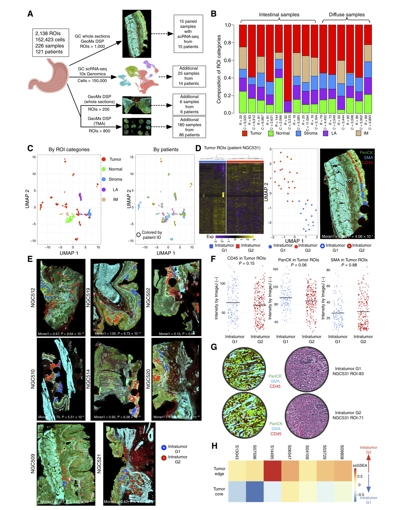
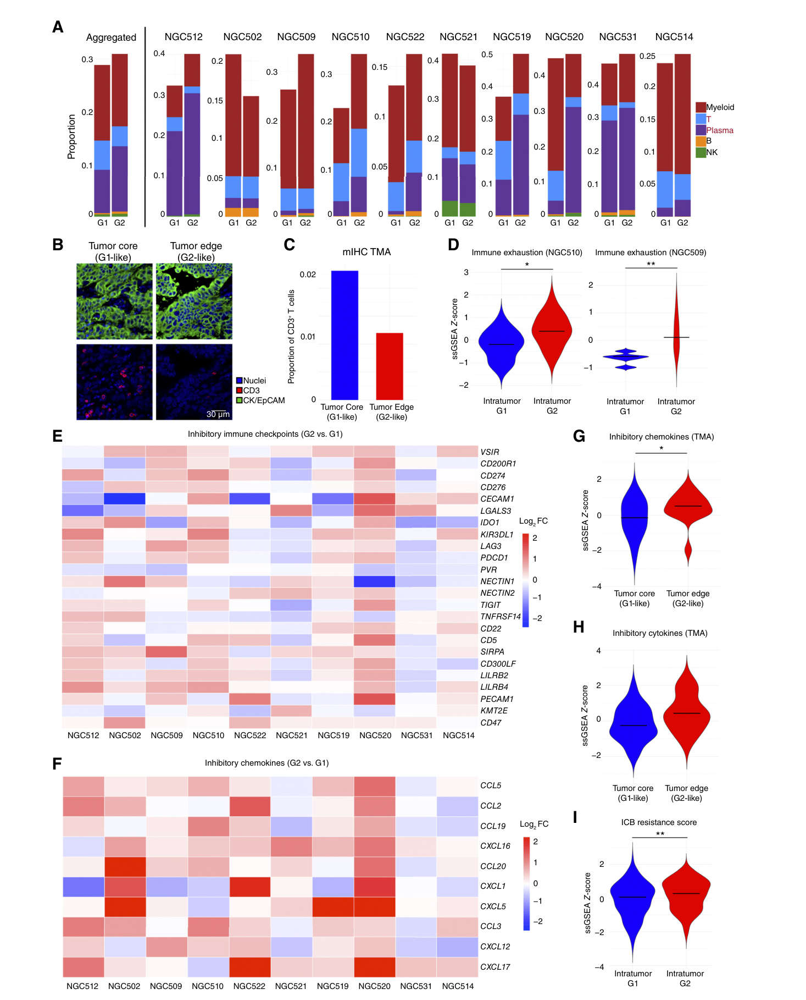
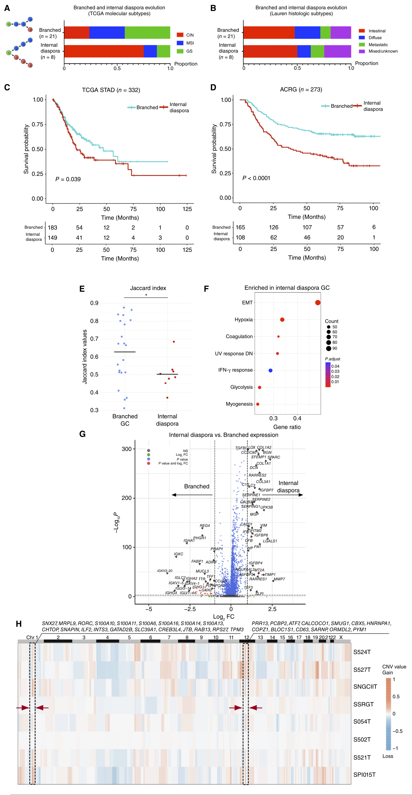
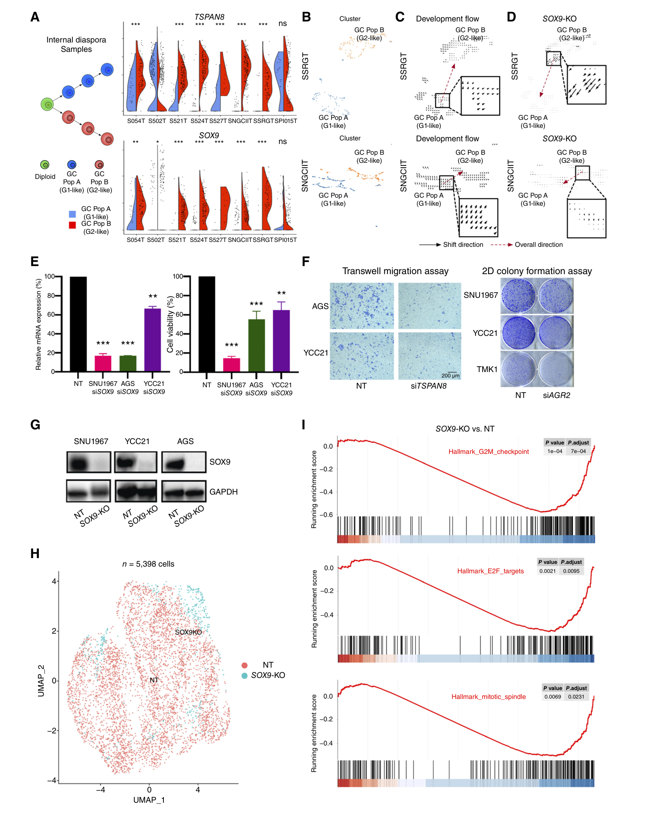
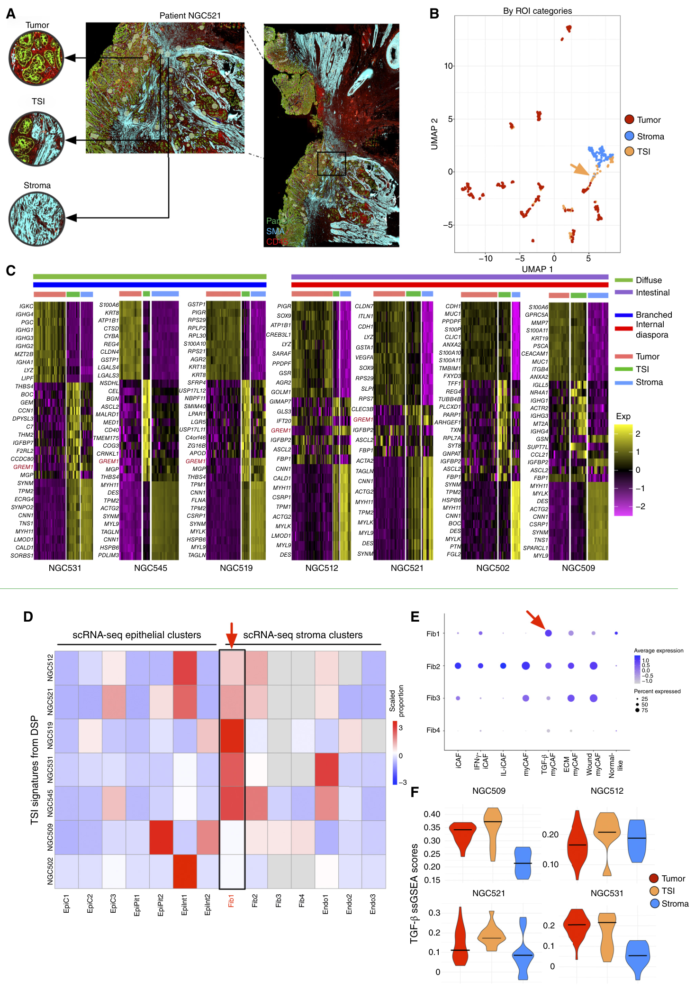
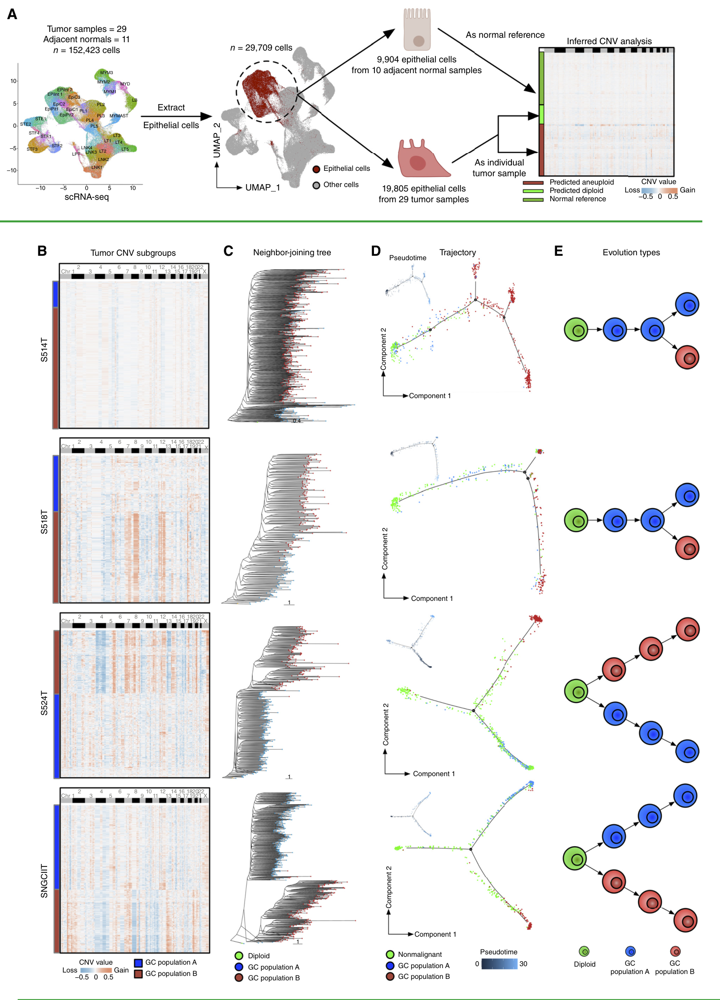
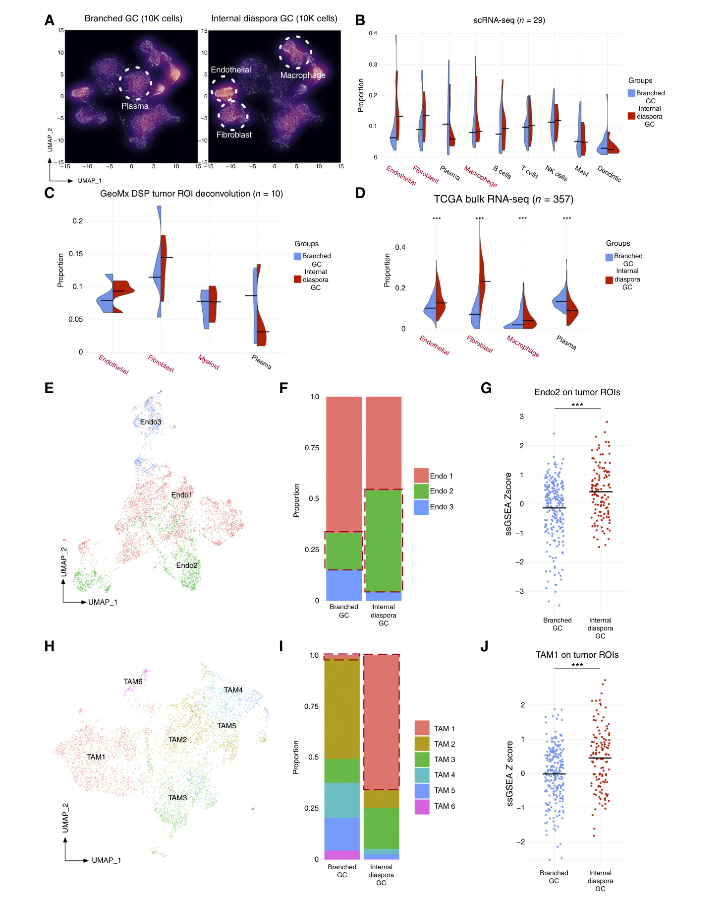

# Spatially Resolved Tumor Ecosystems and Cell States in Gastric Adenocarcinoma Progression and Evolution

<!-- wechat-style-reviewed: 2026-07-30 -->

在一例胃癌手术标本里，肿瘤核心、浸润边缘和肿瘤—基质交界可能相距不远。如果研究只取一块“代表性”组织，核心区看起来相对安静，并不代表边缘也处在同一种分子和免疫状态。

多区域 DNA 测序可以重建克隆关系，却不容易说明每个克隆正在执行什么程序；单细胞 RNA 测序可以拆开细胞状态，又会丢掉原来的位置。真正困难的不是再次证明胃癌“很异质”，而是把位置、状态、演化和局部生态接到同一条证据链上。

这项研究整合了 121 名患者的 226 份胃癌组织，包括 2,138 个 GeoMx 空间感兴趣区域（ROI）和 152,423 个单细胞表达谱。发现队列、整张切片验证、组织芯片、外部生存队列和功能扰动分别承担不同的验证任务。

作者给出的第一层答案是：同一胃癌内可以共存 G1 和 G2 两种空间组织化的表达状态。G2 更靠近肿瘤边缘，T 细胞更少，并伴随更强的免疫抑制、EMT 和治疗耐受相关表达程序。

第二层答案落在演化上：29 例单细胞胃癌中，21 例呈 branched evolution（分支演化），8 例呈 internal diaspora（内部离散式演化）；后者的表达签名在 TCGA、ACRG 和 GASCAD 队列中都与更差生存相关。SOX9 和特定内皮/巨噬细胞状态为 internal diaspora 提供了候选解释；研究还独立识别出 GREM1/TGF-β 富集的肿瘤—基质界面程序。这些线索都还不是已经验证的临床靶点。

## 01｜为什么一块肿瘤核心回答不了真正的问题

胃癌的异质性不只发生在患者之间，也发生在同一块肿瘤内部。若把多个区域混在一起测序，少量但重要的边缘状态会被平均；若只取一个核心区域，又可能完全看不到与侵袭和免疫抑制相关的空间程序。

本文所说的 G1/G2，不是 Lauren 分型、TCGA 分型或病理分级。它们是同一患者肿瘤内可共存的 RNA-ITH（表达型肿瘤内异质性）状态：G1 更接近肿瘤核心，G2 更偏向肿瘤边缘。

## 02｜这项研究到底做了多大规模

核心发现队列包含 15 例同时接受整张切片 GeoMx DSP 与配对单细胞 RNA 测序的胃癌，共 1,063 个 ROI 和 75,807 个细胞。每个 ROI 中位包含 328 个细胞，可测约 3,800 个基因，因此 GeoMx 保留了区域位置，但并不是单细胞分辨率。

空间验证分成两层：6 例独立整张切片队列提供 235 个 ROI；SGCC 组织芯片队列包含 86 名患者、180 份胃癌样本和 840 个 ROI，每份样本尽量同时表示肿瘤核心与边缘。另有 14 例胃癌进入单细胞分析，包括 11 个原发灶和 3 个腹膜转移灶，共 76,616 个细胞。

作者先在患者内部寻找 G1/G2，再用配对单细胞数据解释细胞状态和推断体细胞拷贝数改变（sCNA）。独立 GeoMx、组织芯片、多重免疫组化和 Stereo-seq 用来检查空间状态是否只是取样、细胞混合或单一算法造成的假象；外部 bulk 队列验证演化签名与预后的关联，siRNA/CRISPR 扰动则检验 SOX9 等候选因子的功能。

## 03｜G1 和 G2 是真实状态，还是区域混合造成的假象

先看空间定位，因为它决定 G1/G2 是随机波动还是有组织的区域状态。

简明图注：发现队列先在单个患者内识别 G1/G2，再映射回组织；图中同时展示核心/边缘关系与组织成分检查，GeoMx ROI 不能当作单细胞。

在代表性样本 NGC531 的 36 个肿瘤 ROI 中，G1/G2 的 Moran's I 为 0.92，P = 4.06 × 10^-7。其他 8 份胃癌也复现了空间聚集，平均 Moran's I 为 0.70，所有样本 P < 0.05。

在每个肿瘤—基质界面 ROI 最近的 10 个肿瘤 ROI 中，G2 占 67.7%，P = 0.02。G2 更常出现在接近边界的位置，但最近邻关系本身不能证明细胞从核心向边缘迁移。

作者随后排查“只是细胞比例不同”这个替代解释。G1/G2 ROI 的 CD45、SMA 和 PanCK 差异均未达到显著，P 值分别为 0.15、0.88 和 0.06；病理学家检查的 33 对 ROI 形态相似。380 个组织芯片 ROI 的多重免疫组化中，G2 样边缘与 G1 样核心的上皮细胞比例也没有显著差异，P = 0.37。

高肿瘤纯度 ROI、62 个纯肿瘤上皮细胞系以及两份 Stereo-seq 胃癌又复现了 G1/G2。这使“癌细胞内在表达状态”的解释更可信，但仍不能完全排除局部基质信号对状态的诱导。

## 04｜为什么 G2 更像一个免疫抑制的侵袭前沿

关键不是给 G2 贴上“更坏”的标签，而是看它与 G1 相比具体改变了什么。

简明图注：10 例、超过 300 个肿瘤 ROI 的去卷积比较 G2 与 G1，组织芯片核心/边缘多重免疫组化提供蛋白层验证；表达签名不等于真实治疗反应。

与 G1 相比，G2 的 T 细胞比例更低（P = 4.21 × 10^-7），浆细胞比例更高（P = 5.97 × 10^-6）。在组织芯片中，G2 样肿瘤边缘的 CD3+ T 细胞比例约为 G1 样核心的 1/2.19，方向与去卷积结果一致。

24 个预定义抑制性免疫检查点中有 11 个在 G2 升高；10 种抑制性趋化因子中有 9 种、6 种抑制性细胞因子中有 5 种升高，均按文中 Wilcoxon 检验达到 P < 0.05。血管生成签名也更高，P = 3.98 × 10^-9。

独立组织芯片只部分复现：边缘 ROI 的抑制性趋化因子更高，P = 0.04；细胞因子只有趋势，P = 0.06；免疫检查点差异不显著，P = 0.25。两项跨癌种治疗耐药签名在 G2 的评分更高，P 值分别为 7.25 × 10^-3 和 0.05，但论文没有在接受免疫治疗的胃癌患者中验证真实疗效。

## 05｜两种肿瘤演化路线，哪一种更危险

作者从 29 例胃癌的 19,805 个肿瘤上皮细胞中推断 sCNA，并以 10 份邻近正常组织的 9,904 个上皮细胞作为二倍体参考。CopyKAT 与 inferCNV 的中位相关系数为 0.55；5 份匹配 WES 样本的中位相关系数为 0.58，其中 4 份达到 P < 0.05。

21 例的不同肿瘤亚群共享大部分基础拷贝数改变，更接近逐步分叉的 branched evolution；8 例的亚群较早呈现彼此不同的 sCNA 组合，被作者称为 internal diaspora。这里的“早”和“演化”来自横断面树形与拟时序推断，并非纵向追踪。

真正值得看的是这种分类能否跨队列连接到结局。

简明图注：单细胞队列建立演化签名，再映射到 TCGA-STAD（n = 332）和 ACRG（n = 273）；外部队列验证的是表达签名及生存关联，不是直接重建每名患者的演化树。

TCGA-STAD 中，internal diaspora 签名组生存更差，log-rank P = 0.04；校正性别和分期后，HR = 1.49（95% CI 1.05–2.11，P = 0.03）。ACRG 中调整后 HR = 1.88（95% CI 1.31–2.69，P = 6.44 × 10^-4）；GASCAD 的 83 例中也观察到较差生存，P < 0.05。

这说明 internal diaspora 表达签名包含预后信息，但不能证明这种演化方式本身造成死亡风险上升。CIN、治疗、分期和取样差异仍可能参与其中。

## 06｜这种危险模式由哪些肿瘤内外线索共同支撑

与 branched evolution 相比，internal diaspora 伴随 VWF+ACKR1+ 的 Endo2 内皮状态和 SPP1+FN1+ 的 TAM1 巨噬细胞状态。在 GeoMx 肿瘤 ROI 中，Endo2 特征评分更高，P = 4.30 × 10^-5，但分析排除了 1 个离群值；TAM1 特征评分也更高，P = 2.16 × 10^-5。

肿瘤细胞内部，SOX9 是作者收敛出的候选驱动因子。值得看这张图，是因为它把计算预测、两种基因扰动和单细胞读出放在同一条链上。

简明图注：CellOracle 预测 SOX9 敲除使 G2 样状态向 G1 样偏移；siRNA、3 个细胞系的 CRISPR KO 及 5,398 个单细胞提供功能支持，但尚未在动物或患者来源模型中证明 SOX9 会重塑演化轨迹。

SOX9 CRISPR KO 在 SNU1967、AGS 和 YCC21 三个细胞系中均降低细胞活力和迁移。YCC21 的 KO 与对照共获得 5,398 个质控后单细胞，KO 后 G2M checkpoint、E2F targets 和 mitotic spindle 程序下降。

这些实验支持 SOX9 维持增殖和 G2 样状态，却没有证明它单独启动 internal diaspora，也没有证明抑制 SOX9 能改善患者结局。

## 07｜肿瘤—基质界面为什么不只是两类组织的混合

作者分析了 85 个肿瘤—基质界面（TSI）ROI。这些区域被定义为同一 ROI 内可见 PanCK+ 肿瘤细胞与 SMA+ 间质交错；问题是界面表达只是“肿瘤加间质”的平均，还是存在额外程序。

这张图把肿瘤、界面和间质放在同一空间坐标中。

简明图注：85 个 TSI ROI 用于发现，热图展示满足 ROI 数量筛选的 7 份样本；scRNA-seq 映射、两份 Stereo-seq 和 CAF—类器官共培养提供补充验证。

GREM1 在肠型和弥漫型胃癌的 TSI 均常见上调，TSI 特征主要映射到 TGF-β 活性较高的 Fib1 肌成纤维样 CAF。两份 Stereo-seq 中也能区分 TSI bin；越接近间质的肿瘤区域，TGF-β 通路评分越高，P < 2.20 × 10^-16。

两个 GREM1+ CAF 细胞系与一个胃癌类器官共培养后，CAF 中 GREM1 表达升高。这支持界面存在超出简单线性混合的候选程序，但不能确定 GREM1 的确切来源、TGF-β 的信号方向或必要性。

## 08｜为什么这套证据路线比一张空间图更有价值

这项研究的说服力不来自某一张 UMAP，而来自连续排查替代解释。独立整张切片和组织芯片检查空间复现；病理复核、多重免疫组化、高纯度 ROI、细胞系和 Stereo-seq 检查“只是细胞混合”；inferCNV、WES 和多种轨迹算法检查单一计算方法；外部队列检查预后方向；siRNA、CRISPR 和共培养再把候选机制推进到功能层。

它真正改变的是取样和分层思路。单一肿瘤核心可能遗漏 G2 和 TSI 状态；若研究问题涉及免疫治疗、侵袭或演化风险，核心、边缘、界面和邻近基质应被分别记录，而不是在建库前混在一起。

现阶段更现实的价值是改进取样、空间分层和机制优先级，而不是立即把 SOX9、ACKR1、GREM1 或 TGF-β 当作治疗靶点。

## 09｜这些结果仍需要冷静看待

首先，核心配对发现队列只有 15 例，演化模式来自 29 例单细胞胃癌。2,138 个 ROI 和 152,423 个细胞扩大了观察数，却不能把 ROI 或单细胞当成同等数量的独立患者重复。

其次，GeoMx ROI 中位包含 328 个细胞。作者用了多种办法降低混合偏差，但 G1/G2、Endo2、TAM1 和 TSI 的部分结论仍依赖去卷积、签名映射与人工 ROI 选择。

第三，branched/internal diaspora 来自横断面的 RNA 推断 sCNA、系统发育树和拟时序，不是真实纵向记录。匹配 WES 只有 5 份；外部队列验证的也是表达签名，而不是每例患者的空间演化树。

第四，生存模型主要校正性别和肿瘤分期，治疗、取样密度、平台和其他临床变量仍可能混杂。SOX9 扰动限于体外细胞系，GREM1/TGF-β 模型也没有完成原位阻断或动物验证。

最后，本地 PDF 不含 Supplementary Fig. S1–S9 和 Supplementary Tables S1–S8。主文中还有跨页错序、图注文字冲突和大范围多重比较；技术附录已逐项标出这些低置信处。

## 10｜如何把这套设计迁移到自己的研究

第一步不是照搬 G1/G2 签名，而是改变取样。对每例样本成对保留肿瘤核心、侵袭边缘、TSI 和邻近基质；先在患者内部学习空间状态，再检验能否跨患者复现。

第二步是为每类证据安排正交验证。区域表达需要病理复核和蛋白或高分辨率空间验证；scRNA 推断的谱系需要 DNA 数据校验；计算筛出的调控因子至少需要一种基因扰动和一个直接功能读出。

若迁移到胃肠化生、异型增生或早癌队列，终点应改为病变进展和纵向空间变化，G1/G2、internal diaspora 与 TSI 签名都必须在相应阶段重新学习和校准。

---

## 技术附录

以下从原版笔记“基本信息”起完整原样保留，包含论文与数据来源、PDF 解析质量、主图、全部 Results/Methods 句子 ID、逐句证据边界、方法参数、原文冲突、低置信抽取和覆盖审计。

## 基本信息

- 原文题名：Spatially Resolved Tumor Ecosystems and Cell States in Gastric Adenocarcinoma Progression and Evolution
- 期刊：Cancer Discovery 15:767–792
- 年份：2025
- DOI：10.1158/2159-8290.CD-24-0605
- 作者：Haoran Ma、Supriya Srivastava、Shamaine Wei Ting Ho、Chang Xu、Benedict Shi Xiang Lian、Xuewen Ong、Su Ting Tay、Taotao Sheng、Huey Yew Jeffrey Lum、Siti Aishah Binte Abdul Ghani、Yunqiang Chu、Kie Kyon Huang、Yeek Teck Goh、Minghui Lee、Takeshi Hagihara、Clara Shi Ya Ng、Angie Lay Keng Tan、Yanrong Zhang、Zichen Ding、Feng Zhu、Michelle Shu Wen Ng、Craig Ryan Cecil Joseph、Hui Chen、Zhen Li、Joseph J. Zhao、Sun Young Rha、Ming Teh、Joe Yeong、Wei Peng Yong、Jimmy Bok-Yan So、Raghav Sundar、Patrick Tan
- 研究领域：胃腺癌、空间转录组、单细胞转录组、表达型肿瘤内异质性、肿瘤演化、肿瘤微环境
- 关键词：GeoMx DSP、scRNA-seq、RNA-ITH、internal diaspora、branched evolution、SOX9、VWF、ACKR1、GREM1、tumor–stroma interface
- 本地 PDF：`pdfs/processed/gastric-tumor-ecosystems-progression-cancer-discovery-2025.pdf`
- PDF 解析质量：
  - 文字抽取方式：使用 `scripts/build_pdf_llm_pack.py --engine pymupdf` 建立 `tmp/2025-gastric-tumor-ecosystems-llm-pack.md` 和 JSON manifest。
  - 覆盖范围：26 页，共抽取 1,431 个句子 ID；脚本初始分类为 Results 216 句、Methods 427 句。人工版面审计发现第 5–15 页的多段真实 Results 因正文引用 “Supplementary Fig./Table” 被误分到 `supplementary`，第 23–26 页部分作者贡献、披露、致谢和参考文献又被误分到 `methods`；本笔记按 PDF 原始章节边界纠偏，不直接采用自动分类计数。
  - 图表与补充材料：主文 Fig. 1–7 和图注均在 PDF 中；正文频繁引用 Supplementary Fig. S1–S9、Supplementary Tables S1–S8，但 inbox PDF 不含这些补充文件，故不补写其不可见 panel、数值或实验细节。
  - 低置信内容：双栏版面在第 2 页将作者单位穿插进 Introduction；跨页句、页眉页脚、整页主图的基因名/坐标轴/显著性标记被拆成孤立“句子”；Fig. 4–7 的跨页图注与正文有局部错序。所有这类内容均在覆盖审计中单列，不把图内标签冒充正文结果。
- 图像截取说明：主图按原 PDF 页面对 Fig. 1–7 进行整页或跨页截取，保留 panel、坐标轴、图例和图注上下文；正文图片只服务于相应原始 Results 小节。
- LLM 覆盖审计：
  - Results 覆盖：按 PDF 版面纳入 7 个原始 Results 小节的全部正文与 Fig. 1–7 正式图注，共 479 个唯一 ID；正文止于 `P017.S0040`，另纳入被误分为 `discussion` 的 Fig. 7 续页图注 `P017.S0043–P017.S0051`。自动误标为 `supplementary` 的主文结果均已重新纳入。
  - Methods 覆盖：按 PDF 原始 Methods，从 `P019.S0016` 起至 Data Availability 的 `P023.S0030` 逐句处理；作者贡献、利益披露、致谢、资助和参考文献不作为 Methods。
  - 低置信与非叙事抽取：图内孤立标签、坐标、页眉页脚、被拆开的跨页残句均保留 ID 审计，但不伪造语义。

---

## 本论文主图

| 原文图表 | 原文图题/核心信息 | 是否截取 | 图像文件 | 放置位置 |
|---|---|---|---|---|
| Fig. 1 | Spatially resolved ITH in gastric cancer：研究设计、ROI 分类、G1/G2 RNA-ITH 的空间聚集及核心/边缘映射 | 是 | `assets/gastric-cancer/2025-gastric-tumor-ecosystems/fig1-spatial-rna-ith.png` | [Spatially Resolved Patterns of ITH in Gastric Cancer](#spatially-resolved-patterns-of-ith-in-gastric-cancer) |
| Fig. 2 | G2 RNA-ITH regions exhibit an immunosuppressive TME：免疫细胞比例、检查点、抑制性趋化因子/细胞因子和耐药签名 | 是 | `assets/gastric-cancer/2025-gastric-tumor-ecosystems/fig2-immune-heterogeneity.png` | [G2 RNA-ITH Regions Exhibit an Immunosuppressive TME](#g2-rna-ith-regions-exhibit-an-immunosuppressive-tme) |
| Fig. 3 | G1/G2 relationships link to distinct within-tumor evolution：sCNA、轨迹和 branched/internal diaspora | 是 | `assets/gastric-cancer/2025-gastric-tumor-ecosystems/fig3-evolutionary-trajectories.png` | [G1 and G2 RNA-ITH Relationships Are Linked with Distinct Patterns of Within-Tumor Evolution](#g1-and-g2-rna-ith-relationships-are-linked-with-distinct-patterns-of-within-tumor-evolution) |
| Fig. 4 | Internal diaspora evolution and prognosis：TCGA/ACRG 生存、ITH、通路和共有 sCNA 区域 | 是 | `assets/gastric-cancer/2025-gastric-tumor-ecosystems/fig4-prognostic-evolution.png` | [Clinical Impact of Internal Diaspora Evolution on Gastric Cancer Prognosis](#clinical-impact-of-internal-diaspora-evolution-on-gastric-cancer-prognosis) |
| Fig. 5 | Internal diaspora–associated stromal microenvironment：Endo2 与 TAM1 的跨模态富集 | 是 | `assets/gastric-cancer/2025-gastric-tumor-ecosystems/fig5-stromal-microenvironment.png` | [Internal Diaspora Gastric Cancers Harbor a Specific Stromal Microenvironment – Evidence from scRNA-seq and GeoMx DSP](#internal-diaspora-gastric-cancers-harbor-a-specific-stromal-microenvironment-–-evidence-from-scrna-seq-and-geomx-dsp) |
| Fig. 6 | Candidate drivers of internal diaspora evolution：SOX9/TSPAN8/AGR2、CellOracle、siRNA 与 CRISPR KO | 是 | `assets/gastric-cancer/2025-gastric-tumor-ecosystems/fig6-sox9-driver.png` | [SOX9 is a Candidate Internal Diaspora Driver](#sox9-is-a-candidate-internal-diaspora-driver) |
| Fig. 7 | TSIs represent a unique TGF-β–mediated cell state：TSI、GREM1、Fib1 myCAF 与 TGF-β 活性 | 是 | `assets/gastric-cancer/2025-gastric-tumor-ecosystems/fig7-tumor-stroma-interface.png` | [Spatial Analysis of the TSI Reveals a Unique TGF-β–Mediated State](#spatial-analysis-of-the-tsi-reveals-a-unique-tgf-β–mediated-state) |

## 生物学故事前情

胃癌的异质性并不只发生在患者之间。同一块肿瘤内部，不同区域也可能携带不同拷贝数结构、转录状态、代谢压力和免疫生态。传统多区域 DNA 测序可以画出克隆树，却不一定能告诉我们每个分支处于什么功能状态，更难说明这些状态与局部基质、血管和免疫细胞如何互相塑造。单细胞 RNA 测序能把细胞状态拆开，但组织消化又会丢掉“这些细胞原本在哪里”的信息（`P003.S0001-P003.S0010`）。

本文把两个互补视角接到一起。GeoMx Digital Spatial Profiler 在 FFPE 整张切片上按病理区域选择 ROI，保留肿瘤核心、边缘、基质、淋巴聚集区和肿瘤–基质界面的空间关系；配对 scRNA-seq 则提供细胞类型、细胞状态和推断拷贝数结构。作者由此追问三个递进问题：同一胃癌中的表达状态是否按空间组织；这种状态如何连接到免疫抑制和克隆演化；肿瘤细胞内在驱动与外在生态位能否共同解释临床差异（`P003.S0011-P003.S0020`）。

阅读全文时应抓住一条主线：G1/G2 不是传统 Lauren 或 TCGA 分型，而是同一肿瘤内可共存的 RNA-ITH 亚区；branched 与 internal diaspora 则是样本层面的演化轨迹。作者随后把“区域状态”向上连接到预后和演化，向下连接到 SOX9、VWF+ACKR1+ 内皮、SPP1+FN1+ TAM，以及 GREM1/TGF-β 富集的肿瘤–基质界面。

## 重要缩写表

| 缩写 | 中文含义 | 本文语境中的具体指代 | 阅读时注意 |
|---|---|---|---|
| GeoMx DSP | GeoMx 数字空间分析平台 | 在 FFPE 组织上由病理学家选择 ROI 后进行全转录组空间表达测量 | ROI 含数百个细胞，不是单细胞分辨率 |
| ROI | 感兴趣区域 | 肿瘤、基质、淋巴聚集区、肠化生、邻近正常或 TSI 的空间采样单位 | ROI 类别按优势成分标注，仍可能包含混合细胞 |
| scRNA-seq | 单细胞 RNA 测序 | 152,423 个单细胞表达谱，用于细胞注释、状态和推断 sCNA | 解离后空间位置丢失，需与 GeoMx 映射整合 |
| RNA-ITH | 表达型肿瘤内异质性 | 同一患者肿瘤 ROI 或肿瘤细胞中的转录状态差异 | 不是 DNA 克隆异质性的同义词 |
| G1/G2 | RNA-ITH 亚区/状态 | 多个患者内共同出现的两类肿瘤表达状态 | G1/G2 不是病理分级；G2 与边缘、EMT 和免疫抑制更相关 |
| sCNA | 体细胞拷贝数改变 | 从 scRNA-seq 以 CopyKAT/inferCNV 推断的拷贝数模式 | 属计算推断，不能完全替代 WES/WGS |
| CIN | 染色体不稳定 | TCGA 胃癌分子亚型之一，也通过 HET70 等签名讨论 | internal diaspora 与 CIN 富集相关但并不等同 |
| TME | 肿瘤微环境 | 免疫、成纤维、内皮和其他非恶性细胞及其状态 | 去卷积或映射得到的比例仍受参考数据影响 |
| TSI | 肿瘤–基质界面 | PanCK+ 肿瘤与 SMA+ 基质交错的人工选定 ROI | 不是简单肿瘤/基质混合；本文强调其独特程序 |
| CAF/myCAF | 癌相关成纤维细胞/肌成纤维样 CAF | TSI 签名主要映射到 Fib1、TGF-β 活性较高的 myCAF | 亚型命名依赖本文 scRNA-seq 聚类和参考签名 |
| TAM | 肿瘤相关巨噬细胞 | scRNA-seq 中划分的 TAM1–TAM6 | TAM1 以 SPP1/FN1 为特征，与 internal diaspora 富集相关 |
| ssGSEA | 单样本基因集富集分析 | 为单个 ROI/样本计算通路签名分数 | 是相对富集分数，不等于通路因果激活 |
| TMA | 组织芯片 | SGCC 胃癌 TMA，包含肿瘤核心与边缘 ROI | 每例有限取样可能低估肿瘤内异质性 |

## 论文详细解读

### 研究问题与科学背景

作者要解决的核心问题是：胃癌细胞的转录状态、克隆演化和局部微环境是否在空间上共同组织，并且这种组织方式能否解释侵袭、免疫逃逸和预后差异。既往 DNA 多区域测序可恢复谱系，却弱于解释功能状态；scRNA-seq 可解析状态，却丢失组织空间；空间平台又常缺少足够的细胞状态参照。本文以配对 GeoMx DSP 和 scRNA-seq 把三者串联（`P002.S0007-P003.S0020`）。

### 研究设计与数据结构

研究整合 121 例患者的 226 份癌组织样本，共 2,138 个 GeoMx DSP ROI 和 152,423 个单细胞表达谱（`P002.S0002`, `P003.S0021`）。发现队列为 15 例同时接受整张切片 GeoMx 与配对 scRNA-seq 的胃癌，包括 1,063 个 ROI 和 75,807 个细胞；独立整张切片 GeoMx 验证队列为 6 例、235 个 ROI；SGCC TMA 队列为 86 例患者的 180 个胃癌样本、840 个 ROI；另有 14 个胃癌用于 scRNA-seq，包括 11 个原发灶和 3 个腹膜转移灶、共 76,616 个细胞（`P003.S0021-P003.S0024`）。

每个发现队列 ROI 的中位细胞数为 328，由两名病理学家独立标注为肿瘤、基质、淋巴聚集区、肠化生或邻近正常上皮，标注一致率为 97.6%；单个 ROI 中位可测约 3,800 个基因（IQR 2,058–5,265；`P003.S0025-P003.S0034`）。外部临床验证使用 TCGA-STAD、ACRG GSE62254 和 GASCAD；机制与正交验证还包括 Stereo-seq、胃癌类器官、胃癌细胞系、siRNA、CRISPR KO、Western blot、迁移/增殖/克隆形成实验。

### 方法速览与分析框架

分析链条分为五层。第一层在每位患者内部对肿瘤 ROI 做表达聚类，寻找跨患者复现的 G1/G2 RNA-ITH 状态，并用病理标记、肿瘤纯度、mIHC、Stereo-seq 和 TGF-β 处理类器官排除“只是细胞混合”的解释。第二层比较 G1/G2 的通路、免疫细胞比例、检查点、细胞因子和耐药签名。第三层从 scRNA-seq 推断 sCNA，用 Jaccard、系统发育树和 Monocle/Slingshot/PAGA 归纳 branched 与 internal diaspora 两种演化轨迹。第四层将演化签名映射到外部 bulk 队列，评估生存和多变量 Cox，并解析 Endo2/TAM1 等微环境状态。第五层以 CellOracle、siRNA、CRISPR KO 和功能实验测试 SOX9，再用 GeoMx、scRNA-seq、Stereo-seq 与类器官共同刻画 TSI 的 GREM1/TGF-β 程序。

## 原文结果完整梳理

### Spatially Resolved Patterns of ITH in Gastric Cancer

中文图注（基于原文图注）：

- A：研究数据集示意，共 2,138 个 GeoMx DSP ROI、152,423 个 scRNA-seq 细胞、226 份样本和 121 名患者；15 例配对 DSP+scRNA、14 例仅 scRNA、6 例独立 DSP 验证、86 例进入 TMA。
- B：15 例（9 例肠型、6 例弥漫型）中肿瘤、正常、基质、淋巴聚集区和肠化生五类 ROI 的比例；分类结合形态、细胞特异标志和配对 H&E，柱下 `R`/`C` 为 ROI/配对单细胞数。
- C：同一批 ROI 的 UMAP，左按 ROI 类别、右按患者着色；每个点代表一个 ROI。
- D：患者 NGC531 的肿瘤 ROI 无监督热图、UMAP 和组织空间回贴，显示 G1/G2 两个表达亚群；组织图列出 Moran’s I 及其显著性。
- E：另外 8 例 GeoMx 切片的亚群空间回贴及逐例 Moran’s I/P 值。
- F：各样本肿瘤 ROI 中 CD45、PanCK 和 SMA IHC 强度；蓝色为 G1、红色为 G2，P 值来自 Wilcoxon 秩和检验。
- G：代表性 G1/G2 区域的 H&E 与免疫荧光；两者均见免疫/基质之间的散在肿瘤细胞，组织学形态相似。
- H：将 GeoMx 亚群签名映射至胃癌 TMA 的 ssGSEA 热图；每格为一份样本，颜色表示缩放平均分。

| 原文句子 ID | 忠实中文翻译 | 结果含义与证据边界 |
|---|---|---|
| `P003.S0021` | 为探索胃癌空间性肿瘤内异质性（ITH）模式，我们整合了来自 121 名胃癌患者、226 份样本的 2,138 个 GeoMx DSP ROI 与 152,423 个 scRNA-seq 单细胞表达谱。 | 给出总体数据规模；是多队列观察性整合，不等同于 121 名患者均同时具有两种模态。 |
| `P003.S0022` | 数据包括：15 例胃癌的发现队列，同时进行了全切片 GeoMx DSP 与配对 scRNA-seq（1,063 个 ROI，平均约 71 个 ROI/患者；75,807 个细胞，平均约 5,054 个细胞/患者）；6 名患者的独立全切片 GeoMx DSP 验证队列（235 个 ROI，平均约 39 个 ROI/患者）；以及来自 86 名患者的 180 份胃癌样本的 GeoMx DSP 组织微阵列（TMA）队列，每例胃癌由肿瘤核心和肿瘤边缘两个区域代表［840 个 ROI，平均约 10 个 ROI/患者； | `EXTRACTION_CHECK`：队列长句在分号后中断；保留各样本量，但该 ID 本身未包含 SGCC TMA 闭括号及后续队列。 |
| `P003.S0023` | 另有接受 scRNA-seq 分析的胃癌（11 例原发胃癌、3 例腹膜转移；76,616 个细胞，平均约 5,473 个细胞/患者；图 | `EXTRACTION_CHECK`：本 ID 丢失句首“14 例”，且在图号前断开；应与前后 ID 连读，不能单独解释队列总数。 |
| `P003.S0024` | 1A；补充 | `EXTRACTION_CHECK`：仅为跨 ID 的图表引用片段，不含独立结果。 |
| `P003.S0025` | 在发现队列中，每个 ROI（中位 328 个细胞/ROI）均经细致审核，并由两名合格病理学家（S. | `EXTRACTION_CHECK`：病理学家姓名与分类在后续 ID；此处支持 ROI 审核流程和细胞数，不报告生物学差异。 |
| `P003.S0026` | Srivastava 和 H.Y.J. | `EXTRACTION_CHECK`：仅为被拆开的作者姓名片段。 |
| `P003.S0027` | Lum）独立注释为肿瘤、间质、淋巴样聚集区（LA）、肠化生和邻近正常上皮区域（病理学家间一致率 = 97.6%）。 | 给出 ROI 分类和很高的阅片一致率；一致率支持标注可靠性，但不证明分子分类准确。 |
| `P003.S0028` | 我们的注释依据每个 ROI 中占优势的细胞类型，并结合细胞形态［使用连续配对的苏木精-伊红（H&E）切片］和荧光免疫组织化学（IHC）标志物加以识别（图 | `EXTRACTION_CHECK`：图号跨 ID；说明注释同时使用形态和标志物，但“占优势”意味着混合 ROI 仍可能存在。 |
| `P003.S0029` | 1B；补充图 | `EXTRACTION_CHECK`：仅为引用片段。 |
| `P003.S0030` | S1A）。 | `EXTRACTION_CHECK`：仅补全上一句图号。 |
| `P003.S0031` | 每个 ROI 表达谱获得约 3,800 个可测基因（IQR = 2,058–5,265；见“Methods”）。 | 报告 GeoMx ROI 的有效基因覆盖及离散度；不同 ROI 测得基因数差异较大。 |
| `P003.S0032` | 为验证 ROI 注释，我们在 GeoMx DSP 数据中评估了已发表的细胞类型特异性标志物，发现高度可重复，例如肿瘤 ROI 中表达肿瘤标志物 KRT8 和 EPCAM（40、41；补充图 | `EXTRACTION_CHECK`：图号跨 ID；标志物一致性是注释的内部/文献一致性验证，并非独立金标准。 |
| `P003.S0033` | S1B）。 | `EXTRACTION_CHECK`：仅补全图号。 |
| `P003.S0034` | ROI 类别还与配对 scRNA-seq 数据确定的细胞类型簇高度相关（补充图 | `EXTRACTION_CHECK`：图号跨 ID；提供跨模态一致性，但未在该句给出相关系数。 |
| `P003.S0035` | S1C）。 | `EXTRACTION_CHECK`：仅补全图号。 |
| `P003.S0036` | 比较肿瘤与邻近正常上皮 ROI 的基因表达差异，证实既往报道的胃癌基因在肿瘤 ROI 中显著上调，例如 CLDN4（Wilcoxon 检验 FDR = 2.41 × 10−6）和 CD44（FDR = 3.35 × 10−5；参考文献 | `EXTRACTION_CHECK`：文献与通路结果跨 ID；这是肿瘤/邻近正常的关联差异，不证明这些基因驱动肿瘤。 |
| `P003.S0037` | 42、43），以及致癌通路，例如上皮-间质转化（EMT；Kolmogorov–Smirnov 检验 FDR = 9.47 × 10−10）和血管生成（FDR = 2.18 × 10−4；补充图 | `EXTRACTION_CHECK`：与上一 ID 连读；通路富集支持肿瘤 ROI 的程序差异，不能定位到单一细胞或建立因果。 |
| `P003.S0038` | S1D 和 S1E；参考文献 | `EXTRACTION_CHECK`：仅为图和文献引用片段。 |
| `P003.S0039` | 44、45）。 | `EXTRACTION_CHECK`：仅补全引用。 |
| `P003.S0040` | 每种 ROI 类别的富集基因程序展示于补充图 | `EXTRACTION_CHECK`：图号跨 ID；是结果导航句，未在本 ID 报告具体程序。 |
| `P003.S0041` | S1F。 | `EXTRACTION_CHECK`：仅补全图号。 |
| `P003.S0042` | 使用统一流形逼近与投影（UMAP）进行降维时，肿瘤 ROI 呈患者特异性聚类，而非肿瘤 ROI（如 LA、间质等）按 ROI 类别聚类；这与其他研究中肿瘤表达谱常因个体化肿瘤非整倍体模式而呈患者特异性的现象相似（图 | `EXTRACTION_CHECK`：引用跨 ID；UMAP 是可视化证据，提示而非定量证明患者效应由非整倍体造成。 |
| `P003.S0043` | 1C；参考文献 | `EXTRACTION_CHECK`：仅为图和文献引用片段。 |
| `P003.S0044` | 46、47）。 | `EXTRACTION_CHECK`：仅补全引用。 |
| `P003.S0045` | 我们使用三种不同的批次校正方法（ComBat、Limma 和……）证实 GeoMx DSP 数据中的批次效应很小。 | `EXTRACTION_CHECK`：句末缺失 RUV4/补充表引用；结论依赖作者的批次诊断，未在该 ID 给出效应量。 |
| `P004.S0024` | 图 1。 | 图题标识，不构成独立证据。 |
| `P004.S0025` | 胃癌中空间分辨的 ITH。 | 图 1 总题；概括图示主题。 |
| `P004.S0026` | A，研究数据集示意图。 | 定义图 1A；仅描述设计。 |
| `P004.S0027` | 研究包含来自 121 名胃癌患者、226 份样本的 2,138 个 GeoMx DSP ROI 和 152,423 个 scRNA-seq 单细胞表达谱。 | 图注复述总体样本规模，不是额外独立队列。 |
| `P004.S0028` | 15 名患者接受 GeoMx DSP 与配对 scRNA-seq，14 名患者仅接受 scRNA-seq，另有 6 名患者属于 GeoMx DSP 验证集，86 名患者位于 TMA 中。 | 澄清各模态患者构成；各类别相加对应总体患者数，但样本数与患者数不可混用。 |
| `P004.S0029` | B，15 份样本（9 例肠型、6 例弥漫型）中各 ROI 类型比例分布的条形图。 | 定义图 1B 及 Lauren 亚型构成；为描述性比例。 |
| `P004.S0030` | ROI 根据连续配对 H&E 染色图像中的形态和细胞类型特异性标志物，分为肿瘤、正常、间质、LA 和肠化生（IM）五类。 | 图注说明分类规则；ROI 仍按优势成分标注，不能视为纯细胞群。 |
| `P004.S0031` | （下页续） | 编辑性图注续页标记，无独立证据。 |
| `P005.S0001` | 以一例代表性胃癌 NGC531 为例，我们对 36 个肿瘤 ROI 进行了聚类分析［图 | `EXTRACTION_CHECK`：图号跨 ID；这是单患者示例分析，外推需依赖后续多样本验证。 |
| `P005.S0002` | 1D（左）］。 | `EXTRACTION_CHECK`：仅补全图号。 |
| `P005.S0003` | 无监督聚类和 UMAP 分析均确认了两个不同的表达亚群，称为“G1”和“G2”［图 | `EXTRACTION_CHECK`：图号跨 ID；两种分析在同一数据上相互一致，不是独立生物学验证。 |
| `P005.S0004` | 1D（左和中）］。 | `EXTRACTION_CHECK`：仅补全图号。 |
| `P005.S0005` | 重要的是，将这些亚群映射回胃癌 NGC531 内的地理空间坐标后，空间自相关分析显示它们定位于不同空间区域（Moran’s I = 0.92，P = 4.06 × 10−7），表明存在空间分辨的表达型 ITH［RNA-ITH；图 | `EXTRACTION_CHECK`：图号跨 ID；强空间自相关支持非随机空间聚集，但不说明形成机制。 |
| `P005.S0006` | 1D（右）］。 | `EXTRACTION_CHECK`：仅补全图号。 |
| `P005.S0007` | 其他胃癌中也观察到类似的空间分辨 RNA-ITH 模式（平均 Moran’s I = 0.70；所有样本 P < 0.05；图 | `EXTRACTION_CHECK`：图号跨 ID；多样本重复支持普遍性，但未在此给出样本数和多重校正。 |
| `P005.S0008` | 1E）。 | `EXTRACTION_CHECK`：仅补全图号。 |
| `P005.S0009` | 为判断这些 RNA-ITH 模式能否由显著组织学结构差异解释，我们检查了 G1 与 G2 ROI 中泛细胞角蛋白（PanCK）、平滑肌肌动蛋白（SMA）和 CD45 阳性细胞的比例（见“Methods”），未发现显著差异（CD45：P = 0.15；SMA：P = 0.88；PanCK：P = 0.06； | `EXTRACTION_CHECK`：图号在后续 ID；未显著不等于证明完全相同，PanCK 的 P = 0.06 亦接近阈值。 |
| `P005.S0010` | 图 1F）。此外，病理学家 S. 对 33 对 G1/G2 ROI 进行了目视检查。 | `EXTRACTION_CHECK`：病理学家姓名跨 ID；目视比较提供形态学正交检查，但未说明盲法。 |
| `P005.S0011` | Srivastava）确认 G1 与 G2 ROI 具有相似的肿瘤细胞组成（图 | `EXTRACTION_CHECK`：姓名由上一 ID 开始、图号跨下一 ID；“相似”是病理判断，不是等同性检验。 |
| `P005.S0012` | 1G）。 | `EXTRACTION_CHECK`：仅补全图号。 |
| `P005.S0013` | 这些结果提示，G1/G2 RNA-ITH 模式不能由显著的肿瘤组织学差异解释，可能与癌细胞内在表达状态有关。 | 支持“非明显组织学构成差异”的解释；“癌细胞内在”仍是推断，随后才由纯度、细胞系、Stereo-seq 和干预验证加强。 |
| `P005.S0014` | 我们重点刻画 G1 和 G2 RNA-ITH 簇，因为在 2–5 个簇的范围内，这两个簇具有最稳健的聚类统计量和最高平均轮廓系数（补充表 S4；参考文献 | `EXTRACTION_CHECK`：文献号跨 ID；说明选择两簇的量化依据，但轮廓系数只评估聚类分离度。 |
| `P005.S0015` | 51）。 | `EXTRACTION_CHECK`：仅补全文献号。 |
| `P005.S0016` | 为比较 G1 与 G2 RNA-ITH 区域的通路差异，我们先在 G1 与 G2 ROI 之间鉴定差异表达基因（DEG），再进行基因集分析。 | 说明通路比较流程；结果依赖差异表达和基因集定义。 |
| `P005.S0017` | 在多个患者中，我们发现 G2 RNA-ITH 区域普遍上调与侵袭性临床行为相关的肿瘤通路，如 EMT（补充图 | `EXTRACTION_CHECK`：图号跨 ID；跨患者一致性支持 G2 的侵袭相关表达程序，但不等于实际侵袭或预后。 |
| `P005.S0018` | S2A），与 G2 区域代表更具侵袭性的肿瘤亚群这一解释一致。 | 作者将 EMT 富集解释为侵袭性；仍属表达关联而非功能证明。 |
| `P005.S0019` | 在基于全切片的 GeoMx DSP 验证队列中也观察到类似的 G1/G2 RNA-ITH 和通路差异（补充图 | `EXTRACTION_CHECK`：图号跨 ID；提供独立队列重复，但未在此给出效应量。 |
| `P005.S0020` | S2B 和 S2C）。 | `EXTRACTION_CHECK`：仅补全图号。 |
| `P005.S0021` | 随后我们分析了 GeoMx…… | `EXTRACTION_CHECK`：正文在跨栏标题中丢失；仅能确定分析对象以 GeoMx 开始，不能从本 ID 单独恢复完整句。 |
| `P005.S0022` | 补充表 S5），其中肿瘤核心和肿瘤边缘 ROI 由一名病理学家（H.Y.J. | `EXTRACTION_CHECK`：与缺失的“SGCC TMA 的 GeoMx DSP 数据”片段相接；说明 ROI 是人工选取，存在宏观/低倍选择依赖。 |
| `P005.S0023` | Lum）在 TMA 组装期间 | `EXTRACTION_CHECK`：被拆开的姓名及时间状语。 |
| `P005.S0024` | 通过宏观和低倍显微镜人工选择（补充图 S2E）。将 G1 和 G2 特征映射到 SGCC TMA（图 | `EXTRACTION_CHECK`：两句被抽取合并且图号跨 ID；人工核心/边缘定义可能带来选择误差。 |
| `P005.S0025` | 1H）后，我们发现肿瘤核心 ROI 类似 G1 亚群，而肿瘤边缘 ROI 与 G2 亚群相关。 | 在独立 TMA 中建立 G1-核心、G2-边缘对应；是特征映射相关，非同一细胞的谱系证明。 |
| `P005.S0026` | 为验证发现队列 GeoMx DSP 数据中 G2 RNA-ITH 区域也更接近肿瘤边缘，我们采用 K 近邻法，比较 G1 或 G2 ROI 与 TSI ROI 的空间距离；后者代表同时含肿瘤与间质细胞的肿瘤边界。 | 说明空间邻近验证设计；TSI 是操作性定义，近邻不能证明迁移方向。 |
| `P005.S0027` | 与 SGCC TMA 结果一致，我们发现更接近 TSI ROI 的主要肿瘤内亚型是 G2 ROI（比例 = 67.7%，K = 10；P = 0.02）。 | 支持 G2 空间偏边缘；结果依赖 K = 10 和 TSI 选择，未证明生物学因果。 |
| `P005.S0028` | 为验证 G1 和 G2 基因集由癌细胞而非其他 TME 细胞类型表达，我们采用了多种方法。 | 引出癌细胞内在性验证；本句本身无结果。 |
| `P005.S0029` | 第一，利用配对 scRNA-seq 数据，通过 CIBERSORTx（52）估计 ROI 中细胞类型比例；结果显示 92.35% 的肿瘤 ROI 中平均肿瘤细胞比例 >60%，表明肿瘤细胞是肿瘤 ROI 的主要细胞类型（补充图 | `EXTRACTION_CHECK`：图号跨 ID；高肿瘤比例降低但不能排除 TME 对表达特征的贡献。 |
| `P005.S0030` | S2F）。 | `EXTRACTION_CHECK`：仅补全图号。 |
| `P005.S0031` | 支持 G1/G2 的肿瘤内在性：即使仅限于肿瘤纯度很高（>80%）的肿瘤 ROI，仍能复现 G1 与 G2 的表达差异（补充图 | `EXTRACTION_CHECK`：图号跨 ID；纯度限制增强癌细胞来源解释，但仍非 100% 纯细胞。 |
| `P005.S0032` | S2G）。 | `EXTRACTION_CHECK`：仅补全图号。 |
| `P005.S0033` | 第二，利用 SGCC TMA，为确认 G1/G2 RNA-ITH 模式主要由癌细胞内在表达驱动，我们对 380 个 TMA ROI 进行了配对多重 IHC（mIHC），使用 5 种抗体——4 种免疫相关标志物（CD3、CD20、CD68、CD163）和 1 种上皮标志物（CK/EpCAM）。 | 给出正交蛋白层验证及样本量；mIHC 面板有限，不能排除未检测细胞类型。 |
| `P005.S0034` | mIHC 结果证实，G2 样肿瘤边缘 ROI 与 G1 样肿瘤核心 ROI（富集 G1 特征）之间的肿瘤上皮细胞比例无显著差异（P = 0.37； | `EXTRACTION_CHECK`：图号在下一 ID；不显著仅表示未检出比例差异。 |
| `P005.S0035` | 补充图 S3A）。第三，我们分析了由纯肿瘤上皮细胞构成的内部胃癌细胞系面板的 bulk RNA-seq 数据（n = 62），确认可依据 G1–G2 特征将胃癌细胞系清楚分为两个亚型（补充图 | `EXTRACTION_CHECK`：两个证据步骤被抽取到同一 ID；细胞系支持肿瘤内在性，但体外培养可能重塑状态。 |
| `P005.S0036` | S3B）。 | `EXTRACTION_CHECK`：仅补全图号。 |
| `P005.S0037` | 第四，为把空间分辨率提高到 GeoMx DSP 所能达到的水平以上，我们在两份胃癌样本上进行了空间增强分辨率组学测序（Stereo-seq），这是一种新近可用的高分辨率 ST 平台（53）。 | 引入两样本高分辨率验证；样本量很小。 |
| `P005.S0038` | 仅分析肿瘤上皮细胞时，我们在两份 Stereo-seq 胃癌样本中均成功识别出 G1 和 G2 RNA-ITH 亚群（补充图 | `EXTRACTION_CHECK`：图号跨 ID；在肿瘤细胞内复现支持状态内在性。 |
| `P005.S0039` | S3C），其富集通路与……高度相似。 | `EXTRACTION_CHECK`：句末缺失比较对象，须与下一 ID 连读。 |
| `P005.S0040` | GeoMx DSP（补充图 S3D）。此外，与 GeoMx DSP 中 G2 表达 ROI 比肿瘤核心更靠近肿瘤边缘的发现一致， | `EXTRACTION_CHECK`：正文跨页中断；前半确认与 GeoMx DSP 通路相似，后半结论续至 `P007.S0001`。 |
| `P005.S0041` | 图 1。 | 续页图题标识，无独立证据。 |
| `P005.S0042` | （续）每名患者比例条下方显示 ROI 数（记为“R”）和配对 scRNA-seq 细胞数（记为“C”）。 | 定义图 1B 的样本量标注。 |
| `P005.S0043` | C，按 ROI 类别区分的 ROI UMAP 投影（左）。 | 定义图 1C 左图；UMAP 为降维可视化。 |
| `P005.S0044` | 右图为同一 UMAP 按患者着色的表示。 | 定义图 1C 右图，用于对照 ROI 类别效应与患者效应。 |
| `P005.S0045` | UMAP 中每个点代表一个 ROI。 | 定义观察单位。 |
| `P005.S0046` | D，无监督热图聚类（左）依据患者 NGC531 的基因表达（Exp）显示两个不同的肿瘤内亚群；每行代表一个基因，每列代表一个 ROI。 | 图 1D 左图编码；这是单患者示例。 |
| `P005.S0047` | UMAP 投影（中）进一步展示这些亚群，每个点代表一个 ROI。 | 图 1D 中图编码；与热图来自同一数据。 |
| `P005.S0048` | 右图为 A 中同一 NGC531 染色切片，其上以小圆叠加肿瘤 ROI，不同颜色表示不同肿瘤内亚群。 | 图 1D 右图把表达簇映射回组织位置。 |
| `P005.S0049` | 染色图像（右）底部显示肿瘤内亚群的空间自相关值（Moran’s I）和显著性数值。 | 定义空间统计标注；数值解释依赖正文。 |
| `P005.S0050` | E，另外 8 份样本的 GeoMx DSP 染色切片，标注了无监督聚类所得的肿瘤内亚群。 | 图 1E 提供多样本可视化重复。 |
| `P005.S0051` | 染色切片内每个圆代表一个肿瘤 ROI，不同圆色表示不同肿瘤亚群。 | 定义图 1E 编码。 |
| `P005.S0052` | 每份样本均显示肿瘤内亚群的空间自相关值（Moran’s I）和显著性数值。 | 图注说明逐样本统计，而非仅汇总。 |
| `P005.S0053` | F，各样本肿瘤 ROI 中 CD45/PanCK/SMA IHC 信号强度。 | 图 1F 测量对象；用于检查细胞组成差异。 |
| `P005.S0054` | 蓝点代表 G1 RNA-ITH ROI，红点代表 G2 RNA-ITH ROI。 | 定义分组颜色。 |
| `P005.S0055` | P 值采用 Wilcoxon 秩和检验计算。 | 给出非参数组间检验；不提供效应量或置信区间。 |
| `P005.S0056` | G，H&E 和免疫荧光染色组织切片图像，展示代表性的 G1 RNA-ITH 与 G2 RNA-ITH 肿瘤区域。 | 图 1G 为代表性形态图；代表图不能替代全部 33 对 ROI 的系统评估。 |
| `P005.S0057` | 两个区域均可见散在肿瘤细胞位于免疫细胞和间质之间。 | 描述代表图组织构成。 |
| `P005.S0058` | 两个区域的组织学形态相似。 | 支持“表达差异非明显形态差异”；仅为形态相似性判断。 |
| `P005.S0059` | H，将 GeoMx DSP 肿瘤内亚群衍生特征应用于 TMA 数据所得映射评分热图。 | 图 1H 是跨队列特征映射，不是直接测得 G1/G2 标签。 |
| `P005.S0060` | 颜色强度表示每份样本经缩放的平均 ssGSEA 评分。 | 定义热图数值；缩放后不宜解释为绝对表达。 |
| `P005.S0061` | 热图中每个方格对应胃癌 TMA 队列的一份样本。 | 定义观察单位。 |
| `P005.S0062` | GC，胃癌。 | 缩写定义，无独立结果。 |
| `P007.S0001` | 在 Stereo-seq 数据中，与 G1 肿瘤细胞相比，G2 肿瘤细胞显著更接近间质细胞（两份样本均 P < 2.20 × 10−16；补充图 | `EXTRACTION_CHECK`：句首承接 `P005.S0040`，图号跨 ID；极小 P 值受大量空间单元影响，不能替代患者层重复。 |
| `P007.S0002` | S3E）。 | `EXTRACTION_CHECK`：仅补全图号。 |
| `P007.S0003` | 第五，为在体外功能性证明 G1 和 G2 是癌细胞内在状态，我们用 TGFB1（已知 EMT 驱动因子）处理一个胃癌类器官，并用 Stereo-seq 分析处理前后细胞。 | 给出单类器官干预设计；可检验状态可塑性，但外推范围有限。 |
| `P007.S0004` | 我们发现 TGFB1 处理后，G1 样胃癌类器官细胞显著转向 G2 样状态（P < 2.20 × 10−16），并伴随 EMT 和……上调。 | `EXTRACTION_CHECK`：通路名跨 ID；干预支持 TGFB1 可推动 G1→G2 样表达状态，但单模型不证明患者内自然因果。 |
| `P007.S0005` | TGF-β 通路上调（补充图 S3F、S3G）。这些发现揭示，胃癌中普遍存在具有空间取向的 RNA-ITH 肿瘤细胞群，并可能与肿瘤进展具有功能相关性。 | `EXTRACTION_CHECK`：句首承接上一 ID；“可能具有功能相关性”是谨慎推断，不是临床进展的直接证据。 |
| `P007.S0006` | 除肿瘤 ROI 外，我们还考察了非肿瘤 ROI 类别（间质和免疫）是否存在 RNA-ITH。 | 引出非肿瘤空间异质性分析。 |
| `P007.S0007` | 参照配对 scRNA-seq 数据的细胞类型，我们对间质 ROI（n = 138）和 LA ROI（n = 128）应用 CIBERSORTx 细胞类型去卷积（43）。 | 给出去卷积样本量和参考来源；估计比例受参考签名与混合假设约束。 |
| `P007.S0008` | 间质 ROI 主要被去卷积为内皮细胞和成纤维细胞，而 LA ROI 被去卷积为 T 细胞、NK 细胞、B 细胞、浆细胞和髓系细胞（补充图 | `EXTRACTION_CHECK`：图号跨 ID；结果与组织学类别相符，支持标注但不提供绝对细胞计数。 |
| `P007.S0009` | S3H 和 S3I）。 | `EXTRACTION_CHECK`：仅补全图号。 |
| `P007.S0010` | 对间质 ROI，无监督聚类识别出两个亚群，其中一个亚群与肌生成和缺氧通路的关联更高（补充图 | `EXTRACTION_CHECK`：图号跨 ID；为表达程序关联，不能判定细胞起源或因果。 |
| `P007.S0011` | S3J）。 | `EXTRACTION_CHECK`：仅补全图号。 |
| `P007.S0012` | 利用配对 scRNA-seq 特征，我们发现该间质亚群富集特定成纤维细胞亚型（“Fib1”和“Fib2”），且内皮细胞亚型比例降低。 | 提供间质亚群细胞组成解释；来自去卷积/特征映射而非直接空间单细胞计数。 |
| `P007.S0013` | 对 LA ROI，样本内和样本间细胞类型组成的相关性很高（0.61–0.92，中位数 = 0.78），提示 LA ROI 更均一。 | 量化 LA 组成一致性；“更均一”相对于所比较的 ROI，相关性并不意味着完全一致。 |

### G2 RNA-ITH Regions Exhibit an Immunosuppressive TME

中文图注（基于原文图注）：

- A：10 例 GeoMx 肿瘤 ROI 中 G1/G2 的免疫细胞去卷积比例，先汇总后逐例展示髓系、T、浆细胞、B 和 NK 细胞。
- B：TMA 样本 S03729 肿瘤核心与边缘的 mIHC；蓝色为细胞核、红色为 CD3、绿色为 CK/EpCAM，标尺 30 μm。
- C：TMA 多重免疫荧光中肿瘤核心与边缘的 CD3+ T 细胞比例。
- D：两例 G1/G2 区域中包含 LAG3、TIGIT、PD1 等基因的免疫耗竭签名缩放 ssGSEA；横线为中位数，星号来自 Wilcoxon 检验。
- E：汇总 10 例 G2 对 G1 的抑制性免疫检查点表达 log2FC 热图。
- F：汇总 10 例 G2 对 G1 的抑制性趋化因子 log2FC 热图。原图注随后误写成 “each row represents an immune checkpoint”，与 panel 标题不一致，按抽取低置信处理。
- G：TMA 肿瘤核心与边缘的抑制性趋化因子 ssGSEA。
- H：TMA 肿瘤核心与边缘的抑制性细胞因子 ssGSEA。
- I：汇总 10 例 G1/G2 的免疫检查点阻断耐药签名 ssGSEA；`*`、`**`、`***` 分别表示 P < 0.05、0.01、0.001，无星号表示 P ≥ 0.05。

| 原文句子 ID | 忠实中文翻译 | 结果含义与证据边界 |
|---|---|---|
| `P006.S0044` | 图 2。 | 图题标识，无独立证据。 |
| `P006.S0045` | 空间性肿瘤内亚群中的免疫异质性。 | 图 2 总题；概括图示主题。 |
| `P006.S0046` | A，条形图比较肿瘤 ROI 中 G1 与 G2 肿瘤内亚群的去卷积免疫细胞类型比例：竖线左侧为汇总的 10 份 GeoMx DSP 样本，右侧为各份单独样本。 | 定义图 2A 的汇总与逐样本层次；去卷积比例不是直接细胞计数。 |
| `P006.S0047` | 样本依据肿瘤 ROI 数量进行选择。 | 揭示样本选择规则；可能偏向肿瘤 ROI 较多的样本。 |
| `P006.S0048` | 颜色表示 5 类不同免疫细胞，包括髓系细胞、T 细胞、浆细胞、B 细胞和 NK 细胞。 | 定义图 2A 的颜色编码。 |
| `P006.S0049` | B，TMA 样本 S03729 中肿瘤核心（左）和肿瘤边缘区域（右）的代表性 mIHC 染色切片。 | 图 2B 仅为一个代表样本，不能单独代表队列效应。 |
| `P006.S0050` | 蓝色表示细胞核，红色表示 CD3，绿色表示 CK/EpCAM。 | 定义 mIHC 通道。 |
| `P006.S0051` | 比例尺长度为 30 μm。 | 给出图像尺度，无独立结果。 |
| `P006.S0052` | C，比例条形图（下页续）。 | `EXTRACTION_CHECK`：图注跨页中断；完整对象由 `P007.S0045` 补全为 TMA mIF 检测的肿瘤核心与肿瘤边缘 ROI 中 CD3+ T 细胞比例。 |
| `P007.S0014` | 我们考察 G1 和 G2 RNA-ITH 亚群是否可能与其局部 TME 的差异相关。 | 提出本小节问题；不预设因果方向。 |
| `P007.S0015` | 利用配对 scRNA-seq 注释的细胞类型，我们聚焦免疫细胞，在 10 例胃癌的 >300 个肿瘤 ROI 上应用 CIBERSORTx（43）（每例胃癌平均约 38 个肿瘤 ROI）。 | 给出去卷积数据规模；患者只有 10 例，ROI 不能视为彼此独立的患者重复。 |
| `P007.S0016` | 汇总分析样本后，我们观察到：与 G1 区域相比，G2 RNA-ITH 区域中 T 细胞比例显著降低（Wilcoxon 检验 P = 4.21 × 10−7），同时浆细胞显著增加（P = 5.97 × 10−6；图 | `EXTRACTION_CHECK`：图号跨 ID；支持细胞组成关联，但汇总 ROI 分析可能受患者内相关性影响。 |
| `P007.S0017` | 2A）。 | `EXTRACTION_CHECK`：仅补全上一 ID 的图号。 |
| `P007.S0018` | 为支持 CIBERSORTx 去卷积的准确性，我们在 SGCC TMA 数据中通过正交 mIHC 证实：与 G1 样肿瘤核心 ROI 相比，G2 样肿瘤边缘 ROI 同样呈 T 细胞比例降低（CD3+ 细胞约减少 2.19 倍；图 | `EXTRACTION_CHECK`：图号跨 ID；蛋白层验证增强可信度，但“肿瘤核心/边缘”只是 G1/G2 的空间代理。 |
| `P007.S0019` | 2B 和 2C）。 | `EXTRACTION_CHECK`：仅补全上一 ID 的图号。 |
| `P007.S0020` | 我们进一步检验了两个免疫耗竭特征（54、55），其中一个包含 LAG3、TIGIT 和 PD1 等基因。 | 说明耗竭评分来源；表达特征不等同于功能性耗竭测定。 |
| `P007.S0021` | 两个特征在 G2 RNA-ITH 区域均显著高于 G1 区域，这与 G2 区域处于免疫抑制状态一致（图 | `EXTRACTION_CHECK`：图号跨 ID；支持免疫抑制相关表达状态，而非证明免疫细胞功能确已受抑。 |
| `P007.S0022` | 2D； | `EXTRACTION_CHECK`：引用片段，句子续至下一 ID。 |
| `P007.S0023` | 补充图 S4A）。为扩展这一研究，我们随后查询了 24 个既往鉴定的抑制性免疫检查点的表达水平（56）。 | `EXTRACTION_CHECK`：句首承接上一 ID；引出预定义检查点面板。 |
| `P007.S0024` | 分析证实，与 G1 区域相比，G2 RNA-ITH 区域中 11 个检查点的表达显著升高（Wilcoxon 检验 P < 0.05）、2 个检查点的表达降低，其余检查点表达相近（图 | `EXTRACTION_CHECK`：图号跨 ID；报告方向和数量，但原句未说明多重检验校正。 |
| `P007.S0025` | 2E）。 | `EXTRACTION_CHECK`：仅补全上一 ID 的图号。 |
| `P007.S0026` | G2 RNA-ITH 区域的免疫抑制性质还得到 10 种抑制性趋化因子表达升高的进一步支持（10 种中有 9 种显著，Wilcoxon 检验 P < 0.05；参考文献 | `EXTRACTION_CHECK`：文献号和示例跨 ID；原句同样未说明多重检验校正。 |
| `P007.S0027` | 56），例如 CXCL16（P = 4.24 × 10−11）和 CXCL5（P = 4.34 × 10−6；图 | `EXTRACTION_CHECK`：与上一 ID 连读；基因表达升高不能直接证明其抑制功能已经发生。 |
| `P007.S0028` | 2F）；此外，6 种抑制性细胞因子的表达也显著升高（6 种中有 5 种显著，Wilcoxon 检验 P < 0.05；参考文献 | `EXTRACTION_CHECK`：句子跨 ID；报告预定义面板的整体趋势。 |
| `P007.S0029` | 56），包括 TGFB1（P = 2.88 × 10−13）和 TNFSF12（P = 4.44 × 10−7；补充图 S4B）。 | `EXTRACTION_CHECK`：LLM pack 的本 ID 仅保留到“including”，但原 PDF 页面可见续文；这里按可见原文恢复，不把两个基因外推为因果驱动。 |
| `P007.S0030` | 血管生成特征评分在 G2 RNA-ITH 区域也显著上调（P = 3.98 × 10−9；补充图 | `EXTRACTION_CHECK`：图号跨 ID；这是通路评分关联，不代表直接测量血管形成。 |
| `P007.S0031` | S4C）。 | `EXTRACTION_CHECK`：仅补全上一 ID 的图号。 |
| `P007.S0032` | 为在独立队列中验证这些结果，我们在 SGCC TMA 数据集中比较了 G1 样肿瘤核心与 G2 样肿瘤边缘 ROI 的同一组抑制性免疫检查点、抑制性趋化因子和抑制性细胞因子。 | 说明独立队列验证设计；G1/G2 由空间位置代理。 |
| `P007.S0033` | 分析显示，肿瘤边缘 ROI（G2 样）的抑制性趋化因子表达水平更高（Wilcoxon 检验 P = 0.04；图 | `EXTRACTION_CHECK`：图号跨 ID；达到名义显著性，但原句未给出效应量。 |
| `P007.S0034` | 2G；补充图 | `EXTRACTION_CHECK`：仅为跨 ID 的图号片段。 |
| `P007.S0035` | S4D）；抑制性细胞因子也呈相似的较高趋势（P = 0.06；图 | `EXTRACTION_CHECK`：P = 0.06 未达到 P < 0.05，作者只称“相似趋势”。 |
| `P007.S0036` | 2H； | `EXTRACTION_CHECK`：仅为跨 ID 的图号片段。 |
| `P007.S0037` | 补充图 S4E）；抑制性免疫检查点亦呈相似趋势（P = 0.25；补充图 | `EXTRACTION_CHECK`：原文发生跨栏断词；P = 0.25 不显著，不能称为验证成功。 |
| `P007.S0038` | S4F）。 | `EXTRACTION_CHECK`：仅补全上一 ID 的图号。 |
| `P007.S0039` | 综合而言，这些发现表明，空间共定位的肿瘤内亚群具有不同的 TME 免疫谱。 | 概括多类免疫表达和细胞比例差异；仍是关联性的生态状态。 |
| `P007.S0040` | 值得注意的是，观察到的免疫耗竭标志物差异特异于肿瘤 ROI 的 TME，在同一胃癌的 LA ROI 中未观察到（补充图 | `EXTRACTION_CHECK`：图号跨 ID；同一肿瘤的 LA 是空间对照，支持局部性，但“未观察到”仍受统计检出力限制。 |
| `P007.S0041` | S4G）。 | `EXTRACTION_CHECK`：仅补全上一 ID 的图号。 |
| `P007.S0042` | 这些结果说明，空间分辨分析能够更精细地理解局部 TME 的组织方式，而这种组织很可能会被 bulk 或解离后的单细胞分析遗漏。 | 方法学解释合理，但“会被遗漏”是反事实推断；原文未对同一数据实施正式 bulk 对照。 |
| `P007.S0043` | 为研究 G2 RNA-ITH 亚区域的潜在治疗意义，我们随后查询了已发表的治疗耐药特征，包括：（i）一个免疫检查点…… | `EXTRACTION_CHECK`：句子被图 2 续页图注打断，并续至 `P008.S0007`；本 ID 不包含完整特征名称。 |
| `P007.S0044` | 图 2。 | 续页图题标识，无独立证据。 |
| `P007.S0045` | （续）TMA mIF 检测的肿瘤核心与肿瘤边缘 ROI 中 CD3+ T 细胞的比例。 | `EXTRACTION_CHECK`：补全 `P006.S0052` 中图 2C 的对象；这是蛋白层细胞比例测量。 |
| `P007.S0046` | 颜色表示不同肿瘤区域。 | 定义图 2C 的分组颜色。 |
| `P007.S0047` | D，两份代表性样本中 G1 与 G2 亚区域的免疫耗竭特征（包含 LAG3、TIGIT 和 PD1 等基因）缩放 ssGSEA 评分小提琴图。 | 图 2D 只展示两份代表性样本，不等同于全队列效应图。 |
| `P007.S0048` | 星号表示 Wilcoxon 检验的统计显著性。 | 定义显著性标记；不含多重校正信息。 |
| `P007.S0049` | 横杠表示缩放 ssGSEA 评分的中位数。 | 定义汇总统计量。 |
| `P007.S0050` | E，抑制性免疫检查点在肿瘤内亚群之间（G2 对 G1）的表达 log2 倍数变化（log2 FC）热图，数据来自 10 份 GeoMx DSP 样本。 | `EXTRACTION_CHECK`：比较对象被拆至下一 ID；图显示逐样本的变化方向和幅度。 |
| `P007.S0051` | G1），共 10 份 GeoMx DSP 样本。 | `EXTRACTION_CHECK`：仅补全上一 ID 中的“G2 vs. G1”和样本数。 |
| `P007.S0052` | 每行代表一个免疫检查点，每列代表一份 GeoMx DSP 样本。 | 定义图 2E 热图维度。 |
| `P007.S0053` | 颜色表示 G2 与 G1 之间的 log2 FC 值。 | 定义图 2E 的数值编码。 |
| `P007.S0054` | F，抑制性趋化因子在肿瘤内亚群之间（G2 对 G1）的表达 log2 FC 热图，数据来自 10 份 GeoMx DSP 样本。 | `EXTRACTION_CHECK`：比较对象被拆至下一 ID；图用于检视跨样本一致性。 |
| `P007.S0055` | G1），共 10 份 GeoMx DSP 样本。 | `EXTRACTION_CHECK`：仅补全上一 ID 中的“G2 vs. G1”和样本数。 |
| `P007.S0056` | 每行代表一个免疫检查点，每列代表一份 GeoMx DSP 样本。 | `EXTRACTION_CHECK`：图 2F 是趋化因子热图，但可见原图注确实写作“immune checkpoint”；保留原文，不擅自改为“趋化因子”。 |
| `P007.S0057` | 颜色表示 G2 与 G1 之间的 log2 FC 值。 | 定义图 2F 的数值编码。 |
| `P007.S0058` | G，胃癌 TMA 队列中肿瘤核心与肿瘤边缘 ROI 的抑制性免疫趋化因子缩放 ssGSEA 评分小提琴图。 | 图 2G 使用独立 TMA 的空间位置代理。 |
| `P007.S0059` | 星号表示 Wilcoxon 检验的统计显著性。 | 定义显著性标记。 |
| `P007.S0060` | 横杠表示缩放 ssGSEA 评分的中位数。 | 定义汇总统计量。 |
| `P007.S0061` | H，胃癌 TMA 队列中肿瘤核心与肿瘤边缘 ROI 的抑制性细胞因子缩放 ssGSEA 评分小提琴图。 | 图 2H 对应 P = 0.06 的趋势，不应表述为显著。 |
| `P007.S0062` | 星号表示 Wilcoxon 检验的统计显著性。 | 定义显著性标记。 |
| `P007.S0063` | 横杠表示缩放 ssGSEA 评分的中位数。 | 定义汇总统计量。 |
| `P007.S0064` | I，汇总 10 份样本中 G1 与 G2 亚区域的一项免疫检查点阻断耐药特征的缩放 ssGSEA 评分小提琴图。 | 图 2I 是已发表特征的映射，不是实际治疗反应。 |
| `P007.S0065` | 星号表示 Wilcoxon 检验的统计显著性。 | 定义显著性标记。 |
| `P007.S0066` | 横杠表示缩放 ssGSEA 评分的中位数。 | 定义汇总统计量。 |
| `P007.S0067` | （*，P < 0.05；**，P < 0.01；***，P < 0.001；无星号表示不显著，P ≥ 0.05）。 | 定义图 2 的显著性阈值；未说明多重比较校正。 |
| `P008.S0007` | ……来自一项结直肠癌和胰腺腺癌 II 期试验的免疫检查点阻断治疗耐药特征（57），以及（ii）来自一项泛癌研究的另一免疫检查点阻断治疗耐药特征 PredictIO（参考文献 | `EXTRACTION_CHECK`：句首承接 `P007.S0043`，且本 ID 前缀混入图 3A 的 UMAP 横轴刻度；两项特征均非在胃癌治疗队列中建立。 |
| `P008.S0008` | 58）。 | `EXTRACTION_CHECK`：仅补全上一 ID 的文献号。 |
| `P008.S0009` | 分析显示，G2 RNA-ITH 亚区域在两种情形下均呈更高的耐药评分（分别 P = 7.25 × 10−3、P = 0.05；图 | `EXTRACTION_CHECK`：图号跨 ID；第二个 P = 0.05 位于阈值边界，且两项签名均为跨癌种迁移。 |
| `P008.S0010` | 2I；补充图 | `EXTRACTION_CHECK`：仅为跨 ID 的图号片段。 |
| `P008.S0011` | S4H）。 | `EXTRACTION_CHECK`：仅补全上一 ID 的图号。 |
| `P008.S0012` | 在考察已确立和新兴治疗靶点（59）的表达水平时，G1 RNA-ITH 亚区域显示 CAPRIN1 表达升高（Wilcoxon 检验 P = 1.14 × 10−4）；CAPRIN1 是近期临床试验报道的一个有前景靶点（补充图 | `EXTRACTION_CHECK`：图号跨 ID；表达升高提示靶点可见性，但不证明疗效。 |
| `P008.S0013` | S4I；参考文献 | `EXTRACTION_CHECK`：仅为跨 ID 的图号和文献片段。 |
| `P008.S0014` | 60）。 | `EXTRACTION_CHECK`：仅补全上一 ID 的文献号。 |
| `P008.S0015` | 相反，G2 RNA-ITH 亚区域的 DKK1（P = 1.76 × 10−9）和 | `EXTRACTION_CHECK`：靶点列表跨 ID；本 ID 在连词“和”处中断。 |
| `P008.S0016` | CTNNB1（P = 7.73 × 10−3；补充图 S4I）等靶点表达增强，提示 Wnt 通路激活（61）。 | `EXTRACTION_CHECK`：承接上一 ID；靶点表达与 Wnt 激活一致，但不是直接通路功能实验。 |
| `P008.S0017` | 这一上调进一步得到 G2……中 Wnt 通路活性升高的证实。 | `EXTRACTION_CHECK`：句子在“G2”后被版面抽取拆开，需与下一 ID 连读。 |
| `P008.S0018` | RNA-ITH 亚区域（P = 0.03；补充图 S4J）。这些发现提示，空间 RNA-ITH 可能参与胃癌治疗耐药，并可能为靶向 ITH 景观提供策略。 | `EXTRACTION_CHECK`：前半补全上一 ID，后半是作者推断；未在患者治疗队列中验证耐药。 |
| `P008.S0019` | 然而，将治疗相关特征应用于空间转录组表达谱需要谨慎；这些特征在 G2 亚区域富集的真实治疗意义仍需进一步研究。 | 作者明确限定证据边界：当前只是跨数据特征映射，不能视为治疗预测验证。 |

### G1 and G2 RNA-ITH Relationships Are Linked with Distinct Patterns of Within-Tumor Evolution

中文图注（基于原文图注）：

- A：从 scRNA-seq 推断 sCNA 的流程；以 10 份邻近正常样本的 9,904 个上皮细胞为参考（1 份因无匹配肿瘤剔除），将 29 例肿瘤的 19,805 个上皮细胞分为二倍体与非整倍体。
- B：S514T、S518T、S524T 和 SNGCIIT 的肿瘤亚群 sCNA 热图；行是细胞、列是 220 kb 基因组 bin，亚群由欧氏距离无监督聚类得到。
- C：以推断 sCNA 构建、并以二倍体状态重新定根的 neighbor-joining 树；每个点代表一个细胞，颜色对应 B 中亚群。
- D：主图为单细胞表达轨迹，左上为非恶性细胞及各 sCNA 亚群的拟时序；零点锚定选定非恶性细胞，颜色表示估计拟时序。
- E：branched 与 internal diaspora 两类演化模式的概念图；绿色表示二倍体细胞，蓝/红表示两个不同 sCNA 肿瘤群体。

| 原文句子 ID | 忠实中文翻译 | 结果含义与证据边界 |
|---|---|---|
| `P008.S0020` | 为探索可能促成 G2 RNA-ITH 亚区域免疫耗竭表型的机制，我们考虑到近期报道：携带染色体不稳定性（CIN）的癌症可能通过慢性 cGAS–STING 通路激活，以非细胞自主方式诱导区域性免疫抑制（62）。 | 提出基于既往文献的机制假设；本句不是本队列的直接结果。 |
| `P008.S0021` | 确实，我们发现 G2 RNA-ITH 区域具有更高的 HET70 非整倍体特征评分，提示更高水平的体细胞拷贝数变异（sCNA；补充图 | `EXTRACTION_CHECK`：图号跨 ID；HET70 是表达特征代理，不是直接 DNA 测量。 |
| `P008.S0022` | S5A），且 cGAS–STING 通路富集评分也显著更高（Wilcoxon 检验 P = 6.10 × 10−3；补充图 | `EXTRACTION_CHECK`：图号跨 ID；通路富集与假设一致，但不能证明 CIN 经 cGAS–STING 导致免疫抑制。 |
| `P008.S0023` | S5B）。 | `EXTRACTION_CHECK`：仅补全上一 ID 的图号。 |
| `P008.S0024` | 与 cGAS–STING 活性升高一致，IFNα 和 IFNγ 特征在 G2 RNA-ITH 亚区域也…… | `EXTRACTION_CHECK`：正文在此中断，并续至 `P008.S0030–P008.S0031`；抽取附带的期刊页脚已精确排除。 |
| `P008.S0030` | ……上调（P 值分别为 3.11 × 10−4 和……）。 | `EXTRACTION_CHECK`：句首承接 `P008.S0024`，第二个 P 值续至下一 ID。 |
| `P008.S0031` | 1.09 × 10−6；补充图 S5C）。为验证 G2 RNA-ITH 亚区域中更高的非整倍体水平，我们使用 CopyKAT 从 29 份肿瘤样本的 scRNA-seq 肿瘤上皮细胞推断 sCNA，并用 inferCNV 验证 sCNA 判定（29 份样本中 Spearman 秩相关的中位 rho = 0.55，P < 2.20 × 10−16； | `EXTRACTION_CHECK`：同一 ID 合并了前句的第二个 P 值与新验证句；两种算法使用同一 RNA 数据，属于方法一致性而非独立 DNA 验证。 |
| `P008.S0032` | 图 3A；补充图 S5D）。我们进一步使用 5 份样本的匹配 bulk WES 数据验证 sCNA 判定（Spearman 秩相关的中位 rho = 0.58；4 份样本 P < 0.05； | `EXTRACTION_CHECK`：图号和句尾跨 ID；WES 是正交验证，但样本仅 5 份且只有 4 份达到显著。 |
| `P008.S0033` | 补充图 S5E）。对 scRNA-seq sCNA 矩阵进行无监督聚类，划分出具有不同 sCNA 模式的不同肿瘤内亚群（图 | `EXTRACTION_CHECK`：上一验证句结束后立即进入聚类句，图号跨 ID。 |
| `P008.S0034` | 3B）。 | `EXTRACTION_CHECK`：仅补全上一 ID 的图号。 |
| `P008.S0035` | 比较亚群间的 sCNA 水平后，我们发现一个亚群的 sCNA 水平显著升高（P = 1.26 × 10−11），并与 G2 样特征相关（P < 2.20 × 10−16；补充图 | `EXTRACTION_CHECK`：图号跨 ID；该关联连接 G2 表达状态与较高 sCNA，但不能确定先后关系。 |
| `P008.S0036` | S5F；见“Methods”）。 | `EXTRACTION_CHECK`：仅补全上一 ID 的图号和方法引用。 |
| `P008.S0037` | 我们还从两份原发胃癌 Stereo-seq 样本的肿瘤细胞中推断 sCNA（见“Methods”），并确认 G2 肿瘤细胞的 sCNA 水平显著高于 G1 肿瘤细胞（S704T：P = 2.18 × 10−5； | `EXTRACTION_CHECK`：第二个样本及数值跨 ID；两份样本重复支持方向，但 sCNA 仍由 RNA 推断。 |
| `P008.S0038` | S697T：P = 9.35 × 10−13；补充图 S5G 和 S5H）。 | `EXTRACTION_CHECK`：补全上一 ID 的第二个样本和图号。 |
| `P008.S0039` | G1 与 G2 亚区域之间不同的 sCNA 水平促使我们利用已发表方法，借助 DNA 型 sCNA 模式和配对 scRNA-seq 数据，在单细胞层面评估肿瘤进化轨迹（图 | `EXTRACTION_CHECK`：图号跨 ID；说明分析动机，轨迹仍是计算推断。 |
| `P008.S0040` | 3B；参考文献 | `EXTRACTION_CHECK`：仅为跨 ID 的图号与文献片段。 |
| `P008.S0041` | 30–32）。 | `EXTRACTION_CHECK`：仅补全上一 ID 的文献号。 |
| `P008.S0042` | 值得注意的是，在部分胃癌（N = 21）中，sCNA 亚群共享一组基础基因组增益/缺失，只有少数独特染色体改变。 | 描述 21 例的共享型 sCNA 架构；“共享基础”取决于推断和聚类阈值。 |
| `P008.S0043` | 该模式提示一种“分支进化”模型：肿瘤随时间逐渐积累 sCNA，最终形成不同亚群。 | 由静态相似性推断进化模型；没有纵向采样直接观察“随时间”。 |
| `P008.S0044` | 然而，在另一些胃癌（N = 8）中，sCNA 亚群呈更为分化的谱系，由不同的增益/缺失主导各自基因组（代表性示例见图 | `EXTRACTION_CHECK`：图号跨 ID；定义第二种架构，样本数较少。 |
| `P008.S0045` | 3B）。 | `EXTRACTION_CHECK`：仅补全上一 ID 的图号。 |
| `P008.S0046` | 第二种模式更类似“内部离散（internal diaspora）”或快速原位进化：肿瘤亚群在进化早期迅速获得不同 sCNA，随后各亚群沿自己的…… | `EXTRACTION_CHECK`：句尾被整页图打断；“早期/迅速”是由静态树形推断，并非直接时间测量。 |
| `P008.S0047` | 图 3。 | 图题标识，无独立证据。 |
| `P008.S0048` | 胃癌中单细胞分辨的进化轨迹。 | 图 3 总题。 |
| `P008.S0049` | A，从 scRNA-seq 单细胞数据推断 sCNA 的流程图。 | 图 3A 描述计算流程。 |
| `P008.S0050` | 以 10 份邻近正常样本的邻近正常上皮细胞为参考（1 份正常样本因缺少匹配肿瘤样本而被过滤），将 29 名患者的肿瘤上皮细胞分类为二倍体和非整倍体。 | 明确正常参考、排除规则和 29 名患者；二倍体/非整倍体是算法分类。 |
| `P008.S0051` | （下页续） | 编辑性图注续页标记，无独立证据。 |
| `P009.S0007` | ……进化轨迹。 | `EXTRACTION_CHECK`：正文夹在图内“GC population B”标签后，只补全 `P008.S0046`。 |
| `P009.S0008` | 为进一步检验两种不同肿瘤进化轨迹（分支进化和内部离散进化）的可能性，我们采用邻接树…… | `EXTRACTION_CHECK`：句中混入图内“Neighbor-joining tree”标签；真实正文续至 `P009.S0012`。 |
| `P009.S0012` | ……和最大简约树方法进行系统发育分析。 | `EXTRACTION_CHECK`：补全上一正文句；中间 `P009.S0009–P009.S0011` 均为纯图内标签。 |
| `P009.S0013` | 我们为每份胃癌样本构建了系统发育树（图 | `EXTRACTION_CHECK`：图号跨 ID；树来自推断 sCNA，并非直接谱系追踪。 |
| `P009.S0014` | 3C；补充图 | `EXTRACTION_CHECK`：仅为跨 ID 的图号片段。 |
| `P009.S0015` | S6A）。 | `EXTRACTION_CHECK`：仅补全上一 ID 的图号。 |
| `P009.S0016` | 图 3。 | 续页图题标识，无独立证据。 |
| `P009.S0017` | （续）B，自上而下展示样本 S514T、S518T、S524T 和 SNGCIIT 单细胞数据中肿瘤亚群推断 sCNA 值的热图。 | 图 3B 展示 4 个代表样本，不能单独代表全部 29 例。 |
| `P009.S0018` | 行代表单个细胞，列对应各 220 kb 的基因组分箱位置。 | 定义 sCNA 热图的分辨率与观察单位。 |
| `P009.S0019` | 颜色渐变表示不同 sCNA 状态；亚群通过基于欧氏距离的无监督聚类确定。 | 说明亚群定义依赖表达推断的 sCNA 和距离聚类。 |
| `P009.S0020` | C，基于推断 sCNA 值构建的邻接树，并以二倍体状态重新定根作为参考。 | 图 3C 的根是分析参考，树方向不是直接观测。 |
| `P009.S0021` | 树枝上的每个点代表一个细胞，并按 B 中识别的亚群标签着色。 | 定义图 3C 的编码。 |
| `P009.S0022` | D，主面板显示轨迹图，左上小面板显示非恶性细胞和来自已识别 sCNA 亚群的肿瘤细胞的拟时序图。 | 图 3D 提供表达轨迹与 sCNA 亚群的对应。 |
| `P009.S0023` | 每个点代表一个细胞，并按细胞类型着色。 | 定义观察单位。 |
| `P009.S0024` | 轨迹图中的实线由单细胞表达数据推导，表示细胞的发育路径。 | 轨迹是模型推导的路径，不是实际随访。 |
| `P009.S0025` | 拟时序分析以所选非恶性细胞锚定为时间零点，并用颜色渐变表示每个细胞的估计拟时序。 | 零点由分析者选择，拟时序不是日历时间。 |
| `P009.S0026` | E，该示意图概念化展示胃癌中识别出的两种肿瘤进化模式。 | 图 3E 是概念模型，不是新增实验数据。 |
| `P009.S0027` | 绿色细胞表示二倍体，蓝色和红色细胞表示两个不同的肿瘤群体，每个群体具有各自的 sCNA 模式。 | 定义概念图的颜色。 |
| `P009.S0028` | GC，胃癌。 | 缩写定义，无独立结果。 |
| `P010.S0009` | 系统发育树证实：基因组更相似的群体倾向从二倍体祖先逐渐分支（分支进化）；具有独特 sCNA 模式的群体则较早分化，从一开始就建立不同分支（内部离散）。 | `EXTRACTION_CHECK`：该 ID 的 heading 混入 Fig. 4 生存图横轴“Time (Months)”；这里只翻译正文。树支持两类拓扑，但“早/从一开始”仍是模型解释。 |
| `P010.S0010` | 这种系统发育分支还得到表达型轨迹和拟时序分析的进一步支持；这些分析采用 Monocle、Slingshot 和 PAGA 等多种方法（图 | `EXTRACTION_CHECK`：图号跨 ID；多算法一致性增强稳健性，但共享输入数据，不是独立验证。 |
| `P010.S0011` | 3D；补充图 | `EXTRACTION_CHECK`：仅为跨 ID 的图号片段。 |
| `P010.S0012` | S6B 和 S6C；参考文献 | `EXTRACTION_CHECK`：仅为跨 ID 的图号与文献片段。 |
| `P010.S0013` | 63–65）。 | `EXTRACTION_CHECK`：仅补全上一 ID 的文献号。 |
| `P010.S0014` | 值得注意的是，单细胞 sCNA 分析揭示的两种主要进化模式（图 | `EXTRACTION_CHECK`：句子跨 ID。 |
| `P010.S0015` | 3E）与既往胃癌 bulk WES 研究推断的发现一致（66），从而表明肿瘤进化模式在宏观和微观尺度具有一致性（见“Discussion”）。 | `EXTRACTION_CHECK`：补全上一 ID；跨研究一致性增强可解释性，但并非在全部相同样本中直接比较单细胞与 WES。 |

### Clinical Impact of Internal Diaspora Evolution on Gastric Cancer Prognosis

中文图注（基于原文图注）：

- A：branched/internal diaspora 样本的 TCGA 分子亚型比例，柱内标出样本数。
- B：两类演化模式的 Lauren 组织学亚型比例。
- C：TCGA-STAD（n = 332）按单细胞来源签名分型后的 Kaplan–Meier 曲线；蓝色为 branched、红色为 internal diaspora。
- D：ACRG（n = 273）独立队列中的 Kaplan–Meier 验证，颜色同 C。
- E：各样本肿瘤内亚群 sCNA 矩阵的 Jaccard 指数；柱为组均值，星号表示 t 检验 P < 0.05。
- F：internal diaspora 相对 branched 上调通路的 Hallmark GSEA 点图；点大小为重叠基因数，颜色为富集显著性，`DN` 表示 down-regulated。
- G：单细胞层面两类演化模式的差异表达火山图，坐标为 log2FC 与显著性。
- H：internal diaspora 样本非整倍体细胞的平均 sCNA 热图；箭头/方框标出共同 Chr1 与 Chr12 大片段 CNV，顶部列出相关区域基因。

| 原文句子 ID | 忠实中文翻译 | 结果含义与证据边界 |
|---|---|---|
| `P010.S0016` | scRNA-seq 分析观察到两种不同的进化轨迹，促使我们研究与分支进化……相关的临床和分子特征。 | `EXTRACTION_CHECK`：正文跨整页图续至 `P010.S0028`；抽取附带的期刊页脚已排除。本句只是提出关联分析。 |
| `P010.S0028` | ……以及内部离散进化。 | `EXTRACTION_CHECK`：补全 `P010.S0016` 的并列对象；该 ID 的 heading 混有 Fig. 4 横轴文字，未纳入翻译。 |
| `P010.S0029` | 我们将每份经 scRNA-seq 分析的胃癌归入 TCGA 定义的分子亚型（CIN、GS、MSI 和 EBV）（5）。 | 说明分子亚型映射；样本分类不等同于执行 TCGA 原始检测全套。 |
| `P010.S0030` | 将分支与内部离散进化模式和 TCGA 分子亚型相关联后发现：内部离散样本（N = 8）主要与 CIN 相关（CIN = 6，其他 = 2；χ² 检验 P = 0.04），而分支进化样本（N = 21）较均匀分布于不同亚型（GS = 9、MSI = 7、CIN = 5；P = 0.56；图 | `EXTRACTION_CHECK`：图号跨 ID；内部离散样本数小且 P 值接近阈值，不能把 CIN 与内部离散等同。 |
| `P010.S0031` | 4A）。CIN 肿瘤细胞的 cGAS–STING 通路评分高于 GS 肿瘤细胞（P = 3.63 × 10−12； | `EXTRACTION_CHECK`：同一 ID 合并了上一句图号与新结果；通路评分关联不证明 CIN 直接激活该通路。 |
| `P010.S0032` | 补充图 S6D）。内部离散与分支进化胃癌之间未观察到 Lauren 组织学亚型（肠型、弥漫型）的主要差异（图 | `EXTRACTION_CHECK`：图号跨 ID；“未观察到主要差异”不等于严格等效。 |
| `P010.S0033` | 4B）。 | `EXTRACTION_CHECK`：仅补全上一 ID 的图号。 |
| `P010.S0034` | 所有 scRNA-seq 样本经 Epstein–Barr 编码区（EBER）原位杂交检测均为 EBV 阴性（补充表 S2）。 | 说明该 scRNA-seq 队列无法直接评估 EBV 阳性肿瘤的进化模式分布。 |
| `P010.S0035` | 为研究两种进化轨迹的临床意义，我们将样本所得的分支进化和内部离散特征应用于 TCGA 胃…… | `EXTRACTION_CHECK`：正文被 Fig. 4 及 Fig. 5 页面打断，并续至 `P013.S0001`；签名迁移不等于直接观察 TCGA 的单细胞进化树。 |
| `P010.S0036` | 图 4。 | 图题标识，无独立证据。 |
| `P010.S0037` | 胃癌进展和预后中的内部离散进化。 | 图 4 总题。 |
| `P010.S0038` | A，条形图显示内部离散和分支进化胃癌样本中 TCGA 分子亚型的比例，条形上标注样本数。 | 图 4A 是 29 份 scRNA-seq 肿瘤的分类关联。 |
| `P010.S0039` | B，条形图显示内部离散和分支进化胃癌样本中 Lauren 组织学亚型的比例，条形上标注样本数。 | 图 4B 展示组织学亚型分布；不显著不证明两组完全相同。 |
| `P010.S0040` | C，TCGA 胃癌样本（n = 332）中，按单细胞衍生特征分类后，比较内部离散与分支进化模式的 Kaplan–Meier 生存图。 | 图 4C 是签名分类后的回顾性生存关联。 |
| `P010.S0041` | 蓝色生存曲线代表肿瘤呈分支进化模式的患者，红色曲线代表肿瘤呈内部离散进化模式的患者。 | 定义图 4C 的分组颜色。 |
| `P010.S0042` | D，ACRG（n = 273）中按单细胞衍生特征分类的内部离散与分支进化 Kaplan–Meier 生存图。 | 图 4D 是独立队列验证，但仍依赖同一签名映射规则。 |
| `P010.S0043` | 蓝色生存曲线代表肿瘤呈分支进化模式的患者，红色曲线代表肿瘤呈内部离散进化模式的患者。 | 定义图 4D 的分组颜色。 |
| `P010.S0044` | E，两种 sCNA 进化类型的 Jaccard 指数条形图。 | 图 4E 用亚群间 sCNA 重叠量化 ITH。 |
| `P010.S0045` | Jaccard 指数根据每份样本内肿瘤内亚群之间的 sCNA 矩阵计算。 | 指数越低表示亚群共享事件越少；结果依赖 sCNA 推断和亚群划分。 |
| `P010.S0046` | 条形表示各组的均值。 | 定义汇总统计量；图注未给出置信区间。 |
| `P010.S0047` | 星号 * 表示 t 检验达到统计显著（P < 0.05）。 | 给出检验和阈值；样本量小，且需注意分布假设。 |
| `P010.S0048` | F，GSEA 点图显示内部离散……相较于分支进化样本上调的通路（下页续）。 | `EXTRACTION_CHECK`：图注跨页，`P011.S0021` 补全比较对象；通路来自肿瘤细胞差异表达。 |
| `P011.S0020` | 图 4。 | `EXTRACTION_CHECK`：该 ID 将 Fig. 4 续页图题与图内染色体轴标签合并；这里只保留正式图题，纯轴标签已排除。 |
| `P011.S0021` | （续）内部离散进化样本相较于分支进化样本。 | `EXTRACTION_CHECK`：补全 `P010.S0048`，即内部离散进化样本相对分支进化样本上调的通路。 |
| `P011.S0022` | 点的大小表示与 Hallmark 数据库重叠的基因数，颜色表示 GSEA 富集显著性；“DN”表示“下调”。 | 定义图 4F 的编码；富集显著性不等同于通路功能测量。 |
| `P011.S0023` | G，火山图在单细胞层面比较内部离散与分支进化样本之间的基因表达。 | 图 4G 的分析单位为单细胞，需留意患者内相关。 |
| `P011.S0024` | 坐标轴表示 log2 倍数变化（log2 FC）和显著性水平。 | 定义图 4G 的坐标。 |
| `P011.S0025` | H，sCNA 热图显示内部离散样本中非整倍体细胞的平均 sCNA 模式。 | 图 4H 展示内部离散样本的共识模式，不提供与分支组逐位点变化的因果比较。 |
| `P011.S0026` | 箭头和方框标示内部离散样本间共有的大型拷贝数变异事件（Chr1 和 Chr12）。 | 指明共有增益区域；“共有”依赖共识阈值。 |
| `P011.S0027` | 图中列出了这些区域内的基因。 | 仅说明图示注释；不证明所有列出基因都是驱动基因。 |
| `P011.S0028` | GC，胃癌；STAD，胃腺癌。 | 缩写定义，无独立结果。 |
| `P013.S0001` | ……癌（n = 332；https://portal.gdc.cancer.gov/projects/TCGA-STAD；见“Methods”）。 | `EXTRACTION_CHECK`：承接 `P010.S0035`，补全 TCGA STAD 队列与样本量。 |
| `P013.S0002` | 与分支进化胃癌患者相比，内部离散进化胃癌患者的生存结局显著更差（Kaplan–Meier 估计、log-rank 检验 P = 0.04；图 | `EXTRACTION_CHECK`：图号跨 ID；这是回顾性关联，P 值接近阈值。 |
| `P013.S0003` | 4C）。 | `EXTRACTION_CHECK`：仅补全上一 ID 的图号。 |
| `P013.S0004` | 在多变量 Cox 回归中校正性别和肿瘤分期这些混杂因素后，我们发现内部离散进化仍独立关联于更高的死亡风险（HR = 1.49；95% CI，1.05–2.11；P = 0.03）。 | 提供调整后效应量；“独立”只相对于纳入模型的协变量，不能排除其他混杂或签名误分类。 |
| `P013.S0005` | 为验证该结果，我们随后分析了另外两个独立胃癌队列：Asian Cancer Research Group（ACRG）GSE62254（n = 273；参考文献 | `EXTRACTION_CHECK`：文献号跨 ID；引出外部验证。 |
| `P013.S0006` | 6）和 GASCAD（n = 83；参考文献 | `EXTRACTION_CHECK`：第二个队列的文献号跨 ID。 |
| `P013.S0007` | 67）。 | `EXTRACTION_CHECK`：仅补全上一 ID 的文献号。 |
| `P013.S0008` | 同样，与分支进化胃癌患者相比，内部离散胃癌患者的预后显著更差（ACRG：P < 1.0 × 10−4；GASCAD：P < 0.05； | `EXTRACTION_CHECK`：图号跨 ID；两个外部队列方向一致，但 GASCAD 只报告阈值。 |
| `P013.S0009` | 图 4D；补充图 S7A）。多变量 Cox 回归分析进一步支持这一结果：内部离散进化仍显著关联于较差生存（HR = 1.88；95% CI，1.31–2.69；P = 6.44 × 10−4）。 | `EXTRACTION_CHECK`：原文发生跨栏断词但数值完整；外部调整结果增强稳健性，仍是观察性关联。 |
| `P013.S0010` | 对于 EBV 胃癌，分析两个 EBV 胃癌队列后，未发现两种进化亚型与生存之间的关联（补充图 | `EXTRACTION_CHECK`：图号跨 ID；可能反映生物学差异，也可能源于样本量或检出力不足。 |
| `P013.S0011` | S7B；参考文献 | `EXTRACTION_CHECK`：仅为跨 ID 的图号与文献片段。 |
| `P013.S0012` | 5）。 | `EXTRACTION_CHECK`：仅补全上一 ID 的文献号。 |
| `P013.S0013` | 值得注意的是，内部离散进化在 TCGA 和 GASCAD 队列中均与更差预后显著相关，而 CIN 并非如此（内部离散 P < 0.05；CIN 的 P 值分别为 0.252 和 0.254；补充图 | `EXTRACTION_CHECK`：图号跨 ID；一项显著而另一项不显著，不能直接证明两项效应彼此显著不同。 |
| `P013.S0014` | S7C）。 | `EXTRACTION_CHECK`：仅补全上一 ID 的图号。 |
| `P013.S0015` | 这提示内部离散胃癌的不良临床结局只能部分由 DNA 型 CIN 解释。 | 合理解释，但不是正式中介分析，不能量化 CIN 的解释比例。 |
| `P013.S0016` | 为阐明造成内部离散胃癌侵袭性临床行为的分子通路，我们考虑到既往研究指出，DNA 型 ITH 水平升高也是胃癌治疗耐药的另一个主要因素（9–12）。 | 提出另一候选解释；本句是文献背景。 |
| `P013.S0017` | 分析 29 份 scRNA-seq 胃癌后，我们确认内部离散胃癌的 ITH 水平显著高于分支进化胃癌（以肿瘤内亚群之间更低的 Jaccard 指数衡量；t 检验 P = 0.02；图 | `EXTRACTION_CHECK`：图号跨 ID；ITH 被操作化为推断 sCNA 亚群间相似性，并非全基因组直接测量。 |
| `P013.S0018` | 4E）。 | `EXTRACTION_CHECK`：仅补全上一 ID 的图号。 |
| `P013.S0019` | 然而，在一项同时把肿瘤进化模式和 DNA 型 ITH 水平［后者由突变等位基因肿瘤异质性（MATH；参考文献 | `EXTRACTION_CHECK`：指标说明跨 ID；引出 TCGA 多变量 Cox 回归。 |
| `P013.S0020` | 68）衡量］作为协变量的多变量 Cox 回归分析（TCGA 胃腺癌队列）中，内部离散进化仍与较差预后显著相关（P = 4.53 × 10−2），而 ITH MATH 水平不显著（P = 0.84）。 | `EXTRACTION_CHECK`：承接上一 ID 的 MATH 定义；内部离散签名包含超出 MATH 的预后信息，但 P = 0.0453 接近阈值，且 MATH 不显著不证明其没有效应。 |
| `P013.S0021` | 因而，与 CIN 类似，内部离散胃癌的侵袭性临床行为不能完全归因于 DNA 型 ITH 水平本身。 | 这是基于回归的解释，不等同于因果分解。 |
| `P013.S0022` | 随后，我们对分支进化与内部离散胃癌的肿瘤细胞群进行差异基因表达分析。 | 说明分子比较对象仅为肿瘤细胞。 |
| `P013.S0023` | 分析显示，内部离散肿瘤细胞中映射至 EMT 和缺氧通路的基因显著上调（图 | `EXTRACTION_CHECK`：图号和阈值跨 ID；这是表达富集。 |
| `P013.S0024` | 4F；FDR < 0.05）。 | `EXTRACTION_CHECK`：补全上一 ID 的图号与多重校正阈值。 |
| `P013.S0025` | 内部离散胃癌细胞中表达的基因示例包括胶原相关基因（COL1A1、 | `EXTRACTION_CHECK`：基因列表跨 ID；本 ID 只列出部分示例。 |
| `P013.S0026` | COL1A2 和 COL3A1）、丝氨酸蛋白酶抑制剂（SERPINE1 和 SERPINE2），以及生长因子结合蛋白（IGFBP6 和 IGFBP7； | `EXTRACTION_CHECK`：继续列举基因，图号在下一 ID；列举不等于证明各基因是驱动因子。 |
| `P013.S0027` | 图 4G；补充图 S7D）。值得注意的是，由于这项表达分析使用单细胞肿瘤上皮表达谱，因此排除了这些特征由非肿瘤间质细胞群直接贡献的可能。 | `EXTRACTION_CHECK`：原文发生跨栏断词；能排除表达由非肿瘤间质群直接贡献，但不能排除肿瘤细胞受间质信号诱导。 |
| `P013.S0028` | 与分支进化胃癌的共识 sCNA 谱相比，内部离散胃癌在不同样本中一致呈现两个主要增益区域（CHR1q21–23 和 CHR12q13），涉及 RAB13 等已知参与癌细胞迁移的基因（图 | `EXTRACTION_CHECK`：图号跨 ID；共有增益和候选基因并不证明 RAB13 是该表型的驱动因子。 |
| `P013.S0029` | 4H；参考文献 | `EXTRACTION_CHECK`：仅为跨 ID 的图号与文献片段。 |
| `P013.S0030` | 69、70）。 | `EXTRACTION_CHECK`：仅补全上一 ID 的文献号。 |
| `P013.S0031` | 综合而言，这些结果表明，与分支进化肿瘤细胞相比，内部离散肿瘤细胞具有不同的分子特征。 | 概括表达、通路和 sCNA 差异；不能确定哪些改变是原因、后果或伴随标志。 |

### Internal Diaspora Gastric Cancers Harbor a Specific Stromal Microenvironment – Evidence from scRNA-seq and GeoMx DSP

> 小标题按 PDF 第 13 页原文恢复。`P013.S0032` 将小标题末行与正文首句合并，故标记 `EXTRACTION_CHECK`。本节同时纳入被 manifest 误标为 `supplementary` 的 Fig. 5 主图图注。

**图 5 面板解读。** A，分支进化与内部离散样本的 scRNA-seq UMAP 密度图；每组下采样至 10,000 个细胞，圆圈标示优势细胞群。B，29 个 scRNA-seq 肿瘤中各细胞群比例的分裂小提琴图，横线为中位数。C，10 个 GeoMx 肿瘤 ROI 的去卷积细胞比例。D，将 TCGA 胃癌（n = 357）映射为两种演化类型后的细胞比例，采用 Wilcoxon 检验。E–G，Endo1–Endo3 的 UMAP、比例及 GeoMx ROI 中 Endo2 特征的 z 转换 ssGSEA 评分。H–J，TAM1–TAM6 的 UMAP、比例及 TAM1 特征评分。这里的空间平台结果依赖去卷积与签名映射，不等同于原位单细胞计数。

#### Results 正文逐句证据

| 原文句子 ID | 忠实中文翻译 | 结果含义与证据边界 |
|---|---|---|
| `P013.S0032` | 我们探究，呈现不同进化模式的胃癌是否也与不同的肿瘤微环境（TME）相关。 | `EXTRACTION_CHECK`：抽取文本前接小标题末行 “from scRNA-seq and GeoMx DSP”。本句提出关联问题，不预设进化模式导致 TME 差异。 |
| `P013.S0033` | 内部离散型胃癌与更高比例的内皮细胞、成纤维细胞和巨噬细胞相关，而分支进化样本则呈现更高比例的浆细胞（图 | `EXTRACTION_CHECK`：图号跨 ID。这里报告细胞比例关联；不能据此推断这些细胞类型促成某种进化轨迹。 |
| `P013.S0034` | 5A）。scRNA-seq 密度图与汇总分析结果一致（图 | `EXTRACTION_CHECK`：同一 ID 先补全 Fig. 5A，再开始 Fig. 5B 句。密度图与汇总结果来自同一 scRNA-seq 数据，不是独立队列验证。 |
| `P013.S0035` | 5B；所有细胞见补充图 | `EXTRACTION_CHECK`：仅为跨句图号片段，需与 `P013.S0034`、`P013.S0036` 连读。 |
| `P013.S0036` | S8A），并进一步使用 GeoMx DSP 数据进行了验证（图 | `EXTRACTION_CHECK`：图号续至下一 ID。GeoMx DSP 提供跨模态支持，但细胞比例来自去卷积而非直接计数。 |
| `P013.S0037` | 5C）。 | `EXTRACTION_CHECK`：仅补全上一句 Fig. 5C 引用。 |
| `P013.S0038` | 为了在一个 bulk RNA-seq 队列中对这些结果进行正交验证，我们对 TCGA 胃癌数据集实施 CIBERSORTx 细胞类型去卷积，并发现一致的 TME…… | `EXTRACTION_CHECK`：正文跨页且被 Fig. 5 图注打断，结论续至 `P015.S0001–P015.S0002`；此处不能单独恢复完整比较。 |
| `P015.S0001` | ……分支进化与内部离散型胃癌之间的差异（n = 357；Wilcoxon 检验 P < 1 × 10−3；图 | `EXTRACTION_CHECK`：承接 `P013.S0038`；报告 TCGA 去卷积验证的样本量和显著性，但未在此逐项给出各细胞类型效应量。 |
| `P015.S0002` | 5D）。 | `EXTRACTION_CHECK`：仅补全上一句 Fig. 5D 引用。 |
| `P015.S0003` | 这些结果提示，具有不同肿瘤进化轨迹的胃癌也与不同的肿瘤细胞外在 TME 相关。 | 多模态、跨队列结果支持“相关”；“细胞外在”指信号归因于 TME 组成，仍不能建立进化轨迹与 TME 的因果方向。 |
| `P015.S0004` | 为界定与这些 TME 差异相关的更精细细胞状态，我们对内皮细胞和巨噬细胞进行了详细的亚群聚类与注释。 | 说明后续分析对象及目的；结果依赖亚群聚类和标志物注释。 |
| `P015.S0005` | 使用 Seurat 聚类将内皮细胞分成三种亚型（Endo1–Endo3；图 | `EXTRACTION_CHECK`：图号跨 ID；三亚型是本数据与参数下的计算分类。 |
| `P015.S0006` | 5E；补充表 S6）。 | `EXTRACTION_CHECK`：仅补全 Fig. 5E 与亚群标志物表引用。 |
| `P015.S0007` | 在这三种内皮亚型中，以 VWF 和 ACKR1 高表达为特征的 Endo2 亚群细胞，在内部离散型胃癌中的比例显著升高（图 | `EXTRACTION_CHECK`：图号跨 ID；本句未给出检验数值，且高比例是样本分组关联。 |
| `P015.S0008` | 5F）。 | `EXTRACTION_CHECK`：仅补全上一句 Fig. 5F 引用。 |
| `P015.S0009` | 既往研究提示 Endo2 细胞可加速肿瘤血管生成（56），这可能有助于解释内部离散型胃癌的侵袭性。 | 前半是文献背景，后半是作者的机制推测；本文没有在此直接操纵 Endo2 或测定其对内部离散进化的因果效应。 |
| `P015.S0010` | 这一 scRNA-seq 结果也在 GeoMx DSP 数据中得到验证：与分支进化样本相比，内部离散型胃癌的肿瘤 ROI 显示更高的 Endo2 特征评分（Wilcoxon 检验 P = 4.30 × 10−5，排除 1 个离群值；图 | `EXTRACTION_CHECK`：图号跨 ID。排除离群值可能影响估计，且 GeoMx 中测量的是 scRNA-seq 衍生特征的 ssGSEA 映射，而非直接计数 Endo2 细胞。 |
| `P015.S0011` | 5G）。 | `EXTRACTION_CHECK`：仅补全上一句 Fig. 5G 引用。 |
| `P015.S0012` | 值得注意的是，在内部离散型胃癌的 GeoMx DSP 间质 ROI 中也观察到 Endo2 细胞富集（P = 4.78 × 10−5；补充图 | `EXTRACTION_CHECK`：图号跨 ID；该结果把 Endo2 特征扩展到间质 ROI，但仍为特征映射。 |
| `P015.S0013` | S8B）。 | `EXTRACTION_CHECK`：仅补全补充图 S8B 引用。 |
| `P015.S0014` | 对于巨噬细胞，聚类分析划分出 6 种肿瘤相关巨噬细胞（TAM）亚型（TAM1–TAM6；图 | `EXTRACTION_CHECK`：图号跨 ID；六亚型是计算分类。 |
| `P015.S0015` | 5H），每种亚型均由不同的基因表达标志物定义（补充表 S7）。 | 给出亚型注释依据；“不同”表示标志物谱不同，不代表彼此完全离散或功能已被实验验证。 |
| `P015.S0016` | 其中，内部离散型胃癌具有更高比例的 TAM1 亚型巨噬细胞；该亚型以 SPP1 和 FN1 表达为特征（图 | `EXTRACTION_CHECK`：图号跨 ID；报告比例关联，未在本句给出显著性数值。 |
| `P015.S0017` | 5I）。 | `EXTRACTION_CHECK`：仅补全上一句 Fig. 5I 引用。 |
| `P015.S0018` | 已知 TAM1 巨噬细胞可通过与癌相关成纤维细胞（CAF；参考文献 | `EXTRACTION_CHECK`：文献号及并列机制跨 ID；本句是既往知识，不是本文功能实验结果。 |
| `P015.S0019` | 71）相互作用，并与 CD8+ 耗竭 T 细胞进行串扰（72），从而促进肿瘤—免疫屏障形成。 | 与上一 ID 连读；这些已发表功能为 TAM1 富集提供生物学解释，但本文未直接测量这些相互作用。 |
| `P015.S0020` | TAM1 巨噬细胞也曾被报道与肿瘤转移相关（56）。 | 文献背景，仅支持候选解释，不证明本队列中 TAM1 导致转移。 |
| `P015.S0021` | 与 Endo2 细胞类似，我们还观察到内部离散型胃癌的肿瘤 ROI 中 TAM1 富集更高（Wilcoxon 检验 P = 2.16 × 10−5；图 | `EXTRACTION_CHECK`：图号跨 ID；GeoMx 结果基于特征评分映射，未给出效应量或置信区间。 |
| `P015.S0022` | 5J），并且内部离散型胃癌的淋巴样聚集区（LA）ROI 中 TAM1 也更富集（P = 7.72 × 10−6； | `EXTRACTION_CHECK`：句子跨栏断开，补充图号及后续正交验证在 `P015.S0023` 的 heading/source 混合内容中；本句不应独立截断解释。 |
| `P015.S0023` | 补充图 S8C）。为正交支持这些结果，我们利用配对 scRNA-seq 数据，对 GeoMx DSP 样本的细胞比例进行去卷积；再次发现，与分支进化胃癌相比，内部离散型胃癌具有更高比例的 TAM1 细胞（P = 0.04）。 | `EXTRACTION_CHECK`：句首“Supplementary Fig. S8C). To orthogonally support these results, we leveraged deconvoluted cell proportions in”被错误置入 heading 字段；依据 manifest 页段和 PDF 恢复。该验证仍依赖配对 scRNA-seq 参考及去卷积模型。 |
| `P015.S0024` | 该结果不受数据集中少量腹膜样本影响［3 份样本、7,210 个细胞，占全部细胞的 5.91%］：移除腹膜样本后，内部离散型胃癌中 Endo2 细胞（χ² 检验 P < 2.20 × 10−16）和 TAM1 细胞（χ² 检验 P < 2.20 × 10−16）的比例仍显著升高。 | 是针对腹膜样本的敏感性分析，降低了该单一来源造成结果的可能；极小 P 值不提供效应大小，也不能排除患者内细胞非独立等问题。 |
| `P015.S0025` | 这些结果揭示了内部离散进化型胃癌的独特间质组成，其特征是存在已知可促进肿瘤生长和转移的细胞类型，例如 VWF+ ACKR1+ 内皮细胞和 SPP1+ FN1+ TAM 细胞。 | 总结 Endo2/TAM1 富集及既往功能知识；“促进”来自细胞类型既有注释，本文仍主要证明组成关联。 |

#### Fig. 5 主图图注逐句证据

| 原文句子 ID | 忠实中文翻译 | 图注含义与证据边界 |
|---|---|---|
| `P012.S0037` | 图 5。 | 主图编号；manifest 将该页主图图注误标为 `supplementary`，此处按 PDF 主文版面纳入。 |
| `P012.S0038` | 内部离散型胃癌呈现独特的 TME。 | Fig. 5 总题，是图示结论性概括，具体证据由 A–J 各 panel 提供。 |
| `P012.S0039` | A，比较内部离散型与分支进化型胃癌样本的 UMAP 密度图。 | 定义 Fig. 5A；UMAP 是降维可视化，位置和密度受抽样及嵌入参数影响。 |
| `P012.S0040` | 每个点代表一个细胞，实线圆圈强调主要细胞群。 | 定义观察单位与人工强调标记；圆圈不构成统计检验。 |
| `P012.S0041` | 由于 UMAP 密度图中细胞簇的 x–y 位置常受细胞数量影响，为便于直观比较，我们对每种进化类型均随机下采样至 10,000 个细胞。 | 说明可视化抽样规则；随机下采样改善可比性，但不校正患者贡献不均或生物学混杂。 |
| `P012.S0042` | B，分裂小提琴图比较胃癌 scRNA-seq 肿瘤样本中分支进化与内部离散进化样本的细胞类型比例（29 名患者）。 | Fig. 5B 的患者数与比较对象；应按患者比例理解，而非把全部细胞视为独立重复。 |
| `P012.S0043` | 横条表示中位数。 | 定义 Fig. 5B 汇总统计。 |
| `P012.S0044` | C，分裂小提琴图比较经去卷积得到的细胞类型比例（下页续）。 | `EXTRACTION_CHECK`：Fig. 5C 图注跨页，样本与分组信息续至 `P013.S0040`。 |
| `P013.S0039` | 图 5（续）。 | `EXTRACTION_CHECK`：抽取句混入页眉“April 2025 CANCER DISCOVERY \| 779”；此处仅保留主图续页标记。 |
| `P013.S0040` | （续）比较胃癌 GeoMx DSP 肿瘤 ROI 中分支进化与内部离散进化样本（10 名患者）。 | 补全 Fig. 5C：比例由去卷积得到，队列仅 10 名患者。 |
| `P013.S0041` | 横条表示中位数。 | 定义 Fig. 5C 汇总统计。 |
| `P013.S0042` | D，分裂小提琴图比较通过单细胞衍生特征映射的 TCGA 样本中，分支进化与内部离散进化两组的细胞类型比例（357 名患者）。 | Fig. 5D 是 bulk RNA-seq 去卷积/签名映射的外部队列比较，并非直接单细胞测量。 |
| `P013.S0043` | 横条表示中位数。 | 定义 Fig. 5D 汇总统计。 |
| `P013.S0044` | 星号表示分支进化与内部离散型胃癌之间 Wilcoxon 检验的统计显著性。 | 给出 Fig. 5D 检验方法；星号仅表示显著性等级，不给出效应量。 |
| `P013.S0045` | E，胃癌 scRNA-seq 样本中内皮细胞亚群的 UMAP。 | 定义 Fig. 5E。 |
| `P013.S0046` | 颜色表示不同内皮亚型（Endo1–Endo3）。 | 定义 Fig. 5E 颜色编码；亚型依赖聚类和注释。 |
| `P013.S0047` | F，胃癌 scRNA-seq 中所识别不同内皮亚群比例的条形图。 | 定义 Fig. 5F。 |
| `P013.S0048` | 左侧条形表示分支进化胃癌样本中的这些比例，右侧条形表示内部离散型胃癌样本中的比例。 | 定义 Fig. 5F 分组方向。 |
| `P013.S0049` | 不同颜色表示不同内皮亚群。 | 定义 Fig. 5F 颜色编码。 |
| `P013.S0050` | G，GeoMx DSP 肿瘤 ROI 上 Endo2 特征映射评分的点图。 | Fig. 5G 测量的是 Endo2 签名评分，不是直接细胞计数。 |
| `P013.S0051` | 采用 GeoMx DSP 分析的胃癌，根据匹配 scRNA-seq 的进化类型指派进行分类。 | 分组依赖匹配 scRNA-seq 结果；仅能用于存在匹配模态的样本。 |
| `P013.S0052` | 评分为使用 scRNA-seq 数据衍生的 Endo2 特征计算并经 z 转换的 ssGSEA 评分。 | 明确 Fig. 5G 的特征来源与缩放；z 分数为相对尺度。 |
| `P013.S0053` | 点的颜色表示两种进化类型。 | 定义 Fig. 5G 分组颜色。 |
| `P013.S0054` | 星号表示分支进化与内部离散型胃癌之间 Wilcoxon 检验的统计显著性。 | 给出 Fig. 5G 检验方法。 |
| `P013.S0055` | 横条表示缩放后 ssGSEA 评分的中位数。 | 定义 Fig. 5G 汇总统计。 |
| `P013.S0056` | H，胃癌 scRNA-seq 数据集中 TAM 亚群的 UMAP。 | 定义 Fig. 5H。 |
| `P013.S0057` | 颜色表示不同 TAM 亚型（TAM1–TAM6）。 | 定义 Fig. 5H 颜色编码。 |
| `P013.S0058` | I，胃癌 scRNA-seq 数据集中不同 TAM 亚群分布的条形图。 | 定义 Fig. 5I。 |
| `P013.S0059` | 左侧条形表示分支进化胃癌样本中各 TAM 亚群的比例，右侧条形表示内部离散型胃癌样本中的分布。 | 定义 Fig. 5I 分组方向。 |
| `P013.S0060` | 图中不同颜色区分不同 TAM 亚群。 | 定义 Fig. 5I 颜色编码。 |
| `P013.S0061` | J，GeoMx DSP 肿瘤 ROI 上 TAM1 特征映射评分的点图。 | Fig. 5J 测量 TAM1 签名评分，而非直接细胞计数。 |
| `P013.S0062` | 评分为使用 scRNA-seq 数据衍生的 TAM1 特征计算并经 z 转换的 ssGSEA 评分。 | 明确 Fig. 5J 的特征来源与缩放。 |
| `P013.S0063` | 点的颜色表示两种进化类型。 | 定义 Fig. 5J 分组颜色。 |
| `P013.S0064` | 星号表示分支进化与内部离散型胃癌之间 Wilcoxon 检验的统计显著性。 | 给出 Fig. 5J 检验方法。 |
| `P013.S0065` | 横条表示缩放后 ssGSEA 评分的中位数。 | 定义 Fig. 5J 汇总统计。 |
| `P013.S0066` | * 表示 P < 0.05；** 表示 P < 0.01；*** 表示 P < 0.001；无星号表示不显著，即 P ≥ 0.05。 | 给出 Fig. 5 的显著性符号阈值；未提供多重比较校正说明。 |
| `P013.S0067` | GC，胃癌。 | 缩写定义，无独立生物学结果。 |

### SOX9 is a Candidate Internal Diaspora Driver

> 小标题按 PDF 第 15 页原文保留。Fig. 6 图注横跨第 14–15 页，尽管其句子被 manifest 归入 `supplementary`，均为主文图注，故全部纳入。

**图 6 面板解读。** A，TSPAN8 与 SOX9 在 G1 样和 G2 样肿瘤细胞中的表达比较。B，两个空间样本中 A/G1 样与 B/G2 样状态的 UMAP。C–D，CellOracle 预测的 A→B 状态转移以及 SOX9 虚拟敲除后的 B→A 偏移。E–F，SOX9、TSPAN8 或 AGR2 siRNA 后的表达、活力、迁移或克隆形成实验；各基因、细胞系和终点并不完全相同。G，三种细胞系中 SOX9 CRISPR KO 的蛋白验证。H，SOX9 KO 与非靶向对照共 5,398 个细胞的整合 UMAP。I，GSEA 显示 KO 后 G2M checkpoint、E2F targets 与 mitotic spindle 程序下降。计算扰动、体外功能实验和通路变化共同支持“候选驱动”，但尚不能证明 SOX9 单独决定患者肿瘤中的演化轨迹。

#### Results 正文逐句证据

| 原文句子 ID | 忠实中文翻译 | 结果含义与证据边界 |
|---|---|---|
| `P015.S0026` | 分支进化型与内部离散型胃癌均呈现 RNA-ITH，表现为 G1 样和 G2 样肿瘤细胞群（图 | `EXTRACTION_CHECK`：图号跨 ID。本句说明两类进化模式均存在两种表达状态，不能把 G2 样状态视为内部离散所独有。 |
| `P015.S0027` | 1）。 | `EXTRACTION_CHECK`：仅补全上一句 Fig. 1 引用。 |
| `P015.S0028` | 我们鉴定出在 G2 样细胞群中特异上调的基因，例如 TSPAN8、SOX9 和 AGR2（图 | `EXTRACTION_CHECK`：图号跨 ID。“特异上调”指相对于 G1 样群体的表达差异，不等于这些基因已被证明为驱动因素。 |
| `P015.S0029` | 6A；补充图 | `EXTRACTION_CHECK`：仅为跨 ID 的主图与补充图引用片段。 |
| `P015.S0030` | S8D）。 | `EXTRACTION_CHECK`：仅补全上一句补充图号。 |
| `P015.S0031` | 在这些基因中，已知 SOX9 可通过结合 TSPAN8 启动子来增强 TSPAN8 表达（73）。 | 文献提供 SOX9→TSPAN8 的既有调控依据；本文本句并未在胃癌样本中直接验证启动子占据。 |
| `P015.S0032` | SOX9 还与肿瘤进展相关，并正成为肿瘤进展与转移的候选驱动因子（74–76）。 | 文献背景用于选择 SOX9；“驱动”尚需本节后续扰动实验支持，且不能直接等同于驱动内部离散进化。 |
| `P015.S0033` | 为研究 SOX9 在驱动内部离散进化中的功能作用，我们使用 CellOracle；这是一种新近报道的基因调控网络建模方法，可在 scRNA-seq 数据中对转录因子（TF）进行计算机模拟敲除（KO；77）。 | 说明模型及目标；in silico KO 是模型预测，依赖推断的调控网络和状态流，并非真实基因敲除。 |
| `P015.S0034` | 作为阳性对照，我们首先在一个公开数据集（78）上验证 CellOracle：观察到肌生成蛋白（MYOG）KO 可使培养 72 小时的原代人肌母细胞状态显著转向培养 0 小时的细胞状态，这与 MYOG 是肌肉发育和肌生成关键驱动因子的认识一致（补充图 | `EXTRACTION_CHECK`：图号跨 ID。阳性对照支持模型能重现已知方向，但数据集与胃癌不同，不能保证胃癌网络推断准确。 |
| `P015.S0035` | S8E）。 | `EXTRACTION_CHECK`：仅补全上一句补充图号。 |
| `P015.S0036` | 接着，为证明 CellOracle 可用于胃癌，我们比较了 TP53 非靶向对照（TP53-NT）与 TP53 KO（TP53-KO）胃癌细胞系（补充图 | `EXTRACTION_CHECK`：图号跨 ID；引出胃癌体系内的模型验证。 |
| `P015.S0037` | S8F），并进行 scRNA-seq，获得 11,999 个 TP53-NT 细胞和 4,164 个 TP53-KO 细胞的数据。 | 给出真实对照/敲除数据规模；细胞数不是独立生物重复数。 |
| `P015.S0038` | 随后，在 TP53-NT 细胞数据中对 TP53 进行计算机模拟 KO，使细胞状态显著转向实际 TP53-KO 细胞所呈现的状态（补充图 | `EXTRACTION_CHECK`：图号跨 ID；这是模型预测与真实 KO 状态方向的一致性，但“显著”在本句未给出效应量或 P 值。 |
| `P015.S0039` | S8G）。 | `EXTRACTION_CHECK`：仅补全上一句补充图号。 |
| `P015.S0040` | 随后，我们在内部离散型胃癌肿瘤细胞上进行了 SOX9 计算机模拟 KO 分析。 | 定义 SOX9 模拟的输入细胞群；尚无结果。 |
| `P015.S0041` | CellOracle 模拟确认，SOX9 KO 后，G2 样表达谱显著转向 G1 状态（图 | `EXTRACTION_CHECK`：图号跨 ID；该“转向”是模型预测的表达状态位移，不是实际肿瘤进化逆转。 |
| `P015.S0042` | 6B–D），这种偏移与随机 TF KO 模拟所诱导的偏移显著不同（补充图 | `EXTRACTION_CHECK`：补全主图 panel 并开启补充图引用；随机 TF KO 是模型内负对照，增强 SOX9 特异性但不替代实验扰动。 |
| `P015.S0043` | S8H）。 | `EXTRACTION_CHECK`：仅补全上一句补充图号。 |
| `P015.S0044` | 除计算机模拟验证外，我们还进行了体外功能验证。 | 转入实验验证；本句本身无定量结果。 |
| `P015.S0045` | 首先，为验证内部离散 G2 标志物 SOX9、TSPAN8 和 AGR2，我们在多种细胞系（SNU1967、AGS、YCC21 和 TMK1）中进行 siRNA 敲低，随后开展包括细胞活力、细胞迁移和/或二维克隆形成在内的功能实验。 | 给出基因、细胞系和功能终点；“和/或”表示并非每一基因×细胞系组合都完成全部实验。 |
| `P015.S0046` | 我们发现，对于这 3 个基因中的每一个，敲低均在至少 2 个、且常常是 3 个细胞系中显著降低细胞活力、细胞迁移或克隆形成中的某一项，这表明这些…… | `EXTRACTION_CHECK`：结论跨整页 Fig. 6，并续至 `P016.S0001–P016.S0003`。每个基因仅需至少一个功能终点下降，不能解读为所有细胞系、所有终点均下降。 |
| `P016.S0001` | ……功能效应并不特异于任何单一细胞系（图 | `EXTRACTION_CHECK`：承接 `P015.S0046`，图号跨 ID；支持跨细胞系重复，不代表跨患者或体内有效。 |
| `P016.S0002` | 6E 和 6F；补充图 | `EXTRACTION_CHECK`：仅为跨 ID 图号片段。 |
| `P016.S0003` | S8I）。 | `EXTRACTION_CHECK`：仅补全补充图号。 |
| `P016.S0004` | 第二，除 siRNA 介导的沉默外，我们还在 3 个细胞系（SNU1967、AGS 和 YCC21）中进行了 SOX9 的 CRISPR 介导 KO 实验。 | 以另一种扰动技术重复 SOX9 效应，降低单一 siRNA 脱靶解释；仍为体外细胞系。 |
| `P016.S0005` | 在每个细胞系中，与对照（野生型）细胞相比，SOX9 KO 均使细胞活力和细胞迁移显著降低（图 | `EXTRACTION_CHECK`：图号跨 ID；这里报告两个终点均降低，但本句未给出各细胞系效应量和 P 值。 |
| `P016.S0006` | 6G；补充图 | `EXTRACTION_CHECK`：仅为跨 ID 图号片段。 |
| `P016.S0007` | S8J）。 | `EXTRACTION_CHECK`：仅补全补充图号。 |
| `P016.S0008` | 第三，为进一步证明 SOX9 是关键驱动因子，我们在 YCC21 胃癌细胞中对配对的 CRISPR 删除 SOX9 细胞和阴性对照细胞进行单细胞测序［质量控制（QC）后总计 5,398 个细胞；图 | `EXTRACTION_CHECK`：图号跨 ID。实验可检验 SOX9 对表达状态的影响，但“关键驱动”仍受单一细胞系、体外环境和对照设计限制。 |
| `P016.S0009` | 6H）。 | `EXTRACTION_CHECK`：仅补全上一句 Fig. 6H 引用。 |
| `P016.S0010` | 我们发现，与对照细胞相比，SOX9 KO 后，G2M checkpoint、E2F targets 和 mitotic spindle 等肿瘤增殖相关基因集显著下降…… | `EXTRACTION_CHECK`：正文被页脚及 Fig. 7 图内标签打断，谓语结尾续至 `P016.S0019–P016.S0020`。该结果是基因集活性变化，不等同于直接测得细胞周期速率。 |
| `P016.S0019` | ……与对照细胞相比（图 | `EXTRACTION_CHECK`：承接 `P016.S0010`；中间 `P016.S0011–P016.S0018` 为 Fig. 7 图内标签，不属于正文。 |
| `P016.S0020` | 6I），与实验观察到的 SOX9 KO 表型一致。 | 将转录通路下降与活力/迁移表型对应；一致性支持解释，但未证明这些通路中介全部表型。 |
| `P016.S0021` | 这些发现提示，SOX9 可能在驱动内部离散型胃癌的肿瘤进展中发挥作用。 | 作者使用“可能”，证据支持 SOX9 促进体外恶性表型并维持 G2 样状态；没有直接在患者肿瘤中证明 SOX9 导致内部离散进化。 |

#### Fig. 6 主图图注逐句证据

| 原文句子 ID | 忠实中文翻译 | 图注含义与证据边界 |
|---|---|---|
| `P014.S0042` | 图 6。 | 主图编号；manifest 将该主文图注误标为 `supplementary`。 |
| `P014.S0043` | 内部离散进化的候选驱动因子。 | Fig. 6 总题使用“候选”，不宣称已建立患者层面的因果。 |
| `P014.S0044` | A，内部离散样本中，胃癌细胞群 A（G1 样）与 B（G2 样）之间 TSPAN8 和 SOX9 表达的分裂小提琴图。 | 定义 Fig. 6A 的比较对象；每个样本的表达分布见图内。 |
| `P014.S0045` | 左侧小图描绘内部离散样本中两个细胞群的进化关系。 | 左图为概念化/推断的谱系关系，不是纵向直接观测。 |
| `P014.S0046` | 小提琴图上方的星号表示 G1 RNA-ITH 与 G2 RNA-ITH 区域之间表达差异的 Wilcoxon 检验显著性。 | 给出 Fig. 6A 检验方法；图注把单细胞群称为区域，需结合正文的 G1/G2 映射理解。 |
| `P014.S0047` | B，两个代表性内部离散样本（SSRGT 和 SNGCIIT）的单细胞 UMAP。 | Fig. 6B 仅展示 2 个代表样本。 |
| `P014.S0048` | 细胞经标准化并用 Scanpy 聚类，按胃癌细胞群 A（G1 样）和 B（G2 样）着色。 | 给出 Fig. 6B 处理与颜色编码；UMAP/聚类不直接证明发育方向。 |
| `P014.S0049` | C，两个内部离散样本（SSRGT 和 SNGCIIT）的发育向量场图（下页续）。 | `EXTRACTION_CHECK`：Fig. 6C 图注跨页，方法与箭头含义续至 `P015.S0048–P015.S0049`。 |
| `P015.S0047` | 图 6（续）。 | `EXTRACTION_CHECK`：续页图注标记；在句子 ID 顺序中位于正文之后，但 PDF 版面属于主图图注。 |
| `P015.S0048` | （续）使用 CellOracle。 | `EXTRACTION_CHECK`：补全 Fig. 6C“使用 CellOracle”的方法短语。 |
| `P015.S0049` | 箭头表示胃癌细胞群 A（G1 样）向 B（G2 样）发生细胞状态位移的方向。 | 定义 Fig. 6C 向量方向；这是 CellOracle 推断的状态流，不是实际追踪。 |
| `P015.S0050` | D，使用 CellOracle 对两个内部离散样本（SSRGT 和 SNGCIIT）进行 SOX9 KO 模拟的向量场图。 | 定义 Fig. 6D；模拟依赖同一模型和网络。 |
| `P015.S0051` | 箭头表示胃癌细胞群 B（G2 样）向 A（G1 样）发生细胞状态位移的方向。 | 定义 SOX9 KO 后预测的反向位移；不能等同于真实克隆逆转。 |
| `P015.S0052` | E，非靶向对照（NT）与 SOX9 siRNA 处理的胃上皮细胞（SNU1967、AGS 和 YCC21）的相对 mRNA 表达（左）和相对细胞活力（右）。 | Fig. 6E 同时检查敲低效率与活力；图注未列出生物重复数。 |
| `P015.S0053` | 统计显著性采用 Student t 检验确定。 | 给出 Fig. 6E 检验；是否满足正态性/方差假设及是否多重校正未在图注说明。 |
| `P015.S0054` | F，AGS 和 YCC21 胃上皮细胞接受 TSPAN8 siRNA 后的 Transwell 迁移实验（左），以及 SNU1967、YCC21 和 TMK1 胃上皮细胞接受 AGR2 siRNA 后的二维克隆形成实验（右）。 | 明确基因、细胞系和功能终点并非完全相同；不能把某一基因的结果外推到另一终点。 |
| `P015.S0055` | G，在 NT 与 SOX9 CRISPR KO 胃上皮细胞（SNU1967、AGS 和 YCC21）中，于蛋白水平确认 SOX9 CRISPR KO（所示图像代表 3 次独立实验）。 | Fig. 6G 验证蛋白敲除；“代表 3 次”指图像代表性，不自动提供三次实验的定量效应。 |
| `P015.S0056` | H，整合 SOX9 KO 与 NT scRNA-seq 的 UMAP（5,398 个细胞）。 | 定义 Fig. 6H 数据规模；细胞数不等于生物学重复数。 |
| `P015.S0057` | UMAP 上每个点代表一个细胞，点的颜色表示 SOX9 KO（蓝色）或 NT 细胞（红色）。 | 定义 Fig. 6H 观察单位与分组颜色。 |
| `P015.S0058` | I，SOX9 KO 与 NT 细胞之间最富集通路的 GSEA 富集分数曲线图。 | 定义 Fig. 6I；GSEA 检验基因集的协调变化。 |
| `P015.S0059` | 与 NT 细胞相比，SOX9 KO 细胞中的 G2M checkpoint、E2F targets 和 MITOTIC spindle 通路活性下调。 | `EXTRACTION_CHECK`：pack 抽取为 “EF2 targets”，但 PDF 图注和 panel 标签均为 “E2F targets”，据可见原文纠正。通路下调不等于每个成员基因均下调。 |
| `P015.S0060` | * 表示 P < 0.05；** 表示 P < 0.01；*** 表示 P < 0.001；ns 表示 P ≥ 0.05。 | 给出 Fig. 6 显著性符号阈值。 |
| `P015.S0061` | GC，胃癌；Pop，细胞群。 | 缩写定义，无独立结果。 |

### Spatial Analysis of the TSI Reveals a Unique TGF-β–Mediated State

> 原始小标题横跨两行：`P016.S0022` 抽取到第一行 “Spatial Analysis of the TSI Reveals a Unique”，第二行 “TGF-β–Mediated State” 被置入 `P016.S0023` 的 heading 字段；此处按 PDF 恢复完整标题。TSI 指 tumor–stroma interface（肿瘤—间质交界）。Fig. 7 续页图注 `P017.S0043–P017.S0051` 被误归入 `discussion`，但 PDF 版面明确属于主图图注，故一并覆盖。

**图 7 面板解读。** A，NGC521 样本中肿瘤、TSI 与间质 ROI 的选取示例。B，三类 ROI 的 UMAP，TSI 位于肿瘤与间质之间。C，7 个样本的肿瘤、TSI 与间质签名热图，并标注 Lauren 分型、演化类型和 ROI 类别；GREM1 被突出显示。D，以 CIBERSORTx 将 scRNA-seq 细胞群映射到 GeoMx 样本。E，CAF 亚型特征点图。F，肿瘤上皮、TSI 与间质 ROI 的 TGF-β 程序 ssGSEA 评分。图中关联支持 TSI 特异程序，但不能仅凭空间共现确定配体—受体方向或因果关系。

#### Results 正文逐句证据

| 原文句子 ID | 忠实中文翻译 | 结果含义与证据边界 |
|---|---|---|
| `P016.S0022` | TSI 的空间分析揭示一种独特的…… | `EXTRACTION_CHECK`：这是原始 Results 小标题第一行，不是结果证据；第二行 “TGF-β–Mediated State” 被写入 `P016.S0023` 的 heading 字段，二者合并后即本节完整标题。 |
| `P016.S0023` | 最后，我们利用空间数据集探查一个特定的癌症标志性区域——TSI。 | 说明本节研究对象；“标志性区域”是解剖/空间概念，不是分子标志物。 |
| `P016.S0024` | 在癌症生物学中，TSI 是肿瘤细胞与周围正常组织发生功能相互作用的部位，为观察肿瘤进展的关键方面提供了窗口（34、35）。 | 文献背景解释研究价值；本句不报告本队列结果。 |
| `P016.S0025` | 我们仔细检查了数据集中的 85 个 TSI ROI；这些 ROI 是通过对……进行高倍检查而选取的 | `EXTRACTION_CHECK`：正文被整页 Fig. 7 打断，选择对象和定义续至 `P017.S0003–P017.S0004`。此处提供 TSI ROI 总数。 |
| `P017.S0003` | ……肿瘤样本，并被定义为每个 ROI 内可见 PanCK 染色的肿瘤细胞与 SMA 染色的间质相互混杂的区域（图 | `EXTRACTION_CHECK`：承接 `P016.S0025`，heading 被 Fig. 7 图内 “Endo1” 标签污染，图号跨 ID。TSI 是基于病理图像和两类标志物的操作性定义。 |
| `P017.S0004` | 7A）。 | `EXTRACTION_CHECK`：仅补全上一句 Fig. 7A 引用。 |
| `P017.S0005` | 与其肿瘤和间质细胞混合组成相呼应，TSI ROI 在 UMAP 空间中位于肿瘤区域与间质区域之间（图 | `EXTRACTION_CHECK`：图号跨 ID。中间位置支持混合/过渡表达，但 UMAP 几何距离不等同于真实组织距离或发育时间。 |
| `P017.S0006` | 7B）。 | `EXTRACTION_CHECK`：仅补全上一句 Fig. 7B 引用。 |
| `P017.S0007` | 我们在 TSI ROI 中寻找这样的基因和通路：它们在 TSI 区域高表达，而在肿瘤 ROI 与间质 ROI 中均低表达（图 | `EXTRACTION_CHECK`：图号跨 ID。该对比旨在找出非简单混合可解释的 TSI 特征。 |
| `P017.S0008` | 7C）。 | `EXTRACTION_CHECK`：仅补全上一句 Fig. 7C 引用。 |
| `P017.S0009` | 在结合每名患者的 Lauren 分型和进化亚型标签进行分析后，我们识别出 TSI 相关特征；这些特征体现为特定通路激活，而非混合肿瘤细胞与间质细胞的简单叠加。 | 支持 TSI 具有独特表达程序；“非简单叠加”来自相对表达模式分析，不直接证明新的细胞状态或细胞间因果互作。 |
| `P017.S0010` | 在肠型胃癌中，TSI ROI 显著涉及细胞周期调控和细胞外基质重塑；而弥漫型胃癌的 TSI ROI 则明显激活与 EMT、凝血和缺氧反应相关的基因（补充图 | `EXTRACTION_CHECK`：图号跨 ID。结果提示 Lauren 亚型相关程序差异，但本句未给出样本量、效应量或显著性数值。 |
| `P017.S0011` | S9A）。 | `EXTRACTION_CHECK`：仅补全上一句补充图号。 |
| `P017.S0012` | 有趣的是，Gremlin 1（GREM1）是一个与 TGF-β 信号相关、且已知由 CAF 表达的基因（79）；在弥漫型和肠型胃癌中，它都常在 TSI ROI 上调（补充图 | `EXTRACTION_CHECK`：图号跨 ID。“常上调”是跨样本观察，未在本句给出频率或阈值。 |
| `P017.S0013` | S9B）。 | `EXTRACTION_CHECK`：仅补全上一句补充图号。 |
| `P017.S0014` | 将 TSI 特征映射到 scRNA-seq 数据后，我们发现这些特征主要映射到一个已知具有 TGF-β 驱动活性的肌成纤维样 CAF（myCAF）簇 Fib1（图 | `EXTRACTION_CHECK`：图号跨 ID。特征映射支持 Fib1/myCAF 关联，不是直接空间定位每个 Fib1 细胞。 |
| `P017.S0015` | 7D 和 7E；补充表 S8；参考文献 | `EXTRACTION_CHECK`：仅为跨 ID 的图表与文献引用片段。 |
| `P017.S0016` | 80）。 | `EXTRACTION_CHECK`：仅补全文献号。 |
| `P017.S0017` | TSI 中 myCAF 的富集还得到一种正交方法的验证：在 Seurat 中使用 AddModuleScore，并采用从 GeoMx DSP……衍生的 TSI 特征 | `EXTRACTION_CHECK`：句子被 Fig. 7D–F 图内标签打断，续至 `P017.S0030–P017.S0031`。所谓“正交”是不同计算打分方法/模态映射，并非独立实验染色。 |
| `P017.S0030` | ……样本（补充图 | `EXTRACTION_CHECK`：承接 `P017.S0017`；中间 `P017.S0018–P017.S0029` 为图内坐标、图例和 CAF 标签。 |
| `P017.S0031` | S9C）。 | `EXTRACTION_CHECK`：仅补全上一句补充图号。 |
| `P017.S0032` | 我们还观察到 TSI 中 TGF-β 通路活性升高，这与 Fib1 myCAF 富集一致（图 | `EXTRACTION_CHECK`：图号跨 ID。通路活性来自基因集评分，与 myCAF 富集相容但不能确定信号来源或方向。 |
| `P017.S0033` | 7F）。 | `EXTRACTION_CHECK`：仅补全上一句 Fig. 7F 引用。 |
| `P017.S0034` | 为在实验上验证这些发现，我们将两个 GREM1+ CAF 细胞系（PT13CAF 和 PT54CAF）与胃癌类器官细胞（PT25GC）共培养，并通过 RT-PCR 观察到两个 CAF 细胞系中的 GREM1 表达均显著上调（补充图 | `EXTRACTION_CHECK`：图号跨 ID。共培养支持肿瘤细胞环境可诱导 CAF 的 GREM1，但仅用 2 个 CAF 系和 1 个类器官来源，且本句未给出效应量。 |
| `P017.S0035` | S9D）。 | `EXTRACTION_CHECK`：仅补全上一句补充图号。 |
| `P017.S0036` | 我们进一步分析了两份 Stereo-seq 胃癌样本，并成功将 TSI bin 与肿瘤 bin、间质 bin 区分开来（见“Methods”）；其中 TSI bin 同时表达肿瘤特异与间质特异标志物（补充图 | `EXTRACTION_CHECK`：图号跨 ID。两样本提供更高空间分辨率支持，但样本量很小，且 TSI bin 的分类规则依赖方法阈值。 |
| `P017.S0037` | S9E）。 | `EXTRACTION_CHECK`：仅补全上一句补充图号。 |
| `P017.S0038` | 使用单样本基因集富集分析（ssGSEA），我们发现越接近间质细胞的肿瘤区域，其 TGF-β 通路活性越高（P < 2.20 × 10−16；补充图 | `EXTRACTION_CHECK`：图号跨 ID。强统计关联支持空间梯度，但细胞/bin 的非独立性、距离定义和潜在组成混杂限制因果解释。 |
| `P017.S0039` | S9F），从而支持 GeoMx DSP 结果。 | Stereo-seq 与 GeoMx 方向一致，属于跨平台支持；两者都主要测量表达/通路评分。 |
| `P017.S0040` | 综合来看，这些数据表明 TSI 特异性地发生独特的相互作用和基因程序，GREM1 与增强的 TGF-β 信号可作为定位这些区域的潜在生物标志物。 | 这是作者总结；“潜在生物标志物”尚未经过独立诊断队列、阈值、灵敏度/特异度或前瞻性验证，不能视为已可用于临床定位。 |

#### Fig. 7 主图图注逐句证据

| 原文句子 ID | 忠实中文翻译 | 图注含义与证据边界 |
|---|---|---|
| `P016.S0026` | 图 7。 | 主图编号。 |
| `P016.S0027` | TSI 代表一种独特的 TGF-β 介导细胞状态。 | Fig. 7 总题是结论性概括；“介导”主要由表达富集、映射和共培养支持，并未直接阻断 TGF-β 检验必要性。 |
| `P016.S0028` | A，患者 NGC521 某一特定区域的 GeoMx DSP 染色切片，展示肿瘤、TSI 和间质 ROI 的选择。 | Fig. 7A 是单患者代表图；不能单凭图像代表全部 85 个 TSI ROI。 |
| `P016.S0029` | 该区域是图 1E 所示较大 NGC521 切片（右侧黑框）的放大图（图 | `EXTRACTION_CHECK`：图号跨 ID。说明代表区域与前图的对应关系。 |
| `P016.S0030` | 1E）。 | `EXTRACTION_CHECK`：仅补全上一句 Fig. 1E 引用。 |
| `P016.S0031` | B，胃癌 GeoMx DSP 数据集中 ROI 及肿瘤/间质 ROI 的 UMAP 可视化。 | 定义 Fig. 7B；原文措辞略重复，按可见图示应理解为各 ROI 类别在同一 UMAP 中的分布。 |
| `P016.S0032` | 每个点代表一个 ROI。 | 定义 Fig. 7B 观察单位。 |
| `P016.S0033` | 颜色差异表示 ROI 类别。 | 定义 Fig. 7B 颜色编码。 |
| `P016.S0034` | TSI ROI 以虚线圆周突出显示。 | 定义 Fig. 7B 的 TSI 标记；虚线仅为视觉强调。 |
| `P016.S0035` | C，在按 TSI ROI 数量筛选后，展示 7 份样本中肿瘤、TSI 和间质 ROI 特征基因表达的热图。 | Fig. 7C 仅纳入满足 TSI ROI 数量筛选的 7 份样本，存在选择边界。 |
| `P016.S0036` | 在热图中，每行代表一个特征基因，每列代表一个 ROI。 | 定义 Fig. 7C 行列。 |
| `P016.S0037` | 热图的颜色梯度表示各 ROI 内特征基因的标准化表达强度。 | 定义表达尺度；标准化值不是绝对表达量。 |
| `P016.S0038` | 热图上方以不同注释条颜色标示 Lauren 分型、进化亚型和 ROI 类别。 | 定义 Fig. 7C 注释变量；并不表示这些变量均经同一统计模型检验。 |
| `P016.S0039` | GREM1 表达以红色突出显示。 | 说明候选标志物的视觉强调；突出颜色不构成额外统计证据。 |
| `P016.S0040` | （下页续）。 | 编辑性续页标记，无独立结果。 |
| `P017.S0043` | 图 7（续）。 | `EXTRACTION_CHECK`：manifest 将此句及后续图注误标为 `discussion`；PDF 显示其位于 Discussion 正文上方，属于 Fig. 7 续页图注。 |
| `P017.S0044` | D，热图显示由 CIBERSORTx 确定的、映射到相应 GeoMx DSP 样本中的胃癌 scRNA-seq 细胞簇标签比例。 | Fig. 7D 为跨模态去卷积映射；比例依赖 scRNA-seq 参考和 CIBERSORTx 假设。 |
| `P017.S0045` | 每行对应一份 GeoMx DSP 样本，各列表示该样本中的不同单细胞簇。 | 定义 Fig. 7D 行列。 |
| `P017.S0046` | 颜色强度表示各细胞簇的缩放后比例。 | 定义 Fig. 7D 相对尺度。 |
| `P017.S0047` | E，点图展示胃癌 scRNA-seq 成纤维细胞簇中 CAF 亚型特征的表达。 | 定义 Fig. 7E。 |
| `P017.S0048` | 点大小表示某一簇中与该特征一致的细胞比例，点颜色表示不同 CAF 亚型的缩放后平均表达。 | 定义 Fig. 7E 双重编码；比例与平均表达均为描述性映射指标。 |
| `P017.S0049` | F，小提琴图显示 GeoMx DSP 数据中上皮、TSI 和间质 ROI 的 TGF-β 基因程序表达。 | 定义 Fig. 7F 三类 ROI 比较。 |
| `P017.S0050` | y 轴表示每个 ROI 中 TGF-β 基因程序富集的 ssGSEA 评分。 | 明确通路活性为 ssGSEA 代理指标，而非直接测量 TGF-β 蛋白或受体活化。 |
| `P017.S0051` | Exp，表达；Fib，成纤维细胞。 | 缩写定义，无独立结果。 |

## 作者结论与证据强度

证据最强的层面是空间描述与跨模态复现：同一胃癌内存在空间组织化的 G1/G2 表达状态；G2 更接近肿瘤边缘并伴随 EMT、免疫抑制和治疗耐受相关签名；这些差异在独立 GeoMx、TMA、mIHC、Stereo-seq 和单细胞映射中得到多种形式的支持。这里的结论是“区域状态与生态特征共同出现”，不是单一通路已经被患者体内因果验证。

第二层证据支持两种演化轨迹具有临床相关性。internal diaspora 在 TCGA、ACRG 和 GASCAD 中与较差生存相关，多变量 Cox 仍保持显著；其肿瘤细胞和微环境还呈现更高 ITH、EMT/缺氧程序、VWF+ACKR1+ Endo2 和 SPP1+FN1+ TAM1。外部队列分类来自转录签名映射而非真实纵向谱系追踪，因此应解释为“与该演化模式相符的分子表型具有预后信息”，不能视为直接观察每位患者的演化过程。

第三层证据把 SOX9 提升为候选驱动因子。CellOracle 预测 SOX9 KO 可使 G2-like 状态向 G1-like 移动；siRNA 和 CRISPR KO 又支持 SOX9/TSPAN8/AGR2 对增殖、迁移或克隆形成有功能影响。但这仍不能证明 SOX9 单独启动 internal diaspora，也不能证明抑制 SOX9 会改善患者结局。

TSI 的证据显示它不只是肿瘤与基质的线性混合：界面 ROI 具有独立转录程序，GREM1、TGF-β 活性和 Fib1 myCAF 富集在多个平台得到支持。因 GeoMx ROI 仍包含混合细胞，GREM1 的确切细胞来源和 TGF-β 的方向性调控需要原位扰动或空间蛋白/配体受体实验进一步确认。

## 独立方法学详解

### Methods 原文逐句覆盖

#### Ethics Declaration, Sample Collection, and Processing

| 原文句子 ID | 忠实中文翻译 | 方法学解释 |
|---|---|---|
| `P019.S0016` | 本研究经当地伦理委员会批准［National（原抽取到此中断）。`EXTRACTION_CHECK` | 与下一 ID 合读，伦理委员会为 National Healthcare Group Domain-Specific Review Board；单独看本 ID 不完整。 |
| `P019.S0017` | Healthcare Group，Domain-Specific Review Board；批件编号：2005/00440 和 2016/00059］。`EXTRACTION_CHECK` | 承接上一 ID，给出人体研究伦理批件编号，是队列合规性的可复核标识。 |
| `P019.S0018` | 所有方案均依照涉及人体研究的《赫尔辛基宣言》执行。 | 声明研究遵循国际人体研究伦理原则，但不替代具体批件和知情同意记录。 |
| `P019.S0019` | 在新加坡国立大学医院接受外科切除或内镜检查、并被诊断为胃腺癌的患者，在提供书面知情同意后纳入研究。 | 给出疾病、就诊机构、操作场景与知情同意要求；原文未在此列出更细的纳排标准。 |
| `P019.S0020` | 研究采集术中内镜活检或外科切除标本，同时采集距肿瘤部位数厘米区域的配对正常胃组织。 | 配对正常组织是患者内对照；“数厘米”并非统一精确距离，仍可能存在场效应。 |
| `P019.S0021` | 15 例原发性胃癌接受 GeoMx Human Whole Transcriptome Atlas（GeoMx WTA）DSP 分析并与配对 scRNA-seq 整合（28）；另有 14 名患者接受 scRNA-seq 分析，其中 11 例原发灶、3 例腹膜转移灶，数据为 GSE183904；网址抽取至 `https://www.ncbi.nlm.nih.`。`EXTRACTION_CHECK` | 交代核心配对发现队列及额外单细胞队列；网址和 DOI 被拆到后两 ID。 |
| `P019.S0022` | `gov/geo/query/acc.cgi?acc=GSE183904`，DOI：`10.1158/2159-8290.`。`EXTRACTION_CHECK` | 仅为上一 ID 的网址与 DOI 中段，不能当作独立方法句。 |
| `P019.S0023` | `CD-21-0683)`。`EXTRACTION_CHECK` | 补全上一 ID 的 DOI；完整 DOI 为 `10.1158/2159-8290.CD-21-0683`。 |
| `P019.S0024` | 胃癌样本的临床信息，包括肿瘤分期、HER2、EBV 状态、DNA 错配修复（MMR）、生存、性别、年龄及其他相关信息，列于补充表 S2。 | 指明临床协变量来源；具体缺失率、检测方法和分层规则需查补充表。 |
| `P019.S0025` | 验证队列中，6 名胃癌患者接受 GeoMx DSP 分析，另有 86 名胃癌患者的组织微阵列（TMA）接受 GeoMx DSP 分析。 | 明确两个空间转录组验证资源；6 例为整切片验证，86 例为 TMA 队列。 |
| `P019.S0026` | 对于可获得外科切除标本的病例，同一患者的各样本均取自同一次切除。 | 限定患者内多区域样本的时间来源，减少跨手术时间差，但不消除空间异质性。 |
| `P019.S0027` | 另有 5 例胃癌配有 WES 数据，详见补充表 S1。 | 该小规模配对集用于验证单细胞推断的 sCNA；样本量限制其统计外推。 |
| `P019.S0028` | 在治疗方面，接受 GeoMx DSP 分析的胃癌病例有些未接受化疗，有些接受了不同类型、不同方案的化疗（如辅助治疗、围手术期治疗等）。 | 揭示治疗暴露异质性；原文此处未说明统一调整，可能是表达与生态比较的混杂来源。 |
| `P019.S0029` | 类器官培养相关实验使用的人体组织样本在 Domain-Specific Review Board 2005/00440 下取得同意，并获 NUS Institutional Review（原抽取到此中断）。`EXTRACTION_CHECK` | PDF 版面显示完整续文为 NUS Institutional Review Board 编号 `LH-19-070E`，但该续文未获独立句子 ID。 |

#### GeoMx Digital Spatial Profiling

| 原文句子 ID | 忠实中文翻译 | 方法学解释 |
|---|---|---|
| `P019.S0030` | GeoMx DSP 实验中，将来自 15 名患者的 16 个 FFPE 蜡块切成 5 μm 厚切片，并置于 BOND Plus 载玻片（Leica Biosystems）上。 | 保留患者数、蜡块数、切片厚度和载玻片型号；一名患者贡献两个蜡块。 |
| `P019.S0031` | 每个蜡块取一张切片进行 H&E 染色，由一名病理学家（SS）划定特定 ROI，包括肿瘤、间质、正常上皮、肠化生和淋巴聚集区（LA）。 | ROI 由病理形态指导，类别依赖人工判读；病理学家身份可用于复核一致性。 |
| `P019.S0032` | 相邻切片按 GeoMx WTA 方案（NanoString）处理。 | 相邻而非同一切片用于分子检测，可能存在轻微空间错位。 |
| `P019.S0033` | ROI 选择由四种标记物的免疫染色引导：4′,6-二脒基-2-苯基吲哚（DAPI）、CD45、PanCK 和 SMA。 | 分别辅助识别细胞核、免疫细胞、上皮/肿瘤和肌成纤维样间质。 |
| `P019.S0034` | 每张切片选择 22–95 个 ROI（质控前平均约 71 个 ROI/切片）。 | 说明每例空间采样密度差异较大；“约 71”是 QC 前均值。 |
| `P019.S0035` | 92.61% 的 ROI 为完整 ROI，而不是依据抗体标记进行分割的 ROI。 | 大多数表达信号来自混合细胞区域，后续依赖去卷积而非纯细胞区段。 |
| `P019.S0036` | 使用 SeqCode 试剂（NanoString）构建测序文库，并在 Illumina 平台测序。 | 提供建库试剂与平台，但未在本句给出具体 Illumina 机型、读长或深度。 |

#### TMA

| 原文句子 ID | 忠实中文翻译 | 方法学解释 |
|---|---|---|
| `P019.S0037` | SGCC TMA 由合格病理学家（JHYL）使用直径 2 mm 的组织芯构建。 | 给出组织芯尺寸和构建者；TMA 只能采样原肿瘤的一小部分。 |
| `P019.S0038` | 每例纳入一个距肿瘤至少 5 mm 的良性胃黏膜组织芯。 | 作为非肿瘤参照，但 5 mm 距离仍可能处于肿瘤邻近场效应范围。 |
| `P019.S0039` | 肿瘤组织芯取自以下位置：黏膜–肿瘤交界处，标记为“肿瘤边缘”；以及浅部和深部肿瘤区域（若肿瘤深度超过 5 mm），标记为“肿瘤核心”。GeoMx DSP ROI 的选择（中位 282 个细胞/ROI）与样本处理采用和基于整切片的原发胃癌相似的方案。 | 定义 edge/core 的宏观取样规则并给出 ROI 细胞量；“相似方案”未逐项重述，复现需追溯整切片流程。 |

#### Single-cell Profiling

| 原文句子 ID | 忠实中文翻译 | 方法学解释 |
|---|---|---|
| `P019.S0040` | 按厂家方案使用 Chromium Next GEM Single Cell 3′ Kit v3.1 Library and Gel Bead Kit（10× Genomics）。`EXTRACTION_CHECK` | 句首试剂名被误作 heading；PDF 版面确认这是单细胞 3′ v3.1 建库试剂。 |
| `P019.S0041` | 简言之，将带条形码的 single-cell 3′ v3.1 Gel Beads、含细胞的 Master Mix 和分隔油加入 Chromium Next GEM Chip，形成 Gel Bead-in-EMulsion（GEM）。 | 描述单细胞液滴分隔与细胞条形码化的关键步骤。 |
| `P019.S0042` | 所得 GEM 含有带条形码的全长 cDNA，随后通过 PCR 扩增。 | 条形码使转录本可回溯至细胞；PCR 可能引入扩增偏倚。 |
| `P019.S0043` | 随后依次进行酶切片段化、片段大小选择和接头连接，为测序作准备。 | 概述标准 10× 文库后处理流程；具体参数依厂家方案。 |
| `P019.S0044` | 使用唯一的样本索引生成测序文库，并用 Kapa 文库试剂盒定量。 | 样本索引用于混样后拆分；定量支持合理上机配比。 |
| `P019.S0045` | 定量后的文库使用 Illumina HiSeq 4000 测序仪测序。 | 明确单细胞数据的测序机型；本句未给出读长或目标 reads/cell。 |

#### GeoMx DSP Data Processing and Analysis

| 原文句子 ID | 忠实中文翻译 | 方法学解释 |
|---|---|---|
| `P019.S0046` | 按既有方案（102）将 GeoMx DSP 的 FASTQ 文件转换为计数矩阵。 | 原始读段到基因计数的细节外引至文献 102，复现需获取该方案。 |
| `P019.S0047` | 测序计数依据唯一分子标识符和分子靶标标签（原抽取到此中断）进行去重。`EXTRACTION_CHECK` | 与下一 ID 合为一句，定义 GeoMx 去重键。 |
| `P020.S0001` | 序列进行去重；对于仅有单探针的基因，报告去重后的计数值。`EXTRACTION_CHECK` | 承接上一 ID；单探针基因不再跨探针汇总。 |
| `P020.S0002` | 使用 GeoMxTools R 包 v2.0（RRID: SCR_023424）进行数据处理和归一化。 | 提供核心软件版本与 RRID；具体函数和参数仍需代码或包默认值。 |
| `P020.S0003` | 不符合质量标准的 ROI——原始 reads 少于 1,000、比对率低于 75%，或测序饱和度低于 50%——从后续分析中排除。 | 三个 ROI 级硬阈值均为排除条件，复现时不可省略。 |
| `P020.S0004` | 定量下限设为阴性对照探针几何均值之上 2 个几何标准差。 | 用阴性探针估计背景；“几何”统计适合右偏计数尺度。 |
| `P020.S0005` | 若某 ROI 中超过定量下限的 panel 基因不足 5%，则丢弃该 ROI；同时丢弃在其余 ROI 中检出率低于 10% 的基因。 | 先做 ROI 级过滤，再做基因级过滤；顺序会影响保留特征集。 |
| `P020.S0006` | 数据采用上四分位数（Q3）归一化。 | 以每个 ROI 的第 75 百分位计数校正文库量，假设多数高表达基因整体稳定。 |
| `P020.S0007` | 过滤后，每个 ROI 检出的基因数中位数超过 3,800。 | 是过滤后数据复杂度描述，不是新的纳入阈值。 |
| `P020.S0008` | 使用来自配对 scRNA-seq 样本的特征签名，通过 CIBERSORTx（RRID: SCR_016955；Docker 版本）估计各 ROI 内的细胞丰度，置换次数 `n_permutation = 1,000`。 | 单细胞参考与空间数据配对可提高特异性；1,000 次置换用于稳健估计/显著性。 |
| `P020.S0009` | 使用 ComBat（RRID：（原抽取到此中断）对患者间/样本间批次效应进行归一化。`EXTRACTION_CHECK` | 与下一 ID 合读；方法列举被 DOI 换行拆断。 |
| `P020.S0010` | SCR_010974）、Limma（RRID: SCR_010943）和 RUV4（DOI: `10.1093/biostatistics/kxr034`）。`EXTRACTION_CHECK` | 补全上一句的三种批次校正工具；原文未说明三者串联还是分别用于不同分析。 |
| `P020.S0011` | 为比较各 ROI 类别，使用 GeoMxTools R 包 v2.0（RRID: SCR_023424）进行差异表达基因（DEG）分析。 | 比较单位是 ROI 类别；本句未给出设计矩阵、协变量或对比式。 |
| `P020.S0012` | 通过 R 包 clusterProfiler（RRID: SCR_016884），基于 MSigDB Hallmark/GO/KEGG 数据库（RRID: SCR_016863）对 DEG 进行 GSEA。 | 指明基因集来源与工具；未报告排序指标、基因集大小或置换参数。 |
| `P020.S0013` | 每种 ROI 类别最显著的通路用 R 包 pheatmap（RRID: SCR_016418）绘制热图。 | 这是可视化步骤；“top significant”的选择数目和排序规则未在本句说明。 |
| `P020.S0014` | 在每个样本内部，使用 ward.D2 方法进行无监督聚类；距离为对 Q3 归一化后全基因表达数据取对数所得的相关距离，据此划分肿瘤内亚群。 | 患者内聚类避免直接由患者间批次主导；相关距离重视表达模式而非绝对量。 |
| `P020.S0015` | 将所得的对数转换 NanoStringGeoMx-Set 数据通过内置 `as.Seurat` 函数转换为 Seurat 对象，以便使用 Seurat 流程（RRID: SCR_016341）继续分析。`EXTRACTION_CHECK` | `NanoStringGeoMx- Set` 为断词噪音；转换对象连接 GeoMxTools 与 Seurat 分析生态。 |
| `P020.S0016` | 该流程包括 `FindVariableFeatures`、`ScaleData`、`RunPCA`、`RunUMAP`、`FindNeighbors` 和 `FindClusters` 等步骤，并使用 Leiden 算法检测聚类。 | 列出特征选择、缩放、降维、建图和聚类顺序；分辨率等参数未报告。 |
| `P020.S0017` | 使用处理后的 Seurat 对象检查单个基因的表达水平。 | 这是可视化/查询层面的表达检查，不等同于正式差异检验。 |
| `P020.S0018` | 使用原始计数数据，通过 DESeq2（RRID: SCR_015687）进行差异表达分析。 | DESeq2 要求未归一化整数计数；设计式和协变量未在本句给出。 |
| `P020.S0019` | 通过 R 包 clusterProfiler（RRID: SCR_016884），基于 MSigDB Hallmark 数据库（RRID: SCR_016863）对 DEG 进行 GSEA。 | 该处通路库限于 Hallmark；阈值与多重校正依后文统计说明/默认设置。 |
| `P020.S0020` | 使用 Seurat 的 `AddModuleScore` 函数计算 HET70 特征签名评分。 | 模块分数是目标基因集相对匹配对照基因集的表达差，不是绝对通路活性。 |
| `P020.S0021` | 使用 R 包 GSVA（RRID: SCR_021058）中的 ssGSEA，将其他特征签名和通路映射到 GeoMx DSP 数据。 | 为每个 ROI 生成单样本基因集富集分数，便于跨区域比较。 |
| `P020.S0022` | TSI ROI 的差异分析使用 DESeq2（RRID: SCR_015687），将 TSI ROI 与合并的肿瘤 ROI 和间质 ROI 比较。 | 对照是“肿瘤+间质”合并组，旨在寻找超出简单混合的 TSI 特征；不直接分解来源细胞。 |
| `P020.S0023` | 使用 CIBERSORTx（RRID: SCR_016955）将 TSI ROI 去卷积到相应单细胞簇；按样本使用簇特异性签名，`n_permutation = 1,000`，且不进行批次校正。 | 样本内参考减轻跨患者差异；明确“无批次校正”是重要复现与偏倚边界。 |
| `P020.S0024` | TMA ROI 的处理和分析与 GeoMx DSP ROI 相同。 | 复现须把前述 QC、Q3、差异和签名映射流程迁移到 TMA；原文未逐项重述。 |
| `P020.S0025` | 分析仅保留同时具有肿瘤核心和肿瘤边缘 ROI 的 TMA 样本。 | 配对完整性是明确纳入条件，可避免只存在单一区域造成选择性比较。 |
| `P020.S0026` | 为生成 G1/G2 RNA-ITH 亚区签名，作者识别每类亚区在不同样本间共有的最高排名 DEG，并汇总为复合签名。 | 强调跨样本共享特征以提高可迁移性；“top”数量和交集规则未在本句给出。 |
| `P020.S0027` | 随后通过 ssGSEA 将这些签名映射到 TMA 的肿瘤核心与肿瘤边缘 ROI。 | 用独立 TMA 检查 G1/G2 样状态的空间位置；评分不等同于直接细胞谱系追踪。 |
| `P020.S0028` | 按既往 GeoMx DSP 研究（103），使用 ImageJ v2.3（RRID: SCR_003070）在所有肿瘤 ROI 的连续免疫染色切片上计算 PanCK/SMA/CD45 染色比例。 | 提供图像软件版本与三类标志；连续切片配准可能带来区域错位。 |
| `P020.S0029` | 使用 R 包 spdep v1.2（RRID: SCR_019294），以 Moran’s I 评估肿瘤内亚区之间的空间自相关。 | Moran’s I 检验相似状态是否空间聚集；空间权重矩阵的构建细节未给出。 |
| `P020.S0030` | 为评估 G1 或 G2 RNA-ITH 亚区是否更接近 TSI ROI，使用 K 近邻方法：对每个 TSI ROI，在空间距离最近的前 K 个肿瘤 ROI（K = 10）中计算 G1 和 G2 亚区的比例。 | 明确 K=10、查询点和候选邻域；结果受 ROI 密度与距离度量影响。 |

#### scRNA-seq Data Processing and Analysis

| 原文句子 ID | 忠实中文翻译 | 方法学解释 |
|---|---|---|
| `P020.S0031` | 786 \| CANCER DISCOVERY，2025 年 4 月，Ma 等。`EXTRACTION_CHECK` | 这是页脚误抽取，不含方法信息；纳入表中仅为保持真实 Methods 范围内 ID 审计完整。 |
| `P020.S0032` | scRNA-seq 数据处理与分析：scRNA-seq 数据的 QC 与初始处理使用 Seurat 包，并遵循作者既往研究（28）所述方法。`EXTRACTION_CHECK` | 小标题被并入句首；关键 QC 阈值未在本文正文重述，复现依赖文献 28。 |
| `P020.S0033` | 使用 CopyKAT（RRID: SCR_024512），以 10 个正常样本组成的混合池作为正常参考，在 29 个肿瘤样本中识别 sCNA。 | 明确样本数和参考基线；混合正常参考假定其拷贝数近二倍体且跨样本可比。 |
| `P020.S0034` | 为进行验证，对同一批样本应用 inferCNV（RRID: SCR_021140）。 | 用独立算法交叉验证 CopyKAT 推断，属于计算方法间一致性验证。 |
| `P020.S0035` | 按既有方案（11），在染色体臂水平评估 CopyKAT 推导的 sCNA 与 WES 推导的 sCNA 之间的相关性。 | 用 5 例配对 WES 作正交验证；臂级聚合会掩盖局部事件。 |
| `P020.S0036` | 在逐基因水平使用 Spearman 相关评估 CopyKAT 推导与 inferCNV 推导的 sCNA。 | 非参数秩相关衡量两算法排序一致性，不证明绝对拷贝数准确。 |
| `P020.S0037` | 后续 sCNA 分析均基于 CopyKAT 预测的 sCNA。 | 确定主分析调用集；inferCNV 和 WES 主要承担验证角色。 |
| `P020.S0038` | 按 CopyKAT 流程建议，在每个样本内部使用 ward.D2 和欧氏距离对 sCNA 矩阵进行无监督聚类。 | 患者内聚类用于定义拷贝数亚群；欧氏距离对事件幅度敏感。 |
| `P020.S0039` | 对识别出的亚簇同时采用邻接法系统发育树（基于欧氏距离）和最大简约树（基于 Hamming 距离；使用预构建 UPGMA 树，`trace = 0`、`minit = 1,000`）分析，并以人工二倍体重新定根。 | 完整保留两类树、距离、初始树、参数和根；人工二倍体根是进化方向假设。 |
| `P020.S0040` | 该过程由 R 包 ape（RRID: SCR_017343）和 phangorn（RRID: SCR_017302）完成。 | ape/phangorn 分别支持树构建与系统发育优化；未报告软件版本。 |
| `P020.S0041` | 按既往方法（104），从每个样本的 CopyKAT sCNA 矩阵构建事件级 sCNA 矩阵。 | 将连续/位置级信号归纳为事件，具体分段规则依赖文献 104。 |
| `P020.S0042` | 在每个染色体位置，仅保留细胞间一致且超过指定阈值（70%）的 sCNA 事件，由此形成共识 sCNA 谱。 | 70% 是亚群内共识硬阈值，会舍弃低频亚克隆事件。 |
| `P020.S0043` | internal diaspora 样本之间的共有 sCNA 区域定义为各单一样本谱的相交区域。 | 交集定义偏保守，强调跨样本复现但可能漏掉生物异质事件。 |
| `P020.S0044` | 为连接 sCNA 水平与 G1/G2 样特征，将 GeoMx DSP 的 G1/G2 签名映射到由 scRNA-seq 系统发育分析定义的肿瘤内亚群。 | 实现空间表达状态与单细胞拷贝数谱系的跨模态对应；映射是签名相似性而非直接配对。 |
| `P020.S0045` | 每个细胞的总体 sCNA 负荷，按 CopyKAT 调用的原始 sCNA 矩阵中各基因组位置 sCNA 值的平方和计算。 | 平方和同时放大事件幅度和覆盖范围；不等同于传统受影响基因组比例。 |
| `P020.S0046` | 在原始表达矩阵上使用 Monocle v2.22（RRID: SCR_016339）、Slingshot v2.10（RRID: SCR_017012）和 PAGA（集成于 Scanpy v1.8、Python v3.7；RRID: SCR_018139），按默认参数进行轨迹与伪时间分析。 | 三种方法交叉支持轨迹结构；默认参数、起点选择及方向性仍可能影响伪时间。 |
| `P020.S0047` | 差异表达分析使用 Seurat 的 `FindMarkers` 函数。 | 单细胞 DEG 的检验方法和阈值未在本句指定，依函数设置/默认值。 |
| `P020.S0048` | 使用 R 包 clusterProfiler（RRID: SCR_016884）和 MSigDB Hallmark 数据库对 DEG 进行 GSEA。 | 将单细胞差异表达转为通路层解释；未给出排序与置换参数。 |
| `P020.S0049` | 使用 R 计算肿瘤内亚群之间的 Jaccard 指数；当一个样本有两个以上亚群时计算平均值。 | Jaccard 衡量亚群 sCNA 事件集合重叠；较低值被解释为更高 ITH。 |
| `P020.S0050` | 为绘制 internal diaspora 与 branched evolution 胃癌 TME 的密度图，每一类别随机抽取 10,000 个细胞，并用自定义 Python 脚本可视化。 | 等量下采样改善视觉可比性；随机种子与脚本未在本文给出。 |
| `P020.S0051` | 以包含 scRNA-seq 细胞类型标签的原始矩阵为基础，由 CIBERSORTx 构建定制细胞类型签名，再用于将 TCGA 胃腺癌 bulk RNA 数据去卷积为 9 个不同亚型。 | 单细胞参考迁移到 bulk 队列以作外部验证；“9 个亚型”指去卷积类别，受参考签名完整性限制。 |
| `P020.S0052` | 在聚焦间质和巨噬细胞类型的分析中，先用 Seurat 的 `subset` 函数从总体细胞中提取相应细胞，再进行归一化、缩放、降维、聚类和注释，以准确刻画各亚群。 | 分谱系重聚类提高亚型分辨率；注释仍依赖标志基因与人工判断。 |
| `P020.S0053` | 使用 `FindAllMarkers` 函数获得每个已识别亚簇的特征签名。 | 这些 marker 集用于后续 GeoMx/TCGA 映射；未报告最小效应或检出率阈值。 |

#### WES Data Processing and Analysis

| 原文句子 ID | 忠实中文翻译 | 方法学解释 |
|---|---|---|
| `P020.S0054` | 使用 BWA-MEM（RRID: SCR_010910）将外显子组测序 reads 比对至人参考基因组。 | 明确比对器，但未在本句给出参考基因组版本或 BWA 版本。 |
| `P020.S0055` | 后续预处理包括使用 Picard（RRID: SCR_006525）和 Genome Analysis Toolkit（GATK；RRID: SCR_001876）标记重复、局部重比对 reads，并重新校准碱基质量分数。 | 概述经典 GATK 预处理；具体工具版本和参数未给出。 |
| `P020.S0056` | 上述步骤产生可供分析的 BAM 文件。外显子组数据中的 sCNA 使用 GATK ACNV 方法识别，该方法采用来自一个综合性内部数据集的 200 多个正常样本作为 panel。 | 说明输出、sCNA 调用器和正常 panel 规模；内部正常 panel 的组成不可由正文复现。 |

#### In silico KO Stimulations

| 原文句子 ID | 忠实中文翻译 | 方法学解释 |
|---|---|---|
| `P021.S0001` | 首先使用公开数据集 GSE52529（DOI: `10.1038/nbt.2859`；参考文献（原抽取到此中断）验证 CellOracle（DOI: `10.1038/s41586-022-05688-9`）。`EXTRACTION_CHECK` | 与下一 ID 合读；这是先在已知肌母细胞分化系统中验证 in silico KO。 |
| `P021.S0002` | 78），从中提取培养 0 小时和 72 小时的原代人肌母细胞。`EXTRACTION_CHECK` | 补全参考文献号和验证时间点；提取两状态用于检验预测方向。 |
| `P021.S0003` | 随后在该数据集上按标准 CellOracle 流程模拟 MYOG 的 in silico KO，并参考默认的人单细胞 ATAC 测序数据集。 | CellOracle 借助默认 scATAC 调控先验推断 MYOG 缺失后的状态转移。 |
| `P021.S0004` | 对细胞系 scRNA-seq 数据按前述步骤进行 QC 与预处理，最终得到 11,999 个 `TP53 TP53-NT` 细胞和 4,164 个 TP53-KO 细胞。`EXTRACTION_CHECK` | 原文抽取出现 `TP53` 重复，疑应为 TP53-NT；保留原样并标低置信。 |
| `P021.S0005` | 使用 CellOracle 标准流程在这些细胞上执行 TP53 的 in silico KO。 | 将计算扰动与真实 TP53-KO 数据比较，检验模型能否重现方向。 |
| `P021.S0006` | 最后，在每个胃癌 scRNA-seq 样本内分别提取 G1 RNA-ITH 和 G2 RNA-ITH 细胞，并使用标准 CellOracle 流程进行 SOX9 in silico KO。 | 按患者内运行可减少患者间差异；输出是预测的状态变化，不等同于真实基因敲除因果效应。 |

#### mIHC Experiment and Scoring

| 原文句子 ID | 忠实中文翻译 | 方法学解释 |
|---|---|---|
| `P021.S0007` | mIHC 实验与评分：使用 Leica Bond Max 自动染色机（Leica……）在 4 μm 厚胃癌 FFPE TMA 切片上进行 mIHC 染色。`EXTRACTION_CHECK` | 句子被栏首标题截断；PDF 校核还列出 Bond Refine Detection Kit 与 Panovue 7-plex TSA IHC Kit。 |
| `P021.S0008` | FFPE 组织切片经脱蜡、复水，随后反复进行热诱导抗原修复、孵育一抗、孵育聚合 HRP 偶联二抗（Bond Refine Kit）及酪胺信号放大（Panovue）。 | 多轮染色实现多标记检测；循环抗原修复和放大会影响定量线性。 |
| `P021.S0009` | 所有标记完成后，使用光谱 DAPI（Panovue）进行细胞核复染。 | 核染用于细胞分割和核定位。 |
| `P021.S0010` | 最后使用 ProLong Diamond 抗淬灭封片剂（Molecular Probes，Life Technologies）封片，并在室温避光固化 24 小时。 | 规范封片与固化条件以降低荧光衰减和成像差异。 |
| `P021.S0011` | 使用 Zeiss Axioscan 7 玻片扫描仪（Zeiss）采集图像。 | 明确成像平台；扫描倍率和曝光参数未在本句给出。 |
| `P021.S0012` | 使用自动组织图像分析软件 cellXpress v2.4.0（新加坡 Bioinformatics Institute；参考文献（原抽取到此中断））对多重 IHC 图像进行细胞分割和特征测量。`EXTRACTION_CHECK` | 与下一 ID 合读；软件版本对图像复现重要。 |
| `P021.S0013` | 110）。`EXTRACTION_CHECK` | 仅补全上一句参考文献号，无独立方法动作。 |
| `P021.S0014` | 在识别并定量一个 TMA 组织芯内的全部细胞后，使用 cellXpress 将该芯内用于 DSP 分析的 ROI 在 mIHC 图像上以多边形标注。 | 将 mIHC 单细胞测量与 DSP ROI 空间配准，支持跨模态验证。 |
| `P021.S0015` | 排除不匹配或存在伪影的 TMA 组织芯。 | 明确图像级排除标准，但未报告排除数量或盲法。 |
| `P021.S0016` | 以全细胞范围内 CD3、CD20、CD68、CD163 的平均染色强度，以及细胞质区域 CK 强度，判断标记阳性。 | 不同标记使用相应空间区室；强度阈值由后续 GMM 确定。 |
| `P021.S0017` | 使用以 R 编写的半自动多重图像评分系统 ImmunoThresholdTM（ImmunoQs Pte.（原抽取到此中断））识别各标记的阳性细胞。`EXTRACTION_CHECK` | 与下一 ID 合读；半自动意味着仍含人工检查/调参。 |
| `P021.S0018` | Ltd.），R 版本 4.3.2。`EXTRACTION_CHECK` | 补全公司名并给出 R 版本。 |
| `P021.S0019` | 对每个标记，该系统使用高斯混合模型（mixtools v2.0.0；参考文献（原抽取到此中断））。`EXTRACTION_CHECK` | 与下一 ID 合读；GMM 用于数据驱动划分阳性/阴性强度成分。 |
| `P021.S0020` | 111）确定将有该标记染色（“阳性”）与无该标记染色（“阴性”）细胞分开的决策阈值。`EXTRACTION_CHECK` | 补全 GMM 的估计目标；阈值是分类边界而非生物效应量。 |
| `P021.S0021` | 为确定阈值，系统先移除平均标记强度最低第 1 百分位的细胞，对平均强度取 `log2`，再运行 GMM 20,000 次迭代直至收敛。 | 完整保留预过滤、转换和迭代参数；去除最低 1% 会改变阴性分布。 |
| `P021.S0022` | 所有阈值均依据预期表型、细胞外观及阳性细胞中其他相关标记的共表达进行人工检查。 | 人工质控引入领域知识，也带来观察者依赖。 |
| `P021.S0023` | 若阈值被认为不精确，则依据上述标准手工微调。 | 允许人工覆盖模型阈值；正文未给出调参记录或盲法。 |
| `P021.S0024` | 为保证一致性，同一 TMA 组织芯的所有 ROI 对同一标记均使用相同阈值识别阳性细胞。 | 组织芯内阈值固定，减少 ROI 间人为漂移；不同芯间仍可不同。 |
| `P021.S0025` | 所有单个阳性和阴性细胞的位置及特征值均导出为 `.csv` 文件。 | 保存细胞级坐标与测量值，支持空间复核和二次分析。 |
| `P021.S0026` | 所用一抗如下：`EXTRACTION_CHECK` | manifest 未将后续列表编码为句子；PDF 版面列出 CD3（DAKO, clone M0452）、CD20（Agilent M0755, AB_2282030）、CD68（Agilent M0876, AB_2074844）、CD163（Cell Marque 163M-16, AB_1159122）及 PanCK（Agilent M3515, AB_2132885）。 |

#### Stereo-seq Profiling

| 原文句子 ID | 忠实中文翻译 | 方法学解释 |
|---|---|---|
| `P021.S0027` | Stereo-seq 实验中，将胃癌肿瘤组织用 Tissue-Tek 最适切割温度包埋剂（4583，Sakura）包埋于冷冻模具（4566，Sakura），并长期保存于 −80°C。 | 保留包埋材料、货号和储存温度；低温保存影响 RNA 完整性。 |
| `P021.S0028` | 胃癌肿瘤组织与含类器官的 OCT 蜡块分别冷冻切片为 10 μm 和 12 μm 厚。 | 不同样本类型采用不同厚度，会影响捕获分子数和空间混合。 |
| `P021.S0029` | 将切片放到 Stereo-seq 捕获芯片上，在 −20°C 以甲醇固定 30 分钟。 | 明确固定剂、温度和时长；固定影响形态保持和 RNA 可及性。 |
| `P021.S0030` | 芯片上的组织用 Qubit ssDNA 试剂（Invitrogen）染色，芯片以甘油封装，并用 Olympus 荧光显微镜成像。 | 先获取组织形态图，用于后续空间配准。 |
| `P021.S0031` | 随后按厂家方案（Stereo-seq Transcriptomics T Kit）处理芯片上的组织。 | 核心操作依试剂盒 SOP；批次/版本应在复现时锁定。 |
| `P021.S0032` | 简言之，切片用含 HCl（Sigma）的 Permeabilization Mix 透化；最佳时长由 Stereo-seq Permeabilization Kit 确定。 | 透化时长为样本依赖参数，直接影响 RNA 释放与空间扩散。 |
| `P021.S0033` | 逆转录后，使用 cDNA Release Enzyme Mix 将 cDNA 产物从芯片释放。 | 将带空间条形码的 cDNA 转入溶液以继续建库。 |
| `P021.S0034` | 收集 cDNA 混合物，先用 0.8× AMPure 磁珠选择纯化；以 cDNA Amplification Mix 和 cDNA 引物扩增；再用 0.6× AMPure 磁珠纯化。 | 两次不同磁珠比例控制杂质和片段大小；保留 0.8×/0.6× 参数。 |
| `P021.S0035` | 纯化 cDNA 按 Library Preparation Kit 厂家方案制备文库；cDNA 文库在 BGI 的 MGI DNBSEQ-T7 测序仪上测序。 | 明确建库依从方案和测序平台；未给出读长与深度。 |

#### Stereo-seq Data Processing and Analysis

| 原文句子 ID | 忠实中文翻译 | 方法学解释 |
|---|---|---|
| `P021.S0036` | 使用 SAW pipeline v7（RRID: SCR_025001；参考文献（原抽取到此中断））将 Stereo-seq FASTQ 转换为计数矩阵。`EXTRACTION_CHECK` | 与下一 ID 合读；软件版本 v7 是关键复现信息。 |
| `P021.S0037` | 112）。`EXTRACTION_CHECK` | 仅补全上一句参考文献号。 |
| `P021.S0038` | 在 Python v3.8 环境中使用 Stereopy v0.12（bioRxiv 2023.12.04.569485）对测序计数进行初始预处理。 | 给出包版本、Python 版本和预印本标识。 |
| `P021.S0039` | 选择 Bin50 作为基本“spot”单位；过滤时保留由 3 个或更多细胞共享的基因/特征，以及具有 500 个或更多特征的 spot。 | 同时规定空间分箱粒度、基因支持度与 spot 复杂度阈值；原句措辞略含混，需按 SAW/Stereopy 对象定义复核。 |
| `P021.S0040` | 过滤掉线粒体 RNA 百分比大于 20% 的 Bin50 spot。 | `>20%` 为低质量/受损 spot 的硬排除阈值。 |
| `P021.S0041` | 随后使用 Stereopy 的 `st.io.stereo_to_anndata` 函数，将含 QC 后 Bin50 计数的 Stereopy 对象转换为 Seurat 对象。 | 函数名似指向 AnnData 而句中称 Seurat 对象，可能经过中间格式；复现需核对版本 API。 |
| `P021.S0042` | 后续使用 Seurat（RRID: SCR_016341）的分析与 GeoMx DSP 数据分析相似。 | 分析步骤外指前述 Seurat 流程，但空间 spot 与 ROI 的数据尺度不同。 |
| `P021.S0043` | 先根据 scRNA-seq 注释所用细胞特异标记的表达定义 spot 类型，再依据 DEG 分析所得各细胞类型最高排名签名的表达模式进行优化。 | 采用标记基因初注释加签名复核；spot 可含混合细胞，标签不是单细胞身份。 |
| `P021.S0044` | 对胃癌样本的肿瘤 spot 应用 inferCNV（RRID: SCR_021140）进行 sCNA 分析。 | 从空间表达推断拷贝数，用于识别肿瘤谱系；不等同于 DNA 测量。 |
| `P021.S0045` | inferCNV 以免疫细胞为参考，并使用 0.05 的硬阈值对结果去噪。 | 明确正常参考和 `cutoff=0.05`；参考细胞状态异常会偏移基线。 |
| `P021.S0046` | TSI spot 定义为同时表达肿瘤与间质标记、且不表达免疫标记的 spot。 | 操作性定义旨在排除免疫混合；“表达/不表达”的具体阈值未给出。 |
| `P021.S0047` | G1-like/G2-like 肿瘤 spot 与间质 spot 的空间距离，用平均两两欧氏距离测量。 | 距离基于芯片坐标；平均两两距离受 spot 密度和组织几何形状影响。 |

#### Gastric Cell Lines

| 原文句子 ID | 忠实中文翻译 | 方法学解释 |
|---|---|---|
| `P021.S0048` | GES1 细胞（RRID: CVCL_EQ22）由 Alfred（原抽取到此中断）博士提供。`EXTRACTION_CHECK` | 与下一 ID 合读，提供者为香港中文大学 Alfred Cheng 博士。 |
| `P021.S0049` | Cheng，来自香港中文大学，提供时间为 2016 年。`EXTRACTION_CHECK` | 补全上一句的人名、机构和获得年份。 |
| `P021.S0050` | SNU1967 细胞于 2013 年购自 Korean Cell Line Bank。 | 记录细胞系来源与获得年份；本句未给 RRID。 |
| `P021.S0051` | AGS 细胞（RRID: CVCL_0139）于 2013 年购自 ATCC。 | RRID 与来源有助于鉴别细胞系身份。 |
| `P021.S0052` | YCC21 细胞（RRID: CVCL_9654）由首尔延世大学医学院于 2013 年赠予。 | 记录非商业来源、RRID 和获得年份。 |
| `P021.S0053` | TMK1 细胞（RRID: CVCL_4384）于 2016 年购自 Health Science Research Resource Bank。 | 记录细胞库来源与获得年份。 |
| `P021.S0054` | GES1、SNU1967 和 AGS 的培养基/添加物为 RPMI 1640 + 10% FBS + 1% 青霉素–链霉素；YCC21 为 MEM + 10% FBS + 1% 青霉素–链霉素；TMK1 为 RPMI 1640 + 15% FBS + 1% 青霉素–链霉素。 | 完整保留各细胞系培养体系；不同 FBS 比例会影响生长与转录状态。 |
| `P021.S0055` | GES1、SNU1967 和 AGS 最近一次支原体检测日期为 2024 年 7 月 31 日，YCC21 和 TMK1 为 2024 年 9 月 30 日。 | 报告检测时点，但未给出每次实验与检测日期的间隔。 |
| `P021.S0056` | 经……评估，所有细胞系均为支原体污染阴性。`EXTRACTION_CHECK` | 与下一 ID 的 heading 合读，检测工具为 MycoAlert Mycoplasma Detection Kit（Lonza）。 |
| `P021.S0057` | 用于功能验证的胃癌细胞系之选择基于（原抽取到此中断）。`EXTRACTION_CHECK` | 句首混入 MycoAlert heading；选择因素续于下一页。 |
| `P022.S0001` | 多种因素的组合，包括易于生长、转染效率和目标基因的表达水平。`EXTRACTION_CHECK` | 补全细胞系选择标准；这是便利性选择，可能限制代表性。 |
| `P022.S0002` | 从细胞复苏到完成分子检测/实验的平均时间在 6 周以内。 | 限定培养时长以减少长期传代漂移；未报告传代次数。 |

#### siRNA Gene Knockdowns

| 原文句子 ID | 忠实中文翻译 | 方法学解释 |
|---|---|---|
| `P022.S0003` | siRNA 基因敲低。`EXTRACTION_CHECK` | 这是原 Methods 小标题被误编码为句子，不含独立实验动作。 |
| `P022.S0004` | 使用靶向 SOX9（L-021507-00-0005）、TSPAN8（L-010219-00-0005）或 AGR2（L-003626-00-0005）的 ON-TARGETplus Human siRNA SMARTpool，或 ON-TARGETplus 非靶向池（D-001810-10），并用 Lipofectamine RNAiMAX（Thermo Fisher Scientific）转染胃癌细胞。`EXTRACTION_CHECK` | 句首产品名来自 heading；保留三个靶标、货号、阴性对照和转染试剂。 |
| `P022.S0005` | 为评估敲低效率，按厂家方案（Qiagen）提取总 RNA，并用 iScript Reverse Transcriptase Supermix（Bio-Rad）逆转录；qPCR 使用 SYBR Green PCR（原抽取到此中断）。`EXTRACTION_CHECK` | 与 PDF/下一 heading 合读，完整试剂为 SYBR Green PCR Master Mix，仪器为 ViiA7 Real Time PCR system。 |
| `P022.S0006` | 用于定量相对基因表达的引物如下：`EXTRACTION_CHECK` | manifest 未将引物列表编码为句子；PDF 列出 SOX9、AGR2、TSPAN8 各一对正反向引物序列。 |

#### Generation of Genome-Edited KO Cells

| 原文句子 ID | 忠实中文翻译 | 方法学解释 |
|---|---|---|
| `P022.S0007` | 为生成 KO 细胞，将下列含单导 RNA 的寡核苷酸克隆至 lentiCRISPR v2 骨架：`EXTRACTION_CHECK` | PDF 列出 4 对非靶向、4 对 TP53 和 4 对 SOX9 gRNA 寡核苷酸；序列列表未获独立句子 ID。 |
| `P022.S0008` | 为生成 TP53 或 SOX9 KO 细胞，用含 4 条靶向 TP53 或 SOX9 单导 RNA 池的慢病毒颗粒感染细胞。 | 四 gRNA 混池提高敲除概率，但混合群体不能区分单条 gRNA 的脱靶效应。 |
| `P022.S0009` | 对野生型对照，细胞感染了含有慢病毒……788 \| CANCER DISCOVERY，2025 年 4 月，Ma 等。`EXTRACTION_CHECK` | 句子被页脚插入并截断；与下一 ID 合读，实际为含 4 条非靶向 gRNA 池的慢病毒颗粒。 |
| `P022.S0010` | 颗粒，其中含有 4 条 NT 单导 RNA 的混合池。`EXTRACTION_CHECK` | 补全上一句的阴性对照设计；原文语法本身缺少谓语 “were”。 |
| `P022.S0011` | 感染后的细胞以 2 μg/mL 嘌呤霉素筛选 2 周，再进行其他分析。 | 完整保留药物浓度和筛选时长；长时间筛选可能选择特定克隆。 |

#### Western Blotting

| 原文句子 ID | 忠实中文翻译 | 方法学解释 |
|---|---|---|
| `P022.S0012` | 细胞在冰上用添加蛋白酶抑制剂的 RIPA 缓冲液（Sigma）裂解 10 分钟。 | 明确裂解液、温度和时长，旨在减少蛋白降解。 |
| `P022.S0013` | 使用 Pierce BCA Protein Assay Kit 测定蛋白浓度。 | BCA 定量用于统一上样量；原文未给每泳道蛋白量。 |
| `P022.S0014` | 随后样本在凝胶电泳前于 95°C 孵育 10 分钟。 | 高温变性蛋白；未说明还原剂与胶浓度。 |
| `P022.S0015` | Western blot 所用抗体如下：p53（Santa Cruz Biotechnology，Cat. # sc-126，RRID: AB_628082），（原抽取到此中断）。`EXTRACTION_CHECK` | PDF 版面续列 GAPDH（Proteintech 60004-1-Ig, AB_2107436）和 SOX9（Cell Signaling Technology D8G8H），但未获独立句子 ID。 |

#### Cell Proliferation Assay

| 原文句子 ID | 忠实中文翻译 | 方法学解释 |
|---|---|---|
| `P022.S0016` | 细胞增殖实验中，每孔接种 1,000–3,000 个细胞于 96 孔板，并在第 3 天和第 5 天使用 Cell Counting Kit-8（Dojindo）测量。 | 给出接种范围、板型、试剂和时间点；不同起始细胞数需在组间保持一致。 |
| `P022.S0017` | 每孔加入 10 μL Cell Counting Kit-8 溶液，在加湿培养箱中孵育 2 小时。 | 反应体积与时间固定；CCK-8 信号反映代谢活性而非直接细胞计数。 |
| `P022.S0018` | 使用 Tecan Infinite M200 酶标仪读取吸光度，并将每天读数归一化至第 0 天以生成生长曲线。 | 日 0 归一化控制初始差异；本句未给波长、复孔数和误差模型。 |

#### Cell Migration Assay

| 原文句子 ID | 忠实中文翻译 | 方法学解释 |
|---|---|---|
| `P022.S0019` | 为评估细胞迁移，将 `5 × 10^4` 个细胞悬于 0.1 mL 无血清培养基，加入 Transwell 小室上层（Corning Costar 6.5 mm Transwell，8.0 μm 孔径聚碳酸酯膜，货号 3422，Corning）。 | 完整保留细胞数、体积、无血清条件、膜尺寸与孔径。 |
| `P022.S0020` | 下室加入含 10% FBS 的培养基作为趋化剂。 | 建立血清浓度梯度驱动迁移；不能单独区分趋化与趋动。 |
| `P022.S0021` | 在 37°C、5% CO₂ 培养箱孵育 24 小时后，细胞用 `1× PBS` 洗两次，并以 100% 甲醇通透。 | 明确迁移时长、培养条件、洗涤和固定/通透条件。 |
| `P022.S0022` | 细胞以 0.5% 结晶紫染色，并用 `1× PBS` 洗三次。 | 保留染料浓度；原文 `trice` 为拼写错误，语义为 three times。 |
| `P022.S0023` | 用棉签刮除膜上表面未迁移的细胞。 | 确保后续信号主要来自穿膜细胞；刮除完全度可能引入人工误差。 |
| `P022.S0024` | 迁移细胞数以迁移细胞总面积占 Transwell 膜面积的比例表示，并用 ImageJ（RRID: SCR_003070）计算。 | 实际终点是面积比例而非逐细胞计数；细胞聚集可能影响该代理指标。 |

#### Coculture of CAFs and Gastric Cancer Organoids

| 原文句子 ID | 忠实中文翻译 | 方法学解释 |
|---|---|---|
| `P022.S0025` | CAF 细胞系和胃癌类器官取自原发性胃癌患者，并培养于类器官培养基（advanced DMEM/F12，含 WNT3A、RSPO-1、FGF、EGF、B27、胃泌素等）。 | 指明患者来源和关键培养因子；“等”表示培养基配方并未完整列出。 |
| `P022.S0026` | 培养基每 2 天更换一次。 | 控制营养与旁分泌因子累积时间。 |
| `P022.S0027` | CAF 每 4 天传代，胃癌类器官每 7 天传代。 | 两类细胞维持周期不同；实验时的传代数未报告。 |
| `P022.S0028` | CAF 和胃癌类器官在 Corning Transwell 板（CLS3422）中共培养。 | 使用非直接接触体系，主要检验可溶性旁分泌作用。 |
| `P022.S0029` | 类器官接种于 insert 上室，成纤维细胞接种于下室。 | 明确共培养方向与物理隔离结构。 |
| `P022.S0030` | 共培养 3 天后收集成纤维细胞，用于后续 RT-qPCR 测量。 | 终点来自 CAF 而非类器官，测试肿瘤细胞对 CAF 转录反应的影响。 |

#### RT-qPCR Assay

| 原文句子 ID | 忠实中文翻译 | 方法学解释 |
|---|---|---|
| `P022.S0031` | 采用 RT-qPCR 检测 CAF 细胞系中的 GREM1 表达。 | 明确目标基因和测量细胞类型。 |
| `P022.S0032` | 按厂家方案用 Qiagen RNeasy Mini Kit 74106 从成纤维细胞系提取 RNA，并用 iScript Reverse Transcriptase Supermix（Bio-Rad 1708841BUN）逆转录；qPCR 使用 SsoFast（原抽取到此中断）。`EXTRACTION_CHECK` | 与下一 ID 合读，完整 qPCR 试剂为 SsoFast EvaGreen Supermix。 |
| `P022.S0033` | 使用 EvaGreen Supermix（Bio-Rad 1725202）；样本在 Applied Biosystems 7900HT 系统上分析。`EXTRACTION_CHECK` | 补全试剂与仪器；未报告内参基因、技术复孔或相对定量公式。 |
| `P022.S0034` | 所用引物如下：`EXTRACTION_CHECK` | manifest 未编码引物列表；PDF 给出 `GREM1_F2: TCATCAACCGCTTCTGTTACG` 和 `GREM1_R2: GGCTGTAGTTCAGGGCAGTT`。 |

#### Survival Analysis

| 原文句子 ID | 忠实中文翻译 | 方法学解释 |
|---|---|---|
| `P023.S0001` | 根据呈现一致模式的最高排名标志基因（n = 100）表达，将 TCGA 胃腺癌队列样本分为 branched evolution 或 internal diaspora evolution。 | 以单细胞来源的 100 基因签名向 bulk 队列映射；训练/阈值细节未在本句说明。 |
| `P023.S0002` | 映射分数模糊、即无法明确归入 branched evolution 或 internal diaspora 胃癌的样本，从后续分析中排除。 | 排除不确定样本提高类别纯度，但可能产生选择偏倚；模糊阈值未报告。 |
| `P023.S0003` | 对剩余 332 个样本进行 Kaplan–Meier 生存分析，并以 log-rank 检验确定显著性。 | 给出分析样本数、估计器和组间检验；未调整协变量的结果属于单变量比较。 |
| `P023.S0004` | 多变量 Cox 回归将进化类型、患者性别和肿瘤分期作为混杂变量纳入。 | 估计进化类型调整后的死亡风险比；原文未说明年龄、治疗等其他混杂。 |
| `P023.S0005` | 同样使用 Kaplan–Meier 和 Cox 回归方法，对另一 ACRG GSE62254 数据集（DOI: `10.1038/nm.3850`；n = 273；参考文献（原抽取到此中断））进行平行生存分析。`EXTRACTION_CHECK` | 独立外部队列验证预后关联；参考文献号在下一 ID。 |
| `P023.S0006` | 6）。`EXTRACTION_CHECK` | 仅补全上一句的参考文献号。 |
| `P023.S0007` | 为在 TCGA 胃腺癌数据中以多变量 Cox 回归同时比较进化模式和 ITH 水平，使用 TCGA 胃腺癌数据中既往调用、以 MAF 格式保存的突变。 | MAF 突变用于计算 MATH；模型比较进化类别与 DNA-ITH 的独立信息。 |
| `P023.S0008` | 使用 R 包 maftools v2.14（RRID: SCR_024519）为每名患者计算 MATH 分数，以反映 ITH 水平。 | MATH 基于突变等位基因频率离散度，是 bulk DNA-ITH 代理而非直接克隆数。 |

#### Statistical Analysis

| 原文句子 ID | 忠实中文翻译 | 方法学解释 |
|---|---|---|
| `P023.S0009` | 统计分析使用 R 软件 v4.1.2。 | 给出总体统计环境版本；部分图像评分另用 R 4.3.2。 |
| `P023.S0010` | 显著性阈值设为 P < 0.05，并在适用时进行多重检验校正。 | 总体 alpha 为 0.05；“适用时”未逐分析定义，需结合 DESeq2/FindMarkers 默认校正。 |
| `P023.S0011` | 连续变量（如基因表达和细胞比例）使用 Wilcoxon 秩和检验评估；基因程序的 ssGSEA 分数在样本间作 z 转换后，也使用 Wilcoxon 秩和检验分析。 | 比较两独立组的分布位置；z 转换改变尺度而不改变秩，不能控制患者内重复测量。 |
| `P023.S0012` | 在 ssGSEA 分析中排除一个离群样本 NGC502。 | 明确离群样本 ID；未给预设判定规则，存在事后排除风险。 |
| `P023.S0013` | CopyKAT 调用的 sCNA 与 inferCNV 或 WES 调用的 sCNA 之间的关联用 Spearman 秩相关检验评估；sCNA 进化亚型与 TCGA 分子亚型或 Lauren 组织学亚型之间的关系用 χ² 检验。 | Spearman 检验单调一致性；χ² 检验分类变量独立性，若期望频数过小可能不稳健。 |
| `P023.S0014` | GeoMx DSP 数据或 TCGA/GEO 数据的差异表达分析使用 DESeq2；scRNA-seq 数据使用 Seurat 的 `FindMarkers`。 | 按数据模态指定 DEG 工具；scRNA 细胞级检验可能忽略患者层级，需警惕伪重复。 |
| `P023.S0015` | 多重比较校正采用 DESeq2 和 `FindMarkers` 各自的默认设置。 | 通常为工具默认的调整方法，但具体版本/函数参数应在代码中确认。 |
| `P023.S0016` | 生存结局用 Kaplan–Meier 曲线和 log-rank 统计比较总生存，多变量 Cox 比例风险模型计算 HR。 | KM/log-rank 描述未调整组间差异；Cox HR 依赖比例风险假设，原文未报告检验。 |
| `P023.S0017` | 本研究所有统计显著性检验均为双侧检验。 | 明确双侧备择，避免把 P 值解释为预设单向检验。 |

#### Data Availability

| 原文句子 ID | 忠实中文翻译 | 方法学解释 |
|---|---|---|
| `P023.S0018` | GeoMx WTA DSP 原始测序数据已存入 European Genome-phenome Archive（EGA），登录号 `EGAS50000000345`（`https://ega-archive.org/studies/EGAS50000000345`）。 | EGA 通常为受控访问；登录号可定位整切片 GeoMx 原始数据。 |
| `P023.S0019` | SGCC 生成的 TMA GeoMx DSP 原始测序数据已存入 EGA，登录号 `EGAS50000000640`（网址抽取至 `https://ega-archive.`）。`EXTRACTION_CHECK` | 与下一 ID 合读；该登录号对应 TMA 空间数据。 |
| `P023.S0020` | `org/studies/EGAS50000000640`）。`EXTRACTION_CHECK` | 仅补全上一句网址。 |
| `P023.S0021` | 胃癌 scRNA-seq 数据已上传至 GEO，登录号 `GSE183904`（DOI: `10.1158/2159-8290.CD-21-0683`）。 | 公开单细胞表达数据是复现 CopyKAT、聚类与签名分析的主要入口。 |
| `P023.S0022` | 额外验证用 GeoMx WTA DSP、胃癌/类器官 Stereo-seq、TP53/SOX9-KO 细胞系 scRNA-seq，以及内部胃癌细胞系 bulk mRNA-seq 数据，均由 Duke-NUS Medical School 的 Cancer and Stem Cell Biology 项目生成，可向通讯作者 P.（原抽取到此中断）索取。`EXTRACTION_CHECK` | 与下一 ID 合读；这些关键验证数据仅“按请求提供”，公开可重复性弱于存档数据。 |
| `P023.S0023` | Tan）提出请求获取。`EXTRACTION_CHECK` | 补全通讯作者 Patrick Tan 姓名和获取条件。 |
| `P023.S0024` | TCGA 生成的原发性胃腺癌标准化 bulk mRNA-seq 表达数据从 NCI Cancer Genomic Data Commons（`https://gdc.cancer.gov`）下载。 | 明确数据已标准化；复现需记录具体项目、workflow 与下载版本。 |
| `P023.S0025` | ACRG GSE62254 数据（DOI: `10.1038/nm.3850`）从 GEO 数据库（网址抽取至 `https://www.ncbi.nlm.`）下载。`EXTRACTION_CHECK` | 与后两 ID 合读；这是外部生存验证队列。 |
| `P023.S0026` | `nih.gov/geo/`，RRID: SCR_005012；参考文献（原抽取到此中断）。`EXTRACTION_CHECK` | 补全 GEO 网址与 RRID。 |
| `P023.S0027` | 6）。`EXTRACTION_CHECK` | 仅补全上一句参考文献号。 |
| `P023.S0028` | GASCAD 数据可通过 EGA 登录号 `EGAS00001006397` 获取（DOI: `10.1136/gutjnl-2022-328332`）。 | 提供另一外部队列的受控访问定位符。 |
| `P023.S0029` | 用于 CellOracle 验证的公开 scRNA-seq 数据集 GSE52529（DOI: `10.1038/nbt.2859`）从 GEO 数据库（`https://www.ncbi.nlm.nih.gov/geo/`，RRID: SCR_005012；参考文献（原抽取到此中断））下载。`EXTRACTION_CHECK` | 与下一 ID 合读；公开数据支持复现 MYOG in silico KO 正对照。 |
| `P023.S0030` | 78）。`EXTRACTION_CHECK` | 仅补全上一句参考文献号；这是原 PDF Data Availability 的终点。 |

### 研究对象、样本和数据结构

研究经新加坡多个机构审查批准，纳入 FFPE 胃癌组织、配对单细胞样本、SGCC TMA、外部公共队列以及体外细胞和类器官模型。空间发现和验证、TMA、单细胞、Stereo-seq、WES/外部 bulk 队列承担不同任务，不能把它们合并成一个同质样本集。尤其是 121 名患者、226 份样本、201 份 GeoMx 样本与 107 名 GeoMx 患者等数字对应不同统计口径，引用时必须保留层级。

### 实验流程和数据生成

GeoMx DSP 在 FFPE 切片上进行形态学染色和 ROI 选择，以全转录组探针获得空间表达；TMA 另按肿瘤核心和边缘采样。单细胞文库使用 10× Genomics Chromium Next GEM Single Cell 3′ v3.1。Stereo-seq 提供更高空间分辨率的正交验证。机制实验包括胃癌细胞系、SOX9/TSPAN8/AGR2 siRNA、SOX9/TP53 CRISPR KO、Western blot、增殖、Transwell 迁移、二维克隆形成，以及 CAF–胃癌类器官共培养后 RT-qPCR。

### 数据预处理和特征构建

GeoMx 质控后进行归一化和批次敏感性比较，并以 ComBat、Limma、RUV4 检查批次影响。患者内肿瘤 ROI 聚类产生 RNA-ITH 亚区；跨患者共享差异基因聚合为 G1/G2 签名。scRNA-seq 经过低质量细胞、双细胞和高线粒体比例过滤后整合聚类，恶性上皮的 sCNA 由 CopyKAT 推断并用 inferCNV 比较。GeoMx 到单细胞状态的映射/去卷积、TMA 与外部 bulk 的签名投射，都依赖参考签名可迁移这一假设。

### 统计学分析方法

ROI 和细胞层面的两组比较主要使用 Wilcoxon 检验；通路层面使用 GSEA 或 ssGSEA，多个场景报告 FDR。空间邻近以 K 最近邻和 Moran’s I 评估。细胞比例和分类列联使用 χ² 检验；连续指标按场景使用 Student t 检验。生存分析采用 Kaplan–Meier 与 log-rank，并以 Cox 回归校正性别和肿瘤分期等协变量。文中大量检验跨基因、通路、细胞亚型和队列展开，除明确报告 FDR 的分析外，不能默认所有 P 值均经过全局多重校正。

### 统计模型、机器学习模型或计算框架

RNA-ITH 聚类回答“同一患者内是否存在复现的转录亚区”；CopyKAT/inferCNV 回答“单细胞表达是否支持不同 sCNA 状态”；系统发育树和 Jaccard 关系用于归纳 branched/internal diaspora；Monocle、Slingshot 和 PAGA 用不同轨迹假设检查状态顺序；CIBERSORTx 将单细胞参考映射到空间或 bulk；CellOracle 从基因调控网络模拟 TF KO 后的状态向量。每种模型都把观察数据投射到特定假设空间，不应把聚类、轨迹或 in silico KO 当作直接因果事实。

### 验证策略、稳健性和混杂控制

作者使用多层验证：独立 GeoMx 整张切片队列复现 G1/G2；TMA 检查核心/边缘关系；mIHC、肿瘤纯度限制和 Stereo-seq 排除明显细胞混合；CopyKAT 与 inferCNV 比较 sCNA；TCGA、ACRG、GASCAD 复现预后；CellOracle 先在 MYOG 公共数据和真实 TP53-KO 细胞上做正控，再分析 SOX9；siRNA、CRISPR KO 和功能实验提供正交支持；TSI 又用 scRNA 映射、Stereo-seq 和 CAF–类器官共培养验证。

混杂控制仍不完整。internal diaspora 与 CIN、分期、治疗、取样密度及平台差异可能相关；Cox 仅能校正已测量协变量。ROI 纯度、TMA 取样和参考签名偏差可能改变状态比例。少量腹膜转移细胞的敏感性排除支持 Endo2/TAM1 方向稳定，但不能穷尽组织来源和患者组成混杂。

### 可重复性资源和迁移注意点

GeoMx WTA DSP 原始数据位于 EGA `EGAS50000000345`，SGCC TMA GeoMx 数据位于 `EGAS50000000640`；胃癌 scRNA-seq 位于 GEO `GSE183904`；GASCAD 位于 EGA `EGAS00001006397`。TCGA-STAD、ACRG `GSE62254` 和 CellOracle 正控数据 `GSE52529` 为公共来源。额外验证 GeoMx、Stereo-seq、类器官、TP53/SOX9-KO 单细胞和细胞系 bulk RNA-seq 仅注明可向通讯作者申请（`P023.S0018-P023.S0030`）。

迁移这套流程至少需要：病理学定义的空间 ROI、匹配疾病和平台的单细胞参考、可复现的 ROI/细胞质控、统一的患者内聚类规则、独立队列，以及能把候选状态转化为实验扰动的模型。最需重新校准的是 ROI 尺寸、KNN 邻近参数、G1/G2 签名、sCNA 推断阈值、外部队列分类阈值和细胞去卷积参考。

## 生物学与临床意义

本文把胃癌异质性从“有多少克隆”推进到“克隆/状态在哪里、处于什么生态位、承担什么功能”。G2 RNA-ITH 把侵袭性上皮状态、免疫抑制和肿瘤边缘连接起来；internal diaspora 把肿瘤细胞内在进展与促血管、促免疫屏障的微环境连接起来；TSI 则提供一个可在组织上直接定位的 GREM1/TGF-β 空间状态。

临床上最现实的近期用途不是立即把 SOX9、ACKR1 或 GREM1 作为药物靶点，而是改进取样和分层。单一肿瘤核心活检可能遗漏 G2/TSI 状态；若要预测免疫治疗或进展风险，应同时考虑肿瘤核心、边缘、内皮/TAM 组成和演化签名。internal diaspora 签名的预后价值还需在前瞻性、治疗信息完整的队列中校准。

## 局限性与危险假设

第一，GeoMx ROI 是多细胞区域。作者通过高纯度 ROI、mIHC、Stereo-seq 和单细胞映射降低了混合偏差，但不能把 ROI 差异完全等同于恶性细胞自主状态。

第二，研究是横断面“空间快照”。branched 与 internal diaspora 来自推断 sCNA、相似度和轨迹模型，不是真正纵向观察的克隆迁徙史；“internal diaspora”是解释框架，不是被直接录像记录的过程。

第三，scRNA-seq 推断 sCNA 会受转录波动、细胞周期和参考细胞选择影响。CopyKAT 与 inferCNV 的一致性提高可信度，但不等价于每个细胞都有 DNA 层面验证。

第四，外部队列以表达签名映射演化类型。它能验证预后关联，却不能确认这些 bulk 样本具备与发现队列相同的空间结构。

第五，SOX9 的证据链包含计算模拟、敲低和敲除，但尚未完成动物体内、患者来源模型中的演化重塑与治疗响应验证。SOX9 也可能是维持 G2 状态的必要因子，而非产生 internal diaspora 的初始事件。

第六，补充材料未随 inbox PDF 提供。本文许多阈值、额外队列细节和扩展图证据只在主文中被引用；本笔记没有从摘要或上下文反推缺失 panel。

第七，多重比较范围很大。局部报告的显著 P 值不自动等于稳定效应；跨平台、跨队列的方向一致性比单个极小 P 值更值得重视。

## 深度研究洞察

最值得复用的是“两条轴、一个界面”的组织方式。第一条轴是患者内 G1→G2 的空间功能轴，描述同一肿瘤内由核心到边缘、由缺氧到侵袭/免疫抑制的状态变化；第二条轴是患者间 branched/internal diaspora 的演化轴，连接谱系结构、预后和特定基质生态；一个界面则是 TSI，提供肿瘤与外部选择压力相遇的可定位场所。三者避免了把所有异质性压缩成一个分数。

方法学上，作者没有把“空间共现”直接写成“机制”。他们先用多平台确认状态，再用去卷积、轨迹和 sCNA 建模收敛候选机制，最后以 SOX9 扰动和 TSI 共培养补强。仍未闭环的地方则保留为候选驱动和潜在标志物。这种证据分层适合复杂肿瘤生态研究。

一个重要推理是：预后不良并不能由 CIN 或 DNA-ITH 单独解释。internal diaspora 在包含 CIN/ITH 信息的分析中仍保留预后关联，提示“演化方式 + 功能状态 + 微环境”可能比某个静态基因组特征更接近临床风险，但这仍需正式的增量预测与决策曲线验证。

## 可借鉴或迁移的思路

- 在胃癌取样设计中成对采集肿瘤核心、肿瘤边缘、TSI 和邻近基质，而不是只扩大单一区域的测序深度。
- 先在患者内定义表达亚区，再跨患者寻找共享签名，减少患者特异拷贝数背景主导聚类。
- 用高纯度 ROI、病理复核、mIHC 和更高分辨率空间平台逐层排除“状态只是细胞组成”的替代解释。
- 把 scRNA 推断谱系与 GeoMx 空间状态连接，再用独立 DNA 数据校验关键拷贝数事件。
- 对候选 TF 先做已知正控和真实 KO 参照，再解释 in silico KO；随后必须进入功能扰动。
- 外部 bulk 队列适合验证签名和预后，不适合宣称空间共定位复现。
- 若迁移到胃癌预防或 GIM 研究，可把 G1/G2/TSI 思路改写为正常—肠化—异型增生—癌变界面的状态连续体，但签名必须在相应阶段重新学习。

## 可复用学术表达

- “spatially resolved expression-based intratumoral heterogeneity”：把异质性同时限定为“空间可定位”和“表达层面”，避免与 DNA-ITH 混淆。
- “branched evolution” 与 “internal diaspora evolution”：用两个可视化的谱系概念区分渐进分支与早期分离、内部扩散的模式。
- “not attributable to mere tumor/stroma admixture”：先提出最直接的替代解释，再用高纯度 ROI、单细胞映射和正交平台排除。
- “candidate driver” 与 “potential biomarker”：SOX9、GREM1 均保留候选/潜在措辞，匹配当前证据强度。
- “tumor-intrinsic and extrinsic selective pressures”：把恶性细胞程序和微环境选择压力放进同一演化框架。

## 相关论文与概念

- DNA-ITH 与 RNA-ITH：前者描述克隆基因组差异，后者描述功能性转录状态；二者可能相关但不可互换。
- CopyKAT 与 inferCNV：均从 scRNA-seq 推断拷贝数，适合谱系假说生成，关键事件仍宜用 DNA 测序验证。
- CellOracle：从单细胞基因调控网络模拟 TF 扰动后的状态向量，适合优先级排序而非替代实验。
- CIBERSORTx：把单细胞参考映射到空间 ROI 或 bulk 队列，扩大验证规模但牺牲直接空间证据。
- VWF+ACKR1+ Endo2：internal diaspora 相关的内皮状态，可能连接血管生成、免疫细胞交通与不良结局。
- SPP1+FN1+ TAM1：与免疫屏障、CAF 互作和转移相关的巨噬细胞状态。
- GREM1/TGF-β TSI：肿瘤边缘的潜在空间标志程序，需要原位因果实验确认信号方向。

## 覆盖审计

- **抽取基线：** 原 PDF 共 26 页，全文 pack 含 1,431 个句子 ID。自动章节分类仅得到 216 个 `results` 和 427 个 `methods` ID；以下计数均以 PDF 版面、原始小标题和图题重新审计，而非直接沿用自动标签。
- **Results 完整性：** 7 个原始小节共纳入 479/479 个可辨认的 Results 正文及 Fig. 1–7 正式图注 ID，分节计数依次为 108、76、53、62、69、57、54；无缺失、无重复。正文范围到 `P017.S0040`，并额外纳入 Fig. 7 续页图注 `P017.S0043–P017.S0051`。其中 Fig. 5–6 图注被自动误标为 `supplementary`，Fig. 7 续页图注被误标为 `discussion`，均经页面核验后恢复。
- **Results 非叙事排除：** 精确排除的内容仅为主图内部的面板字母、坐标/刻度、样本名、孤立基因或细胞群标签、单个数值和页眉页脚：`P004.S0001–P004.S0023`、`P006.S0001–P006.S0043`、`P008.S0001–P008.S0006`、`P008.S0025–P008.S0029`、`P009.S0001–P009.S0006`、`P009.S0009–P009.S0011`、`P010.S0001–P010.S0008`、`P010.S0017–P010.S0027`、`P011.S0001–P011.S0019`、`P012.S0001–P012.S0036`、`P014.S0001–P014.S0041`、`P016.S0011–P016.S0018`、`P017.S0001–P017.S0002`、`P017.S0018–P017.S0029`。混合 ID 只翻译其中可见的正式正文/图注，并标记 `EXTRACTION_CHECK`。
- **Results 低置信边界：** 跨页、跨栏、图号拆分、heading/source 混排和 OCR 异常均在逐句表内显式标为 `EXTRACTION_CHECK`。特别核回了被抽取遗漏的 `P007.S0029`（TGFB1，P = 2.88 × 10−13；TNFSF12，P = 4.44 × 10−7）以及被 OCR 写成 “EF2 targets” 的 Fig. 6I；后者依据可见图注和 panel 恢复为 “E2F targets”。
- **Methods 完整性：** 原 PDF 的真实 Methods（含 Statistical Analysis 与 Data Availability）为 `P019.S0016–P023.S0030`，共 209/209 个 ID，已按 22 个原始方法小标题逐句覆盖；无真实 Methods 缺失。manifest 误标的 218 个 ID 已排除：`P023.S0031–P024.S0010`（76 个，作者披露、贡献、致谢与资助）和 `P025.S0088–P026.S0110`（142 个，参考文献及版面噪音）。
- **Methods 低置信与复现边界：** PDF 可见的一抗、qPCR 引物、gRNA 寡核苷酸和 Western blot 抗体列表未被抽取器编码为独立 ID，已在相邻句中记录并标记 `EXTRACTION_CHECK`。论文给出 EGA/GEO 登录号，但部分额外验证数据需向通讯作者索取，且未提供统一代码仓库、完整工具版本、随机种子、CellOracle 参数或全部设计矩阵，因此不能仅凭主文完全复现。
- **缺失补充材料：** inbox 仅含主论文 PDF，不含文中引用的 Supplementary Fig. S1–S9 与 Supplementary Tables S1–S8。本笔记只记录主文对这些材料的引用，不臆造不可见 panel、数值、试剂细节或额外分析。
