# Spatial and functional dissection of cancer-associated fibroblasts-mediated immune modulation in H. pylori-associated gastric cancer

<!-- wechat-style-reviewed: 2026-08-23 -->

在 H. pylori 阳性胃癌切片里，癌细胞、成纤维细胞和免疫细胞常同时出现。真正难回答的不是“有没有炎症”，而是哪类基质状态与调节性 T 细胞聚集、细胞毒性 T 细胞参与减少相伴。

单细胞测序可以拆分细胞状态，却会丢掉原有位置；空间转录组保留位置，但仅凭共定位仍不能证明谁在调控谁。若只比较细胞比例，很容易把感染状态、Lauren 分型和组织结构混为一谈。

这项研究分析了 71 例 FFPE（福尔马林固定石蜡包埋）胃癌的空间转录组，并整合中国、美国和新加坡 58 例胃癌、250,310 个单细胞。TCGA、ACRG 提供 bulk 表达关联，4 个来自同一 HGC-27 细胞系的 LACE-seq 文库提供 RNA 结合证据；这些证据层级不能相互替代。

作者给出的答案是两条互补但证据强度不同的 CAF（癌相关成纤维细胞）轴：THBS1+ CAF 与 Treg（调节性 T 细胞）空间邻近，并指向 WNT5–FZD 信号；ZFP36 则与 FN1 负相关，并有 RNA 结合证据支持其结合 FN1 3′UTR。两条轴共同提出了 H. pylori 相关胃癌的基质免疫抑制模型，但尚未完成 CAF 特异性扰动验证。

## 01｜H. pylori 阳性与阴性肿瘤，最先出现了什么差别？

作者先在 71 例空间队列中比较 H. pylori 阳性与阴性胃癌。与阴性肿瘤相比，阳性肿瘤中的 CAF 丰度更高，THBS1 和 ZFP36 也是最突出的上调基因之一；单细胞数据将两者的主要表达来源定位到 fibroblasts。

但原文没有给出 71 例中阳性与阴性各有多少人，也没有报告 Fig. 5A 中 CAF 丰度差的效应量和精确 `P` 值；THBS1、ZFP36 的空间队列与 ACRG 组间图只标为 `P < 0.05`。因此，这部分可以判断变化方向，不能判断感染分层的差异有多大。

这比“感染伴随炎症”更具体，却仍是患者样本中的分层关联。Lauren 分型、肿瘤区域、分期和炎症程度都可能与感染状态同时变化。

## 02｜这项研究到底做了多大规模？

空间发现队列来自香港 Prince of Wales Hospital，包含 1999–2006 年诊断的 71 例 FFPE 胃癌，使用 CosMx SMI 同时定位主要细胞、CAF 亚型和 T 细胞亚群。

单细胞层面整合了中国 10 例、美国 22 例和新加坡 26 例胃癌，共 58 例、250,310 个细胞。外部关联来自 TCGA STAD 与 ACRG；ZFP36 靶标则在 HGC-27 胃癌细胞的 4 个 LACE-seq 文库中评估。

因此，这是一条“空间发现—单细胞整合—公共队列关联—RNA 结合”的证据链。它覆盖多个层级，却没有独立空间队列、H. pylori 感染扰动、原代 CAF 敲降或动物治疗实验。

## 03｜四类 CAF 在肿瘤组织里分别靠近谁？

作者沿用既有 pan-cancer 分类，把 CAF 分成 proCAF、iCAF、matCAF 和 myCAF。空间邻域和 SAI（空间聚集指数）给出一致排序：iCAF 与癌细胞的聚集最强，其次是 myCAF 和 matCAF，proCAF 最弱。

Tangram 将整合的单细胞参考投射回空间数据后也得到相同排序；这是跨模态计算一致性，不是 58 例患者的配对空间复现。intestinal-type 的癌细胞更紧密成团，diffuse-type 则与 CAF、免疫细胞混杂得更明显。

这张图值得看的不是四种标签本身，而是它们与癌细胞的相对位置如何随病理结构改变。

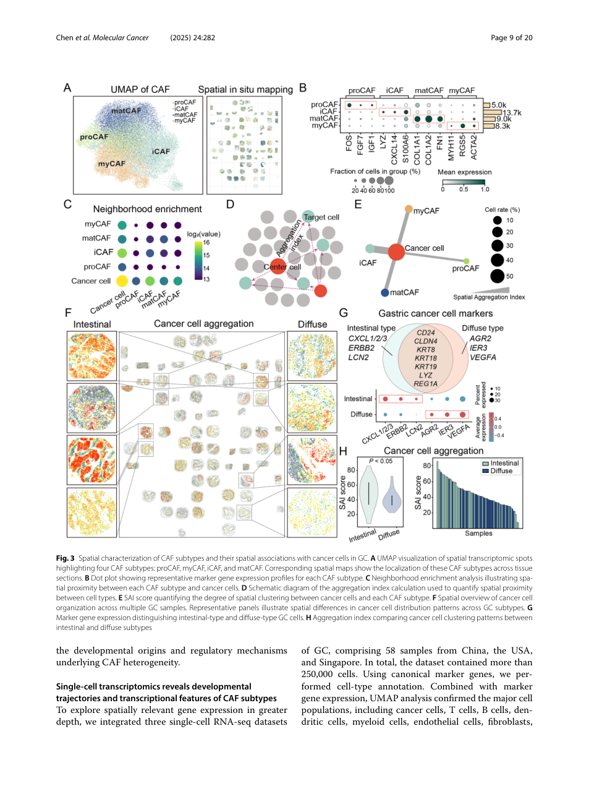

简明图注：Fig. 3 在 71 例空间队列中比较 proCAF、iCAF、matCAF、myCAF 与癌细胞的邻近和 SAI；完整 panel、公式低置信处和来源句子 ID 见技术附录。

## 04｜THBS1 和 ZFP36 为什么会成为两条候选轴？

感染分层锁定这两个基因后，轨迹分析又把 proCAF 放在较早状态，并推断其向 iCAF、matCAF 和 myCAF 三个分支转变；THBS1 和 ZFP36 沿 fibroblast terminal state 增加。这是状态轨迹，不是谱系追踪，也不能证明 H. pylori 驱动了这条变化。

在 TCGA 和 ACRG 中，THBS1 与 ZFP36 的表达相关系数分别为 `r = 0.34` 和 `r = 0.45`，均为 `P < 0.001`。高表达组总体生存更短：THBS1 在 TCGA 为 183 对 185 例、`P = 0.0138`，在 ACRG 为 150 对 150 例、`P = 0.0101`；ZFP36 在 TCGA 为 184 对 184 例、`P = 0.0134`，在 ACRG 为 24 对 276 例、`P = 0.0386`。

Fig. 5 值得看，因为它把感染分层、轨迹、两队列相关和四组生存曲线放在同一页，也暴露出缺失的分组人数、效应量和内部口径冲突。

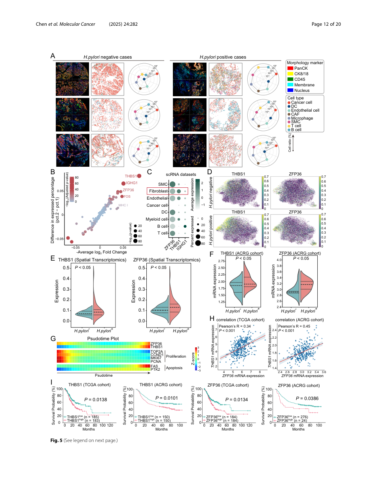

简明图注：Fig. 5 基于 71 例空间队列，并连接 ACRG、TCGA 与 CAF pseudotime；原文没有报告空间队列的 H. pylori 阳性/阴性人数，Fig. 5B 图注方向与 Results 相反，四组生存分析也没有 HR 或充分的多变量模型。完整 panel、样本数和来源句子 ID 见技术附录。

## 05｜为什么 THBS1+ CAF 会指向 Treg-rich 生态位？

在 H. pylori 阳性与阴性肿瘤的比较中，THBS1 主要富集于 matCAF。进一步把 CAF 按 THBS1 表达分层后，THBS1+ CAF 富集 FOXP3/TGF-β 和 CD4+ T-cell activation 相关程序。

作者把空间 T 细胞拆成 CTL（细胞毒性 T 淋巴细胞）、Treg、Th1、Th2、Th17 和增殖型 T 细胞 6 类。THBS1+ CAF 相对 THBS1− CAF 的 Treg SAI 更高（`P < 0.05`），但正文和图注没有给出 Fig. 6F 的精确 `P` 值、绘图 cell 数、贡献患者/FOV 数或患者级聚合方式，Methods 也没有公开 THBS1+ 的表达阈值。

在 THBS1+ CAF 背景下，Treg recruitment 高、低两组各 19 例，总体生存不同（`P = 0.007`）。配体—受体模型又把 WNT5A–FZD6 和 WNT5B–FZD5 列为突出互作；前者是患者分层关联，后者是计算预测。

这张图值得看的是，空间邻近、19 对 19 例生存分层和 WNT5–FZD 预测被放在同一链条上，但没有一项是 CAF 特异性扰动。

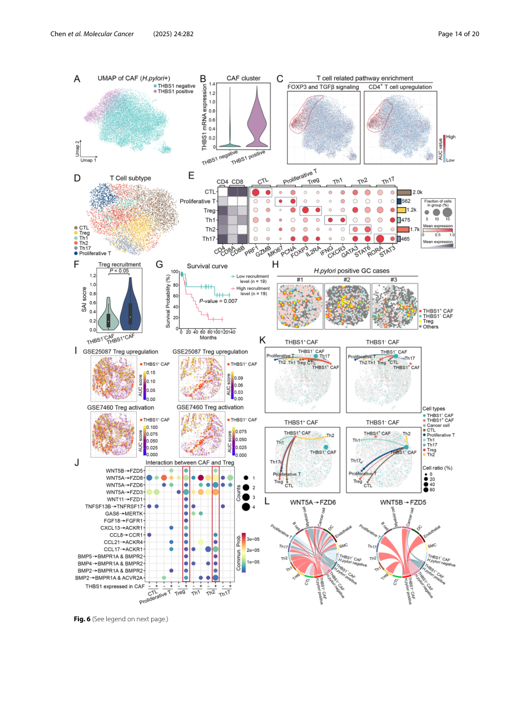

简明图注：Fig. 6 比较 THBS1+ 与 THBS1− CAF 的通路、Treg 空间邻近、19 对 19 例生存分层和候选互作轴；细胞/邻域层 SAI 的绘图 n、患者/FOV 贡献与 THBS1+ 阈值未报告。它支持空间关联与计算推断，尚不能证明 WNT5–FZD 直接招募或稳定 Treg。

## 06｜ZFP36–FN1 这条链有多少直接证据？

作者先筛出在 CAF 中与 ZFP36 呈 `Pearson R < -0.2`、且 3′UTR 至少含 5 个 ATTTA motifs 的基因，得到 735 个候选。FN1 是其中负相关最强且排名稳定的靶点之一。

随后，原文所称的 4 个“独立样本”均来自同一 HGC-27 胃癌细胞系的 LACE-seq 文库，显示 ZFP36 可结合 FN1 3′UTR。这一步提供了 RNA—蛋白结合证据，但不是跨生物来源复现，也没有证明结合后在患者 CAF 中必然导致 FN1 降低。

CIBERSORT-ABS（bulk 表达免疫去卷积）显示，TCGA 中 FN1 表达与 activated CD8+ T cells、γδ T cells 的推定比例正相关；图中只有色阶和显著性星号，没有给出这些比较的精确 `r`、`P` 与有效样本数。另一组配体—受体和空间通讯模型预测，与 FN1− CAF 相比，FN1+ CAF 和多类 T 细胞联系更广，其中也包括 CD86–CTLA4 等可能抑制性互作；“更多互作”不等于“激活”。

这张图值得看的是，735 个候选筛选、同一细胞系的 4 个文库、bulk 去卷积和空间通讯分别回答不同层级的问题，不能合并成一条已证实的因果通路。

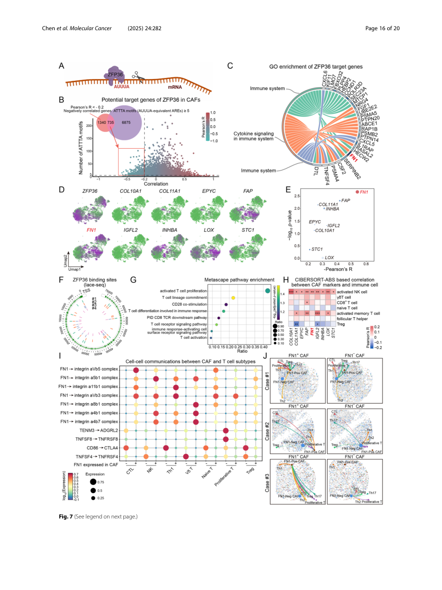

简明图注：Fig. 7 从 735 个候选靶点收敛到 FN1，并连接同一 HGC-27 细胞系的 4 个 LACE-seq 文库、bulk 免疫去卷积和空间通讯推断；它支持 FN1 3′UTR 结合和候选模型，不证明 CAF 中的 FN1 降解或 CTL 功能变化。

## 07｜两条证据强度不同的 CAF 轴，为什么还能放进同一模型？

THBS1 轴对应 Treg-rich 空间生态位，ZFP36–FN1 轴则与细胞毒 T 细胞参与相关。作者认为一个方向可能增强免疫调节，另一个方向可能削弱免疫激活，因此把二者纳入同一个 immune-cold 模型。

但两条链的证据并不对等。ZFP36–FN1 至少有 RNA 结合实验；THBS1–WNT5–FZD 主要来自通路富集、空间邻近和配体—受体推断。把它们写成已经证实的因果通路，会超过论文设计。

## 08｜这项研究真正改变了什么？

它把“H. pylori 阳性胃癌的免疫环境不同”推进成可拆解的空间问题：先区分 CAF 状态，再定位它们与 Treg、CTL 的邻近关系，最后寻找可验证的调控分子。

近期最现实的价值是研究分层。THBS1+ CAF–Treg 邻域和 ZFP36–FN1 程序可以作为组织层面的候选特征，用于选择后续功能实验和验证队列；它们还不是经过前瞻试验确认的预后标志物或治疗靶点。

## 09｜这些结果仍需要冷静看待

首先，71 例空间样本来自单一医院的历史 FFPE 队列，H. pylori、Lauren 分型、组织区域和临床阶段之间可能存在混杂，外推到其他人群前需要独立空间队列。

其次，Treg 邻近、WNT5–FZD 互作和 FN1+ CAF–CTL 通讯主要是空间或计算推断。论文没有进行 CAF-specific THBS1、ZFP36、WNT5 或 FN1 扰动，也没有证明阻断这些轴能改善免疫治疗结局。

第三，LACE-seq 使用 HGC-27 癌细胞而非原代 CAF；TCGA/ACRG 的生存和免疫分析来自 bulk 数据。相关性不能替代原位细胞特异性机制，THBS1/ZFP36 高表达也不能直接视为独立预后因素。

第四，原文内部有三处不能静默消除的不一致：Results 写 THBS1/ZFP36 在 H. pylori 阳性组上调，Fig. 5B 图注却写阴性组；亚型结果写 THBS1 偏 matCAF、ZFP36 偏 proCAF，后文又把两者概括为 proCAF 程序；Methods 称生存按中位数分组，但 ACRG 的 ZFP36 高、低组实际为 24 对 276 例。

最后，SAI 是作者自定义、默认 `n_neighbors=30` 的距离惩罚指标，结果会受组织密度和参数影响；本地 PDF 中公式还有符号抽取噪音。原文也没有交代历史队列的 H. pylori 判定方式、THBS1+ CAF 的精确阈值，以及空间统计如何处理患者和视野内聚类。

出版社在线补充文件共 7 页、包含 Fig. S1–S6，但本项目尚未为它建立句子 ID，也未把补充图纳入 Results/Methods 覆盖计数；当前也未见单列 Source Data 文件。补充图证据不能冒充已经完成本地审计的材料。

## 10｜对新的胃癌研究，哪些设计可以直接借鉴？

可以把同一空间框架前移到 H. pylori 阳性胃炎、肠化生、异型增生和早癌连续谱，观察 CAF–Treg/CTL 邻域是在癌前阶段出现，还是只在肿瘤形成后建立。

更有辨识力的设计是加入根除前后配对样本，把自然扰动与空间变化连接起来。候选轴进入转化研究前，至少需要原代 CAF 中的分子扰动、明确的免疫功能读出、独立组织队列，以及对 SAI 参数和替代空间指标的敏感性分析。

---

## 技术附录

以下内容保留原笔记的论文基本信息、主图 panel、来源句子范围、Results/Methods 覆盖、方法参数、解析质量与证据边界；覆盖表是范围级审计，不冒充逐句双语翻译。

### 本文目录

- [基本信息](#基本信息)
- [本论文主图](#本论文主图)
- [生物学故事前情](#生物学故事前情)
- [重要缩写表](#重要缩写表)
- [论文详细解读](#论文详细解读)
- [研究问题与科学背景](#研究问题与科学背景)
- [研究设计与数据结构](#研究设计与数据结构)
- [方法速览与分析框架](#方法速览与分析框架)
- [原文结果完整梳理](#原文结果完整梳理)
  - [胃癌病理类型具有不同空间结构、细胞组成和免疫景观](#胃癌病理类型具有不同空间结构、细胞组成和免疫景观)
  - [CAF 包含四类功能亚型并具有不同空间分布偏好](#caf-包含四类功能亚型并具有不同空间分布偏好)
  - [单细胞转录组揭示 CAF 亚型发育轨迹和转录特征](#单细胞转录组揭示-caf-亚型发育轨迹和转录特征)
  - [H. pylori 感染重塑 CAF 组成并诱导 THBS1 和 ZFP36 表达](#h-pylori-感染重塑-caf-组成并诱导-thbs1-和-zfp36-表达)
  - [THBS1+ CAF 与 Treg 空间邻近，WNT5-FZD 是预测互作轴](#thbs1-caf-与-treg-空间邻近，wnt5-fzd-是预测互作轴)
  - [ZFP36-FN1 有哪些结合、相关与通讯证据](#zfp36-fn1-有哪些结合、相关与通讯证据)
- [作者结论与证据强度](#作者结论与证据强度)
- [独立方法学详解](#独立方法学详解)
- [统计学分析方法](#统计学分析方法)
- [生物学与临床意义](#生物学与临床意义)
- [局限性与危险假设](#局限性与危险假设)
- [深度研究洞察](#深度研究洞察)
- [可借鉴或迁移的思路](#可借鉴或迁移的思路)
- [覆盖审计](#覆盖审计)

### 基本信息

- 期刊: Molecular Cancer
- 年份: 2025
- DOI: 10.1186/s12943-025-02490-9
- 题名: Spatial and functional dissection of cancer-associated fibroblasts-mediated immune modulation in H. pylori-associated gastric cancer
- 第一作者: Bonan Chen, Hongzhen Tang, Xiaohong Zheng 等
- 通讯作者: Fengbin Zhang, Wei Kang, Kam Tong Leung, Ka Fai To
- 研究领域: 胃癌、H. pylori、癌相关成纤维细胞、空间转录组、单细胞转录组、肿瘤免疫微环境
- 关键词: CAF, gastric cancer, spatial transcriptomics, H. pylori, Lauren classification, Treg, CTL, THBS1, ZFP36, FN1
- 本地 PDF: `pdfs/processed/hp-gc-caf-immune-modulation-molecular-cancer-2025.pdf`
- 数据来源: 空间数据 GEO `GSE308624`；LACE-seq GEO `GSE309051`；Singapore scRNA-seq `GSE183904`；ACRG `GSE62254`；另使用 USA cohort、TCGA 与 MSigDB 的 `GSE7460`/`GSE25087` Treg gene sets（`P018.S0035-P018.S0041`）。
- 代码来源: SAI 实现与分析脚本 `https://github.com/AI-Lab-Pathology/SAI`（`P018.S0042`）。
- PDF 解析质量:
  - 使用 `scripts/build_pdf_llm_pack.py` 先抽取全文，再基于句子 ID 写作。
  - 解析结果：20 页，740 个句子；Results 328 句，Methods 130 句。
  - 主体正文、图注、Methods 和统计分析均可解析；图内文字、公式和页面跨栏处存在少量错序或断词，SAI 公式处尤其需要回看 PDF。
  - `P008.S0023` 与 `P009.S0002` 被 Fig. 2 图注 `P008.S0024-P008.S0029` 及页眉 `P009.S0001` 打断；覆盖审计保留全部 ID，正文按连续语义重接。
  - Manifest 将语义上属于 Discussion 末段的 `P017.S0022-P018.S0003` 标为 Results；这是章节分类错分，不把它当成新结果。
  - LLM pack: `tmp/hp-gc-caf-immune-modulation-llm-pack.md`
- 在线补充材料状态：出版社提供一份 [7 页 Supplementary material 1](https://media.springernature.com/original/springer-static/esm/art%3A10.1186%2Fs12943-025-02490-9/MediaObjects/12943_2025_2490_MOESM1_ESM.pdf)，只含 Fig. S1–S6（`P018.S0025`）。本项目未保存或句子化该 PDF，补充图未进入下述覆盖计数；出版社页面当前也未见独立 Supplementary Table 或 Source Data 链接。
- 图像截取说明: 主图以整页渲染方式保存，避免漏 panel；后续需要展示时可再按 panel 裁剪。
- LLM 覆盖审计:
  - Results 覆盖：`P001.S0022-P002.S0004`, `P006.S0017-P013.S0058`，并结合 Fig. 1-7 图注。
  - Methods 覆盖：`P001.S0017-P001.S0021`, `P003.S0009-P006.S0016`。
  - 低置信句子：`P004.S0032-P004.S0034` 的 SAI 公式抽取有符号噪音；若复现 SAI，必须回到 PDF/代码确认公式。

---

### 本论文主图

| 原文图表 | 原文图题/核心信息 | 是否截取 | 图像文件 | 放置位置 |
|---|---|---|---|---|
| Fig. 1 | 分析框架，以及作者提出、尚待功能扰动验证的 CAF 免疫调控模型 | 是 | `assets/gastric-cancer/2025-hp-gc-caf-immune-modulation/page07.png` | [方法速览与分析框架](#方法速览与分析框架) |
| Fig. 2 | 空间转录组揭示 GC 细胞组成和 Lauren/H. pylori 亚型差异 | 是 | `assets/gastric-cancer/2025-hp-gc-caf-immune-modulation/page08.png` | [胃癌病理类型具有不同空间结构、细胞组成和免疫景观](#胃癌病理类型具有不同空间结构、细胞组成和免疫景观) |
| Fig. 3 | CAF 四类亚型及其与癌细胞的空间关系 | 是 | `assets/gastric-cancer/2025-hp-gc-caf-immune-modulation/page09.png` | [CAF 包含四类功能亚型并具有不同空间分布偏好](#caf-包含四类功能亚型并具有不同空间分布偏好) |
| Fig. 4 | 单细胞整合、CAF 发育轨迹和空间反卷积验证 | 是 | `assets/gastric-cancer/2025-hp-gc-caf-immune-modulation/page10.png`; `page11.png` | [单细胞转录组揭示 CAF 亚型发育轨迹和转录特征](#单细胞转录组揭示-caf-亚型发育轨迹和转录特征) |
| Fig. 5 | H. pylori 相关 CAF 扩增、THBS1/ZFP36 上调和预后关联 | 是 | `assets/gastric-cancer/2025-hp-gc-caf-immune-modulation/page12.png`; `page13.png` | [H. pylori 感染重塑 CAF 组成并诱导 THBS1 和 ZFP36 表达](#h-pylori-感染重塑-caf-组成并诱导-thbs1-和-zfp36-表达) |
| Fig. 6 | THBS1+ CAF–Treg 空间聚集、生存关联与 WNT5-FZD 预测互作 | 是 | `assets/gastric-cancer/2025-hp-gc-caf-immune-modulation/page14.png`; `page15.png` | [THBS1+ CAF 与 Treg 空间邻近，WNT5-FZD 是预测互作轴](#thbs1-caf-与-treg-空间邻近，wnt5-fzd-是预测互作轴) |
| Fig. 7 | ZFP36–FN1 结合、bulk 相关与 FN1+ CAF–T 细胞通讯推断 | 是 | `assets/gastric-cancer/2025-hp-gc-caf-immune-modulation/page16.png`; `page17.png` | [ZFP36-FN1 有哪些结合、相关与通讯证据](#zfp36-fn1-有哪些结合、相关与通讯证据) |
| Fig. S1–S6 | 细胞通讯、marker、CAF 基因表达、FN1 3′UTR motif、SCENIC 与 T 细胞亚群 | 否；官网可得 | [Supplementary material 1](https://media.springernature.com/original/springer-static/esm/art%3A10.1186%2Fs12943-025-02490-9/MediaObjects/12943_2025_2490_MOESM1_ESM.pdf) | 未进入本地句子 ID 与覆盖审计 |

### 生物学故事前情

胃癌不是单纯由上皮细胞突变驱动的疾病。特别是在 H. pylori 相关胃癌中，慢性炎症、上皮损伤、间质重塑和免疫逃逸长期共存。H. pylori 既能通过炎症和上皮损伤推动 Correa cascade，也能改变基质细胞和免疫细胞的状态。传统研究常把重点放在上皮细胞、炎症因子或免疫细胞浸润量上，但这篇文章把问题推进到一个更细的层面：H. pylori 是否通过重编程 CAF，塑造局部免疫抑制空间生态位？

CAF 不是一种均质细胞。作者沿用其既往 pan-cancer CAF 分类，把 CAF 拆成 proCAF、iCAF、myCAF 和 matCAF 四类。这里真正的问题不是“CAF 多不多”，而是不同 CAF 亚型在肿瘤组织里站在哪里、靠近谁、和哪些免疫细胞发生信号互作、是否在 H. pylori 阳性背景下偏向免疫抑制程序。

读这篇文章的主线可以概括为作者提出的两轴模型。直接观察到的是 THBS1+ CAF 与 Treg 空间邻近，WNT5A-FZD6/WNT5B-FZD5 来自配体—受体预测；ZFP36 与 FN1 负相关，同一 HGC-27 细胞系的 4 个 LACE-seq 文库支持 ZFP36 结合 FN1 3′UTR。作者据此提出 Treg 稳定、FN1 mRNA 降低和 CTL 参与减少的解释，但这些下游环节尚无 CAF 特异性扰动证明。

### 重要缩写表

| 缩写 | 中文含义 | 本文语境中的具体指代 | 阅读时注意 |
|---|---|---|---|
| GC | 胃癌 | 本文空间队列和外部单细胞/队列数据中的胃癌样本 | Lauren intestinal/diffuse 和 H. pylori 状态是关键分层 |
| H. pylori | 幽门螺杆菌 | 感染状态作为肿瘤微环境分层变量 | 文中多数机制为关联/空间推断，不等于直接感染扰动实验证明 |
| CAF | 癌相关成纤维细胞 | proCAF、iCAF、matCAF、myCAF 四类亚型 | 亚型来自既往分类框架和标记基因，不是新发现的全部 CAF 类型 |
| proCAF | progenitor CAF | 发育轨迹早期状态，THBS1/ZFP36 程序在讨论中被解释为早期感染响应 | “progenitor” 是轨迹推断，不是谱系追踪证明 |
| iCAF | inflammatory CAF | 与癌细胞空间距离最近的 CAF 亚型之一 | 与 THBS1/ZFP36 免疫抑制主轴不是完全同一概念 |
| matCAF | matrix CAF | 基质/ECM 相关 CAF，THBS1 表达更偏向此类 | ECM 程序和免疫抑制可能相关但机制需验证 |
| Treg | 调节性 T 细胞 | THBS1+ CAF 邻近和 WNT5-FZD 互作的主要免疫细胞对象 | 空间邻近和 ligand-receptor 推断不证明真实趋化 |
| CTL | 细胞毒 T 淋巴细胞 | 计算预测中与 FN1+ CAF 互作更广的细胞毒免疫细胞对象 | FN1 在本文中被解释为更偏免疫激活相关，和“ECM 物理屏障”常识存在语境差异 |
| THBS1 | Thrombospondin 1 | H. pylori 阳性 CAF 上调基因，关联 Treg 空间聚集和差预后 | 可能通过 TGF-beta/CD47-SIRPalpha 等既有机制参与免疫抑制，但本文主推 WNT5-FZD |
| ZFP36 | AU-rich element binding protein | H. pylori 阳性 CAF 上调，预测并经 LACE-seq 支持结合 FN1 3'UTR | 直接功能扰动不足，是本文机制链条的关键待验证点 |
| FN1 | Fibronectin 1 | ZFP36 负相关并被 LACE-seq 支持为结合靶标；计算预测中 FN1+ CAF 与 CTL 互作更强 | 本文中 FN1 被放在“促 CTL 互作”的语境，不能简单套用免疫排斥模型 |
| SAI | Spatial Aggregation Index | 作者用于量化两类细胞空间邻近/聚集的距离惩罚指标 | PDF 公式抽取有噪音；复现需回看原文公式或代码 |
| LACE-seq | Laser-assisted crosslinking and immunoprecipitation sequencing | 用于验证 ZFP36 RNA 结合靶点 | 在 HGC-27 细胞中完成，不是在 CAF 原代细胞中直接完成 |

### 论文详细解读

#### 研究问题与科学背景

作者的出发点是 H. pylori 相关胃癌的免疫抑制如何由 CAF 组织起来。背景中，H. pylori 被描述为胃癌发生的重要微生物驱动因素，能够造成慢性炎症、上皮损伤、萎缩、肠化生和间质免疫重塑。作者强调 Lauren 分型中 intestinal-type 与 diffuse-type 对 H. pylori 诱导炎症的依赖程度不同，因此需要把病理分型、感染状态、空间结构和 CAF 亚型放在一起分析。

现有缺口是：已经知道 CAF 能促进炎症、ECM remodeling、血管生成和免疫逃逸，也知道 CAF 有多种亚型，但不知道 H. pylori 如何改变 CAF 亚型组成、这些 CAF 与免疫细胞在空间上如何相邻、以及是否存在可解释 Treg 聚集或 CTL 抑制的分子轴。

#### 研究设计与数据结构

空间转录组队列来自香港 Prince of Wales Hospital 的 71 例 FFPE 胃癌样本，诊断时间为 1999-2006 年。作者使用 NanoString CosMx SMI 做空间转录组和蛋白成像，识别主要细胞类型、CAF 亚型、T 细胞亚群及空间互作。

单细胞 RNA-seq 由三个独立胃癌队列整合：China cohort 10 例、USA cohort 22 例、Singapore cohort 26 例，合计超过 250,000 个细胞。外部预后和免疫浸润关联来自 TCGA STAD 和 ACRG 胃癌队列。ZFP36 靶标验证使用 HGC-27 细胞做 LACE-seq。

#### 方法速览与分析框架

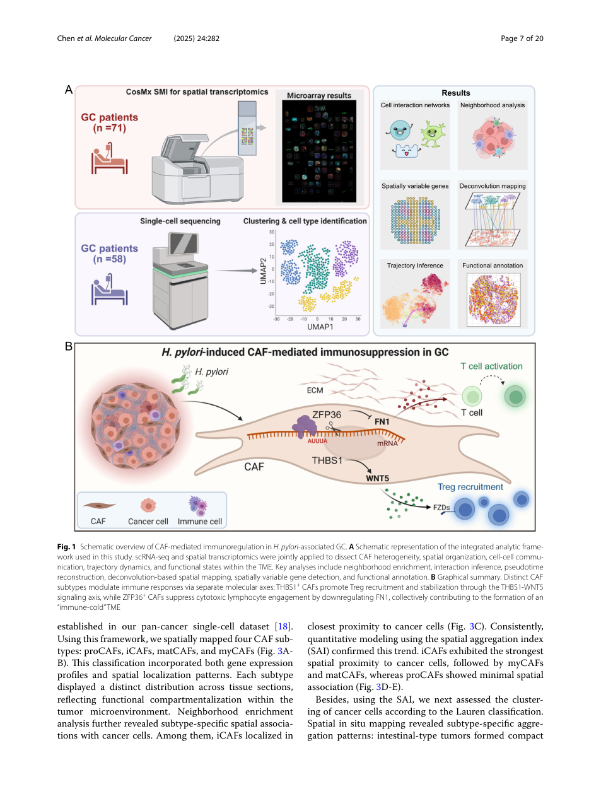

中文图注（基于原文图注）：Fig. 1A 展示整合分析框架：scRNA-seq 与空间转录组共同用于 CAF 异质性、空间定位、细胞通讯、轨迹动态和功能状态分析；关键步骤包括 neighborhood enrichment、ligand-receptor inference、pseudotime reconstruction、spatial deconvolution、spatially variable gene detection 和 functional annotation。Fig. 1B 是作者提出、尚待功能扰动验证的机制模型：THBS1-WNT5 轴可能关联 Treg recruitment/stabilization，ZFP36-FN1 轴可能关联 cytotoxic lymphocyte engagement，两者被解释为共同塑造 immune-cold TME。

本文分析链条是：先在空间数据中识别主要细胞类型和 Lauren/H. pylori 分层差异，再映射四类 CAF 亚型，随后用单细胞整合和 Tangram 反卷积验证 CAF 亚型空间分布，最后围绕 H. pylori 阳性样本中上调的 THBS1 和 ZFP36 分别构建 Treg 轴和 CTL/FN1 轴。

### 原文结果完整梳理

#### 胃癌病理类型具有不同空间结构、细胞组成和免疫景观

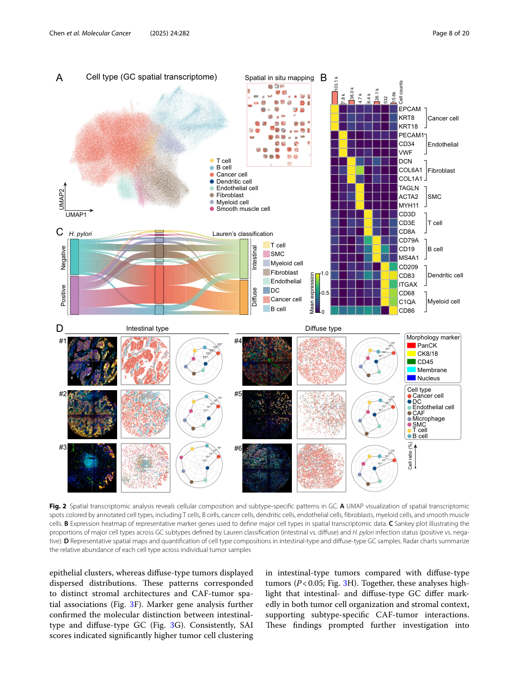

中文图注（基于原文图注）：Fig. 2A 用 UMAP 展示空间转录组中注释的 T cell、B cell、cancer cell、DC、endothelial cell、fibroblast、myeloid cell、smooth muscle cell 等主要细胞类型。Fig. 2B 展示用于定义主要细胞类型的 marker gene。Fig. 2C 用 Sankey plot 连接 Lauren 分型和 H. pylori 感染状态下的细胞比例。Fig. 2D 展示 intestinal-type 与 diffuse-type 胃癌代表性空间图和细胞组成量化。

原文结果梳理：作者首先整合 scRNA-seq 和空间转录组构建 GC TME 空间图谱，并明确分析包括 neighborhood enrichment、ligand-receptor inference、pseudotime、deconvolution 和 functional annotation（`P006.S0017-P006.S0020`）。空间数据注释出主要免疫、基质和恶性上皮群体（`P006.S0026-P006.S0027`）。Lauren 分型显示明显空间差异：intestinal-type 中癌细胞形成紧密 epithelial clusters，CAF 和免疫细胞更多位于肿瘤边缘；diffuse-type 中癌细胞、CAF 和免疫浸润更混杂、结构更紊乱（`P006.S0028-P006.S0032`）。细胞通讯分析进一步提示 intestinal-type 的信号更结构化和有方向性，而 diffuse-type 的 fibroblast、T cell、myeloid cell 通讯更分散，DC-derived signaling 和 T-cell communication 相对减弱（`P006.S0033-P006.S0043`）。

这个结果支持“胃癌病理亚型不仅形态不同，空间免疫生态也不同”。但它不能证明 Lauren 分型本身导致免疫差异，因为 H. pylori 状态、肿瘤分期、组织区域和样本选择都可能共同影响空间结构。

#### CAF 包含四类功能亚型并具有不同空间分布偏好

中文图注（基于原文图注）：Fig. 3A 显示空间数据中 proCAF、myCAF、iCAF、matCAF 四类 CAF 的 UMAP 和组织空间分布。Fig. 3B 展示四类 CAF marker gene。Fig. 3C 用 neighborhood enrichment 描述 CAF 亚型与 cancer cell 的空间邻近。Fig. 3D 说明 SAI 计算思路。Fig. 3E 用 SAI 量化 CAF 亚型与癌细胞聚集程度。Fig. 3F-H 展示 intestinal/diffuse 胃癌中癌细胞空间组织、marker 和聚集指数差异。

原文结果梳理：作者使用既往 pan-cancer CAF 分类框架，把胃癌空间数据中的 CAF 映射为 proCAF、iCAF、matCAF 和 myCAF（`P006.S0044-P007.S0006`）。Neighborhood enrichment 显示不同 CAF 亚型与 cancer cell 的空间关系不同，其中 iCAF 与癌细胞最近（`P007.S0007-P007.S0011`）。SAI 量化结果支持这一趋势：iCAF 与 cancer cells 的空间聚集最强，其次是 myCAF 和 matCAF，proCAF 最弱（`P007.S0010-P007.S0011`）。

作者还用 SAI 比较 Lauren 分型中的癌细胞聚集：intestinal-type 呈现更紧密的 epithelial clusters，diffuse-type 更分散，且 intestinal-type 的 tumor cell clustering 更高（`P007.S0012-P008.S0022`）。这说明 CAF-肿瘤空间互作不是均质背景，而依赖组织结构和病理亚型。

#### 单细胞转录组揭示 CAF 亚型发育轨迹和转录特征

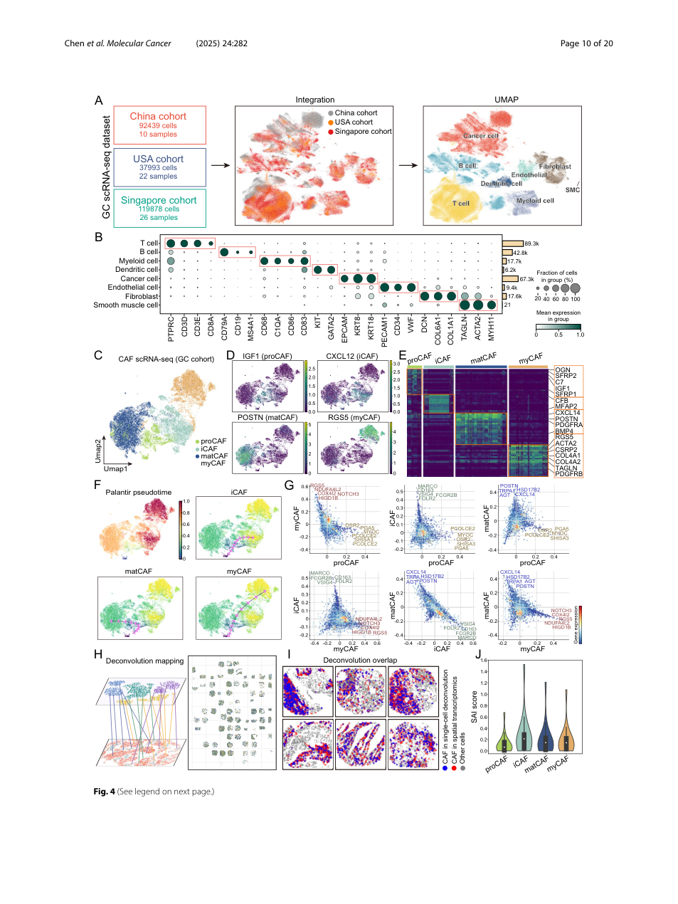

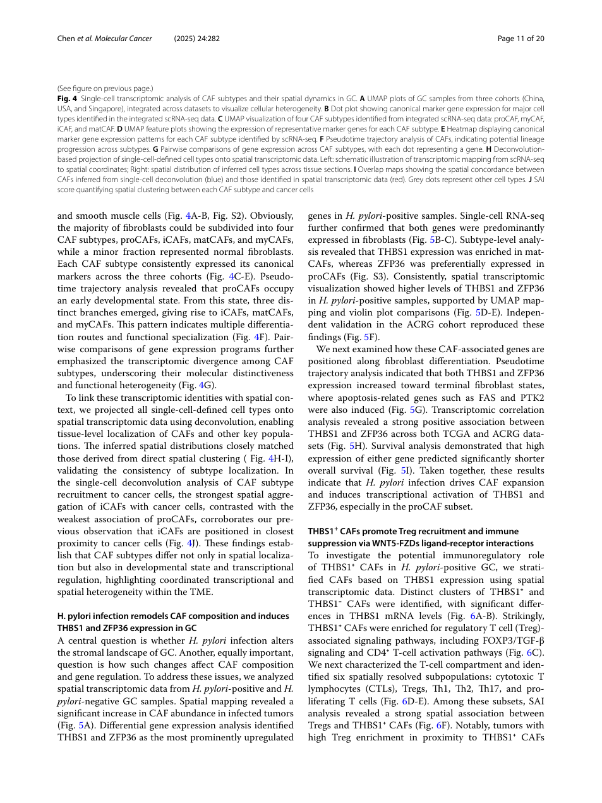

中文图注（基于原文图注）：Fig. 4A-B 展示 China、USA、Singapore 三个 scRNA-seq 胃癌队列整合后的主要细胞类型。Fig. 4C-E 展示四类 CAF 亚型及其 marker。Fig. 4F 显示 CAF pseudotime trajectory：proCAF 位于早期，向 iCAF、matCAF 和 myCAF 三个分支分化。Fig. 4G 展示 CAF 亚型间差异基因。Fig. 4H-I 用 Tangram 将单细胞定义的细胞类型投射回空间转录组，并与空间直接聚类结果重叠。Fig. 4J 用 SAI 比较各 CAF 亚型与 cancer cell/smooth muscle cell 的空间聚集。

原文结果梳理：作者整合三个单细胞数据集，共 58 个胃癌样本、超过 250,000 个细胞（`P009.S0003-P009.S0006`）。CAF 可再次分为 proCAF、iCAF、matCAF、myCAF，少数为 normal fibroblast，各亚型在三个队列中表达各自 canonical markers（`P011.S0018-P011.S0020`）。Palantir 轨迹分析显示 proCAF 处于早期状态，随后分成 iCAF、matCAF、myCAF 三个分支，提示 CAF 功能专门化可能来自多路线状态转变（`P011.S0021-P011.S0026`）。

为了把单细胞身份连接到组织位置，作者用 Tangram 将 scRNA-seq cell types 投射到空间转录组；推断空间分布与直接空间聚类基本一致（`P011.S0027-P011.S0029`）。反卷积后的 SAI 再次显示 iCAF 与癌细胞聚集最强、proCAF 最弱，复现 Fig. 3 的观察（`P011.S0030-P011.S0032`）。

#### H. pylori 感染重塑 CAF 组成并诱导 THBS1 和 ZFP36 表达

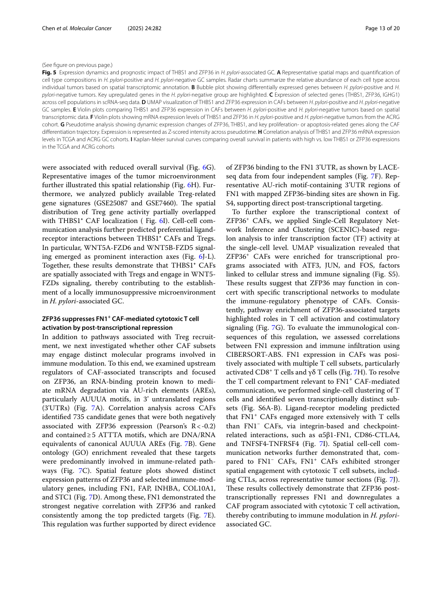

中文图注（基于原文图注）：Fig. 5A 比较 H. pylori 阳性与阴性胃癌中的空间细胞组成。Fig. 5B 展示 H. pylori 阳性与阴性肿瘤的差异表达基因。Fig. 5C 显示 THBS1、ZFP36、IGHG1 在 scRNA-seq 细胞群中的表达。Fig. 5D-E 展示 CAF 中 THBS1 和 ZFP36 的 UMAP/violin 表达差异。Fig. 5F 在 ACRG 中验证 H. pylori 阳性/阴性肿瘤的 THBS1/ZFP36 表达。Fig. 5G 展示 pseudotime 中 ZFP36、THBS1 及增殖/凋亡相关基因动态。Fig. 5H 展示 TCGA 和 ACRG 中 THBS1 与 ZFP36 表达相关。Fig. 5I 展示 THBS1 或 ZFP36 高低表达与总体生存。

原文结果梳理：作者提出核心问题：H. pylori 是否改变胃癌 CAF landscape，以及这种改变如何影响 CAF 组成和基因调控（`P011.S0033-P011.S0036`）。空间图谱显示感染肿瘤中 CAF abundance 显著增加（`P011.S0037-P011.S0038`）。差异表达分析把 THBS1 和 ZFP36 定位为 H. pylori 阳性样本中最突出上调基因；scRNA-seq 进一步确认两者主要表达于 fibroblasts（`P011.S0039-P011.S0041`）。亚型层面，THBS1 更富集于 matCAF，ZFP36 更偏 proCAF；空间可视化和 ACRG 外部队列支持 H. pylori 阳性样本中两者更高（`P011.S0042-P011.S0047`）。

轨迹分析显示 THBS1 和 ZFP36 沿 fibroblast terminal state 增加，同时 FAS、PTK2 等 apoptosis-related genes 也被诱导（`P011.S0047-P011.S0049`）。TCGA 和 ACRG 中两者分别呈 `r = 0.34` 和 `r = 0.45` 的正相关，均为 `P < 0.001`；高表达组生存比较依次为 THBS1 TCGA 183/185 例、`P = 0.0138`，THBS1 ACRG 150/150 例、`P = 0.0101`，ZFP36 TCGA 184/184 例、`P = 0.0134`，ZFP36 ACRG 24/276 例、`P = 0.0386`（`P011.S0050-P011.S0053`, Fig. 5H-I）。作者据此总结：H. pylori 感染推动 CAF 扩增，并诱导 THBS1/ZFP36 转录激活（`P011.S0054`）。

需要注意：THBS1/ZFP36 与 H. pylori、CAF 和预后之间是空间/转录组关联加队列验证，并非感染干预或 CAF 特异性敲除证明。原文 Fig. 5B 图注称突出的是阴性组上调（`P013.S0006-P013.S0008`），与正文及 Fig. 5D-F 所述阳性组更高（`P011.S0039`, `P011.S0044-P011.S0047`）方向相反；本文按正文方向叙述，同时保留该疑似图注错误。

#### THBS1+ CAF 与 Treg 空间邻近，WNT5-FZD 是预测互作轴

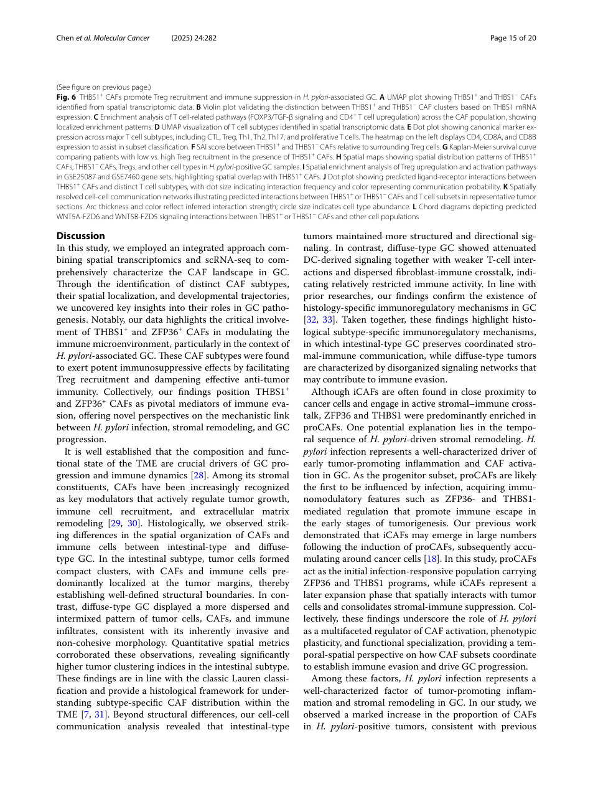

中文图注（基于原文图注）：Fig. 6A-B 区分 THBS1+ 与 THBS1- CAF，并用 violin plot 验证 THBS1 表达差异。Fig. 6C 展示 THBS1+ CAF 中 FOXP3/TGF-beta 和 CD4+ T cell upregulation 相关通路富集。Fig. 6D-E 注释空间数据中的 CTL、Treg、Th1、Th2、Th17 和 proliferative T cells。Fig. 6F 用 SAI 比较 THBS1+/- CAF 与 Treg 的空间关系。Fig. 6G 显示 THBS1+ CAF 背景下 Treg recruitment 高低与生存差异。Fig. 6H-I 展示 THBS1+ CAF、Treg 及 Treg gene activity 的空间重叠。Fig. 6J-L 展示 THBS1+ CAF 与 T cell subsets 的 ligand-receptor 推断，突出 WNT5A-FZD6 和 WNT5B-FZD5。

原文结果梳理：作者把 CAF 按 THBS1 表达分层，识别出 THBS1+ 和 THBS1- CAF（`P011.S0055-P011.S0057`）。THBS1+ CAF 富集 Treg 相关通路，包括 FOXP3/TGF-beta signaling 和 CD4+ T-cell activation pathways（`P011.S0058-P011.S0059`）。随后作者在空间数据中注释 T 细胞六类亚群：CTL、Treg、Th1、Th2、Th17 和 proliferating T cells（`P011.S0060-P011.S0061`）。THBS1+ CAF 相对 THBS1- CAF 的 Treg SAI 更高（Fig. 6F, `P < 0.05`），但原文没有给出该细胞/邻域层分布的绘图 cell 数、贡献患者或 FOV 数、患者级聚合方式和具体检验；THBS1+ CAF 背景下 Treg recruitment 高、低组各 19 例，生存曲线 `P = 0.007`（Fig. 6G）。Treg gene activity 与 THBS1+ CAF 定位部分重叠（`P011.S0062-P013.S0022`）。

细胞通讯分析预测 THBS1+ CAF 与 Tregs 有偏好性 ligand-receptor 互作，其中 WNT5A-FZD6 和 WNT5B-FZD5 是突出轴（`P013.S0023-P013.S0025`）。作者据此提出 THBS1+ CAF 可能通过 WNT5-FZD signaling 参与局部免疫抑制；直接数据支持的是空间相关和预测互作，不是招募机制（`P013.S0026`）。

证据边界：WNT5-FZD 是 ligand-receptor inference，不是蛋白互作或阻断实验。Treg 招募也可能由多种 chemokine、TGF-beta、抗原呈递或组织区域因素共同驱动。

#### ZFP36-FN1 有哪些结合、相关与通讯证据

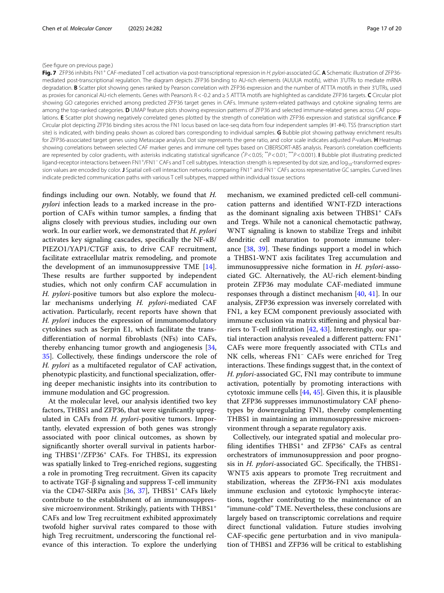

中文图注（基于原文图注）：Fig. 7A 图示作者提出的 ZFP36–mRNA degradation 模型。Fig. 7B 将 ZFP36 负相关基因和 ATTTA motif 数量结合，筛选候选靶点。Fig. 7C 展示 ZFP36 target genes 的 GO 富集。Fig. 7D-E 展示 ZFP36 与 FN1、FAP、INHBA、COL10A1、STC1 等免疫调控相关基因的空间表达和相关性。Fig. 7F 展示原文所称四个独立样本中的 binding sites，但 Methods 说明它们均来自 HGC-27 细胞系。Fig. 7G 展示 ZFP36-associated targets 的 pathway enrichment。Fig. 7H 用 CIBERSORT-ABS 分析 CAF genes 与 immune cell types 的相关性。Fig. 7I-J 展示 FN1+/- CAF 与 T cell subsets 的 ligand-receptor 互作和空间通讯网络。

原文结果梳理：作者在 THBS1-Treg 轴之外寻找另一个 CAF 免疫调控程序，聚焦 ZFP36 这个已知可通过 AU-rich elements 促进 mRNA degradation 的 RNA-binding protein（`P013.S0027-P013.S0029`）。筛选逻辑是：在 CAF 中与 ZFP36 呈 `Pearson R < -0.2`、3′UTR 含不少于 5 个 ATTTA motifs 且通过 `FDR < 0.05` 的基因，共得到 735 个候选靶点（`P013.S0030-P013.S0031`, `P005.S0033-P005.S0039`）。这些靶点富集免疫相关通路（`P013.S0032-P013.S0033`）。在候选基因中，FN1 与 ZFP36 负相关最强且稳定排名靠前（`P013.S0034-P013.S0037`）。原文称四个独立 LACE-seq 样本显示 ZFP36 结合 FN1 3′UTR，但 Methods 只报告同一 HGC-27 细胞系；这支持结合和候选靶向，未证明患者 CAF 中的 FN1 降解（`P003.S0017-P003.S0021`, `P013.S0038-P013.S0041`）。

SCENIC regulon 分析提示 ZFP36+ CAF 富集 ATF3、JUN、FOS 等 stress/immune signaling 相关转录程序（`P013.S0042-P013.S0046`）。ZFP36-associated targets 的 pathway enrichment 指向 T cell activation 和 costimulatory signaling（`P013.S0047-P013.S0048`）。CIBERSORT-ABS 显示 TCGA STAD bulk 中 FN1 表达与多种 T cell subsets 的推定比例正相关，尤其 activated CD8+ T cells 和 gamma-delta T cells（`P013.S0049-P013.S0051`）；Fig. 7H 只用色阶与星号表示相关和显著性，没有逐项报告精确 `r`、`P` 或 TCGA 有效样本数。Ligand-receptor modeling 预测 FN1+ CAF 比 FN1- CAF 更广泛地与 T cells 互作，包括 alpha5beta1-FN1、CD86-CTLA4、TNFSF4-TNFRSF4 等；Fig. 7I-J 同样没有报告参与样本数或量化效应（`P013.S0052-P013.S0057`）。

作者最终提出的假说是：ZFP36 可能通过转录后抑制 FN1，下调一个与 cytotoxic T cell activation 相关的 CAF 程序（`P013.S0058`）。这里最值得注意的是语境差异：FN1 常被视为 ECM barrier 或免疫排斥相关因子，但本文计算结果中 FN1+ CAF 更偏向 CTL/NK 互作；没有降解或免疫功能实验时，不能把 FN1 简单归为免疫抑制或免疫激活。

### 作者结论与证据强度

作者已经较强支持的内容：

- H. pylori 阳性胃癌中 CAF abundance 增加，且 THBS1/ZFP36 在 CAF 中上调。
- Lauren intestinal/diffuse 胃癌有不同空间结构和免疫通讯模式。
- CAF 可分为 proCAF、iCAF、matCAF、myCAF，并具有不同空间偏好；iCAF 与癌细胞空间邻近最强。
- THBS1+ CAF 与 Treg 空间邻近，WNT5A-FZD6/WNT5B-FZD5 是推断出的重要互作轴。
- ZFP36 与 FN1 负相关，并有 LACE-seq 支持 ZFP36 结合 FN1 3'UTR。

合理但尚未完全证明的推断：

- H. pylori 通过诱导 THBS1+ 和 ZFP36+ CAF 主动造成 immune-cold TME。
- THBS1-WNT5-FZD 轴直接招募或稳定 Treg。
- ZFP36 通过抑制 FN1+ CAF 程序导致 CTL activation 下降。

仍未证明的内容：

- CAF-specific THBS1 或 ZFP36 扰动能否改变 Treg/CTL 空间分布。
- WNT5-FZD 阻断能否解除 Treg-rich immunosuppressive niche。
- FN1 在 H. pylori 相关胃癌中到底是促免疫激活、促免疫排斥，还是取决于空间生态位。

### 独立方法学详解

#### 研究对象、样本和数据结构

空间转录组使用 71 例 FFPE 胃癌组织，来自香港 Prince of Wales Hospital 1999-2006 年诊断患者（`P003.S0009-P003.S0013`）。单细胞数据来自 China 10 例、USA 22 例、Singapore 26 例，后两者包含公开数据来源和 GEO GSE183904（`P003.S0014-P003.S0017`）。HGC-27 胃癌细胞系用于 LACE-seq，而不是用于 CAF 功能实验（`P003.S0017-P003.S0021`）。

#### 实验流程和数据生成

CosMx SMI 对 FFPE 切片进行空间转录组分析：切片贴附、HIER、proteinase K 消化、fiducial markers 空间对齐、固定、阻断、杂交、洗涤、上机成像（`P003.S0022-P003.S0033`）。蛋白可视化使用 PanCK、CK8/18、CD45、membrane 和 nucleus 等荧光抗体通道（`P003.S0034-P003.S0036`）。细胞分割使用 Z-stack immunofluorescence，包括 DAPI 和 membrane signals，通过机器学习算法识别细胞边界，再将 RNA transcripts 映射到单细胞及亚细胞坐标（`P003.S0037-P004.S0006`）。

#### 数据预处理和特征构建

scRNA-seq 使用 Python 3.8、Scanpy 1.9.6，三个公开单细胞数据通过 `anndata.concat` 整合（`P004.S0007-P004.S0009`）。低质量细胞过滤标准为 counts < 500、detected genes < 200 或 mitochondrial gene expression > 20%（`P004.S0008`）。归一化和 scale 使用 Scanpy preprocessing，批次效应用 Harmony 校正（`P004.S0010-P004.S0012`）。PCA、Leiden clustering、UMAP 和 marker-based annotation 用于细胞类型注释（`P004.S0013-P004.S0015`）。

#### 空间邻域和 SAI

Neighborhood enrichment 使用 CosMx 空间坐标和细胞类型注释，比较观察到的邻近频率和随机打乱 cell-type labels 后的 null distribution，输出 log observed/expected enrichment scores（`P004.S0016-P004.S0021`）。SAI 是作者自定义的 distance-penalized 指标，整合邻域中 center/target cell 数量、全局细胞数量和局部平均欧氏距离；它按每个 cell 的局部邻域计算并存入 `adata.obs`，默认 `n_neighbors=30`（`P004.S0022-P004.S0038`）。原文未说明 Fig. 6F 是否按患者聚合或如何处理同一患者、FOV 内的聚类，PDF 公式抽取也有明显符号噪音；复现时必须以原文公式或代码为准。

#### 轨迹、空间反卷积和细胞通讯

CAF 轨迹使用 Palantir 1.4.1：归一化、PCA、diffusion map，选择 progenitor/early-state marker 高表达细胞作为起始点，计算 pseudotime 和 branch probabilities；动态基因用 GAM 平滑（`P004.S0039-P005.S0005`）。scRNA-seq 与空间转录组整合使用 Tangram 1.0.4，通过 `pp_adatas` 和 `map_cells_to_space` 将单细胞 profiles 投射到空间坐标（`P005.S0006-P005.S0008`）。细胞通讯使用 CellChat 2.1.0，包括 `computeCommunProb`、`filterCommunication`、`computeCommunProbPathway` 和 `aggregateNet`（`P005.S0017-P005.S0019`）。

Treg 空间基因活性使用 MSigDB 的 `GSE7460_TREG_VS_TCONV_ACT_UP` 与 `GSE25087_TREG_VS_TCONV_ADULT_UP` gene sets，通过 AUCell 为每个空间位置计算 enrichment score，再用 SAI 评估与预设 THBS1+ CAF 阈值的空间耦合；原文没有给出该 THBS1 阈值的具体数值（`P005.S0013-P005.S0016`）。GO enrichment 使用 Metascape（`P005.S0020-P005.S0025`）。

#### ZFP36 靶标和调控网络

LACE-seq 通过 UV crosslinking 保留 RNA-protein interactions，再用 ZFP36-specific antibody 免疫沉淀，纯化 RNA fragments、建库测序；reads 用 Bowtie 2.5.4 比对 hg38，Piranha 1.2.1 calling peaks，GENCODE v42 注释 peak 并提取 FN1 transcript binding sites（`P005.S0026-P005.S0032`）。motif scanning 扫描 protein-coding genes 的 3'UTR AUUUA/ATTTA motifs，保留不少于 5 个 motif 的基因，再与 CAF 中 ZFP36 expression 负相关基因交集，FDR < 0.05 作为 high-confidence targets（`P005.S0033-P005.S0039`）。TF network 使用 pySCENIC 0.12.1、GRNBoost2 和 Cistrome motif 信息，以 TSS 上游 500 bp 至下游 100 bp 为候选结合区域，保留 adjusted `P < 0.01` 的 TF-gene 互作，再用 AUCell 计算 regulon activity（`P006.S0006-P006.S0011`）。

### 统计学分析方法

差异表达使用 Scanpy `rank_gene_groups`，Wilcoxon rank-sum test 加 Bonferroni correction；主要阈值为 adjusted P < 0.05 且 log2FC > 0.2，部分比较放宽到 log2FC > 0.1 且 P < 0.05（`P005.S0020-P005.S0025`）。这个方法适合单细胞/空间表达矩阵中的组间 marker 筛选，但输出是统计关联，不代表调控因果。

空间邻域富集用 permutation-based null model：输入为空间坐标和细胞类型标签，零假设是标签随机分布下没有特定细胞类型邻近偏好，输出 observed/expected enrichment scores（`P004.S0016-P004.S0020`）。SAI 则进一步纳入距离惩罚，用于量化 center-target cell 局部聚集；它是作者自定义指标，解释时要注意参数依赖和组织密度差异。

生存分析使用 Kaplan-Meier 和 log-rank test，在 TCGA/ACRG 中按 THBS1、ZFP36 表达或 SAI score 的中位数分组（`P005.S0009-P005.S0012`）。这能说明预后相关性，不能证明 THBS1/ZFP36 是独立预后因素或治疗靶点；若要临床 biomarker 级别证据，需要多变量 Cox、分层验证和批次/临床混杂控制。

CIBERSORT-ABS 使用 TCGA STAD expression matrix，permutations = 1,000，估计免疫细胞组成，并用 Pearson correlation 检验 CAF-associated genes 与免疫细胞 fractions 的关系（`P006.S0003-P006.S0005`）。这适合大队列免疫浸润趋势验证，但 deconvolution 依赖 signature matrix，且 bulk expression 无法提供真实空间邻近。

全局统计分析使用 `scipy.stats`：两组比较满足正态和方差齐性时用 Student's t test，方差不齐时用 Welch's t test；不满足分布假设时用 Mann-Whitney U test；默认双侧检验，P < 0.05 认为显著（`P006.S0012-P006.S0016`）。

### 生物学与临床意义

本文提出“感染响应的 CAF 空间程序”模型，这比单纯看免疫细胞浸润比例更进一步。THBS1+ CAF–Treg 邻域由空间数据支持；ZFP36–FN1 则由表达负相关和同一细胞系的结合峰支持。两者与免疫逃逸的下游因果关系仍是待验证解释。

作者据此提出 stromal-directed immunotherapy 的转化假说：未来可检验阻断 THBS1/WNT5/FZD 或恢复 FN1+ CAF–CTL 互作是否改变免疫状态。当前没有治疗扰动、疗效或安全性数据，这一设想还没有达到药物靶点或临床窗口的证据层级。

### 局限性与危险假设

第一，核心机制多数来自空间共定位、ligand-receptor inference、相关分析和外部队列验证，缺少 CAF-specific perturbation。第二，H. pylori 状态可能和 Lauren 分型、组织区域、炎症程度、肿瘤阶段、取样位置共同相关，空间差异不一定由 H. pylori 单独驱动。第三，LACE-seq 使用 HGC-27 细胞验证 ZFP36-FN1 binding，不是 CAF 原位环境下的直接验证。第四，SAI 是自定义空间指标，公式和参数会影响结论，且 PDF 公式抽取有噪音。第五，THBS1/ZFP36 预后关联未见充分多变量模型，不能直接作为独立 prognostic biomarker。

### 深度研究洞察

这篇文章最有启发的地方不是发现 THBS1 或 ZFP36 单个基因，而是把“感染-基质-免疫”拆成空间细胞生态位。对于胃癌癌前病变研究，可以借鉴这个框架去问：H. pylori、肠化生、萎缩和异型增生阶段是否已经出现类似 proCAF/iCAF 转换和 Treg/CTL 空间偏移？如果在癌前病变中也能看到 THBS1+ CAF-Treg niche 或 ZFP36-FN1 轴，可能会成为精准预防和免疫风险分层的空间 biomarker。

另一个重要启发是 FN1 的语境依赖。许多研究把 ECM/FN1 与 T cell exclusion 连接，但本文的计算推断显示 FN1+ CAF 与 CTL/NK 互作更强，作者据此推测 ZFP36 下调 FN1 反而可能削弱细胞毒免疫。这提醒我们，ECM molecule 不能脱离 CAF 亚型、空间位置和免疫对象解释。

### 可借鉴或迁移的思路

可迁移到胃癌预防队列的设计：

1. 在 H. pylori 阳性胃炎、肠化生、异型增生和早癌连续谱中做空间转录组，追踪 CAF 亚型和 Treg/CTL 空间结构是否逐步形成。
2. 把 H. pylori 根除前后样本作为自然扰动，观察 THBS1/ZFP36/FN1 和 Treg/CTL niche 是否可逆。
3. 用 SAI 或更稳健的 graph-based spatial metrics 量化 CAF-immune proximity，避免只报告细胞比例。
4. 将空间特征和血液/组织可测 marker 结合，探索是否能形成进展风险分层。

### 覆盖审计

| 模块 | 覆盖句子 ID | 状态 |
|---|---|---|
| 摘要和图形摘要 | `P001.S0016-P002.S0015` | 已用于总览和机制主线 |
| Background | `P002.S0016-P003.S0008` | 已用于生物学故事前情 |
| Methods | `P001.S0017-P001.S0021`, `P003.S0009-P006.S0016` | 已逐模块整合；SAI 公式标注低置信 |
| Results 总览 | `P001.S0022-P002.S0004`, `P006.S0017-P006.S0025` | 已覆盖 |
| Fig. 2 相关结果 | `P006.S0026-P006.S0043` | 已覆盖 |
| Fig. 2 图注与跨页错序补充 | `P008.S0024-P009.S0002` | 已覆盖；`P009.S0001` 为页眉，`P008.S0023/P009.S0002` 按语义重接 |
| Fig. 3 相关结果 | `P006.S0044-P008.S0023` | 已覆盖 |
| Fig. 4 相关结果 | `P009.S0003-P011.S0032` | 已覆盖 |
| Fig. 5 相关结果 | `P011.S0033-P011.S0054`, `P013.S0003-P013.S0016` | 已覆盖 |
| Fig. 6 相关结果 | `P011.S0055-P013.S0026`, `P014.S0001-P015.S0017` | 已覆盖；包含跨页图题与页眉 |
| Fig. 7 相关结果 | `P013.S0027-P013.S0058`, `P017.S0003-P017.S0021` | 已覆盖 |
| Discussion | `P015.S0018-P018.S0003` | 已用于证据强度、局限性和迁移思路 |
| 数据与代码可用性 | `P018.S0035-P018.S0042` | 已列出公开数据 accession、Treg gene sets 与 SAI 代码 |

按 extraction manifest 标签逐 ID 闭合：Results `328/328`、Methods `130/130`，无遗漏。这里的“覆盖”表示来源范围已纳入模块审计，并非 458 句逐句双语翻译；`P017.S0022-P018.S0003` 的自动 Results 标签已按原文语义归入 Discussion。
