# Mutational Signatures and Clonal Hematopoiesis in Intestinal Metaplasia across Countries with Varying Stomach Cancer Incidence

<!-- wechat-style-reviewed: 2026-07-29 -->

发现胃肠化生以后，临床上最难回答的问题往往不是“它是不是癌前病变”，而是“这个人究竟有多大概率会继续进展”。

大多数胃肠化生长期稳定，只有少数病灶会走向异型增生或早期胃癌。如果所有患者都接受同样密集的胃镜随访，成本和负担很高；如果只依赖年龄、幽门螺杆菌和 OLGIM 分期，又可能漏掉已经开始克隆演化的高危病灶。

地区差异让问题更复杂。日本、韩国等胃癌高风险地区，与新加坡、北美等中低风险地区相比，不仅发病率不同，幽门螺杆菌菌株、上皮突变过程和宿主炎症背景也可能不同。

这项研究分析了 1,582 个胃肠化生样本。作者想知道：在胃癌真正形成之前，上皮细胞突变、突变签名和血液中的克隆性造血，能否共同标记那些更危险的胃肠化生？

## 01｜只看幽门螺杆菌，为什么还不够

幽门螺杆菌是胃癌最重要的危险因素之一，但感染状态无法解释所有个体差异。胃肠化生形成后，胃内环境已经改变，细菌丰度可能下降；一次检测阴性也不等于从未感染。

作者在高风险地区观察到更高的高丰度 Hp 检出率：韩国近期队列为 24/106，日本为 2/33，而近期新加坡队列为 3/218。日本和韩国菌株还在 CagA N 端变异上与新加坡菌株分离，高风险地区 CagA variant 与 ASPP2 的结合更强。

这说明问题不只是“有没有 Hp”。感染年代、菌株毒力和宿主上皮已经积累的分子改变，都可能影响后续风险。

## 02｜这项研究到底做了多大规模

研究以 1,582 个胃肠化生样本和 98 个正常胃样本为主体。靶向 panel 覆盖 277 个 human genes 和 6 个 Hp genes，平均测序深度达到 1,108×。

近期招募的胃窦胃肠化生来自新加坡、韩国、香港、美国、日本和台湾；作者同时加入既往新加坡 TransGCEP1000 队列。除此之外，20 对 IM–normal 样本进行了平均 60.5× 的全基因组测序，韩国 14 名患者的正常、异型增生和早期胃癌样本接受了 EM-seq。

转录组、单细胞、胃与唾液微生物组、类器官、FISH 和 Stereo-seq 并不是彼此独立的展示。它们围绕同一条主线工作：先用高深度 DNA 测序寻找低频克隆，再用多模态数据解释这些克隆可能对应的细胞状态和黏膜生态。

## 03｜为什么普通测序深度可能看不见风险

胃肠化生中的体细胞突变等位基因频率很低。作者比较后发现，全基因组测序只能恢复高深度 panel 检出的 17.5% somatic mutations；模拟 100× WES 只能恢复 15.5% somatic mutations，以及 15.1% driver protein-altering mutations。

这不是单纯的技术细节。如果测序深度不够，最早期、最小的异常克隆会直接从数据里消失，研究者可能误以为癌前组织没有 driver。

高深度 panel 最终识别到 47 个显著突变基因和 2,100 个 driver mutations，其中 25 个基因此前未在胃肠化生中报告。

## 04｜最关键的结果：三类信号指向高风险胃肠化生

第一类信号来自 driver genes。日本和韩国样本的总体突变率较高，而不同人群的 driver 构成并不相同。最有转化价值的是 ARID1A truncating mutation：跨地区合并分析中，它与同期或后续 early gastric neoplasia 相关，OR 为 6.2，P = 1.5 × 10^-3。

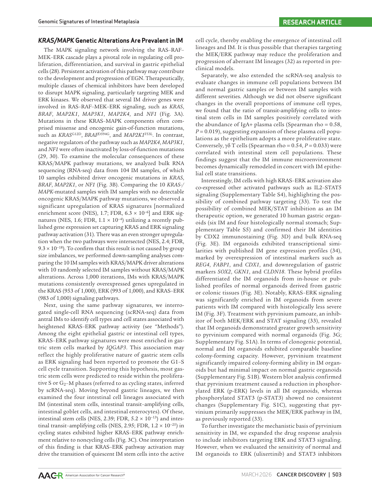

第二类信号是 SBS17。20 对 WGS 样本中，作者识别到 SBS1、SBS5/40、SBS17 和 SBS18。SBS17 在正常胃中并不典型，却出现在胃肠化生和胃癌中；映射到 1,095 个胃窦 IM 后，约 26.2% 样本可检测到 SBS17。

SBS17 在最晚复制区域富集 14.5 倍，而且与吸烟相关，却没有随年龄显著增加。类器官中的 OXPHOS、氧耗和 8-oxo-dG 结果把它与氧化损伤联系起来，但这些实验仍不能证明 OXPHOS 直接制造了 SBS17。

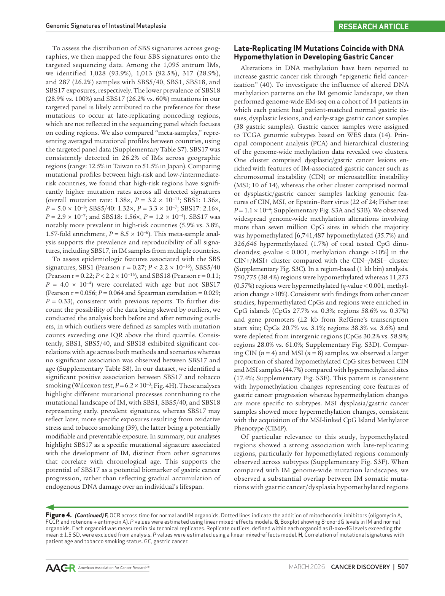

第三类信号来自克隆性造血。作者在 1,067 名受试者中识别到 286 个 reported CH gene mutations，涉及 225 人，主要 driver 为 DNMT3A、TET2、ASXL1 和 PPM1D。

当 CH 变异等位基因频率超过 5% 时，high CH 与异型增生和 early gastric neoplasia 仍保持独立关联。只使用 OLGIM、年龄和性别的模型 AUC 为 0.72；加入 mutation count、ARID1A mutation 和 high CH 后，AUC 提高到 0.773。在 GCEP1000 长期随访子集中，AUC 从 0.671 提高到 0.811。

## 05｜血液里的克隆，为什么会连接到胃黏膜

CH 原本主要被视为血液系统老化现象。这篇论文更进一步，尝试把它连接到胃黏膜免疫和微生物生态。

高 CH 与 PIGR truncating mutation 共现。PIGR 是上皮细胞把 polymeric IgA 转运到黏膜表面的受体；如果这条屏障受损，口腔来源细菌更可能在胃黏膜中出现。

数据方向与这个模型一致。CH-high IM 中 IgA+ plasma cells 和 mature T cells 增多，Streptococcus、Neisseria、Gemella、Fusobacterium 等口腔来源菌属也更丰富。FISH 和 Stereo-seq 进一步显示，Streptococcus anginosus 或相关 reads 与 CXCL8 高表达炎症区域存在空间重叠。

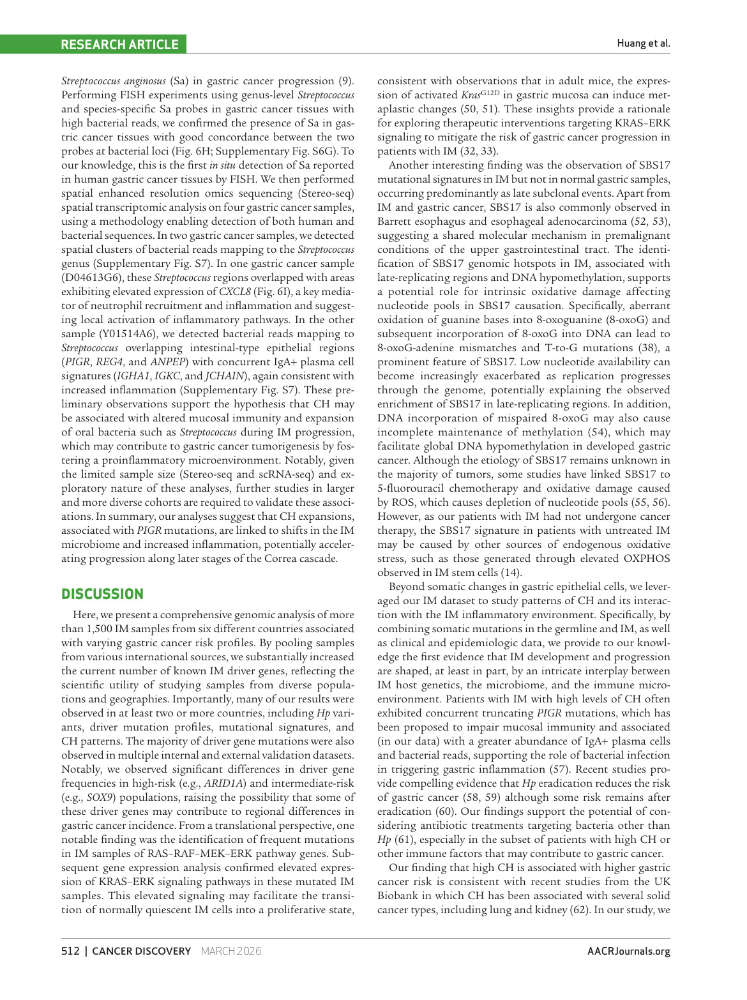

但需要强调：共现、免疫组成和空间重叠构成的是一条机制线索，不是完整因果链。论文尚未证明 CH 先导致 PIGR 改变，再导致口腔菌定植并最终推动胃癌。

## 06｜这项研究真正改变了什么

胃肠化生过去常被当作一个静态病理标签。这项研究把它重新描述为一个正在演化的状态：上皮细胞积累 driver 和 mutational signatures，血液系统出现 CH，黏膜免疫与微生物环境也同步变化。

近期最现实的应用不是用某一个 marker 取代胃镜，而是在 OLGIM、年龄和性别基础上增加分子信息。ARID1A truncation、mutation burden 和 high CH 有机会帮助识别需要更密集随访的人群。

KRAS/MAPK-altered IM 和 pyrvinium 类器官结果也提供了干预线索，但距离人体癌前干预还有很长距离。选择性、毒性、体内可达性和真实预防效果都尚未建立。

## 07｜这些结果仍需要冷静看待

首先，跨国家样本很多，但长期进展事件主要依赖新加坡队列。其他地区不少结局只是基线观察，因此“预测未来进展”的证据没有样本总数看起来那么强。

其次，高深度靶向 panel 以深度换广度。它适合捕捉低 VAF 克隆，却会遗漏 panel 外 driver、结构变异和非编码调控改变。

第三，SBS17 与 OXPHOS 的关系仍以相关性为主；pyrvinium 的选择性只在类器官层面观察到。两者都不能直接转化为临床预防建议。

第四，微生物分析容易受到低丰度 reads、污染和反向因果影响。FISH、单细胞和空间数据提供了多模态支持，但样本量有限，CH–PIGR–IgA–口腔菌这条链仍需要前瞻性队列和扰动实验。

## 08｜对我们的研究有什么可借鉴

如果要迁移到胃癌精准预防队列，可以把病理分层、高深度上皮 mutation panel、外周血 CH、吸烟与 Hp 暴露、口腔/胃微生物组和长期 EGN 终点放在同一设计中。

风险模型必须保留 OLGIM 等临床基线，再检验 ARID1A truncation、SBS17 exposure、mutation burden 和 high CH 能带来多少增量预测，而不是只报告单变量显著性。

机制研究则可以从 CH driver 分层开始。TET2、DNMT3A 和 ASXL1 不一定对应同一种黏膜炎症程序，需要用配套单细胞、空间转录组、IgA repertoire 和微生物组逐一验证。

---

## 技术附录

以下内容保留论文基本信息、完整主图说明、Results/Methods 证据、复现参数和证据边界。

## 基本信息

- 原文题名：Mutational Signatures and Clonal Hematopoiesis in Intestinal Metaplasia across Countries with Varying Stomach Cancer Incidence
- 期刊：Cancer Discovery 16, 497-520
- 年份：2026
- DOI：10.1158/2159-8290.CD-25-0778
- 第一作者：Kie Kyon Huang、Takeshi Hagihara
- 通讯作者：Patrick Tan、Khay Guan Yeoh
- 研究领域：胃癌癌前病变、胃肠化生、体细胞突变、突变签名、克隆性造血、微生物组、精准预防
- 关键词：intestinal metaplasia、gastric cancer、Correa cascade、Helicobacter pylori、SBS17、ARID1A、KRAS/MAPK、PIGR、clonal hematopoiesis、Streptococcus anginosus
- PDF 解析质量：正文、主图图注、Methods、数据可用性均可解析；补充表和补充图没有逐项展开。
- 图像截取说明：已将主文 Fig. 1-7 所在页渲染为图片，位于 `assets/gastric-cancer/2026-im-mutational-signatures-ch/`。多页图按页面拆分显示。
- 本地 PDF：`pdfs/processed/intestinal-metaplasia-mutational-signatures-ch-2025.pdf`

---

## 本论文主图

| 原文图表 | 原文图题/核心信息 | 是否截取 | 图像文件 | 放置位置 |
|---|---|---|---|---|
| Fig. 1 | 多国家 IM 队列、Hp 阳性率、Hp CagA 变异和 ASPP2 结合 | 是 | `assets/gastric-cancer/2026-im-mutational-signatures-ch/fig1-page4.png` | [Geographic Patterns of Hp Strains and Infection](#geographic-patterns-of-hp-strains-and-infection) |
| Fig. 2 | 跨人群 IM driver gene landscape、地区差异和 ARID1A 与 EGN 关联 | 是 | `fig2-page6.png`, `fig2-page7.png` | [Driver Gene Landscape of Trans-geographic IM Samples](#driver-gene-landscape-of-trans-geographic-im-samples) |
| Fig. 3 | KRAS/MAPK driver、通路激活、IM organoid 与 pyrvinium 敏感性 | 是 | `fig3-page8.png`, `fig3-page9.png` | [KRAS-MAPK mutations in IM](#kras-mapk-mutations-in-im) |
| Fig. 4 | IM WGS 突变签名、SBS17、复制时序、OXPHOS 和吸烟关联 | 是 | `fig4-page10.png`, `fig4-page11.png` | [SBS17 Is an IM-associated Mutational Signature](#sbs17-is-an-im-associated-mutational-signature) |
| Fig. 5 | IM 中 CH driver、年龄/吸烟关联和 EGN 风险模型 | 是 | `fig5-page13.png`, `fig5-page14.png` | [Clonal Hematopoiesis in IM Samples](#clonal-hematopoiesis-in-im-samples) |
| Fig. 6 | CH、PIGR truncation、IgA+ plasma cells、口腔菌和空间炎症 | 是 | `fig6-page14.png`, `fig6-page15.png`, `fig6-page16.png` | [CH expansions are associated with altered IM Microbiome-Immune Landscapes](#ch-expansions-are-associated-with-altered-im-microbiome-immune-landscapes) |
| Fig. 7 | Correa cascade 中的遗传、突变签名、CH 和微生物整合模型 | 是 | `fig7-page17.png` | [作者结论与证据强度](#作者结论与证据强度) |

## 生物学故事前情

胃肠化生是 Correa cascade 中连接慢性萎缩性胃炎和异型增生/胃癌的关键癌前阶段。传统上，领域把风险主要放在幽门螺杆菌感染、OLGIM 分期、家族史、吸烟饮酒等临床流行病学因素上；但这些指标很难解释为什么大多数 IM 不进展，而少数病灶会跨过异型增生和早期癌的门槛。

这篇文章把 IM 当作一个正在演化的生态系统，而不是单纯的组织学状态。作者同时看三类事件：上皮细胞内的 driver mutations 和 mutational signatures，非上皮血液系统的 clonal hematopoiesis，以及黏膜免疫-微生物互作。它的核心问题是：不同胃癌风险国家中的 IM 是否已经带有可解释地区发病率差异和未来进展风险的分子轨迹？

读这篇文章要抓住两条主线。第一条是上皮内事件：ARID1A、SOX9、KRAS/MAPK、SBS17 等改变如何标记 IM 的克隆演化和增殖状态。第二条是非上皮事件：CH 是否通过改变免疫炎症状态、PIGR/IgA 屏障和口腔来源细菌定植，推动 IM 向后期 Correa cascade 进展。

## 重要缩写表

| 缩写 | 中文含义 | 本文语境中的具体指代 | 阅读时注意 |
|---|---|---|---|
| IM | intestinal metaplasia，胃肠化生 | 胃癌前病变，主要分析对象 | 不是所有 IM 都会进展为胃癌 |
| Hp | Helicobacter pylori，幽门螺杆菌 | 通过靶向 panel 中 6 个 Hp 基因 coverage 推断感染/菌株变异 | IM 形成后 Hp 可下降，因此阴性不等于从未感染 |
| EGN | early gastric neoplasia | 高级别异型增生或早期胃癌 | 本文风险预测的关键终点之一 |
| OLGIM | Operative Link on Gastric Intestinal Metaplasia Assessment | 基于 IM 范围和严重度的临床分期 | 仍是临床风险分层基础，分子指标是在其上加信息 |
| VAF | variant allele frequency | 突变等位基因频率，反映克隆比例和测序检测阈值 | IM 突变 VAF 很低，所以需要高深度测序 |
| WGS | whole-genome sequencing | 20 对 IM-normal 用于突变签名和全基因组分布 | 深度约 60x，不足以完整捕捉低 VAF driver |
| SBS | single-base substitution signature | 单碱基替换突变签名 | SBS17 是本文最重要的 IM 特异性签名 |
| CH | clonal hematopoiesis | 血液/唾液正常样本中的造血克隆扩增突变 | 本文作为非上皮风险因子，而非血液肿瘤诊断 |
| CHIP | clonal hematopoiesis of indeterminate potential | 文中按 VAF > 2% 定义的 CH 事件 | 高 CH 另按 VAF > 5% 分层 |
| PIGR | polymeric immunoglobulin receptor | 黏膜上皮转运 IgA 的受体，truncating mutation 与高 CH 共现 | PIGR 突变提示黏膜免疫屏障受损，但因果仍待验证 |
| Sa | Streptococcus anginosus | 文章关注的口腔来源细菌之一 | FISH 和 Stereo-seq 在胃癌组织中做探索性验证 |
| OXPHOS | oxidative phosphorylation | IM organoid 中增强的线粒体氧化磷酸化 | 与 SBS17/氧化损伤关联主要是相关性证据 |

## 论文详细解读

### 研究问题与科学背景

胃癌发病率在国家和地区之间差异很大，日本和韩国等高风险地区明显高于新加坡、北美等中低风险地区。Hp 是最强风险因素之一，但仅用 Hp 感染不能完全解释地区差异和 IM 个体间进展差异。IM 患者总体有更高胃癌风险，但绝对年进展风险较低，临床上不可能对所有 IM 患者进行同等强度随访。

作者提出的科学瓶颈是：IM 阶段是否已经积累了足够的遗传、表观遗传、突变过程和免疫-微生物变化，可以解释胃癌风险异质性，并用于识别真正高危的 IM 患者。

### 研究设计与数据结构

本文用 277 个 human genes 和 6 个 Hp genes 的高深度靶向 DNA sequencing 分析 1,582 个 IM 样本，平均深度 1,108x。新近招募队列包括新加坡 218、韩国 106、香港 62、美国 36、日本 33、台湾 8 个 antral IM，并有配对 germline；同时加入既往 TransGCEP1000 新加坡 IM 样本 1,119 个和正常胃样本 98 个。

作者还加入多个补充数据模态：20 个 IM-normal 配对样本做 WGS，平均覆盖 60.5x；韩国 14 名患者的 matched normal、dysplasia、early gastric cancer 共 38 个样本做 EM-seq；部分样本有 bulk RNA-seq、scRNA-seq、IM microbiome、saliva microbiome、organoid 和 Stereo-seq 数据。整体设计不是单一组学发现，而是用靶向深测序作为主轴，再用 WGS、转录组、表观组、类器官和微生物空间证据补强机制解释。

### 方法速览与分析框架

靶向测序用于捕捉低 VAF IM 突变。作者用统一 pipeline 调用 somatic mutations，并说明 WGS 或模拟 100x WES 只能恢复一小部分低频突变，因此高深度 panel 是本文发现 IM driver 的技术前提。

driver gene 发现用 IntOGen pipeline，整合 7 个互补算法并做组合 q 值。突变签名分析先在 20 个 WGS IM 样本上用 SigProfilerAssignment 推断 SBS1、SBS5/40、SBS17、SBS18，再把签名映射到 1,095 个 antrum IM 靶向数据中。CH 调用采用“反向 tumor-normal”思路：把 blood/saliva 当作待检测对象，IM 当作对照，筛选血液/唾液 VAF 更高的造血克隆突变。

临床风险部分用 logistic regression，把年龄、性别、OLGIM、mutation count、ARID1A truncation、CH/高 CH 等变量与 dysplasia 或 EGN 关联。机制部分则通过 bulk/scRNA-seq deconvolution、PathSeq/lefser 微生物分析、FISH、IHC 和 Stereo-seq 连接 CH、PIGR、IgA+ plasma cells 和口腔菌。

### 原文结果完整梳理

#### Data Collection

作者首先建立跨国家 IM 图谱：1,582 个 IM 加 98 个正常胃样本，主数据为高深度 targeted DNA-seq。最近收集的 antrum IM 来自 6 个国家/地区，并结合新加坡早期队列。这个设计使文章能同时比较地理风险、Hp、driver genes、SBS signatures 和 CH。

关键技术点是测序深度。IM 里许多 somatic mutations 的 VAF 很低，若使用常规 WES/WGS 深度会大量漏检。作者后续结果表明，WGS 只能恢复靶向 panel 检出的 17.5% somatic mutations；模拟 100x WES 只能恢复 15.5% somatic mutations 和 15.1% driver protein-altering mutations。

#### Geographic Patterns of Hp Strains and Infection

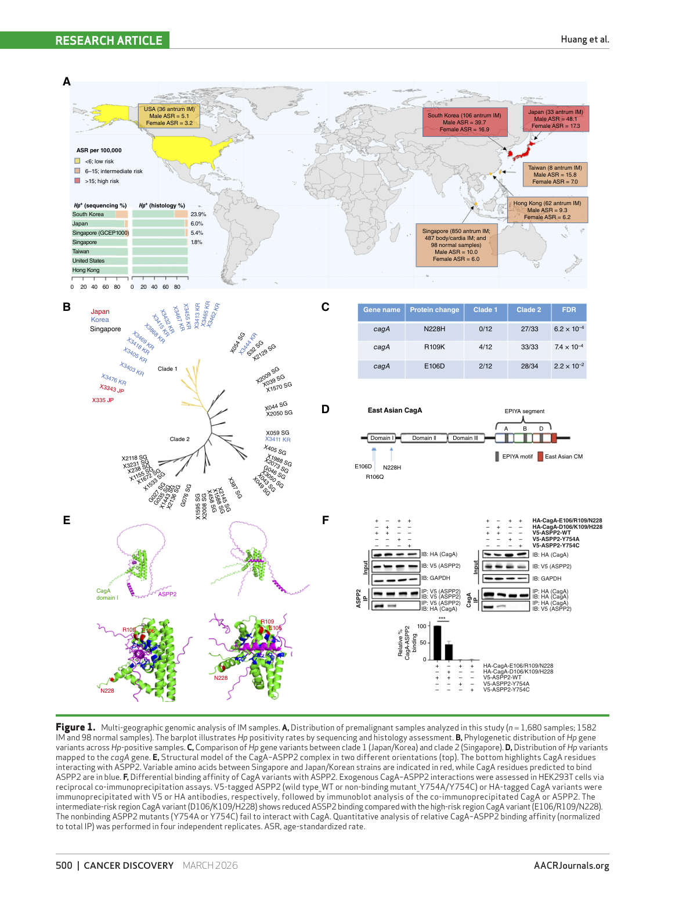

中文图注（基于原文图注）：Fig. 1 展示 6 个国家/地区 IM 样本分布、测序和组织学 Hp 阳性率、Hp-positive 样本的系统发育结构、CagA 变异位点、CagA-ASPP2 结构模型和免疫共沉淀验证。核心信息是高风险日本/韩国 Hp strain 与新加坡 strain 在 CagA N 端变异上分离，并且高风险地区 CagA variant 与 ASPP2 结合更强。

Hp 阳性率在高风险地区更高。韩国近期 IM 中高丰度 Hp 为 24/106，日本为 2/33，而近期新加坡仅 3/218；香港、美国、台湾近期样本未检测到高丰度 Hp。既往新加坡 2000-2010 队列 Hp 水平更高，提示根除策略和采样年代会影响观察到的 Hp burden。

Hp 变异也有地区差异。作者在 Hp-positive 样本中看到日本/韩国与新加坡菌株的系统发育分离，并把差异定位到 cagA 的 E106D、R109K、N228H。高风险地区 CagA variant 与 ASPP2 结合更强，而东南亚常见 variant 结合减弱。作者据此提出：不仅 Hp 是否存在重要，Hp virulence gene 的遗传多样性也可能影响 Correa cascade 起点和地区胃癌风险。

#### Driver Gene Landscape of Trans-geographic IM Samples

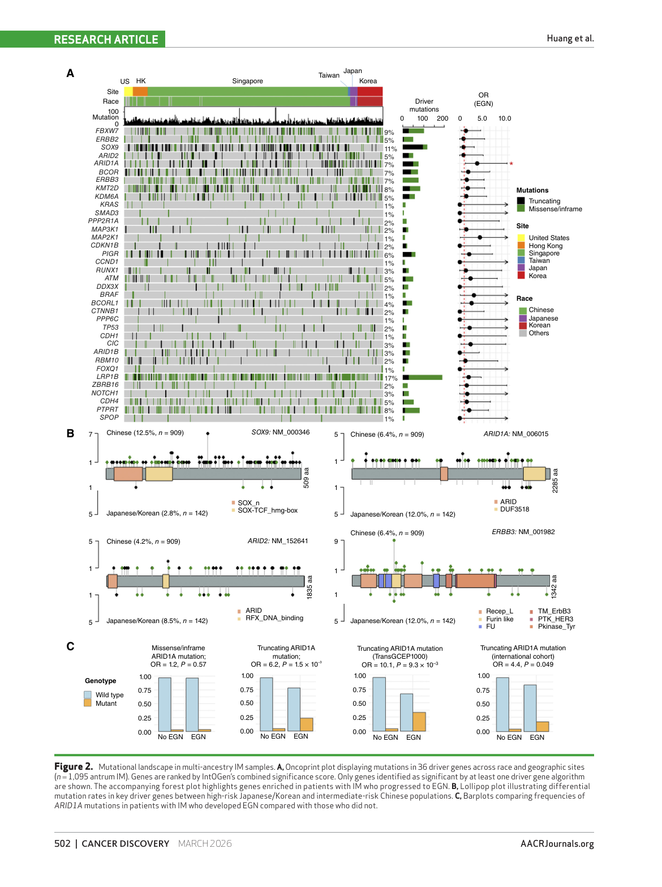

中文图注（基于原文图注）：Fig. 2 展示 36 个代表性 driver genes 的 oncoprint、不同人群/地区的关键 driver mutation rate，以及 ARID1A truncating mutations 与 EGN 的关联。图中重点是中国人群中 SOX9 truncation 频率高，而日本/韩国高风险人群中 ARID1A、ARID2、ERBB3 等更常见。

IntOGen 在 IM 中识别 47 个显著突变基因，共 2,100 个 driver mutations，其中 25 个此前未在 IM 中报告。47 个 driver genes 中 37 个也出现在正常胃、TCGA pan-GI cancer 或 IntOGen 胃癌 driver 资源中，说明这些基因与胃上皮癌变相关性较强。

antrum IM 的平均 somatic mutation count 为 23，平均 VAF 2.9%，中位 VAF 1.7%。日本/韩国样本突变率高于中国人群。SOX9 mutation 尤其在 Chinese populations 中更常见，909 个样本中 114 个有 SOX9 truncating mutations；而高风险日本/韩国人群中 ARID1A、ARID2、ERBB3、KMT2D、KDM6A、CREBBP、PREX2 更常见。

最有转化价值的是 ARID1A。跨地区合并分析显示，ARID1A truncating mutations 与 concurrent 或 eventual EGN 关联，OR 6.2，P = 1.5e-3。作者将其解释为 SWI/SNF 失活可能促进 enhancer accessibility、lineage fidelity 和 epithelial plasticity 改变，从而提高 IM 向 neoplasia 转化的可能。

#### KRAS-MAPK mutations in IM

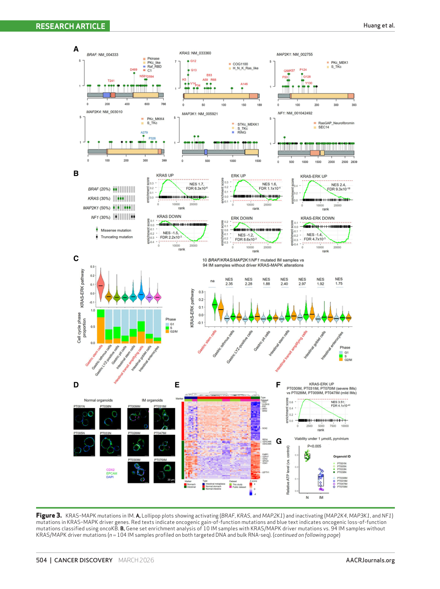

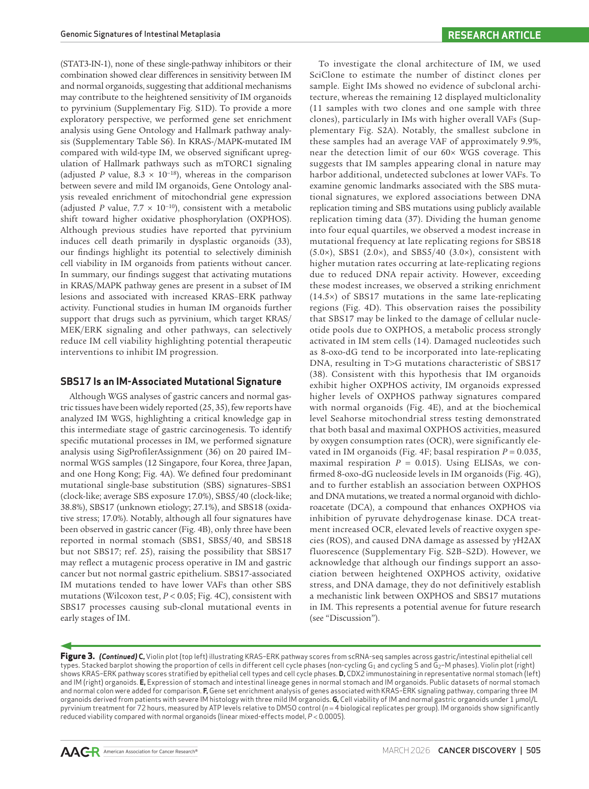

中文图注（基于原文图注）：Fig. 3 展示 KRAS、BRAF、MAP2K1 的 gain-of-function 以及 MAP2K4、MAP3K1、NF1 的 loss-of-function 改变；bulk RNA-seq 证明 KRAS/MAPK-mutated IM 激活 KRAS-ERK signatures；scRNA-seq 显示 cycling intestinal stem/TA cells KRAS-ERK 分数更高；IM organoid 通过 CDX2 和转录组确认，并对 pyrvinium 更敏感。

KRAS/MAPK 通路改变存在于一部分 IM 中。作者观察到 KRASG12D、BRAFD594G、MAP2K1F53L 等激活性突变，以及 MAP2K4、MAP3K1、NF1 等负调控因子的失活。104 个同时有 DNA 和 bulk RNA-seq 的 IM 样本中，10 个带 KRAS/MAPK driver alterations，这些样本显著上调 KRAS、ERK 和 KRAS-ERK intersected signatures；下采样 1,000 次后结果仍稳定。

单细胞分析把通路激活定位到增殖相关细胞状态。KRAS-ERK signature 在 gastric stem cells 中较高，也在 cycling intestinal stem cells 和 transit-amplifying cells 中显著升高。作者提出 KRAS-ERK 可能促进静息 IM stem cells 进入细胞周期，推动肠型谱系扩增。

类器官实验提供药物干预线索。作者建立 6 个 IM 和 4 个正常胃 organoids，IM organoids 表达 CDX2、REG4、FABP1、CDX1 等肠型标志。severe IM organoids 的 KRAS-ERK signaling 更高；pyrvinium pamoate 可更强地降低 IM organoid viability 和 colony-forming ability，而对正常胃 organoid 影响较小。单独 ERK 或 STAT3 inhibition 没有复现同等选择性，说明 pyrvinium 作用可能不只是单一路径抑制。

#### SBS17 Is an IM-associated Mutational Signature

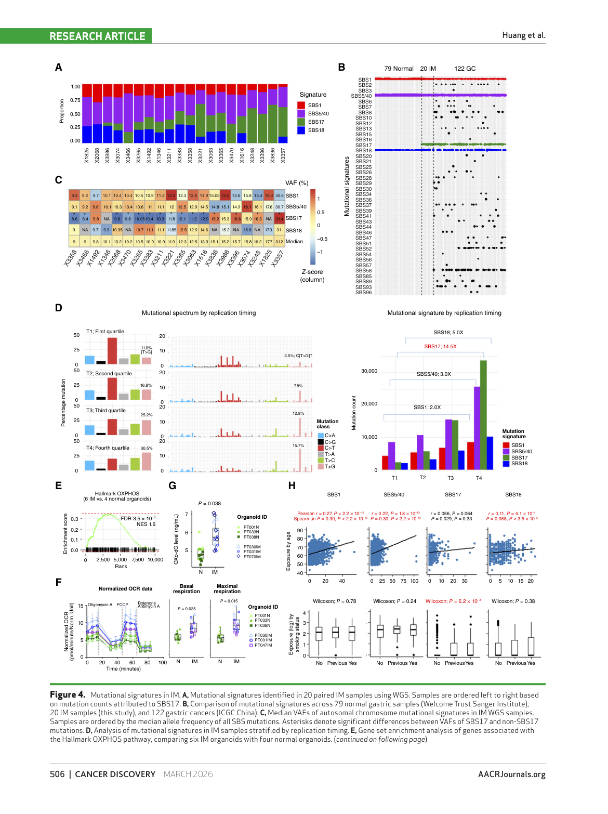

中文图注（基于原文图注）：Fig. 4 展示 20 个 IM WGS 样本的 SBS1、SBS5/40、SBS17、SBS18 组成；与正常胃和胃癌比较；SBS17 的 VAF 偏低；SBS17 在 late-replicating regions 高度富集；IM organoids 中 OXPHOS、OCR 和 8-oxo-dG 增强；SBS17 与吸烟相关而不随年龄显著增加。

20 个 IM-normal WGS 样本中识别 4 类主导 signature：SBS1、SBS5/40、SBS17、SBS18。SBS1、SBS5/40、SBS18 也出现在正常胃，SBS17 则在 IM 和胃癌中出现但正常胃中不典型，提示它可能是 IM 阶段新出现的 mutagenic process。SBS17 mutations 的 VAF 低于其他 SBS mutations，支持其更多代表晚期或 subclonal events。

SBS17 的基因组分布有鲜明特征。按 replication timing 四分位分层后，SBS1、SBS5/40、SBS18 在 late-replicating regions 仅中等升高，而 SBS17 在最晚复制区域富集 14.5 倍。作者将其与 OXPHOS、氧化损伤、8-oxo-dG 和 nucleotide pool damage 联系起来。IM organoids 的 OXPHOS pathway、basal/maximal OCR 和 8-oxo-dG 水平均高于正常 organoids；DCA 增强 OXPHOS 后可提高 ROS 和 DNA damage，但作者明确承认这还不能证明 OXPHOS 直接造成 SBS17。

映射到 1,095 个 antrum IM 靶向数据后，SBS5/40 和 SBS1 几乎普遍存在，SBS18 和 SBS17 分别在约 28.9% 和 26.2% 样本中可检测。高风险国家 IM 的所有 signature mutation rate 均更高，其中 SBS17 enrichment 更明显。SBS1、SBS5/40、SBS18 与年龄相关，SBS17 不随年龄显著相关，但与吸烟显著相关。这个结果把 SBS17 从“年龄累积噪音”中区分出来，使其成为潜在进展风险或暴露相关 biomarker。

#### Clonal Hematopoiesis in IM Samples

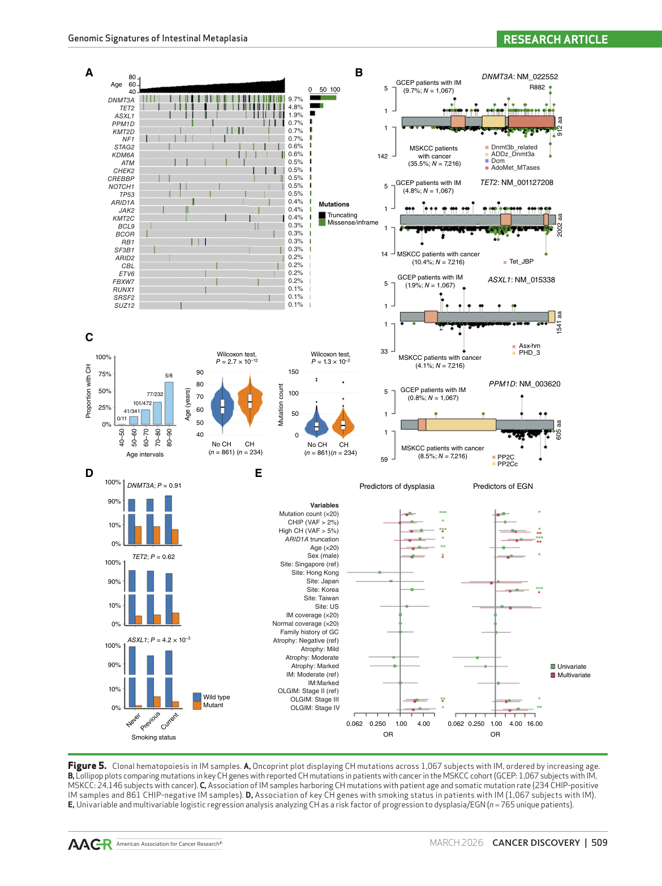

中文图注（基于原文图注）：Fig. 5 展示 1,067 名 IM subject 中 CH mutations 的分布，DNMT3A、TET2、ASXL1、PPM1D 等 CH genes 的突变位置与 MSKCC pan-cancer CH 数据对照，CH carriers 年龄更大且 IM somatic mutation rate 更高，ASXL1 mutation 与吸烟相关；logistic regression 显示 high CH 与 dysplasia/EGN 风险相关。

作者在 1,067 名 IM subjects 中识别 286 个 reported CH gene mutations，分布于 225 人。显著 CH driver genes 为 DNMT3A、TET2、ASXL1、PPM1D，突变谱与既往 MSK-IMPACT 大队列中的 CH 规律一致，例如 DNMT3A R882 missense、TET2/ASXL1 truncation、PPM1D 3' 区域 truncation。

CH carriers 年龄更大，IM somatic mutation rate 更高。ASXL1 mutation 在吸烟者中更常见，符合 CH 与烟草暴露关系的既往认识。关键临床分析中，作者把 CH 分为 CHIP VAF > 2% 和 high CH VAF > 5%。在 765 名 unique IM subjects 中，CHIP、高 CH、mutation rate、ARID1A truncation、年龄、男性、OLGIM stage III/IV 均与 dysplasia 有关；多变量中 high CH、男性、OLGIM stage III 独立关联 dysplasia。

对 EGN 终点，高 CH 和 ARID1A truncation 在多变量模型中仍显著。GCEP1000 长期随访子集中，high CH 也保持独立预测价值。风险模型中，临床变量 OLGIM、年龄、性别的 AUC 为 0.72；加入 mutation count、ARID1A mutation 和 high CH 后 AUC 升至 0.773。GCEP1000 子集中，AUC 从 0.671 升至 0.811。这个结果支持把 CH 作为 IM 进展风险分层的血液可测分子指标。

#### CH expansions are associated with altered IM Microbiome-Immune Landscapes

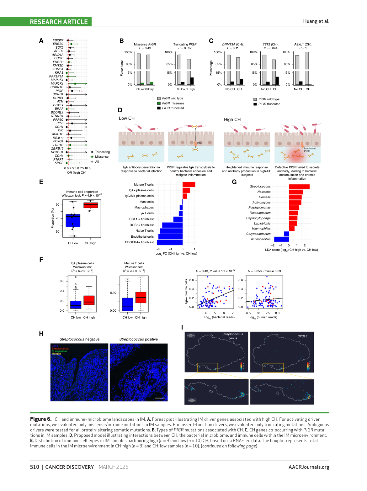

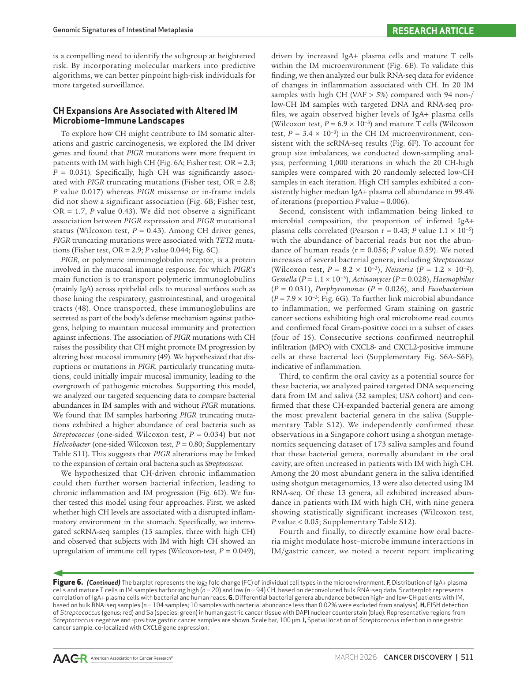

中文图注（基于原文图注）：Fig. 6 展示 high CH 与 IM driver genes 的共现，其中 PIGR truncating mutation 与 high CH 关联；PIGR 参与 IgA transcytosis；CH-high IM 中 IgA+ plasma cells 和 mature T cells 增加；口腔来源细菌如 Streptococcus、Neisseria、Gemella、Fusobacterium 增加；FISH 和 Stereo-seq 在胃癌组织中显示 Streptococcus/Sa 与 CXCL8 炎症区域空间重叠。

作者进一步问 CH 如何影响 IM 进展。driver gene 共现分析显示，高 CH 与 PIGR mutations 相关，特别是 PIGR truncating mutations；PIGR truncation 还与 TET2 CH mutation 共现。PIGR 是上皮细胞把 polymeric IgA 转运到黏膜表面的关键受体，因此 PIGR truncation 可以被理解为黏膜 IgA 屏障受损的线索。

微生物结果支持“屏障-口腔菌-炎症”的模型。IM 中 PIGR truncating mutation 与 Streptococcus abundance 升高有关，但与 Helicobacter 不显著相关。scRNA-seq 中 high CH IM 的 immune cell types 增多，主要由 IgA+ plasma cells 和 mature T cells 推动；bulk RNA-seq deconvolution 在 20 个 high CH 与 94 个 non/low CH IM 中复现 IgA+ plasma cells 和 mature T cells 升高。IgA+ plasma cell abundance 与 bacterial reads 相关，而与 human reads 不相关。

CH-high IM 中多个口腔来源菌属升高，包括 Streptococcus、Neisseria、Gemella、Actinomyces、Haemophilus、Porphyromonas、Fusobacterium。唾液 metagenomics 支持这些菌属可能来自口腔。作者进一步用 FISH 在胃癌组织中检测 Streptococcus anginosus，并用 Stereo-seq 观察到 Streptococcus reads 与 CXCL8 高表达区域或肠型上皮/IgA plasma cell signatures 空间重叠。由于 scRNA-seq、Stereo-seq 和 FISH 样本量有限，这部分更适合作为机制假说支持，而不是最终因果证明。

### 作者结论与证据强度

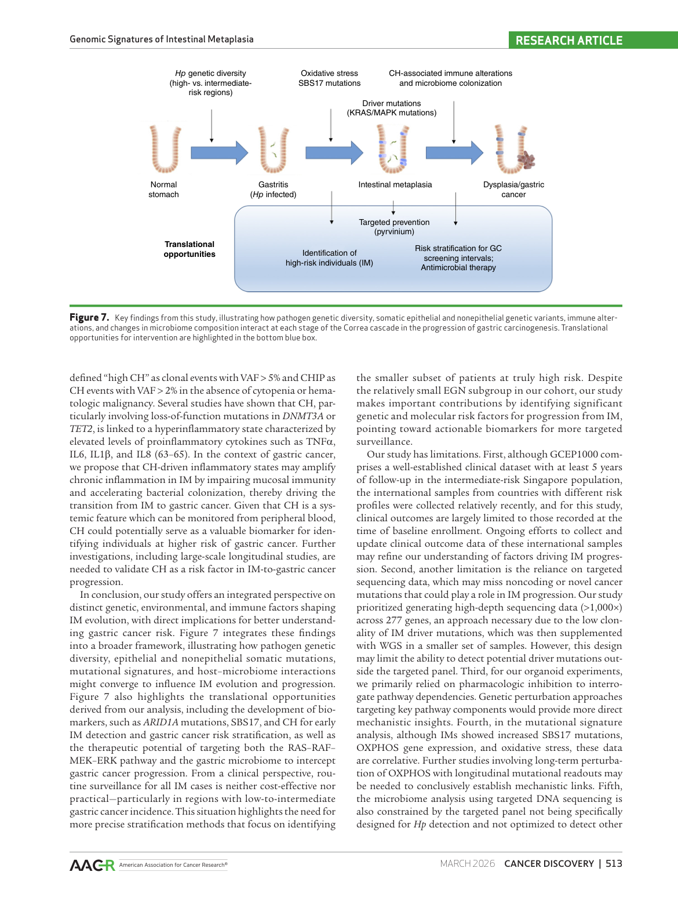

作者已经较有力证明：跨国家 IM 队列中存在复发 driver genes，且部分 driver frequencies 具有地区差异；ARID1A truncation 与 EGN 风险相关；KRAS/MAPK-altered IM 具有通路激活和类器官药物敏感性；SBS17 是 IM 相对正常胃更特异的突变签名，且与 late replication、OXPHOS/氧化损伤和吸烟相关；high CH 与 IM 进展风险独立相关，并提升临床模型 AUC。

合理但仍需验证的是：CH 通过 PIGR、IgA 屏障、口腔菌定植和慢性炎症推动 IM 向胃癌进展。本文有共现、转录组、微生物、FISH 和空间组学证据，但关键因果链条仍缺少前瞻性大队列和实验扰动验证。

原文没有证明的是：SBS17 可单独作为临床进展预测指标，pyrvinium 可用于人体 IM 干预，或者针对非 Hp 口腔菌的抗菌策略能降低 IM 进展风险。这些都应视为转化机会，而非已成熟的临床建议。

## 独立方法学详解

### 研究对象、样本和数据结构

主队列为跨国家 IM 样本，包含新近招募的 antrum IM 和既往新加坡 GCEP1000 队列。样本类型包括 IM、正常胃、配对 germline、部分 dysplasia/early gastric cancer、唾液和胃癌组织。临床信息包括年龄、吸烟、IM severity、OLGIM stage、家族史、dysplasia 或 EGN 结局。

这个设计的优点是样本量大、地理来源多、靶向测序深度高；缺点是不同国家样本采集时间、随访长度和临床终点成熟度不一致。GCEP1000 有较长随访，国际样本多为基线记录，因此进展风险分析仍主要依赖有限终点数。

### 实验流程和数据生成

靶向 panel 使用 Agilent SureSelect XT HS2，覆盖 277 个人类基因和 6 个 Hp 基因，NovaSeq PE150 测序。WGS 使用 NEBNext Ultra II DNA library prep，NovaSeq PE150，平均约 60x。EM-seq 用 NEBNext Enzymatic Methyl-seq，结合 lambda/pUC19 controls 做甲基化 QC。

转录组层面使用 bulk RNA-seq 和 scRNA-seq，并复用此前数据加新样本。organoid 实验从正常胃和 IM 建立类器官，用 CDX2 immunostaining 和 RNA-seq 证明 IM identity，随后做 pyrvinium、ERK inhibitor、STAT3 inhibitor 处理和 ATP/colony assays。微生物部分结合 targeted DNA-seq、bulk RNA-seq PathSeq、唾液 shotgun metagenomics、Gram stain、FISH 和 Stereo-seq。

### 数据预处理和特征构建

DNA reads 对齐到 hs37d5，靶向测序用 molecular barcode 去重复，WGS 用 MarkDuplicates。germline mutation 用 HaplotypeCaller，somatic mutation 用 Mutect2。深测序 somatic calling 为提高敏感性调整 Mutect2 参数，并用 gnomAD、panel of normals、contamination 和 read orientation artifact filters 控制假阳性。最终 somatic variants 要求至少 5 条 variant-supporting reads 且 VAF >= 1%。

Hp status 由 6 个 Hp genes 的 coverage 推断，>=1x 进入系统发育分析。driver genes 用 IntOGen 从 somatic mutations 中寻找正选择信号。SBS signatures 用 WGS 先拟合 COSMIC signatures，再把 SBS1、SBS5/40、SBS17、SBS18 映射到 targeted sequencing。CH calling 反向使用 blood/saliva as tumor、IM as control，并要求 blood/saliva VAF >= 2%，且至少为 matched IM VAF 的 2 倍。

### 统计学分析方法

Fisher exact test 用于二分类变量关联，例如 Hp positivity、CagA variants、driver mutation frequency、PIGR truncation 与 high CH 共现。其输入是 2x2 或类似列联表，估计 odds ratio 和 P value；适合稀疏突变事件，但不能处理多个混杂变量。

Wilcoxon test 用于比较非正态连续变量，例如 mutation count、signature exposure、bacterial abundance、immune cell abundance。它检验分布位置差异，但不直接估计可解释的绝对效应大小；多重比较时需要结合 FDR 或明确探索性解释。

Pearson/Spearman correlation 用于 signature exposure 与年龄、IgA+ plasma cells 与 bacterial reads 等连续变量关系。Pearson 假设线性关系，Spearman 更关注秩相关；相关性不能证明因果。

Logistic regression 用于 dysplasia/EGN 风险分析。输入包括临床变量和分子变量，输出 OR、P value 和多变量独立关联。本文策略是先单变量筛选，再多变量评估。需要注意 EGN 事件数有限，模型存在过拟合风险，AUC 提升应在外部队列验证。

Linear mixed-effects model 用于 organoid drug response/OCR 等实验，适合处理 biological replicates 和个体来源差异。GSEA/fgsea 用于判断 KRAS、ERK、OXPHOS 等 gene sets 是否在排序基因列表中系统富集，输出 NES 和 FDR。

### 统计模型、机器学习模型或计算框架

IntOGen 是 driver discovery 框架，整合多个算法对突变频率、功能影响、聚集性和背景突变率进行正选择评估。它的优点是降低单一算法偏差；局限是候选基因受 panel 设计限制，不能发现 panel 外 driver。

SigProfilerAssignment 是突变签名分解工具，把每个突变按 trinucleotide context 分配到 COSMIC signatures。WGS 更适合签名发现，因为覆盖非编码区域；targeted panel 可做 signature projection，但对 SBS17/SBS18 这类偏 late-replicating noncoding regions 的 signature 敏感性不足。

CIBERSORTx 和 ESTIMATE 用于从 bulk RNA-seq 推断免疫成分。它们依赖 reference signature 和表达去卷积假设，适合生成群体层面证据，但不能替代单细胞验证。

PathSeq、lefser、Kraken2 和 Stereo-seq SAW 用于微生物 reads 识别和空间定位。微生物 reads 在人组织转录组中常有低丰度和污染风险，因此本文结合 saliva、FISH、Gram stain、IHC 和 spatial transcriptomics 增强可信度。

### 验证策略、稳健性和混杂控制

driver genes 通过独立 48 个 IM 样本、正常胃研究、TCGA pan-GI cancer 和 IntOGen 胃癌 driver lists 做外部/内部交叉验证。KRAS/MAPK RNA-seq 结果通过 1,000 次 down-sampling 控制组间样本数不平衡。CH 风险结果通过排除测序深度偏离均值 ±1 SD 的样本进行敏感性分析，说明 coverage 差异不是主要驱动。

微生物和免疫结果用 scRNA-seq、bulk deconvolution、saliva metagenomics、FISH、IHC、Stereo-seq 多种证据链互相支持。弱点是空间和单细胞样本量较小，且许多分析是横断面关联。

### 可重复性资源和迁移注意点

原始数据存放在 EGA：EM-seq、WGS、targeted sequencing、transcriptomic sequencing 以及 GCEP1000 相关 targeted panel、bulk RNA-seq、WGS、scRNA-seq 均需向 Singapore Gastric Cancer Consortium Data Access Committee 申请。

迁移到自己的 IM 队列时，最关键的是测序深度和 paired germline。低 VAF IM 突变不能用常规低深度 WES 直接复现；CH 分析也需要可靠 blood/saliva germline sequencing，并要处理白细胞污染、panel of normals 和 CH VAF 阈值。若做微生物分析，需要独立的污染控制、阴性对照和原位验证。

## 生物学与临床意义

这篇文章把 IM 风险从“病理分期 + Hp 暴露”推进到“上皮克隆演化 + 突变过程 + 系统性造血克隆 + 黏膜免疫微生物生态”。ARID1A truncation、SBS17 和 high CH 可能成为 IM 精准随访的分子层变量，帮助在 OLGIM 分期之上识别真正高危个体。

临床转化边界也很清楚：这些 marker 目前不能替代内镜和病理，也不能直接指导药物干预。更现实的近期应用是把分子指标加入 IM surveillance interval 的风险模型，特别是在低/中风险地区避免对所有 IM 患者过度随访。

## 局限性与危险假设

第一，国际样本随访时间短，很多国家的临床结局是 baseline observation，因此“进展风险”仍主要依赖少量事件和新加坡长期队列。第二，靶向 panel 无法发现 panel 外 driver、结构变异和非编码调控突变。第三，SBS17 与 OXPHOS 的机制关系仍是相关性，缺少长期扰动后突变累积读出。第四，pyrvinium 的类器官结果提示可干预性，但药物选择性、毒性、体内可达性和真实预防效果都未证明。第五，微生物结果存在低丰度 reads、污染和因果方向问题，尽管作者用了多模态证据降低风险。

## 深度研究洞察

最值得学习的是作者把 CH 引入胃癌癌前病变研究。CH 通常被看作血液系统老化现象，但本文将其作为系统性炎症和黏膜免疫改变的来源，连接到 IM epithelial mutations、PIGR、IgA、口腔菌和 EGN 风险。这为“癌前病变不是局部上皮细胞单独演化”的观点提供了强案例。

第二个洞察是 SBS17 的定位。作者没有只说“IM 有 SBS17”，而是把它放在 WGS vs normal/gastric cancer、VAF、replication timing、OXPHOS、8-oxo-dG、吸烟和地理风险中解释。这个多层证据结构比单纯 signature detection 更有说服力。

第三个洞察是高深度 targeted panel 的价值。对于癌前病变，低 VAF 是常态；如果研究问题是早期克隆演化，panel 深度可能比全外显子/全基因组广度更关键。本文为 IM、Barrett、炎症性肠病癌前病变等研究提供了技术论证。

## 可借鉴或迁移的思路

可迁移到胃癌精准预防队列的框架是：OLGIM/病理分层 + high-depth epithelial mutation panel + blood CH panel + smoking/Hp history + oral/gastric microbiome + longitudinal EGN endpoint。若样本量允许，可以把 ARID1A truncation、SBS17 exposure、mutation burden、high CH 和 PIGR status 纳入 joint risk model。

可迁移到机制研究的方向是 CH-high IM 的免疫微环境。可以建立 CH mutation carrier 与 non-carrier 的前瞻 IM biopsy 队列，配套单细胞、空间转录组、IgA repertoire、mucosal microbiome 和外周血炎症因子，验证 TET2/DNMT3A/ASXL1 不同 CH driver 是否对应不同黏膜炎症程序。

可迁移到干预研究的方向包括两类：一类是 KRAS/MEK/ERK/OXPHOS 相关上皮干预，另一类是非 Hp 口腔菌和黏膜免疫屏障干预。前者更接近药物安全性和癌前干预问题，后者更接近 antimicrobial/probiotic/oral hygiene 与胃癌风险的目标试验模拟。

## 可复用学术表达

- “IM is not only a histologic intermediate but an evolutionary state shaped by epithelial and nonepithelial somatic alterations.” 这类表达适合把癌前病变从静态病理概念转为动态演化概念。
- “High-depth targeted sequencing is required when the biological signal resides in low-VAF premalignant clones.” 适合写测序策略理由。
- “CH may act as a systemic modifier of tissue-specific cancer risk through inflammatory and mucosal immune pathways.” 适合写 CH 与实体癌前病变连接的假说。
- “Molecular risk stratification should be interpreted as an addition to, rather than a replacement for, established histopathologic staging.” 适合写临床转化边界。

## 相关论文与概念

- Correa cascade：normal mucosa -> chronic gastritis/atrophy -> IM -> dysplasia -> gastric cancer，是本文所有结果的临床病理坐标。
- OLGIM staging：当前 IM 风险分层基础，适合作为分子模型的临床 backbone。
- SBS17 in upper GI premalignancy：Barrett esophagus、esophageal adenocarcinoma 和胃癌中均有相关观察，可作为跨上消化道癌前病变比较方向。
- Clonal hematopoiesis and solid cancer risk：CH 与肺癌、肝癌、结直肠癌等实体瘤风险的关联为本文提供外部背景。
- PIGR/IgA mucosal barrier：连接上皮突变、免疫屏障和微生物定植的核心生物学概念。
- Streptococcus anginosus in gastric cancer：本文把近期口腔菌-胃癌进展线索推进到原位和空间层面。
