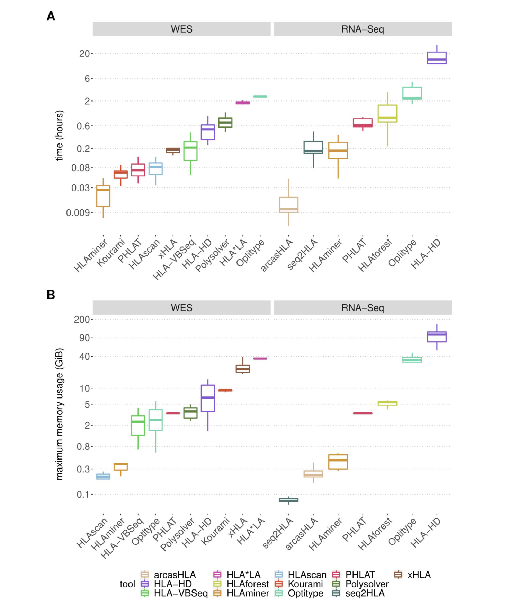
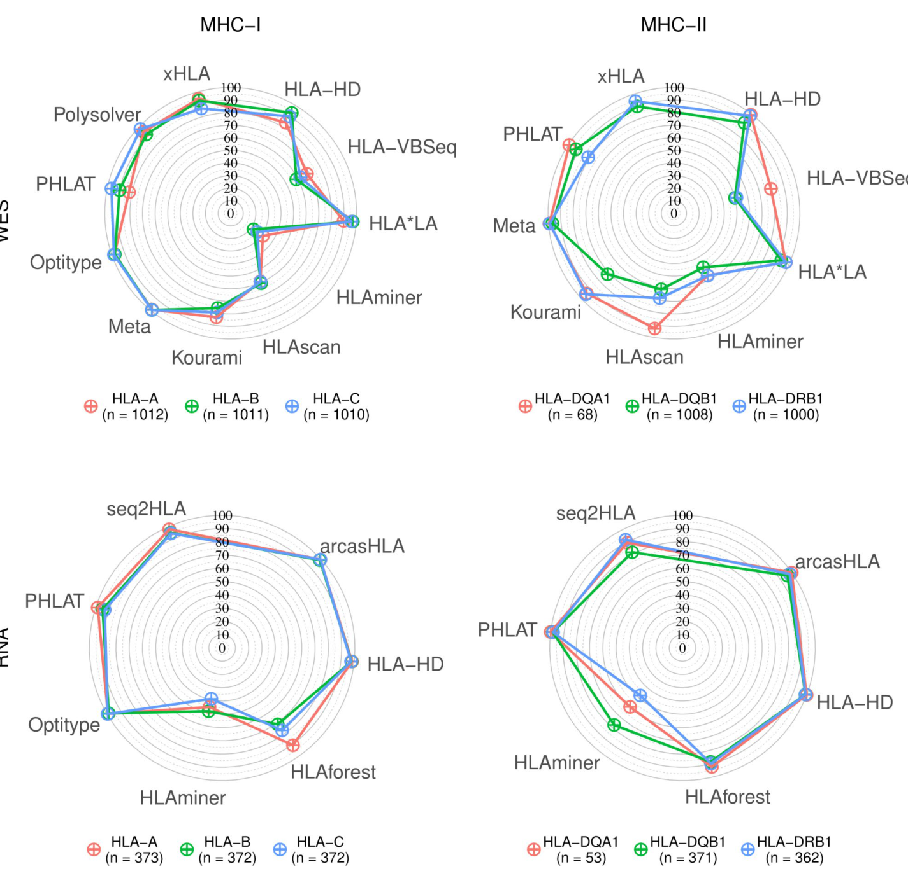
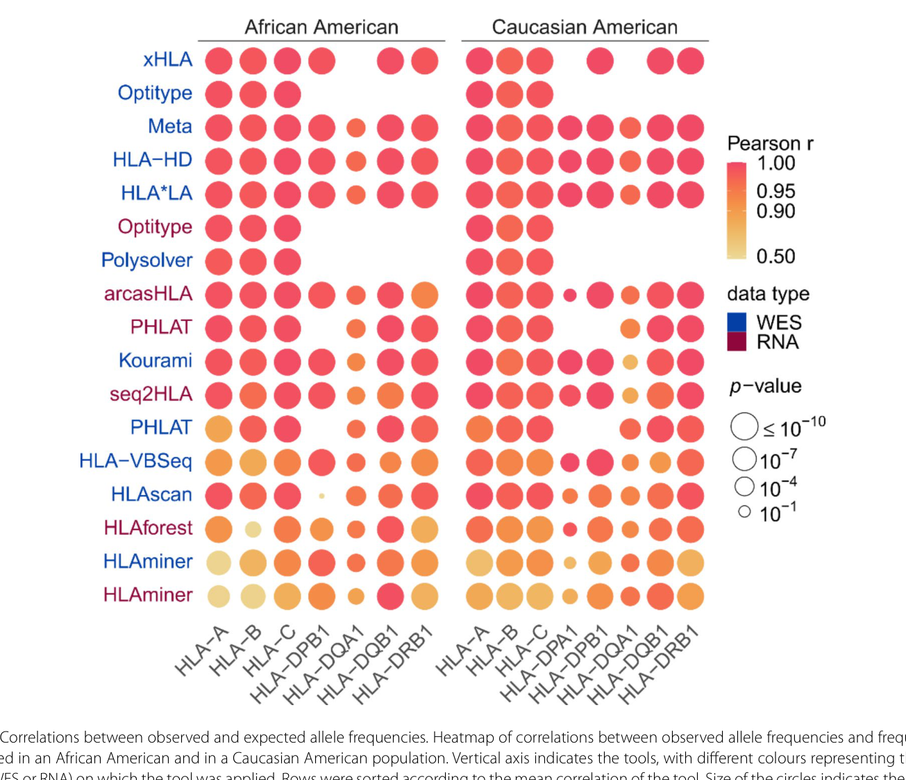
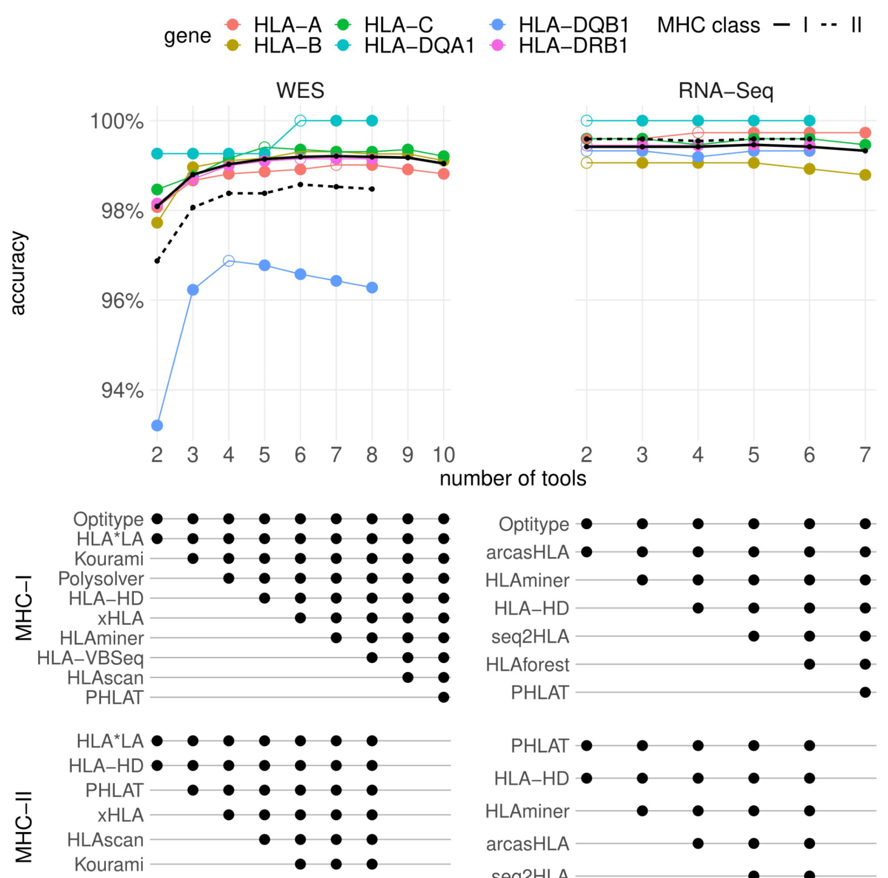

# MHC I/II 基因型 NGS 体外预测工具 benchmark

## 本文目录

- [基本信息](#基本信息)
- [本论文主图](#本论文主图)
- [生物学故事前情](#生物学故事前情)
- [重要缩写表](#重要缩写表)
- [论文详细解读](#论文详细解读)
- [研究问题与科学背景](#研究问题与科学背景)
- [研究设计与数据结构](#研究设计与数据结构)
- [方法速览与分析框架](#方法速览与分析框架)
- [原文结果完整梳理](#原文结果完整梳理)
  - [Selection of 13 HLA genotyping tools with variable computational resource requirements](#selection-of-13-hla-genotyping-tools-with-variable-computational-resource-requirements)
  - [HLA*LA and HLA-HD are the best performing MHC class II genotyping tools on WES data](#hlala-and-hla-hd-are-the-best-performing-mhc-class-ii-genotyping-tools-on-wes-data)
  - [HLA-HD, PHLAT and arcasHLA are the best performing MHC class II genotyping tools on RNA data](#hla-hd-phlat-and-arcashla-are-the-best-performing-mhc-class-ii-genotyping-tools-on-rna-data)
  - [Correlation and concordance analyses on large independent datasets confirm the benchmarking results](#correlation-and-concordance-analyses-on-large-independent-datasets-confirm-the-benchmarking-results)
  - [A consensus metaclassifier improves HLA predictions for WES data](#a-consensus-metaclassifier-improves-hla-predictions-for-wes-data)
- [作者结论与证据强度](#作者结论与证据强度)
- [独立方法学详解](#独立方法学详解)
  - [工具筛选、输入类型和可调用位点](#工具筛选输入类型和可调用位点)
  - [benchmark 数据集和金标准](#benchmark-数据集和金标准)
  - [HLA 等位基因标准化和准确率定义](#hla-等位基因标准化和准确率定义)
  - [覆盖度、资源消耗和可扩展性评估](#覆盖度资源消耗和可扩展性评估)
  - [间接验证：群体频率相关性和工具间一致性](#间接验证群体频率相关性和工具间一致性)
  - [多工具共识分型模型](#多工具共识分型模型)
  - [可重复性资源和迁移注意点](#可重复性资源和迁移注意点)
- [生物学与临床意义](#生物学与临床意义)
- [局限性与危险假设](#局限性与危险假设)
- [深度研究洞察](#深度研究洞察)
- [可借鉴或迁移的思路](#可借鉴或迁移的思路)
- [可复用学术表达](#可复用学术表达)
- [相关论文与概念](#相关论文与概念)

## 基本信息

- 原文题名：Benchmark of tools for in silico prediction of MHC class I and class II genotypes from NGS data
- 期刊：BMC Genomics 24, 247
- 年份：2023
- DOI：10.1186/s12864-023-09351-z
- 作者：Arne Claeys、Peter Merseburger、Jasper Staut、Kathleen Marchal、Jimmy Van den Eynden
- 研究领域：HLA typing、MHC-I/MHC-II、免疫基因组学、肿瘤免疫、NGS 工具 benchmark
- 关键词：HLA genotyping、MHC class I、MHC class II、WES、RNA-seq、Optitype、HLA-HD、arcasHLA、benchmark
- 本地 PDF：`pdfs/processed/mhc-genotyping-benchmark-bmc-genomics-2023.pdf`
- PDF 解析质量：正文、图注、Methods、参考文献和数据可用性均可解析；补充材料没有在本笔记中逐表展开。
- 图像截取说明：已截取主文 Fig. 1-4，图像位于 `assets/immunology/2023-mhc-genotyping-benchmark/`。

---

## 本论文主图

| 原文图表 | 原文图题/核心信息 | 是否截取 | 图像文件 | 放置位置 |
|---|---|---|---|---|
| Fig. 1 | Computational resource consumption of the 13 selected tools：不同 HLA caller 的单样本运行时间和内存占用 | 是 | `assets/immunology/2023-mhc-genotyping-benchmark/fig1-computational-resources.png` | [Selection of 13 HLA genotyping tools with variable computational resource requirements](#selection-of-13-hla-genotyping-tools-with-variable-computational-resource-requirements) |
| Fig. 2 | HLA allele prediction accuracies：1000 Genomes 金标准直接 benchmark 中 WES/RNA 的 MHC-I 和 MHC-II 准确率 | 是 | `assets/immunology/2023-mhc-genotyping-benchmark/fig2-prediction-accuracies.png` | [HLA*LA and HLA-HD are the best performing MHC class II genotyping tools on WES data](#hlala-and-hla-hd-are-the-best-performing-mhc-class-ii-genotyping-tools-on-wes-data) |
| Fig. 3 | Correlations between observed and expected allele frequencies：TCGA 大队列中预测等位基因频率与群体参考频率的相关性 | 是 | `assets/immunology/2023-mhc-genotyping-benchmark/fig3-allele-frequency-correlation.png` | [Correlation and concordance analyses on large independent datasets confirm the benchmarking results](#correlation-and-concordance-analyses-on-large-independent-datasets-confirm-the-benchmarking-results) |
| Fig. 4 | Accuracies of meta-prediction models with an increasing number of included tools：多工具 majority voting 共识模型 | 是 | `assets/immunology/2023-mhc-genotyping-benchmark/fig4-consensus-metaclassifier.png` | [A consensus metaclassifier improves HLA predictions for WES data](#a-consensus-metaclassifier-improves-hla-predictions-for-wes-data) |

## 生物学故事前情

HLA/MHC 的问题表面上是“分型工具选择”，背后实际是免疫肿瘤学研究能否正确解释抗原呈递差异。MHC-I 由 HLA-A、HLA-B、HLA-C 编码，主要把内源性抗原和肿瘤新抗原呈递给 CD8+ T 细胞；MHC-II 由 HLA-DP、DQ、DR 等位点编码，更多参与 CD4+ T 细胞介导的抗肿瘤免疫、抗原递呈细胞反应，以及部分肿瘤细胞自身 MHC-II 表达相关机制。

因此，研究肿瘤免疫选择、新抗原可呈递性、免疫检查点治疗疗效差异、TCR-HLA 限制关系时，HLA genotype 不是普通协变量，而是决定“哪些抗原有机会被免疫系统看见”的上游遗传条件。PCR 分型是金标准，但 TCGA、1000 Genomes、公开肿瘤队列等大规模 NGS 数据通常没有配套 PCR-HLA 分型。研究者只能从 WES、WGS 或 RNA-seq 中体外推断 HLA。

问题在于，HLA 区域高度多态、存在同源序列和复杂参考序列偏倚，不同软件对 reads mapping、allele database、候选 allele scoring、群体先验和失败调用的处理完全不同。一个看似很小的工具选择，可能会影响后续的 neoantigen burden、HLA heterozygosity、HLA loss、TCR specificity、ICB response biomarker 等分析。

这篇文章的主线很清楚：在 MHC-I 和 MHC-II 两类基因、WES 和 RNA-seq 两种常见输入、直接金标准和间接群体频率两类验证框架下，系统比较 13 个可免费学术使用的 HLA caller，并给出不同资源条件下的实用推荐。

## 重要缩写表

| 缩写 | 中文含义 | 本文语境中的具体指代 | 阅读时注意 |
|---|---|---|---|
| HLA | 人类白细胞抗原 | MHC 区域中高度多态、负责抗原呈递的基因系统 | HLA 是人类 MHC 的主要命名体系；不同工具输出格式需统一 |
| MHC-I | 主要组织相容性复合体 I 类 | 本文主要指 HLA-A、HLA-B、HLA-C | 多数工具对 MHC-I 表现好于 MHC-II |
| MHC-II | 主要组织相容性复合体 II 类 | 本文主要评估 HLA-DPA1、DPB1、DQA1、DQB1、DRB1 | RNA-seq 分型依赖表达，肿瘤/细胞系中可能不稳定 |
| NGS | 下一代测序 | WES、WGS、RNA-seq 等短读长测序数据 | 本文直接 benchmark 主要聚焦 WES 和 RNA-seq |
| WES | 全外显子测序 | 从 DNA 层面推断 HLA genotype 的主要输入之一 | HLA 区域覆盖度和捕获 panel 会显著影响性能 |
| RNA-seq | 转录组测序 | 从表达 reads 推断 HLA genotype | MHC-II 在低表达样本中可能不适合调用 |
| PCR | 聚合酶链式反应 | 作为 gold standard HLA calls 的来源 | PCR 分型本身也可能有 ambiguity 和数据集间不一致 |
| G-group | HLA G 分组 | 将编码相同 peptide-binding domain 的 allele 合并后比较 | 本文将预测和金标准都映射到 G-group，并截断到 second-field |
| TCGA | The Cancer Genome Atlas | 用于大规模间接验证的肿瘤 WES/RNA-seq 数据来源 | 没有 PCR 金标准，因此用群体频率和工具一致性间接验证 |
| AFND | Allele Frequency Net Database | 提供 African American 与 Caucasian American 等群体参考 HLA 频率 | 群体频率验证会受 ancestry 标注和参考频率质量影响 |

## 论文详细解读

### 研究问题与科学背景

作者要解决的核心问题是：当研究者只有 WES 或 RNA-seq 数据，而没有 PCR-HLA 分型时，应该用哪个 HLA caller，结果有多可靠，MHC-I 和 MHC-II 是否需要不同策略。

既往 benchmark 多集中于 MHC-I，或只覆盖少数工具、少数数据类型。MHC-II 在肿瘤免疫中的重要性逐渐升高，但工具性能共识不足。本文因此把 MHC-I 和 MHC-II 放在同一框架中比较，并额外纳入资源消耗、覆盖度敏感性、群体频率合理性和多工具共识预测。

### 研究设计与数据结构

研究包括 13 个可运行的 HLA caller：arcasHLA、HLA-HD、HLA-VBSeq、HLA*LA、HLAforest、HLAminer、HLAscan、Kourami、Optitype、PHLAT、Polysolver、seq2HLA 和 xHLA。纳入条件是免费学术使用、支持 WES/WGS/RNA-seq 中至少一种常见 NGS 输入、不要求预先 HLA 区域富集、能在 Ubuntu 20.04 命令行环境运行。

直接 benchmark 使用 1000 Genomes WES 和 Geuvadis RNA-seq 数据，并用既往 PCR-derived HLA calls 作为 gold standard。WES benchmark 包括 HLA-A、B、C、DQA1、DQB1、DRB1；HLA-DPA1 和 DPB1 因缺少 gold standard 未直接评估。作者还用 NCI-60 细胞系 WES/RNA 数据做独立验证。间接验证使用 TCGA：9162 个 blood-derived normal WES BAM 和 9761 个 primary tumour RNA-seq BAM。

### 方法速览与分析框架

本文的验证框架有三层。

第一层是直接准确率：将每个工具输出映射到 IPD-IMGT 定义的 G-groups，并截断到 second-field resolution；每个样本每个位点有两个 allele prediction，若预测 allele 属于 gold standard 的两条 allele 之一，则计为正确。accuracy 定义为正确 allele 数除以 `2 x 样本数`。

第二层是间接群体合理性：在 TCGA 中按 African American 和 Caucasian American 分层，统计每个工具预测出的 observed allele frequency，再与 Allele Frequency Net Database 中 PCR-based expected allele frequency 做 Pearson correlation。

第三层是工具间 concordance 和 consensus：计算不同工具对同一 sample/gene 的 allele pair prediction 是否一致；再用 majority voting 选择被最多工具支持的 allele pair。如果票数相同，优先采用该 gene 上单工具 benchmark 表现最好的工具。

## 原文结果完整梳理

### Selection of 13 HLA genotyping tools with variable computational resource requirements

中文图注（基于原文图注）：Fig. 1A 比较每个工具分析单个测序文件所需时间，分别展示 WES 和 RNA-seq 输入；每个工具在 TCGA 的 10 个 WES 或 10 个 RNA-seq 文件上运行，系统限制为单 CPU core。Fig. 1B 比较同一批运行中的最大内存占用。纵轴为对数尺度。颜色表示不同 HLA caller。

作者从文献中识别 22 个 HLA genotyping tools，最终纳入 13 个可在本文环境运行且免费学术使用的工具。所有 13 个工具都能预测 HLA-A、HLA-B、HLA-C；其中 9 个支持 MHC-II 位点，PHLAT 和 xHLA 对 MHC-II 支持不完整。数据类型方面，6 个工具需要 WES，3 个需要 RNA-seq，4 个同时支持 WES 和 RNA-seq。

资源消耗差异很大。WES 工具中，Optitype 和 HLA*LA 运行时间最长，中位单样本分别约 2.48 小时和 1.84 小时；HLAminer、Kourami 和 PHLAT 最快，约数分钟级。内存方面，HLA*LA 中位约 36.3 GiB，xHLA 约 22.9 GiB，Kourami 约 9.3 GiB，HLA-HD 约 6.7 GiB。

RNA-seq 工具中，HLA-HD 最慢，中位约 15.0 小时；arcasHLA 作为 pseudoalignment-based tool，单样本约 38 秒。RNA-seq 内存消耗中 HLA-HD 最高，中位峰值约 103.1 GiB，Optitype 约 34.1 GiB。这个结果直接影响实用建议：小队列可以追求最高精度，大规模 TCGA 级项目必须考虑吞吐量。

### HLA*LA and HLA-HD are the best performing MHC class II genotyping tools on WES data

中文图注（基于原文图注）：Fig. 2 用雷达图展示 1000 Genomes 样本中各工具的 HLA allele prediction accuracy。上排为 WES，下排为 RNA-seq；左侧为 MHC-I，右侧为 MHC-II。不同颜色线条表示不同 HLA gene。Meta 表示 4-tool consensus metaclassifier。

在 1000 Genomes WES 数据中，作者评估 10 个支持 WES 的工具。MHC-I 的最佳工具是 Optitype，准确率 98.0%；其次是 Polysolver 和 HLA*LA，分别为 94.9% 和 94.4%。这说明对 HLA-A/B/C 而言，Optitype 仍是 WES 数据中的强基线。

MHC-II 的最佳工具是 HLA-HD 和 HLA*LA，准确率分别为 96.2% 和 95.7%，也是唯二在所有测试 MHC-II genes 上都达到 90% 准确率的工具。HLAscan、HLA-VBSeq 和 HLAminer 明显较差，整体准确率分别约 74.2%、60.2% 和 53.8%。

不同 MHC-II 位点难度不同。HLA-DQB1 是最难调用的 MHC-II gene，多数工具在该位点表现最差；HLA-DQA1 相对容易，但金标准样本数较少。错误来源包括 wrong allele calls 和 failed calls。Kourami、HLAscan 有时能给出可靠结果，但失败调用较多；Kourami 和 HLA-VBSeq 对覆盖度更敏感。作者模拟降覆盖度后估计，若要达到 90% accuracy，WES 中 Optitype 做 MHC-I 约需要 12.2x 平均 HLA read depth，HLA-HD 做 MHC-II 约需要 17.4x。

NCI-60 WES 独立 benchmark 基本确认了 1000 Genomes 的趋势，并提示表现较好的 MHC-II 工具在 HLA-DPB1 上也较可靠。

### HLA-HD, PHLAT and arcasHLA are the best performing MHC class II genotyping tools on RNA data

RNA-seq benchmark 使用 Geuvadis/1000 Genomes RNA-seq 数据，平均 HLA read depth 远高于 WES。MHC-I 中，arcasHLA 和 Optitype 准确率最高，分别为 99.4% 和 99.2%；HLA-HD 为 98.0%，seq2HLA 为 95.9%，PHLAT 为 95.4%。

MHC-II 中，HLA-HD、PHLAT 和 arcasHLA 表现最好，准确率分别为 99.4%、98.9% 和 98.1%。seq2HLA 的 MHC-I 表现不错，但 MHC-II accuracy 下降到 87.8%。整体上，RNA-based tools 比 DNA-based tools 更少受 coverage 差异影响，但这部分很可能受 RNA-seq 中 HLA reads 绝对覆盖度更高影响。

NCI-60 RNA 独立验证中，arcasHLA 和 Optitype 的 MHC-I 准确率仍较高，分别为 91.8% 和 90.0%。HLA-HD、PHLAT、seq2HLA 在细胞系 RNA 数据中下降较明显。作者没有在 NCI-60 RNA 上评估 MHC-II，因为 MHC-II 在细胞系中通常不表达。这是很重要的边界：RNA-seq 分型不是单纯“reads 越多越好”，还取决于目标位点是否表达。

### Correlation and concordance analyses on large independent datasets confirm the benchmarking results

中文图注（基于原文图注）：Fig. 3 用气泡热图展示 observed allele frequencies 和 expected allele frequencies 的 Pearson correlation。列为 African American 和 Caucasian American 人群中的不同 HLA gene，行为工具和输入数据类型。颜色表示 Pearson r，圆点大小表示 P 值；缺失圆点表示该工具不能评估对应 gene。

直接 benchmark 可能偏向 1000 Genomes，因为许多工具开发时使用过这些数据；同时 HLA-DPA1 和 DPB1 缺少 PCR gold standard。为降低这种偏倚，作者在 TCGA 大队列中做了两个间接验证。

第一是群体 allele frequency correlation。表现较好的 WES 工具包括 HLA-HD、HLA*LA、Optitype、Polysolver 和 xHLA，最小 Pearson r 均在约 0.968-0.978 范围。RNA 工具中，Optitype、arcasHLA、PHLAT 相关性较好。HLA-VBSeq、HLAminer 和 HLAforest 相关性明显较差。

第二是工具间一致性。此前表现差的工具，如 HLAminer、HLA-VBSeq、HLAforest，与其他工具的一致性也低；表现好的工具，如 Optitype、HLA*LA、arcasHLA、HLA-HD，彼此预测更一致。对 HLA-DPA1 和 HLA-DPB1 这两个缺少直接 gold standard 的 genes，高性能工具之间也表现出一致性，间接支持这些位点预测具有一定可信度。

### A consensus metaclassifier improves HLA predictions for WES data

中文图注（基于原文图注）：Fig. 4 展示把不同工具逐步加入 majority voting consensus metaclassifier 后的预测准确率。上方折线表示不同 gene 的 accuracy，黑线表示 MHC-I 或 MHC-II 平均 accuracy。下方矩阵表示对应模型纳入了哪些工具；空心点表示该 gene 达到最高准确率所需的最小工具数。

作者发现，所有工具同时把同一样本错误分型的比例很低，中位约 0.79% for WES、0.68% for RNA。这说明不同工具的错误不完全重叠，可以通过共识投票提升预测。

在 WES 中，majority voting 超过每个单工具。HLA-DQB1 是典型例子：最佳单工具 HLA*LA 的准确率为 93.2%，投票模型提升到 96.3%。作者进一步寻找最小工具组合，发现 4 个工具已经能带来主要收益：MHC-I 推荐 Optitype、HLA*LA、Kourami、Polysolver，平均 accuracy 约 99.0%；MHC-II 推荐 HLA*LA、HLA-HD、PHLAT、xHLA，平均 accuracy 约 98.4%。继续增加工具收益有限，某些 gene 如 HLA-DQB1 还可能下降。

RNA-seq 中，单个最佳工具本身已接近或超过 99%，共识模型只能带来很小改善。因此作者不建议为了 RNA 数据常规构建复杂 metaclassifier。

## 作者结论与证据强度

作者较有力证明：WES 数据中 MHC-I 单工具首选 Optitype，MHC-II 单工具首选 HLA-HD；RNA-seq 数据中 MHC-I 的 arcasHLA 和 Optitype 都很强，MHC-II 的 HLA-HD、PHLAT、arcasHLA 表现最好；当计算资源充足且是 WES 数据时，多工具 majority voting 可以进一步提升准确率。

合理但需要按项目条件重新判断的是：HLA-HD 是否总是 MHC-II 首选。它在准确率上非常强，但 RNA-seq 中单样本中位运行 15 小时、内存峰值约 103 GiB，对大队列很不现实。若目标是大规模 RNA 队列的全 MHC-I/II 分型，arcasHLA 的速度优势可能比 HLA-HD 的微小准确率优势更重要。

本文不能证明的是：这些工具在所有族群、所有测序平台、低覆盖 WES、肿瘤样本拷贝数异常、HLA loss、长读长测序或最新 IPD-IMGT/HLA 数据库版本下仍维持同等表现。文章评估的是特定版本工具、特定 reference/数据库和短读长 WES/RNA-seq 场景。

## 独立方法学详解

### 工具筛选、输入类型和可调用位点

作者在 2020 年 10-12 月从文献中整理 HLA genotyping tools。纳入标准包括：免费学术使用，支持 WES 和/或 RNA-seq，不要求 HLA region enrichment，能作为 Linux command-line tool 在 Ubuntu 20.04 运行。若工具作者提供了更新 IPD-IMGT/HLA 数据库的说明，则更新到 3.43；HLA-HD、HLAminer 和 Kourami 属于这一类。

工具输入格式差异很大。有的接收 BAM，有的接收 FASTQ，有的需要从 sliced BAM 中重新提取 FASTQ。xHLA、Polysolver 和 HLA-VBSeq 不兼容带 ALT contigs 的 BAM，因此作者额外做了 realignment。这个细节很重要，因为 HLA 区域 ALT contigs 和 reference choice 会直接影响 mapping bias。

### benchmark 数据集和金标准

WES 直接 benchmark 使用 1000 Genomes on GRCh38 的 1012 个 WES CRAM slices。作者只下载 chr6 MHC region、所有 HLA- 开头 contigs 和 unmapped reads，以降低数据处理规模。RNA benchmark 使用 Geuvadis RNA-seq sliced BAM，同样保留 MHC region reads 和 unmapped reads。

独立验证使用 NCI-60 细胞系 WES 和 RNA-seq 数据，并按 1000 Genomes GRCh38 pipeline 重新比对。大规模间接验证使用 TCGA：9162 个 blood-derived normal WES samples 和 9761 个 primary tumour RNA-seq samples，覆盖 33 个癌种。由于 HLA-HD 等工具资源消耗很高，部分最重的 RNA 工具只在 TCGA 子集上运行。

Gold standard 来自既往 PCR-based HLA typing 数据。1000 Genomes 样本的 PCR-HLA calls 合并自三个早期研究；若 calls 不一致，优先采用 Gourraud 等人的结果。NCI-60 的 PCR-HLA genotype 来自 Adams 等人的研究。

### HLA 等位基因标准化和准确率定义

不同工具输出的 allele resolution 和命名格式不同，因此作者先把所有 allele prediction 和 gold standard 都映射到 IPD-IMGT 的 G-groups，并截断到 second-field resolution。这个处理降低了因为 synonymous 或非编码差异造成的表面不一致，更贴近 peptide-binding domain 层面的免疫学解释。

准确率按 allele-level 计算，而不是 sample-level genotype 全对才算对。每个样本每个 gene 有两个 allele prediction；如果预测 allele 出现在 gold standard 的两个 allele 中，就计为正确。若工具预测 homozygous，而 gold standard 是 heterozygous，则最多只有一个 allele 被计为正确。accuracy = 正确预测 allele 数 / 两倍样本数。缺少该 gene gold standard 的样本不纳入该 gene 计算。

这种 metric 容易解释，但也有边界：allele-level accuracy 高不等于每个个体完整 HLA genotype 都准确；对需要完整 diplotype 的 neoantigen 或 TCR-HLA 分析，sample-level 全位点错误率仍可能重要。

### 覆盖度、资源消耗和可扩展性评估

覆盖度使用 Mosdepth 计算 HLA gene exons 的 average read depth。作者重点关注 peptide-binding region：MHC-I 的 exon 2/3，MHC-II 的 exon 2。随后比较正确和错误调用样本的 HLA read depth，并用 logistic regression 建模 read depth 与调用正确性的关系。

为了评估低覆盖影响，作者随机选择 100 个 WES 和 100 个 RNA 文件，用 samtools subsampling 生成 100%、50%、10%、5%、1% reads 的文件，再线性插值估计达到 90% accuracy 所需最低 read depth。这个设计把“工具失败是算法问题还是覆盖度问题”拆开，是 benchmark 中非常值得借鉴的一步。

资源消耗测量在 Docker 中进行，每个工具限制单 CPU core；若工具支持线程参数则设为 1。内存通过 docker stats 监控，运行时间排除 Docker container 启动时间。需要注意的是，xHLA、Polysolver、HLA-VBSeq 的额外 realignment 没有计入资源消耗，因此实际 pipeline 成本可能更高。

### 间接验证：群体频率相关性和工具间一致性

群体频率验证的逻辑是：即使没有每个 TCGA 样本的 PCR-HLA gold standard，如果一个工具在大规模数据中可靠，它预测出的 population-level allele frequency 应该接近同族群 PCR-based reference frequency。作者用 AFND 中带 gold label 的研究构建 African American 和 Caucasian American reference frequencies，并按样本量加权平均。

该方法回答的是工具是否产生群体层面合理分布，不是个体层面的 correctness。若工具有系统性 ancestry prior 偏差，或 TCGA ancestry 标签不精确，相关性会受影响。作者特别指出 arcasHLA 在未指定 ethnicity prior 时可能过度调用全人群中常见但特定族群中少见的 allele，例如 African American 中 HLA-DRB1*14:02 的偏差。

工具间 concordance 则计算同一 sample/gene 上两个工具是否给出相同 allele pair。表现好的工具之间一致性高，表现差的工具与所有工具一致性低，这为没有 gold standard 的 HLA-DPA1 和 DPB1 提供了间接证据。

### 多工具共识分型模型

共识模型采用 majority voting。对每个 sample/gene，选择被最多工具预测出的 allele pair；如果多个 allele pair 票数相同，则优先采用该 gene 上单工具 benchmark 表现最好的工具。

最小工具集合通过 stepwise procedure 选择：先选单工具表现最好的方法，再加入最能补充其错误样本的方法；之后每一步加入能最大提升或最小降低 accuracy 的工具。这个过程不是单纯“工具越多越好”，而是在准确率和计算成本之间找折中。结果显示 WES 中 4 工具组合最实用，RNA 中共识收益不明显。

### 可重复性资源和迁移注意点

作者提供代码仓库：`https://github.com/CCGGlab/mhc_genotyping`。数据主要来自公开资源：1000 Genomes、Geuvadis、NCI-60、TCGA/GDC、Allele Frequency Net Database。统计分析使用 R 4.0；运行环境为 Ubuntu 20.04、Docker 19.03.3，以及高内存服务器。

迁移到自己的项目时，至少要重新确认五件事：第一，测序类型是 WES、WGS 还是 RNA-seq；第二，HLA 区域覆盖度是否达到工具稳定区间；第三，目标是 MHC-I、MHC-II 还是两者都要；第四，样本量和计算资源是否允许 HLA-HD/HLA*LA 或多工具共识；第五，是否需要同一 cohort 中全样本统一工具，以避免工具差异被误解释为生物差异。

## 生物学与临床意义

对肿瘤免疫研究而言，这篇文章的价值不是告诉读者“哪个软件跑得最快”，而是降低 HLA genotype 这个上游变量的系统误差。HLA 分型错误会进入新抗原预测、HLA binding affinity、HLA zygosity、HLA loss、TCR-HLA restriction 和免疫治疗反应关联分析，进而影响生物学结论。

临床和转化层面，PCR-HLA 仍是正式分型金标准；NGS-based HLA calling 更适合利用已有大规模测序数据做回顾性研究、队列分层、候选 biomarker 分析或生成需要后续验证的假设。对于真实临床决策，尤其是移植匹配、药物超敏风险或细胞治疗配型，不能直接用本文 benchmark 结果替代认证分型流程。

## 局限性与危险假设

第一，benchmark 的工具版本和 IPD-IMGT/HLA 数据库版本固定在研究当时。HLA caller 更新频繁，2026 年重新使用时应重新检查版本、数据库和作者推荐参数。

第二，WES 结果不能简单外推到 WGS。Kourami 和 HLA-VBSeq 原本更适合高覆盖 WGS，在本文 WES 场景下表现和覆盖度敏感性可能低估了它们在 WGS 中的潜力。

第三，RNA-seq 的高准确率依赖表达。MHC-II 在不同组织、肿瘤、细胞系和免疫浸润状态下表达差异很大；低表达并不意味着 germline allele 不存在，只是 RNA 数据可能没有足够 reads 支持调用。

第四，TCGA 间接验证只能证明群体分布合理和工具间一致，不等于个体分型准确。群体频率相关性高的工具仍可能在稀有 allele、特定 ancestry 或低覆盖样本中出错。

第五，本文将 allele 映射到 G-group 和 second-field resolution，这对许多免疫分析足够，但对需要更高分辨率的临床 HLA typing 或特定 allele 功能研究可能不够。

## 深度研究洞察

一个实用结论是，HLA typing 工具选择应该按数据类型和目标位点分层，而不是问“哪个工具最好”。WES MHC-I、WES MHC-II、RNA MHC-I、RNA MHC-II 是四个不同问题。对于大规模肿瘤队列，运行时间和内存不是工程细节，而是决定能否全队列统一处理的研究设计约束。

另一个启发是 benchmark 不应只依赖一个 gold standard 数据集。作者用 PCR direct benchmark、TCGA population-frequency correlation、tool concordance 三条证据相互补强，既避免 1000 Genomes 被工具开发过程“污染”的偏倚，也能间接评估缺少 gold standard 的 HLA-DPA1/DPB1。

最可迁移的方法学思想是“错误互补”。单工具 accuracy 已很高时，继续调参收益有限；但如果不同工具的错误不重叠，majority voting 可以显著提升 WES 分型。这个逻辑可以迁移到 variant calling、CNV calling、HLA loss detection、TCR specificity prediction 等多个计算生物学场景。

## 可借鉴或迁移的思路

如果自己的研究要分析 HLA 与免疫治疗或新抗原，可以按以下原则选工具：WES 只做 MHC-I，可用 Optitype；WES 同时做 MHC-I/II，资源有限时 MHC-I 用 Optitype、MHC-II 用 HLA-HD，资源充足且样本量不大时考虑 4-tool voting；RNA-seq 大队列优先考虑 arcasHLA 的速度和全 MHC-I/II 覆盖；RNA-seq 小队列且 MHC-II 表达充分时可考虑 HLA-HD。

在胃癌、GIMs、H. pylori 或 EBV 相关肿瘤研究中，如果要做宿主 HLA、微生物抗原、新抗原和 TCR repertoire 的整合，HLA calling 需要前置质控：先报告 HLA region coverage、每个位点 failed call rate、工具版本和 reference database，再进入 biological association。否则 HLA association 很容易混入测序平台和工具偏差。

## 可复用学术表达

这篇文章的表达值得学习的是，把工具推荐写成条件化决策，而不是绝对排名。作者反复强调 data type、dataset size 和 computational resources 共同决定最优策略。这种写法适合方法学论文，因为它把“性能最好”与“实际可用”分开，避免误导读者。

另一个可复用表达是三层验证框架：直接金标准、群体频率合理性、工具间一致性。写自己的 benchmark 时，可以模仿这种结构：先证明个体层面 accuracy，再证明大队列 distribution 没有系统偏移，最后证明不同方法的错误模式是否互补。

## 相关论文与概念

- Optitype：MHC-I short-read HLA typing 的经典工具，本文 WES MHC-I 表现最佳。
- HLA-HD：MHC-I/II 高准确率工具，尤其适合 MHC-II，但 RNA-seq 场景资源消耗很高。
- arcasHLA：RNA-seq HLA typing 工具，速度快，本文 RNA MHC-I/MHC-II 都表现强。
- HLA*LA：基于 graph alignment 的 HLA typing 工具，WES MHC-II 表现接近 HLA-HD。
- Polysolver、xHLA、PHLAT、seq2HLA：常见 HLA caller，适合根据数据类型和研究目标对照选择。
- Allele Frequency Net Database：群体 HLA allele frequency 参考数据库，可用于评估 cohort-level plausibility。
- G-group 和 second-field HLA resolution：连接 HLA typing 输出与 peptide-binding domain 功能解释的关键标准化层。
- Neoantigen prediction、HLA loss、HLA heterozygosity、TCR-HLA restriction：这些下游分析都依赖可靠 HLA genotype。
