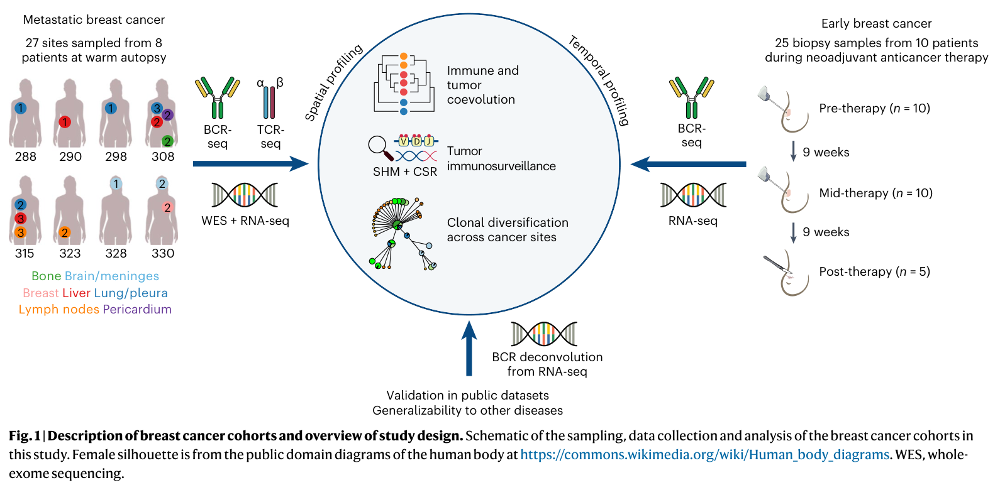
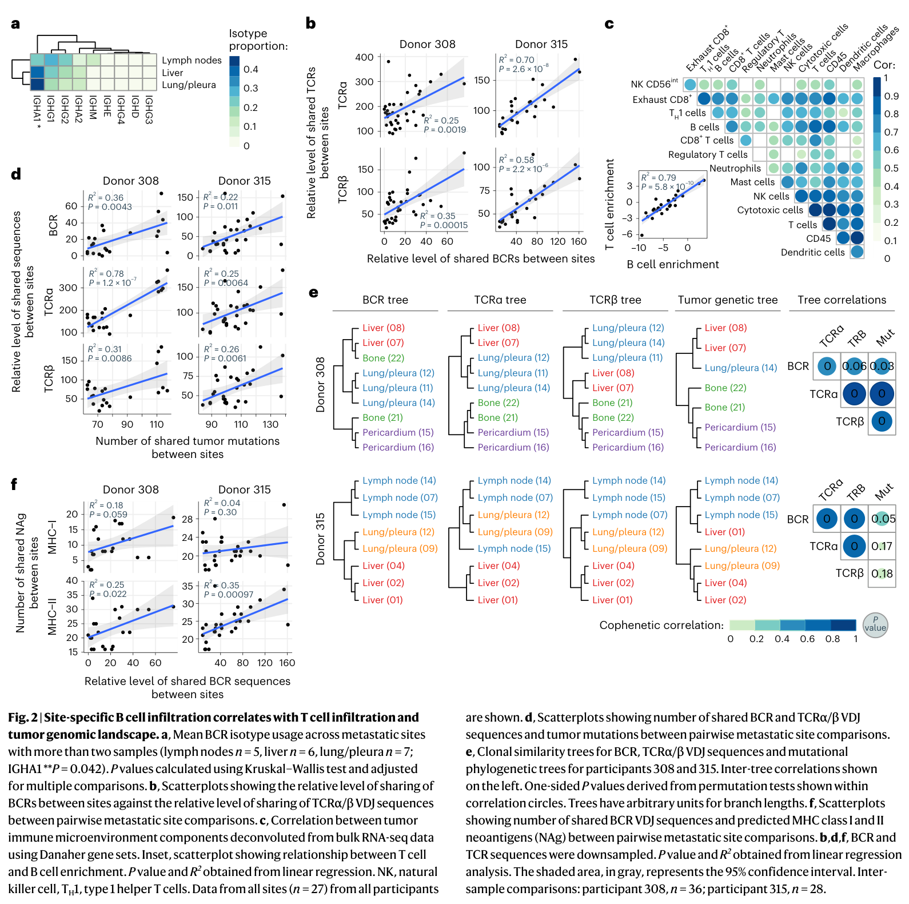
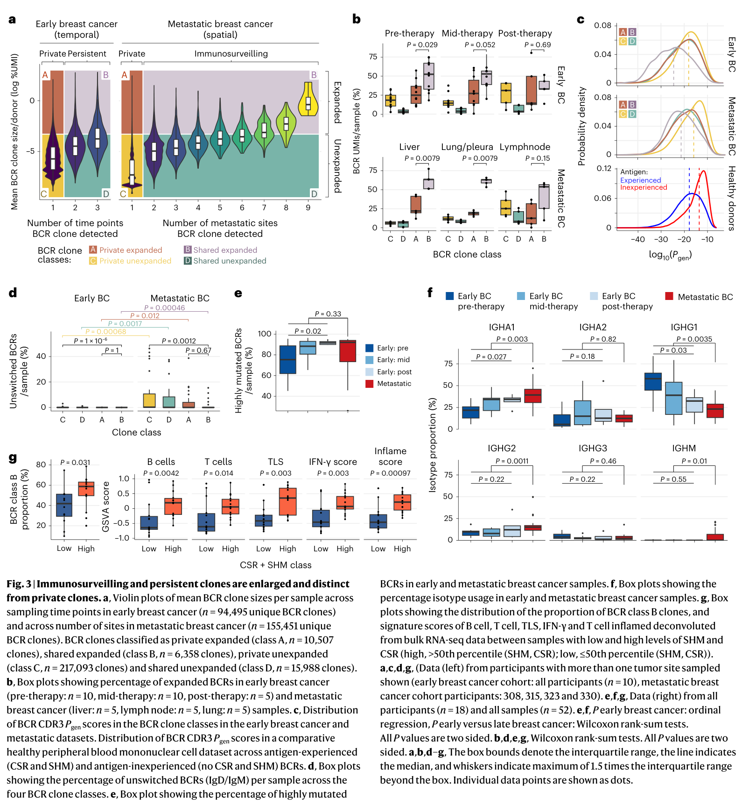
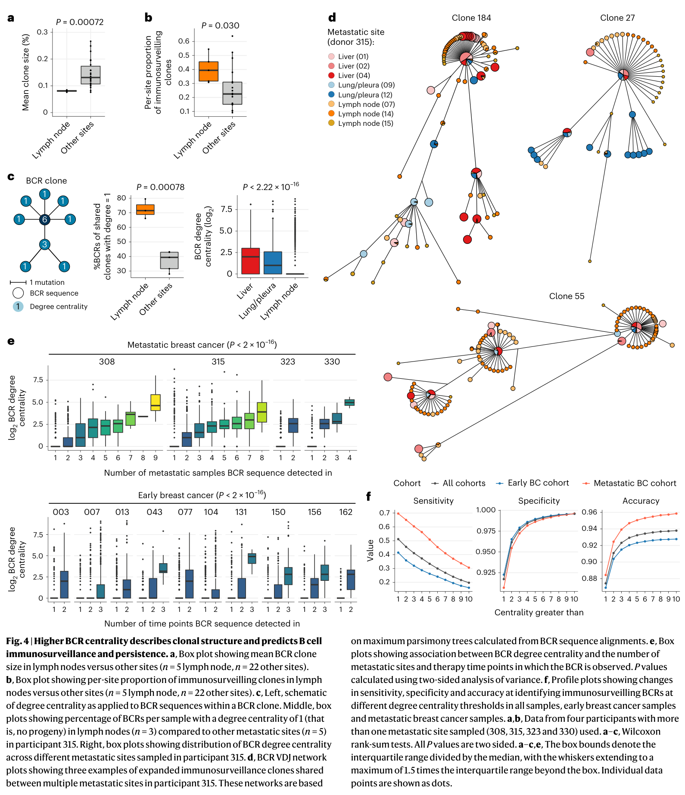

# Predictability of B cell clonal persistence and immunosurveillance in breast cancer

<!-- wechat-style-reviewed: 2026-08-13 -->

当同一名转移性乳腺癌患者的肝、肺或淋巴结病灶同时被取样时，一个真正棘手的问题才会出现：同一种 B 细胞克隆若在多个病灶中都能找到，它只是被重复抽到，还是参与了跨部位、持续存在的免疫反应？

一次活检很难回答这个问题。转移灶每个样本过滤后平均有 9,332 条独特 B 细胞受体（BCR）序列，早期乳腺癌活检也平均有 8,132 条；只看某次采样中的丰度，无法知道哪一条序列会跨病灶出现，或在治疗过程中留下来。

作者因此把两个互补队列放在一起：8 名转移性乳腺癌患者的 27 个转移灶提供空间轴，10 名早期乳腺癌患者的 25 次新辅助治疗序贯活检提供时间轴。研究不只测 BCR，还整合了 T 细胞受体（TCR）、肿瘤突变、转录组免疫生态和预测新抗原。

论文给出的答案是：跨病灶共享或跨时间持续存在的 BCR 克隆通常更扩增，也更符合经历过抗原选择的特征；在克隆序列网络中，连接更多邻近变体的高中心性 BCR，更容易被识别为共享或持久序列。但这是一套候选排序线索，还不是肿瘤抗原特异性或治疗功能的证明。

## 01｜为什么“肿瘤里有 B 细胞”还不够？

B 细胞浸润只能说明某个样本里存在 B 细胞，不能区分它们是局部旁观者、一次性扩增的克隆，还是能在多个病灶或多个治疗时间点被反复追踪的克隆。

BCR 序列为这种追踪提供了谱系标记。同一克隆在抗原经历中可能发生体细胞高突变和抗体同种型转换，因此研究者既能观察克隆是否扩增，也能观察它是否跨空间或时间出现，以及克隆内部如何继续分化。

这里需要先守住一个边界：跨病灶共享被作者操作性地称为“免疫监视”，跨治疗时间点出现被称为“时间持久性”。这两个定义描述的是可追踪性，并不自动证明这些 BCR 识别肿瘤抗原或产生了抗肿瘤效应。

## 02｜作者怎样同时观察空间和时间？

空间队列来自 8 名治疗耐受的转移性乳腺癌患者，共取到 27 个转移灶，覆盖骨、脑或脑膜、乳腺、肝、肺或胸膜、淋巴结和心包。每个转移灶过滤后平均得到 9,332 条独特 BCR，范围为 701–80,409 条。

时间队列来自 10 名接受新辅助治疗的早期乳腺癌患者，共有 25 次肿瘤活检：治疗前 10 次、治疗 9 周时 10 次、治疗完成后 5 次。每个样本平均得到 8,132 条独特 BCR，范围为 762–15,493 条。

简明图注：Fig. 1 中，8 名晚期患者的 27 个转移灶回答空间共享问题，10 名早期患者的 25 次活检回答治疗过程中的时间持久性问题。

## 03｜什么样的 BCR 才算“共享”“持久”？

作者先在同一患者内组装 BCR 克隆，再按两个维度分类：它是否只出现在一个样本，还是跨病灶或跨时间点共享；它是否发生了局部扩增。由此得到四类克隆，其中“共享且扩增”的 class B 是后续分析的重点。

研究另对符合条件的克隆计算序列间 Hamming distance，再构建 minimum spanning tree。某条序列在这棵无向树上连接的边越多，度中心性就越高；它衡量的是网络位置，而不是抗体结合力或细胞功能。这里的树边来自最小生成树，不能和前一步 clonotype assembly 中“相差一个非插入缺失核苷酸”的关系定义混为一谈。

跨样本共享很容易受到测序深度影响。在患者 308 和 315 的 Fig. 2 重叠分析中，作者按最低样本深度的 90% 进行 10,000 次下采样，并使用重叠结果的中位数，以降低“测得越深、看起来共享越多”的偏差。

## 04｜B 细胞反应真的与 T 细胞和肿瘤变化同步吗？

在全部 27 个转移灶中，转录组反卷积得到的 B 细胞与 T 细胞丰度高度相关，决定系数 `R²=0.79`；两类细胞的活化程度也相关，`R²=0.65`。在患者 308 和 315 中，BCR 与 TCR 的克隆共享结构在不同病灶间也呈相关；不同患者之间的共享很低。

肿瘤基因组层面的分析主要集中在至少有 4 个转移灶数据的患者 308 和 315。病灶间共享的 BCR/TCR 序列数量与共享体细胞突变数量相关，`R²=0.22–0.78`，`P≤0.011`。

BCR 克隆结构还与共享的预测 MHC II 类新抗原相关，`R²=0.25–0.35`，`P<0.022`；与预测 MHC I 类新抗原则未见相关。这个结果与 B 细胞摄取抗原并通过 MHC II 呈递的生物学模型一致，但新抗原来自计算预测，相关性也不能证明这些 BCR 直接识别了相应抗原。

简明图注：Fig. 2 中，27 个转移灶显示 B/T 细胞浸润相关；克隆共享与突变、新抗原的比较主要来自患者 308 和 315，属于结构关联而非因果证据。

## 05｜跨病灶或跨时间留下来的克隆有什么不同？

早期队列共识别 94,495 个独特 BCR 克隆，转移性队列为 155,451 个。一个克隆能在越多治疗时间点或越多转移灶中被检测到，它在单个样本中的平均克隆大小通常也越大；两种趋势的有序回归均为 `P<2.2×10⁻¹⁶`。

共享且扩增的 class B 克隆还表现出较低的 CDR3 随机生成概率、更多同种型转换，以及与体细胞高突变相关的抗原经验特征。高 SHM、高同种型转换的样本中，class B 比例也伴随更强的 B/T 细胞、三级淋巴结构、IFN-γ 和 T-cell-inflamed 转录特征。

作者没有在这些克隆中观察到已知病毒或细菌抗体序列的显著富集。这削弱了“只是常见感染或疫苗克隆再扩增”的解释，却仍不能把它们直接等同于肿瘤特异性 BCR。

简明图注：Fig. 3 中，94,495 个早期队列克隆与 155,451 个转移队列克隆显示，共享或持久克隆更扩增，并带有更多抗原经验特征；这些特征不等于已验证的肿瘤抗原特异性。

## 06｜只看网络位置，能否提前排出候选优先级？

在扩增克隆内部，并不是每条 BCR 变体都跨病灶或跨时间出现。度中心性较高的序列更常在多个转移灶中检测到，也更常跨多个治疗时间点保留；两项关联的 P 值均小于 `2.2×10⁻¹⁶`。

当作者用度中心性设置分类阈值时，`degree > 2` 识别共享或持久 BCR 的准确率超过 80%，而且对测序深度变化相对稳健。中心性与 SHM 水平相互独立，因此它提供的信息不只是“突变越多越重要”。

简明图注：Fig. 4 的高中心性序列更常跨病灶或跨时间出现；`degree > 2` 的超过 80% 准确率针对论文定义的共享/持久序列，不是患者结局或治疗反应预测。

## 07｜为什么中心性可能标记跨部位共享的克隆？

作者提出的解释与克隆多样化位置有关。在有多部位采样的 4 名患者中，5 个淋巴结转移灶相较其他 22 个部位具有更高的克隆多样性。中心性为 1 的比较则只来自患者 315（3 个淋巴结、5 个其他病灶）；该患者淋巴结中 `degree=1` 序列更多。

一种可能的图景是：淋巴结提供更多克隆变体探索，其他病灶则保留经过选择的中心性序列。全队列观察到的 MHC II 预测新抗原、B/T 细胞协同和三级淋巴结构转录特征，与“存在抗原经验和协同免疫”的背景相容，但没有直接检验淋巴结向其他病灶输出克隆这条路线。

但研究没有直接观察 B 细胞从淋巴结迁移到其他病灶，也没有证明网络中心节点就是谱系祖先或功能最优抗体。因此，“多样化场所”和“局部最优状态”都应保留为作者提出的解释模型。

## 08｜这项工作真正改变了什么？

它首先改变了候选序列的排序方式。从肿瘤浸润 B 细胞中获得大量 BCR 后，研究者不必只按丰度或突变数挑选，而可以把“是否跨病灶共享、是否跨时间持久、在克隆网络中是否居中”作为额外优先级，再进入抗原结合和功能实验。

它也提示，多部位和纵向采样回答的问题不同于单次深度测序：单次采样能看到局部扩增，多部位采样才能观察空间共享，序贯采样才能观察治疗过程中的持久性。作者还在两个乳腺癌数据集以及 1 型糖尿病、多发性硬化数据中看到类似的中心性—共享关系，但外部规模很小：HMF 虽有 16 人却只有 1 人可做同人跨灶比较，RAP 也只有 1 人，糖尿病和多发性硬化分别为 8 人和 3 人。

真正可执行的价值仍是“缩小需要验证的候选范围”。现有结果还不能把高中心性 BCR 当作治疗抗体，也不能据此预测患者生存或治疗获益。

## 09｜这些结果仍需要冷静看待

首先，clone 数量很大，但独立患者数很小：空间队列只有 8 人，深入的肿瘤—免疫克隆结构分析主要来自患者 308 和 315；时间队列只有 10 人，治疗完成后的活检仅 5 次。大量 sequence-level 观测不能替代患者层面的外部验证。

其次，转移队列来自治疗耐受、生命末期的 warm autopsy 患者，不能直接外推到早期可治愈乳腺癌、免疫治疗敏感人群或其他肿瘤。病灶两两比较也并非完全独立，相关系数不应被解释成肿瘤突变或新抗原驱动 BCR 演化的因果效应。

更关键的是，论文没有完成抗原特异性闭环。高中心性 BCR 尚未系统验证肿瘤抗原或新抗原结合，也没有功能杀伤、体内疗效或临床结局证据；MHC II 新抗原来自预测，三级淋巴结构来自转录签名而非组织学确认。

最后，中心性依赖克隆组装、序列相似性、最小克隆规模和网络构建参数。作者做了下采样和外部数据检查，但不同测序平台、组织来源和分析流程仍需重新校准。本地主 PDF 的正文、Methods 和图注可解析，补充表格未嵌入主 PDF，未核实部分不能在改写中被补写或推断。

---

## 技术附录

以下保留原笔记的论文信息、完整图注、Results 顺序、方法参数、统计解释和证据边界，并在文末补入本次句子级 PDF 解析与覆盖审计。

### 本文目录

- [基本信息](#基本信息)
- [本论文主图](#本论文主图)
- [生物学故事前情](#生物学故事前情)
- [重要缩写表](#重要缩写表)
- [论文详细解读](#论文详细解读)
- [研究问题与科学背景](#研究问题与科学背景)
- [研究设计与数据结构](#研究设计与数据结构)
- [方法与分析框架](#方法与分析框架)
- [原文结果完整梳理](#原文结果完整梳理)
  - [Multi-platform metastatic tumor profiling](#multi-platform-metastatic-tumor-profiling)
  - [B cell and T cell clonal structures are correlated](#b-cell-and-t-cell-clonal-structures-are-correlated)
  - [Adaptive immune and tumor genomic coevolution](#adaptive-immune-and-tumor-genomic-coevolution)
  - [Persistence and immunosurveillance of intra-tumoral B cells](#persistence-and-immunosurveillance-of-intra-tumoral-b-cells)
  - [Antigen experience of migratory and persistent clones](#antigen-experience-of-migratory-and-persistent-clones)
  - [BCR centrality reveals sites of clonal diversification](#bcr-centrality-reveals-sites-of-clonal-diversification)
  - [High BCR centrality of immunosurveilling and persistent BCRs](#high-bcr-centrality-of-immunosurveilling-and-persistent-bcrs)
- [作者结论与证据强度](#作者结论与证据强度)
- [独立方法学详解](#独立方法学详解)
  - [队列结构和问题映射](#队列结构和问题映射)
  - [BCR/TCR 数据生成和 clone 定义](#bcrtcr-数据生成和-clone-定义)
  - [Downsampling 和跨样本共享分析](#downsampling-和跨样本共享分析)
  - [肿瘤基因组、neoantigen 和免疫生态整合](#肿瘤基因组、neoantigen-和免疫生态整合)
  - [BCR clone 分类和 degree centrality](#bcr-clone-分类和-degree-centrality)
  - [统计学分析方法](#统计学分析方法)
  - [可重复性和迁移注意点](#可重复性和迁移注意点)
- [生物学与临床意义](#生物学与临床意义)
- [局限性与危险假设](#局限性与危险假设)
- [深度研究洞察](#深度研究洞察)
- [可借鉴或迁移的思路](#可借鉴或迁移的思路)
- [可复用学术表达](#可复用学术表达)
- [相关论文与概念](#相关论文与概念)
- [覆盖审计](#覆盖审计)

### 基本信息

- 原文题名：Predictability of B cell clonal persistence and immunosurveillance in breast cancer
- 期刊：Nature Immunology 25, 916-924
- 年份：2024
- DOI：10.1038/s41590-024-01821-0
- 第一作者：Stephen-John Sammut、Jacob D. Galson、Ralph Minter
- 通讯作者：Stephen-John Sammut、Carlos Caldas、Rachael J. M. Bashford-Rogers
- 研究领域：肿瘤免疫、BCR repertoire、TCR repertoire、乳腺癌转移、免疫监视、克隆演化
- 关键词：breast cancer、BCR、TCR、immunosurveillance、clonal persistence、somatic hypermutation、class-switch recombination、MHC class II neoantigen、tertiary lymphoid structure、degree centrality
- PDF 归档：`pdfs/processed/s41590-024-01821-0.pdf`
- PDF 解析质量：
  - 使用 `scripts/build_pdf_llm_pack.py` 建立句子级解析包 `tmp/b-cell-clonal-persistence-llm-pack.md`；本地 PDF 共 25 页、898 个句子 ID。
  - 自动分节只标出 14 个 Results ID，并把主文余下结果误标为 `methods` 或 `supplementary`。人工按论文语义校正后，Results 为 `P002.S0020-P007.S0034`（306 个 ID），Methods 为 `P010.S0002-P013.S0007`（201 个 ID）；两套范围在文末分别闭合。
  - Fig. 1 的图内内容位于 `P002.S0001-P002.S0007` 并与 `P002.S0020-P002.S0026` 的 Results 首段交错；Fig. 2 为 `P003.S0001-P003.S0045`、`P003.S0055-P003.S0086`，Fig. 3 为 `P005.S0001-P005.S0044`，Fig. 4 为 `P006.S0001-P006.S0022`。坐标、网络节点和图注被线性展平并插入正文，图内孤立标签不作独立证据。
  - 正文、Methods、主图与扩展数据图注、数据和代码可用性可解析；补充表格内容未嵌入主 PDF，本文不补造其中未核实的逐样本明细。

### 本论文主图

| 原文图 | 原文图题/核心信息 | 是否截取 | 图像文件 | 放置位置 |
|---|---|---|---|---|
| Fig. 1 | Description of breast cancer cohorts and overview of study design：转移性乳腺癌 warm autopsy 多部位采样和早期乳腺癌新辅助治疗序贯采样的研究设计 | 是 | `assets/immunology/2024-b-cell-clonal-persistence-breast-cancer/fig1-study-design.png` | [研究设计与数据结构](#研究设计与数据结构) |
| Fig. 2 | Site-specific B cell infiltration correlates with T cell infiltration and tumor genomic landscape：BCR/TCR 克隆结构与肿瘤突变和 MHC II neoantigen 架构相关 | 是 | `assets/immunology/2024-b-cell-clonal-persistence-breast-cancer/fig2-b-t-tumor-coevolution.png` | [Adaptive immune and tumor genomic coevolution](#adaptive-immune-and-tumor-genomic-coevolution) |
| Fig. 3 | Immunosurveilling and persistent clones are enlarged and distinct from private clones：跨部位免疫监视和治疗中持久存在的 BCR 克隆更扩增、更抗原经验化 | 是 | `assets/immunology/2024-b-cell-clonal-persistence-breast-cancer/fig3-shared-persistent-clones.png` | [Persistence and immunosurveillance of intra-tumoral B cells](#persistence-and-immunosurveillance-of-intra-tumoral-b-cells) |
| Fig. 4 | Higher BCR centrality describes clonal structure and predicts B cell immunosurveillance and persistence：BCR degree centrality 可预测跨部位免疫监视和时间持久性 | 是 | `assets/immunology/2024-b-cell-clonal-persistence-breast-cancer/fig4-bcr-centrality.png` | [High BCR centrality of immunosurveilling and persistent BCRs](#high-bcr-centrality-of-immunosurveilling-and-persistent-bcrs) |

### 生物学故事前情

肿瘤免疫研究长期以 T 细胞为中心：CD8 T 细胞识别肿瘤抗原、TCR 克隆扩增、免疫检查点治疗反应，这些构成了主流叙事。B 细胞虽然经常在肿瘤组织中出现，也和 TLS、抗体反应、预后或治疗反应有关，但它们到底是旁观者、局部炎症标志物，还是参与抗肿瘤免疫监视的克隆系统，一直没有被充分拆开。

乳腺癌尤其适合追问这个问题。转移性乳腺癌有多个解剖部位的肿瘤灶，早期乳腺癌新辅助治疗又提供治疗前后的时间轴。如果同一 BCR clone 能跨转移灶出现，或在治疗过程中持续存在，它就不只是一次局部采样看到的噪声，而是在样本中形成了可追踪的跨空间或跨时间信号；至于这是否代表免疫监视或免疫记忆，仍需要功能实验回答。

本文的关键前情是：BCR 不只是“有没有 B 细胞”的标志，还可以利用序列相似性重建克隆关系，观察体细胞突变和同种型转换，并比较同一克隆是否在不同部位或时间点被检测到。作者把 BCR/TCR repertoire、肿瘤突变、MHC II neoantigen、RNA-seq 免疫生态和图论 centrality 放在一起，想回答“哪些 B 细胞克隆更像值得继续验证的抗肿瘤免疫候选者”。

### 重要缩写表

| 缩写 | 中文含义 | 本文语境中的具体指代 | 阅读时注意 |
|---|---|---|---|
| BCR | B 细胞受体 | 本文追踪肿瘤浸润 B 细胞克隆的核心序列 | BCR 共享不自动等于肿瘤抗原特异性 |
| TCR | T 细胞受体 | 与 BCR 克隆结构共同分析的 T 细胞免疫受体 | 本文 TCR 更多用于共演化参照，不是唯一主角 |
| SHM | 体细胞高突变 | B 细胞抗原经验和克隆成熟的重要标志 | SHM 高不一定代表功能更强或更肿瘤特异 |
| CSR | class-switch recombination，同种型转换 | B 细胞从 IgD/IgM 转向 IgG/IgA 等抗体类别 | 反映抗原经验和 T cell help，但需结合上下文 |
| TLS | 三级淋巴结构 | 肿瘤组织内 B/T 细胞协同和局部免疫成熟结构 | TLS signature 是转录组推断，不等同于组织学确认 |
| MHC II | 主要组织相容性复合体 II 类分子 | 呈递抗原给 CD4 T 细胞，并与 B 细胞抗原呈递相关 | 本文 neoantigen 主要是计算预测 |
| WES | 全外显子测序 | 用于识别肿瘤突变和预测 neoantigen | 与免疫受体相关性不能直接证明因果 |
| RNA-seq | 转录组测序 | 用于反卷积免疫微环境、TLS 和炎症 signature | bulk RNA-seq 是混合细胞信号 |
| UMI | unique molecular identifier | BCR 测序中用于降低 PCR/测序偏倚的分子标签 | UMI 不能消除所有样本处理偏倚 |
| degree centrality | 度中心性 | BCR clone 网络中某条序列连接的邻居数量 | 是候选优先级指标，不是功能验证结果 |

### 论文详细解读

#### 研究问题与科学背景

肿瘤免疫编辑和免疫监视通常被讨论为 T 细胞主导过程。乳腺癌中，T 细胞浸润、TCR 克隆扩增和免疫治疗反应之间的关系已有较多研究；相比之下，B 细胞在抗肿瘤免疫中的作用仍更模糊。已有证据显示，肿瘤浸润 B 细胞、浆细胞抗体反应和三级淋巴结构与较好预后或治疗反应相关，但这些 B 细胞克隆是否在不同转移灶之间迁移、是否在治疗过程中持续存在、是否与肿瘤基因组和新抗原架构共同演化，并不清楚。

作者提出的问题可以概括为三层。第一，转移性乳腺癌内的 B 细胞反应是否与 T 细胞反应和肿瘤突变谱相关，从而符合免疫编辑或免疫共演化逻辑。第二，肿瘤内 B 细胞克隆是否存在跨转移灶的空间性免疫监视，或在新辅助治疗过程中的时间性持久存在。第三，如果确实存在这些共享或持久 BCR 克隆，能否从克隆网络结构中预测哪些 BCR 序列更可能具有免疫监视和持久性，从而为个体化抗体发现提供优先级。

这篇文章的关键不是简单证明“乳腺癌里有 B 细胞”，而是把 BCR repertoire 当作可追踪、可建模的抗肿瘤免疫轨迹。作者试图把空间多灶转移、时间序贯治疗、BCR/TCR 克隆结构、肿瘤 DNA/RNA 多组学和图论 centrality 放在同一个框架里。

#### 研究设计与数据结构

中文图注（基于原文图注）：图 1 展示本文两个乳腺癌队列的采样、数据采集和分析设计。左侧为空间 profiling：8 名转移性乳腺癌患者在 warm autopsy 中共采集 27 个转移灶，部位包括骨、脑/脑膜、乳腺、肝、肺/胸膜、淋巴结和心包；作者对这些样本进行 BCR-seq、TCR-seq、WES 和 RNA-seq，用于分析 B/T 细胞免疫受体库、肿瘤基因组和免疫微环境之间的关系。中间示意 BCR 通过 VDJ 重排、SHM 和 CSR 形成多样化抗原受体，并用于追踪肿瘤免疫监视、免疫与肿瘤共演化以及跨癌灶克隆多样化。右侧为时间 profiling：10 名早期乳腺癌患者在新辅助治疗期间采集 25 个肿瘤活检样本，包括治疗前 10 个、治疗 9 周中期 10 个、治疗后 5 个；作者进行 BCR-seq 和 RNA-seq，用于识别治疗过程中的 B 细胞克隆持久性。图中还标出公共数据验证和向其他疾病泛化的分析方向。WES 指 whole-exome sequencing，SHM 指 somatic hypermutation，CSR 指 class-switch recombination。

研究包含两个乳腺癌队列。转移性队列来自 VHIO warm autopsy program，共 8 名治疗耐受性转移性乳腺癌患者、27 个转移灶活检样本。每个患者可有不同器官部位采样，包括骨、脑/脑膜、乳腺、肝、肺/胸膜、淋巴结和心包等。作者对这些转移灶进行 BCR repertoire sequencing，并整合既往已报道的 WES、RNA-seq 和 TCR repertoire 数据。

早期乳腺癌队列来自 TransNEO study，共 10 名原发浸润性早期乳腺癌患者，在新辅助治疗过程中采集 25 个序贯肿瘤样本：治疗前 10 个，治疗 9 周中期 10 个，治疗完成后 5 个。这个队列用于分析治疗过程中 BCR 克隆是否时间性持久存在。

数据模态包括 BCR heavy chain repertoire、TCR alpha/beta repertoire、肿瘤全外显子测序、RNA-seq 免疫微环境反卷积、MHC I/II neoantigen 预测以及外部公共数据验证。转移性队列 BCR 过滤后每个转移灶平均得到 9,332 条 unique BCR，范围 701-80,409。早期队列每个活检样本平均得到 8,132 条 unique BCR，范围 762-15,493。

#### 方法与分析框架

作者从 RNA 中扩增 BCR variable heavy domains，使用 IgA/IgD/IgE/IgG/IgM 同种型特异引物和 UMI，并在 Illumina MiSeq 2 x 300 bp 平台测序。BCR reads 用 Immcantation framework 处理，经过 paired-end 合并、质量过滤、primer/UMI/sample barcode 识别、UMI consensus、IgBLAST 注释和 productive sequence 保留。BCR/TCR 序列注释和 clonotype assembly 使用 IMGT/HighV-QUEST 与 MRDARCY。

BCR clone 定义为同一个体内由同一 pre-B cell 衍生、具有相同或经 SHM 相关 BCR 序列的克隆群。在 MRDARCY 的 clonotype assembly 中，每个节点代表 unique sequence，边连接只差单个非 indel 核苷酸差异的序列；这一规则用于组装和展示克隆关系。TCR clone 则按相同 CDR3 与 V gene usage 相关序列聚类。

空间免疫监视分析中，作者把同一患者多个转移灶之间共享的 BCR 克隆视为 immunosurveilling clones。时间持久性分析中，作者把早期乳腺癌新辅助治疗期间多个时间点都能检测到的 BCR 克隆视为 temporally persistent clones。随后又按是否共享以及是否扩增，把 BCR clone 分成四类：A 为 private expanded，B 为 shared expanded，C 为 private unexpanded，D 为 shared unexpanded。shared 在转移性队列中对应跨转移灶，在早期队列中对应跨时间点。

图论分析是本文最有辨识度的方法。作者另对符合条件的扩增 BCR clone 计算序列间 Hamming distance，并据此构建最小生成树，再计算每条 BCR sequence 的 degree centrality，也就是该节点在树中连接的边数。这里的树边由最小生成树决定，并不要求恰好相差 1 个核苷酸。高 centrality 的 BCR 被解释为更可能处于克隆演化网络的中心，可能是多个后续变体的祖先或局部最优状态；degree 为 1 的节点则更像末端或未继续分化的变体。

#### 原文结果完整梳理

##### Multi-platform metastatic tumor profiling

作者首先在 27 个转移灶中进行 BCR repertoire 测序，并考察不同转移部位的 BCR 同种型使用。图 2a 显示，肝和肺/胸膜转移灶中 IgA1 占比更高。作者进一步用 GTEx 健康组织 bulk RNA-seq 数据估计正常组织的 IGH isotype 表达，发现转移灶中的 BCR/TCR 模式不同于健康组织本底。同时，转移性肿瘤组织的 IGH 和 TCR gene 表达高于正常组织。

这个结果用于排除一个基础替代解释：转移灶中的 BCR/TCR 差异不只是器官组织本身的免疫细胞组成差异，而更可能反映肿瘤相关免疫反应。不过这一层分析仍是表达和 repertoire 层面的关联，不能单独证明 BCR 对肿瘤抗原有直接特异性。

##### B cell and T cell clonal structures are correlated

作者用 Jaccard index 量化不同转移灶之间 BCR、TCR alpha 和 TCR beta VDJ 区域的克隆共享程度。不同患者之间的 BCR/TCR sequence sharing 很低，而同一患者不同转移灶之间共享程度明显更高，符合免疫受体库高度个体特异的特征。

在拥有至少 4 个转移灶 BCR/TCR 数据的患者 308 和 315 中，TCR alpha 与 TCR beta 克隆结构在转移灶之间相关。更重要的是，图 2b 显示 BCR 克隆结构也与 TCR alpha/beta 克隆结构相关。图 2c 基于 bulk RNA-seq 反卷积进一步显示，肿瘤浸润 B 细胞和 T 细胞的丰度高度相关，R2 = 0.79；B/T 细胞活化也相关，R2 = 0.65。B 细胞和 T 细胞富集还与 TLS signature 相关。

这一结果支持肿瘤内 B 细胞和 T 细胞不是独立噪声，而可能由共同的抗原、微环境或组织结构因素驱动。TLS 相关性尤其重要，因为 TLS 是肿瘤内 B/T 细胞协同、抗原呈递和局部免疫成熟的潜在组织基础。

##### Adaptive immune and tumor genomic coevolution

中文图注（基于原文图注）：图 2 展示部位特异性 B 细胞浸润、T 细胞浸润和肿瘤基因组景观之间的关系。a：比较超过 2 个样本的转移部位的平均 BCR isotype 使用，包括淋巴结 n = 5、肝 n = 6、肺/胸膜 n = 7；IgA1 在不同部位之间有显著差异，P = 0.042，使用 Kruskal-Wallis test 并进行多重比较校正。b：在转移灶两两比较中，将 BCR 共享相对水平与 TCR alpha/beta VDJ 序列共享相对水平作散点图；BCR 和 TCR 序列经过 downsampling，P 值和 R2 来自线性回归，灰色区域为 95% 置信区间。c：用 Danaher gene sets 从 bulk RNA-seq 数据反卷积肿瘤免疫微环境组分，并展示各组分相关性；内嵌散点图显示 B cell enrichment 与 T cell enrichment 的关系，数据来自全部 27 个转移灶，P 值和 R2 来自线性回归。d：在转移灶两两比较中，展示共享 BCR、TCR alpha/beta VDJ 序列数量与共享肿瘤突变数量的关系；BCR/TCR 序列经过 downsampling，P 值和 R2 来自线性回归，灰色区域为 95% 置信区间。e：展示患者 308 和 315 的 BCR、TCR alpha/beta VDJ clonal similarity trees 以及肿瘤突变 phylogenetic trees；左侧为树间 cophenetic correlation，相关圆内为 permutation test 的单侧 P 值，树枝长度为任意单位。f：在转移灶两两比较中，展示共享 BCR VDJ 序列数量与预测 MHC class I/II neoantigens 数量之间的关系；BCR 序列经过 downsampling，P 值和 R2 来自线性回归，灰色区域为 95% 置信区间。NAg 指 neoantigen，NK 指 natural killer cell，TH1 指 type 1 helper T cell。

作者接着追问 BCR/TCR 克隆结构是否与肿瘤基因组架构相互映射。图 2d 显示，在患者 308 和 315 中，不同转移灶之间共享 BCR/TCR 序列的数量与共享 somatic mutations 的数量显著相关，R2 范围为 0.22-0.78，P <= 0.011。这提示免疫受体克隆结构与肿瘤突变谱之间存在共变关系。

作者进一步构建 BCR、TCR alpha、TCR beta 的 Jaccard clonal similarity tree，并与基于 WES 的肿瘤突变系统发育树比较。图 2e 显示，BCR/TCR 树可以按器官转移部位聚类，并与肿瘤突变树有相似但较弱的相关性。这个结果支持一种空间共演化图景：转移灶的肿瘤基因组差异和局部适应性免疫克隆结构互相镜像。

neoantigen 分析提供了更具体的免疫解释。图 2f 显示，BCR clonal structure 与共享 MHC class II 预测 neoantigen 显著相关，R2 范围为 0.25-0.35，P < 0.022；但与 MHC class I 预测 neoantigen 不相关。TCR clonal structure 也观察到类似趋势。由于 B 细胞可以通过 BCR 摄取抗原并经 MHC II 呈递给 CD4 T 细胞，这一结果支持肿瘤 MHC II neoantigen 可能在协调 B/T 细胞反应中发挥作用。

需要注意，neoantigen 仍是计算预测，且作者不能区分 CD4 与 CD8 TCR。这里的证据更适合表述为“与 MHC II neoantigen architecture 相一致”，而不是直接证明这些 BCR 克隆都识别了具体 neoantigen。

##### Persistence and immunosurveillance of intra-tumoral B cells

中文图注（基于原文图注）：图 3 比较免疫监视或治疗中持久存在的 BCR 克隆与 private clones 的大小、抗原经验和免疫微环境特征。a：小提琴图展示早期乳腺癌中 BCR clone 在不同治疗时间点出现数量与平均 clone size 的关系，以及转移性乳腺癌中 BCR clone 在不同转移灶出现数量与平均 clone size 的关系；早期队列包含 94,495 个 unique BCR clones，转移性队列包含 155,451 个 unique BCR clones。BCR 克隆被分为 private expanded class A、shared expanded class B、private unexpanded class C 和 shared unexpanded class D。b：箱线图展示早期乳腺癌治疗前、中期、治疗后样本，以及转移性乳腺癌肝、淋巴结、肺样本中各类 expanded BCR 的 UMI 百分比。c：展示早期和转移性乳腺癌各 BCR clone class 的 CDR3 Pgen 分布，并与健康 PBMC 中 antigen-experienced 和 antigen-inexperienced BCR 的 Pgen 分布比较。d：箱线图展示四类 BCR clone class 中 unswitched BCR，即 IgD/IgM，占样本 BCR 的百分比。e：箱线图展示早期和转移性乳腺癌样本中 highly mutated BCR 的百分比。f：箱线图展示早期和转移性乳腺癌样本中的 IGH isotype 使用百分比。g：按 SHM 和 CSR 高低分组，比较 class B clone 比例，以及从 bulk RNA-seq 反卷积得到的 B cell、T cell、TLS、IFN-gamma、T cell inflamed signature 分数。图中部分分析仅使用有多个肿瘤部位或时间点采样的患者，因为 A-D 类克隆定义需要多样本结构；e、f、g 右侧包含全部 18 名患者和 52 个样本。P 值来自 ordinal regression 或 Wilcoxon rank-sum tests；箱线图显示四分位范围、中位数和 1.5 倍四分位距内须线，点为单个数据点。

在早期乳腺癌队列中，多个治疗时间点都能检测到的 BCR 克隆被定义为 temporally persistent clones；在转移性队列中，多个转移灶都能检测到的克隆被定义为 immunosurveilling clones。图 3a 显示，能跨更多时间点或更多转移灶出现的 BCR clone，其每个样本内的 clone size 更大，且 ordinal regression P < 2.2 x 10^-16。这说明共享/持久克隆不是因为总体测序量更高而偶然被发现，而是与局部克隆扩增相关。

按 A-D 四类克隆划分后，图 3b 显示 shared expanded clones，也就是 class B，在早期乳腺癌治疗过程中和转移性乳腺癌中都构成肿瘤浸润 BCR 序列的主要部分。转移性队列中，class B 在肝和肺/胸膜转移灶中的比例高于 private expanded class A；但在淋巴结转移灶中，class A 和 class B 比例差异不明显。这提示淋巴结中相当一部分活化 B 细胞可能是局部驻留或局部扩增，而非已经跨部位免疫监视。

作者还用已知病毒或细菌抗体数据库检查这些克隆类别是否富集已知非肿瘤抗原反应。结果没有看到显著富集，说明这些 shared/expanded BCR 不太可能只是常见感染或疫苗相关克隆的再扩增。当然，这并不等于证明它们一定是肿瘤特异性，只能说明没有明显被已知病原抗体库解释。

##### Antigen experience of migratory and persistent clones

作者用 OLGA 计算 BCR CDR3 probability of generation，估计某条 CDR3 由 VDJ 重排随机生成的概率。图 3c 显示，private unexpanded class C 的 Pgen 最高，接近健康外周血 naive 或 antigen-inexperienced B cells；而 class B 等共享或扩增类别 Pgen 更低，更像抗原经验化、个体特异选择后的 BCR。class B 的 Pgen 最低，支持 expanded immunosurveilling/persistent clones 经过选择，而不是随机背景。

随后作者从 SHM 和 CSR 两个角度分析抗原经验。图 3d 显示，class B 克隆有更高比例的 class-switched BCR，也就是 IgD/IgM unswitched BCR 比例更低。早期肿瘤浸润 B 细胞相较于转移灶浸润 B 细胞也有更低比例的 unswitched BCR。图 3e 显示，早期乳腺癌治疗过程中高度突变 BCR 比例增加，但转移性样本中该趋势相反，并且转移灶中低 SHM BCR 比例更高。AICDA 表达下降也支持转移灶中 SHM/CSR 活性较低。

图 3f 显示 isotype 使用随疾病过程变化：IGHA1 随时间或疾病阶段增加，IGHG1 降低，且该趋势主要由 class B 克隆驱动。图 3g 显示，高 SHM 与高 CSR 的肿瘤样本中，class B 比例更高，并伴随更高 B cell、T cell、TLS、IFN-gamma 和 T cell inflamed signature。整体上，shared expanded BCR 克隆更接近抗原驱动的肿瘤免疫反应，而非 naive B cell 背景。

##### BCR centrality reveals sites of clonal diversification

作者接着研究 BCR 克隆多样化发生在何处。图 4a 显示，淋巴结转移灶显示更低的 clonal unevenness，也就是更高的 clonal diversity；但淋巴结中 expanded clones 的数量更多。图 4b 显示，淋巴结中 immunosurveilling clones 的 unique BCR 比例更高。这一组结果被解释为：淋巴结可能是 BCR 克隆多样化和变体探索的主要场所，并向其他转移部位输出部分免疫监视 B 细胞。

图 4c 的 degree centrality 分析进一步支持这个解释。淋巴结中更多 BCR 的 degree centrality 为 1，作者将这些序列解释为更接近末端或探索性变体；非淋巴结转移灶中 degree > 1 的 BCR 比例更高，被解释为更富集已经选择的中心性变体。由此形成了“淋巴结偏多样化探索、其他转移灶偏选择后驻留”的模型，但研究没有直接追踪细胞迁移，不能把它当作已证实的路线。

##### High BCR centrality of immunosurveilling and persistent BCRs

中文图注（基于原文图注）：图 4 展示 BCR degree centrality 如何描述克隆结构并预测 B 细胞免疫监视和持久性。a：箱线图比较淋巴结与其他转移部位的 mean BCR clone size，淋巴结 n = 5，其他部位 n = 22；数据来自有多个转移灶采样的 4 名患者。b：箱线图比较淋巴结与其他转移部位中 immunosurveilling clones 的 per-site proportion，淋巴结 n = 5，其他部位 n = 22。c：左侧示意 degree centrality 在 BCR clone 网络中的定义；中间比较患者 315 中淋巴结和其他转移灶里 degree centrality = 1、即无后续 progeny 的 BCR 百分比；右侧展示患者 315 不同转移灶中的 BCR degree centrality 分布。d：展示患者 315 中 3 个 expanded immunosurveillance clones 的 BCR VDJ network，这些克隆跨多个转移灶共享，网络基于 BCR sequence alignment 的 maximum parsimony trees。e：箱线图展示 BCR degree centrality 与该 BCR 被检测到的转移灶数量、治疗时间点数量之间的关系；P 值来自双侧 ANOVA。f：profile plots 展示用不同 degree centrality 阈值识别 immunosurveilling BCR 时 sensitivity、specificity 和 accuracy 的变化，分别在全部样本、早期乳腺癌样本和转移性乳腺癌样本中评估。a-c 使用 Wilcoxon rank-sum tests；点为单个数据点。原文对 a-c、e 的图注字面写为“箱体边界等于四分位距除以中位数”，须线延伸至箱体外 1.5 倍四分位距；前半句与常规箱线图定义冲突，本文保留异常而不代为改正。

作者最后问：在一个 expanded shared clone 内，是所有 BCR 变体都能跨部位或跨时间被检测到，还是只有其中一部分变体反复出现。通过对 expanded clones 构建最大简约树和非环状网络，图 4d 显示高 centrality BCR 更常出现在多个转移灶或多个治疗时间点，而 degree = 1 的 BCR 多为单部位出现；这描述的是检测分布，不是细胞迁移的直接证据。

图 4e 显示，BCR degree centrality 与 BCR 被检测到的转移灶数量显著相关，P < 2.2 x 10^-16；也与其被检测到的治疗时间点数量显著相关，P < 2.2 x 10^-16。这个 centrality 不是简单由 SHM 最高解释，因为 BCR degree centrality 与 SHM level 独立。作者据此提出，高 centrality BCR 可能代表克隆响应中的 local optima，而不一定是突变最多的终末版本。

预测层面，图 4f 显示用 degree centrality 作为阈值分类器可以识别 immunosurveilling 或 clonally persistent BCR。degree > 2 的阈值在识别免疫监视和持久 BCR 时准确率超过 80%，且对测序深度较稳健。作者还在两个独立乳腺癌数据集，以及 1 型糖尿病和多发性硬化等非肿瘤免疫疾病数据中观察到类似的 centrality-共享关系，说明该规律可能不是乳腺癌特有。

这个结果是全文最具转化潜力的一点：BCR network centrality 可以作为候选抗体序列优先级指标。但它仍是观察性和结构预测，尚未证明高 centrality BCR 对肿瘤抗原有功能性结合，也未证明其抗体形式具有治疗活性。

#### 本次审阅补充的分母与外部验证规模

- 两个队列合计 18 名患者、52 份肿瘤样本。Fig. 2 中患者 308 和 315 的病灶两两比较分别为 36 对和 28 对；这些 pairwise observations 共享同一患者和病灶，不能当作完全独立样本（`P003.S0086-P003.S0090`、`P005.S0041`）。
- Fig. 3 的四类 clone 数分别为 class A 10,507、class B 6,358、class C 217,093、class D 15,988，总计 249,946；class B 在“BCR 序列/UMI 丰度”层面占比较高，不代表它是 clone 数量上的多数（`P004.S0029-P004.S0034`、`P005.S0017-P005.S0018`）。
- Fig. 3 的转移灶分部位比较实际为肝、淋巴结、肺各 `n=5`；Fig. 4a/b 的淋巴结 `n=5` 对其他病灶 `n=22` 来自 4 名患者，而 Fig. 4c 的 `degree=1` 比较只来自患者 315 的 3 个淋巴结和 5 个其他病灶（`P005.S0019`、`P006.S0008-P006.S0011`）。
- 外部一致性检查远小于主文“泛化”一词可能造成的印象：HMF 有 16 人但仅 HMFN_0320 可做同人跨灶比较，RAP 也只有患者 828433；1 型糖尿病和多发性硬化分别为 8 人和 3 人（`P012.S0053-P012.S0058`、`P022.S0006-P022.S0007`）。

#### 作者结论与证据强度

作者较有力证明的是：乳腺癌转移灶中的 BCR 和 TCR 克隆结构彼此相关，并与肿瘤突变和 MHC II neoantigen 架构存在显著关联；跨转移灶或跨治疗时间点共享的 BCR 克隆更扩增、更抗原经验化；BCR degree centrality 与克隆免疫监视和时间持久性显著相关，并可作为预测指标。

作者合理但仍需进一步证明的是：这些高 centrality、shared expanded BCR 克隆可能代表具有抗肿瘤免疫意义的 B 细胞反应，并可用于加速个体化抗体治疗发现。现有数据支持优先级排序，但还没有完成抗原结合、功能杀伤、体内疗效或临床结局预测的闭环。

作者没有证明的是：所有 shared/persistent BCR 都是肿瘤抗原特异性；BCR centrality 与患者生存或治疗获益存在因果关系；MHC II neoantigen 直接驱动了这些 BCR/TCR 克隆结构。本文的强项是多组学关联、空间时间克隆追踪和网络结构预测，而不是功能免疫学验证。

### 独立方法学详解

#### 队列结构和问题映射

样本层面，转移性队列提供空间结构，早期队列提供治疗时间结构。这样的设计非常适合研究“共享”和“持久”这两个概念，但样本量有限：转移性队列 8 人，且真正用于多部位 clonal structure 深入分析的主要是具有多个转移灶数据的患者；早期队列 10 人，治疗完成样本只有 5 个。因此作者将大量分析放在 clone-level 或 sequence-level 上，但独立患者数仍是解释结果时的主要边界。

#### BCR/TCR 数据生成和 clone 定义

作者从 RNA 扩增 BCR variable heavy domains，使用 IgA/IgD/IgE/IgG/IgM 同种型特异引物和 UMI，在 Illumina MiSeq 2 x 300 bp 平台测序。BCR reads 经过 paired-end 合并、质量过滤、primer/UMI/sample barcode 识别、UMI consensus、IgBLAST 注释和 productive sequence 保留。BCR/TCR 序列注释和 clonotype assembly 使用 IMGT/HighV-QUEST 与 MRDARCY。

BCR clone 被定义为同一个体内由同一 pre-B cell 衍生、具有相同或经 SHM 相关 BCR 序列的克隆群。TCR clone 则按相同 CDR3 与 V gene usage 相关序列聚类。这个定义决定了后续“共享”“持久”和“centrality”都是建立在克隆装配规则之上，因此不同 pipeline 或阈值可能改变边界。

#### Downsampling 和跨样本共享分析

BCR/TCR overlap 分析中，为减少测序深度影响，作者对样本进行 downsampling。例如患者 308 和 315 的 BCR/TCR clonal sharing 分析按最低深度的 90% 进行 10,000 次 subsampling，并使用 overlap 中位数。这一点很重要，因为跨样本共享序列数量很容易受测序深度驱动。

空间队列中，同一患者多个转移灶之间共享的 BCR 克隆被解释为 immunosurveilling clones；时间队列中，新辅助治疗多个时间点都能检测到的 BCR 克隆被解释为 temporally persistent clones。这个定义有清晰优势，也有边界：共享说明克隆跨空间或时间可追踪，但不能自动证明抗原特异性或功能效应。

#### 肿瘤基因组、neoantigen 和免疫生态整合

肿瘤基因组层面，somatic mutations 与 MHC I neoantigen 来自 WES；MHC II allele genotyping 用 HLA-HD，MHC II neoantigen 用 mixMHC2pred，保留 percentage rank cutoff 2% 的候选。RNA-seq 反卷积使用 MCPcounter、Danaher gene sets、TLS signature、CYT score、T cell inflamed score、IFN-gamma score 和 B cell activation score。也就是说，作者把免疫受体克隆结构和常规 bulk RNA-seq 免疫生态指标进行了交叉验证。

#### BCR clone 分类和 degree centrality

BCR clone classification 中，stem/clade/private 表示同一患者内全样本共享、部分样本共享或单样本私有；再结合 Gaussian mixture model 设定的 clone size cutoff，把克隆分成 A-D 四类。该分类把“空间/时间共享”和“局部扩增”拆开，使得作者可以区分单纯偶然共享、局部扩增和真正 shared expanded 的高优先级克隆。

degree centrality 的核心假设是，BCR clone 内部的序列网络形状携带了克隆选择和迁移潜力的信息。作者保留至少两个肿瘤样本出现且至少 10 条 unique BCR sequence 的 clone，构建 pairwise Hamming distance、neighbor-joining tree、maximum parsimony tree 和 minimum spanning tree，再在 undirected graph 上计算 degree。这个方法比只按 clone size 或 SHM 数量排序更细，因为它关注每条 BCR sequence 在克隆网络中的位置。

#### 统计学分析方法

本文的统计分析围绕三类问题：组间差异、跨模态相关、克隆共享/持久性的预测。组间差异方面，作者使用 Kruskal-Wallis test 比较多个转移部位的 BCR isotype 使用差异，使用 Wilcoxon rank-sum tests 比较两组样本的 clone size、centrality 或免疫特征。Kruskal-Wallis 和 Wilcoxon 都是非参数方法，适合样本量小、分布未知或明显偏态的 repertoire 指标；它们检验的是分布位置差异，不直接给出机制因果。

跨模态相关主要用线性回归、R2 和 P 值描述。例如 BCR sharing 与 TCR sharing、免疫细胞 enrichment、共享 somatic mutations、MHC II neoantigen 数量之间的关系。这里输入通常是转移灶两两比较后的共享程度或数量，输出是线性相关强度。R2 说明一个变量能解释另一个变量多少变异，但转移灶 pairwise comparison 并不完全独立，因此解释时应把它看作结构相关证据，而不是独立样本的强因果检验。

树结构相似性使用 cophenetic correlation 和 permutation test。cophenetic correlation 比较 BCR/TCR clonal similarity tree 与肿瘤突变 phylogenetic tree 的拓扑相似性；permutation test 通过随机打乱标签构建零分布，判断观察到的树相似性是否超过随机水平。这个方法回答“免疫克隆结构是否镜像肿瘤系统发育结构”，不能证明肿瘤突变直接驱动某个 BCR clone。

克隆扩增和共享的趋势分析使用 ordinal regression。输入是 BCR clone 出现在几个时间点或几个转移灶，以及对应 clone size；输出是共享/持久程度与克隆扩增之间是否存在有序趋势。这个模型适合“出现于 1、2、3 个部位/时间点”这类有序结局，比简单二分类更保留信息。

BCR centrality 的预测部分使用阈值分类，并报告 sensitivity、specificity 和 accuracy。degree > 2 这类阈值回答的是“用网络中心性筛选 immunosurveilling 或 persistent BCR 的实用表现”。敏感度高意味着少漏掉候选共享/持久 BCR，特异度高意味着少选入非共享/非持久 BCR；准确率会受类别比例影响，因此不能单独作为最佳阈值依据。作者还用 downsampling 和外部数据验证降低测序深度和数据集特异性的影响。

#### 可重复性和迁移注意点

可重复性方面，作者提供了 EGA 数据访问编号，示例 processed data 和 R framework 位于 GitHub `sjslab/BCR-Immunosurveillance`。代码可用性对这类 repertoire network 分析很关键，因为 clone assembly、网络阈值、downsampling 和 centrality 计算都会影响结果。

#### 本次审阅补充的关键复现参数与原文异常

- BCR 建库使用 15-nt UMI、6 个 FR1 引物和 7-nt sample barcode，目标扩增片段约 450 bp；每个样本不超过 500 ng 的纯化 BCR amplicon 用于连接 KAPA 双索引接头。paired reads 要求 overlap 至少 20 nt、最大错误率 0.2、Phred 至少 20；`usearch` identity 为 80%，UMI consensus 要有超过 2 条 reads，注释使用 IgBLAST 1.14/Immcantation 3.0（`P010.S0058-P011.S0007`）。
- 病原抗体对照库只有 5,800 条序列，并允许 CDR3 最多 3 个氨基酸错配；“未见富集”只能削弱这一已知库的解释，不能排除所有病毒或细菌反应（`P011.S0008-P011.S0014`）。
- 患者 308 的 BCR/TCRalpha/TCRbeta 下采样阈值分别为 980/4,657/2,620，患者 315 为 1,524/3,199/2,535；均下采样 10,000 次。Fig. 2b、d、f 和迁移图使用共享序列或克隆数量的中位数，只有 Fig. 2e 的相似性矩阵使用 Jaccard coefficient 中位数；树比较使用 `ward.D2` 和 100 次单侧 permutation（`P011.S0018-P011.S0035`）。
- expanded clone cutoff 由 MClust 5.4.9 的 Gaussian mixture model 给出，并要求 expanded clones 少于 total repertoire 的 10%。Pgen 使用 OLGA 1.2.4；对照中 antigen-experienced BCR 定义为发生 class switching 且 somatic mutations 超过 4 个，SHM 分箱为 0–1、1–10、11–33 和大于 33（`P011.S0036-P012.S0028`）。
- clone-level 扩增/多样化分析按最低深度的 90% 做 1,000 次下采样。centrality 网络先以 0.95 identity 筛 clone，保留至少 2 个肿瘤样本出现且至少 10 条 unique BCR 的 clone；多序列比对两端裁到至少 95% 序列在端点仍有对齐核苷酸，并要求裁剪后至少 80 nt，再由 pairwise Hamming distance 构建 minimum spanning tree（`P012.S0029-P012.S0050`）。
- 进入 centrality 分析的 clone 数为患者 308：204、315：733、323：85、330：23。分类比较阈值 `degree>1`、`>2`、`>10`，使用 caret 6.0-90 计算 sensitivity、specificity 和 accuracy（`P012.S0040-P012.S0063`）。
- 原文有三处不能静默修正的异常：`P004.S0039` 字面写成 “other clonal groups (B, C and D)”；`P010.S0065` 字面为 “2–83 PCR cycles”；Fig. 4 图注 `P006.S0021` 将 box bounds 写成 “IQR divided by median”。这些表述与上下文或常规箱线图定义冲突，复现时必须回看原 PDF/代码，本文不代作者改写。

### 生物学与临床意义

这篇文章把 B 细胞从“肿瘤浸润免疫细胞的一类”提升为可以追踪肿瘤免疫监视和免疫编辑的克隆系统。BCR 克隆结构不仅与 TCR 克隆结构相关，还与肿瘤突变和 MHC II neoantigen 相关，提示 B 细胞可能参与抗原摄取、MHC II 呈递、CD4 T 细胞协同和 TLS 相关局部免疫组织化。

对乳腺癌研究而言，最有价值的概念是 spatial immunosurveillance。转移性疾病中，不同转移灶不是免疫学上完全孤立的生态位；一部分 BCR clone 可以跨部位出现，并且这些共享克隆具有更强扩增和抗原经验特征。这为理解系统性抗肿瘤免疫、转移灶间免疫传播和个体化抗体发现提供了框架。

临床转化上，BCR degree centrality 可作为候选抗体序列的排序规则。传统从肿瘤浸润 B 细胞中找抗体，常会面对海量 BCR 序列，不知道优先验证哪一条。本文提出：优先考虑在克隆网络中中心性高、跨部位共享或跨时间持久的 BCR，可能更有机会找到与肿瘤免疫监视相关的抗体。

### 局限性与危险假设

第一，样本量和患者覆盖有限。虽然 clone-level 数量很大，但真正决定泛化性的患者数不多。尤其 warm autopsy 转移性样本代表治疗耐受、晚期、死亡前疾病状态，不能直接外推到早期可治愈乳腺癌或免疫治疗敏感人群。

第二，抗原特异性仍未闭环。作者未观察到与 5,800 条已知病毒/细菌抗体序列的明显富集，但这不足以排除病原反应；研究也没有系统展示高 centrality BCR 的肿瘤抗原结合、neoantigen 结合或功能效应。因此不能把 high-centrality BCR 直接等同于 tumor-specific antibody。

第三，MHC II neoantigen 相关性是预测和关联。MHC II neoantigen 预测本身有误差，且 BCR/TCR 克隆结构与 MHC II neoantigen 的相关也可能受共同的肿瘤克隆结构、组织部位、免疫浸润程度或治疗历史影响。

第四，centrality 可能受网络构建参数影响。BCR clone assembly 阈值、sequence identity cutoff、保留 clone 的最小 size、alignment trimming、Hamming distance 和 MST 构建都会影响 degree centrality。作者做了外部数据验证和测序深度稳健性分析，但实际使用时仍需要针对不同测序平台和组织来源校准。

### 深度研究洞察

本文最重要的科研逻辑是把免疫受体序列的“网络位置”视为功能优先级，而不是只看序列丰度或突变数。clone size 说明某个克隆被扩增；SHM 说明经历过生发中心相关突变；但 centrality 说明某条序列在克隆演化空间中的结构位置。这个指标可能更接近“哪些 BCR 变体被反复选中并参与扩散”。

第二个启发是空间和时间是 repertoire 研究的核心维度。只做单点肿瘤 BCR 测序，最多能看到局部扩增；多转移灶采样可以看到 immunosurveillance；治疗序贯采样可以看到 persistence。对于肿瘤免疫研究，纵向与多部位设计比单纯增加单样本测序深度更能回答机制问题。

第三个启发是 B 细胞可能是连接肿瘤抗原、CD4 T 细胞、TLS 和系统免疫记忆的关键中介。过去乳腺癌免疫常围绕 CD8 T cells、PD-1/PD-L1 和 TILs 展开；本文提示 BCR repertoire、MHC II neoantigen 和 TLS 应作为同一个免疫生态模块考虑。

### 可借鉴或迁移的思路

对于胃癌、胃癌前病变和 H. pylori 相关研究，本文的设计有很强可迁移性。H. pylori 感染、慢性胃炎、萎缩、肠化、异型增生和胃癌构成长期抗原刺激和组织重塑过程，BCR/TCR repertoire 很可能记录了宿主-微生物-肿瘤之间的免疫历史。可借鉴的问题是：哪些胃黏膜或外周 BCR/TCR 克隆在不同病灶、不同时间点或根除治疗前后持续存在；这些克隆是否与局部 TLS、MHC II 表达、微生物抗原和癌前进展风险相关。

如果要迁移本文框架，关键不是简单复制 centrality 指标，而是保留“多部位或纵向采样 + 克隆共享定义 + 克隆网络结构 + 组织免疫生态 + 抗原或病理锚点”的完整设计。对于 GIM 进展预测，可以把 shared/persistent BCR/TCR clone、SHM/CSR、局部 B cell/T cell signature、H. pylori 状态和病理演变结合起来，研究哪些 immune repertoire 特征稳定预测癌前病变进展或逆转。

对于空间转录组，本文也提示可以把 receptor repertoire 与组织结构结合：TLS 区域、肿瘤边缘、黏膜腺体和淋巴滤泡中的 BCR/TCR clone 是否共享；高 centrality BCR 是否更集中在特定空间生态位；这些克隆是否与抗原呈递细胞、CXCL13/CCL19/CCL21 和 IFN-gamma 程序共定位。

### 可复用学术表达

本文值得学习的表达是把 BCR clone 的跨部位出现称为 immunosurveillance，而不是简单说 clone sharing。这个词把观察到的空间共享转化为一个可检验的免疫学概念，但作者仍通过“seem to”“suggesting”等措辞保留观察性研究的边界。

第二种表达是将 degree centrality 定义为 prioritization tool。作者没有直接宣称 high-centrality BCR 就是治疗抗体，而是说它可以加速识别 potential immunosurveilling and clonally persistent antibodies。这种写法适合转化医学论文：先提出排序逻辑，再留出功能验证空间。

第三种表达是把 BCR/TCR 与 tumor molecular landscape 的关系写成 coevolution。这个词比 correlation 更有生物学叙事力，但又没有直接声称因果机制已经被证明。未来写多组学免疫演化文章时，可以借鉴这种“结构相关 + 机制假说 + 谨慎边界”的叙述方式。

### 相关论文与概念

Cancer immunoediting 和 immunosurveillance 是本文的理论背景，尤其是免疫系统限制但未完全清除肿瘤，进而与肿瘤克隆演化互相塑形的框架。

Tertiary lymphoid structures 是解释 B/T 细胞协同和局部抗原驱动免疫成熟的重要组织结构。本文中 B/T cell enrichment 与 TLS signature 的关系，使 TLS 成为连接 repertoire 与组织免疫生态的关键概念。

MHC class II neoantigen 是本文区别于传统 CD8/MHC I 肿瘤免疫叙事的重要点。BCR 与 MHC II neoantigen 架构相关，提示 B 细胞抗原呈递和 CD4 T cell help 可能参与乳腺癌抗肿瘤免疫。

MRDARCY、Immcantation、OLGA、TRUST4、MCPcounter、GSVA 和 graph centrality 是本文方法学相关工具。未来复现或迁移时，最应关注 clone assembly、downsampling、network construction 和 centrality threshold 的平台依赖性。

### 覆盖审计

本次审阅逐一处理本地 PDF pack 的 898 个句子 ID，并按论文真实章节语义纠正自动分节。下表确认 Results、Methods 的连续来源范围均已进入相应结果或方法模块；它不是 898 句逐句双语翻译，图内孤立坐标也不冒充独立证据。

#### Results 证据覆盖

| 原文 Results 子节 | 连续句子 ID | 数量 | 覆盖状态 |
|---|---|---:|---|
| Multi-platform metastatic tumor profiling | `P002.S0020-P002.S0036` | 17 | 已覆盖队列、BCR 产量、部位同种型和正常组织对照 |
| B cell and T cell clonal structures are correlated | `P002.S0037-P003.S0086` | 101 | 已覆盖 Jaccard、B/T 克隆与浸润/TLS；Fig. 1/2 展平内容单列为低置信 |
| Adaptive immune and tumor genomic coevolution | `P003.S0087-P004.S0013` | 20 | 已覆盖 308/315、共享突变、树结构和 MHC-I/II 新抗原边界 |
| Persistence and immunosurveillance | `P004.S0014-P004.S0034` | 21 | 已覆盖 10 人/25 活检、clone size 趋势和 A-D 操作性定义 |
| Antigen experience of migratory and persistent clones | `P004.S0035-P005.S0021` | 54 | 已覆盖 Pgen、SHM/CSR、isotype、病原库与 Fig. 3 完整图注 |
| BCR centrality reveals sites of clonal diversification | `P005.S0022-P007.S0004` | 63 | 已覆盖淋巴结/其他部位分母、网络位置和空间解释边界 |
| High BCR centrality of immunosurveilling and persistent BCRs | `P007.S0005-P007.S0034` | 30 | 已覆盖部位/时间关联、`degree>2`、外部小样本与结论 |
| **Results 合计** | `P002.S0020-P007.S0034` | **306** | **306/306 个语义 Results ID 已分配到模块** |

#### Methods 与复现覆盖

| 原文方法模块 | 连续句子 ID | 数量 |
|---|---|---:|
| Study population | `P010.S0002-P010.S0011` | 10 |
| DNA、WES、HLA 与 neoantigen | `P010.S0012-P010.S0018` | 7 |
| RNA-seq 与 TME deconvolution/signatures | `P010.S0019-P010.S0047` | 29 |
| GTEx isotype 对照 | `P010.S0048-P010.S0057` | 10 |
| BCR library preparation | `P010.S0058-P010.S0066` | 9 |
| BCR-seq processing | `P010.S0067-P010.S0077` | 11 |
| BCR clonotype assembly | `P011.S0001-P011.S0007` | 7 |
| 病原抗体库重叠 | `P011.S0008-P011.S0014` | 7 |
| TCR library preparation | `P011.S0015-P011.S0017` | 3 |
| BCR/TCR clonal overlap 与 downsampling | `P011.S0018-P011.S0029` | 12 |
| overlap/genomic trees | `P011.S0030-P011.S0035` | 6 |
| clone classification | `P011.S0036-P011.S0046` | 11 |
| Pgen | `P011.S0047-P011.S0052` | 6 |
| isotype、SHM 与统计比较 | `P011.S0053-P012.S0028` | 30 |
| clonal expansion/diversification | `P012.S0029-P012.S0039` | 11 |
| network analysis、centrality 与外部验证 | `P012.S0040-P012.S0063` | 24 |
| Reporting summary | `P012.S0064` | 1 |
| DOI 页眉（非内容） | `P013.S0001` | 1 |
| Data availability | `P013.S0002-P013.S0004` | 3 |
| Code availability | `P013.S0005-P013.S0007` | 3 |
| **Methods 合计** | `P010.S0002-P013.S0007` | **201** |

上述范围为 `201/201`；扣除 `P013.S0001` 的 DOI 页眉后，内容型 Methods 为 `200/200`。

#### 自动标签闭合与解析边界

自动 `results` 标签为 `P002.S0020-P002.S0033`，共 `14/14`，均属真实 Results。自动 `methods` 共 `328/328`，其中 127 个实际是 `P002.S0034-P004.S0016` 的 Results，201 个才是 `P010.S0002-P013.S0007` 的 Methods。自动 `supplementary` 共 `230/230`，其中 165 个实际是 `P004.S0017-P007.S0034` 的 Results，65 个为 `P014.S0002-P022.S0008` 的扩展数据/附属内容。校正后的全包分布为 title 38、other 19、Results 306、discussion 27、references 242、Methods 201、supplementary 65，总计 898。

需要保留的 `EXTRACTION_CHECK` 包括：

- 图内展平：Fig. 1 `P002.S0001-P002.S0007` 并与 `P002.S0020-P002.S0026` 交错；Fig. 2 `P003.S0001-P003.S0045`、`P003.S0055-P003.S0086`；Fig. 3 `P005.S0001-P005.S0044`；Fig. 4 `P006.S0001-P006.S0022`；
- Results 主要换栏/跨页重排：`P002.S0020-P002.S0026`、`P002.S0046→P003.S0046`、`P004.S0066→P005.S0020-P005.S0021`、`P005.S0022→P005.S0045`、`P005.S0053→P006.S0012`、`P006.S0013-P006.S0023`、`P006.S0024→P007.S0001`；
- Methods 标题或栏序打断：`P010.S0002-P010.S0006`、`P010.S0040-P010.S0047`、`P011.S0053→P012.S0001`、`P013.S0002-P013.S0006`；
- 补充表格未嵌入主 PDF；原文字面异常 `(B,C,D)`、`2–83 PCR cycles` 和 Fig. 4 的 “IQR divided by median” 已在复现参数段原样记录，不静默修正。
