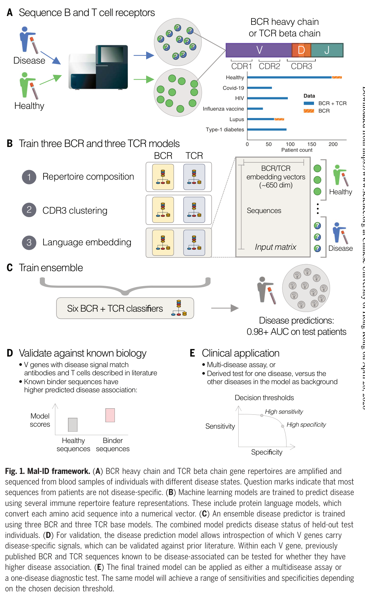
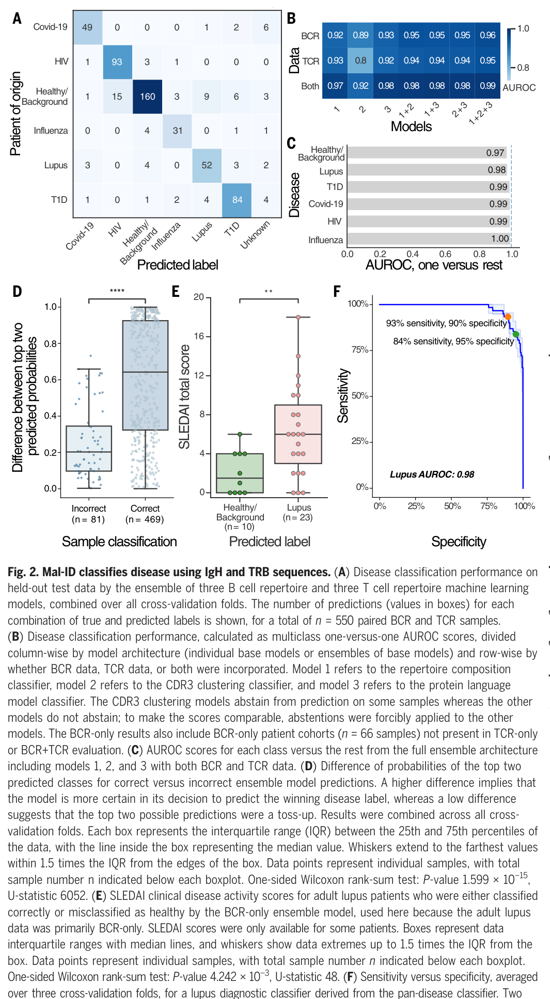
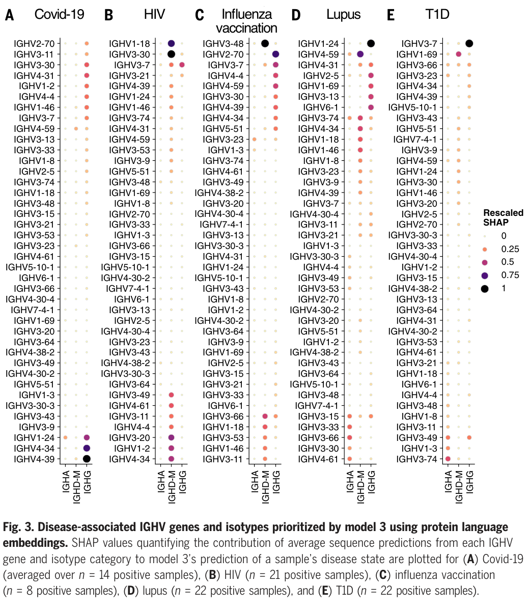
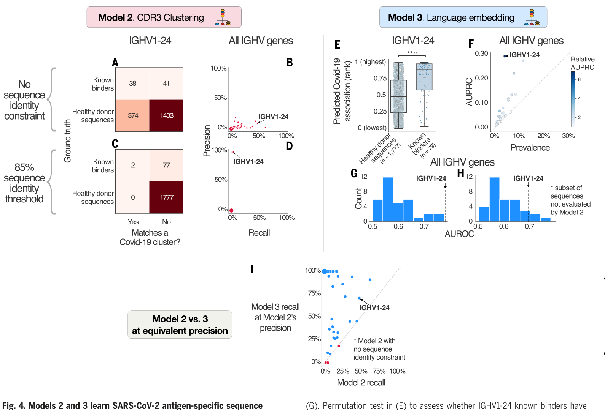

# Disease diagnostics using machine learning of B cell and T cell receptor sequences

<!-- wechat-style-reviewed: 2026-08-31 -->

面对急性 COVID-19、慢性 HIV、系统性红斑狼疮、1 型糖尿病和流感疫苗接种后的反应，这项研究要检验的是：它们是否会在外周血 BCR/TCR 中留下可彼此区分的模式。真正困难的不只是发现“免疫系统变了”，而是判断这种变化更像哪一种状态。

这项研究汇集 593 名个体、1,620 万个 BCR 重链克隆和 2,350 万个 TCR beta 链克隆。其中 542 人同时有两类受体数据；三折交叉验证汇总后的 held-out 评估包含 550 份配对样本。

难点在于，绝大多数受体序列高度个体化，单条序列又没有疾病特异性标签。年龄、祖源、治疗、采样批次和测序深度也都可能改变受体库；一个高分模型很容易把队列差异误当成疾病。

论文给出的答案是 Mal-ID：分别读取受体库整体组成、跨人共享的相似 CDR3 簇和蛋白语言模型表示，再整合 BCR 与 TCR。它在内部 held-out 数据上的六状态 multiclass AUROC 为 0.986，但最高概率直接分类的准确率是 85.3%；这组差距正是理解其价值和边界的起点。

## 01｜免疫受体库能不能成为一张“疾病状态化验单”？

Mal-ID 试图读取的是采血时的免疫状态，而不是一个终身不变的诊断标签。BCR 和 TCR 会随抗原暴露、克隆扩增、BCR 体细胞高突变及治疗而改变，因此它们既可能留下疾病线索，也可能反映疾病活动度。

成人狼疮患者提供了一个提醒：BCR-only 模型判为健康背景的 10 人，比判为狼疮的 23 人有更低的 SLEDAI 疾病活动评分（该评分只在部分成人患者中可得；单侧 Wilcoxon `P=0.004242`）。成人队列均在接受治疗，作者据此推测较静息的免疫状态影响了分类；这个结果不能解释为患者没有狼疮，也没有证明治疗导致误判。

## 02｜六种状态用了多少人、多少序列？

主数据包括 COVID-19 63 人、HIV 95 人、狼疮 86 人、1 型糖尿病 92 人、流感疫苗接种后 37 人和健康对照。健康对照数在原文 Results 与 Methods 中分别写为 220 和 217，本文保留这一不一致；不能用其中一个数字静默替换另一个。

共有 542 人获得配对 IgH/TRB 数据。论文报告的 550 份配对样本，是把三折交叉验证中各折未参与训练的 test 预测合并后的样本数，不是一个另行固定的 550 人测试队列。同一个人的重复样本始终放在同一训练、验证或测试分区，避免同一受体库跨集合泄漏。

## 03｜为什么同一套受体库要用三种读法？

模型 1 读取 V/J 基因使用、BCR 同种型和体细胞高突变等整体组成；模型 2 寻找跨个体共享、在某一疾病中富集的相似 CDR3 簇；模型 3 用 30 层、1.5 亿参数的 ESM-2 把每条 CDR3 转成 640 维表示，再聚合为患者级预测。BCR 输入也不是完整 B 细胞库：作者只保留 class-switched IgG/IgA，以及 SHM 至少 1% 的 IgD/IgM，以富集抗原经验 B 细胞。

三种读法分别捕捉“群体组成改变”“保守的公共序列”和“更宽松的序列模式”。三套 BCR 与三套 TCR 输出最终由 logistic regression 集成。模型 3 的单序列标签直接继承患者诊断，因此属于弱监督：高疾病分数不等于该受体已被证明能结合相应抗原。

简明图注：Fig. 1 从外周血 IgH/TRB 测序开始，分别训练组成、CDR3 聚类和语言模型，再在患者层面整合六个基础模型；问号表示患者的大多数序列并不知道是否与疾病直接相关。

## 04｜内部测试的 0.986 到底意味着什么？

在 542 人的 550 份配对样本中，各折分别计算、再汇总的 class-size-weighted one-versus-one multiclass AUROC 为 0.986。550 份 held-out test prediction 只在计算混淆矩阵和 label-based accuracy 时合并；按最高预测概率直接给标签，准确率为 85.3%。

两种指标对 abstention 的处理也不同：AUROC/AUPRC 排除没有概率输出的样本，accuracy 把它们计为错误。550 份样本中，2.9 个百分点因模型 2 没有匹配 CDR3 cluster 而 abstain；其余 11.8 个百分点属于没有 abstain 的误分类，作者用前两名预测概率差将这些错误描述为不确定。AUROC 衡量排序，accuracy 衡量既定决策规则后的分类，两者不能互换。

BCR-only 和 TCR-only 的准确率分别为 74.0% 和 75.1%，低于两者联合的 85.3%。仅用 CDR3 聚类时，BCR 与 TCR 的 AUROC 分别为 0.89 和 0.80；组合受体类型与信号层级，才得到主要增益。

若把多疾病模型转为狼疮二分类器，阈值可换取 `97%` 灵敏度/`86%` 特异度，或 `84%` 灵敏度/`95%` 特异度；一个平衡点为 `93%`/`90%`。这些数字来自同一研究的交叉验证概念验证，不是前瞻临床定标结果。

简明图注：Fig. 2 的 AUROC 先在各折计算；混淆矩阵则合并 550 份 held-out prediction。组件 AUROC、最高概率分类和狼疮灵敏度—特异度曲线回答的是不同问题。

## 05｜换实验室或测序方式后，还能直接使用吗？

外部 BCR 队列只有 7 例 COVID-19 和 6 名健康供者：排序 AUROC 为 1.0，但直接六分类准确率只有 69%；用一小部分外部样本调阈值后，剩余样本达到 100%。外部 TCR 队列为 17 例 COVID-19 和 39 名健康供者，AUROC 为 0.99、未调阈准确率为 68%，调阈后为 90%；去掉表现较弱的 CDR3 聚类模型后，未调阈准确率为 89%、AUROC 为 0.97。

在 Adaptive Biotechnologies 的 genomic DNA TCR 数据中，作者不是直接套用原模型，而是用 1,365 份样本重新训练，区分另一组六种状态，得到 AUROC 0.97、准确率 88%，并处理超过 1.5 亿条序列。

因此，外部结果支持的是框架可以迁移；它同时表明疾病先验、类别构成和测序技术改变后，需要重新校准，甚至重新训练。

## 06｜模型是否只是记住了批次、年龄或祖源？

内部批次留出包括 10 例使用不同样本处理流程的 COVID-19 患者和 13 份重新建库的健康样本；另一个留出队列中，5 例狼疮有 4 例分类正确、2 名健康对照均正确。13 名健康供者的技术重复里，9 人两次都判对且类别概率相关性至少 97%，其余样本出现 abstention 或分歧。

仅用年龄、性别或祖源预测疾病，AUROC 分别为 0.68、0.59 和 0.79，三者合并为 0.85；在有完整人口学信息的个体中，从集成特征回归这些变量后，Mal-ID AUROC 从 0.98 降到 0.96。已测人口学变量贡献了一部分信号，但没有解释全部内部性能；这个完整人口学信息子集的精确样本量未在主文报告，明细依赖未进入本地证据包的表 S7。

外部 BCR 队列的情况更棘手：COVID-19 病例全为亚洲人，健康对照为白人或非裔，人口学模型的 AUROC 同样达到 1.0，尽管 accuracy 只有 58%。因此，这个外部小队列不能单独排除祖源与地理混杂；治疗、近期感染和疾病严重程度等未测变量也仍然存在。

## 07｜它学到的是抗原特异性，还是更宽的免疫状态？

只用 BCR 同种型比例，疾病 AUROC 为 0.68，明显低于 Mal-ID 的 0.98 以上；模型确实使用了序列内部信息，但这一同种型比例对照的精确样本量未在主文单列，Fig. S14 也未进入本地证据包。SHAP 分析在 COVID-19 14、HIV 21、流感疫苗 8、狼疮 22 和 1 型糖尿病 22 份阳性样本中，把 IGHV1-24/IGHV2-70、IGHV4-34/IGHV4-59 等既有线索排在前列，但 SHAP 解释的是模型行为，不是这些基因的因果作用。

要看模型在患者层面优先使用哪些 V 基因—同种型组合，先看 Fig. 3。

简明图注：Fig. 3A–E 分别汇总 COVID-19 14、HIV 21、流感疫苗 8、狼疮 22 和 1 型糖尿病 22 份阳性样本的 IGHV—同种型 SHAP 贡献；数值重标到 0–1，只解释模型行为，不证明机制。

外部已知 binder 给出了更严格的检验。COVID-19 BCR 的模型 3 AUROC 按 IGHV 分层最高为 0.78，AUPRC 相对基线最高 6.9 倍；图中明确给出完整样本量的 IGHV1-24 比较为 79 条 binder 对 1,777 条健康供者序列。流感 BCR 最高为 0.65 和 4.0 倍，已知 SARS-CoV-2 特异 TCR 的最高 AUROC 只有 0.56、AUPRC 相对基线最高 1.30 倍；这两类分析的各分层样本量未在本地主 PDF 报告，缺失补充材料时不能补造。

患者级分类很强，而单条 TCR 的抗原特异性排序接近随机，说明 Mal-ID 很可能同时读取直接抗原反应与更广泛的免疫组成、激活和治疗状态。这个解释比“模型找到了疾病特异受体”更符合数据。

要检验这些患者级模式是否也能命中真正的抗原结合序列，再看 Fig. 4 的外部对照。

简明图注：外部 binder 与健康序列均未用于训练；Fig. 4 明示的 IGHV1-24 比较共 1,856 条序列（79 条 binder 对 1,777 条健康序列），其余结果按 34 个 V gene 分层但未逐层报告样本量。模型 2 更精确但召回低，模型 3 召回更高但假阳性更多。

## 08｜这项研究真正改变了什么？

它显示，在这组经过整理的闭集队列中，BCR 与 TCR 可以作为分布式免疫状态读数，而且组成、公共序列和语言模型表示提供互补信息。对研究而言，这套框架可以把“受体库有没有变化”推进到“哪些层级共同区分状态”，并为后续抗原验证提供候选线索。

临床价值目前更接近问题定义，而不是成品检测。论文没有测试治疗反应或复发的纵向监测；狼疮低活动患者的结果只提示模型可能更敏感于当前免疫活动，也可能在疾病静息期漏掉既往诊断。若要检验这些用途，必须按目标重新建队列、设标签和定阈值。

## 09｜这些结果仍需要冷静看待

第一，这是六个预先定义类别的闭集分类，其中还包含流感疫苗接种后状态。真实患者可能有合并症、近期感染、疫苗接种、免疫抑制治疗或训练集中没有的新疾病，模型目前不会可靠处理开放集或多标签问题。

第二，AUROC 0.986 不等于临床阳性预测值，也不等于 98.6% 的患者会被正确诊断。外部队列在调阈前只有 68%–69% accuracy，校准样本又很少；患病率与鉴别诊断构成改变后，阈值必须重新确定。

第三，研究只测 IgH 与 TRB，没有抗体轻链或 TCR alpha 链配对；模型 3 又用患者标签弱监督单条序列。BCR binder 只有中等排序能力，TCR binder 验证更弱，不能把患者级预测解释为已识别出全部疾病特异性受体。

第四，内部 COVID-19 训练队列有意排除轻症、血清转换前样本和已知免疫抑制患者，以保留明确活动期病例。0.986 的 AUROC 因而不能外推到轻症、极早期或免疫抑制背景。

最后，Results 与 Methods 对健康对照分别报告 220 和 217 人；补充表图未作为完整对象进入本地 PDF；多栏排版还使部分图注与人口学、外部验证段落在文本抽取中交错。这些原文冲突和解析边界不能被高性能数字掩盖。

---

## 技术附录

以下保留原笔记的论文信息、完整图注、结果顺序、方法参数、统计解释、原文冲突和证据边界，并在文末补入本次句子级 PDF 解析与覆盖审计。

### 本文目录

- [基本信息](#基本信息)
- [本论文主图](#本论文主图)
- [生物学故事前情](#生物学故事前情)
- [重要缩写表](#重要缩写表)
- [论文详细解读](#论文详细解读)
- [研究问题与科学背景](#研究问题与科学背景)
- [研究设计与数据结构](#研究设计与数据结构)
- [方法与整体框架](#方法与整体框架)
- [原文结果完整梳理](#原文结果完整梳理)
  - [Integrated repertoire models of immune states](#integrated-repertoire-models-of-immune-states)
  - [Limited impact of batch effects on classification](#limited-impact-of-batch-effects-on-classification)
  - [Limited impact of age, sex, and race on classification](#limited-impact-of-age-sex-and-race-on-classification)
  - [Language model recapitulates immunological knowledge](#language-model-recapitulates-immunological-knowledge)
- [原文讨论中的主要结论](#原文讨论中的主要结论)
- [作者结论与证据强度](#作者结论与证据强度)
- [独立方法学详解](#独立方法学详解)
  - [样本与测序](#样本与测序)
  - [序列预处理与 clonal lineage 压缩](#序列预处理与-clonal-lineage-压缩)
  - [模型 1：repertoire composition classifier](#模型-1：repertoire-composition-classifier)
  - [模型 2：CDR3 convergent clustering classifier](#模型-2：cdr3-convergent-clustering-classifier)
  - [模型 3：language model embedding classifier](#模型-3：language-model-embedding-classifier)
  - [统计学分析方法](#统计学分析方法)
  - [集成模型和数据泄漏控制](#集成模型和数据泄漏控制)
  - [稳健性验证和混杂控制](#稳健性验证和混杂控制)
- [生物学与临床意义](#生物学与临床意义)
- [局限性与危险假设](#局限性与危险假设)
- [深度研究洞察](#深度研究洞察)
- [可借鉴或迁移的思路](#可借鉴或迁移的思路)
- [可复用学术表达](#可复用学术表达)
- [相关论文与概念](#相关论文与概念)
- [覆盖审计](#覆盖审计)

### 基本信息

- 原文题名：Disease diagnostics using machine learning of B cell and T cell receptor sequences
- 期刊：Science 387, eadp2407
- 年份：2025
- DOI：10.1126/science.adp2407
- 第一作者：Maxim E. Zaslavsky、Erin Craig
- 通讯作者：Anshul Kundaje、Scott D. Boyd
- 研究领域：免疫受体组学、机器学习诊断、感染性疾病、自身免疫病、BCR/TCR repertoire
- 关键词：BCR、TCR、免疫受体库、Mal-ID、ESM-2、CDR3、系统性红斑狼疮、1 型糖尿病、COVID-19、HIV、流感疫苗
- 本地 PDF：`pdfs/processed/science.adp2407.pdf`
- 数据来源：本研究原始测序数据见 SRA BioProject `PRJNA1147802`，既往已发表数据见 `PRJNA486667` 与 `PRJNA491287`；处理后数据以 AIRR Rearrangement Schema 和 Mal-ID 内部格式存于 [Synapse `syn61987835`](https://www.synapse.org/Synapse:syn61987835)（`P010.S0041-P010.S0042`、`P016.S0067-P016.S0072`）。
- 代码来源：作者归档的 `release-202408` 版本见 [Zenodo record 13357613](https://zenodo.org/records/13357613)，原文说明其许可为非商业使用（`P015.S0231`、`P016.S0077`）。
- PDF 解析质量：
  - 使用 `scripts/build_pdf_llm_pack.py` 建立句子级解析包 `tmp/mal-id-llm-pack.md`；本地 PDF 共 17 页、1,335 个句子 ID。
  - 三栏排版使正文、标题和图注严重交错，不能把一个连续 ID 区间都算作正文证据。人工按页面版式复原后，主文 Results 语义证据为 194 个 ID，Methods 为 278 个 ID；Fig. 1-4 的图内与图注 ID 另行保留，不冒充正文句。
  - 自动清单标出 Results 296 个、Methods 332 个 ID，已逐一核对 `628/628`。其中含摘要残片、作者单位、页眉、图内文字和错标的 Discussion；文末同时给出自动标签闭环和校正后的真实阅读顺序。
  - `P005-P007` 与 `P009-P014` 多处跨栏融合，结构和句序属于低置信；所有关键数字已回看相邻正文、图注和现有截图，按页面版式复原，不按抽取顺序补意。
  - 主文补充表格和补充图仅在正文中被引用，未作为完整对象进入本地 PDF 解析包。
- 重要数字提示：原文在研究摘要处写健康对照为 220 人，在方法处写健康对照为 217 人；本文保留该不一致，不自行修正。

### 本论文主图

| 原文图 | 原文图题/核心信息 | 是否截取 | 图像文件 | 放置位置 |
|---|---|---|---|---|
| 图 1 | Mal-ID framework：BCR/TCR 测序、三类模型、集成预测、生物学验证和临床阈值应用 | 是 | `assets/immunology/2025-disease-diagnostics-immune-receptor-sequences/fig1-mal-id-framework.png` | [03｜三种表示与集成](#reader-malid-fig1) |
| 图 2 | Mal-ID classifies disease using IgH and TRB sequences：六类免疫状态分类、模型组件比较、狼疮诊断阈值 | 是 | `assets/immunology/2025-disease-diagnostics-immune-receptor-sequences/fig2-classification-performance.png` | [04｜内部性能与阈值](#reader-malid-fig2) |
| 图 3 | Disease-associated IGHV genes and isotypes prioritized by model 3 using protein language embeddings：模型 3 的 IGHV/同种型 SHAP 解释 | 是 | `assets/immunology/2025-disease-diagnostics-immune-receptor-sequences/fig3-ighv-isotype-shap.png` | [07｜SHAP 线索](#reader-malid-fig3) |
| 图 4 | Models 2 and 3 learn SARS-CoV-2 antigen-specific sequence patterns：外部 SARS-CoV-2 结合抗体序列验证 | 是 | `assets/immunology/2025-disease-diagnostics-immune-receptor-sequences/fig4-known-sars-cov-2-binders.png` | [07｜外部 binder 验证](#reader-malid-fig4) |

### 生物学故事前情

适应性免疫系统本质上是一套“抗原暴露记录仪”。B 细胞和 T 细胞在感染、疫苗接种、自身免疫和慢性炎症中经历克隆选择，留下 V/J 基因使用、CDR3 序列、同种型、体细胞突变和克隆扩增等痕迹。传统诊断通常检测病原体、抗体浓度或炎症指标，但很少直接利用整套 BCR/TCR repertoire 作为疾病状态读数。

难点在于，免疫受体库极其稀疏和个体化。两个患者面对相似抗原时，可能没有完全相同的 CDR3；同一患者体内，与疾病直接相关的克隆也可能只占很小部分。BCR 还会经历 SHM 和同种型转换，TCR 又受 HLA 背景强烈影响。因此，简单找公共克隆太窄，直接把所有序列喂给模型又容易学到批次、年龄、祖源或疾病严重程度等混杂。

本文的生物学故事是把 immune repertoire 从“序列数据库”提升为“疾病状态的多层级表型”。作者用整体组成、CDR3 收敛聚类和蛋白语言模型三种视角，同时读取 BCR 和 TCR 的信息，并追问这些序列模式能否区分感染、自身免疫、疫苗反应和健康状态。

### 重要缩写表

| 缩写 | 中文含义 | 本文语境中的具体指代 | 阅读时注意 |
|---|---|---|---|
| Mal-ID | machine learning for immune diagnosis | 本文提出的 BCR/TCR 多模型疾病诊断框架 | 是研究框架，不是单一算法 |
| BCR | B 细胞受体 | IgH 序列和同种型信息构成的 B 细胞 repertoire | BCR 信号可能反映抗原特异性，也可能反映免疫状态 |
| TCR | T 细胞受体 | TRB 序列构成的 T 细胞 repertoire | TCR 识别受 HLA 限制，跨人群公共模式更难 |
| IgH | 免疫球蛋白重链 | BCR heavy chain 测序对象 | 本文不是完整抗体轻重链配对 |
| TRB | TCR beta chain | TCR beta 链测序对象 | beta 链不能完整确定 TCRαβ 特异性 |
| CDR3 | 互补决定区 3 | BCR/TCR 中最常用于定义克隆和抗原识别模式的区域 | 相似 CDR3 只是候选功能相似，不等于已验证结合 |
| ESM-2 | 蛋白语言模型 | 将 CDR3 氨基酸序列转为 embedding 的模型 | embedding 捕捉统计模式，不直接解释生物机制 |
| AUROC | ROC 曲线下面积 | 衡量疾病分类排序能力 | 高 AUROC 不等于临床阈值已确定 |
| AUPRC | precision-recall 曲线下面积 | 用于不平衡任务和 binder 富集评价 | 受阳性比例影响，需和基线比较 |
| SHAP | Shapley additive explanations | 解释模型 3 中 V gene/isotype 等特征对预测的贡献 | 解释模型行为，不证明因果 |
| SLE | 系统性红斑狼疮 | 本文自身免疫病分类任务之一 | 疾病活动度和治疗状态会影响 repertoire |
| T1D | 1 型糖尿病 | 本文自身免疫病分类任务之一 | 队列年龄结构可能与其他疾病类别不同 |

### 论文详细解读

#### 研究问题与科学背景

传统临床诊断主要依赖症状、体征、常规实验室检查、影像学、病原体检测和自身抗体检测。对于感染性疾病，病原体本身常常可以作为诊断锚点；但对于系统性红斑狼疮、1 型糖尿病等自身免疫病，临床诊断通常依赖多种不完全特异的证据组合，过程长、误诊风险高，而且不同疾病之间常有症状重叠。

作者提出的关键科学问题是：B 细胞受体和 T 细胞受体是否可以作为机体抗原暴露和免疫反应历史的“内源性记录”，用于同时识别多种感染、疫苗反应、自身免疫病和健康状态。这个问题困难在于，BCR/TCR 序列高度多样，每个患者体内真正与疾病相关的克隆可能只占很小比例；BCR 还存在体细胞高突变；TCR 识别又受到 HLA 背景影响。单纯寻找完全相同的公共克隆容易漏掉信号，单纯看总体组成又容易把年龄、祖源、批次或炎症背景误认为疾病。

因此，这篇文章真正要解决的是“免疫受体库如何表示”的问题。作者不是把 receptor repertoire 当成一堆序列直接分类，而是构建了一个多层级框架：整体组成、CDR3 收敛聚类、蛋白语言模型嵌入，再将 BCR 和 TCR 两条免疫轴整合起来。

#### 研究设计与数据结构

作者构建并分析了 593 名个体的免疫受体数据，疾病或免疫状态包括 COVID-19、HIV 感染、系统性红斑狼疮、1 型糖尿病、流感疫苗接种后状态和健康对照。原文报告共有 542 名个体具有配对 IgH 和 TRB 序列数据。数据规模为 1620 万个 BCR heavy chain clone 和 2350 万个 TCR beta chain clone。

队列设计上，作者有意纳入异质性较强的状态：急性感染、慢性感染、疫苗刺激、自身免疫病和健康背景。这使任务不是简单的“疾病 versus 健康”，而是多疾病免疫状态分类。方法学上，所有个体按人而不是按序列分入训练集、验证集和测试集；同一个人的重复样本必须放在同一个划分内。这一点非常关键，因为同一个人的 repertoire 内部高度相关，如果把同一个人的序列拆到训练和测试两侧，会严重高估模型性能。

作者还设置了外部验证：用其他实验室的 COVID-19 与健康 BCR/TCR 数据测试模型泛化；并在 Adaptive Biotechnologies 的 genomic DNA TCR 数据上重新训练框架，以评估该方法是否能跨测序技术扩展。总体上，研究设计比一般 repertoire 机器学习论文更重视数据泄漏、批次效应和人口学混杂。

#### 方法与整体框架

完整 panel 注释：A，从不同疾病状态个体的血液扩增并测序 BCR 重链与 TCR β 链；问号表示患者的大多数序列并非疾病特异。B，以多类受体库表征训练疾病预测器，其中蛋白语言模型把氨基酸序列转为数值向量。C，集成 3 个 BCR 与 3 个 TCR 基础模型，在 held-out test 个体上预测。D，按 V gene 检查疾病信号，并以既往文献和已知疾病相关 BCR/TCR 序列验证。E，同一模型可用于多疾病检测或派生单病检测，灵敏度与特异度随决策阈值变化。原图注没有样本量或统计检验，不另行补造；来源 `P003.S0070-P003.S0079`。

图 1 展示了 Mal-ID 的基本逻辑。作者从外周血中扩增并测序 BCR heavy chain 和 TCR beta chain，然后分别训练三类模型。模型 1 使用 repertoire composition，也就是 V/J 基因使用频率以及 BCR 的体细胞高突变等总体特征。模型 2 使用 CDR3 聚类，寻找不同个体中高度相似、并在特定疾病中富集的候选公共或收敛克隆。模型 3 使用蛋白语言模型 ESM-2 将 CDR3 氨基酸序列转化为 640 维嵌入，再训练序列层面和样本层面的疾病预测模型。

这三个模型分别对应不同生物学层级。模型 1 捕捉整体免疫组成和克隆选择造成的分布改变；模型 2 捕捉跨个体共享的候选抗原特异性序列；模型 3 捕捉不一定序列完全相同、但可能在结构或结合性质上相似的 receptor pattern。最后，作者把三类 BCR 模型和三类 TCR 模型输入一个 logistic regression 集成模型，输出每个疾病状态的概率。

模型 3 的标签设计需要特别注意。作者并不知道每条 BCR/TCR 序列是否真正和疾病相关，因此单条序列继承患者疾病标签。这是一种弱监督学习：标签有噪声，但在大规模序列和分层聚合下，疾病相关信号可能从噪声中显现。这个设定也决定了后文解释必须谨慎：模型可能学到直接抗原特异性序列，也可能学到更宽泛的疾病相关免疫状态。

#### 原文结果完整梳理

##### Integrated repertoire models of immune states

完整 panel 注释：A，三折交叉验证各折的 held-out prediction 合并，共 550 份配对 BCR/TCR 样本。B，以 multiclass one-versus-one AUROC 比较模型；为保证可比性，将模型 2 的 abstention 强制施加到其他模型，BCR-only 评价还包括配对评价中没有的 66 份 BCR-only 样本。C，展示 BCR+TCR、模型 1+2+3 完整集成的一对其余 AUROC。D，比较错误分类 81 份与正确分类 469 份样本的前两名概率差，单侧 Wilcoxon rank-sum `P=1.599×10⁻¹⁵`、`U=6052`。E，比较成人狼疮 BCR-only 模型判为健康的 10 人与判为狼疮的 23 人的 SLEDAI；评分仅在部分患者中可得，单侧 Wilcoxon `P=4.242×10⁻³`、`U=48`。D/E 箱体表示 IQR 与中位数，须线延伸至 `1.5×IQR`。F，狼疮灵敏度—特异度为三折平均，图中标出 93%/90% 与 84%/95% 两个阈值。来源 `P004.S0042-P004.S0067`。

原文首先报告，在三折交叉验证的各折 held-out test 中分别计算并汇总后，六类免疫状态的 class-size-weighted one-versus-one multiclass AUROC 为 0.986。来自 542 名个体的 550 份配对 BCR/TCR test prediction 只在计算混淆矩阵和 label-based accuracy 时合并；按最高预测概率直接给标签，总体准确率为 85.3%。AUROC/AUPRC 排除 abstention，accuracy 则把 abstention 计为错误，因此 AUROC 与 accuracy 不能互换。

图 2B 比较了不同模型组件。单独使用 CDR3 聚类的模型性能较弱，BCR CDR3 聚类 AUROC 为 0.89，TCR CDR3 聚类 AUROC 为 0.80。相比之下，整体组成模型和蛋白语言模型表现更好，三类模型组合后性能最高。作者指出，TCR CDR3 聚类表现弱，可能与 HLA 基因型影响 TCR 识别有关；如果不纳入 HLA 信息，跨个体寻找公共 TCR 模式会更困难。

图 2C 显示每个疾病类别的一对其余类别 AUROC：健康/背景 0.97，狼疮 0.98，1 型糖尿病 0.99，COVID-19 0.99，HIV 0.99，流感疫苗 1.00。图 2D 显示正确分类样本的前两类预测概率差异更大，错误分类样本的前两类概率更接近，说明部分错误来自模型本身的不确定性，而不是完全随机失败。

图 2E 是一个重要的临床解释点。成人狼疮患者中，被 BCR-only 模型误判为健康者的 SLEDAI 疾病活动评分较低。原文解释为这些患者可能处于治疗后或疾病较静息状态，因此其免疫受体库更接近健康背景。这一结果提示 Mal-ID 可能更敏感于“当前免疫活动状态”，而不是静态诊断身份。

图 2F 进一步把 pan-disease 模型转化为狼疮特异性检测。通过调节阈值，模型可以达到 97% 灵敏度和 86% 特异度，或 84% 灵敏度和 95% 特异度；一个平衡点为 93% 灵敏度和 90% 特异度。作者据此提出，Mal-ID 既可作为多疾病检测，也可派生为单病种诊断模型。但这仍是概念验证，临床阈值需要根据具体应用场景和疾病患病率确定。

##### Limited impact of batch effects on classification

作者随后检验模型是否只是学到了实验批次或数据来源差异。首先，他们用所有内部数据训练 global model，再在外部 COVID-19 与健康 BCR/TCR 队列上测试。外部 BCR 队列中，模型区分 COVID-19 与健康的 AUROC 达到 1.0，但若直接按最高预测概率分配六类标签，准确率只有 69%；经过基于少量外部样本的阈值调校后，剩余外部样本准确率达到 100%。这说明模型排序信号强，但类别阈值受外部数据疾病构成影响。

外部 TCR 队列中，模型 AUROC 为 0.99，直接最高概率分类准确率为 68%，阈值调校后提升到 90%。原文指出，调校前部分 COVID-19 样本被误分为狼疮，主要与模型 2 的 TCR CDR3 聚类表现不佳有关；禁用模型 2 后，未调校准确率达到 89%，AUROC 为 0.97。

作者还在 Adaptive Biotechnologies genomic DNA TCR 数据上重新训练 Mal-ID，用 1365 个样本区分 common variable immunodeficiency、COVID-19、HIV、类风湿关节炎、1 型糖尿病和健康对照。该数据来自不同实验室，批次效应风险更高，但模型仍达到 0.97 AUROC 和 88% 准确率，并能扩展到超过 1.5 亿条序列。这支持 Mal-ID 框架可以迁移到其他测序技术，但前提是需要重新训练和适配。

在内部批次检验中，作者将一个 COVID-19 PBMC 队列和一批健康重复测序样本整体留出。所有留出的 COVID-19 样本和健康样本均被正确分类。健康样本重复测序中，13 名健康供者里有 9 名两个重复样本均正确分类，且预测概率相关性达到 97% 或更高；少数不一致主要和测序深度较低、CDR3 聚类模型无法匹配到预测簇有关。作者还留出一个独立狼疮队列，5 名狼疮患者中 4 名正确分类，2 名健康对照均正确分类。总体上，这些结果削弱了“模型只是批次分类器”的解释。

##### Limited impact of age, sex, and race on classification

作者进一步评估人口学变量是否驱动分类。健康个体 repertoire 中，性别不能被准确预测；祖源有较弱信号，AUROC 为 0.78；年龄也存在一定信号，区分 50 岁及以上个体的 AUROC 为 0.75。儿童样本的 TCR beta V gene 使用尤其不同，在模型有预测时 AUROC 可达 1.0，但由于 45% 样本出现 abstention，整体准确率只有 55%。

疾病队列之间确实存在年龄、性别和祖源差异。原文列出各队列年龄分布：1 型糖尿病中位年龄 14.5 岁，狼疮 18 岁，流感疫苗 26 岁，HIV 31 岁，健康对照 34.5 岁，COVID-19 48 岁。性别方面，狼疮女性比例为 85%，符合狼疮女性高发。HIV 队列中 89% 个体居住在非洲。

只用年龄、性别或祖源预测疾病时，AUROC 分别为 0.68、0.59 和 0.79；三者联合为 0.85，低于 Mal-ID 的 0.98。作者还将年龄、性别、祖源从 ensemble 特征矩阵中回归掉，分类 AUROC 从 0.98 降至 0.96。这说明人口学变量确实有影响，但不能充分解释 Mal-ID 的主要疾病分类性能。

需要注意的是，这一部分只能说明已测量的人口学变量不是主要解释，并不能证明所有未测量混杂都不存在。例如既往感染史、治疗方案、地理暴露、样本来源和疾病严重程度仍可能贡献部分信号。

##### Language model recapitulates immunological knowledge

完整 panel 注释：A–E 展示各 IGHV—同种型类别的平均序列预测对疾病判定的 SHAP 贡献，分别汇总 COVID-19 14、HIV 21、流感疫苗 8、狼疮 22 和 T1D 22 份阳性样本；图例将 SHAP 重标至 0–1。来源 `P007.S0003-P007.S0007`。

图 3 是整篇文章最关键的可解释性结果之一。作者使用模型 3 的 SHAP 值评估不同 IGHV 基因和同种型组合对疾病预测的贡献。结果显示，模型优先使用的 V gene 和同种型与既往免疫学知识相符。

COVID-19 预测中，IGHV1-24 和 IGHV2-70 被优先使用，且 IgG 信号突出。这符合 SARS-CoV-2 特异性 B 细胞常见 IgG 表达的文献认识。HIV 预测中，IGHV1-2 和 IGHV4-34 具有较高权重，并且 mutated IgM/D 信号更明显。流感疫苗预测中，IGHV3-23 以及 IgG、mutated IgM/D 信号较重要。狼疮中，IGHV4-34 和 IGHV4-59 权重较高，IgA 也具有信息量；这与狼疮相关 IgA 自身抗体文献相吻合。1 型糖尿病中，IgA 和其他同种型均有贡献。

作者还检验了是否仅凭同种型比例就能预测疾病。单独使用 isotype proportion、不使用序列信息时，AUROC 只有 0.68，明显低于 Mal-ID 的 0.98 以上。这一点说明模型并非只是利用不同疾病样本中 IgG/IgA/IgM 比例差异，而是在同种型内部进一步利用序列特征。

这个结果的科学意义在于，模型不是完全不可解释的黑箱。它至少部分恢复了已知抗原特异性或疾病相关 BCR 使用模式，也提出一些尚未被单病种文献充分描述的 V gene 候选信号。需要谨慎的是，SHAP 表示模型预测贡献，不等于证明这些 V gene 在疾病中具有因果作用。

完整 panel 注释：外部 CoV-AbDab binder 与健康序列均未用于训练，并按 IGHV 分层评价。A/B 以相同 IGHV、IGHJ 和 CDR3 长度匹配模型 2 的 COVID-19 簇；C/D 另加 85% CDR3 序列一致性。A/C 的 IGHV1-24 比较共 1,856 条序列；E 明示其中 binder 79 条、健康供者序列 1,777 条。E 用模型 3 的 COVID-19 概率排序 binder 与健康序列；按健康供者保持标签的 1,000 次置换中，零次统计量超过观察值，原文据此报告 `P=0`，但未说明经验 P 值的零值修正或更细分辨率；箱体表示 IQR/中位数，须线至 `1.5×IQR`。F 的相对 AUPRC 最高为基线的 6.9 倍，G 的跨 IGHV AUROC 最高为 0.78。H 在模型 2 因没有匹配 IGHV、IGHJ 和 CDR3 长度的簇而不能评价的序列中，AUROC 最高为 0.75。I 在模型 2 不加序列一致性约束、两模型精确率相同时比较召回；模型 3 通常召回更高，但假阳性更多。B/D/F/G/H/I 各点代表 34 个 V genes，点大小表示重合值；星号依次表示 `P<0.05/0.01/0.001/0.0001`。来源 `P008.S0002-P008.S0018`；其中 `P008.S0008` 在句子级 JSON 中串入相邻正文，这里只保留经原始页面与图面复核的图注内容。

作者进一步测试一个关键问题：模型是否真的学到疾病相关抗原特异性序列模式。为此，他们使用外部 CoV-AbDab 数据库中的 SARS-CoV-2 结合 BCR heavy chain 序列，并与健康供者序列比较。重要的是，这些外部 binder 序列没有用于训练。

图 4A-D 显示模型 2 的 CDR3 聚类可以识别一部分已知 binder，但召回率低。若只要求相同 IGHV、IGHJ 和 CDR3 长度，模型 2 可以找到部分 SARS-CoV-2 cluster 匹配；若再加上 85% CDR3 序列一致性约束，精确度可以很高，但召回进一步降低。这符合模型 2 的本质：它保守、可解释，但只能捕捉高度相似的公共或收敛序列。

图 4E-I 显示模型 3 的语言模型嵌入能把已知 SARS-CoV-2 binder 排在比健康序列更高的 COVID-19 关联概率位置。按 IGHV 基因分层，AUROC 最高可达 0.78，AUPRC 相对基线最高可提高 6.9 倍。模型 3 相比模型 2 通常有更高召回，但也带来更多假阳性。这是合理的：语言模型试图捕捉更宽松的功能相似性，而不是只找近似相同序列。

作者还对流感已知 binder 做了类似验证，发现模型 2 和模型 3 在关键 IGHV 基因中也能优先排序 binding sequences，但信号弱于 COVID-19，最高 AUROC 为 0.65，AUPRC 相对基线最高提升 4.0 倍。作者认为这可能因为流感已知抗体数据库来自不同年份、不同感染或接种背景，而训练数据来自特定年度流感疫苗后样本。

TCR 的 SARS-CoV-2 binder 验证更弱。模型 2 表现差，模型 3 对已知 SARS-CoV-2 特异性 TCR 的富集也较弱，TRBV 基因内最高 AUROC 只有 0.56，AUPRC 最高相对基线提升 1.30 倍。作者提出原因包括 TCR 识别依赖 HLA 分子、不同队列 HLA 背景差异、体外刺激可能激活旁观者克隆、TCR 分析没有排除 naive T cells 等。

这一结果非常重要：Mal-ID 的患者级诊断表现很强，但单条抗原特异性 TCR 识别并不强。这说明模型的患者分类信号可能不仅来自直接结合抗原的 receptor，也可能来自更广泛的疾病相关免疫状态改变。

#### 容易被总体 AUROC 掩盖的结果数字

- 550 份 held-out test prediction 中，469 份最高概率标签正确、81 份错误；2.9 个百分点因模型 2 没有匹配 cluster 而 abstain，其余 11.8 个百分点是没有 abstain、但前两名预测概率接近的误分类。病人和疫苗接种者中，92.9% 被识别为“非健康背景”，87.5% 被分到具体正确状态（`P004.S0029-P004.S0030`、`P005.S0007-P005.S0021`）。
- exact-sequence-match 对照在 BCR 上只有 41% accuracy，40% 样本无命中；TCR 上为 42% accuracy、0.75 AUROC。模型 2 的 BCR/TCR 聚类虽提高到 0.89/0.80 AUROC，COVID-19 TCR 与 T1D B/T 仍只找到很少公共富集簇（`P004.S0009-P004.S0025`）。
- 流感疫苗样本取自接种后第 7 天，即反应性 B 细胞通常处于峰值的窗口；这不是任意接种后时间的表现。研究摘要另报，在加入 51 名只有 BCR 数据的个体后，BCR-only 扩展队列 AUROC 为 0.959（`P001.S0035`、`P004.S0017`）。
- Adaptive genomic-DNA TCR 数据在保留原研究 cohort division 做整队列留出时为 1.0 AUROC、98% accuracy；这属于重新训练后的同平台外部 cohort 检查，不是原 cDNA Mal-ID 模型的直接迁移（`P005.S0031-P005.S0035`）。
- kBET 在 `k=50`、卡方检验并校正到 `P=0.05` 阈值下，整体有 18.2% 序列拒绝“批次分布相同”的零假设；COVID-19 BCR 为 44.1%。作者指出疾病严重度和时间点也可能造成这一差异，因此不能把该结果简单解释为纯技术批次（`P013.S0023-P013.S0030`）。

#### 原文讨论中的主要结论

作者在讨论中强调，Mal-ID 的性能来自三类互补信号：整体 repertoire composition、重要序列群的检测、以及语言模型对单条 receptor 序列的表示。BCR 和 TCR 联合优于单独使用任一数据类型，说明不同疾病对 B 细胞和 T 细胞反应的依赖不同。比如 1 型糖尿病通常被认为以 T 细胞介导为主，TCR-only 模型确实比 BCR-only 更能区分 T1D，但两者联合仍进一步提高性能。狼疮既有自身抗体又有 T 细胞参与，因此 BCR 与 TCR 都有信息，联合效果最好。

作者还指出，多疾病建模比单一疾病对健康对照更有意义。单病种 versus 健康很容易识别一般炎症或疾病严重程度；多疾病模型更有机会识别某一疾病相对于其他免疫状态的特异性模式。但临床转化仍需要确定不同疾病和不同场景下可接受的灵敏度、特异度、阈值和疾病患病率。

作者明确提出未来需要解决的问题：同一患者可能有多个疾病或合并症；同一疾病存在严重程度和亚型；组织活检等非外周血样本可能提供额外信息；模型还需要面对训练集中不存在的新疾病，例如未来大流行病。这些问题都说明当前 Mal-ID 仍是概念验证，不是直接可用的全场景临床诊断系统。

#### 作者结论与证据强度

作者已经较有力证明：在这组经过整理的队列中，BCR/TCR repertoire 序列包含足够强的疾病状态信号，可以区分六类感染、自身免疫、疫苗反应和健康状态；BCR 与 TCR 联合优于单一模态；三类模型组合优于多数单组件；模型识别的部分 V gene、同种型和外部 SARS-CoV-2 binder 信号符合已知免疫学。

作者合理但尚未完全证明的推断是：该框架未来可发展为临床多疾病检测或单病种诊断工具。现有证据支持“有潜力”，但还不足以支持广泛临床替代。真实临床需要前瞻性队列、真实鉴别诊断场景、合并症、多标签疾病、近期感染和疫苗史、治疗状态、样本量和测序深度优化。

作者没有证明的是：模型学到的全部信号都是抗原特异性 receptor。尤其 TCR binder 验证较弱，说明 patient-level 分类信号可能包括旁观者激活、免疫组成改变、疾病活动度、治疗状态、样本时间点和其他免疫背景。

### 独立方法学详解

这篇文章的方法学可以拆成五层：样本与测序、序列预处理、三类基础模型、集成模型、稳健性验证。

#### 样本与测序

样本与测序层面，作者从外周血 RNA 中扩增 TCR beta chain 和不同 IgH 同种型，采用 Illumina MiSeq paired-end 测序；paired-end reads 由 FLASH v1.2.11 合并。BCR 只保留 class-switched IgG/IgA，以及具有至少 1% SHM 的 IgD/IgM，以尽量排除 naive B cells；TCR 不存在体细胞高突变。VDJ 注释使用 IgBLAST v1.3.0，只保留 productive rearrangements，并对低质量 V gene 匹配进行过滤（`P010.S0030-P010.S0040`）。

#### 序列预处理与 clonal lineage 压缩

序列预处理层面，作者在同一个体内按 V gene、J gene、CDR3 长度和序列相似性进行单链接聚类，以推断 clonal lineages。BCR 使用较宽松的 CDR-H3 相似性阈值以容纳 SHM，TCR 使用 CDR3b 相似性阈值。随后每个 clone 每个同种型保留 read 数最高的代表序列。这个步骤的目的不是寻找疾病模式，而是减少同一克隆内重复序列对模型的影响。

#### 模型 1：repertoire composition classifier

模型 1 是 repertoire composition classifier。它把每个样本的 V/J gene usage 转成计数特征，并按样本总 clone 数归一化，再进行 log 转换、Z-score 标准化和 PCA 降维。BCR 额外加入每个同种型的 SHM 中位数和 SHM 比例。最终 BCR composition 模型包含 IgG、IgA、IgM/D 三组特征，TCR composition 模型包含 TRB 的 V/J 使用特征，并用 logistic regression 预测疾病类别。

#### 模型 2：CDR3 convergent clustering classifier

模型 2 是 CDR3 convergent clustering classifier。作者在 train-1 数据中按相同 V gene、J gene 和 CDR3 长度寻找高度相似的 CDR3 cluster，再用 Fisher 精确检验筛选在某一疾病中富集的 cluster。新样本被映射到这些疾病富集 cluster，cluster 命中数形成特征，再用 logistic regression 预测疾病。如果一个样本没有任何序列落入预测 cluster，模型 2 会 abstain。这个 abstention 机制解释了为什么模型 2 的 AUROC 和 accuracy 需要分开看。

#### 模型 3：language model embedding classifier

模型 3 是 language model embedding classifier。作者使用 30 层、1.5 亿参数的 ESM-2，将 CDR-H3/CDR3b 序列嵌入为 640 维向量。第一阶段在每个 IGHV+isotype 或 TRBV 类别内训练 sequence-level disease classifier；第二阶段把同一患者样本内的序列预测概率按 V gene/isotype 或 TRBV 聚合，再训练 patient-level model。由于单条序列真实抗原特异性未知，sequence-level label 是患者疾病标签，因此这是弱监督学习。作者用 SHAP 解释第二阶段模型中不同 IGHV/isotype 或 TRBV 特征对疾病预测的贡献。

#### 统计学分析方法

Mal-ID 的统计学核心是严格区分“序列级别样本很多”和“真正独立的个体数量有限”。因此所有训练、验证和测试划分都按个体进行，而不是按序列进行。同一个人的序列高度相关，如果把序列随机拆到训练集和测试集，会造成数据泄漏并高估性能。这里的独立分析单位是 patient/sample，序列只是构成患者级特征的原始观测。

模型性能主要用 AUROC、AUPRC、accuracy、sensitivity 和 specificity 描述。AUROC 衡量模型对阳性和阴性样本的排序能力，适合比较不同疾病类别的一对其余任务；AUPRC 更受阳性类别比例影响，适合评估已知 binder 富集这种不平衡任务；accuracy 是最高概率分类后的正确比例，但在类别不均衡或阈值未校准时不如 AUROC 稳定。灵敏度和特异度用于临床阈值解释，必须结合具体场景选择，不能只追求总体准确率。

模型 2 的疾病富集 CDR3 cluster 使用 Fisher exact test。输入是某个 cluster 是否出现在某疾病个体与其他个体中，回答的是该 cluster 是否在某疾病中富集。作者比较 raw `P=0.0005–0.05` 的候选阈值，并在 train-2 用 MCC 选出每个 fold/locus 的阈值；原文没有报告 cluster-level FDR 校正。因此，训练集内筛选、验证集调参和 held-out test 评估能降低过拟合，却不能被写成已经正式解决了大规模 cluster 多重检验。

模型 3 是弱监督学习，单条 receptor 继承患者疾病标签。这个标签策略统计上有噪声，因为一个患者的大多数 BCR/TCR 序列未必与疾病直接相关。作者通过按 V gene/isotype 或 TRBV 分层训练、再聚合到患者级模型，试图从大量噪声序列中提取稳定的疾病信号。解释时必须记住：sequence-level 高分表示模型认为这条序列有疾病相关模式，不等于它已经被证明是抗原特异性 receptor。

SHAP 用于解释模型 3 的 patient-level 特征贡献。输入是不同 IGHV/isotype 或 TRBV 分组聚合后的模型输出，结果是这些特征对疾病预测概率的边际贡献。SHAP 可以帮助发现模型使用的免疫学线索，例如 IGHV4-34 与狼疮，但它解释的是预测模型行为，不证明 V gene 或同种型对疾病有因果作用。

人口学和批次混杂通过多种方式评估：demographics-only classifier 测试年龄、性别和祖源本身能否预测疾病；残差化分析把人口学变量从 ensemble 特征中回归掉，再观察 AUROC 是否明显下降；外部队列和批次留出用于测试模型是否依赖实验来源。残差化后性能从 0.98 降到 0.96，说明人口学有贡献但不是全部信号；不过未测量混杂，例如治疗、近期感染、地理暴露和疾病活动度，仍不能完全排除。

#### 集成模型和数据泄漏控制

集成模型层面，作者把三类 BCR 模型和三类 TCR 模型的预测概率拼接起来，用 ridge logistic regression 作为 metamodel。训练过程在每个 cross-validation fold 内独立完成，并且保持 train、validation、test 的个体级隔离。对于 multi-stage 模型，sequence-level 和 patient-level 阶段又进一步使用 train-1 和 train-2 分离，避免同一层数据同时参与特征发现和最终评估。

#### 稳健性验证和混杂控制

稳健性验证层面，作者做了四类检查：第一，外部 cDNA BCR/TCR COVID-19 队列验证；第二，Adaptive Biotechnologies genomic DNA TCR 数据上的重新训练；第三，内部批次留出和重复测序样本一致性检验；第四，年龄、性别、祖源预测、demographics-only disease classifier 和人口学残差化分析。这些步骤共同服务于一个目的：判断模型是否主要学习疾病相关 repertoire signal，而不是批次、人口学或数据来源。

#### 本次审阅补充的关键复现参数

- 样本选择与 QC：COVID-19 排除轻症、血清转换前和已知免疫抑制者；IgBLAST v1.3.0 的 IGHV/TRBV score 阈值分别为 200/80，CDR3 至少 8 aa。每份 replicate 至少需 100 个 IgG、100 个 IgA、500 个 IgD/M 和 500 个 TRB clone；IgD/M 还要求 SHM 至少 1%（`P010.S0023-P010.S0052`）。
- 人级分区与调参：个体先分为 3 个 stratified folds，每折含 train/test；train 再划出 validation，余下分为 train-1/train-2。多阶段模型的序列层在 train-1 拟合、患者层在 train-2 拟合，logistic regression 的正则参数另做 nested CV；外部验证使用只有 train/validation 的 global fold，二者比例与原 cross-validation 相同，由独立队列充当 test（`P010.S0055-P011.S0022`、`P013.S0044-P013.S0046`）。
- clonal-lineage 去重把同一人的全部时间点和全部 isotype 核苷酸序列一起做 single-linkage clustering：V/J gene 与 CDR3 长度须相同，string substitution distance 对应的 sequence identity 阈值为 TCR 95%、BCR 90%。这与模型 2 的跨人疾病聚类阈值 TCR 90%、BCR 85% 不能混用（`P010.S0043-P010.S0048`、`P011.S0039-P011.S0040`、`P012.S0008`）。
- 模型 1 每个 clone 只计一次，仅保留 training prevalence 前 50% 的 V genes；V–J counts 先归一到和为 1，再 log transform、Z-score 并降到 15 个 PCA 特征，所有变换只在 train 拟合后应用于 validation/test。每个 BCR isotype 另加 2 个 SHM 特征，最终 BCR 为 51 维、TCR 为 15 维；最佳 BCR 分类器为 L1/L2 ratio 0.25 的 elastic net，TCR 为 lasso（`P011.S0023-P011.S0029`、`P011.S0043-P011.S0047`）。
- 候选分类器不只包含最终胜出的 logistic regression：作者还比较 `python-glmnet` 的 multinomial logistic regression（正则强度在交叉验证中选择）、100 棵树的 random forest，以及 one-versus-rest、linear kernel、`C=1.0` 的 support vector machine；所有候选都使用与类别频率成反比的平衡权重（`P011.S0030-P011.S0031`）。
- 模型 2 以 unique people 构造 Fisher 2×2 表，single-linkage clustering 使用 normalized Hamming distance；raw `P=0.0005–0.05` 的候选阈值在 train-2 以 MCC 选择，同一 fold/受体类型内各疾病共用阈值，但阈值可随 fold 和 BCR/TCR 改变。cluster 用 clone-size-weighted consensus centroid 表示且忽略 IgH isotype；cluster-count features 标准化后，最佳 BCR/TCR 患者级模型分别为 ridge/lasso logistic regression，无匹配 cluster 时 abstain（低于 3%）（`P009.S0050-P009.S0051`、`P011.S0039-P012.S0018`）。
- exact-match baseline 也以疾病命中数除以样本总序列数，零命中时 abstain，并使用同一组 Fisher P 候选和 train-2 MCC 选阈；它与模型 2 的差别只在 exact match 对 fuzzy match，不能用不同调参流程解释性能差异（`P012.S0019-P012.S0027`）。
- 模型 3 使用 bio-transformers v0.1.17 调用 30 层、1.5 亿参数的 ESM-2，将 hidden state 沿序列长度取均值得 640 维向量，再做 Z-score；BCR 另加 SHM。不同 IGHV–isotype/TRBV category 的模型概率未校准，不能直接跨 category 比较（`P012.S0028-P012.S0039`、`P012.S0047-P012.S0048`）。
- 患者级聚合比较 mean、median、去除最低 10% 的 trimmed mean，以及 10%/20% entropy cutoff；第二阶段 one-versus-rest 子模型只读取对应疾病概率，保留 top 50% V-gene categories，BCR 在各 isotype 内按 category 频率重权，并在 train-2 拟合。最终 BCR 为 random-forest sequence model 加 random-forest mean aggregation，TCR 为 one-versus-rest ridge 加 random-forest mean 与 20% entropy cutoff；概率未校准，因此基础模型 3 不报告 accuracy。TreeSHAP 在各 one-versus-rest random forest 上计算，对 train-2 阳性样本取均值并缩放至 0–1；Louvain `resolution=1.0`（`P012.S0040-P013.S0019`）。
- ensemble 将 validation 上六个基础模型的概率拼接，以 ridge logistic regression 拟合 metamodel，同时传递模型 2 的 abstention，再在 held-out test 评价；组件消融通过特征子集重新拟合 metamodel，而不是直接删除输出（`P013.S0031-P013.S0037`）。
- 人级隔离有必要：任意两个人平均共享 IgH/TRB 序列仅 0.0003%/0.166%，但任意 train/validation/test 两组仍平均共享 0.05%/5.3%；同一人的所有样本始终在同一分区（`P010.S0053`、`P011.S0013-P011.S0019`）。
- 外部 cDNA 队列只纳入症状后至少 2 周的 acute COVID-19，并尽量使用同版 IgBLAST/reference；Britanova 数据无 raw reads 时沿用其 gene calls，并核对 TRBV6-2/6-3 与 TRBV12-3/12-4。作者留出少量外部样本，以最大化 MCC 的类别概率重权做校准；权重 `1/5` 表示该类别需高 5 倍置信度才胜出，而且只改变 label-based metrics（`P013.S0044-P014.S0009`）。Adaptive gDNA TCR 数据也用同版 IgBLAST 重处理后再训练（`P014.S0010-P014.S0011`）。
- 年龄、性别或祖源预测任务只使用健康对照，年龄分别离散为 deciles、`<50/≥50` 和 `<18/≥18`，并排除唯一超过 80 岁者；疾病混杂分析则使用疾病预测数据中人口学信息完整的个体子集，对 ensemble 的每个特征逐列做线性回归并以 residual 替换，同时另做 demographic dummy-only 以及 demographic、sequence 与 interaction 联合模型（`P014.S0012-P014.S0028`）。
- binder 评价使用 2023-06-13 版本 CoV-AbDab，以 `igblastp` 按氨基酸突变估计 SHM，只保留人类患者/疫苗者，保留 weak binder、排除 variant-selective 序列，并按相同 IGHV、IGHJ、CDR-H3 长度及至少 95% identity 做 single-linkage 与 consensus；流感对照排除 H5N1/H7N9（`P014.S0036-P014.S0041`）。外部 BCR binder 没有 isotype，因此用 IgG sequence model 评分，健康 comparator 是 global-fold validation 中未参与训练的 IgG 序列。TCR 使用 MIRA v002.1，只留 productive、acute COVID-19 且训练集存在的 TRBV，并按 TRBV+TRBJ+CDR3b 完全一致去重（`P014.S0042-P014.S0043` → `P014.S0029`）。统计使用 global-fold 模型 2/3 和单侧 1,000 次 donor-grouped permutation，以 AUPRC 相对 baseline prevalence 的 fold change 为统计量；P 值是置换统计量超过观察值的比例（`P014.S0030-P014.S0035`）。
- 完整计算环境为 Python 3.9.17、NumPy 1.24.3、pandas 1.5.3、SciPy 1.11.1、scikit-learn 1.2.2、python-glmnet 2.2.1、PyTorch 2.0.1、bio-transformers 0.1.17、Matplotlib 3.7.1 和 seaborn 0.12.2（`P011.S0038`）。

### 生物学与临床意义

这篇文章最重要的生物学意义是：疾病可以通过分布式方式改变 adaptive immune repertoire，而不只是留下少数可直接识别的抗原特异性克隆。感染可能产生抗原特异性 B 细胞扩增；自身免疫病可能形成慢性自身反应和 T-B 协同异常；疫苗接种在特定时间窗会提高血液中反应性浆母细胞或相关克隆频率。Mal-ID 试图把这些不同层级的免疫改变统一为可计算表型。

临床上，最值得注意的是模型可能更接近“免疫状态读数”而非“终身诊断标签”。狼疮低活动患者被判为健康的结果提示，模型可能对当前疾病活动、治疗后免疫静息状态或外周血免疫扰动更敏感；若目标是初诊筛查，这可能造成漏诊。论文没有研究纵向病情或治疗反应，因此目前不能把这种敏感性写成监测优势。

因此，未来临床应用必须先定义问题：是诊断是否患病，还是判断当前免疫活动，还是预测复发、进展或治疗反应。不同目标需要不同队列、标签、随访和阈值。

### 局限性与危险假设

最大的危险假设是把“疾病分类准确”直接等同于“模型识别了疾病特异性抗原受体”。原文结果并不支持这种强解释。BCR 层面的 SARS-CoV-2 binder 验证提供了支持，但 TCR 层面较弱；而患者级分类信号强，说明模型可能利用了更广泛的免疫状态。

第二个危险假设是训练集疾病类别足以代表真实临床世界。现实患者可能刚接种疫苗、近期感染、合并自身免疫、使用免疫抑制剂、存在肿瘤或处于慢性炎症状态。若模型只能在已知类别中强制选择，就可能把未知免疫状态错误映射到某个已知疾病。

第三个危险假设是外周血足以代表所有疾病相关免疫过程。对于组织局部免疫病变、肿瘤微环境或黏膜免疫，外周血 repertoire 可能只是部分反映。未来需要比较外周血、组织、局部淋巴结构和空间免疫生态。

### 深度研究洞察

这篇文章实际上把 BCR/TCR repertoire 定义成一种介于基因组、环境暴露和疾病表型之间的动态中间表型。它不同于 germline genetics，因为 receptor repertoire 会随感染、疫苗、治疗和自身免疫活动变化；它也不同于普通血液标志物，因为它不是一个浓度，而是由数百万条选择过的序列构成的群体结构。这个群体结构同时携带疾病信号和患者免疫史，因此信息量大，也更容易混杂。

最值得借鉴的是模型架构与生物层级一致。作者没有把所有序列压成一个黑箱向量，而是保留 BCR/TCR、V gene、isotype、CDR3、sequence embedding、patient-level aggregation 等层级。这种设计让模型解释和生物学验证成为可能。对于多组学、空间组学和肿瘤微环境研究，这个原则非常重要：模型结构应该尽量尊重生物组织层级，而不是只追求端到端预测。

以下是本笔记延伸的研究假设，并非论文结论：若 repertoire 能读出当前免疫状态，可以进一步检验它能否预测感染后恢复、自身免疫复发、癌前病变进展、疫苗反应持续时间或治疗获益。论文只完成静态分类，尚未验证任何动态转归预测。

### 可借鉴或迁移的思路

这篇文章与胃癌、GIMs 和 H. pylori 不是直接同一领域，但在研究范式上高度相关。H. pylori 感染到慢性胃炎、萎缩、肠化、异型增生和胃癌，是长期宿主-微生物-免疫-组织重塑过程。传统风险模型多依赖流行病学变量、血清学、病理分级、遗传风险和内镜结果，但未必能完整反映宿主长期免疫选择。

可借鉴的问题是：外周或胃黏膜局部 BCR/TCR repertoire 能否区分 H. pylori 感染、根除后状态、慢性萎缩性胃炎、肠化、异型增生和早期胃癌？更进一步，repertoire 是否能预测 GIM 进展或根除后逆转？如果要做这类研究，设计必须纵向、必须以病理和内镜为锚点、必须控制地区、年龄、H. pylori 暴露史、治疗史和测序批次，否则模型很容易学到队列差异而非进展生物学。

这篇文章还可与因果稳定学习结合。Mal-ID 主要通过残差化和外部验证评估并削弱部分已测混杂解释，但没有排除未测混杂。对于胃癌预防研究，可以进一步追问：哪些 immune repertoire 或多组学特征在不同医院、不同地区、不同 H. pylori 流行背景和不同筛查策略下仍稳定预测 GIM 进展？这比单队列高 AUROC 更接近真实世界转化。

如果与空间转录组结合，外周 BCR/TCR 可以作为系统免疫记忆读数，胃黏膜空间组学可以作为局部免疫生态读数，宿主遗传可以作为上游调控层。三者整合可能形成一种“系统免疫记忆 + 局部组织生态 + 遗传调控”的胃癌精准预防框架。

### 可复用学术表达

这篇文章值得学习的一种表达方式，是把检测对象上升为“机体自身记录”。作者不是说“我们测了 BCR/TCR”，而是强调临床诊断很少使用 adaptive immune system 自身记录的抗原暴露信息。这种写法能把技术方法转化为科学问题。

第二种表达方式，是按生物层级描述模型，而不是按算法名称堆砌。整体组成、CDR3 聚类、语言模型嵌入分别对应不同免疫信号尺度。未来写多组学或空间组学方法时，也应优先解释每个模型组件对应什么生物层级。

第三种表达方式，是主动区分分类性能和临床应用。原文反复强调阈值、灵敏度、特异度和疾病患病率依赖具体场景。这种写法比单纯强调 AUROC 更严谨，也更像高水平转化医学论文。

### 相关论文与概念

Roskin 等关于 HIV BCR repertoire selection 的研究与本文直接相关，因为本文 HIV 数据和 BCR 选择逻辑部分继承了该方向。它说明慢性感染可以在 BCR repertoire 中留下可检测的选择模式。

Emerson 等关于 TCR immunosequencing 识别 CMV 暴露史的研究是重要前身。它证明公共 TCR 模式可反映既往抗原暴露，但本文也显示 exact sequence matching 对多疾病诊断过于狭窄。

Bashford-Rogers 等关于多种 immune-mediated diseases 的 BCR repertoire 分析提供了自身免疫病背景。该类研究把 BCR repertoire 从抗体发现工具扩展为疾病状态比较工具。

DeepTCR、免疫受体 autoencoder 和 antibody language model 相关工作是方法学比较对象。它们关注序列表示学习，而本文的特点是将序列表示放入 BCR/TCR 双模态、多层级、患者级诊断框架中。

开放集识别、多标签分类、概率校准和不确定性估计是 Mal-ID 后续临床化必须引入的概念。没有这些机制，模型会把未知或混合免疫状态强制分配到已知疾病类别。

### 覆盖审计

本次审阅逐一处理本地 PDF 解析包中的语义 Results 与 Methods 句子 ID，并按原文顺序分配到下列模块。表格用于确认连续来源范围没有遗漏，不是 1,335 句逐句双语翻译；参考文献、作者单位和图内孤立字符不冒充结果或方法证据。

#### Results 证据范围

三栏 PDF 的真实阅读顺序与 ID 顺序不完全一致。下表中的箭头表示需要按页面版式换栏；混合边界句只计一次。

| 原文章节 | 真实阅读顺序中的句子 ID | 覆盖内容与解析边界 |
|---|---|---|
| Integrated repertoire models of immune states | `P003.S0006-P003.S0020` → `P003.S0027-P003.S0034` → `P004.S0002-P004.S0026` → `P005.S0002-P005.S0027` | 已覆盖三种表示、队列、个体分区、内部 AUROC/accuracy、组件与错误模式；`P005.S0027` 是与下一节标题融合的边界句 |
| Limited impact of batch effects | `P005.S0027` → `P005.S0045-P005.S0064` → `P005.S0028-P005.S0044` | 已覆盖内部批次留出、外部 BCR/TCR 调阈、Adaptive gDNA TCR 重训和 cohort-division 留出；ID 顺序因三栏抽取倒置 |
| Limited impact of age, sex, and race | `P005.S0064-P005.S0065` → `P006.S0002-P006.S0022` → `P006.S0046-P006.S0061` | 已覆盖健康人群人口学信号、队列差异、demographics-only 与 residualization；`P006.S0022` 同时混入下一节标题 |
| Language model recapitulates immunological knowledge | `P006.S0062-P006.S0067` → `P006.S0022-P006.S0045` → `P007.S0008-P007.S0012` → `P007.S0027-P007.S0031` → `P007.S0012-P007.S0018` | 已覆盖 SHAP、同种型、COVID/流感 BCR binder、TCR 较弱结果及患者级信号边界；`P007.S0027` 是 Results/Discussion 混合句 |
| **Results 正文合计** | 上述范围的 unique union | **194/194 个语义 Results 证据 ID 已分配到模块** |

Fig. 1 图内 ID 为 `P003.S0021-P003.S0026`、`P003.S0035-P003.S0069`，图注为 `P003.S0070-P003.S0079`；Fig. 2 图内为 `P004.S0027-P004.S0046`，图注为 `P004.S0047-P004.S0067`；Fig. 3 图内为 `P007.S0002-P007.S0005`、`P007.S0019-P007.S0020`，图注为 `P007.S0006-P007.S0007`；Fig. 4 图注被自动标作 Discussion，位于 `P008.S0002-P008.S0018`。这些内容已通过技术附录完整图注和图片保留，但不计入 194 个正文证据 ID。

#### Methods 与复现范围

| 方法模块 | 句子 ID | 覆盖内容 |
|---|---|---|
| 三类模型与 ensemble 总览 | `P009.S0020-P009.S0026`、`P009.S0031-P009.S0056`、`P010.S0002-P010.S0013` | 已覆盖 modeling approach、三个基础模型和 B/T ensemble；排除 `P009.S0027-P009.S0030` 的 Discussion 与 `P010.S0001` 页眉 |
| 队列、样本、测序、QC 与 clonal lineage | `P010.S0014-P010.S0054` | Methods 报健康对照 217，并与 Results `P003.S0027` 的 220 交叉核对；其余已覆盖病例选择、IgBLAST 阈值、BCR 抗原经验筛选、clone 去重与数据入口 |
| Cross-validation、评价指标与模型 1 | `P010.S0055-P010.S0057`、`P011.S0002-P011.S0038` | 已覆盖 train-1/train-2、人级隔离、nested CV、AUROC/AUPRC/accuracy 对 abstention 的不同处理、PCA 和分类器选择 |
| 模型 2 与 exact-match baseline | `P011.S0039-P011.S0052`、`P012.S0002-P012.S0027` | 已覆盖 CDR3 聚类、raw P 阈值的 train-2 MCC 选择、cluster membership、abstention 和 exact-match 对照 |
| ESM-2、模型 3 与 SHAP | `P012.S0028-P012.S0049`、`P013.S0002-P013.S0019` | 已覆盖 30 层/150M 参数/640 维、弱监督、聚合候选、top V gene、两阶段模型、TreeSHAP 和 Louvain |
| Ensemble、批次检验与 kBET | `P013.S0020-P013.S0049` | 已覆盖 metamodel、held-out test、embedding batch test、`k=50` kBET 及 global model 起始 |
| 外部队列、人口学与已知 binder | `P014.S0002-P014.S0043` | 已覆盖外部校准、Adaptive 重训、demographics prediction/residualization、CoV-AbDab/flu/MIRA 筛选和序列排序 |
| **Methods 合计** | 上述范围的 unique union | **278/278 个语义 Methods ID 已分配到模块** |

#### 自动标签闭合与低置信范围

解析清单的自动 Results/Methods 共 628 个 ID，已逐一核对 `628/628`，未覆盖为 0。自动 `results` 296 个 ID 中，189 个含主文 Results 语义，107 个是摘要残片、图内/图注、页眉或页脚；另从自动 Discussion 标签找回 `P007.S0027-P007.S0031` 的 5 个实际 Results ID，因此校正后的正文证据为 194 个。自动 `methods` 332 个 ID 中，278 个含 Methods 语义，54 个是引言、作者单位、页眉、Discussion 或 Fig. 1 标签。自动标签闭合不代表章节语义正确。

需要保留的 `EXTRACTION_CHECK` 包括：

- 非正文/图噪：`P001.S0050`、`P002.S0036-P002.S0075`、`P003.S0001-P003.S0005`、`P003.S0021-P003.S0026`、`P003.S0035-P003.S0069`、`P003.S0080`、`P004.S0027-P004.S0046`、`P004.S0068`、`P007.S0002-P007.S0007`、`P007.S0019-P007.S0020`；
- Results 跨栏或混合边界：`P003.S0020/P003.S0027`、`P004.S0026/P005.S0002`、`P005.S0027`、`P005.S0064-P005.S0065`、`P006.S0022`、`P006.S0046`、`P006.S0062`、`P006.S0067`、`P007.S0012`、`P007.S0027`、`P007.S0031`、`P008.S0008`；
- Methods 跨栏或混合边界：`P009.S0031`、`P009.S0056`、`P010.S0054`、`P010.S0057`、`P011.S0023`、`P011.S0039`、`P011.S0043`、`P011.S0048`、`P011.S0052`、`P012.S0012`、`P012.S0019`、`P012.S0034`、`P012.S0049`、`P013.S0020`、`P013.S0038`、`P013.S0043`、`P013.S0049`、`P014.S0012`、`P014.S0029`、`P014.S0036`、`P014.S0043`；
- `P005.S0007` 的“Mal-ID achieved 85.3%...”落在 JSON `heading` 字段而非 `text`，只搜索正文会漏掉核心数字；
- 补充表 S1-S7 与补充图 S1-S14 未作为完整对象进入本地 pack，依赖其中的逐队列明细不自行补造。
