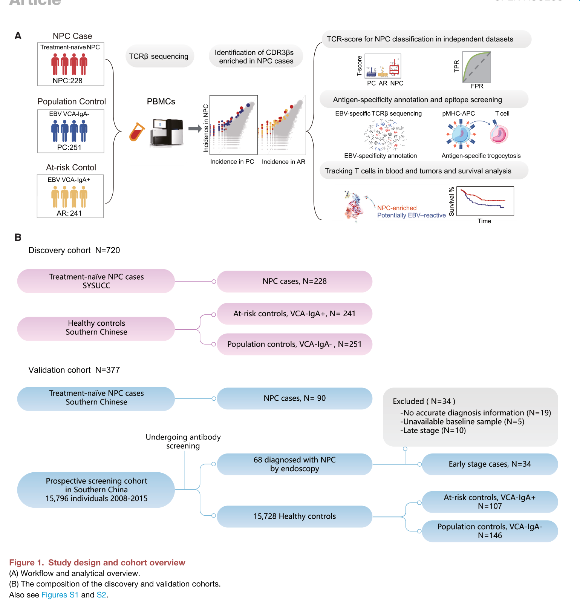
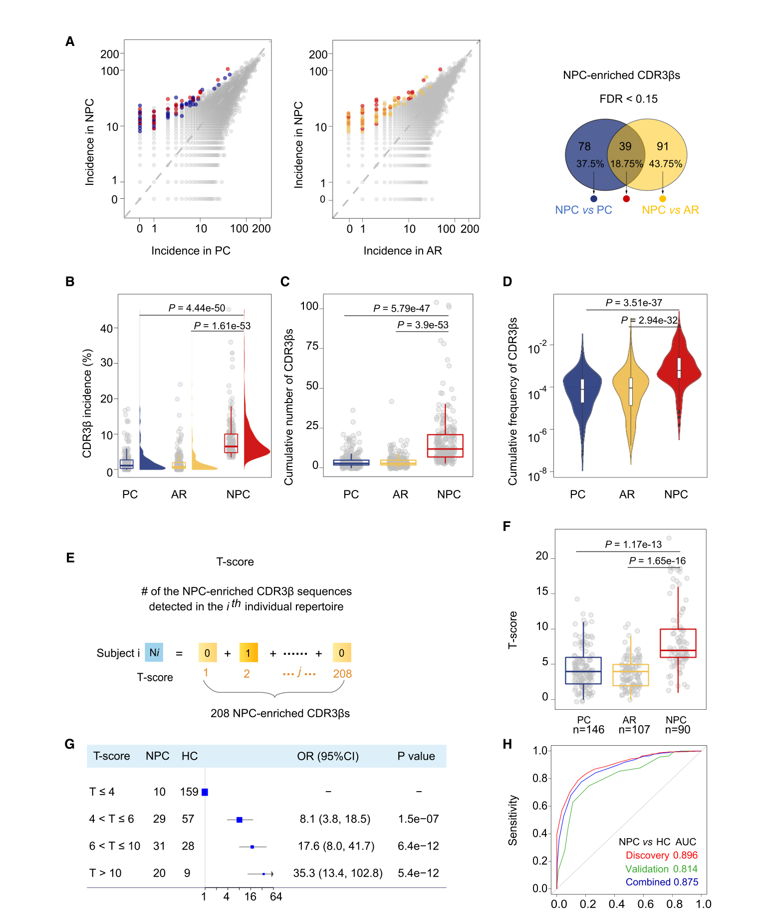
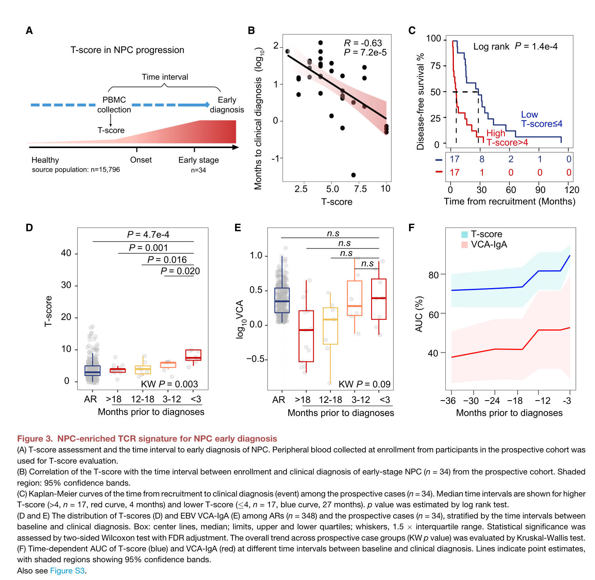
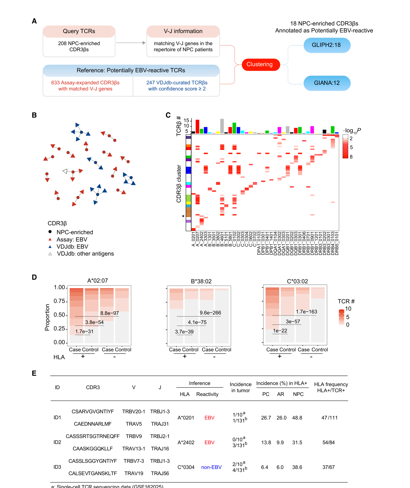
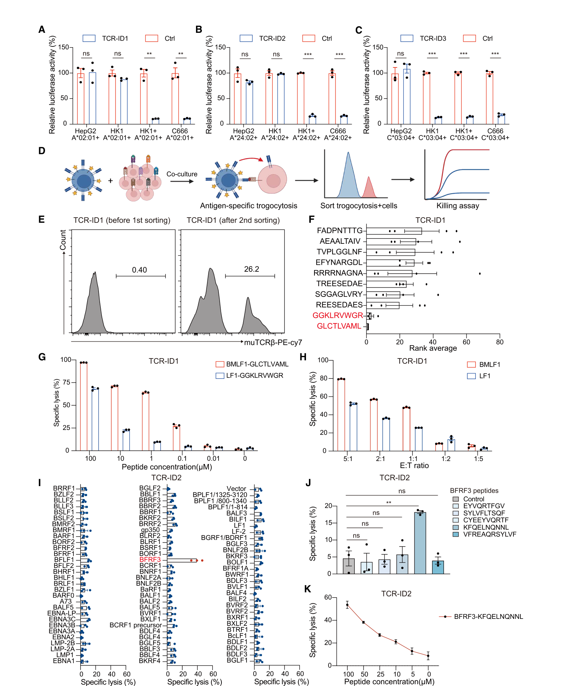
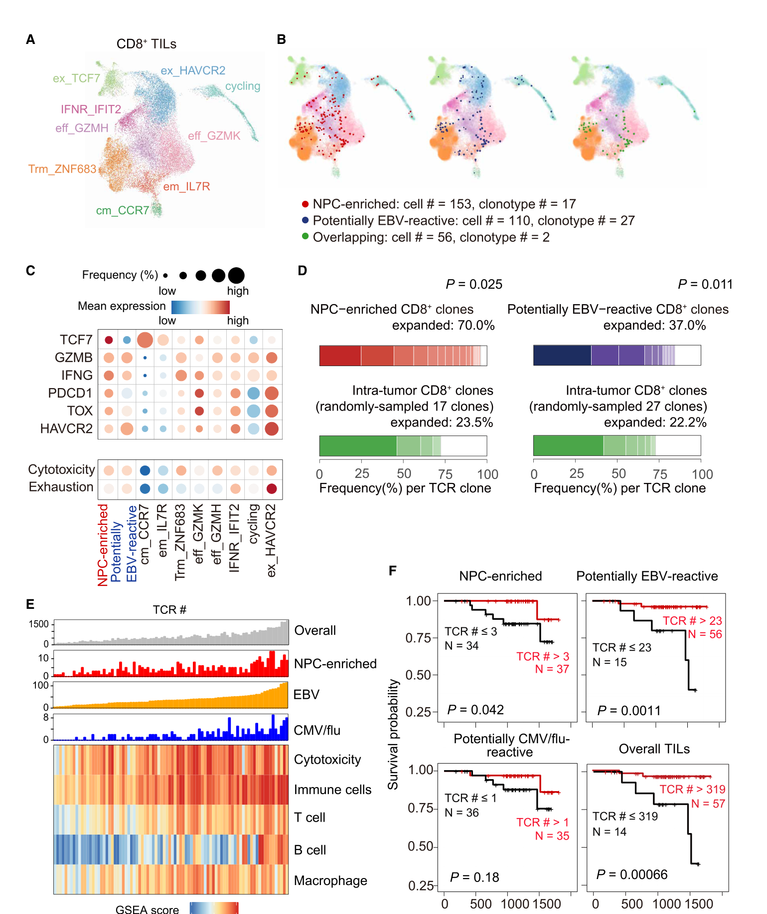
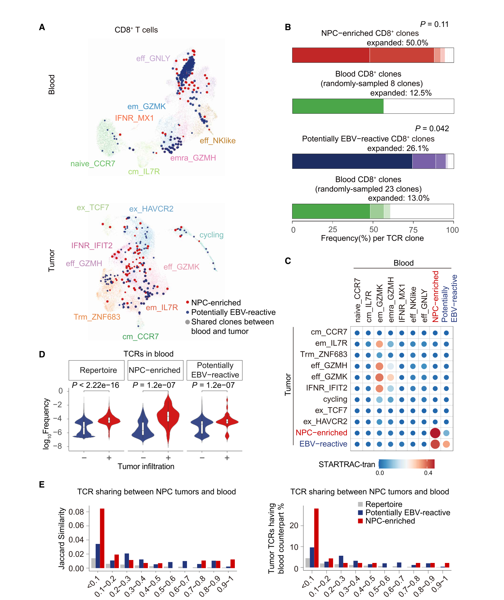

# Immunosequencing identifies signatures of T cell responses for early detection of nasopharyngeal carcinoma

<!-- wechat-style-reviewed: 2026-08-30 -->

在鼻咽癌高发地区做筛查时，最难处理的往往不是已经出现症状的患者，而是一名没有症状、EBV VCA-IgA 却呈阳性的人：他是否已经接近鼻咽癌发生，是否应该优先接受鼻咽镜检查？

血清 VCA-IgA 可以在发病前 3–5 年升高，但健康人也会发生 EBV 再激活；原文指出，鼻咽癌早诊比例仍低于 20%。EBV 循环肿瘤 DNA 更接近肿瘤负荷，却同样难以覆盖所有极早期病变。仅仅知道“感染过或再激活了 EBV”，还不等于知道“机体是否已经对鼻咽癌产生了相关免疫反应”。

作者因此换了一个观察对象：不直接追踪病毒或肿瘤释放物，而是读取外周血 T 细胞受体（TCR）留下的克隆扩增痕迹。发现队列纳入 720 人，随后用独立病例与 15,796 人前瞻筛查队列中的对照组成验证集，并在同一来源队列中检验诊断前信号；研究还继续追问这些血液 TCR 是否受到 EBV/HLA 驱动、能否识别肿瘤，以及是否真的出现在鼻咽癌组织中。

论文给出的答案是：208 条在鼻咽癌中富集的公共 CDR3β 序列可以组成一个简单计数型 T-score；它在独立验证中区分鼻咽癌与两类对照的 AUC 为 0.81，并在 34 名后来发生早期鼻咽癌的人中随临床诊断临近而升高。不过，这仍是高发地区、小规模前瞻病例上的候选分层信号，不是已经定标的普遍筛查工具。

## 01｜为什么 EBV 阳性还不能回答“谁更接近鼻咽癌”？

EBV 与鼻咽癌关系密切，但 EBV 感染在人群中很常见。VCA-IgA 主要提示近期再激活和风险升高，许多血清阳性者并不会进展为鼻咽癌；因此，它适合圈定高风险人群，却难以独立决定谁需要优先做进一步检查。

TCR repertoire 提供的是另一类信息。T 细胞遇到抗原后会发生克隆选择和扩增，CDR3β 序列由此成为可追踪的免疫反应痕迹。如果鼻咽癌发生时存在跨患者共享的 EBV 或肿瘤相关 T 细胞反应，外周血里就可能出现一组病例更常携带的公共序列。

真正的问题也随之变成三层：能否先找到可重复的鼻咽癌富集 TCR；这个信号能否早于临床诊断出现；它究竟连接了 EBV 暴露、HLA 限制和肿瘤浸润中的哪一部分。

## 02｜作者用了多大规模，怎样避免只在一个病例组里成立？

发现队列共 720 人：228 例新诊断、未治疗鼻咽癌，251 名 VCA-IgA 阴性人群对照，以及 241 名 VCA-IgA 阳性高风险对照。每人平均约有 80,000 条独特 CDR3β，且 80.2% 的序列只在一个人中出现；这说明研究面对的不是一个小型特征表，而是高度个体化的受体库。

横断面验证将独立收集的 90 例治疗前鼻咽癌，与 15,796 人前瞻筛查队列中抽取的 146 名 VCA-IgA 阴性、107 名阳性高风险对照比较。同一来源队列在 2008–2015 年纳入并随访到 68 例鼻咽癌；排除诊断资料不完整、缺少基线血样及晚期病例后，34 例早期病例用于诊断前验证。

Fig. 3D–E 的时间窗比较另以 348 名 VCA-IgA 阳性高风险对照（AR）为参照。不能把 34 例前瞻病例或 15,796 人来源队列误写成这一病例—对照比较的全部样本。

此外，发现队列 691 人和验证队列 370 人具有 HLA 信息。这个分层不可省略：TCR 识别抗原依赖 HLA 呈递，公共 TCR 能否跨人群复现，本来就会受到人群 HLA 频率影响。

简明图注：Fig. 1 将 720 人发现队列、独立收集的 90 例病例，以及从 15,796 人前瞻筛查队列抽取的两类对照放在同一流程中；前瞻早诊结论最终基于该来源队列中 34 例早期病例的基线血样。

## 03｜208 条公共 TCR 是怎样被筛出来的？

作者先从合并 repertoire 中保留在超过 10 人出现、且健康个体共享比例低于 40% 的 111,129 条候选，再排除两个病例测序批次间显著不同的序列，最终对 107,779 条 CDR3β 做病例—对照关联。每条序列用调整年龄和性别的 Firth logistic regression 检验，筛选阈值为 `q<0.15`、`p<2×10⁻⁴` 且效应方向指向病例富集。

鼻咽癌与 VCA-IgA 阴性对照的比较得到 117 条序列，与 VCA-IgA 阳性高风险对照的比较得到 130 条；其中 39 条重叠，合并为 208 条鼻咽癌富集 CDR3β。T-score 就是一个人在这 208 条序列中命中的条数，不是模型输出的患病概率。

这 208 条序列在鼻咽癌患者中的平均出现率为 8.31%，高于 VCA-IgA 阴性对照的 2.22% 和阳性高风险对照的 1.90%。病例平均携带 17.3 条，对照分别为 4.61 和 3.96 条；累计频率也从两类对照的 0.022% 和 0.040% 升至病例的 0.37%。比较对象一致地指向一组公共克隆的系统性扩增，而不是某一条稀有序列偶然出现。

简明图注：Fig. 2 依次展示两组病例—对照筛选、208 条序列的出现率与丰度、T-score 定义及验证集 ROC；T-score 是命中条数，不能直接解释为个体患病概率。

## 04｜这个分数在独立人群中能分开病例和对照吗？

在独立验证中，90 例鼻咽癌的平均 T-score 为 8.46，146 名 VCA-IgA 阴性对照为 4.43，107 名阳性高风险对照为 3.86。T-score 越高，与病例身份的关联越强；`T-score>10` 相比 `T-score≤4` 的病例身份比值比为 35，95% 置信区间为 13.36–102.81。

区分病例与全部健康对照的 AUC 为 0.81（95% CI 0.76–0.86）；分别与 VCA-IgA 阴性和阳性对照比较时，AUC 为 0.79 和 0.85。这里的比较说明 T-score 不只是复述 VCA-IgA 阳性状态，但 AUC 衡量的是排序能力，并没有给出真实筛查患病率下的阳性预测值。

## 05｜它真的能在临床诊断前发出信号吗？

前瞻验证只看入组时已经留存的基线血样。34 名后来被诊断为早期鼻咽癌的人中，基线 T-score 与距离诊断的时间呈负相关，`R=-0.63`，`p=7.2×10⁻⁵`：分数越高，临床诊断越近。

`T-score>4` 的 17 人中位诊断间隔为 4 个月，`T-score≤4` 的 17 人为 27 个月；加速失效时间模型给出的 time ratio 为 0.24，`p=7.6×10⁻⁵`。在 34 例前瞻病例与 348 名 AR 对照的分层比较中，T-score 随诊断临近的总体趋势显著（Kruskal–Wallis `p=0.003`），VCA-IgA 的总体趋势不显著（`p=0.09`）。

在诊断前 6 个月至 1 年窗口，T-score 的 time-dependent AUC 超过 0.80，而原文只把 VCA-IgA 描述为即使在诊断前 3 个月仍表现不足，没有报告可直接抄录的精确 AUC 数值。

简明图注：Fig. 3B–C 基于 34 例前瞻早期病例，D–E 则比较这 34 例与 348 名 AR 对照，而不是整个 15,796 人来源队列；4 个月与 27 个月的差异提示临近诊断信号，但小样本不足以完成临床阈值定标。

## 06｜这些 TCR 为什么可能与鼻咽癌有关？

作者先从 19 名鼻咽癌患者的外周血扩增 EBV 反应性 T 细胞，得到 633 条候选 EBV-reactive CDR3β，再与 VDJdb 参考序列结合，用 GLIPH2 和 GIANA 做相似性聚类。208 条鼻咽癌富集 CDR3β 中有 18 条被注释为潜在 EBV 反应性，其中 12 条同时得到两个算法支持。

HLA 关联提供了第二层线索。在 1,061 名有 HLA 信息的人中，45/208 条 CDR3β 至少与一个 HLA 等位基因显著关联。它支持抗原驱动选择，却仍只是群体关联；没有完整 TCRαβ 和靶表位，不能据此给每条序列指定抗原。

简明图注：Fig. 4 把 208 条候选与实验来源/数据库来源的 EBV TCR 聚类，并检验 HLA 共现；18 条潜在 EBV 反应性和 45 条 HLA 关联是候选注释，不是逐条功能证明。

作者最终只挑选 3 条具有完整 TCRαβ、血液与肿瘤检出及 HLA 线索的 TCR 做功能验证。TCR-ID1 和 ID2 杀伤 EBV 阳性的 HK1+、C666 细胞，不杀伤 EBV 阴性的 HK1 和 HepG2；TCR-ID3 可杀伤 EBV 阳性和阴性鼻咽癌细胞，却不杀伤 HepG2。进一步筛选把 ID1 连接到两个 EBV 表位，把 ID2 连接到 BRFR3 来源表位。

简明图注：Fig. 5 将统计签名推进到 TCR—HLA—抗原层面，但只覆盖 3 条 TCR；其结果不能外推到全部 208 条序列。

## 07｜外周血信号真的连到了肿瘤组织吗？

在 17 个治疗前鼻咽癌肿瘤的公开单细胞数据中，作者检出 153 个携带鼻咽癌富集 TCR 的 CD8 T 细胞，覆盖 17 个 clonotype；潜在 EBV 反应性 CD8 T 细胞为 110 个、覆盖 27 个 clonotype，两组只有 2 个 clonotype 重叠。它们主要位于活化效应簇，终末耗竭标志相对较低。

86 个鼻咽癌肿瘤的 bulk RNA-seq 用于重建 TCR 与免疫生态；为尽量控制总体 T 细胞浸润，生存比较排除最高 7 例和最低 8 例后剩 71 例。在这 71 例中，按肿瘤内 TCRβ 条数分组，鼻咽癌富集 TCR 较高组比低组生存更长（log-rank `p=0.042`）；潜在 EBV 反应性 TCR 同向（`p=0.0011`），CMV/流感反应性 TCR 组间则没有显著结局差异。这仍是相关性，不是这些克隆改善生存的因果证明。

简明图注：Fig. 6 将 17 个肿瘤的单细胞状态与 86 个肿瘤的 bulk 信号连接；调整总体 T 细胞浸润后的 Kaplan–Meier 比较实际为 71 例。

在 10 对血液—肿瘤单细胞样本中，血液里更扩增的鼻咽癌富集克隆更容易在配对肿瘤中检出；超过 20% 的肿瘤内鼻咽癌富集克隆，其血液对应克隆位于频率前 10%。Fig. 7 另用 31 对 bulk TCRβ 数据检查共享。两种尺度共同支持“外周扩增与肿瘤浸润相连”，但不能证明从血液向肿瘤的迁移方向。

简明图注：Fig. 7 同时包含 10 对单细胞血液—肿瘤样本和 31 对 bulk TCRβ 样本；完全配对 TCRαβ 的单细胞共享与仅按 TCRβ 判断的 bulk 共享不是同一个证据层级。

## 08｜它真正改变了哪一步？

对筛查流程而言，T-score 最现实的定位不是取代 VCA-IgA、EBV ctDNA 或鼻咽镜，而是在 VCA-IgA 阳性、家族史阳性等高风险人群中增加一层优先级。研究中 `T-score>4` 的 17 名诊断前病例有 12 人在 6 个月内被诊断，但这个比例来自已经确定会发病的病例子集，不能当作普通筛查人群的阳性预测值。

对研究设计而言，它示范了如何把一个血液分类信号连成证据链：独立病例加前瞻队列对照复现、诊断前纵向时间、HLA 限制、抗原筛选、肿瘤单细胞映射、血液—肿瘤共享和生存关联。T-score 的计数定义也便于审计和跨平台复核，但 208 条公共序列及阈值仍需在目标人群重新校准。

对后续机制或治疗研究而言，真正可执行的产物是候选 TCR 的优先级，而不是已经可用的 TCR-T 产品。只有 3 条 TCR 完成功能验证，多数序列仍缺少配对 TCRα、明确表位和体内效应证据。

## 09｜这些结果仍需要冷静看待

首先，最关键的诊断前分析只有 34 例早期鼻咽癌，且两组各 17 人的 4 个月与 27 个月比较容易受个体差异影响。AUC、相关系数和 time ratio 不能替代真实人群患病率下的敏感度、特异度、阳性预测值、复查负担和鼻咽镜资源评估。

其次，发现和验证对象主要是中国南方高发地区的广东华人。公共 TCR 同时受 HLA 频率、EBV 流行背景、测序平台和克隆检出深度影响；换到低发地区、其他祖源或其他实验流程，208 条序列与 `T-score>4` 都不能直接照搬。

再次，机制闭环只覆盖少数代表性 TCR。TCRβ-only 丢失多数 TCRα 配对；统计富集、HLA 共现、肿瘤检出和生存相关都不能证明全部 208 条序列具有肿瘤特异性或抗肿瘤功能。肿瘤浸润与生存关联也可能同时受到总体炎症、HLA-I 表达、肿瘤负荷和治疗敏感性影响。

最后，本地主 PDF 共 30 页、1,196 个句子 ID，双栏正文、图注和页眉在 Fig. 6–7 附近发生交错；补充图表只通过正文引用和图注进入解析，没有逐项完整展开。原文中的 208 条 CDR3β 与 Methods 中 730 条 `CDR3+V+J` TCRβ、VDJdb 的 245 条 CDR3β 与 247 条 TCRβ 使用了不同计数单位，不应被静默合并；完整来源范围和解析边界见技术附录。

---

## 技术附录

以下完整保留原笔记的论文信息、主图与完整图注、原始 Results 顺序、方法参数、统计解释、证据强度、迁移思路和证据边界，并在文末补充句子级 PDF 覆盖审计。

### 本文目录

- [基本信息](#基本信息)
- [本论文主图](#本论文主图)
- [生物学故事前情](#生物学故事前情)
- [重要缩写表](#重要缩写表)
- [论文详细解读](#论文详细解读)
- [研究问题与科学背景](#研究问题与科学背景)
- [研究设计与数据结构](#研究设计与数据结构)
- [方法与分析框架](#方法与分析框架)
- [原文结果完整梳理](#原文结果完整梳理)
  - [Study cohorts and data acquisition](#study-cohorts-and-data-acquisition)
  - [Identification of NPC-enriched CDR3 beta sequences](#identification-of-npc-enriched-cdr3-beta-sequences)
  - [Validation of NPC-enriched TCR signature for the early detection of NPC](#validation-of-npc-enriched-tcr-signature-for-the-early-detection-of-npc)
  - [Inference of antigen specificity and HLA restriction of NPC-enriched TCRs](#inference-of-antigen-specificity-and-hla-restriction-of-npc-enriched-tcrs)
  - [Experimental identification of the target specificity of three NPC-enriched TCRs](#experimental-identification-of-the-target-specificity-of-three-npc-enriched-tcrs)
  - [Tumor-infiltrating NPC-enriched CD8+ T cells](#tumor-infiltrating-npc-enriched-cd8-t-cells)
  - [The expansion of NPC-enriched CD8+ T cell clones in blood correlates with their infiltration in NPC tumors](#the-expansion-of-npc-enriched-cd8-t-cell-clones-in-blood-correlates-with-their-infiltration-in-npc-tumors)
- [作者结论与证据强度](#作者结论与证据强度)
- [独立方法学详解](#独立方法学详解)
  - [队列、采样与血清学](#队列、采样与血清学)
  - [外周血 TCRβ 测序与 clonotype 构建](#外周血-tcrβ-测序与-clonotype-构建)
  - [检测灵敏度、重复性和 PCR 偏倚评估](#检测灵敏度、重复性和-pcr-偏倚评估)
  - [NPC-enriched CDR3β 筛选与 T-score 构建](#npc-enriched-cdr3β-筛选与-t-score-构建)
  - [HLA 分型、TCR-HLA 关联和抗原特异性推断](#hla-分型、tcr-hla-关联和抗原特异性推断)
  - [肿瘤 bulk RNA-seq 与生存](#肿瘤-bulk-rna-seq-与生存)
  - [统计学分析方法](#统计学分析方法)
  - [功能验证、单细胞映射和血液-肿瘤共享](#功能验证、单细胞映射和血液-肿瘤共享)
- [生物学与临床意义](#生物学与临床意义)
- [局限性与危险假设](#局限性与危险假设)
- [深度研究洞察](#深度研究洞察)
- [可借鉴或迁移的思路](#可借鉴或迁移的思路)
- [可复用学术表达](#可复用学术表达)
- [相关论文与概念](#相关论文与概念)
- [覆盖审计](#覆盖审计)

### 基本信息

- 原文题名：Immunosequencing identifies signatures of T cell responses for early detection of nasopharyngeal carcinoma
- 期刊：Cancer Cell 43, 1423-1441
- 年份：2025
- DOI：10.1016/j.ccell.2025.04.009
- 第一作者：Shanshan Zhang、Yan Zhou、Zhonghua Liu、Yuqian Wang
- 通讯作者：Yi-Xin Zeng、Sumei Cao、Guideng Li、Miao Xu
- 研究领域：鼻咽癌早筛、TCR repertoire、EBV、肿瘤免疫、外周血液体活检
- 关键词：nasopharyngeal carcinoma、TCR beta、CDR3 beta、T-score、EBV VCA-IgA、HLA restriction、TIL、early detection
- 本地 PDF：`pdfs/processed/npc-tcr-early-detection-cancer-cell-2025.pdf`
- 前瞻筛查队列注册：NCT00941538
- 数据来源：作者生成的 bulk TCRβ 矩阵及相关信息存于 National Genomics Data Center，项目号 `PRJCA027151`；单细胞/肿瘤转录组复用 `GSE162025`、`GSE150825`、`GSE102349`。
- 代码来源：论文未提供原创代码；所用软件和版本见 Methods。
- PDF 解析质量：
  - 使用 `scripts/build_pdf_llm_pack.py --engine pymupdf` 建立句子级解析包；共 30 页、1,196 个句子 ID。
  - 双栏正文、主图图注和页眉多处交错，Fig. 6–7 及跨页 Results 需按版面语义复位；Key Resources Table 的列发生展平。
  - 自动 Methods 吞入 60 条参考文献；真实 Results/Methods 范围已在文末人工校正并闭合。
  - 补充图表仅以主文引用和现有图注进入解析，未逐项完整取得；低置信位置均标为 `EXTRACTION_CHECK`。
- 图像截取说明：已截取主文 Fig. 1-7，图像位于 `assets/immunology/2025-npc-tcr-early-detection/`。

---

### 本论文主图

| 原文图表 | 原文图题/核心信息 | 是否截取 | 图像文件 | 放置位置 |
|---|---|---|---|---|
| Fig. 1 | Study design and cohort overview：发现队列、验证队列、前瞻筛查队列和分析流程 | 是 | `assets/immunology/2025-npc-tcr-early-detection/fig1-study-design.png` | [02｜队列与验证设计](#reader-npc-fig1) |
| Fig. 2 | NPC-enriched TCR signature for NPC classification：208 条 NPC 富集 CDR3β 与 T-score 分类 | 是 | `assets/immunology/2025-npc-tcr-early-detection/fig2-tcr-classification.png` | [03｜208 条公共 TCR 的筛选](#reader-npc-fig2) |
| Fig. 3 | NPC-enriched TCR signature for NPC early diagnosis：T-score 与临床诊断前时间间隔、VCA-IgA 对比 | 是 | `assets/immunology/2025-npc-tcr-early-detection/fig3-early-diagnosis.png` | [05｜诊断前信号](#reader-npc-fig3) |
| Fig. 4 | EBV antigen-recognition and HLA restriction of NPC-enriched TCRs：EBV 反应性注释与 HLA-TCR 关联 | 是 | `assets/immunology/2025-npc-tcr-early-detection/fig4-ebv-hla.png` | [06｜EBV/HLA 线索](#reader-npc-fig4) |
| Fig. 5 | Identification of the cognate epitopes for NPC-enriched TCRs：3 条 TCR 的 NPC 细胞反应性和表位识别 | 是 | `assets/immunology/2025-npc-tcr-early-detection/fig5-cognate-epitopes.png` | [06｜3 条 TCR 的功能验证](#reader-npc-fig5) |
| Fig. 6 | Tumor-infiltrating NPC-enriched and EBV-reactive CD8+ T cells：TME 表型、克隆扩增与生存 | 是 | `assets/immunology/2025-npc-tcr-early-detection/fig6-tumor-infiltrating-cd8.png` | [07｜肿瘤浸润与生存](#reader-npc-fig6) |
| Fig. 7 | Peripheral expansion of NPC-enriched T cell clones correlates with their infiltration in NPC tumors：血液-肿瘤克隆共享 | 是 | `assets/immunology/2025-npc-tcr-early-detection/fig7-blood-tumor-sharing.png` | [07｜血液—肿瘤克隆共享](#reader-npc-fig7) |

### 生物学故事前情

鼻咽癌的生物学故事从 EBV、上皮细胞转化和地区性高发人群开始。EBV 感染在人群中非常普遍，但只有少数人在特定遗传背景、环境暴露和局部组织条件下发展为 NPC。因此，单纯检测 EBV 暴露或 EBV 再激活，无法很好地区分“普通 EBV 阳性”与“真正接近 NPC 发生”的人。

传统筛查主要依赖 EBV VCA-IgA 等血清学指标，以及后续鼻咽镜和影像学确认。问题在于，EBV 血清阳性人群很大，阳性预测值有限；EBV ctDNA 更接近肿瘤负荷，但对极早期病变和临床诊断前窗口仍有边界。也就是说，领域里缺的是一种能读出“宿主是否已经产生 NPC 相关免疫反应”的血液信号。

TCR repertoire 提供了这个切入点。T 细胞扩增会留下 CDR3 序列痕迹，如果 NPC 发生过程中存在共享的 EBV 或非 EBV 肿瘤抗原反应，那么外周血中可能能捕捉到一组公共 TCRβ 签名。本文的故事主线就是：从外周血里找 NPC 富集 TCR，验证它是否能做早筛，再追问这些 TCR 是否真的和 EBV/HLA、肿瘤浸润和抗肿瘤免疫有关。

### 重要缩写表

| 缩写 | 中文含义 | 本文语境中的具体指代 | 阅读时注意 |
|---|---|---|---|
| NPC | 鼻咽癌 | 本文研究的 EBV 相关肿瘤和早筛目标 | 不是所有 EBV 感染者都会发展为 NPC |
| EBV | Epstein-Barr virus | 与 NPC 发生密切相关的病毒背景和抗原来源 | EBV 反应不等于肿瘤特异反应 |
| VCA-IgA | EBV 病毒衣壳抗原 IgA 抗体 | 高发区 NPC 筛查常用血清学指标 | 反映 EBV 再激活风险，阳性预测值有限 |
| ctDNA | 循环肿瘤 DNA | 血液中肿瘤来源 DNA，用作液体活检信号 | 更接近肿瘤负荷，不一定覆盖最早免疫变化 |
| TCRβ | T 细胞受体 beta 链 | 本文外周血免疫测序的主要对象 | 只有 beta 链不能完整代表 TCRαβ 配对特异性 |
| CDR3β | TCRβ 互补决定区 3 | 用于定义和追踪 TCR clonotype 的核心序列 | 序列共享提示可能共同抗原反应，但需功能验证 |
| HLA | 人类白细胞抗原 | 呈递抗原并限制 TCR 识别的遗传背景 | HLA 频率影响公共 TCR 签名的跨人群泛化 |
| PBMC | 外周血单个核细胞 | 外周血 TCR 测序的样本来源 | 血液信号需要与肿瘤局部反应连接验证 |
| TIL | 肿瘤浸润淋巴细胞 | 肿瘤组织内的 T 细胞等免疫细胞 | TIL 状态用于判断外周签名是否连接肿瘤免疫 |
| T-score | TCR 签名分数 | 个体 repertoire 中命中 208 条 NPC-enriched CDR3β 的数量 | 是计数型诊断信号，不是复杂机器学习概率 |
| GLIPH2/GIANA | TCR 相似性聚类工具 | 用于推断 NPC-enriched TCR 是否类似已知 EBV-reactive TCR | 聚类是候选注释，不等于确定抗原特异性 |

### 论文详细解读

#### 研究问题与科学背景

鼻咽癌是 EBV 相关肿瘤，在中国南方和东南亚高发。早期鼻咽癌预后较好，但由于早期症状不明显，原文指出早诊比例低于 20%。EBV VCA-IgA 抗体可在发病前 3-5 年升高，长期用于筛查，但 EBV 再激活在健康人群中也常见，导致阳性预测值有限。EBV ctDNA 更接近肿瘤负荷，在进展期更敏感，但对最早期病变的窗口仍有限。

作者提出的问题不是单纯寻找一个新的血液指标，而是利用 TCR repertoire 作为机体 T 细胞抗原反应历史的记录，判断 NPC 发生过程中是否会形成可在外周血捕捉的公共 TCR 签名。如果 NPC 相关 T 细胞不仅在肿瘤局部存在，也在外周血扩增，那么 TCRβ 深度测序可能成为 EBV 血清学和 ctDNA 之外的第三类早筛信号。

这篇文章的关键科学瓶颈有三个：第一，NPC 与 EBV 强相关，但 NPC 发生过程中的 T 细胞反应既可能指向 EBV，也可能指向非 EBV 肿瘤相关抗原；第二，TCR 识别受 HLA 限制，公共 TCR 的跨人群可迁移性天然受 HLA 背景影响；第三，外周血 TCR 信号是否真正连接肿瘤浸润和预后，而不只是 EBV 暴露或普通炎症反应，需要机制层面的验证。

#### 研究设计与数据结构

中文图注（基于原文图注）：Fig. 1A 展示整体工作流：从治疗前 NPC 病例、EBV VCA-IgA 阴性人群对照和 EBV VCA-IgA 阳性高风险对照采集外周血，进行 TCRβ 测序，识别 NPC 病例中富集的 CDR3β 序列；随后构建 T-score，在独立数据集中做分类验证，并进一步进行 EBV 特异性注释、表位筛选、血液-肿瘤 T 细胞追踪和生存分析。Fig. 1B 展示队列结构：发现队列共 720 人，包括 228 例治疗前 NPC、251 名 VCA-IgA 阴性 population controls 和 241 名 VCA-IgA 阳性 at-risk controls；验证部分包括独立 90 例治疗前 NPC，以及来自 15,796 人前瞻性筛查队列的早期 NPC 和对照。缩写：PC，population control；AR，at-risk control；PBMC，外周血单个核细胞。

发现队列来自中国南方 NPC 高发地区，包含 228 例新诊断、未治疗 NPC 患者，251 名 EBV VCA-IgA 阴性低风险人群对照，以及 241 名 EBV VCA-IgA 阳性高风险健康对照。作者平均每人获得约 80,000 条 unique CDR3β 序列；80.2% CDR3β 序列为个体私有序列，只在一名个体中出现。

验证设计有两层。第一层是独立收集的 90 例治疗前 NPC 病例，与 146 名 VCA-IgA 阴性对照和 107 名 VCA-IgA 阳性高风险对照比较。第二层是前瞻性 NPC 筛查队列：2008-2015 年纳入 15,796 名高发地区人群，随访至 2019 年底，68 人诊断为 NPC；排除诊断资料不完整、缺少基线血样和晚期病例后，保留 34 例随访中发生的早期 NPC，用基线血样评估临床诊断前 T-score。

作者还对发现队列 691 人和验证队列 370 人进行 HLA 分型。HLA 背景很关键，因为 TCR 抗原识别依赖 MHC 呈递；文章后续所有“NPC 富集 TCR 是否抗原驱动”的论证都部分依赖 HLA-TCR 关联。

#### 方法与分析框架

核心分析从一个 meta TCRβ repertoire 开始。作者将发现队列的病例和对照合并，先筛选在超过 10 名个体中出现、且在健康个体中共享比例低于 40% 的 CDR3β，以保证公共序列有足够关联分析统计功效。随后排除在两个病例测序批次中差异显著的 CDR3β，降低批次效应风险，最终对 107,779 条 CDR3β 做关联分析。

对每条 CDR3β，作者用 Firth logistic regression 比较其在 NPC 病例与 PC、AR 对照中的出现情况，并调整年龄和性别。选择阈值不是直接按任意 FDR 设定，而是通过 leave-one-out cross-validation 在多个 FDR cutoff 下寻找 cross-entropy loss 较优的平衡点，最终以 FDR q < 0.15、p < 2e-4、效应方向为 NPC 富集作为筛选标准。这个流程产生 208 条 NPC-enriched CDR3β。

T-score 的定义很简单：在一个个体的 TCR repertoire 中，完美匹配 208 条 NPC 富集 CDR3β 的条数。也就是说，T-score 不是复杂机器学习黑箱，而是“NPC 富集公共 TCR 负荷”。这种设计牺牲了一部分表达能力，但换来可解释性和临床阈值直观性。

机制验证分为四层：第一，用 EBV-specific T cell expansion 和 VDJdb 建立 EBV-reactive TCRβ 参考库，再用 GLIPH2/GIANA 做相似性聚类；第二，在 1,061 名有 HLA 信息的个体中做 HLA-TCR 关联；第三，选取 3 条有完整 TCRαβ、血液和肿瘤均出现、且有 HLA 关联的 TCR 做体外功能验证；第四，将 NPC-enriched TCR 映射到单细胞 TCR/RNA-seq 和肿瘤 bulk RNA-seq，评估 TME 表型、血液-肿瘤共享和生存关联。

#### 原文结果完整梳理

##### Study cohorts and data acquisition

原文首先证明数据结构支持后续关联分析。发现队列有 720 人，验证队列包括独立病例和前瞻筛查样本。HLA 频率在发现和验证队列中总体一致，并复现了已知 NPC 风险相关等位基因富集，例如 HLA-A*02:07、B*46:01 在病例中更常见，保护性等位基因如 HLA-A*11:01、B*13:01 在对照中更常见。除已知 NPC 相关 HLA 外，其他常见 HLA 在病例和对照间没有显著差异。这个结果说明研究人群确实带有 NPC 遗传易感背景，同时也提示后续 TCR 关联必须处理 HLA 限制问题。

##### Identification of NPC-enriched CDR3 beta sequences

中文图注（完整 panel 信息）：Fig. 2A 在发现集中比较 NPC 228 例与 PC 251 名、AR 241 名，按 `FDR<0.15` 得到两组 NPC 富集 CDR3β 及其重叠；图面和原文图注的蓝/黄色映射冲突，具体边界见文末。B–D 展示 208 条序列的发生率、累计条数和累计频率，箱线为中位数、上下四分位及 `1.5×IQR`，组间用双侧 Wilcoxon 检验。E 定义 T-score 为个体命中的 208 条序列数。F 在验证集比较 PC 146 名、AR 107 名和 NPC 90 例，同样使用双侧 Wilcoxon。G 以 `T-score≤4` 为参照，用 logistic regression 估计 OR、95% CI 和 p 值；`T-score>10` 的 OR 为 35.3（95% CI 13.4–102.8）。H 展示发现集、独立验证集和合并数据的 ROC，AUC 分别为 0.896、0.814 和 0.875。HC：healthy controls；来源 `P006.S0030-P006.S0041`。

作者在发现队列中分别比较 NPC vs PC 和 NPC vs AR。NPC vs PC 识别 117 条显著富集 CDR3β，NPC vs AR 识别 130 条，其中 39 条重叠，合并得到 208 条 NPC-enriched CDR3β。作者进一步检查这些 208 条序列在对照人群中不随性别或年龄显著偏移，降低年龄/性别造成假阳性的可能。

这些 TCR 在 NPC 中不仅更常出现，也更扩增。每条 NPC-enriched CDR3β 平均出现在 8.31% NPC 患者中，而在 PC 中为 2.22%，在 AR 中为 1.90%。从个体层面看，NPC 患者平均携带 17.3 条 NPC-enriched CDR3β，PC 平均 4.61 条，AR 平均 3.96 条。累计频率也明显升高：NPC 中平均 0.37%，PC 为 0.022%，AR 为 0.040%。这说明信号不是单个稀有克隆偶然出现，而是一组公共 TCR 在 NPC 外周血中系统性扩增。

##### Validation of NPC-enriched TCR signature for the early detection of NPC

中文图注（完整 panel 信息）：Fig. 3A 展示基线采血与早期 NPC 临床诊断的时间轴。B 在 34 例前瞻早期病例中比较基线 T-score 与诊断间隔，阴影为 95% 置信带。C 在同一 34 例中比较 `T-score>4`（17 例，中位 4 个月）与 `≤4`（17 例，中位 27 个月），log-rank `p=1.4×10⁻⁴`；原文另用 AFT 模型得到 time ratio 0.24、`p=7.6×10⁻⁵`。D–E 将 348 名 AR 对照与 34 例前瞻病例按诊断前时间分层，比较 T-score 和 VCA-IgA；箱线为中位数、上下四分位及 `1.5×IQR`，两两比较用双侧 Wilcoxon 并做 FDR 校正，病例组整体趋势用 Kruskal–Wallis 检验（T-score `p=0.003`，VCA-IgA `p=0.09`）。F 展示两种指标的 time-dependent AUC，线为点估计、阴影为 95% 置信带；来源 `P006.S0007-P006.S0016`、`P007.S0018-P007.S0029`。

在独立验证集中，90 例 NPC 的 T-score 平均为 8.46，明显高于 PC 的 4.43 和 AR 的 3.86。T-score 越高，NPC 风险越高；T-score > 10 的个体相比 T-score <= 4 的个体，NPC 风险 OR 为 35，95% CI 为 13.36-102.81。T-score 区分 NPC 与健康对照的 AUC 为 0.81；分别与 PC 和 AR 比较时，AUC 为 0.79 和 0.85。

更关键的是前瞻性早诊验证。34 名入组后发生早期 NPC 的个体中，基线 T-score 与从入组到临床诊断的时间间隔显著负相关，Pearson R = -0.63，p = 7.2e-5。T-score > 4 的个体中位诊断间隔为 4 个月，而 T-score <= 4 的个体为 27 个月；AFT 模型估计 time ratio = 0.24，p = 7.6e-5。换句话说，T-score 高并不是简单标记“未来某时可能患 NPC”，而是更接近临床诊断即将发生的免疫接近信号。

与 EBV VCA-IgA 相比，T-score 在诊断前 6 个月到 1 年的 time-dependent AUC 超过 0.80，而 VCA-IgA 在 3 个月内仍表现不足。原文因此提出，T-score 可能为 EBV 血清阳性高风险人群增加一层分层信息；是否能据此安排鼻咽镜优先级，仍需按真实患病率和筛查资源前瞻定标。

##### Inference of antigen specificity and HLA restriction of NPC-enriched TCRs

中文图注（完整 panel 信息）：Fig. 4A 用 GLIPH2 和 GIANA 对 208 条 NPC-enriched CDR3β 做 EBV 特异性注释。B 中圆点为 NPC-enriched CDR3β，红/蓝三角分别为实验来源/VDJdb 整理的潜在 EBV-reactive CDR3β，白三角为 VDJdb 中潜在非 EBV 反应序列，连线表示 GLIPH2 同簇。C 在合并数据中用单侧 Fisher 精确检验评估 TCRβ–HLA 关联，逐条 TCRβ 以 FDR 0.15 确定 `p=0.003` 阈值；顶部为各 HLA 的关联 TCRβ 数，左侧颜色区分共享同一 CDR3β 的簇，星号表示同一 CDR3β 因不同 BV gene 与不同 HLA 关联。该 panel 的 69 条 TCRβ 口径不同于正文的 45/208 条唯一 CDR3β。D 比较 HLA 阳性/阴性的 NPC 与健康对照携带相关 TCRβ 的数量，p 值来自 Cochran–Armitage trend test。E 列出肿瘤或 PBMC 单细胞数据中用于功能验证的 3 条完整 TCRαβ；来源 `P009.S0026-P009.S0040`。

作者首先自建 EBV-reactive TCRβ 参考库。因为东亚常见 HLA 对应的公共 TCR 特异性数据库不足，作者从 19 名 NPC 患者 PBMC 中用 EBV 转化自体 LCL 和 EBV peptide pool 扩增 EBV-specific T cells，筛选扩增超过 10 倍且在至少两个共享 HLA 个体中出现的 TCR，得到 633 条 potentially EBV-reactive CDR3β。再与 VDJdb 高置信 EBV TCR 合并，作为 EBV 参考库。

用 GLIPH2 和 GIANA 聚类后，208 条 NPC-enriched CDR3β 中有 18 条被注释为 potentially EBV-reactive，其中 12 条由两个方法同时支持。18 条中 4 条由 VDJdb EBV TCR 注释，14 条由作者实验扩增得到的 EBV TCR 注释。这一比例说明 NPC 富集 TCR 只部分可解释为 EBV 反应，剩余大量 TCR 可能指向非 EBV NPC 相关抗原，或仍未被现有参考库覆盖。

HLA-TCR 关联分析进一步支持抗原驱动选择。1,061 名有 HLA 信息的个体中，208 条 NPC-enriched CDR3β 有 45 条与至少一个 HLA 等位基因显著关联。分层分析显示，在携带相关 HLA 的 NPC 患者中，对应 NPC-enriched TCR 频率高于 HLA 匹配对照和 HLA 阴性的病例/对照。单细胞 TCR 数据也显示，大多数 NPC-enriched CDR3β 连接到单一 TRBV，且部分 TCRβ clonotype 有单一 TRAV 搭配，符合抗原选择而非随机扩增的预期。

##### Experimental identification of the target specificity of three NPC-enriched TCRs

中文图注（完整 panel 信息）：Fig. 5A–C 将 TCR-ID1/2/3 转导原代 T 细胞与未转导对照分别和 EBV 阳性或阴性 NPC 靶细胞共培养 48 h；靶细胞表达 luciferase 及相应 HLA-A*02:01、A*24:02 或 C*03:04，HK1 为 EBV 阴性 NPC，HK1+ 与 C666 为 EBV 阳性 NPC，HepG2 为对照。D 中 TCR-Jurkat 与呈递候选表位的 SCT-K562 共培养，分选 trogocytosis 阳性细胞后用 NGS 找靶抗原；E 比较分选前后 K562 的平均荧光和 TCR 染色，F 给出两轮筛选后的富集肽（`n=4`）。G 以不同浓度 BMLF1-GLCTLVAML 或 LF1-GGKLRVWGR 肽刺激 HLA-A*02:01-COS-7，24 h 后读出存活细胞；H 以 BMLF1/LF1 基因内源表达和不同 E:T 比例验证 48 h 杀伤。I 用 EBV gene constructs 筛 TCR-ID2 靶标；J 使用 10 μM 候选肽，K 使用 KFQELNQNNL 浓度梯度，均在 24 h 读出。误差线为 SEM；F 为 `n=4`，A–C、G–K 为 `n=3`。来源 `P010.S0003-P010.S0005`、`P011.S0026-P011.S0041`。

作者从单细胞 TCR 数据中筛选 3 条用于功能验证的 TCR：TCR-ID1、TCR-ID2、TCR-ID3。入选标准包括有完整 TCRα/β 信息、在血液中发生率高且在肿瘤中可检出、与特定 HLA 显著关联。TCR-ID1 和 ID2 分别与 HLA-A*02:01 和 A*24:02 关联，并被前述聚类注释为 EBV-reactive；TCR-ID3 与 HLA-C*03:04 关联，未被注释为 EBV-reactive。

体外杀伤实验显示，TCR-ID1 和 ID2 能杀伤 EBV 阳性的 HK1+ 和 C666 NPC 细胞，而不杀伤 EBV 阴性 HK1 和 HepG2，支持 EBV 反应性。TCR-ID3 不杀伤 HepG2，但能杀伤 EBV 阳性和阴性 NPC 细胞，提示其靶点可能是 NPC 细胞表达的非 EBV 抗原。三条 TCR 的反应都符合推断的 HLA 限制。

表位筛选进一步明确 TCR-ID1 识别 EBV BMLF1-derived GLCTLVAML 和 LF1-derived GGKLRVWGR，且表现出对两个 EBV 表位的交叉识别。TCR-ID2 通过 EBV ORF screening 和 NetMHCpan 候选肽验证，被定位到 BRFR3-derived KFQELNQNNL。该部分把统计学 TCR 签名推进到“具体 TCR-抗原-HLA”层面，是整篇文章机制可信度的重要支撑。

##### Tumor-infiltrating NPC-enriched CD8+ T cells

中文图注（完整 panel 信息）：Fig. 6A 展示 17 个 NPC 肿瘤的 CD8+ TIL UMAP，B 投影 NPC-enriched、potentially EBV-reactive 及重叠细胞。C 中点大小表示簇内阳性细胞比例，颜色表示 marker、cytotoxicity 和 exhaustion 基因的平均表达。D 比较 17 个 NPC-enriched 与 27 个 EBV-reactive clonotype 的扩增；各以同数背景克隆随机抽样 1,000 次并按细胞数排序，绿色为同一 rank 的中位细胞数，singleton 合并显示，p 值来自双侧配对 Wilcoxon。E 在 86 个 NPC bulk 肿瘤中展示检出 TCRβ 数和 ssGSEA 免疫评分，并区分 NPC、EBV、CMV/flu 相关 TCR。F 的 Kaplan–Meier/log-rank 实际使用 71 例，排除总体 T 细胞浸润最高 7 例和最低 8 例；完整 86 例见 Fig. S8。来源 `P012.S0002-P012.S0003`、`P013.S0028-P013.S0041`。

作者将 NPC-enriched 和 EBV-reactive CDR3β 映射到两个公开 NPC 单细胞数据集，共 17 名治疗前 NPC 肿瘤。大多数携带这些 TCRβ 的肿瘤内 T 细胞为 CD8+。在 CD8+ TIL 中，作者识别 9 个转录状态，从 tissue-resident memory、central memory、effector memory，到 activated pre-exhausted 和 terminally exhausted。

肿瘤中共检出 153 个 NPC-enriched CD8+ T cells，覆盖 17 个 clonotypes；potentially EBV-reactive CD8+ T cells 为 110 个，覆盖 27 个 clonotypes，其中 2 个 NPC-enriched clonotypes 也属于 potentially EBV-reactive。两类细胞主要落在 eff_GZMK 和 eff_GZMH 等活化效应簇，表达 TCF7、IFNG、GZMB，但 PD-1、HAVCR2、TOX 等耗竭标志相对较低。少数克隆进入 terminally exhausted 状态。

生存分析使用 86 个有生存信息的 NPC bulk mRNA-seq 肿瘤样本。总体 T 细胞浸润高与较好生存相关。进一步排除总体 T 细胞浸润最高和最低样本后，NPC-enriched TCR 丰度仍与较长生存相关，log rank p = 0.042；potentially EBV-reactive TCR 也显著，p = 0.0011；CMV/flu-reactive TCR 不预测生存。这使“全部只是常见病毒旁观者反应”的解释变得不充分，但仍不能证明这些 TCR 主动控制了肿瘤。

##### The expansion of NPC-enriched CD8+ T cell clones in blood correlates with their infiltration in NPC tumors

中文图注（完整 panel 信息）：Fig. 7A 使用 10 对血液—肿瘤单细胞样本，放大点表示两处共享完整 TCR pair。B 比较血液中的 8 个 NPC-enriched 与 23 个 EBV-reactive clonotype；分别匹配同数背景克隆、随机抽样 1,000 次，p 值来自双侧配对 Wilcoxon。C 用 STARTRAC-transition index 描述血液与肿瘤簇间共享，点大小表示指数，红/蓝表示较频繁/较少。D 比较与肿瘤共享（`+`）或只在血液检出（`−`）的 TCRβ 频率，使用 Wilcoxon；箱线为中位数、上下四分位及 `1.5×IQR`。E 将血液 TCRβ 频率分成 10 个分位，报告肿瘤—血液 Jaccard similarity 及各分位中有血液对应克隆的肿瘤 TCRβ 比例，使用 31 对 bulk TCRβ 样本。来源 `P014.S0003-P014.S0005`、`P015.S0032-P015.S0045`。

作者在 10 对配对血液和 NPC 肿瘤单细胞数据中追踪完整 TCRαβ 克隆。外周血中的 NPC-enriched 和 potentially EBV-reactive clones 明显扩增，但不像肿瘤内对应细胞那样呈耗竭状态，说明耗竭更可能发生在肿瘤微环境中。

血液-肿瘤共享分析显示，NPC-enriched CD8+ T cell clones 比 EBV-reactive clones 和总体 repertoire 更倾向于跨血液和肿瘤共享。血液中频率更高的克隆更容易在配对肿瘤中被检出；这一趋势在 NPC-enriched clones 中尤其明显。超过 20% 的肿瘤内 NPC-enriched clones 在血液中对应克隆位于频率 top 10%。这给 T-score 的生物学解释提供了关键支撑：外周血 TCR 签名不仅是血液现象，还与肿瘤浸润克隆存在可追踪联系。

#### 作者结论与证据强度

作者已经较有力证明：NPC 患者外周血中存在一组公共、可重复识别的 NPC-enriched CDR3β；这些 TCR 可构成简洁 T-score，在独立验证集中区分 NPC 与 EBV VCA-IgA 阴性/阳性对照；在前瞻筛查队列中，诊断前 T-score 越高，距离早期 NPC 临床诊断越近；部分 NPC-enriched TCR 具有 EBV 表位或 NPC 细胞反应性，并与 HLA 限制一致；肿瘤内 NPC-enriched CD8+ T cells 呈活化、非终末耗竭状态，并与较好生存相关。

合理但仍需进一步证明的是：T-score 可作为真实世界 NPC 高危人群筛查工具。现有前瞻样本只有 34 例后续发生早期 NPC 的个体，且研究人群集中在中国南方高发地区。阈值 T-score > 4 的临床使用还需要更大规模前瞻验证、不同地区和平台复现，以及与 EBV VCA-IgA、EBV ctDNA、家族史和鼻咽镜策略的联合评估。

原文没有证明的是：208 条 NPC-enriched TCR 全部都是肿瘤反应性或具有抗肿瘤功能。作者仅功能验证 3 条 TCR，且多数 TCR 缺少 TCRα 配对和 cognate antigen。统计富集、HLA 关联和肿瘤映射支持抗原驱动，但不能替代逐条功能验证。

### 独立方法学详解

#### 队列、采样与血清学

发现队列纳入中山大学肿瘤防治中心 2012–2021 年招募的 18–75 岁、未经治疗的 228 例鼻咽癌，以及肇庆社区同年龄范围的 241 名 VCA-IgA 阳性和 251 名阴性对照；所有人均自报为广东华人，对照还要求无癌症和自身免疫病。前瞻验证嵌套于 2008–2015 年招募的 15,796 人筛查队列并随访至 2019 年 12 月 31 日：68 人经鼻咽镜诊断鼻咽癌，排除 19 人诊断资料不完整、5 人无基线血样和 10 人晚期病例后，保留 34 例 T1–T2 病例；146 名阴性和 107 名阳性对照与验证病例年龄匹配，男女比例约 1:1。另有 90 例未经治疗的独立验证病例来自广州、四会和中山；所有样本均采于 2022 年末中国 COVID-19 大规模传播之前（`P024.S0007-P024.S0025`）。

外周血采入 EDTA 管，全血在提取 gDNA 前保存于 −80°C，PBMC 分离后冻存。VCA-IgA 用 Euroimmun ELISA（`EI 2791-9601 A`）测量，以样本 OD/参照 OD 的比值 rOD 计算，并以 1.1 为阳性判定阈值；DNA 使用 DNeasy Blood Extraction kit（Qiagen `69506`），以 NanoDrop 2000 和琼脂糖凝胶检查浓度与完整性，肿瘤 RNA 使用 AllPrep DNA/RNA Mini Kit（Qiagen `80204`），并以 Qubit 3.0 和 Agilent 4200 TapeStation 质控（`P024.S0031-P025.S0008`）。

#### 外周血 TCRβ 测序与 clonotype 构建

TCRβ 建库与测序由 MyGenostics 完成，采用两步 multiplex PCR：每个样本输入 1 μg DNA，以 32 个 TRBV forward primers、13 个 TRBJ reverse primers 和 QIAGEN Multiplex PCR Plus Kit 做第一轮扩增，再用 Phusion HotStart DNA polymerase 引入测序 adapter；产物经 Agencourt Ampure XP beads 纯化、Qubit dsDNA HS Assay 质控后，在 Illumina NovaSeq 6000 做 paired-end sequencing。原始 reads 先由 pullseq v1.0.2 按 index 去除交叉污染，再由 cutadapt v1.16 去除短于 40 bp 的 reads 和两端 `Q<10` 的低质量碱基；MiXCR v3.0.6 完成 clonotype assembly 与 V/J assignment。低质量过滤包括去除 CDR3β amino acid singletons、不符合 IMGT C...F 结构的 CDR3β，以及 V gene 无法解析的序列（`P025.S0010-P025.S0019`）。

相同 CDR3β 若只在 V/J allele 上不同，则合并到 V/J family 并保留频率最高的 family。每个 repertoire 保留 top 30,000 TCRβ clonotypes，少于 30,000 时全部保留；这些序列在各样本中覆盖累计频率超过 90%，平均为 96.56%（s.d. 4.62%）。repertoire 特征由 VDJtools v1.2.1 计算（`P025.S0020-P025.S0025`）。

#### 检测灵敏度、重复性和 PCR 偏倚评估

平台可靠性方面，作者把 Jurkat clonal T cell gDNA 以 1:100 至 1:100,000 混入外周血 gDNA，报告可检测低至 `10⁻⁵` 的 TCR 频率；另在 1 μg 全血 gDNA 中加入 16 个 synthetic TCRβ templates，每条分别为 1,000 或 100 copies，100 copies 时 16 条均被检出。对同一供者做 9 个重复后，作者用 R 包 `divo` 计算 Morisita–Horn index，top 1%、5%、10% clonotypes 的重复相似度为 0.6–0.8（`P025.S0026-P025.S0035`）。

#### NPC-enriched CDR3β 筛选与 T-score 构建

NPC-enriched TCR 发现采用病例-对照发生率关联，而不是频率回归。作者先用 Fisher exact test 排除两个病例测序批次间发生率差异达到 `FDR<0.1` 的序列，再用 R 包 `logistf` v1.24 进行 Firth logistic regression；每条 CDR3β 的出现被编码为 present/absent，模型调整年龄和性别。这个选择适合稀有公共 TCR，因为许多序列会出现分离问题；但也意味着克隆扩增强度主要在后续 T-score frequency 和图示中体现，不直接进入筛选模型（`P026.S0010-P026.S0016`）。

T-score 是每个个体 repertoire 中命中 208 条 NPC-enriched CDR3β 的数量。这个分数不使用黑箱模型，也不直接使用每条 TCR 的丰度权重，因此解释上更接近“公共 NPC 相关 TCR 负荷”。它的关键前提是 208 条公共 TCR 在发现队列中已经经过年龄、性别和批次过滤，并且能在独立验证与前瞻筛查样本中复现。

#### HLA 分型、TCR-HLA 关联和抗原特异性推断

HLA 分型使用两条路线：421 份样本用 Nanodigmbio panel 检测 11 个 HLA 基因座，640 份样本使用 Illumina Infinium Asian Screening Array-24 v1.0。后者以 PLINK v1.9 提取 GRCh37.p13 的 MHC 区域 `chr6:28477797–33448354`，再用 SNP2HLA v1.0.4 和 Pan-Asian reference panel 插补；原文报告的过滤阈值为 `R²<0.3` 与 `MAF<0.01`。与杂交分型相比，插补在四位和两位分辨率的一致率分别为 94.44% 和 97.22%（`P026.S0002-P026.S0007`）。

TCR-HLA 关联对频率 >0.5% 的 HLA 等位基因和 730 条 NPC-enriched TCRβ 做 one-sided Fisher exact test，并以每条 TCRβ FDR 0.15 决定 `p=0.003` 阈值。这一分析共有 1,061 人同时具备 TCRβ 与 HLA 信息（`P027.S0014-P027.S0017`）。

EBV 反应性推断不是只查数据库。作者从 19 名鼻咽癌患者取 PBMC：一条路线用 50 Gy 照射的自体 EBV 转化 LCL，以 PBMC:LCL `40:1` 刺激 7 d、再以 `4:1` 刺激 3 d；另一条路线用 136 条 8–21 aa 的 EBV peptides（34 条 IEDB 已验证表位，加 19 个病毒蛋白来源的 102 条候选），将 `6.7×10⁵` PBMC 以每条 peptide `10 μg/ml`、37°C 处理 2 h，再与 `1.3×10⁶` PBMC 共培养，并在第 7 天重复刺激 3 d；两条路线均加入 IL-2 `20 U/ml`。候选需位于每个样本 top 30,000 且 read count >1、至少见于 2 人、与 HLA 共现 `p<0.01`、扩增后频率高于 `10⁻⁶`，并在至少 2 名携带相关 HLA 的个体中扩增超过 10 倍，最终得到 633 条 CDR3β、对应 1,395 条带 V/J 的 TCRβ（`P027.S0018-P027.S0033`）。

实验来源候选再与 VDJdb `20191113` 中置信分数至少 2 的 245 条 CDR3β（247 条带 V/J 的 TCRβ）合并。GLIPH2 使用 `local_min_pvalue=0.001`、`p_depth=1000`、`global_convergence_cutoff=1`、`simulation_depth=1000`、`kmer_min_depth=3`、`local_min_OVE=10`、`all_aa_interchangeable=1`；GIANA 的 CDR3 长度归一化 Smith–Waterman score 阈值为 3.4。两种聚类都只能生成候选抗原注释，不能替代功能实验（`P027.S0034-P028.S0006`）。

#### 肿瘤 bulk RNA-seq 与生存

新鲜鼻咽癌组织取样后立即在液氮中速冻，平均取 500 ng RNA，用 NEBNext Ultra mRNA Library Prep Kit 建库；文库以 Qubit dsDNA HS Assay 和 D100 ScreenTape 质控、KAPA universal qPCR Mix 定量后，在 NovaSeq 6000 S4 测序。31 个本研究肿瘤与 GSE102349 的 104 个肿瘤一起处理；fastp v0.21.0 去接头和低质量 reads，原文报告 STAR v2.2.1 以默认参数比对 GRCh38，RSEM v1.3.1 计算表达，Seq2HLA v2.2-1 从 RNA-seq 插补 HLA；TPM 矩阵以 GSVA v1.46.0 做 ssGSEA，TCRβ 用 MiXCR v3.0.6 重建。TCR clonotype 总数少于 10 的样本被排除，最终使用既往队列中有生存信息的 86 个肿瘤（`P027.S0004-P027.S0013`）。

生存曲线用 `survival` v3.4.0 与 `survminer` v0.4.9 实现，组间用 log-rank test；Fig. 6F 的 71 人是在 86 人来源池中进一步排除总体 T 细胞浸润最高 7 人和最低 8 人后的分析子集（`P028.S0008-P028.S0010`；`P013.S0037-P013.S0041`）。

#### 统计学分析方法

这篇文章的统计学主线是“先发现 NPC 富集 TCR，再验证其诊断和机制相关性”。发现阶段使用 Firth logistic regression，对每条公共 CDR3β 建立 present/absent 的病例-对照模型，并调整年龄和性别。Firth 回归适合稀有事件或分离问题，因为许多 TCR 只出现在少数人中，普通 logistic regression 容易产生不稳定或无限大的估计。这里的输入是一条 CDR3β 是否在某个人 repertoire 中出现，输出是该 TCR 与 NPC 病例状态的关联强度；它回答的是“这条 TCR 是否更常见于 NPC”，不是“这条 TCR 是否功能性识别肿瘤”。

多重检验控制使用 FDR，并通过 leave-one-out cross-validation 比较不同 FDR cutoff 下的 cross-entropy loss，选择 q < 0.15、p < 2e-4 作为筛选阈值。这个步骤的统计意义是避免在十万级 TCR 候选中只追求最小 p 值，而是用预测损失辅助选择更可泛化的签名规模。FDR 0.15 比传统 0.05 宽松，说明作者更重视发现候选 TCR 集合，再通过独立验证和机制实验降低假阳性风险。

诊断性能主要用 ROC 曲线和 AUC 评价。作者用 5 次重复的 10-fold cross-validation，并由 pROC v1.18.0 与 caret v6.0.90 生成 ROC；诊断前不同随访窗口的 time-dependent ROC 使用 timeROC v0.4。ROC/AUC 的输入是每个个体的 T-score 和真实 NPC/对照标签，回答的是 T-score 对病例和对照的排序能力。AUC 高说明病例整体更可能有高 T-score，但不等于临床阳性预测值高；筛查应用还必须结合患病率、阈值、鼻咽镜容量和假阳性成本（`P026.S0024-P026.S0027`）。

前瞻筛查部分用了 Pearson correlation、Kaplan-Meier 曲线和 accelerated failure time model。Kaplan–Meier 与 AFT 均由 `survival` v3.4.0 实现，前者以 log-rank test 比较 `T-score>4` 与 `≤4`；AFT model 给出 time ratio，解释高 T-score 人群是否更快进入临床诊断窗口。这些分析支持 T-score 接近“短期发生/临近诊断”的信号，但不能单独证明 T-score 导致 NPC 发生（`P026.S0028-P027.S0003`）。

HLA-TCR 关联使用 one-sided Fisher exact test，输入是个体是否携带某 HLA 等位基因和是否携带某 TCR。它适合样本量不大、稀疏列联表的关联检验；方向性检验用于寻找 HLA 携带者中更富集的 TCR。生存分析使用 Kaplan-Meier 和 log-rank test 比较不同 TCR 丰度组的总体生存差异；该结果是预后相关性，不是因果效应，因为总体免疫浸润、治疗敏感性和肿瘤负荷都可能共同影响生存。除 NPC-enriched TCR 和 HLA-TCR 关联采用单侧检验外，其余检验均为双侧；多重检验用 `qvalue` v2.16.0 按 Storey 方法计算 FDR（`P030.S0028-P030.S0030`）。

#### 功能验证、单细胞映射和血液-肿瘤共享

功能实验选择 3 条有完整 TCRαβ、血液和肿瘤均可检出、且带有 HLA 关联线索的 TCR。作者把 TCR 转导到 T 细胞或 Jurkat 系统中，评估对 EBV 阳性/阴性 NPC 细胞的反应，并用 trogocytosis-based screening 识别候选 cognate epitopes。这个设计把统计富集推进到 TCR-抗原-HLA 机制验证，但只覆盖少数代表性 TCR。

##### 细胞、载体与转导条件

HEK-293T、Jurkat E6-1、K562 和 HepG2 来自 ATCC，转导用 PBMC 来自 Sailybio。HEK-293T、HepG2、COS-7 和 HK1 用含 10% FBS、1% penicillin–streptomycin 的 DMEM；Jurkat 和 K562 用 RPMI 1640 加 10% FBS、1% penicillin–streptomycin、10 mM HEPES、1 mM sodium pyruvate、1% non-essential amino acids 和 50 μM beta-mercaptoethanol；C666 的 RPMI 1640 含 20% FBS（`P024.S0026-P024.S0030`）。

TCR-ID1、TCR-ID2、TCR-ID3 和对照 TCR-F5 使用 MSCV-based retroviral construct，带 murine TCR constant regions，格式为 `LNGFRΔ-P2A-TCRα-F2A-TCRβ`；HLA-A*02:01 SCT 把 peptide、β2-microglobulin 和 HLA domain 以 glycine–serine linker 连接，并加入 disulfide-trap modification。作者将 TCR vector 与 pRD114/pHIT60 包装载体共转染生产 retrovirus，将 SCT、luciferase 或 HLA–β2m vector 与 psPAX2/pMD2.G 包装载体共转染生产 lentivirus；转染 48 h 后以 0.45 μm 滤膜收集病毒。细胞系在 `10 μg/ml` polybrene 中以 2,500 rpm、30°C spin-infection 90 min；感染 48 h 后分选 `TCR^hiCD8^hi` Jurkat 和 `β2M^hieGFP^hi` K562 建立衍生细胞系。COS-7 的 EBV ORF plasmid 以 DNA:liposome `1:3` 转染 24 h（`P028.S0012-P028.S0025`）。

原代 PBMC 用 RPMI 1640 加 5% human serum、1% penicillin–streptomycin、10 mM HEPES、1 mM sodium pyruvate、1% non-essential amino acids、50 μM beta-mercaptoethanol 和 IL-2 `300 U/ml` 培养，以 anti-CD3/anti-CD28 各 `1 μg/ml` 激活 48 h；每孔 `1×10⁶` 个细胞在 24-well plate 中转导，并在同样的 spin-infection 条件下重复一次，二次感染后培养 48 h 再做杀伤。EBV expression library 覆盖 85 个完整 ORF，超长 BPLF1 另拆为 1–814、800–1,340 和 1,325–3,120 aa 三段；这与 Results 的 86 个 ORF 口径冲突，不能静默合并（`P028.S0017-P028.S0019`、`P028.S0026-P028.S0034`）。

##### 肽加载、共培养与读出

peptide 配成 0.01–100 μM 梯度；每孔 50,000 个 K562 或 COS-7 在 100 μl peptide 中于 37°C 孵育 2 h。trogocytosis 筛选以 Jurkat:K562 `10:1`、总计 330,000 个细胞/孔、37°C 共孵育 45 min；原代 T 细胞杀伤通常以 E:T `5:1`、靶细胞 5,000/孔进行，比例梯度覆盖 `5:1、2:1、1:1、1:2、1:5`，共培养 24–48 h。杀伤读出取 triplicate wells，luciferase 按 `100×(maximum−test)/maximum` 计算 specific lysis；流式数据由 BD LSR Fortessa/FACSDiva v8.0.2 采集、FlowJo v10.4 分析（`P028.S0035-P029.S0021`）。

##### SCT 文库与 PCR

Methods 报告 HLA-A*02:01 SCT library 含 675 个 EBV epitopes。寡核苷酸初扩增为 95°C 2 min，随后 6 cycles（95°C 20 s、60°C 10 s、70°C 15 s），70°C 延伸 1 min；建库 PCR 为 35 cycles（95°C 20 s、60°C 10 s、72°C 15 s），72°C 延伸 1 min；分选细胞的 barcoded PCR 也是 35 cycles，但退火温度为 63°C，最后以 72°C 延伸 1 min/kb，产物在 HiSeq X Ten 测序。`P029.S0028-P029.S0029` 的 primer 序列抽取不完整，`P029.S0031-P029.S0032` 又把 HiSeq X Ten 与下一节标题混在同一跨页句中，均标为 `EXTRACTION_CHECK`，本文不补猜（`P029.S0022-P029.S0032`）。

##### 单细胞处理与克隆共享参数

单细胞分析下载 GSE162025 和 GSE150825，以 Cell Ranger v6.0.1 的默认参数比对 GRCh38 3.0.0。低于 3 个细胞检出的基因被删除，只保留检测 200–4,000 个基因且 mitochondrial genes <15% 的细胞；DoubletFinder v2.0.3 的 expected doublet rate 为 5%，SoupX v1.5.2 去 ambient RNA，Seurat v4.0.3 以 RPCA 整合。作者选择 2,000 个高变基因并去除 TCR genes，回归 UMI 总量与 mitochondrial percentage，以 top 35 PCs 聚类；先按 canonical markers 注释 major cell types，再选择 CD3+ T cells 重聚类，并依据 CD8A/CD8B expression、TCR 和 Seurat clusters 选择 CD8+ T cells 再次聚类。UMAP 和 FindAllMarkers 使用默认参数；DEG 要求 average fold change >0.25 且 adjusted `p<0.05`（`P029.S0032-P030.S0015`）。

细胞 module score 使用 12 个 cytotoxicity genes（PRF1、IFNG、GNLY、NKG7、GZMB、GZMA、GZMH、KLRK1、KLRB1、KLRD1、CTSW、CST7）和 6 个 exhaustion genes（LAG3、TIGIT、PDCD1、CTLA4、HAVCR2、TOX）。完成 cluster 注释后只保留有 TCR 信息的细胞；TCRalpha/beta 只保留 high-confidence、productive、full-length，同一细胞多个链时取 UMI 最高者，同一 TCRalpha/beta pair 定义 clonotype，至少 2 个细胞才视为 clonal，clonality/diversity 用 `vegan` v2.5.7。clonotype 再按 CDR3β exact match 注释为 208 条 NPC-enriched、633 条扩增实验来源 EBV-reactive，或 VDJdb 的 245 条 CDR3β（247 条带 V/J TCRβ）（`P030.S0016-P030.S0023`）。

配对单细胞样本以 alpha、beta 链都相同定义共享克隆，bulk 数据则以相同 TCRbeta 同时见于血液和肿瘤定义共享；STARTRAC v0.1.0 计算 transition index，Jaccard index 衡量总体共享（`P030.S0024-P030.S0027`）。

### 生物学与临床意义

这篇文章最重要的临床意义是把 NPC 筛查从“EBV 是否再激活”推进到“机体是否出现 NPC 相关 T 细胞反应”。EBV VCA-IgA 阳性在高发区常见，但许多阳性个体并不会发生 NPC；T-score 试图在这批高风险人群中识别更接近真实肿瘤发生的免疫反应。

生物学上，NPC-enriched TCR 包含 EBV 反应性和非 EBV NPC 细胞反应性两类信号。TCR-ID3 对 EBV 阴性和阳性 NPC 细胞均有杀伤，而不杀伤 HepG2，提示 NPC 中可能存在跨患者共享的非病毒抗原或肿瘤表达抗原。这个结果很重要，因为它避免了把 NPC 的全部 T 细胞反应简单归结为 EBV。

血液与肿瘤共享结果为外周血读数提供了生物学连接：部分外周扩增克隆在配对肿瘤中也可检出，肿瘤内对应细胞呈活化效应状态。共享不能确定迁移方向；更克制的解释是，T-score 可能捕捉肿瘤—免疫系统相互作用的外周投影，而不是传统意义上的肿瘤释放物。

### 局限性与危险假设

第一，T-score 的阳性阈值仍未完成临床定标。T-score > 4 在本文前瞻病例中很有信息量，但筛查工具需要按真实患病率、随访成本、鼻咽镜容量和假阳性后果重新估计阳性预测值。

第二，前瞻早诊样本较小。34 例早期 NPC 对证明“诊断前升高”足够有启发性，但不足以稳定估计不同时间窗、不同年龄性别、不同 HLA 背景和不同 EBV 血清状态下的性能。

第三，研究对象主要是广东华人和 NPC 高发地区人群。公共 TCR 签名高度依赖 HLA 频率和 EBV/NPC 流行背景，迁移到其他族群、低发地区或不同 EBV strain 背景时可能下降。

第四，TCRβ-only 会丢失 TCRα 配对信息。对于临床检测，TCRβ-only 简单且成本较低；对于机制解释和 TCR-T 治疗开发，则需要完整 TCRαβ 和目标表位。

第五，肿瘤浸润与生存的关联不等于因果。NPC-enriched 或 EBV-reactive TIL 丰度高可能反映更强抗肿瘤免疫，也可能是整体炎症型 TME、HLA-I 表达、肿瘤负荷或治疗敏感性的共同结果。

### 深度研究洞察

这篇文章的强点在于把“诊断签名”和“免疫机制”连成一条证据链。很多液体活检研究停在 AUC；本文从外周血 TCR 关联出发，继续做 HLA 限制、EBV 反应性、TCR 功能杀伤、单细胞 TME 映射、血液-肿瘤共享和生存关联。即使每一层都有局限，整体证据链比单纯分类模型更接近可转化科学。

T-score 的朴素定义也值得注意。作者没有使用复杂深度学习预测器，而是用 208 条公共 TCR 的计数。对于早筛场景，可解释性、跨平台可复核性和阈值可沟通性比极限 AUC 更重要。这个选择对临床转化是加分项。

同时，这篇文章提醒我们：早筛标志物不一定来自肿瘤本身，也可以来自宿主对肿瘤发生的反应。对于病毒相关癌、慢性感染相关癌和炎症-癌转化过程，免疫 repertoire 可能比肿瘤负荷指标更早出现可检测变化。

### 可借鉴或迁移的思路

对胃癌预防和 GIMs 研究最有启发的是高危人群前瞻嵌套设计。NPC 的 EBV VCA-IgA 阳性人群类似于胃癌研究中的 H. pylori 阳性、萎缩或肠化高风险人群。真正有价值的问题不是病例-健康横断面分类，而是在已知高风险人群中，谁会在短期内进展。

可以迁移的设计是：在 H. pylori 感染、萎缩性胃炎、肠化、异型增生和早期胃癌序列中，建立外周血或胃黏膜 TCR/BCR repertoire 的公共克隆签名，并在前瞻随访中检验其是否优于或补充血清 PG、G-17、H. pylori 抗体、内镜病理和宿主遗传风险。

更进一步，可以把本文的血液-肿瘤共享逻辑改造为“外周血-胃黏膜病灶共享”。如果某些外周扩增 T/B cell clones 能在肠化或早癌局部组织中追踪到，并与空间转录组中的免疫生态位对应，它们就可能成为癌前进展的动态免疫读数。

### 可复用学术表达

本文值得学习的表达是把 TCR repertoire 写成“records of clonal selection and expansion”。这种表述比“我们测了 TCR”更能说明为什么免疫测序可用于早筛。

第二个表达方式是区分 EBV reactivation 和 NPC tumorigenesis。VCA-IgA 主要反映 EBV 再激活，而 T-score 可能反映 NPC 发生相关 T 细胞反应。这个概念区分让文章的临床定位更清楚。

第三个表达方式是用“peripheral blood may serve as a source for detecting tumor-reactive T cells”连接液体活检和免疫治疗。外周血不只是检测材料，也可能是可追踪、可开发的肿瘤反应性 TCR 来源。

### 相关论文与概念

Emerson 等关于 CMV 暴露的 TCR immunosequencing 是本文重要前身，证明公共 TCR 模式可以记录病毒暴露史。本文将这一思想推进到病毒相关癌症早筛。

EBV VCA-IgA 和 EBV ctDNA 是 NPC 筛查的主要比较对象。本文的 T-score 不是替代所有 EBV 检测，而是试图解决 EBV 血清阳性高风险人群中阳性预测值不足的问题。

GLIPH2 和 GIANA 是本文用于 TCR 特异性聚类推断的核心工具。它们提供候选抗原特异性注释，但不能替代功能实验，因此本文又用 trogocytosis screening、细胞杀伤和肽刺激验证关键 TCR。

STARTRAC 的 transition index 用于量化配对血液与肿瘤中 T 细胞克隆共享。这个框架对理解外周免疫克隆是否进入组织病灶非常有用，可迁移到肿瘤、感染和自身免疫病的配对样本研究。

### 覆盖审计

本次审阅以 `scripts/build_pdf_llm_pack.py --engine pymupdf` 生成的 `tmp/npc-tcr-early-detection-llm-pack.md` 和 JSON manifest 为依据。本地主 PDF 共 30 页、1,196 个句子 ID；自动分节为 Results 228、Methods 361、Discussion 99、Introduction 20、References 479、Supplementary 2、Title 6、Other 1。

自动标签不能直接当成语义章节。人工逐项分类后，真实 Results 正文为 151 个 ID；自动 Results 余下 62 个为主图图注，15 个为页眉、空壳或跨页伪句。真实 Methods 正文为 228 个 ID；自动 Methods 余下 62 个为 Key Resources Table、60 个为被误标的参考文献、11 个为页眉页脚或空壳。下列范围用于确认事实锚点已经保留，不把图内孤立标签或版面噪声冒充正文证据。

#### Results 证据覆盖

| 原文 Results 子节 | 正文来源 ID | 数量 | 覆盖状态 |
|---|---|---:|---|
| Study cohorts and data acquisition | `P003.S0005-P003.S0018` | 14 | 已覆盖队列、测序结构和 HLA 背景 |
| Identification of NPC-enriched CDR3β sequences | `P003.S0019-P003.S0030`；`P004.S0004-P004.S0006` | 15 | 已覆盖候选过滤、117/130/39/208 和病例—对照丰度 |
| Validation for early detection | `P004.S0007-P004.S0011`；`P006.S0002-P006.S0019` | 23 | 已覆盖独立验证、AUC、OR、34 例诊断前时间分析和 VCA-IgA 比较 |
| Antigen specificity and HLA restriction | `P006.S0020-P006.S0029`；`P007.S0002-P007.S0017`；`P009.S0002-P009.S0008` | 33 | 已覆盖 EBV 参考库、18 条候选、45 条 HLA 关联及其推断边界 |
| Experimental identification of three TCRs | `P009.S0009-P009.S0025`；`P011.S0002-P011.S0012` | 28 | 已覆盖 3 条 TCR 的细胞反应、表位筛选和对照 |
| Tumor-infiltrating NPC-enriched CD8 T cells | `P011.S0013-P011.S0025`；`P013.S0002-P013.S0012` | 24 | 已覆盖 17 个肿瘤、细胞状态、86/71 人生存比较 |
| Blood expansion and tumor infiltration | `P013.S0013-P013.S0026` | 14 | 已覆盖 10 对单细胞、31 对 bulk、共享与方向性边界 |
| **语义 Results 合计** |  | **151** | **151/151** |

自动 Results 的 62 个主图图注 ID 也已保留：Fig. 1 `P004.S0002-P004.S0003`；Fig. 2 `P006.S0030-P006.S0041`；Fig. 3 `P007.S0018-P007.S0029`；Fig. 4 `P009.S0026-P009.S0040`；Fig. 5 `P010.S0003-P010.S0005`、`P011.S0026-P011.S0041`；Fig. 6 起始 `P012.S0002-P012.S0003`。Fig. 6 续篇 `P013.S0028-P013.S0041` 与 Fig. 7 `P014.S0003-P014.S0005`、`P015.S0032-P015.S0045` 被自动标成 Discussion，已作为完整图注保留；`P011.S0025`、`P013.S0028` 是正文与图注混合句，标为 `EXTRACTION_CHECK`。

#### Methods 与复现覆盖

| 方法模块 | 正文来源 ID | 数量 |
|---|---|---:|
| Study cohorts | `P024.S0007-P024.S0025` | 19 |
| Cell lines | `P024.S0026-P024.S0030` | 5 |
| Blood collection / VCA-IgA | `P024.S0031-P024.S0034`；`P025.S0002-P025.S0004` | 7 |
| DNA/RNA extraction | `P025.S0005-P025.S0008` | 4 |
| TCRβ sequencing and processing | `P025.S0009-P025.S0036` | 28 |
| HLA genotyping | `P026.S0002-P026.S0007` | 6 |
| Identification of NPC-enriched TCRs | `P026.S0008-P026.S0023` | 16 |
| T-score model/classification | `P026.S0024-P026.S0030`；`P027.S0002-P027.S0003` | 9 |
| Tumor bulk mRNA-seq | `P027.S0004-P027.S0013` | 10 |
| TCR-HLA association | `P027.S0014-P027.S0017` | 4 |
| EBV-reactive expansion/database | `P027.S0018-P027.S0033` | 16 |
| TCR clustering/specificity annotation | `P027.S0034`；`P028.S0002-P028.S0006` | 6 |
| Survival analysis | `P028.S0008-P028.S0010` | 3 |
| TCR reactivity and epitope screening | `P028.S0011-P028.S0040`；`P029.S0002-P029.S0031` | 60 |
| scRNA/scTCR analysis | `P029.S0032-P029.S0037`；`P030.S0002-P030.S0023` | 28 |
| PBMC-tumor TCR sharing | `P030.S0024-P030.S0027` | 4 |
| Quantification/statistical rules | `P030.S0028-P030.S0030` | 3 |
| **语义 Methods 合计** |  | **228** |

上述正文范围为 `228/228`。Key Resources Table 共 62 个内容 ID，位于 `P021.S0002-P024.S0006` 并夹有跨页空壳；资源可用性见 `P016.S0015-P016.S0019`，STAR Methods 内容索引见 `P016.S0034`。自动 Methods 的 `P020.S0006-P020.S0065` 实际是参考文献；`P026.S0008-P026.S0010` 的公式先于小节标题出现，`P027.S0029` 在“after DNA extraction using the”处截断，`P029.S0028-P029.S0029` 的 primer 列表抽取不完整，`P029.S0031-P029.S0032` 将 HiSeq X Ten 与下一节标题/Cell Ranger 句跨页混合，`P030.S0019-P030.S0027` 的 heading 误标为统计分析，这些位置均保留为 `EXTRACTION_CHECK`。

#### 数字口径、原文不一致与证据边界

- Results 将 34 例描述为 stage I/II，Methods 写为 T1–T2；分期组别和 T 分类并非同一口径，本文并列保留，不自行统一。
- T-score 固定签名是 208 条唯一 CDR3β；HLA 共现分析使用 730 条按 `CDR3+V+J` 定义的 TCRβ，聚类模块又写为 518 条带 TRBV/TRBJ 的 TCRβ。208 与 730 不是同一计数单位，但原文没有交代 730 到 518 的模块过滤，不能静默合并。
- VDJdb 高置信 EBV 参考库按唯一 CDR3β 计为 245 条，纳入 TRBV/TRBJ 定义后计为 247 条 TCRβ（`P027.S0034`、`P030.S0023`）。这是两个计数单位，不应把 245 静默改成 247，也不能与 208 条 NPC 固定签名合并。
- Fig. 2A 图面与原文图注对蓝/黄色组的映射相反：图面为蓝色 `NPC vs PC`、黄色 `NPC vs AR`，`P006.S0031` 的图注则反写。本文以 117/130/39/208 的数字关系和明确比较对象叙述，不用颜色替代组别，并将该处标为 `EXTRACTION_CHECK`。
- Results 写表位库含 676 个 oligonucleotides，Methods 写 SCT library 含 675 个 epitopes；Results 写逐一测试 86 个 EBV ORF genes，Methods 写 85 个 ORF、另将 BPLF1 拆成 3 个质粒。这两组口径均保留为待核对，不自行修正。
- 86 是 bulk 生存来源池，71 是排除 15 个总体 T 细胞浸润极端样本后的 Fig. 6F 子集；10 对是完整单细胞 TCRαβ，31 对是 bulk TCRβ。它们是不同分析层级，不是数字冲突。
- 18 条 EBV 反应性来自计算聚类注释，45 条来自 HLA 共现；只有 3 条 TCR 完成功能实验。共享、相关和生存结果均不能替代迁移方向、抗原特异性或抗肿瘤因果证明。
