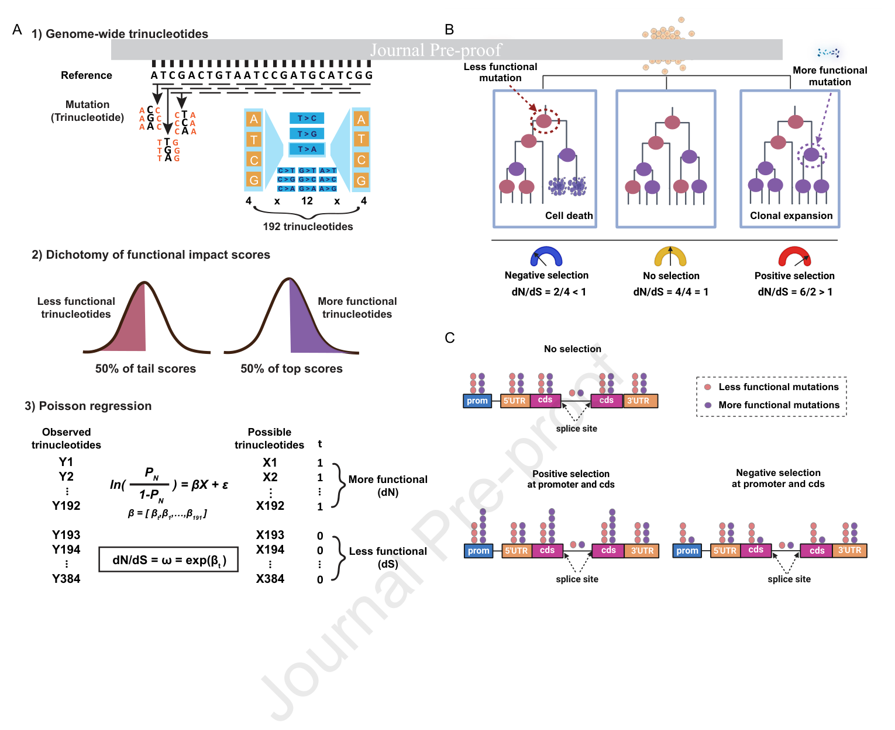
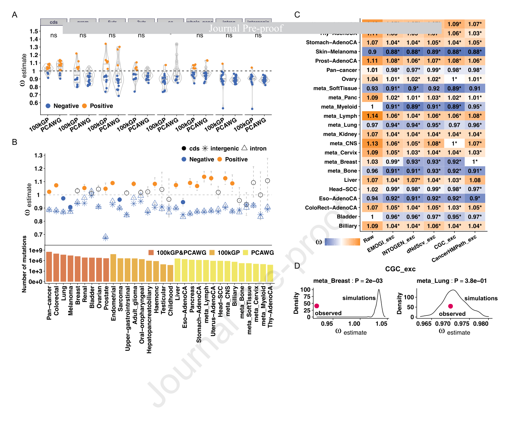
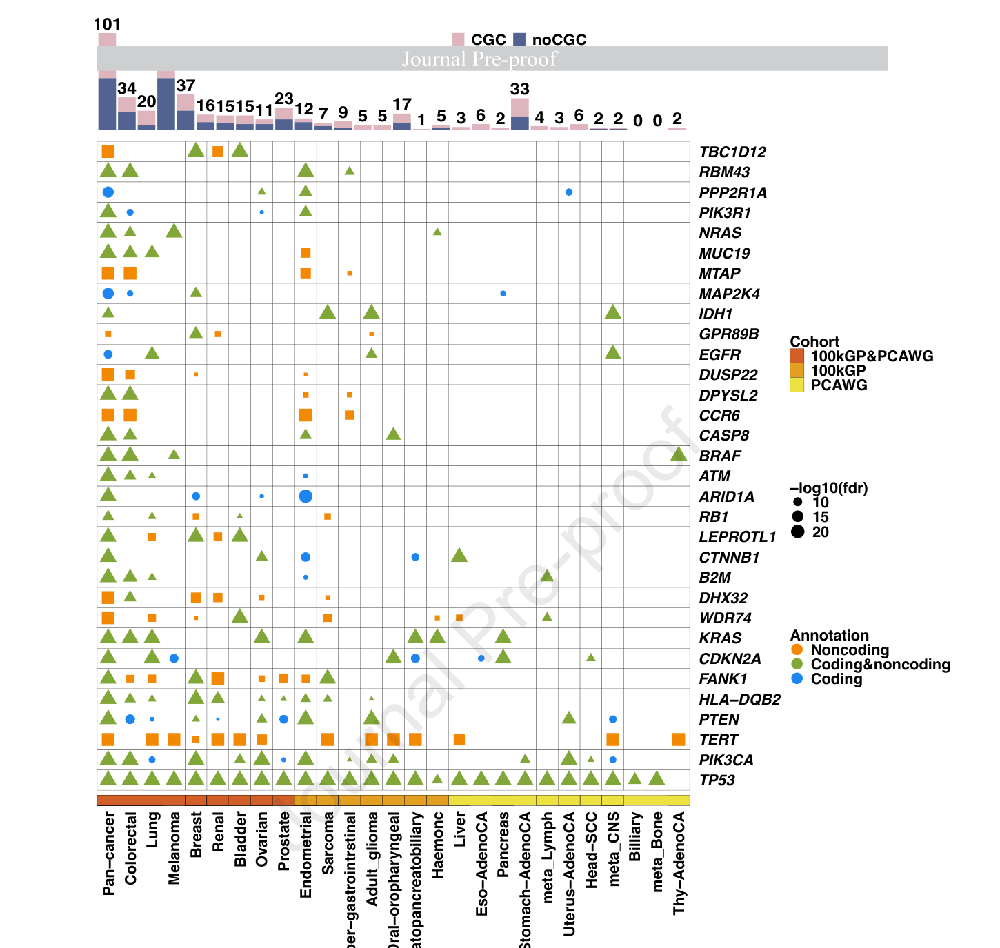
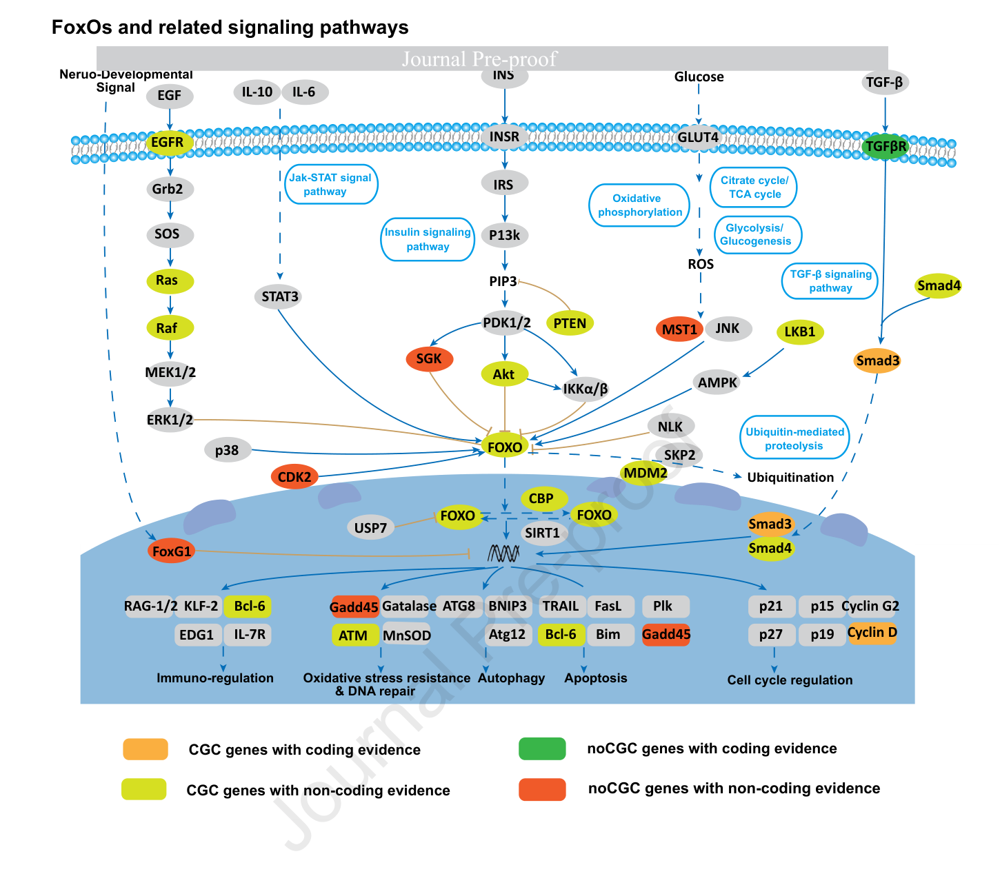
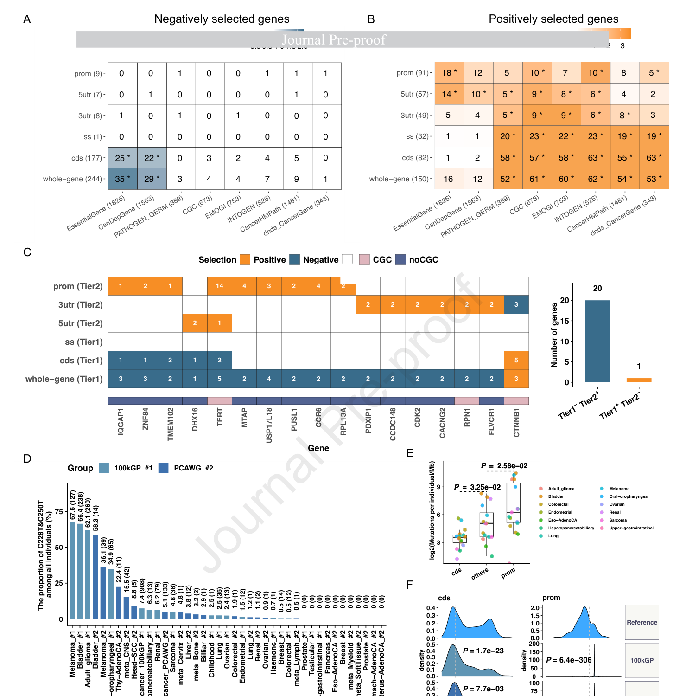

# Characterizing selection signatures in coding and noncoding regions of 14,886 cancer genomes

<!-- wechat-style-reviewed: 2026-08-26 -->

做肿瘤全基因组分析时，一个很实际的难题是：编码区之外出现了大量体细胞突变，但研究者很难判断哪些改变真正帮助了肿瘤克隆扩张，哪些只是随细胞分裂积累的乘客。

经典 dN/dS 可以用非同义突变与同义突变的比例衡量编码区选择压力，却没有一个天然的“非编码同义位点”可作参照。现有非编码驱动工具多从背景突变率中寻找正选择信号，也较难在同一框架下量化负选择。

这篇论文把全基因组功能影响分数接入 dN/dS 框架，提出 dNdS-Fun，并分析 100kGP 与 PCAWG 中 14,886 名患者、31 个癌种的全基因组数据。

作者最终报告 175 个高置信正选择基因，其中 69 个此前未被列为癌症驱动基因；30 个此前未报告的候选仅靠非编码突变被识别。与此同时，225 个基因呈负选择信号。真正需要注意的是：这里的非编码 `ω` 是高、低功能分数组之间的相对约束指标，并不是直接测得的选择系数。

## 01｜为什么非编码驱动突变一直难找

编码区的优势在于有“非同义—同义”这组可比较事件。同义位点常被近似为中性参照，非同义突变相对富集时，`dN/dS > 1` 可提示正选择；相对缺失时，`dN/dS < 1` 可提示负选择。

非编码区没有同义突变这个天然参照，而且局部突变率会随三核苷酸背景、复制时序、染色质状态和测序可比对性变化。一个位点反复突变，既可能是调控驱动，也可能只是局部更容易突变。

dNdS-Fun 的核心问题因此不是“哪里突变多”，而是：在校正突变机会和三核苷酸背景后，预测功能影响较高的突变，是否相对预测影响较低的突变出现过多或过少。

## 02｜这项研究到底用了多大规模的数据

主分析合并两个 WGS 队列：100kGP 包含 12,303 名患者、17 个癌种；PCAWG 包含 2,583 名患者、22 个癌种。两者合计 14,886 名患者，合并癌种分类后覆盖 31 个癌种。

作者还用 TCGA 的 8,947 个肿瘤 WES 样本、17 个癌种验证编码区结果。TCGA 不属于 14,886 例 WGS 主队列，而是用来检验 dNdS-Fun 与经典 dNdScv 在不同测序平台上是否给出相近估计。

分析覆盖 CDS、剪接位点、启动子、5′UTR、3′UTR、全基因区域、内含子和基因间区八类注释。局部分析少于 5 个体细胞突变的基因或元件被排除，显著性以多重校正后的 `FDR < 0.05` 判定。

## 03｜dNdS-Fun 怎样把功能分数变成选择信号

作者先枚举参考基因组上每个位点的三种可能碱基替换，再按 CADD 等全基因组功能影响分数把所有可能突变二分为“功能影响较高”和“功能影响较低”两组，默认以分数中位数作 5:5 切分。

全局分析把观察到的高、低功能突变数分别除以两类位点的可发生突变数，再计算二者之比 `ω`。模型同时用 192 种有链方向的三核苷酸替换参数校正背景突变率：`ω > 1` 表示高影响突变相对富集，`ω < 1` 表示相对缺失。

局部基因或元件的突变率差异更大，因此作者用 Gamma–Poisson 复合形成的负二项模型处理过度离散，并以似然比检验比较 `ω = 1` 与 `ω ≠ 1`。

这张图最值得看的是参照系如何改变：dNdS-Fun 没有把低分突变称为真正中性，而是把它当作较低功能影响的实用代理。

简明图注：Fig. 1A 展示“枚举 192 种三核苷酸替换—按功能分数二分—Poisson 回归”的三步流程；B 用克隆扩张或消失解释 `ω` 的方向；C 说明同一基因的编码区与调控区可以承受不同选择压力。该图是方法示意，不是独立生物学验证。

## 04｜这个模型真的比现有工具更可靠吗

在编码区，使用 CADD 的 dNdS-Fun 与 dNdScv 最一致。100kGP WGS 与 TCGA WES 的匹配癌种 `ω` 相关系数为 `r = 0.68`、`P = 3.7 × 10^-4`；PCAWG WGS 与 TCGA WES 为 `r = 0.53`、`P = 2.4 × 10^-3`。

中性模拟中，全局 `ω` 围绕 1 分布；加入不同强度选择后，估计值偏离 1 的程度随设定的受选择突变比例改变。局部检验的 QQ 图也未显示系统性膨胀。

在接近 PCAWG 的平均驱动突变频率、总突变数约 500 万或更多的模拟场景中，作者称 dNdS-Fun 的 precision 和 recall 同时高于 DIGDriver、DriverPower 与 LARVA。真实数据没有可靠的非编码金标准，因此作者改用两个队列候选集合的 Jaccard 重叠作相对比较：全癌种为 18.7%（94/503），限制到重叠癌种后为 20.5%（70/342）；受队列规模限制，理论上限也只有约 27%（94/342）。这些数字能评估跨队列一致性，却不能当作绝对准确率。

真实编码区 benchmark 也需要加一道限定。OncodriveFML 经 Bonferroni 校正后没有检出显著候选，因而未进入后续比较；dNdS-Fun 在全癌种中给出最高 precision 和 F1-score，但排除高突变癌种后，DIGDriver、DriverPower 的 precision 与它趋同，在 PCAWG 尤其明显。所谓“更可靠”并不是所有突变负荷下都保持同样优势。

更有说服力的是复现结果：PCAWG 识别的 94 个基因中，70 个在 100kGP 经 Bonferroni 校正后复现，复现率为 74.5%；限制到相同癌种后，各癌种复现率为 60%–100%，平均 87.08%。

相对五组既往非编码驱动候选，本文分别重现 80%（8/10）、71%（58/82）、67%（28/42）、69%（20/49）和 55%（130/238）。这些比例的分母是各研究已经报告的候选集，而且部分研究与本文共享 PCAWG 等数据；它们衡量的是候选重叠，不能替代完全独立的灵敏度或特异度验证。

## 05｜14,886 个癌症基因组呈现了怎样的选择图谱

非编码区整体更偏向负选择。内含子 `ω` 从前列腺癌的 0.67 到膀胱癌的 0.99，跨癌种均值为 0.90；基因间区从 0.68 到 1.03，均值为 0.89。分癌种、分区域并非每个估计都低于 1，因此更稳妥的表述是“总体相对缺失”，而不是所有非编码突变都受到清除。

排除已知驱动基因突变后，多数癌种的编码区 `ω` 进一步降到 1 以下。这说明少量强正选择驱动可以遮盖背景中的负选择信号。排除高突变负荷癌种、低可比对位点，并按三核苷酸、复制时序、染色质状态或逐癌种留一法分层后，总体方向仍保持。这里是全局负选择的敏感性分析，不沿用方法 benchmark 中“三类癌种、平均每人超过 35,000 个突变”的定义；两者口径见技术附录。

简明图注：Fig. 2A 比较 100kGP 与 PCAWG 八类注释的 `ω` 分布；B 给出各癌种 CDS、内含子和基因间区估计及突变量；C–D 比较排除已知驱动突变前后，并以 500 次随机排除作参照。图中的 `ω` 是相对功能约束，不应直接解释为细胞适应度效应大小。

## 06｜哪些非编码候选最值得关注

局部分析在 503 个基因中找到 1,271 个受正选择的编码或近端调控元件。作者进一步把“在多个癌种重复出现”或“同时获 100kGP 与 PCAWG 支持”的 175 个基因定义为高置信候选，其中包括 TP53、PIK3CA、PTEN、CDKN2A 和 KRAS。

175 个基因中有 69 个此前未被 CGC、IntOGen、既往 dNdScv、PCAWG 或 100kGP 研究列为驱动。详细 Results 报告 30 个此前未报告的候选仅由非编码证据识别，包括 CDK2、ZC3H12D、RUBCN、G2E3、ING4、DNAI3、CCNA1 和 IQGAP1。

这里的“仅由非编码证据识别”是作者的分类标签：启动子、UTR 和剪接位点都被归入 `Noncoding`。但同一论文又把可能改变蛋白序列的剪接位点列为 Tier 1，把启动子和 UTR 列为 Tier 2；缺失的 Table S1 使本文无法把 30 个候选进一步拆成“纯调控区域”与“依赖剪接位点”。因此不能把这 30 个基因一概解释为只受调控性非编码突变驱动。

候选在基因组上也不是均匀散开。作者找到 9 个非编码独有热点，其中 7 个包含 CGC 基因；另有 12 个编码与非编码共同支持的热点，其中 9 个包含 CGC 基因；7 个编码独有热点则全部包含 CGC 基因。

简明图注：Fig. 3 按癌种展示在多个癌种中被 dNdS-Fun 识别的基因；点形和颜色区分编码、非编码或两类证据，点大小对应 FDR 强度，顶部柱图显示各癌种候选数及 CGC 占比。重复出现提高优先级，但不等于完成了功能验证。

作者还识别了 120 个在至少两个癌种或两个队列中受正选择的内含子/基因间元件。EpiMap 与单细胞 ATAC 的 ABC 调控图谱为其中 64 个注释到靶基因，50 个具有组织特异性；这些元件关联 25 个 CGC 基因、36 个转录因子和 10 个激酶。

不过，表达验证很弱。只有 PMM1 启动子和 MRPS33 5′UTR 的突变状态与表达差异在多重校正后显著；每个癌种同时具有 PCAWG 突变和 TCGA 表达的样本最多 51 例，多数元件的突变样本不足 6 例。

503 个候选共富集 168 个 GO 条目和 132 条 KEGG 通路，`FDR < 0.05`。FoxO 是第二显著的通路，校正后 `P = 4.60 × 10^-15`；20 个受正选择基因中有 14 个已在 CGC，另有 6 个此前未报告。这个富集说明新旧候选聚在已知癌症过程上，但不能证明每个候选都通过 FoxO 通路驱动肿瘤。

简明图注：Fig. 4 用四种颜色区分 CGC/非 CGC 基因及编码/非编码证据，显示新候选与既有癌症基因共同落在细胞周期、氧化应激、凋亡和生长信号网络。该图是通路映射，不是蛋白或细胞实验。

免疫球蛋白位点是另一类特殊结果。作者在淋巴瘤中识别到 20 个受正选择的 Ig 基因，分布于染色体 2 的 IGK、染色体 14 的 IGH 和染色体 22 的 IGL 位点；补充分析用于排查 BCR 重排和体细胞高突变造成的 CADD 错配。它更可能反映淋巴瘤特异的免疫受体演化，不能直接外推到其他实体瘤。

## 07｜负选择如何改写我们对 TERT 的理解

作者识别到 225 个负选择基因。Results 称它们相对 5,000 组按基因数和长度匹配的随机基因集，更富集于必需基因和癌症依赖基因；但 Methods 只写从 20,185 个蛋白编码基因中等量抽样，Fig. 5 图注又写 Fisher’s exact test，精确检验流程存在冲突。其 LOEUF 中位数低于全部蛋白编码基因背景，0.832 对 0.936，Wilcoxon `P < 2.22 × 10^-16`。

增强子约束也给出相同方向：负选择基因的 Gnocchi 分数为 2.864，而 LOEUF 定义的非约束基因为 2.271，`P = 0.0035`。这些结果支持“肿瘤仍需保留一批核心功能”，但基因集富集和群体约束分数都不是肿瘤细胞中的直接扰动证据。

16 个基因呈现“全基因负选择、非编码元件正选择”的双向模式。TERT 最典型：启动子在 15 个癌种受正选择，编码区在 5 个癌种受负选择；C228T 与 C250T 热点涉及 1,041 名患者。换句话说，肿瘤可能偏好提高 TERT 调控活性，却不耐受破坏其蛋白功能的编码改变。

简明图注：Fig. 5A–B 比较正、负选择基因与已知驱动、必需和癌症依赖基因集的重叠；C 展示 Tier 1 编码/剪接区与 Tier 2 调控区方向相反的基因；D–F 展示 TERT 启动子热点、区域标准化突变负荷和 CADD 分布。TERT 结果支持区域依赖的选择模式，不等于证明每个非编码候选的分子机制。

## 08｜这项工作真正改变了什么

第一，它把正选择与负选择放进同一个全基因组框架。对癌症基因组研究而言，结果不再只是一张“哪里突变更多”的候选表，而是可以比较不同功能区域中高影响突变的相对富集或缺失。

第二，它给非编码候选排序提供了可复现的统计入口。跨癌种、跨队列、调控图谱和已知通路可以逐层缩小功能实验范围。近期最现实的用途是生成候选和设计验证实验，而不是直接改变患者用药。

第三，负选择候选可能补充依赖性图谱。论文提到 21 个高置信候选属于 OncoKB 所列 80 个 FDA 认可可行动基因，但“基因可行动”不等于本文发现的非编码位点已经可用药；从选择信号到靶点仍需等位基因特异的功能实验、药理验证和临床证据。

## 09｜这些结果仍需要冷静看待

最重要的边界来自模型本身。低功能分数组并非严格中性，CADD 等分数也只是统计预测。因此 `ω < 1` 更准确地表示高分突变相对缺失，不能直接量化负选择系数，更不能单凭它断言某个突变会让细胞死亡。

二分连续分数提高了稳定性，却会丢失细粒度信息并引入阈值依赖。模型也不能可靠用于单个患者，因为个体突变数不足以支持局部统计检验。

不同癌种样本量不均衡，胆道、宫颈、骨、甲状腺和头颈鳞癌的检出能力尤其有限。数据又主要来自欧洲祖源患者，跨祖源可迁移性尚未验证。

非编码候选缺少统一金标准，跨队列 Jaccard 只能用于方法相对排序。调控元件到靶基因主要依赖 EpiMap、ABC、染色质状态和 Hi-C 推断，表达验证样本少，不能把所有链接视为因果调控。

局部分析的癌种范围也没有闭合。Results 和 Fig. 3 以 31 个癌种及泛癌为口径，图中包含结直肠癌；Methods 却说因为 100kGP 缺少 MSI 状态，局部分析排除了结直肠癌。缺失的补充表使本文无法判断排除发生在哪个队列、哪一层筛选或哪一版结果，不能把 Fig. 3 简单视为“31 个癌种全部使用同一纳入规则”。

原文还存在需要保留的数字冲突。详细 Results 报告 18 个已知驱动和 30 个新候选“仅由非编码证据识别”，合计应为 48；`48/175 = 27.4%`。Discussion 却同时写 `27.4%`、`50/175` 和 `20 + 30`，而 `50/175` 实际为 28.6%。引言摘要又只强调 30/175。本文主叙事因此分别报告“30 个此前未报告的非编码独有候选”和“18 个已知驱动”，不把 48 或 50 当作无争议总数。

## 10｜对我们的研究有什么可借鉴

如果把 dNdS-Fun 迁移到胃癌或癌前病变队列，首先要保证全基因组样本量和突变数足够。低突变负荷、样本规模较小的癌前组织不适合直接照搬 31 癌种分析，应先用模拟确定检出能力。

候选优先级可以按“跨队列复现—组织匹配调控注释—表达或染色质效应—等位基因扰动”四层推进。只有最后一层能够回答某个非编码突变是否真正改变靶基因和细胞表型。

负选择分析则适合与 CRISPR 依赖性、合成致死和药物敏感性数据交叉。需要预先区分群体层面的相对约束、细胞系中的基因依赖和患者中的治疗反应，避免把三个层级写成同一个结论。

---

## 技术附录

### 论文基本信息

- 期刊：Journal of Genetics and Genomics，Journal Pre-proof
- 年份：2026；修订日期 2026-06-12，接收日期 2026-06-14
- DOI：10.1016/j.jgg.2026.06.008
- 作者：Mengyue Zheng、Xiwei Sun、Junren Hou、Minmin Guo、Xinran Liu、Wen Yang、Jian Yang
- 通讯作者：Jian Yang
- 研究领域：癌症基因组学、非编码驱动突变、正负选择、统计遗传学
- 关键词：noncoding somatic mutations、driver genes、negative selection、cancer genomics、functional impact scores
- 数据来源：Genomics England 100kGP、PCAWG、TCGA MC3；外部功能资源见下文
- 代码来源：`https://github.com/jianyanglab/dNdS-Fun`
- 在线分析与结果门户：`https://yanglab.westlake.edu.cn/dNdS-Fun`
- Zenodo：10.5281/zenodo.20250564；原文同时写明自定义分析代码将在正式发表时提供
- 本地 PDF：`pdfs/processed/cancer-genome-selection-signatures-dnds-fun-jgg-2026.pdf`
- 本地 PDF SHA-256：`94b72014f827a18dbd72f0c39c8129484f69c8eb1309732260c5b61c915ae767`

### PDF 解析质量

- 文字抽取：使用 `scripts/build_pdf_llm_pack.py`，引擎为 PyMuPDF。
- 覆盖：73 页，1,141 个句子 ID；全文 ID 已逐项检查。手工重分段后，主 Results 为 `P005.S0001–P014.S0026`，225/225 个 ID；Methods 为 `P018.S0009–P026.S0022`，148/148 个 ID。
- 自动分节误差：manifest 只标出 16 个 `results` 句子，却把 Results 第 6–14 页大部分内容误标为 `methods`；又把参考文献、主图和补图共 649 个句子统标为 `references`。覆盖审计按页码和原文标题手工校正，未按自动标签计数。
- 阅读顺序：双栏正文总体可读，但页眉、行号、公式和跨栏标题偶有插入；`P019–P020` 的公式被拆成多个句子，必须结合上下文解释。
- 图表：Fig. 1–5 图像完整；原文完整图注位于 `P036.S0001–P037.S0014`。图内文字抽取在 `P038–P042` 低置信，本文依据图像与图注人工核对。
- 补充材料：PDF 内含 Supplementary Fig. S1–S30 及图注，但未嵌入 Supplementary Tables S1–S11、样本级表格或 Supplementary Data。正文依赖这些表的候选清单和样本明细无法逐项复核。
- 明确抽取错误：`P002.S0010` 把摘要原图中的 “30” 识别为 “20”；已用 PDF 页面图像核对为 30。参考文献页的双栏顺序也明显错乱，但不影响正文证据范围。
- 版本边界：该 PDF 是接受后、正式排版前的 Journal Pre-proof，出版流程仍可能更正数字或文字。

### 主图与完整图注

| 原文图表 | 完整 panel 注释 | 样本、比较与统计 | 图像文件 | 正文位置 |
|---|---|---|---|---|
| Fig. 1 | A：从肿瘤体细胞突变和参考基因组枚举三核苷酸机会，按中间碱基替换的功能分数分为高、低功能组，再以 Poisson 回归比较观察/可能突变比。B：示意负、中性和正选择下克隆的消失、维持和扩张；浅红实心圆表示携带较低功能影响突变的细胞，浅紫实心圆表示携带较高功能影响突变的细胞。C：示意同一基因的启动子、CDS、剪接位点和 UTR 可承受不同方向选择。 | 方法示意，无患者比较或显著性检验。 | `fig1-dnds-fun-workflow.png` | [03｜dNdS-Fun 怎样把功能分数变成选择信号](#03｜dnds-fun-怎样把功能分数变成选择信号) |
| Fig. 2 | A：100kGP 与 PCAWG 在八类功能注释中的 `ω` 分布。B：各癌种 CDS、内含子和基因间区 `ω`、95% CI 及突变总数。C：排除已知驱动基因突变前后的 `ω`。D：乳腺癌与肺癌的观察值相对 500 次随机排除的密度分布。 | A 用 Student’s t-test 比较队列均值并作 FDR；C–D 以 500 次等量随机排除作经验检验，FDR < 0.05 标星。 | `fig2-global-selection.png` | [05｜14,886 个癌症基因组呈现了怎样的选择图谱](#05｜14886-个癌症基因组呈现了怎样的选择图谱) |
| Fig. 3 | 展示在超过 4 个癌种中受正选择的基因；顶部柱图为各癌种基因数及 CGC 占比；点的形状和颜色共同区分非编码、编码与两类兼有的证据，点大小为 `-log10(FDR)`；底部 cohort 色带区分 100kGP、PCAWG 或两队列共同支持。 | Results/图面以 31 个癌种及 pan-cancer、`FDR < 0.05` 为口径；Methods 又称局部分析排除结直肠癌，实际范围不明。 | `fig3-positive-genes.png` | [06｜哪些非编码候选最值得关注](#06｜哪些非编码候选最值得关注) |
| Fig. 4 | FoxO 及相关信号网络；橙色为有编码证据的 CGC，黄绿色为有非编码证据的 CGC，深绿为有编码证据的非 CGC，红色为有非编码证据的非 CGC；后三类突出此前未报告的选择证据。 | 通路富集基于 503 个候选；FoxO 通路校正后 `P = 4.60 × 10^-15`。 | `fig4-foxo-pathway.png` | [06｜哪些非编码候选最值得关注](#06｜哪些非编码候选最值得关注) |
| Fig. 5 | A–B：负、正选择基因与癌症驱动、依赖和必需基因集的重叠。C：Tier 1（CDS、剪接、全基因）与 Tier 2（启动子、UTR）方向相反的基因及涉及癌种数。D：各癌种 TERT C228T/C250T 热点比例和人数。E：按样本数和区域长度标准化的 TERT 各区域突变负荷。F：参考基因组、100kGP 和 PCAWG 中 TERT CDS/启动子 CADD 分布。 | 图注称 A–B 用 Fisher’s exact test 并作 FDR；Results 称 5,000 组按数量和长度匹配，Methods 仅写从 20,185 个基因中等量重采样。E 用 Student’s t-test；F 给出分布检验 P 值。 | `fig5-negative-selection-tert.png` | [07｜负选择如何改写我们对 TERT 的理解](#07｜负选择如何改写我们对-tert-的理解) |

主图完整图注来源：`P036.S0001–P037.S0014`。正文简图注仅保留理解结论所需内容；panel、统计方法和边界在上表完整保留。

### Results 证据覆盖审计

| 原文句子 ID | 忠实中文含义 | 正文对应位置 | 证据边界 |
|---|---|---|---|
| `P005.S0001–P007.S0002` | 解释 dNdS-Fun 的高/低功能分组、`ω`、八类注释、CADD 选择、阈值与中性/选择模拟。 | [03](#03｜dnds-fun-怎样把功能分数变成选择信号)、[04](#04｜这个模型真的比现有工具更可靠吗) | 低分组是相对参照，不是严格中性；模拟次数在正文、Methods 和补图间不完全一致。 |
| `P007.S0003–P009.S0002` | 与 DIGDriver、DriverPower、OncodriveFML、LARVA 的模拟和真实数据比较；OncodriveFML 经 Bonferroni 校正后无显著候选，排除高突变癌后 DIGDriver/DriverPower precision 与 dNdS-Fun 趋同；非编码 Jaccard 为 18.7%（94/503）或重叠癌种 20.5%（70/342）。 | [04](#04｜这个模型真的比现有工具更可靠吗) | 非编码无金标准；Jaccard 只用于相对一致性排序，优势随突变负荷和校正方式改变。 |
| `P009.S0003–P010.S0012` | 14,886 例、31 癌种的全局选择；跨队列/平台一致性；非编码总体负选择及敏感性分析。 | [05](#05｜14886-个癌症基因组呈现了怎样的选择图谱) | 分癌种、分区域并非全部 `ω < 1`；功能分数不能直接给出选择系数。 |
| `P010.S0013–P011.S0005` | 1,271 个元件、503 个基因、175 个高置信候选、69 个新候选；9 个非编码独有、12 个编码与非编码共同、7 个编码独有热点。 | [06](#06｜哪些非编码候选最值得关注) | 候选来自统计选择信号；热点窗口与筛选层级仍需代码复核。 |
| `P011.S0006–P012.S0008` | PCAWG 的 94 个候选有 70 个在 100kGP 复现；五组既往候选分别重现 8/10、58/82、28/42、20/49、130/238；另覆盖功能分数敏感性、168 个 GO 与 132 条 KEGG 通路及 FoxO 示例。 | [04](#04｜这个模型真的比现有工具更可靠吗)、[06](#06｜哪些非编码候选最值得关注) | 重叠队列与候选集合复现提高可信度，但不是独立的灵敏度/特异度验证；通路富集也不等于机制验证。 |
| `P012.S0009–P013.S0007` | 120 个内含子/基因间元件的调控注释、BTG2 示例和有限表达验证。 | [06](#06｜哪些非编码候选最值得关注) | 靶基因多为图谱推断；表达分析最多 51 例且多数突变组不足 6 例。 |
| `P013.S0008–P013.S0015` | 淋巴瘤中 20 个受正选择 Ig 基因，分布于 chr2 IGK、chr14 IGH 和 chr22 IGL。 | [06](#06｜哪些非编码候选最值得关注) | BCR 重排和体细胞高突变是特殊混杂；不能外推到全部癌种。 |
| `P013.S0016–P014.S0026` | 225 个负选择基因、必需/依赖基因富集、LOEUF/Gnocchi 约束、16 个双向选择基因及 TERT。 | [07](#07｜负选择如何改写我们对-tert-的理解) | 富集与约束是间接支持；Fig. 5 的富集检验描述与 Methods 不一致。 |

审计结论：上述区间连续覆盖主 Results 的 225/225 个句子 ID；未覆盖 ID：无。Results 标题虽在 manifest 中被错误延续为 `methods`，但原文页码、行号和段落顺序完整。

### Methods 与复现信息

#### 研究对象与数据结构

- 100kGP：12,303 名患者、17 个癌种，全部分析在 Genomics England Research Environment 内完成，结果经 Airlock 审批导出。
- PCAWG：2,583 名患者、22 个癌种，使用 consensus somatic mutation calls。
- TCGA：8,947 个肿瘤、17 个癌种，使用 MC3 calls；只用于编码区方法评估。
- 作者按组织来源汇总体细胞突变以增加检出能力，并非合并患者样本记录；主分析纳入全部 100kGP 与 PCAWG 样本，达到 `FDR < 0.05` 的结果保留（`P022.S0014–P022.S0015`）。
- 100kGP 与 PCAWG 的 8 个重叠癌种为黑色素瘤、乳腺癌、膀胱癌、结直肠癌、前列腺癌、肾癌、肺癌和卵巢癌（`P023.S0010`）。方法比较把结直肠癌、黑色素瘤和子宫内膜癌定义为高突变癌种，门槛是该癌种平均每人超过 35,000 个体细胞突变（`P023.S0011`）；这是癌种级定义，不是逐样本阈值。
- 全局负选择的 Fig. S11 敏感性分析使用另一套 top-4：按癌种总突变数为结直肠癌、黑色素瘤、`meta_Lung`、食管腺癌，按人均突变数为黑色素瘤、结直肠癌、肝癌、`meta_Lung`（`P054.S0004–P054.S0008`）。这套口径不能与上面的 benchmark 三癌种定义互换。
- PDF 未包含 Table S11，因此无法审计癌种级样本数、样本 QC、测序深度和变异过滤明细。

#### 全局与局部模型

- 对参考基因组每个位点枚举三种可能替换，直接读取 CADD 等分数，默认按全体分数中位数二分。
- 全局 `ω = (n/N) / (s/S)`；`n/s` 是观察到的高/低功能突变数，`N/S` 是两组可能突变位点数。
- 192 个有链方向的三核苷酸参数进入 Poisson 回归；参数以最大似然估计。
- 低功能组按 `n_i,l ~ Poisson(d × r_i × S_i,l)` 建模；高功能组加入选择参数，`n_i,h ~ Poisson(d × r_i × S_i,h × ω)`。
- 局部模型用负二项回归处理基因/元件间突变率异质性，以长度、序列组成和三核苷酸暴露作 offset；Gamma 分布描述局部标准化突变率。
- 局部 Gamma 参数写为 `α_j = θ_j`、`β_j = θ_j / μ_j`；论文给出的 R 骨架是 `glm.nb(obs_s ~ offset(log(exp_s)) + covariate_matrix)`，但没有展开 `covariate_matrix` 的列，也没有说明 Gamma 的 rate/scale 参数化。
- 局部检验以 LRT 比较 `H0: ω = 1` 与 `H1: ω ≠ 1`，P 值来自 1 个自由度的卡方分布。

#### 注释、模拟和阈值

- GENCODE v49 与 PCAWG 注释定义 8 类区域：CDS 17,873、剪接位点 16,906、启动子 17,529、5′UTR 17,061、3′UTR 16,831、全基因 18,019、内含子 278,674、基因间元件 30,734。
- 作者在候选标签中把启动子、UTR 和剪接位点合并为 `Noncoding`（`P024.S0018`），但 Tier 定义又把剪接位点与 CDS、全基因归入可能改变蛋白序列的 Tier 1，而启动子和 UTR 属于 Tier 2（`P014.S0015–P014.S0017`）。缺失 Table S1 时不能把 `Noncoding` 标签等同于“纯调控非编码”。
- 模拟突变量从 1,000 到 10,000,000；选择模型改变 5%–30% 高功能突变，或将其加倍/降为零。
- 基因层模拟从 COSMIC CMC 抽取非同义驱动突变；中性局部随机化把真实突变移到 50 kb 内、三核苷酸相同的位置。
- 正文和 Methods 称多数情景重复 300 次；Supplementary Fig. S3B 与 S4 分别写 50 次，复现时应按具体图而非统一的“300 次”处理。
- 比较的功能分数为 CADD、DANN、Eigen 和 FATHMM；默认使用 CADD 与 5:5。正文把其余比例写为 4:6、3:7、2:8，补图按“低:高”写成 6:4、7:3、8:2，并在 S23 增加 9:1。
- dNdScv 使用默认参数，不加入表观遗传协变量，也不排除任何基因集。

#### 统计检验和多重校正

- 单次检验阈值 `P < 0.05`；多重检验用 Bonferroni 或 Benjamini–Hochberg FDR。
- 方法比较的 Bonferroni 阈值分别为：模拟 `0.05 / 18,956` 个 CDS；100kGP `0.05 /（该类元件数 × 18）`；PCAWG `0.05 /（该类元件数 × 23）`。这些分母与正文的 CDS 17,873、队列 17/22 癌种并不一致。
- 全局队列均值比较用双侧 Student’s t-test；平台/队列相关一般用 Pearson。
- 排除已知驱动后的差异用 500 次重采样，经验 `P = (1 + 极端次数) / 501`。
- 基因集富集 Methods 写为从 20,185 个蛋白编码基因中等量抽样，经验 `P = (1 + 极端次数) / 5001`，再作 BH-FDR。
- GO/KEGG 用 R 包 ClusterProfiler 和双侧超几何检验，`FDR < 0.05`。
- 热点在预定义窗口（原文举例为 1 Mb）中用 Poisson 回归比较基因组背景，并作 BH 校正。
- 无需随机化或盲法；数据通常以均值 ± s.e.m. 表示。
- Westlake University Ethics Committee 批准号为 `20200722YJ001`（`P026.S0002–P026.S0005`）；原文没有说明该审批分别覆盖哪些受控二次数据使用环节。

#### 数据、软件与迁移注意点

- 公开数据：PCAWG、TCGA MC3、GRCh37、GENCODE v49、CADD v1.6、DANN、Eigen、FATHMM；100kGP 需在受控环境访问。
- 调控注释：EpiMap、单细胞 ATAC 的 ABC 模型、Roadmap 111 个参考表观基因组、Hi-C loops。
- 候选对照：CGC、EMOGI、IntOGen、dNdScv cancer genes、PATHOGEN_GERM、EssentialGene、CanDepGene、CancerHMPath、OncoKB。
- 原文未报告 dNdS-Fun 的 commit/tag、运行环境和多数依赖版本；迁移时应固定代码版本、参考基因组、功能分数版本、注释版本和二分方向。

### Methods 证据覆盖审计

| 原文句子 ID | 忠实中文含义 | 方法学解释 | 复现注意点 |
|---|---|---|---|
| `P018.S0009–P019.S0007` | 全局 dNdS-Fun、分数二分、`ω`、192 三核苷酸 Poisson 模型。 | 用突变机会归一化高、低功能突变比。 | 公式被版面拆分；需按原文变量定义重建。 |
| `P019.S0008–P020.S0012` | 局部 Gamma–Poisson/负二项模型、offset、LRT。 | 控制基因/元件间过度离散和暴露差异。 | `glm.nb` 代码只是模型骨架，协变量矩阵未在 PDF 展开。 |
| `P021.S0001–P021.S0012` | 四类功能分数、四种阈值、dNdScv 默认设置和八类注释。 | 用编码区 dNdScv 作方法锚点。 | CDS 元件数在注释段与 Bonferroni 分母不一致。 |
| `P021.S0013–P022.S0008` | 中性/选择模拟、CMC 驱动抽样和 50 kb 局部随机化。 | 同时检验全局校准、局部 I 型错误和检出能力。 | 统一写“300 次”与补图 50 次冲突。 |
| `P022.S0009–P022.S0017` | 100kGP、PCAWG、TCGA 获取、合并和纳入规则。 | 100kGP/PCAWG 是主 WGS，TCGA 是 WES 评估。 | 样本级 QC 与 Table S11 缺失。 |
| `P022.S0018–P023.S0012` | 五种方法比较、Bonferroni 阈值、precision/recall、Jaccard、8 个重叠癌种及高突变癌定义。 | 编码区有 CGC 金标准，非编码区用跨队列重叠；高突变门槛按癌种平均每人 >35,000 个突变。 | 分母写 18/23 亚型，可能把 pan-cancer 计入但未明说；该门槛不是逐样本筛选。 |
| `P023.S0013–P024.S0012` | 已知基因集、全局跨平台比较、排除驱动和 500 次重采样。 | 检查选择方向是否由强驱动或平台差异造成。 | Pearson 与 t-test 假设需在复现时核查。 |
| `P024.S0013–P025.S0002` | 局部 `FDR < 0.05`、至少 5 个突变、作者的 Coding/Noncoding 标签、结直肠癌排除陈述、GO/KEGG 和 1 Mb 热点。 | 生成基因、元件、通路和区域热点候选。 | Methods 因 100kGP 缺 MSI 状态而称排除结直肠癌，但 Results/Fig. 3 仍以 31 癌种且含结直肠癌呈现，实际范围不明。 |
| `P025.S0003–P026.S0006` | 调控靶基因、Roadmap/Hi-C、基因集重采样、统计通则和伦理。 | 将统计候选连接到组织特异调控图谱。 | Fig. 5 caption 又称 Fisher 检验；需作者代码澄清。 |
| `P026.S0007–P026.S0022` | 数据与代码资源。 | 提供主数据库、GitHub、在线门户和 Zenodo。 | PDF 的 URL 顺序破碎；缺 commit、环境锁定和完整补表。 |

审计结论：上述区间连续覆盖主 Methods 的 148/148 个句子 ID；未覆盖 ID：无。数据/代码段的 URL 因双栏抽取错序，已按原始页面人工核对。

### 证据强度、原文冲突与不能外推的结论

**直接数据支持：**

- dNdS-Fun 在编码区与 dNdScv 跨队列/平台相关，中性模拟总体校准。
- 100kGP 与 PCAWG 的全局 `ω` 方向总体一致，非编码区平均值偏低。
- 503 个基因有局部正选择证据，其中 175 个满足作者预设的跨癌种或跨队列高置信规则。
- 225 个负选择基因在必需、癌症依赖和群体约束指标上富集。

**合理但尚未直接证明：**

- 统计候选中的每个非编码突变都是肿瘤驱动。
- 负选择基因就是可药用的合成致死靶点。
- 调控图谱推断的每个元件—靶基因关系在对应肿瘤中真实存在。
- 选择信号可以用于个体患者诊断、预后或用药。

**原文内部冲突：**

- 非编码独有基因数：详细 Results 为 18 个已知驱动 + 30 个新候选，即 48/175 = 27.4%；Discussion 同时写 20 + 30 = 50、50/175 和 27.4%，但 50/175 实为 28.6%；引言摘要只写 30/175。正式版本或作者代码需确认。
- 双向选择基因数：正文写 16 个“全基因负选择、非编码正选择”基因，Fig. 5C 柱图却显示 `Tier1−Tier2+` 为 20 个、反向为 1 个；两者可能使用不同过滤层级，不能直接互换。
- `Noncoding` 分类：`P024.S0018` 把启动子、UTR 和剪接位点合并为非编码证据，`P014.S0015–P014.S0017` 却把剪接位点列入可能改变蛋白序列的 Tier 1；缺 Table S1，30 个“非编码独有”新候选中剪接证据的贡献无法拆分。
- 局部分析范围：`P024.S0013` 称在 31 癌种及 pan-cancer 计算局部 `ω`，Fig. 3 图面含结直肠癌；`P024.S0017` 又称因 100kGP 无 MSI 状态而排除结直肠癌。原文未说明排除适用于哪个队列、分析层或结果版本。
- 膀胱癌负选择：`P009.S0010` 把膀胱癌内含子称为非编码负选择的“唯一例外”，`P009.S0015` 又报告膀胱癌基因间区 `ω = 1.03`；可能涉及显著性或区域口径差异，不能把“唯一例外”解释为所有非编码区域都低于 1。
- 既往候选复现：`P011.S0016–P011.S0021` 的五组比例本身明确，但 Sherman 与 Rheinbay 两组的文内引文编号疑似互换；本文保留原句数字，不自行重配研究名称与比例。
- 注释计数：`P021.S0012` 报 CDS 17,873，`P023.S0001` 的 Bonferroni 分母却用 18,956。
- 癌种分母：数据段为 100kGP 17 类、PCAWG 22 类；Bonferroni 公式写 18 和 23，可能额外计入 pan-cancer，但原文未说明。
- 阈值比例：正文/Methods 与 Supplementary Fig. S2/S23 的比例书写方向不同，S23 还增加 9:1。
- 模拟次数：Methods 概括为 300 次，但 S3B 和 S4 图注明确为 50 次。
- 模拟范围：Methods 给出 1,000–10,000,000 个突变，Supplementary Fig. S4 的局部中性模拟只展示 1,000–1,000,000。
- 基因集富集：Results 写 5,000 组按基因数和长度匹配；Methods 只写从 20,185 个蛋白编码基因中等量抽样，未提长度匹配；Fig. 5 图注又写 Fisher’s exact test。
- 功能类别：正文称七类并另设 whole-gene，模拟段称“七类”却只列出六类，Supplementary Fig. S3 也只展示六类。
- 高置信门槛：引言摘要写“超过两个癌种或两个队列”，详细 Results/Discussion 写“多个或至少两个癌种”，边界是 `>2` 还是 `≥2` 不够一致。
- CMC 版本：基准模拟引用 Tate 2019，Methods 模拟又引用 Sondka 2024，未给数据库 release。
- 利益冲突：正文称作者无竞争利益，同时披露 Mengyue Zheng、Xiwei Sun、Jian Yang 是 dNdS-Fun 相关中国待审专利 `202410840619.7` 的共同发明人；两项信息均应保留。

**不能从本研究外推：**

- 不能把 `ω` 当作绝对选择系数或单突变功能效应。
- 不能据此为患者选择靶向药或 PARP 抑制剂。
- 不能假定欧洲祖源结果自动适用于东亚人群或癌前病变。
- 不能把统计复现等同于细胞、动物或临床功能验证。

### 发布前检查

- [x] 一级标题为论文正式英文原题；
- [x] 开头从全基因组非编码驱动判别困境切入；
- [x] 前四段给出研究规模和核心答案；
- [x] 正文使用连续 `01｜`–`10｜` 问题式标题；
- [x] 关键结果包含样本、数字和比较对象；
- [x] 主图紧跟对应叙事，完整 panel 注释放入技术附录；
- [x] 有具体的“这些结果仍需要冷静看待”；
- [x] 1,141 个全文句子 ID 已检查，Results 225/225、Methods 148/148 完整覆盖；
- [x] 原文冲突、缺失补表和解析低置信内容已保留；
- [x] `STYLE_REVIEW_LOG.md`、分类 README 与 `SUMMARY.md` 已更新；
- [x] HonKit 构建和内部链接检查通过。
