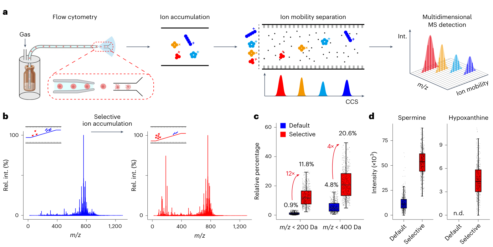
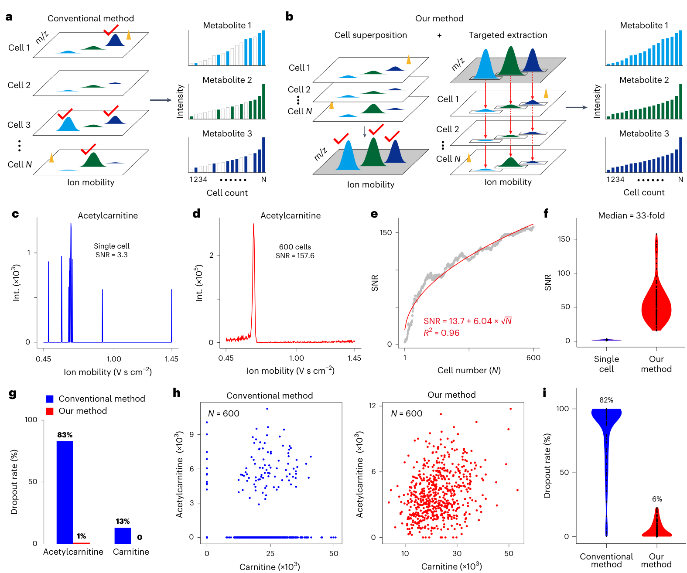
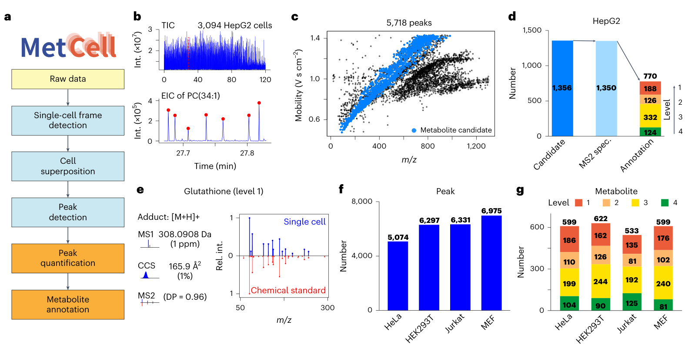
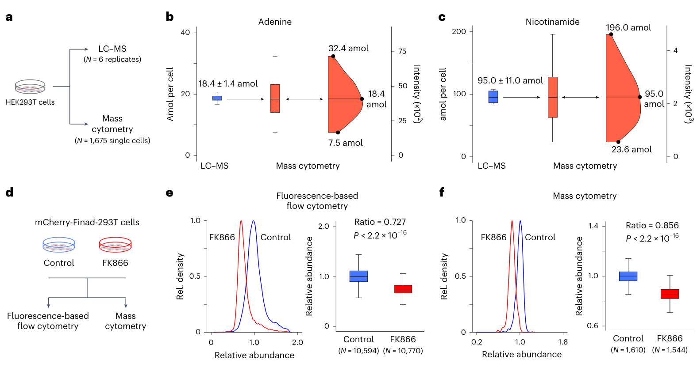
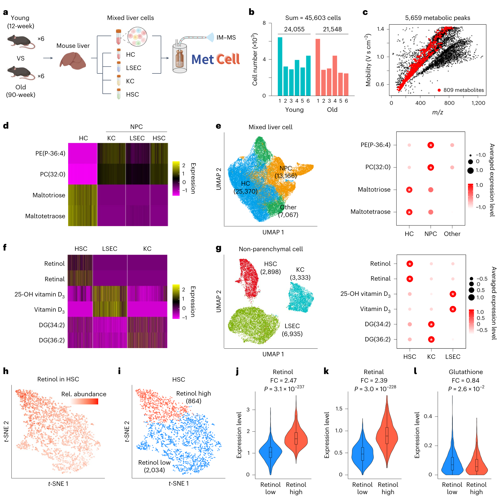
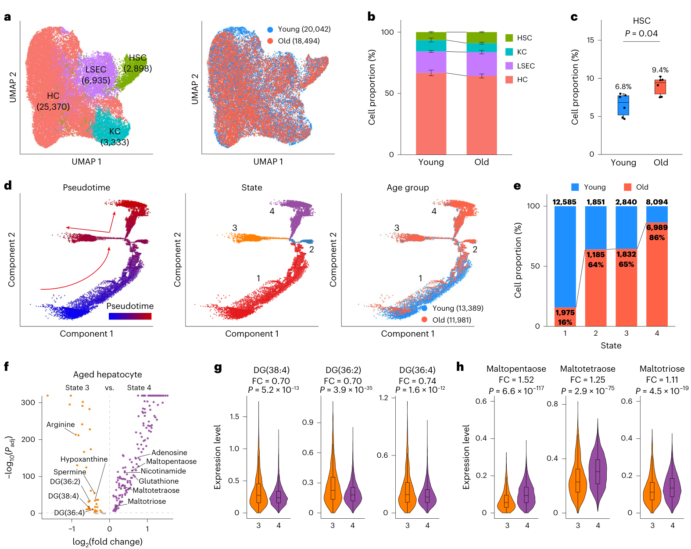

# Deep-coverage single-cell metabolomics enabled by ion mobility-resolved mass cytometry

<!-- wechat-style-reviewed: 2026-08-02 -->

一次单细胞质谱采集通常只有约 **0.1 秒**。在这段时间里，仪器既要捕捉阿摩尔（amol，10⁻¹⁸ mol）级的小分子，又要分清真实代谢物、随机噪声和同质量干扰；任何一个信号稍弱，都可能在结果里变成“这个细胞没有该代谢物”。（来源：`P002.S0002–P002.S0008`）

这不是少测几个峰的问题。既有单细胞代谢组技术通常只能检出数百种代谢物，低信噪比还会制造大量掉点，最后看到的“细胞异质性”可能同时混着生物差异与技术缺失。（来源：`P002.S0003–P002.S0009`）

真正的矛盾是：延长单细胞采集时间有助于鉴定，却会牺牲通量；维持高速采集，又难以兼顾灵敏度、覆盖度和注释可信度。作者因此追问，能否在不放弃分钟级几十个细胞通量的前提下，把单细胞代谢物测得更深、更稳，也更能说明“它究竟是什么”。

这篇论文给出的答案，是把流式进样、离子迁移—质谱、选择性离子累积和计算上的“细胞叠加”接成一条流程，再由 MetCell 把群体层面发现的可靠峰逐个提取回单细胞。平台达到每分钟 **25–40 个细胞**，在不同数据集中检出超过 5,000 个代谢峰，并把方法应用到 **45,603 个**小鼠原代肝细胞。（来源：`P002.S0010–P002.S0022`、`P002.S0023–P003.S0019`、`P005.S0051–P005.S0060`）

## 01｜为什么单细胞代谢组最容易把技术噪声误当成生物差异？

单个细胞里的常见代谢物多处于阿摩尔量级，接近质谱检测极限。信号弱时，同一种代谢物会在部分细胞中出现、在另一些细胞中消失；如果直接把“未检出”解释成“未表达”，掉点就会伪造亚群和代谢差异。（来源：`P002.S0002–P002.S0008`、`P002.S0051–P002.S0057`）

注释也受时间限制。只看质荷比（m/z）时，一个峰常对应多个候选结构；传统 mass cytometry 又通常来不及在每个细胞内获得足够的 MS2 碎片谱。作者要同时解决的，其实是三个问题：信号能否被看见、峰能否稳定复现、看见以后能否可靠命名。

## 02｜这项研究到底用了多大规模、几层验证？

方法学验证从培养细胞开始。作者在 HepG2、HEK293T、Jurkat、HeLa、MEF 等细胞中比较离子累积、信噪比、掉点、注释覆盖与漂移；绝对定量用 6 次 LC–MS 重复给出群体平均量，再与 1,675 个 HEK293T 单细胞的分布对照。NAD⁺ 验证则把荧光传感器流式结果与同一干预方向下的单细胞质谱结果比较。（来源：`P003.S0024–P004.S0021`、`P004.S0036–P005.S0050`）

生物学应用使用 12 周龄和 90 周龄雄性小鼠各 6 只，共采集 45,603 个肝细胞；另从 10 只年轻小鼠分离四类肝细胞，用于筛选代谢标志物。作者还分析了 60 周龄小鼠的 8,545 个肝细胞，并以组织染色和既有单细胞转录组数据作方向性验证。（来源：`P005.S0051–P006.S0065`、`P007.S0017–P007.S0022`、`P008.S0042–P009.S0001`）

这里要区分“细胞数”和“生物学重复数”。45,603 个细胞提高了细胞状态的分辨率，但年龄比较的独立动物仍是每组 6 只；数万个细胞不能自动把小鼠层样本量放大数千倍。

## 03｜离子迁移怎样在不拖慢单细胞采集的情况下增加信息？

平台先用约 25 μm 内径的毛细管把活细胞依次送入 timsTOF Pro。高速录像记录的 88 个事件中，83 个是单细胞事件（94.3%）；实际通量为每分钟 25–40 个细胞。细胞脉冲进入离子阱后，在几十毫秒内完成累积、离子迁移分离和 MS 检测，因此仍可保持 100% 离子占空比。（来源：`P002.S0023–P002.S0033`、`P012.S0016–P012.S0034`）

离子迁移不是再加一个装饰性维度。作者缩短 TIMS 累积时间并调整 ramping voltage，使低质量代谢物相对富集：m/z<400 Da 和 <200 Da 离子的相对比例分别提高约 **4 倍**和 **12 倍**，常见代谢物灵敏度最高提高 **20 倍**，而背景噪声没有同步增加。（来源：`P002.S0034–P002.S0050`）

这张图展示的是“进样—累积—按碰撞截面分离—多维检测”的完整硬件逻辑。

简明图注：Fig. 1 比较默认与选择性离子累积；低质量离子相对比例及 spermine、hypoxanthine 信号均被增强。完整 panel、统计展示和来源 ID 见技术附录。

## 04｜“叠加 600 个细胞”为什么没有抹掉单细胞差异？

作者不是把 600 个细胞平均成一个“超级细胞”。MetCell 先把同一批次中 600 个单细胞的相同 m/z—离子迁移位置叠加，用群体信息把可重复的弱峰从随机噪声中找出来；随后再以这些峰的位置为靶标，回到每一个单细胞帧逐一提取强度。群体层只负责建立检测清单，最终定量仍保留在单细胞层。（来源：`P002.S0051–P002.S0059`、`P012.S0044–P013.S0040`）

以 acetylcarnitine 为例，叠加前单细胞信噪比为 3.3，600 个细胞叠加后为 157.6；100 个测试代谢离子的中位信噪比提高 **33 倍**。跨 100 个代谢物的平均掉点率由 **82% 降至 6%**；acetylcarnitine 由 83% 降至 1%，carnitine 由 13% 降至 0%。（来源：`P002.S0060–P003.S0019`）

随机噪声叠加后不会形成固定离子迁移峰，这正是方法能区分“稳定弱信号”和“偶然高值”的理由。不过，它也意味着只出现在极少数稀有细胞、且未进入 600 细胞发现集的峰，仍可能被遗漏。

简明图注：Fig. 2 展示从单细胞弱峰到 600 细胞峰发现、再回到逐细胞靶向提取的流程，并量化信噪比与掉点改善；叠加不等于把最终单细胞丰度求平均。

## 05｜MetCell 把“多检出峰”推进到了多可靠的代谢物注释？

MetCell 依次完成单细胞帧识别、细胞叠加、峰检测、逐细胞定量和多维注释。一次 120 分钟 HepG2 采集中，它识别 3,094 个单细胞帧、检出 5,718 个代谢峰；其中 1,356 个峰通过 MS1 与碰撞截面（CCS）匹配得到候选，1,350 个获得 MS2，最终注释 770 个代谢物。（来源：`P003.S0020–P003.S0043`）

按 Metabolomics Standards Initiative 分级，这 770 个注释包括 level 1、2、3、4 各 188、126、332、124 个。跨多类细胞共有 **389 个**独特代谢物以化学标准品验证为 level 1；其他常见细胞系每类检出 5,074–6,975 个峰、注释 533–622 个代谢物。比较对象是既有方法通常基于 MS1 给出的 80–300 个推定注释，而不是同一批样本上的统一头对头基准。（来源：`P003.S0039–P004.S0020`）

离子迁移还减少了同质量候选的歧义：CCS 过滤可让 41%–47% 的峰减少候选数；没有离子迁移时，HepG2 只检出 989 个峰，其中 569 个只能凭 m/z 推定。这里的“约 800 个代谢物”应理解为数据集/细胞类型层面的注释覆盖，不等于每个单细胞都稳定非缺失地测到约 800 个代谢物。

简明图注：Fig. 3 从 3,094 个单细胞帧推进到 5,718 个峰及 770 个分级注释，并用 glutathione 展示 MS1、CCS、MS2 与化学标准品的联合确认。

## 06｜这些峰能否从相对强度变成可信的单细胞定量？

作者用 LC–MS 给出的群体平均量锚定单细胞强度。HEK293T 中 adenine 的 LC–MS 均值为 18.4±1.4 amol/细胞；转换后，1,675 个单细胞落在 7.5–32.4 amol，估计检出限为 8.2 amol。Nicotinamide、arginine、alanine 的群体均值分别为 95.0±11.0 amol、1.4±0.2 fmol、5.4±0.8 fmol，而单细胞范围分别为 23.6–196.0 amol、0.2–2.9 fmol、2.5–9.4 fmol。（来源：`P004.S0036–P005.S0028`）

第二个验证使用能报告 NAD⁺ 的 mCherry-FiNad-293T 细胞。FK866 处理后，荧光流式测得相对丰度为对照的 0.727，离子迁移 mass cytometry 为 0.856；传统处理因大量低信噪比掉点给出 1.0，未能识别下降。两个平台的效应大小并不完全相同，但方向和分布分离一致，这比只报告一个显著 P 值更有信息。（来源：`P005.S0029–P005.S0050`）

简明图注：Fig. 4 以 LC–MS 均值校准 adenine 与 nicotinamide 的单细胞范围，再以 FK866–NAD⁺ 干预对照荧光流式和两种质谱数据处理方式。

## 07｜代谢物本身能否给 45,603 个肝细胞“认身份”？

在 12 周龄与 90 周龄雄性小鼠各 6 只的混合肝细胞中，平台采集 45,603 个细胞，检出 5,659 个峰并注释 809 个代谢物。基于另 10 只年轻小鼠分离细胞得到的标志物，作者注释出 25,370 个肝细胞、2,898 个肝星状细胞（HSC）、3,333 个 Kupffer 细胞和 6,935 个肝窦内皮细胞；四类合计 38,536 个，仍有 7,067 个落在“其他”类别。（来源：`P005.S0051–P006.S0020`、Fig. 5）

标志物与已知功能相符：肝细胞偏高 maltotetraose/maltotriose，HSC 偏高 retinol/retinal，肝窦内皮细胞偏高 vitamin D3/25-OH vitamin D3，Kupffer 细胞偏高 DG(34:2)/DG(36:2)。这些标志物经化学标准品确认，但“能分群”仍不同于证明它们是细胞身份的唯一决定因子。

HSC 内部还分出 retinol-high 864 个与 retinol-low 2,034 个细胞。前者 retinol 高 **2.47 倍**，约占 HSC 的 30%，同时 retinal 更高、glutathione 及多不饱和脂质更低；这支持更高氧化压力的解释，但不是直接的活性氧或损伤测量。（来源：`P006.S0021–P006.S0053`）

简明图注：Fig. 5 从 45,603 个细胞的总体图谱推进到四类主要肝细胞及两个 HSC 代谢亚群；每个 marker 的化学确认状态与完整 panel 说明见技术附录。

## 08｜衰老肝细胞真的分成了两条代谢路径吗？

在 38,536 个已注释细胞中，年轻组 20,042 个、老年组 18,494 个。HSC 比例从年轻组的 6.8% 升到老年组的 9.4%（每组 6 只小鼠，P=0.04）；这一结果与既往免疫组化方向一致，但效应估计仍来自较小的动物层样本。（来源：`P006.S0054–P006.S0060`、Fig. 6b,c）

作者把肝细胞按代谢谱排成四个 pseudotime 状态：状态 1 中老年细胞占 16%，状态 3 和 4 分别占 65% 与 86%。状态 3 的老年肝细胞富集 arginine、hypoxanthine、spermine 和多种 diacylglycerol；状态 4 则富集 adenosine、nicotinamide、glutathione 与多种寡糖。（来源：`P006.S0061–P008.S0024`）

Oil Red O 与 PAS 染色把两类状态分别联系到中央静脉附近脂滴积累和门静脉周围糖原储存，60 周龄小鼠的 8,545 个肝细胞也出现相似亚群。这是“空间染色与中间年龄方向一致”的支持，不是同一细胞被纵向追踪出的两条命运；两端年龄和 pseudotime 仍不足以证明真实时间轨迹。（来源：`P008.S0025–P009.S0001`）

简明图注：Fig. 6 比较年轻与老年小鼠的细胞组成和四个计算状态，并展示老年状态 3 的脂质信号与状态 4 的寡糖信号；轨迹是横断面计算排序，不是谱系追踪。

## 09｜这项技术真正改变了什么？

真正的进步不是把一个峰数纪录再抬高，而是把“高通量、低丰度检测、逐细胞定量和多维注释”放进同一数据流。选择性离子累积改善硬件端灵敏度，细胞叠加改善峰发现的稳健性，逐细胞靶向提取保留异质性，MS1–CCS–MS2–标准品分级则给每个名称附上不同可信度。

对研究设计更直接的价值，是代谢物开始能够承担类似单细胞转录组 marker 的角色，同时提供更接近功能状态的读出。HSC 的 retinol/氧化状态和老年肝细胞的脂质—糖原分化说明，这套平台可以从“有什么细胞”继续追问“同类细胞正处于什么代谢状态”。

但目前价值仍主要落在研究工具。论文没有临床样本上的前瞻验证，也没有证明组织解离后的代谢谱可稳定代表患者体内状态；不能把肝脏小鼠实验直接外推成肿瘤临床检测能力。

## 10｜这些结果仍需要冷静看待：哪些边界不能越过？

第一，**600 细胞叠加建立了一个检测先验**。它能救回跨细胞重复出现的弱峰，却可能漏掉只存在于极少数细胞的代谢物；默认取数据集前 600 个细胞，还要求进样顺序、批次和稀有亚群不造成系统偏差。（来源：`P013.S0001–P013.S0038`、`P018.S0002–P018.S0010`）

第二，**注释覆盖不等于每细胞完整覆盖**。摘要中的“约 800 个代谢物/细胞”与 Results 中“肝细胞数据集共注释 809 个代谢物”口径不同；掉点虽下降，但不能据此假定每个单细胞都测到全部 809 个代谢物。

第三，**结构鉴定仍受物理分辨率和谱库限制**。当前离子迁移分辨率约 40，maltotetraose 与 maltotriose 等异构体未必能分开；约 50% 已采集 MS2 仍未注释，level 1 与 level 2 中分别有 26% 和 21% 的谱图 dot-product 只在 0.6–0.8。（来源：`P009.S0035–P009.S0048`）

第四，**平台目前只有正离子模式**。活细胞 electrolaunching 可能因膜破坏不完全而漏检，蛋白/DNA 共电离会造成离子抑制和复杂多电荷谱，维持细胞完整性的等渗 ammonium formate 又可能降低非极性代谢物溶解度。（来源：`P009.S0010–P009.S0018`、`P009.S0042–P009.S0047`）

第五，**生物学验证仍是横断面小鼠设计**。主要年龄比较只有 12 周与 90 周两个端点、每组 6 只雄鼠；60 周数据是补充性的第三时间点，不能把 pseudotime 当作真实纵向轨迹，也不能外推到雌鼠。（来源：`P005.S0051–P005.S0055`、`P008.S0045–P009.S0001`；Reporting Summary 第 2–3 页）

第六，**组织解离会改变代谢物**。作者自己指出，临床组织消化可能引入代谢伪影；稀有细胞也可能在混合样本中被忽略。研究中的培养细胞和即时处理小鼠肝脏，不能替代复杂患者标本的系统稳定性评估。（来源：`P009.S0054–P010.S0005`）

第七，**本地 PDF 不含关键补充文件**。Supplementary Figs. 1–23、Tables 1–5、Data 1–6、Supplementary Video 和独立 Source Data 均只有正文引用；其中包含选择性离子累积、PRM-PASEF、注释清单、标志物、60 周龄数据与若干方法细节，当前只能明确缺失，不能凭主文补造。

## 11｜对肿瘤多组学研究，最值得迁移的是什么？

第一，把“发现峰”和“逐细胞定量”拆开。对低丰度、高掉点数据，可以先在严格限定的同批次群体中建立可靠特征清单，再回到每个细胞定量；但应预先设计稀有群保护策略，并比较不同发现集大小和取样顺序的敏感性。

第二，为注释设置证据等级。肿瘤样本中的代谢物不应只凭 m/z 命名；至少应区分标准品+实验 CCS+MS2、预测 CCS+公共谱库、以及纯计算结构/分子式候选，并在下游机制分析中传播这份不确定性。

第三，把代谢组与空间或其他单细胞模态做正交验证。本文用组织染色和既有转录组支持 HSC 与肝细胞状态；迁移到肿瘤时，应在同一患者或相邻切片中验证代谢状态的细胞来源、空间位置和治疗相关性，而不是只把一个代谢峰贴到细胞簇上。

---

## 技术附录

### 论文基本信息

- 期刊：*Nature Methods*，Volume 23，585–595。
- 年份与日期：2026；在线发表 2026 年 2 月 9 日（收稿 2025 年 4 月 15 日；接收 2025 年 10 月 30 日）。
- DOI：10.1038/s41592-025-02970-2。
- 作者：Mingdu Luo、Tianzhang Kou、Yandong Yin、Shengyi Zhou、Xiaolan Zhu、Xinhao Zeng、Junhao Hu、Zheng-Jiang Zhu。
- 通讯作者：Zheng-Jiang Zhu。
- 研究领域：单细胞代谢组、离子迁移质谱、mass cytometry、代谢物注释、衰老肝脏。
- 关键词：IM–MS、TIMS、cell superposition、MetCell、CCS、PRM-PASEF、single-cell metabolomics、aging liver。
- 原始数据：National Omics Data Encyclopedia `OEP00005636`；Supplementary Data 的 Zenodo DOI 为 10.5281/zenodo.15189109；Supplementary Video 为 10.5281/zenodo.15119433；复用的单细胞转录组为 GEO `GSE171904`。（来源：`P014.S0030–P014.S0037`；Reporting Summary 第 1–2 页）
- 代码：GitHub `ZhuMetLab/MetCell`；Zenodo DOI 10.5281/zenodo.17479598；Reporting Summary 记录许可为 CC BY-NC-ND 4.0。（代码地址来源：`P014.S0038–P014.S0040`；许可来源：Reporting Summary 第 1 页人工视觉转录）
- 本地 PDF：`pdfs/processed/deep-coverage-single-cell-metabolomics-nature-methods-2026.pdf`。

### PDF 解析质量

- 使用 `scripts/build_pdf_llm_pack.py --engine pymupdf` 建立全文依据。PDF 共 29 页、1,038 个句子 ID；自动分类为 title 30、other 22、results 36、supplementary 204、methods 506、discussion 28、references 212。
- 自动章节分类不能直接使用：真实 Results 跨 `P002.S0023–P009.S0001`，因图注标题触发规则而大量被误标为 supplementary/methods；真实主 Methods 为 `P012.S0002–P014.S0028`（184 个 ID），`P014.S0029` 是 Reporting Summary 指针，`P014.S0030–P014.S0040` 是 Data/Code availability，均另行审计。
- 双栏正文与整页主图交错。部分 ID 同时包含图注和右栏正文，例如 `P005.S0018`、`P008.S0017`；另有正文被图内标签切断，例如 `P003.S0031→P003.S0039`、`P006.S0034→P006.S0046`。技术审计按 PDF 版面复位，混合 ID 标记为 `EXTRACTION_CHECK`。
- Extended Data Fig. 1–10 随 PDF 提供，位于 PDF 第 16–25 页；第 15 页为 peer-review/编辑信息。Nature Portfolio Reporting Summary 位于第 26–29 页，但为图像层，全文脚本没有为这 4 页生成句子 ID；其样本量、随机化、盲法、动物性别、软件与流式信息由人工视觉核对，不能伪造为 pack ID。
- Reporting Summary 声明 Fig. 5、6 每组 6 个生物学重复、未排除样本、随机安排采集顺序、采集与分析盲法；同时说明只使用雄性小鼠且未把性别纳入设计。主文 Results/Methods 未完整重复这些信息，故作为报告表证据单列。
- Reporting Summary 的软件版本包括 R 4.2.1、Seurat 5.0.1、Monocle 2.26.0、FlowJo 10.10.0、MetCell 1.0.22 等；主文 Methods 主要报告仪器与 MetCell 算法，没有完整列出肝细胞整合、pseudotime 和组织处理流程，复现需依赖缺失的补充材料和代码。
- 本地 PDF 不含 Supplementary Figs. 1–23、Supplementary Tables 1–5、Supplementary Data 1–6、Supplementary Video 或独立 Source Data 文件。正文提供了在线标识符，但本次入库按规则只以 inbox PDF 为事实来源，未用网络材料补齐。

### 主图与完整图注

| 原文图表 | 样本与比较 | 核心信息 | 图像文件 | 正文位置 |
|---|---|---|---|---|
| Fig. 1 | HepG2，默认 vs 选择性累积；各 N=600 细胞 | 平台结构、低质量离子相对富集及 spermine/hypoxanthine 增强 | `fig1-im-resolved-mass-cytometry.png` | [03｜离子迁移](#reader-03-im) |
| Fig. 2 | 1 vs 600 细胞叠加；100 个测试代谢物 | SNR 随叠加细胞数增加，掉点由传统方法显著降低 | `fig2-cell-superposition.png` | [04｜细胞叠加](#reader-04-superposition) |
| Fig. 3 | HepG2 120 min、3,094 帧 | MetCell 五模块、5,718 峰及 770 个分级注释 | `fig3-metcell-workflow.png` | [05｜MetCell](#reader-05-metcell) |
| Fig. 4 | LC–MS N=6；mass cytometry 1,675 细胞；NAD⁺ 两平台 | 绝对量校准、检出限与 FK866 干预准确性 | `fig4-quantification.png` | [06｜定量](#reader-06-quantification) |
| Fig. 5 | 年轻/老年各 6 只；标志物筛选另 10 只年轻鼠；45,603 细胞 | 四类主要肝细胞和 retinol-high/low HSC | `fig5-liver-cell-annotation.png` | [07｜肝细胞身份](#reader-07-liver) |
| Fig. 6 | 年轻/老年雄鼠各 N=6；38,536 个已注释细胞 | 细胞比例、四状态 pseudotime 与两类老年肝细胞代谢状态 | `fig6-aging-hepatocyte-states.png` | [08｜衰老状态](#reader-08-aging) |

#### Fig. 1｜IM-resolved mass cytometry（完整图注来源：`P003.S0004–P003.S0008`、`P003.S0036–P003.S0038`；双栏顺序经页面复核）

- a：离子迁移分辨 mass cytometry 的单细胞代谢组流程示意；活细胞流式进样后经历离子累积、离子迁移分离和多维 MS 检测。
- b：600 个 HepG2 细胞在默认离子累积与选择性离子累积下的平均 MS1 谱。
- c：不同 m/z 范围离子占总离子的相对比例（每种条件 N=600 细胞）。
- d：选择性离子累积前后 spermine 与 hypoxanthine 强度；每种条件 N=600 细胞，图中 n.d. 表示未检出。箱线图中心为中位数，箱体为 Q1–Q3，须线延伸至 1.5×IQR 内极值；a 由 BioRender.com 绘制，Int. 表示 intensity。

#### Fig. 2｜Robust single-cell metabolic profiling enabled by cell superposition（完整图注来源：`P004.S0011–P004.S0016`、`P004.S0033–P004.S0036`；混合 ID 已复核）

- a–b：传统逐细胞检测与“细胞叠加发现峰 + 逐细胞靶向提取”的对照示意；白条表示因低 SNR 未检出，黄色三角表示噪声，红色对勾表示分析中确认的高 SNR 峰。
- c–d：acetylcarnitine 在单细胞与 600 细胞叠加后的 EIM，SNR 分别为 3.3 与 157.6。
- e：acetylcarnitine SNR 随叠加细胞数变化；红线为拟合关系。
- f：100 个代谢离子的 SNR 增益，中位数为 33 倍。
- g：carnitine 与 acetylcarnitine 的掉点变化。
- h：传统方法与本文方法得到的 carnitine–acetylcarnitine 双变量分布（N=600 细胞）。
- i：100 个代谢离子的掉点率；均值由 N=100 个代谢物计算。

#### Fig. 3｜The workflow of MetCell for single-cell metabolomics（完整图注来源：`P005.S0014–P005.S0018`、`P005.S0047–P005.S0048`；混合 ID 已复核）

- a：MetCell 的五个模块：单细胞帧检测、细胞叠加、峰检测、峰定量、代谢物注释。
- b：120 min HepG2 采集中识别 3,094 个单细胞帧；红点为被检出的事件。
- c：细胞叠加帧内检出的 5,718 个峰；蓝点为 MS1+CCS 匹配的候选（N=1,356）。
- d：1,356 个候选中 1,350 个取得 MS2，最终得到 770 个 level 1–4 注释。
- e：glutathione 的 MS1、CCS 和 MS2 多维注释及化学标准品验证。
- f–g：不同常见细胞系的检出峰数与四级注释数；MEF 为小鼠胚胎成纤维细胞，DP 为 dot product。

#### Fig. 4｜Quantification sensitivity and accuracy（完整图注来源：`P006.S0006–P006.S0008`、`P006.S0042–P006.S0045`）

- a：HEK293T 分成 LC–MS 与单细胞 mass cytometry 两组，用于灵敏度评估。
- b–c：LC–MS 给出平均量，mass cytometry 给出单细胞范围；b 为 adenine，c 为 nicotinamide。
- d：mCherry-FiNad-293T 细胞的 NAD⁺ 由荧光流式与 IM-resolved mass cytometry 交叉验证。
- e–f：对照与 FK866 组的 NAD⁺ 相对丰度；e 为荧光流式，f 为 IM-resolved mass cytometry。图中 N 是单细胞事件数，P 值用双侧 Wilcoxon 检验；箱线图为中位数、Q1–Q3 与 1.5×IQR 须线。

#### Fig. 5｜Metabolic annotation of cell types in mouse liver（完整图注来源：`P007.S0016–P007.S0022`、`P007.S0046–P007.S0052`；双栏顺序经页面复核）

- a：12 周龄与 90 周龄小鼠各 6 只的混合肝细胞进入平台；另 10 只 12 周龄小鼠用于分离 hepatocyte、LSEC、Kupffer cell 和 HSC 及筛选 marker。
- b：各小鼠获得的细胞数；总计 45,603 个，年轻 24,055、老年 21,548。
- c：5,659 个检出峰的 m/z–mobility 分布；红点为 809 个注释代谢物。
- d–e：肝细胞与非实质细胞的 marker 及 UMAP 注释；肝细胞用 maltotetraose/maltotriose，非实质细胞用 PE(P-36:4)/PC(32:0)。
- f–g：HSC、LSEC、Kupffer cell 的 marker 与 UMAP 注释；分别使用 retinol/retinal、vitamin D3/25-OH vitamin D3、DG(34:2)/DG(36:2)。
- h–i：2,898 个 HSC 的 retinol 丰度及无监督亚群；retinol-high 864 个、retinol-low 2,034 个。
- j–l：两个 HSC 亚群的 retinol、retinal 与 glutathione；双侧 Wilcoxon 检验，箱线图为中位数、Q1–Q3 与 1.5×IQR 须线；a 由 BioRender.com 绘制。

#### Fig. 6｜Distinct metabolic states of hepatocytes during aging（完整图注来源：`P008.S0014–P008.S0017`、`P008.S0038–P008.S0041`；混合 ID 已复核）

- a：38,536 个已注释肝细胞的 UMAP，分别按细胞类型与年龄着色。
- b：年轻与老年小鼠各类细胞比例（每组 N=6），误差条为 s.e.m.。
- c：HSC 比例由 6.8% 升至 9.4%，双侧 Wilcoxon P=0.04（每组 N=6）。
- d：肝细胞 trajectory 按 pseudotime、state 和年龄着色。
- e：四个 state 中年轻/老年肝细胞比例。
- f：老年 state 3 与 state 4 的差异代谢物；双侧 Wilcoxon，P 值经 Bonferroni 校正。
- g：两个状态的 DG(38:4)、DG(36:2)、DG(36:4)。
- h：两个状态的 maltopentaose、maltotetraose、maltotriose；state 3 和 4 分别含 1,832 与 6,989 个老年肝细胞。箱线图为中位数、Q1–Q3 与 1.5×IQR 须线。

### Results 证据覆盖审计

<strong>展开查看 Results 全量句子审计（405/405 个版面 ID）</strong>

#### 2. 解析重建与穷尽式分类

##### 2.1 真实 Results 顺序

1. IM-resolved mass cytometry：`P002.S0023–P002.S0050`
2. Cell superposition for robust peak detection：`P002.S0051–P003.S0019`（中间夹入 Fig. 1 图注/图元）
3. The workflow of MetCell：`P003.S0020–P004.S0020`（中间夹入 Fig. 1/2 图版）
4. Quantification sensitivity and accuracy in single-cell metabolomics：`P004.S0021–P005.S0050`（中间夹入 Fig. 2/3 图版）
5. Metabolic annotation of cell types in mouse liver：`P005.S0051–P006.S0053`（中间夹入 Fig. 4 图版）
6. Distinct metabolic states of hepatocytes during aging：`P006.S0054–P009.S0001`（中间夹入整页 Fig. 5 和 Fig. 6）
7. Discussion 从 `P009.S0002` 开始；`P009.S0030–P010.S0005` 被提取器错标为 methods/other，实际仍是 Discussion。

##### 2.2 精确计数

- 连续 Results 版面跨度共 **405 个提取 ID**：`P002.S0023–P002.S0078`、P003 全页、P004 全页、P005 全页、P006 全页、P007 全页、P008 全页及 `P009.S0001`。
- **真实 Results 叙事 ID：224 个**。
- **纯图注/legend ID：44 个**。
- **坐标轴、面板标签、孤立数值、DOI、页码等版面噪声 ID：137 个**。
- 三类互斥且穷尽：224 + 44 + 137 = 405。
- 分类按每个 ID 的**实质语义**决定：若 ID 只有从相邻正文误粘入的裸括号/“Fig.”碎片而主体是图注（例如 `P003.S0008`），仍归图注；若含不可替代的正文命题（例如 `P004.S0016`），归真实叙事并标 `EXTRACTION_CHECK`。

真实叙事集合（224）：

`P002.S0023–P002.S0077`; `P003.S0009–P003.S0031`; `P003.S0039–P003.S0060`; `P004.S0016–P004.S0021`; `P004.S0036–P004.S0046`; `P005.S0018–P005.S0039`; `P005.S0049–P005.S0066`; `P006.S0009–P006.S0034`; `P006.S0046–P006.S0065`; `P008.S0017–P008.S0027`; `P008.S0042–P008.S0050`; `P009.S0001`。

纯图注/legend 集合（44）：

`P003.S0005–P003.S0008`; `P003.S0036–P003.S0038`; `P004.S0012–P004.S0015`; `P004.S0033–P004.S0035`; `P005.S0015–P005.S0017`; `P005.S0047–P005.S0048`; `P006.S0007–P006.S0008`; `P006.S0042–P006.S0045`; `P007.S0017–P007.S0022`; `P007.S0046–P007.S0052`; `P008.S0015–P008.S0016`; `P008.S0038–P008.S0041`。

版面噪声集合（137）：

`P002.S0078`; `P003.S0001–P003.S0004`; `P003.S0032–P003.S0035`; `P003.S0061`; `P004.S0001–P004.S0011`; `P004.S0022–P004.S0032`; `P004.S0047`; `P005.S0001–P005.S0014`; `P005.S0040–P005.S0046`; `P005.S0067`; `P006.S0001–P006.S0006`; `P006.S0035–P006.S0041`; `P006.S0066–P006.S0068`; `P007.S0001–P007.S0016`; `P007.S0023–P007.S0045`; `P007.S0053–P007.S0054`; `P008.S0001–P008.S0014`; `P008.S0028–P008.S0037`; `P008.S0051`。

`EXTRACTION_CHECK`：`P003.S0031` 尾部混入图元；`P004.S0016`、`P004.S0036`、`P005.S0018`、`P008.S0017` 同一 ID 内混有图注与正文，因含不可替代的正文续句而归入“真实叙事”；`P002.S0068` 的句首落入 Heading 栏；`P003.S0009`、`P003.S0039`、`P004.S0016`、`P004.S0036`、`P005.S0018`、`P005.S0049`、`P006.S0009`、`P006.S0046`、`P009.S0001` 是被图版/分页隔开的正文续片，不能孤立解释。

#### 3. Results 逐句证据（真实顺序）

表中“边界”同时说明该句能支持什么、不能外推什么。相邻 ID 仅在共同构成一个语法句时合并。

##### 3.1 IM-resolved mass cytometry

| 句子 ID | 忠实中文含义 | 证据贡献与边界 |
|---|---|---|
| `P002.S0023–P002.S0024` | 作者把流式细胞术与 IM–MS 结合，开发了用于单细胞代谢组学的 IM 分辨质谱流式方法（图 1a；补图 1 的引用被拆到 Heading 栏）。 | 平台定义；本句无性能比较。`EXTRACTION_CHECK`：图号断裂。 |
| `P002.S0025–P002.S0026` | 压力驱动流式系统把单个活细胞连续送入 IM–MS，通量为每分钟 25–40 个细胞。 | 给出实测/宣称通量；未说明不同细胞类型下的波动。 |
| `P002.S0027–P002.S0028` | 高速摄像观察到毛细管内 88 次细胞事件中 83 次为单细胞事件，即 94.3%。 | 单细胞进样纯度的直接视频证据；样本仅 88 次事件。 |
| `P002.S0029` | 完整活细胞在电喷雾电压下被直接离子化。 | 描述离子化路径；不证明膜破裂完全或所有代谢物等比例释放。 |
| `P002.S0030` | 短脉冲的单细胞离子先进入离子阱累积，再进行 IM 分离和多维 MS 检测。 | 说明硬件时序。 |
| `P002.S0031` | IM 离子累积与分离在几十毫秒内完成，适配单细胞的短分析窗口，并允许离子 100% duty cycle 连续工作。 | 支持时序兼容性；“100%”是仪器占空比，不等于 100% 离子传输/检测效率。 |
| `P002.S0032–P002.S0033` | 高速 MS 对每个脉冲单细胞事件记录 m/z、离子淌度和强度。 | 定义多维数据结构。 |
| `P002.S0034–P002.S0035` | 加入 IM 后，可在 IM 分离前选择性累积离子，富集代谢物并降低细胞脂质干扰。 | 提出选择性机制；具体增益由后句验证。 |
| `P002.S0036–P002.S0038` | 作者缩短 TIMS 捕获累积时间以减小空间电荷效应，并调整 IM ramping voltage，偏向低质量范围离子。 | 给出调参逻辑；具体参数值不在 Results 句中。 |
| `P002.S0039–P002.S0040` | 相比默认条件，m/z<400 Da 与 m/z<200 Da 离子的相对比例分别提高 4 倍和 12 倍。 | 直接支持低质量离子富集；是相对比例，不是所有代谢物绝对灵敏度统一提高。 |
| `P002.S0041–P002.S0043` | 常见代谢物的检测灵敏度最高提高 20 倍。 | 上限值；未给出本句中的代谢物分布或中位增益。 |
| `P002.S0044–P002.S0045` | 其他细胞系也出现类似提升：m/z<400 Da 离子强度提高 4–5 倍，m/z<200 Da 提高 38–130 倍。 | 跨细胞系可重复性；细胞系名称与 N 需回到补图/方法。 |
| `P002.S0046–P002.S0047` | 该策略没有增加背景噪声。 | 支持信号增益不由背景同步抬高解释；“没有增加”的判据/统计量未在正文句给出。 |
| `P002.S0048–P002.S0049` | IM 分辨质谱流式可稳定测量 m/z 和 CCS，同时保持信号强度一致。 | 稳定性宣称由补图 5 支持；正文没有 CV/漂移数值。 |
| `P002.S0050` | 作者据此总结平台兼具高通量、高灵敏和多维表征能力。 | 综合结论；依赖上述工程验证，不是独立实验。 |

##### 3.2 Cell superposition for robust peak detection

| 句子 ID | 忠实中文含义 | 证据贡献与边界 |
|---|---|---|
| `P002.S0051–P002.S0052` | 单细胞代谢物常因低 SNR 与技术噪声产生大量缺失值，妨碍准确描绘细胞代谢。 | 定义分析困境；非本研究新测量。 |
| `P002.S0053` | 从单细胞代谢组数据中稳健识别真实代谢物离子仍很困难。 | 提出核心计算问题。 |
| `P002.S0054–P002.S0056` | 作者开发基于细胞叠加的放大策略，在增强代谢物检出稳健性的同时保留单细胞分辨率。 | 方法主张；“保留”来自随后回到单细胞靶向提取，而非对单细胞原始信号物理放大。 |
| `P002.S0057` | 流程分两步：先叠加细胞以稳健检峰，再在每个单细胞中靶向提取。 | 关键算法结构；提示峰发现使用了群体信息。 |
| `P002.S0058` | IM–MS 中代谢物离子由 m/z 与 IM 值共同刻画。 | 定义匹配坐标。 |
| `P002.S0059` | 相同离子在多细胞数据中的独特二维轮廓可被聚合以提高灵敏度，这一步称为细胞叠加。 | 解释为何随机噪声不应同相累积；不等于单细胞含量被增加。 |
| `P002.S0060–P002.S0061` | 叠加 600 个 HepG2 细胞后，乙酰肉碱 EIM 的 SNR 从 3.3 升到 157.6。 | 强效示例，比较对象是同一数据的单细胞与 600 细胞叠加帧；不是独立样本级效应量。 |
| `P002.S0062–P002.S0063` | SNR 增益随叠加细胞数的平方根增长。 | 符合独立噪声平均化预期；也意味着边际增益递减。 |
| `P002.S0064–P002.S0065` | 更多示例见扩展数据图 4a。 | 仅为证据指针，无新增数值。 |
| `P002.S0066–P002.S0067` | 叠加随机噪声不会提高灵敏度，说明策略选择性增强真实代谢物信号。 | 负对照；“真实”仍取决于稳定二维峰形及后续注释。 |
| `P002.S0068–P002.S0069` | 与乙酰肉碱不同，m/z 301 与 321 的噪声离子随机散布在 IM 扫描中，叠加后不形成峰。 | 两个噪声离子示例。`EXTRACTION_CHECK`：句首在 Heading 栏。 |
| `P002.S0070–P002.S0071` | 对 100 个测试代谢物，细胞叠加带来 33 倍的中位 SNR 提升。 | 比单一示例更具代表性的汇总；100 项是代谢物离子，不是生物学重复。 |
| `P002.S0072–P002.S0073` | 多种细胞系均出现类似增益，各细胞系中位 SNR 提升都超过 30 倍。 | 跨细胞系稳健性；缺少本句中的细胞系 N 与离散度。 |
| `P002.S0074` | 叠加帧中的高 SNR 峰使算法能够区分稳定代谢物峰与随机噪声。 | 峰发现层面的解释；对系统性/相关噪声的控制证据有限。 |
| `P002.S0075` | 再以叠加帧检出的峰为坐标，在同一数据集各单细胞中靶向提取，可保留单细胞特异性。 | 单细胞矩阵的生成逻辑；存在 pooled discovery 对罕见峰不友好的潜在边界。 |
| `P002.S0076` | 该方法减弱技术噪声影响并减少单细胞数据缺失。 | 总体效果；缺失下降由下句量化。 |
| `P002.S0077` | 乙酰肉碱 dropout 从 83% 降至 1%，肉碱从 13% 降至 0%。 | 两个配对代谢物的强对照；图 2g 引用被移到 `P003.S0009`。 |
| `P003.S0009` | （图 2g）。 | `EXTRACTION_CHECK`：只是上句被整页图版隔开的引用，不得当成独立结果。 |
| `P003.S0010` | 稳健分析恢复了配对代谢物之间的强度关系。 | 支持矩阵结构保真；正文未给相关系数。 |
| `P003.S0011–P003.S0012` | 常规方法因缺失随机出现，无法清晰显示这些代谢物对的强度关系。 | 直接比较 conventional extraction；不是与另一独立平台比较。 |
| `P003.S0013–P003.S0014` | 腺嘌呤/腺苷这一对也经细胞叠加恢复，进一步支持稳健性。 | 第二个配对示例。 |
| `P003.S0015–P003.S0016` | 在 100 个测试代谢物上，平均 dropout 从 82% 降至 6%。 | 汇总缺失率改善；均值跨代谢物计算，未给方差。 |
| `P003.S0017–P003.S0018` | 多个其他细胞系也验证了该结果。 | 外部于 HepG2 的技术复现；具体 N 仅在补图。 |
| `P003.S0019` | 作者总结，细胞叠加提高检峰 SNR，使单细胞代谢谱更稳健且仍保留细胞特异分辨率。 | 合理总结；仍需区分“群体发现峰”与“单细胞原始灵敏度”。 |

##### 3.3 The workflow of MetCell

| 句子 ID | 忠实中文含义 | 证据贡献与边界 |
|---|---|---|
| `P003.S0020` | 尽管已有多种单细胞代谢组计算工具，但尚无面向 IM–MS 质谱流式的综合处理工具。 | 工具定位；“尚无”是文献范围主张。 |
| `P003.S0021–P003.S0023` | MetCell 面向 IM 分辨单细胞代谢组，包含单细胞帧检测、细胞叠加、检峰、定量和代谢物注释。 | 给出端到端功能。 |
| `P003.S0024–P003.S0025` | 在 HepG2 的 120 min 采集中，MetCell 检出 3,094 个单细胞帧。 | 实际运行规模；约 25.8 帧/min，与仪器通量相符。 |
| `P003.S0026–P003.S0027` | 叠加和检峰后，在单个 HepG2 细胞数据中共发现 5,718 个代谢峰/特征；其中可能含加合物、同位素、背景离子等。 | “5,718”是 features，不等于 5,718 种代谢物；作者明确承认组成混杂。 |
| `P003.S0028–P003.S0029` | 其中 1,356 个峰（均为 M0 同位素体）通过 MS1 与 CCS 匹配得到推定注释。 | 初注释规模；仍是 putative。 |
| `P003.S0030` | 作者在原位单细胞条件下进一步采集这些代谢峰的 MS2。 | 注释证据来自单细胞条件，而非仅 bulk。 |
| `P003.S0031` | 1,350 条 MS2 谱最终“识别出 770……”；句尾混入 “Ion mobility separation”。 | `EXTRACTION_CHECK`：结果数量需与 `P003.S0039–S0040` 拼接理解；不能把图元当正文。 |
| `P003.S0039–P003.S0040` | ……770 个代谢物，依 MSI 分为 level 1/2/3/4：188、126、332、124 个。 | 四级总和恰为 770；各级置信度不可等同。该续句被图元隔开。 |
| `P003.S0041–P003.S0043` | 谷胱甘肽等 level 1 例子以多维信息注释并用化学标准品确认。 | 提供最高置信度示例；不是说全部 770 个都有标准品。 |
| `P003.S0044–P003.S0045` | 同一代谢物离子的多条 MS2 被合成共识谱，以改善谱质量并降低随机噪声。 | 说明谱级平均化。 |
| `P003.S0046` | 共识谱后，实验谱与参考谱的 dot-product：肉碱由 0.63 升到 0.96，NAD+ 由 0.84 升到 0.90。 | 两个示例支持共识谱增益；低分谱/嵌合谱问题仍存在。 |
| `P003.S0047` | 同一流程也用于其他常见细胞系。 | 泛化设计。 |
| `P003.S0048–P003.S0050` | 其他细胞系通常检出 5,074–6,975 个代谢峰，并在四级体系下注释 533–622 个代谢物。 | 跨细胞系覆盖范围；“通常”不提供均值/方差。 |
| `P003.S0051` | 若计入相应同位素峰，与已注释代谢物相关的峰为 657–1,136 个，占全部单电荷代谢峰的 14.3%–27.3%。 | 揭示绝大多数 features 未被归到已注释代谢物，避免把 feature 数当代谢物数。 |
| `P003.S0052–P003.S0053` | 单细胞代谢组采集期间未观察到明显信号漂移。 | 稳定性结果；“明显”无正文阈值/CV。 |
| `P003.S0054` | 跨多细胞类型共有 389 个独特代谢物用标准品验证并列为 level 1，作者称为当时单细胞代谢组研究中最多。 | 标准品验证规模；“最多”是文献比较主张。 |
| `P003.S0055` | 既有方法通常仅凭 MS1 匹配，推定注释约 80–300 个代谢物。 | 历史比较；不是同批样本/同仪器头对头。 |
| `P003.S0056` | 既有研究的 MS2 多来自 bulk，且仅少数代谢物有标准品确认，故注释可靠性较低。 | 解释本平台相对价值；跨研究比较受实验条件差异影响。 |
| `P003.S0057–P003.S0058` | IM–MS 对检峰和代谢物注释都很关键。 | 引出消融分析。 |
| `P003.S0059` | IM–MS 增加峰容量，因此提高检峰覆盖。 | 机制解释。 |
| `P003.S0060` | “例如，在其他条件相同……” | `EXTRACTION_CHECK`：正文条件句被 Fig. 2 图版截断，具体结果见 `P004.S0016`。 |
| `P004.S0016` | ……关闭 HepG2 数据中的 IM 分离后，仅检出 989 个代谢峰，其中 569 个只能按 m/z 做推定注释；该 ID 前部混入 Fig. 2 图注。 | 关键 IM 消融；与 5,718/1,356 的完整流程比较，但是否完全同一算法参数需方法确认。 |
| `P004.S0017` | CCS 过滤使 41%–47% 峰的候选代谢物数量减少。 | 注释消歧的量化；未给每峰候选数降幅。 |
| `P004.S0018` | 在单细胞层面，IM 分离提高注释准确性。 | 总结性主张，由下例支持。 |
| `P004.S0019–P004.S0020` | 无 IM 时，酪胺与干扰物共同碎裂形成嵌合谱；IM 分开两者后得到可与酪胺可靠匹配的干净谱。 | 单一实例说明 IM 如何减少共碎裂；不代表所有异构/同量异位离子都能分开。 |

##### 3.4 Quantification sensitivity and accuracy in single-cell metabolomics

| 句子 ID | 忠实中文含义 | 证据贡献与边界 |
|---|---|---|
| `P004.S0021` | 作者通过与常规液相色谱–质谱……比较来评估平台的定量灵敏度。 | `EXTRACTION_CHECK`：句子被 Fig. 2 图版截断，LC–MS 全称与“定量”落在 `P004.S0036`。 |
| `P004.S0036` | ……即与 LC–MS 定量比较；该 ID 前半是 Fig. 2 图注末句。 | 只补全比较设计，无结果。`EXTRACTION_CHECK`。 |
| `P004.S0037–P004.S0038` | 培养的 HEK293T 细胞被分成两组，一组做 LC–MS，另一组做单细胞质谱流式。 | 平行样本设计，不是同一个细胞的配对测量。 |
| `P004.S0039–P004.S0041` | LC–MS 测得 HEK293T 每细胞腺嘌呤为 18.4±1.4 amol；作者预期它对应单细胞质谱流式分布的中位数。 | LC–MS 是群体平均锚点；“对应中位数”是定标假设，不是直接观测到的逐细胞真值。图注给 LC–MS `N=6 replicates`。 |
| `P004.S0042–P004.S0043` | 以 18.4 amol 为锚点做线性换算后，单细胞腺嘌呤范围为 7.5–32.4 amol，呈正态丰度分布，跨度 4.3 倍。 | 单细胞绝对量是由强度线性映射所得；正态性检验未给。图元显示质谱流式约 `N=1,675 cells`。 |
| `P004.S0044–P004.S0045` | 按 SNR 估算，平台对腺嘌呤的 LOD 为 8.2 amol/cell。 | 估算 LOD；计算规则/空白分布需方法支持。 |
| `P004.S0046` | 作者还用 LC–MS 测量烟酰胺、精氨酸和丙氨酸，句子在“浓度为……”处被 Fig. 3 截断。 | `EXTRACTION_CHECK`：具体数值见 `P005.S0018–S0020`。 |
| `P005.S0018–P005.S0020` | ……三者每细胞平均量分别为 95.0±11.0 amol、1.4±0.2 fmol、5.4±0.8 fmol；本 ID 前部混入 Fig. 3 图注。 | LC–MS 群体锚点；误差类型未在正文句说明。`EXTRACTION_CHECK`。 |
| `P005.S0021–P005.S0022` | 单细胞质谱流式得到烟酰胺 23.6–196.0 amol（8.3 倍）、精氨酸 0.2–2.9 fmol（14.5 倍）、丙氨酸 2.5–9.4 fmol（3.8 倍）。 | 展示单细胞动态范围；仍由 LC–MS 锚点换算，并非外加同位素内标逐细胞绝对定量。 |
| `P005.S0023–P005.S0024` | 用两种方法的均值建立映射，所得细胞内量与基于中位数的映射高度一致。 | 对 mean/median 锚点选择的敏感性分析；未给一致性系数。 |
| `P005.S0025–P005.S0026` | 烟酰胺、精氨酸、丙氨酸的估算 LOD 分别为 54.7 amol、0.9 fmol、2.8 fmol。 | 分析物依赖的灵敏度；不能由腺嘌呤 LOD 外推到全部代谢物。 |
| `P005.S0027–P005.S0028` | 既有研究称 96% 常见单细胞代谢物超过 1 amol，作者据此认为本平台可检测和定量它们。 | 这是基于文献分布的外推，不是本研究逐一验证 96% 代谢物。且本文部分 LOD 明显高于 1 amol。 |
| `P005.S0029` | 作者再与荧光流式等其他单细胞技术比较，以验证定量准确性。 | 引出相对变化验证。 |
| `P005.S0030` | 使用 mCherry-Finad-293T 报告细胞系，以绿/红荧光比指示胞内 NAD+ 浓度。 | 提供独立读出；荧光报告量本身仍是间接指标。 |
| `P005.S0031` | NAMPT 抑制剂 FK866 处理使这些细胞的胞内 NAD+ 降低。 | 已知方向性扰动。 |
| `P005.S0032–P005.S0033` | 对照与 FK866 组均同时用荧光流式和 IM 分辨质谱流式测量。 | 两平台平行比较；是否同一批分装细胞需方法确认。 |
| `P005.S0034` | 与荧光流式相似，IM 平台在每组得到近似正态的 NAD+ 分布，且两组有部分重叠。 | 分布形态一致；未报告分布一致性统计。 |
| `P005.S0035–P005.S0036` | FK866 组中，两种方法都检测到 NAD+ 下降；相对对照分别为 0.727（荧光）和 0.856（IM 质谱流式）。 | 方向一致但效应大小不同，不能表述为数值完全一致。 |
| `P005.S0037–P005.S0038` | 同一质谱流式数据也用常规分析方法处理。 | 算法消融使用同一原始数据。 |
| `P005.S0039` | 因许多细胞的 NAD+ 信号 SNR 很低…… | `EXTRACTION_CHECK`：结论被 Fig. 3 图版截断，接 `P005.S0049`。 |
| `P005.S0049` | ……常规方法在两组产生大量 dropout，得到的 NAD+ 分布与荧光流式不一致。 | 支持细胞叠加/靶向提取对低信号分布恢复的重要性；可能受发现阈值设定影响。 |
| `P005.S0050` | 常规方法给出的处理/对照 NAD+ 比值为 1，明显偏离荧光流式的 0.727。 | 同数据算法对照；证明常规检峰在此低 SNR 场景失效，不等于 IM 平台在所有分析物上无偏。 |

##### 3.5 Metabolic annotation of cell types in mouse liver

| 句子 ID | 忠实中文含义 | 证据贡献与边界 |
|---|---|---|
| `P005.S0051` | 作者用 IM 分辨质谱流式开展衰老小鼠肝脏的大规模单细胞代谢组研究，并测试能否用代谢物注释细胞类型。 | 生物学应用目标。 |
| `P005.S0052–P005.S0053` | 制备 12 周龄与 90 周龄小鼠的单肝细胞混合物，两组各 6 只，随后做单细胞代谢组。 | 动物是 12 个生物学个体；横断面对比，不是纵向随访。 |
| `P005.S0054–P005.S0055` | 共采集 45,603 个细胞：年轻组 24,055，老年组 21,548。 | 总原始细胞规模；后续只有 38,536 个被四大类型注释。 |
| `P005.S0056–P005.S0058` | 数据共检出 5,659 个代谢峰、注释 809 个代谢物。 | atlas 总覆盖；809 是数据集层面的注释总数，不应写成每个细胞均有 809 个。 |
| `P005.S0059–P005.S0060` | 数据整合后，作者称成功消除了批次效应，使样本间一致。 | 结论依赖扩展图 9b；正文未给批次保留/过校正指标。 |
| `P005.S0061–P005.S0062` | 为注释肝细胞类型，另行分离肝细胞、LSEC、Kupffer、HSC 四类细胞并用质谱流式筛选各自代谢特征。 | 标志物来自相对纯化群体；Fig. 5 图注说明筛选组为另一批 12 周龄小鼠 `N=10`。 |
| `P005.S0063` | 这些代谢谱能把肝细胞与三类非实质细胞区分开。 | 首级分类；未给交叉验证准确率/混淆矩阵。 |
| `P005.S0064–P005.S0065` | 肝细胞富集麦芽四糖和麦芽三糖；LSEC、Kupffer、HSC 则富集 PC(32:0) 与 PE(P-36:4)。 | 具体首级 marker 与比较对象。 |
| `P005.S0066` | 这些 marker 使混合肝细胞中的肝细胞……得到准确注释。 | `EXTRACTION_CHECK`：句子被 Fig. 4 图版截断，接 `P006.S0009–S0010`。 |
| `P006.S0009–P006.S0010` | ……可与非实质细胞区分并注释（图 5e）。 | 完成上句；“准确”未由独立逐细胞真值标签量化。 |
| `P006.S0011–P006.S0012` | 三类 NPC 的候选 marker：HSC 为 retinol/retinal，LSEC 为 vitamin D3/25-OH vitamin D3，Kupffer 为 DG(34:2)/DG(36:2)。 | 给出二级分类 marker。 |
| `P006.S0013` | marker 与已知功能相符：肝细胞参与糖原储存，HSC 负责 retinol 储存。 | 生物学合理性支持，不是独立分类准确率验证。 |
| `P006.S0014` | 文献中维生素 D 核受体只在包括 LSEC 的 NPC 中而不在肝细胞，支持 vitamin D3 作为 LSEC marker。 | 间接功能/表达佐证；不是同批细胞的受体测量。 |
| `P006.S0015–P006.S0016` | 这些 marker 使混合样本中的 Kupffer、LSEC 与 HSC 得到注释。 | 三类 NPC 的分类结果；仍无逐细胞地面真值。 |
| `P006.S0017–P006.S0018` | 最终注释 25,370 个肝细胞、2,898 个 HSC、3,333 个 Kupffer 和 6,935 个 LSEC。 | 四类合计 **38,536**；相对 45,603 总细胞有 **7,067（15.5%）** 未进入这四类，图中标为 Other。 |
| `P006.S0019–P006.S0020` | 细胞类型代谢 marker 的化学身份用标准品验证。 | 支持 marker 化学注释，不等于验证细胞类型标签本身。 |
| `P006.S0021` | 单细胞代谢谱还能继续做 HSC 亚型注释。 | 进入亚型分析。 |
| `P006.S0022–P006.S0023` | 单个 HSC 之间的 retinol 丰度存在明显异质性。 | 亚型划分的主要信号。 |
| `P006.S0024–P006.S0026` | 无监督分析识别两个 HSC 亚型，其中一簇 retinol 丰度是另一簇的 2.47 倍。 | 无监督分群加效应量；聚类是否由 retinol 主导需方法确认。 |
| `P006.S0027–P006.S0028` | retinol-high HSC 在年轻和老年小鼠中都存在，占全部 HSC 的 30%。 | 亚型并非只见于老年；图注给 high/low 为 864/2,034。 |
| `P006.S0029–P006.S0030` | retinol-high HSC 的 retinal 更高、谷胱甘肽显著更低。 | 氧化还原相关代谢差异；正文未给精确效应量/P 值。 |
| `P006.S0031` | 作者据此推断 retinol-high HSC 比 retinol-low HSC 承受更高氧化应激。 | **推断**，未直接测 ROS、氧化损伤或通量。 |
| `P006.S0032–P006.S0033` | retinol-high HSC 中含多不饱和脂肪酰链的 PE(38:6)、PC(38:6)、PC(36:5) 也降低。 | 与氧化压力/脂质过氧化方向一致；不能证明因果。 |
| `P006.S0034` | 饱和或单不饱和脂肪酰磷脂 PC(32:0)、PC(32:1) 则没有显著…… | `EXTRACTION_CHECK`：句子被 Fig. 4 图版截断，接 `P006.S0046–S0047`。 |
| `P006.S0046–P006.S0047` | ……在 retinol-high HSC 中发生变化。 | 说明下降具有脂肪酸不饱和度选择性；具体统计见扩展图。 |
| `P006.S0048–P006.S0049` | 外部单细胞转录组数据 GSE171904 也把 HSC 分为两个亚型。 | 独立数据集的方向性复现；不是同鼠、同细胞多组学。 |
| `P006.S0050` | 作者从 GO:0042572 提取 retinol 代谢过程基因模块。 | 转录组模块构建依据。 |
| `P006.S0051` | 同时提取 GO:0006979 氧化应激响应模块。 | 第二模块。 |
| `P006.S0052` | 其中一个 HSC 亚型同时高表达 retinol 代谢和氧化应激响应相关基因。 | 支持两个表型共现；未证明它必然对应质谱中的同一亚型。 |
| `P006.S0053` | 作者认为该转录亚型可能同时有较高 retinol 和较高氧化应激，从而独立支持单细胞代谢组结论。 | 作者使用“may”，应保留不确定性；属于跨数据集类比验证。 |

##### 3.6 Distinct metabolic states of hepatocytes during aging

| 句子 ID | 忠实中文含义 | 证据贡献与边界 |
|---|---|---|
| `P006.S0054` | 作者进一步在单细胞层面研究小鼠肝脏衰老的代谢变化。 | 分析目标。 |
| `P006.S0055–P006.S0056` | 38,536 个已注释细胞中，年轻组 20,042，老年组 18,494。 | 注释后分析集；与采集总数的差额应明确。 |
| `P006.S0057–P006.S0058` | HSC 比例从年轻组 6.8% 升至老年组 9.4%。 | 年龄组比较；Fig. 6 图注给 `N=6/组`、双侧 Wilcoxon `P=0.04`。 |
| `P006.S0059` | 该变化与文献中的免疫组化观察一致，作者据此支持细胞类型注释准确性。 | 外部一致性证据；不是本批样本的逐细胞验证，也可能受解离回收率影响。 |
| `P006.S0060` | 平台还揭示了衰老过程中肝细胞的不同代谢状态。 | 引出肝细胞轨迹。 |
| `P006.S0061–P006.S0062` | 对肝细胞做伪时序分析，分成四个状态。 | 计算排序，不代表真实时间追踪。 |
| `P006.S0063–P006.S0064` | 随伪时序推进，老年来源细胞比例从 state 1 的 16% 升到 state 3 的 65% 和 state 4 的 86%。 | 年龄富集沿轨迹增强；未给 state 2 比例，细胞嵌套于 12 只动物。 |
| `P006.S0065` | 轨迹从年轻肝细胞起始，分成两条以老年肝细胞为主的支路，提示老年肝细胞存在两种代谢状态。 | “起始/分支”来自伪时序模型，不是谱系或纵向因果。 |
| `P008.S0017–P008.S0018` | 作者比较两种老年肝细胞状态的差异代谢物；本 ID 前部混入 Fig. 6f 图注。 | `EXTRACTION_CHECK`；状态比较使用 cell-level 数据。 |
| `P008.S0019` | state 3 较高的代谢物包括精氨酸、次黄嘌呤、精胺；state 4 较高的包括腺苷、烟酰胺、谷胱甘肽。 | 给出方向性 marker；正文无效应量。 |
| `P008.S0020–P008.S0021` | state 3 的二酰甘油高于 state 4，包括 DG(38:4)、DG(36:2)、DG(36:4)。 | 支持脂质积累状态。 |
| `P008.S0022–P008.S0023` | state 4 的寡糖高于 state 3，包括麦芽五糖、麦芽四糖、麦芽三糖。 | 支持糖原/寡糖储存状态；约 40 的 IM 分辨率不足以充分区分部分寡糖异构体（见 Discussion）。 |
| `P008.S0024` | 作者据此认为衰老时肝细胞分成两亚群：一群偏脂质积累，另一群主要储存糖原。 | 生物学解释；“糖原储存”由寡糖及后续 PAS 间接支持。 |
| `P008.S0025` | 作者提出这可能与衰老肝脏的区带依赖代谢变化有关。 | 明确是“可能”，非已建立空间来源。 |
| `P008.S0026–P008.S0027` | 为检验该假说，对年轻和老年肝组织做 Oil Red O 与 PAS 染色。 | 组织层正交验证；不能和质谱单细胞逐一配对。 |
| `P008.S0042` | Oil Red O 显示，随年龄增加的大脂滴特异积累于中央静脉附近肝细胞，与既有报告一致。 | 支持 state 3 的脂质/中央静脉关联；定量与动物 N 未在本句给。 |
| `P008.S0043` | PAS 显示老年肝脏的糖原储存更富集于门静脉周围肝细胞。 | 支持 state 4 的糖原/门周关联。 |
| `P008.S0044` | 这些空间图样提示，伪时序 state 3 与 state 4 可能分别来自中央静脉区与门静脉区。 | 仍是来源推断；无空间代谢组或区域标签直接映射。 |
| `P008.S0045–P008.S0046` | 作者还分析了 60 周龄小鼠肝细胞。 | 中间年龄组验证；本包未给动物只数。 |
| `P008.S0047` | 对 8,545 个肝细胞聚类得到三个代谢状态，其中一簇富二酰甘油，另一簇富寡糖。 | 在 60 周龄重复两类方向；第三簇特征未在正文说明。 |
| `P008.S0048–P008.S0049` | 这些亚群与 90 周龄小鼠的状态相似，提示变化可能是进行性的年龄相关转变。 | 增加年龄梯度支持，但仍只有离散横断面时间点。 |
| `P008.S0050` | 然而，鉴于…… | `EXTRACTION_CHECK`：限制句跨页，接 `P009.S0001`。 |
| `P009.S0001` | ……衰老分子动力学可能是非线性的，确证仍需覆盖更多中间年龄的更广年龄序列队列。 | 作者主动限定“进行性”解释；当前 12/60/90 周龄不足以确认连续轨迹。 |

#### 4. 主图、样本量、数字和统计的来源索引

##### Fig. 1｜选择性离子累积

- 图注 ID：`P003.S0005–P003.S0008`, `P003.S0036–P003.S0038`。Fig. 1b 为 600 个 HepG2 细胞在默认/选择性累积下的平均 MS1；Fig. 1c 各条件 `N=600 cells`；Fig. 1d 比较 spermine 与 hypoxanthine，图注同样标示 `N=600 cells each`。
- 关键正文数：通量 25–40 cells/min；单细胞事件 83/88（94.3%）；m/z<400 与 <200 Da 相对比例 4×/12×；常见代谢物灵敏度最高 20×；其他细胞系低质量离子强度 4–5× 与 38–130×（`P002.S0025–P002.S0049`）。
- 图注的 box plot 定义：中位数、Q1/Q3、whisker 至 1.5×IQR 内最小/最大（`P003.S0037`）。正文未给假设检验或精确 P 值，故这些是工程性能描述，不应虚构显著性。

##### Fig. 2｜细胞叠加与 dropout

- 图注 ID：`P004.S0012–P004.S0015`, `P004.S0033–P004.S0035`；`P004.S0016` 与 `P004.S0036` 是图注/正文混合 ID，已按正文计数并标 `EXTRACTION_CHECK`。
- 乙酰肉碱：单细胞 SNR 3.3，600 细胞叠加后 157.6；增益随 sqrt(N)；100 个测试代谢物中位 SNR 增益 33×（`P002.S0060–P002.S0071`）。
- dropout：乙酰肉碱 83%→1%，肉碱 13%→0%；100 个测试代谢物平均 82%→6%；肉碱/乙酰肉碱强度关系以 `N=600 cells` 比较（`P002.S0077–P003.S0016`; `P004.S0034–P004.S0036`）。
- 此处的 N=100 是“100 个代谢物离子”，不应写成 100 个生物重复；N=600 是单细胞数，不是 600 个独立样本。

##### Fig. 3｜MetCell 深度与注释

- 图注 ID：`P005.S0015–P005.S0017`, `P005.S0047–P005.S0048`；`P005.S0018` 为图注/正文混合 ID。
- 120 min、3,094 单细胞帧、5,718 peaks；1,356 个以 MS1+CCS 初注释；其中 1,350 个取得 MS2，得到 770 个注释：level 1/2/3/4 = 188/126/332/124（`P003.S0024–P003.S0040`）。
- 跨其他细胞系：5,074–6,975 peaks，533–622 metabolites；含同位素后 657–1,136 个相关峰，占单电荷 peaks 的 14.3%–27.3%；跨细胞类型 389 个独特 level-1 标准品验证代谢物（`P003.S0047–P003.S0054`）。
- IM 消融：关闭 IM 后仅 989 peaks、569 个仅凭 m/z 初注释；CCS 使 41%–47% peaks 的候选数下降（`P003.S0060–P004.S0017`）。

##### Fig. 4｜定量灵敏度与 NAD+ 正交验证

- 图注 ID：`P006.S0007–P006.S0008`, `P006.S0042–P006.S0045`。
- 图元提取显示 LC–MS `N=6 replicates`，单细胞质谱流式腺嘌呤面板 `N=1,675 single cells`（`P006.S0002–P006.S0003`）。这些 N 来自图内文字而非正文叙事。
- 腺嘌呤 18.4±1.4 amol/cell，单细胞映射范围 7.5–32.4 amol，LOD 8.2 amol/cell；烟酰胺/精氨酸/丙氨酸均值、范围和 LOD 见 §3.4。
- NAD+ 面板图元出现荧光两组 `N=10,594`、`N=10,770`，质谱流式两组 `N=1,610`、`N=1,544`（`P006.S0040–P006.S0043`）。`EXTRACTION_CHECK`：二维版面顺序丢失，不能仅凭文本包可靠指定每个 N 对应 control 还是 FK866；可安全表述为“两平台各两组的细胞数”。
- Fig. 4e/f 使用双侧 Wilcoxon；图注未保留精确 P 值（`P006.S0044`）。box plot 定义为中位数、Q1/Q3、1.5×IQR whisker（`P006.S0045`）。

##### Fig. 5｜肝细胞类型与 HSC 亚型

- 图注 ID：`P007.S0017–P007.S0022`, `P007.S0046–P007.S0052`。
- atlas：12 周与 90 周 `N=6 mice each`；marker 筛选另用 12 周小鼠 `N=10`；采集 45,603 cells（24,055/21,548），注释 metabolites 809，最终四类细胞 38,536，Other 7,067（`P005.S0052–P006.S0018`; `P007.S0017–P007.S0037`）。
- HSC high/low 分别 864/2,034（合计 2,898），high 簇 retinol 2.47×、占 30%（`P006.S0024–P006.S0028`; `P007.S0049`）。
- Fig. 5j–l 使用双侧 Wilcoxon（`P007.S0050`），box plot 定义同上（`P007.S0051`）。图内孤立值 `P=2.6×10^-2` 位于 `P007.S0039`，但版面关联丢失；**不得**把它擅自绑定到 retinol、retinal 或 glutathione 中任一项。

##### Fig. 6｜衰老肝细胞状态

- 图注 ID：`P008.S0015–P008.S0016`, `P008.S0038–P008.S0041`；`P008.S0017` 为图注/正文混合 ID。
- 38,536 个注释细胞；年轻 20,042、老年 18,494；HSC 6.8%→9.4%，动物 `N=6/组`，双侧 Wilcoxon `P=0.04`（`P006.S0055–P006.S0059`; `P008.S0015–P008.S0016`）。
- 伪时序 state 1/3/4 中老年细胞比例 16%/65%/86%（`P006.S0061–P006.S0065`）。state 3 与 state 4 的老年肝细胞数为 1,832 与 6,989（`P008.S0039`）。
- state 3 vs 4 差异代谢物使用双侧 Wilcoxon并经 Bonferroni 校正（`P008.S0038–P008.S0040`）。图内孤立 `P=6.6×10^-117` 位于 `P008.S0037`，因布局关联丢失，**不得**将其绑定到具体代谢物。
- 60 周龄复现含 8,545 hepatocytes；动物数未出现在文本包（`P008.S0045–P008.S0049`）。

#### 5. 研究设计、比较对象与统计边界

| 问题 | 输入/比较 | 输出/估计量 | 可支持的结论 | 主要边界 |
|---|---|---|---|---|
| 选择性累积是否富集小代谢物？ | 默认 vs 选择性 TIMS 累积；HepG2 Fig. 1 `N=600 cells/condition`，另有其他细胞系 | 低 m/z 离子比例/强度，目标物强度，背景与稳定性 | 低质量离子相对贡献和若干代谢物信号提高 | 未给随机化、重复批次数、统计检验；比例增益不等于全部代谢物绝对灵敏度增益 |
| 细胞叠加能否稳健检峰？ | 同一数据中单细胞/常规检峰 vs 600 细胞叠加发现+单细胞靶向提取；100 个测试离子 | SNR、dropout、配对强度关系 | 稳定峰更易发现，技术 dropout 明显下降 | 发现集与提取集相同；没有 held-out 假阳性率；群体先验可能漏掉稀有亚群特有峰 |
| IM 是否提高覆盖与注释？ | 完整 IM vs 关闭 IM 的 HepG2 消融 | peaks 5,718 vs 989；候选消歧；MS2 谱纯度 | IM 增峰容量并减少部分共碎裂/候选歧义 | 完整流程还含不同二维峰处理；约 40 分辨率不能普遍分离异构体 |
| 单细胞量是否可信？ | 群体 LC–MS 锚点 vs 单细胞强度分布；FK866 下荧光 vs IM 平台 | 线性换算的绝对量范围、LOD、NAD+ 相对比 | amol–fmol 量级可测，药理扰动方向与独立平台一致 | 绝对量依赖线性与均值≈中位数假设；不是同一细胞配对；0.727 vs 0.856 非完全一致 |
| 代谢物能否注释肝细胞类型？ | 纯化四类细胞筛 marker，再标注混合肝细胞 | 四类细胞数、UMAP/marker 表达 | 四大肝细胞群可由功能相关代谢物分开 | 无独立逐细胞真值/混淆矩阵；15.5% 为 Other；纯化与解离可能改变代谢物 |
| HSC 是否有 retinol-high 亚群？ | 2,898 HSC 无监督分群；外部 scRNA 模块 | 864 vs 2,034，retinol 2.47×，GSH/PUFA 磷脂差异 | 存在 retinol 相关代谢异质性，且与氧化应激转录模块方向相符 | 外部 scRNA 非同一细胞；氧化应激是代谢代理推断，没有直接 ROS 测量 |
| 年龄是否驱动两种肝细胞状态？ | 12 vs 90 周各 6 鼠；伪时序；组织染色；60 周龄补充队列 | 四状态、两老年分支、DG/寡糖差异、空间染色 | 年龄与两种代谢状态及肝区带图样相关 | 横断面、细胞嵌套于动物；未见混合模型/动物级差异检验；伪时序非真实时间；60 周龄动物 N 缺失 |

统计上最需要冷静看待的是“细胞数很大但动物数不大”。Fig. 6 的 HSC 比例比较明确以 `N=6 mice/组` 做双侧 Wilcoxon，这是合适的动物级比较；但 state 3/4 的差异代谢物图注只说双侧 Wilcoxon+Bonferroni，并以 1,832/6,989 个细胞呈现。文本包没有说明是否把动物作为分层/随机效应，因此可能存在把同一小鼠内细胞视为独立重复的伪重复风险。技术性能部分的 600 cells 和 100 metabolites 同样不是生物学重复数。

#### 6. “为什么有效”、真正价值与危险外推

##### 为什么有效

1. **硬件选择性**：缩短 TIMS 累积并调 ramping voltage，减少空间电荷且偏向低 m/z 离子，因此代谢物相对细胞脂质/大分子干扰更突出（`P002.S0034–P002.S0047`）。
2. **统计聚合**：相同代谢离子在 m/z–IM 平面的位置/峰形稳定，独立随机噪声则不稳定；聚合 N 个细胞时 SNR 约随 sqrt(N) 增长（`P002.S0058–P002.S0074`）。
3. **群体发现、单细胞回提取**：先从叠加帧确定峰坐标，再回到每个细胞读取强度，减少因单细胞低 SNR 导致的阈值性 dropout（`P002.S0057`, `P002.S0075–P003.S0019`）。
4. **多维化学证据**：m/z、CCS、原位 MS2 与标准品/谱库共同减少仅凭精确质量的候选歧义（`P003.S0028–P004.S0020`）。

##### 真正价值

- 将“通量”和“注释深度”从传统二选一变成可同时实现：不把单细胞驻留时间拉到约 30 s，也能利用 IM 隔离后做 targeted MS2（Discussion `P009.S0019–P009.S0034`）。
- 使单细胞代谢物矩阵的缺失从“技术阈值”更接近“真实低丰度/不存在”，从而能观察代谢物共变、细胞类型与亚型。
- 把标准品验证的 level-1 注释扩展到跨细胞类型 389 个独特代谢物，显著强于只做 MS1 matching 的 putative list；但其余注释仍分级，不能笼统称为全部“确认”。

##### 危险外推

- **“每细胞 5,000+ 代谢物”不严谨**：5,718 是聚合/数据集层面的 features，含加合物、同位素与背景；770 才是该 HepG2 数据中四级注释代谢物总数，且不是每个细胞都无缺失地拥有 770 项（`P003.S0026–P003.S0051`）。
- **“细胞叠加提高单细胞物理灵敏度”不严谨**：它提高群体检峰 SNR并指导单细胞靶向提取；原始单细胞离子计数没有被放大。
- **“准确细胞类型注释”尚无逐细胞真值**：证据来自纯化群体 marker、已知功能、标准品化学身份和外部一致性；没有报告分类 accuracy、precision/recall 或盲法验证。
- **“发现衰老轨迹”应改为“与年龄相关的伪时序结构”**：12/60/90 周龄是不同动物的横断面数据，作者自己承认衰老可能非线性（`P008.S0048–P009.S0001`）。
- **“两状态对应中央静脉/门周区”仍为推断**：组织染色提供同方向空间图样，却未把具体质谱单细胞定位回组织。
- **“氧化应激升高”是代理指标推断**：GSH、retinal、PUFA 磷脂和外部转录模块支持，但没有直接 ROS/氧化损伤/通量测定。

#### 7. Discussion 中应进入读者叙事的主张与限制

Discussion 的正文语义从 `P009.S0002` 延续至 `P010.S0005`（排除页脚 `P009.S0059`），尽管提取器把 `P009.S0030–P010.S0005` 错标为 methods/other。下列内容对“这些结果仍需要冷静看待”最关键：

##### 与结果价值直接相关的 Discussion 主张

- 平台通过 IM 选择性累积与细胞叠加共同解决灵敏度/稳健性，并在 amol 灵敏度下测到 5,000+ features（`P009.S0002–P009.S0006`）。这是对 Results 的归纳，不能用来增加新的性能证据。
- 作者认为这些策略可迁移到探针采样、成像引导激光解吸等其他 IM 单细胞平台（`P009.S0007`）；这是未来适用性推测，尚未在本文实证。
- 与既有 inertial microfluidics–IM–MS 方法比较，后者主要检出高丰度、通常 pmol 级磷脂，仅 117 features（含 19 lipids）（`P009.S0008–P009.S0009`）。这是跨研究比较，不是同实验头对头。
- 传统质谱流式每细胞约 0.1 s，通常只能收 MS1；超声裂解法把时间延长至近 30 s，可同细胞收 MS1/MS2，但牺牲通量且裂解前稀释代谢物。IM 平台则在原时间窗内用 m/z+CCS 隔离，并以 targeted MS2 收原位单细胞谱（`P009.S0019–P009.S0030`）。
- 自建谱库含 606 个标准品来源的 876 个离子；跨细胞类型每类 135–215 个 level-1 标准品验证代谢物，总计 389 个独特代谢物（`P009.S0031–P009.S0034`）。这支持“注释更可信”，但不是全部 peaks/谱图都能注释。
- 肝图谱及 HSC/老年肝细胞发现的 Discussion 总结位于 `P009.S0049–P009.S0053`，均为 Results 重述，不应被当作新的独立验证。

##### 仪器与化学覆盖限制

- 活细胞 electrolaunching 依赖膜破裂，而破裂可能不完全；蛋白和 DNA 同时离子化会产生离子抑制与多电荷谱复杂性；维持细胞完整性的等渗 ammonium formate 可能降低非极性代谢物溶解度（`P009.S0010–P009.S0015`）。因此覆盖存在化学类别偏倚。
- MALDI 成像可达约 5 μm、约 1 cell/s，但基质导致离子抑制、限制覆盖，且基质喷涂/结晶目前不兼容活细胞（`P009.S0016–P009.S0018`）。这是平台权衡背景，不是本文实验对照。
- 当前 IM 分辨率约 40，混合肝细胞中的麦芽四糖/麦芽三糖可能无法与异构体有效分开（`P009.S0042–P009.S0043`）。因此这些寡糖 marker 和“糖原储存”叙事需写作“相应 m/z/注释特征”，不宜过度断言精确异构体身份。
- 当前只支持正离子模式，负离子模式缺失限制代谢物覆盖（`P009.S0044–P009.S0045`）。

##### 注释可靠性限制

- 缺少 LC 分离使共洗脱同量异位离子更易形成嵌合 MS2；26% level-1 与 21% level-2 注释的 dot-product 仅 0.6–0.8（`P009.S0035–P009.S0038`）。多数 level-1 仍以 MS1+MS2+CCS+标准品多维匹配支撑，但“多数”不应偷换成“全部”。
- pyridoxine 是嵌合 MS2 注释示例；作者建议未来用 DecoID、HERMES、Spectral Denoising 等去噪/解卷积（`P009.S0039–P009.S0041`）。
- 约 50% 已采集 MS2 仍未注释，可能因非质子化加合物比例更高、precursor m/z 更大，而现有谱库偏好质子化离子、in silico 搜索空间又过大（`P009.S0046–P009.S0048`）。这直接限定“深覆盖”：可测 ≠ 可识别。

##### 生物样本与临床转化限制

- 代谢物丰度动态且对微环境敏感，基质效应改变离子化效率；相同 m/z 的功能不同异构体可妨碍注释。IM 和多维匹配只能缓解、不能消除这些问题（`P009.S0054–P009.S0057`）。
- 高度异质样本中的稀有细胞类型仍可能被漏掉，未来可结合流式分选（`P009.S0058–P010.S0002`）。这与 pooled peak discovery 对稀有峰的潜在不利方向一致。
- 临床组织解离可能引入代谢伪影；作者建议借鉴单细胞转录组流程并系统评估解离影响、优化临床方案（`P010.S0003–P010.S0005`）。因此当前小鼠肝图谱不能直接外推到临床样本流程。

#### 8. 最终覆盖审计

##### 8.1 Results 真实叙事覆盖

- 应覆盖：224 个 ID。
- 已覆盖：224 个 ID（§3.1–§3.6 每个 ID 恰好列入一次）。
- 未覆盖：无。
- 精确集合：`P002.S0023–P002.S0077`（55）；`P003.S0009–P003.S0031`（23）；`P003.S0039–P003.S0060`（22）；`P004.S0016–P004.S0021`（6）；`P004.S0036–P004.S0046`（11）；`P005.S0018–P005.S0039`（22）；`P005.S0049–P005.S0066`（18）；`P006.S0009–P006.S0034`（26）；`P006.S0046–P006.S0065`（20）；`P008.S0017–P008.S0027`（11）；`P008.S0042–P008.S0050`（9）；`P009.S0001`（1）。合计 224。

##### 8.2 非叙事版面覆盖

- 纯图注/legend：44/44，完整集合见 §2.2；其对 N、统计与图义的可用信息已在 §4 汇总。
- 坐标/图元/页眉页脚噪声：137/137，完整集合见 §2.2；仅在能无歧义恢复样本量时引用，孤立 P 值均保留为 `EXTRACTION_CHECK`。
- 连续 Results 版面总审计：405/405，未分类 ID 为 0。

##### 8.3 低置信解析跨度

1. **跨图版续句**：`P002.S0077→P003.S0009`; `P003.S0031→P003.S0039`; `P003.S0060→P004.S0016`; `P004.S0021→P004.S0036`; `P004.S0046→P005.S0018–P005.S0020`; `P005.S0039→P005.S0049`; `P005.S0066→P006.S0009–P006.S0010`; `P006.S0034→P006.S0046–P006.S0047`; `P008.S0050→P009.S0001`。
2. **Heading 栏携带正文**：`P002.S0025`、`P002.S0068` 等处，表格 Heading 实为正文续片；报告按上下文忠实重建并显式标记。
3. **图注/正文同 ID**：`P004.S0016`, `P004.S0036`, `P005.S0018`, `P008.S0017`；这些 ID 归入叙事是因为其正文片段不可由其他 ID替代。
4. **无法映射的孤立统计文字**：`P007.S0039` 的 `P=2.6×10^-2` 与 `P008.S0037` 的 `P=6.6×10^-117`；不得绑定到具体箱线图/代谢物。Fig. 4 两平台组别 N 的 control/FK866 顺序也不可由文本包安全恢复。
5. **未提供的信息**：60 周龄验证的动物数、多个技术对照的独立批次/生物学重复、部分“无漂移/无背景增加”的量化判据、细胞类型分类性能、伪时序差异模型是否控制鼠内相关性。

##### 8.4 可直接用于正文的克制式一句话

这项工作最可靠的进步，是用 IM 选择性累积与群体辅助检峰，把短驻留时间的单细胞质谱流式从“能看到少量高丰度离子”推进到可形成数百个分级注释代谢物的单细胞矩阵；但它尚未消除正离子偏倚、异构体/嵌合谱歧义、组织解离伪影和细胞嵌套统计问题，衰老肝细胞的两条状态更应理解为得到组织染色支持的横断面代谢关联，而不是已经确证的纵向命运轨迹。

### Methods 与复现信息

<strong>展开查看主 Methods 全量句子审计（184/184 个 ID）与复现边界</strong>

#### 1. 范围重建与计数

- 证据文件：`llm-pack.md` 与 `manifest.json`；必要时仅为读取 Reporting Summary，逐页查看了原 PDF 的第 26–29 页渲染图。
- **真实主 Methods 范围：`P012.S0002–P012.S0083`（82 个 ID）＋`P013.S0001–P013.S0074`（74 个 ID）＋`P014.S0001–P014.S0028`（28 个 ID），合计 184 个 ID。**
- `P012.S0001` 只是页眉 DOI，不属于 Methods。
- 自动分段在 `P013.S0064` 处把仍在继续的“Metabolite annotation”误切为 `results`；因此 `P013.S0064–P014.S0023`（34 个 ID）均仍是真实 Methods。
- 自动分段又把 `P014.S0024–P014.S0028`（5 个 ID）误标为 `supplementary`；它们仍是 Methods 末尾关于 SNR 与 blank subtraction 的正文。
- `P014.S0029` 只是指向 Nature Portfolio Reporting Summary 的一句话；`P014.S0030–P014.S0040` 是 Data/Code availability，不计入 184 个 Methods ID，但在后文单列。
- PDF 第 26–29 页是 Reporting Summary 表单。manifest 对这四页均记录 **0 行、0 句**，所以没有可引用的 `P026–P029` 句子 ID；后文明确以“Reporting Summary 页面目视转录”标注，不把它们伪装成句子级文本证据。
- 自动标为 `methods` 的 `P004.S0029–P009.S0001` 实际是 Results 正文、图内文字与图注；`P009.S0030–P010.S0006` 实际是 Discussion 的延续。它们不属于主 Methods。`P020.S0001–P025.S0005` 是 Extended Data 图注，也不属于主 Methods。

以下逐句表仅在相邻 ID 实际构成同一句被分页、引文或公式拆断时合并；否则一条 ID 对应一条中文含义和方法学解释。

#### 2. 主 Methods 逐句覆盖：P012（82/82）

##### 2.1 IM-resolved mass cytometry：装置、流路与单细胞排序

| 句子 ID | 忠实中文含义 | 方法/可复现性解释 |
|---|---|---|
| `P012.S0002–P012.S0003` | 该离子淌度分辨质谱流式平台由定制流式细胞仪与 timsTOF Pro 离子淌度质谱仪耦合而成，质谱配 CaptiveSpray 纳升电喷雾离子源（Bruker Daltonics；补图 1）。 | 给出平台的核心硬件组合；定制流式部件的工程细节仍依赖补图 1。 |
| `P012.S0004–P012.S0005` | 定制流式细胞仪由气压室和石英毛细管组成（补图 1a）。 | 明确两项自制流路组件，是复刻装置的最小结构描述。 |
| `P012.S0006` | 石英毛细管用 P-2000 激光微吸管拉制仪（Sutter Instrument）拉制成喷针。 | 给出喷针制备设备与用途。 |
| `P012.S0007–P012.S0008` | 拉制参数为：第一行 HEAT=300、VEL=35、DEL=200；第二行 HEAT=280、VEL=25、DEL=200。 | 提供可执行的拉制程序；原文未给 PULL/FIL 等其他可能参数，需确认仪器程序是否仅需这些字段。 |
| `P012.S0009` | 随后用 48 wt.% 水溶液氢氟酸蚀刻喷针 10 分钟。 | 给出蚀刻浓度和时间；涉及高危 HF，复现时必须采用合规防护，但论文未写温度、浸没长度和终点判断。 |
| `P012.S0010` | 蚀刻后喷针开口约为 30 μm。 | 给出成品孔径，是流速和细胞通过性的关键尺寸。 |
| `P012.S0011–P012.S0012` | 将装有细胞悬液的 HPLC 样品瓶放入气压室，把石英毛细管平端插入悬液，使细胞进入毛细管并最终送往离子源；装配前照片见补图 1b。 | 说明上样路径；样品瓶规格、插入深度及密封方式未在主文给出。 |
| `P012.S0013–P012.S0014` | 装配后，气压室通过不锈钢气路连接到氮气钢瓶（补图 1a）。 | 给出驱动气体和管路材质；调压器、过滤器及接头规格仍缺。 |
| `P012.S0015` | 加压后，HPLC 瓶中的细胞悬液流入石英毛细管，再进入离子源。 | 说明压力驱动的样品传输机制。 |
| `P012.S0016–P012.S0017` | 石英毛细管内径仅 25 μm，迫使细胞逐个进入毛细管，从而形成单细胞排序（补图 2、补充视频）。 | 25 μm 内径是单列化的核心设计；“迫使逐个进入”不等同于严格排除双细胞事件。 |
| `P012.S0018` | 完整活细胞在电喷雾电压下直接离子化。 | 指明不预裂解的直接活细胞离子化路线。 |
| `P012.S0019` | 实验中气压约维持在 0.2 MPa，对应流速约 600 nl min⁻¹。 | 给出实际工作点；“约”提示压力和流量存在容差，但容差范围未报告。 |
| `P012.S0020` | 可通过改变气压调节流速。 | 说明可调变量，却未给压力—流速标定曲线。 |
| `P012.S0021` | 为在单细胞分析时保持 4 °C，气压室置于冰盒上。 | 说明低温维持手段；实际样本温度及监测方式未写。 |
| `P012.S0022` | 一根连接气压室与离子源的导线作为接地导体。 | 指明电气接地安排，是电喷雾稳定性和安全性的必要条件。 |
| `P012.S0023–P012.S0024` | 与质谱联用时，将毛细管喷针装入 nanoESI 离子源探针（补图 1c）。 | 交代接口位置；具体固定、同轴定位及电连接仍依赖补图。 |
| `P012.S0025` | 喷针尖端伸出探针约 1 mm。 | 给出关键几何位置参数。 |
| `P012.S0026` | 为验证毛细管中的细胞排序，在单细胞代谢组实验条件下用约 4,500 帧/秒的高速相机观察毛细管内的排序和流动。 | 说明排序验证的观测方法与采样频率。 |
| `P012.S0027–P012.S0028` | 使用 Jurkat 细胞，拍摄 20 段视频，总时长约 200 秒（补图 2、补充视频）。 | 给出验证材料、视频数和总时长；未说明视野抽样规则。 |
| `P012.S0029` | 共观察到 88 个细胞事件，其中 83 个（94.3%）为单细胞事件。 | 报告装置排序纯度的直接观测估计；样本量仅 88 个事件。 |
| `P012.S0030` | 只检测到 5 个双细胞事件，未观察到大于三个细胞的细胞团。 | 报告残余双细胞和大团块；原句没有单列“三细胞”事件，且“未观察到”受有限观测量限制。 |

##### 2.2 质谱采集、校准与清洗

| 句子 ID | 忠实中文含义 | 方法/可复现性解释 |
|---|---|---|
| `P012.S0031` | 所有实验均在 timsTOF Pro 上以正离子模式采集，控制软件为 timsControl 4.0（Bruker Daltonics）。 | 明确仪器、极性与采集软件；负离子代谢物不在本方法覆盖内。 |
| `P012.S0032` | 采集采用 TIMS-MS 模式，质量范围 20–1,300 Da，淌度范围 0.45–1.45 V s cm⁻²。 | 给出 MS 与离子淌度扫描窗口。 |
| `P012.S0033` | TIMS ramp time 和 accumulation time 均为 50 ms，离子占空比为 100%。 | 给出关键时序，支持连续单细胞事件采集。 |
| `P012.S0034` | 离子源参数：毛细管电压 1,500 V；干燥气 3.0 l min⁻¹；干燥温度 300 °C。 | 提供主要离子源设定；喷雾气、漏斗/碰撞池等参数未见主文。 |
| `P012.S0035` | 选择性离子累积与默认离子累积的参数见补充表 4。 | **缺失补充材料依赖：**增强低质量代谢物灵敏度的关键电压/累积设定不在当前 PDF 文本中，无法仅凭主文复现。 |
| `P012.S0036` | HepG2 的 IM-off 采集把仪器从 TIMS-MS 切换为仅 MS 模式以关闭淌度分离，其余选择性离子累积参数保持不变。 | 定义了有/无 IM 的对照；实际“保持不变”的参数仍受缺失补表 4 限制。 |
| `P012.S0037` | PRM-PASEF 靶向 MS2 采集参数见补充表 5。 | **缺失补充材料依赖：**前体列表、隔离窗、碰撞能、调度/累积等决定鉴定质量的参数均不在当前 PDF。 |
| `P012.S0038` | 采集前分别用甲酸钠溶液校准 m/z，用 Agilent ESI-L tuning mix 校准离子淌度。 | 给出两维校准物；浓度、校准频率与验收误差未写。 |
| `P012.S0039` | 每次采集前用 140 mM 甲酸铵清洗整个系统至少 30 分钟，每个实验后至少清洗 10 分钟。 | 给出防止残留/串样的清洗液浓度与时长；未提供空白验收标准。 |
| `P012.S0040` | 采集时，单个活细胞经定制流式细胞仪进入离子源，并在电喷雾电压下直接离子化。 | 重申样本进入与离子化过程。 |
| `P012.S0041–P012.S0042` | 离子化原理沿用近期发表的 intact living-cell electrolaunching ionization 方法（文献 27）。 | 核心物理过程部分外部依赖文献 27；本文并未完整重述。 |
| `P012.S0043` | 当总离子流色谱稳定后即可开始采集。 | 给出启动条件，但“稳定”的定量阈值、观察窗口和操作者判据未定义。 |

##### 2.3 MetCell 总体工作流与单细胞 frame 检测

| 句子 ID | 忠实中文含义 | 方法/可复现性解释 |
|---|---|---|
| `P012.S0044` | MetCell 被开发为用于数据处理的 R 包。 | 明确软件形态；Reporting Summary 另给 MetCell 版本 1.0.22。 |
| `P012.S0045–P012.S0046` | MetCell 的通用流程含五个模块：单细胞 frame 检测、细胞叠加、峰检测、峰定量和代谢物注释（扩展数据图 5）。 | 给出完整算法流水线和模块顺序。 |
| `P012.S0047` | 论文遵循非靶向代谢组惯例，“metabolic peak/feature”指一个 IM–MS 峰，它可能是代谢物加合物、同位素峰、背景离子或其他成分。 | 重要证据边界：feature 数不能直接等同于独立代谢物数。 |
| `P012.S0048` | 小节标题：单细胞 frame 检测。 | 结构性标题；其本身不含参数。 |
| `P012.S0049` | 原始离子淌度分辨质谱流式数据由连续的 IM–MS frame 组成。 | 定义原始数据的时间结构。 |
| `P012.S0050` | 每个 IM–MS frame 是由 m/z、淌度和强度组成的三维数据集。 | 定义单 frame 数据维度。 |
| `P012.S0051` | MetCell 的目标是检测并提取单细胞特异的脉冲式 IM–MS frame。 | 明确该模块的算法输出对象。 |
| `P012.S0052` | 输入 MetCell 的是 `.d` 格式原始数据，以及一张标示拟分析采集时间范围的补充表。 | 给出输入格式；时间范围表的生成规则、字段格式和是否人工选择未说明。 |
| `P012.S0053` | MetCell 通过 Bruker TDF-SDK 2.8.7.1 读取原始数据。 | 给出厂商 SDK 精确版本。 |
| `P012.S0054` | MetCell 查询所指定采集时间范围内的全部 IM–MS frame。 | 时间窗口是显式分析边界；其选择可能影响纳入事件。 |
| `P012.S0055` | 每个 IM–MS frame 的淌度维被划分为 489 个 MS scan（仪器默认设置），每个 scan 对应一张质谱。 | 给出 frame 内的固定扫描数。 |
| `P012.S0056–P012.S0057` | 所有 IM–MS frame 中，每个 MS scan 都具有固定的淌度值和间隔（扩展数据图 1c）。 | 这是跨细胞按 scan index 对齐的前提。 |
| `P012.S0058–P012.S0060` | MetCell 用标志代谢物检测单细胞特异的脉冲 IM–MS frame（图 3b、补图 18a）。 | 说明事件检测依赖 marker ion，而不是独立光学触发。 |
| `P012.S0061` | 磷脂酰胆碱是细胞膜的主要成分。 | 为选择 PC 类 marker 提供生物学理由。 |
| `P012.S0062` | PC 脂质通常丰度高、离子化效率相对稳定，因而往往是质谱中强度最高的离子。 | 为 marker 的信号稳定性提供分析理由；“通常”并非各细胞类型均被实测保证。 |
| `P012.S0063` | 该工作选择数据集中最丰富的 PC(34:1) 作为主要 marker ion。 | marker 是数据集驱动选择；不同样本是否需重新选择未规定。 |
| `P012.S0064` | MetCell 在所有 frame 中按 PC(34:1) 的 m/z 和淌度提取离子流：`[M+H]+`，m/z 760.5851±0.0152 Da，淌度 1.40±0.05 V s cm⁻²。 | 给出事件检测的目标离子及双维窗口；m/z 窗约为 ±20 ppm。 |
| `P012.S0065` | 在 EIC 中以用户定义的峰跨度（示例为 5）搜索局部最大值进行峰检测。 | 峰跨度可调，文中只给“例如 5”，未明确每个数据集最终采用值。 |
| `P012.S0066` | PC(34:1) 的 EIC 峰强度还会按用户定义的强度标准过滤。 | 关键事件阈值未给默认值或本研究实际值，是复现缺口。 |
| `P012.S0067–P012.S0068` | 若两个细胞在极短时间窗内（<100 ms，补图 18b）进入质谱，MetCell 寻找局部最大值，只保留峰顶所在 frame，以减小相邻细胞干扰。 | 定义双细胞近邻事件的处理；它选择一个 apex frame，而不是实验性分选或彻底解卷积。 |
| `P012.S0069–P012.S0070` | 作者据此认为会从两个细胞中的一个生成单细胞 frame，而不会产生双细胞合并信号（补图 18b）。 | 这是算法假设/解释；不能排除峰顶 frame 内仍含另一细胞的离子尾迹。 |
| `P012.S0071–P012.S0074` | 在一次 60 分钟 Jurkat 运行的评估中，检测事件的 90.7% 来自单细胞，其余 9.3% 来自双细胞中的一个；该比例与视频观察高度一致（扩展数据图 1b、补图 18c、补图 2b）。 | 给出 frame 来源验证；“来自双细胞中的一个”仍表明近邻双细胞事件未从数据集中完全排除。 |
| `P012.S0075–P012.S0076` | 作者同步采集毛细管内细胞流动的高速视频与 MS 数据，进一步核实所见峰的细胞来源（补图 19）。 | 提供正交时间对齐验证，但当前 PDF 缺补图 19 的同步细节。 |
| `P012.S0077` | 一个片段中观察到 4 个脉冲峰，并与 4 个单细胞事件一一对齐。 | 给出单细胞脉冲形态的实例验证。 |
| `P012.S0078` | 另一片段中，高速相机记录到一个双细胞事件和一个单细胞事件，分别对应较宽峰和脉冲峰。 | 给出双细胞/单细胞峰形差异的示例。 |
| `P012.S0079` | 这些观察表明，平台中单细胞事件通常产生清晰脉冲峰，双细胞事件更倾向产生宽峰。 | “通常/倾向”说明这是经验判据，不是完美分类器。 |
| `P012.S0080` | MetCell 允许用户定义多个 marker ion，以提高 frame 检测的灵活性和稳健性。 | 支持多 marker，但未给组合规则、缺失处理或投票逻辑。 |
| `P012.S0081–P012.S0082` | 补图 20 展示了用替代 marker 组合 PC(34:1) 与 PC(32:1)（均为 `[M+H]+`）进行的稳健性验证。 | 说明至少验证过双 marker 组合；量化性能依赖缺失补图 20。 |
| `P012.S0083` | 最后提取 EIC 峰顶对应的特定 IM–MS frame，输出为单细胞 frame。 | 明确该模块最终每个事件只输出 apex frame。 |

#### 3. 主 Methods 逐句覆盖：P013（74/74）

##### 3.1 Cell superposition

| 句子 ID | 忠实中文含义 | 方法/可复现性解释 |
|---|---|---|
| `P013.S0001` | 小节标题：Cell superposition；该 ID 前混入本页 DOI 页眉。 | `EXTRACTION_CHECK`：有效内容只有标题，DOI 是版面噪声。 |
| `P013.S0002–P013.S0003` | MetCell 将用户定义数量的单细胞 frame 合成一个 cell-superposition frame；本实验使用 N=600，以提高峰检测稳健性（扩展数据图 3）。 | 明确关键汇聚规模为 600 个细胞；扩展图注明默认取数据集最先 600 个细胞，顺序偏倚需结合采集随机化评估。 |
| `P013.S0004` | 每个单细胞 IM–MS frame 含 489 张 MS 谱（scan），每张谱有固定淌度值。 | 重申叠加可按 scan index 对齐的数据结构。 |
| `P013.S0005` | MetCell 首先按 MS scan index 对不同细胞的谱进行对齐，即 spectral alignment。 | 给出第一步对齐键；没有额外保留时间或漂移校正描述。 |
| `P013.S0006` | 随后把 600 个细胞中 scan index 相同的 600 张谱合并为一张谱，即 spectral aggregate。 | 给出跨细胞聚合单位。 |
| `P013.S0007` | 对齐谱中 m/z 相近的离子（例如 20 ppm 内）被分组并聚合成一个新离子。 | m/z 聚类容差可调；“例如 20 ppm”没有明确宣告所有数据实际值。 |
| `P013.S0008` | 新离子的强度为组内所有离子强度之和。 | 叠加信号以求和增强，绝对强度因此随所叠加细胞数改变。 |
| `P013.S0009` | 新离子的 m/z 为组内离子按强度加权的 m/z 平均值。 | 说明聚合后的质量中心计算。 |
| `P013.S0010` | 叠加后得到 489 张聚合 MS 谱，再组成 cell-superposition frame，即 spectral combination。 | 完成“对齐—聚合—组合”的三步构建。 |
| `P013.S0011` | 与单细胞 frame 相同，cell-superposition frame 也是 m/z、淌度、强度三维数据。 | 说明后续算法可在同一数据结构上运行。 |

##### 3.2 Cell-superposition frame 中的峰检测

| 句子 ID | 忠实中文含义 | 方法/可复现性解释 |
|---|---|---|
| `P013.S0012` | 小节标题：Peak detection。 | 结构性标题。 |
| `P013.S0013` | MetCell 在三维 cell-superposition IM–MS 数据中，通过识别每个 EIM 的局部最大值检测峰。 | 定义总体检测原则。 |
| `P013.S0014` | MetCell 先选 cell-superposition frame 中强度最高的离子作为目标离子。 | 峰提取按强度从高到低迭代。 |
| `P013.S0015` | 接着检索设定 m/z 容差（例如 20 ppm）内相邻且连续的 MS1 数据点，组装 ion mobilogram。 | 给出 EIM 组装方式；m/z 容差仍以“例如”表述。 |
| `P013.S0016` | 然后在指定峰跨度内寻找局部最大值，检测 EIM 峰。 | 峰跨度决定分辨相邻淌度峰的能力。 |
| `P013.S0017` | EIM 检测默认峰跨度为 21 个数据点；按本研究仪器参数相当于 0.043 V s cm⁻²。 | 提供默认窗口和物理单位换算。 |
| `P013.S0018` | 若找到多个峰顶，则选择强度最高的 EIM 峰。 | 每轮只保留最强淌度峰，较弱同 m/z 异构/共存峰可能被忽略。 |
| `P013.S0019` | EIM 峰的 m/z 由所含 MS1 数据点的强度加权 m/z 平均值计算。 | 定义 feature 的质量中心。 |
| `P013.S0020` | 随后从 cell-superposition frame 中移除已纳入该 ion mobilogram 的 MS1 离子。 | 防止同一数据点被重复分配。 |
| `P013.S0021` | 对剩余 MS1 离子反复执行目标选择、mobilogram 组装和峰检测。 | 说明算法一直迭代至候选离子池处理完。 |
| `P013.S0022–P013.S0024` | EIM 峰的 CCS 由淌度峰顶按公式（1）计算；z 为电荷，1/K0 为淌度，温度 T=305 K，M 与 m 分别为分析物离子和 N₂ 的精确质量。 | `EXTRACTION_CHECK`：公式被拆成“CCS = convertor × z 1 / M+m / m …”等残片，无法从 pack 无歧义恢复完整数学式；“analyst ion”疑为 “analyte ion”。不得自行补写转换常数或根号结构。 |
| `P013.S0025` | 作者实施了一系列判据以保证峰的真实性。 | 引出后续峰质量控制。 |
| `P013.S0026` | 只保留长度大于用户设定值的 ion mobilogram；默认阈值示例为 15。 | 短轨迹被过滤；“例如/默认”表述使实际运行配置仍需代码或配置文件确认。 |
| `P013.S0027` | EIM 峰顶必须在设定跨度内为局部最大值，该跨度依据本 IM–MS 参数下的半高峰宽设定。 | 峰形判据与仪器条件绑定；没有给半高宽实测分布。 |
| `P013.S0028` | 对每个 EIM 峰计算 normalized standard noise；高波动噪声信号被过滤，默认示例阈值为 ≥0.35。 | 给出噪声过滤方向与默认阈值；指标公式未在当前句给出。 |
| `P013.S0029` | SNR 的计算沿用此前发表的方法（文献 39）。 | 核心质量指标外部依赖，主 PDF 未重述公式和背景区间选择。 |
| `P013.S0030` | 所有合格 EIM 峰最终输出为峰表，供峰定量和代谢物注释。 | 定义 detection 模块输出。 |

##### 3.3 单细胞峰定量

| 句子 ID | 忠实中文含义 | 方法/可复现性解释 |
|---|---|---|
| `P013.S0031` | 小节标题：Peak quantification。 | 结构性标题。 |
| `P013.S0032–P013.S0033` | 对每个 EIM 峰，MetCell 在每个单细胞 frame 内提取并积分 MS1 离子进行定量（扩展数据图 3）。 | 峰先在叠加 frame 中发现，再回到每个细胞靶向提取。 |
| `P013.S0034` | 该步骤在用于 cell superposition 的同一批次内所有细胞上执行。 | 明确不跨批直接提取；批间整合另需方法。 |
| `P013.S0035` | MetCell 在每个单细胞 frame 内，提取位于 EIM 峰顶 m/z 和淌度容差内的 MS1 离子并把强度相加。 | 定义单细胞 feature 强度的计算方式。 |
| `P013.S0036` | 默认容差为 m/z 20 ppm、淌度 0.040 V s cm⁻²。 | 给出定量提取的双维窗口。 |
| `P013.S0037` | 此阶段不在各单细胞 frame 内执行峰真实性检查，也不做峰过滤。 | 重要边界：低 SNR 单细胞值是按目标窗口求和，不是每细胞独立确认出的峰。 |
| `P013.S0038` | 在少于用户定义细胞数的细胞中能被提取到的峰会被滤除，默认阈值为 10 个细胞。 | 引入跨细胞检出频率过滤；会排除稀有细胞型/稀有代谢特征。 |
| `P013.S0039` | 输出名为 `01_feature_table.csv` 的峰表。 | 给出可核对的标准输出文件名。 |
| `P013.S0040` | 该表记录所有 EIM 峰及其在全部细胞中的定量值。 | 定义 feature matrix 内容。 |
| `P013.S0041` | 细胞名由 frame index 与原始 `.d` 文件名组合，例如 `cell#26@05C_HepG2.d`。 | 提供细胞到原始数据的追溯键。 |

##### 3.4 代谢物注释：电荷态与同位素

| 句子 ID | 忠实中文含义 | 方法/可复现性解释 |
|---|---|---|
| `P013.S0042` | 小节标题：Metabolite annotation。 | 结构性标题。 |
| `P013.S0043` | MetCell 通过电荷态判定、同位素注释、候选物检索、MS2 采集和多维匹配完成代谢物注释。 | 列出注释的五步证据链。 |
| `P013.S0044` | 代谢物注释仅对单电荷峰执行。 | 多电荷 feature 不进入代谢物注释，限定了报告空间。 |
| `P013.S0045` | MetCell 根据峰在 m/z–mobility 图中的不同空间分布区分单电荷与多电荷峰。 | 电荷判定是经验几何分类，而不是同位素间距或明确电荷谱证据。 |
| `P013.S0046` | 用户依据分布指定一条分隔线的斜率和截距。 | 关键分类边界需人工/数据集定义；论文未给本研究各数据集的实际斜率、截距。 |
| `P013.S0047–P013.S0048` | 分隔线上方的峰判为单电荷，下方判为多电荷（示例见补图 21a、22）。 | 给出决策方向；复现仍依赖缺失补图或配置。 |
| `P013.S0049` | MetCell 随后在峰定量输出的 feature table 中注释同位素峰。 | 说明同位素处理的输入阶段。 |
| `P013.S0050` | 先按 cell-superposition frame 中的峰强度从高到低排序。 | 强峰优先作为单同位素基峰候选。 |
| `P013.S0051` | 选最高强度 feature 为 base peak，通过理论 m/z 和 IM 匹配其潜在同位素。 | 说明候选生成的两维约束。 |
| `P013.S0052` | 同位素理论 m/z 按公式 `m/z_isotope = m/z_base_peak + 1.003355 × N` 计算；两项分别是同位素峰和 base peak 的 m/z。 | 给出单电荷同位素质量差公式。 |
| `P013.S0053` | N 为同位素级数，取 1–3，即从 `[M]` 搜索到 `[M+3]`。 | 限定同位素搜索深度。 |
| `P013.S0054` | 再按用户定义的 m/z 与淌度容差搜索潜在同位素峰。 | 说明同位素匹配的双维窗口可配置。 |
| `P013.S0055` | 同位素搜索采用 base peak 的 IM 值。 | 假设同位素与基峰淌度相同。 |
| `P013.S0056` | 默认容差为 m/z 20 ppm、淌度 0.01 V s cm⁻²。 | 给出同位素匹配的默认窗口，比定量时淌度窗更窄。 |
| `P013.S0057–P013.S0059` | MetCell 用公式（3）计算同位素比例偏差：`Δratio = |IntE−IntT|/IntT ×100`；IntE 为 cell-superposition frame 中的相对强度，IntT 为 R 包 Rdisop 1.58.0 计算的理论相对强度。 | 给出同位素比验证公式、观测量、理论量及软件版本。 |
| `P013.S0060` | 同位素比例最大允许偏差默认设为 500%。 | 容忍度非常宽，应在证据边界中说明；它更像粗筛而非严格同位素一致性。 |
| `P013.S0061` | 已注释峰从待处理峰池中移除。 | 防止被再次作为其他 base peak 处理。 |
| `P013.S0062` | 对剩余单电荷峰迭代执行同位素注释。 | 说明直到候选池处理完的迭代逻辑。 |
| `P013.S0063–P013.S0064` | 同位素注释结果输出为 `02_isotope_annotation_table.csv`。 | `P013.S0064` 虽被自动标成 Results，实为该 Methods 句的结尾；文件名支持流程追踪。 |
| `P013.S0065–P013.S0066` | 所有数据集的电荷态判定和同位素注释结果见补图 21b、c。 | 验证结果依赖当前 PDF 未包含的补图 21。 |

##### 3.5 候选库、多维匹配与靶向 MS2

| 句子 ID | 忠实中文含义 | 方法/可复现性解释 |
|---|---|---|
| `P013.S0067` | 代谢物注释采用多维匹配策略。 | 从同位素处理转入候选物身份赋值。 |
| `P013.S0068` | MetCell 首先在代谢物库中检索候选物。 | 定义候选检索起点。 |
| `P013.S0069` | 代谢物库汇集 KEGG、HMDB 和 MetaCyc 的 20,566 个内源代谢物；下载日期分别为 2023-09-11、2023-09-09 和 2023-09-16。 | 给出库规模、来源和时间戳，有利于冻结候选空间；具体去重规则和库文件未描述。 |
| `P013.S0070` | m/z 由分子式与加合物信息计算；CCS 来自化学标准品实测或用 AllCCS 1.10 预测。 | 区分实验 CCS 与预测 CCS，两者证据等级不同。 |
| `P013.S0071` | MetCell 以 m/z 和 CCS 将 feature table 中的单同位素峰 `[M]` 匹配到代谢物库。 | 初筛是 MS1+CCS 双维匹配。 |
| `P013.S0072` | 随后用 PRM-PASEF 对这些推定候选进行靶向 MS2 采集。 | 身份验证依赖额外靶向采集；具体方法在缺失补表 5。 |
| `P013.S0073` | 为准确注释，候选物 MS2 谱进一步与自建谱库、公共谱库和计算机模拟碎裂工具匹配。 | 给出三类二级谱证据来源。 |
| `P013.S0074–P014.S0001` | 研究按与单细胞代谢组分析相同的实验条件，采集 606 个代谢物标准品产生的 876 个离子 MS2 谱，建立自建谱库（补充表 5）。 | 这是跨页完整句；标准品谱与样本条件一致可减少平台差异，但离子明细与采集参数仍依赖补表 5。 |

#### 4. 主 Methods 逐句覆盖：P014（28/28；`S0001` 已在跨页句中覆盖）

##### 4.1 谱库匹配、容差与注释等级

| 句子 ID | 忠实中文含义 | 方法/可复现性解释 |
|---|---|---|
| `P014.S0002` | 有自建谱库条目时，候选代谢物的 MS2 谱先与自建 MS2 谱库匹配。 | 明确优先使用同条件标准品谱。 |
| `P014.S0003` | 匹配结果再通过化学标准品与单细胞样本的并排比较确认，以保证单细胞注释可信。 | Level 1 的关键正交确认步骤；“并排比较”的定量验收规则未展开。 |
| `P014.S0004` | 其余 MS2 谱再匹配公共谱库：NIST20、MoNA（访问于 2022-05-31）和 Lipid4DAnalyzer 2.1。 | 给出公共资源和版本/时间戳；MoNA 内容会更新，访问日期很重要。 |
| `P014.S0005` | 对没有上述实验 MS2 谱的候选物，使用 SIRIUS 6.0.4 基于碎裂预测并验证其结构或分子式。 | 计算预测只支撑较低置信等级，不能等同于标准品确认。 |
| `P014.S0006` | 匹配容差/设置为：MS1 10 ppm；CCS 3% 与 6%；考虑 `[M+H]+`、`[M+Na]+`、`[M+NH4]+`、`[M−H2O+H]+` 四种加合物。 | 明确质量、CCS 双阈值与正离子加合物搜索空间；不覆盖负离子。 |
| `P014.S0007` | 谱图匹配的 dot-product score 截止值设为 0.6。 | 0.6 是纳入阈值；Discussion 说明部分 0.6–0.8 谱可能受嵌合干扰。 |
| `P014.S0008` | 按 Metabolomics Standards Initiative：Level 1=MS1 匹配＋标准品实测 CCS 匹配＋标准品 MS2 匹配；Level 2=MS1 匹配＋AllCCS 预测 CCS＋公共谱库 MS2 匹配；Level 3=MS1＋AllCCS 预测 CCS＋SIRIUS 结构注释；Level 4=MS1＋AllCCS 预测 CCS＋SIRIUS 分子式预测。 | 清楚区分四级证据。只有 Level 1 具同平台标准品三维验证；Level 2–4 均含预测 CCS，Level 3–4 无实验谱库确认。 |

##### 4.2 组合评分

| 句子 ID | 忠实中文含义 | 方法/可复现性解释 |
|---|---|---|
| `P014.S0009` | 作者把 CCS 分数和 MS2 谱匹配分数整合成组合分数，用于对每个峰的候选注释排序（公式 4）。 | 排名而非概率校准；分数高低不直接等于身份正确概率。 |
| `P014.S0010` | CCS 匹配分数用公式（5）、（6）所示的梯形函数计算。 | 定义 CCS 偏差到分数的映射形式。 |
| `P014.S0011` | 公式（4）为 `Score = W_CCS × Score_CCS + W_MS2 × Score_MS2 + Score_Level`。 | 给出组合分数结构；该公式在提取顺序中位于公式（5）、（6）引导句之后，属于版面次序噪声。 |
| `P014.S0012` | 公式（5）把 `Score_CCS` 设为分段函数：偏差不超过 `TOL_min` 时为 1；在阈值区间内线性惩罚；超过 `TOL_max` 时为 0。 | `EXTRACTION_CHECK`：pack 中分段式括号和中间项被版面拆散，能确认梯形/分段逻辑，不能保证逐字符公式排版。 |
| `P014.S0013` | 公式（6）定义 `ΔCCS = |CCS_experiment−CCS_library| / CCS_library ×100%`。 | 给出相对 CCS 误差。 |
| `P014.S0014` | `TOL_max` 是可接受的最大容差，`TOL_min` 是不受惩罚的最小容差界。 | 解释分段函数两阈值含义。 |
| `P014.S0015` | 本研究 `TOL_min=3%`，`TOL_max=6%`。 | 3% 内满分，3%–6% 线性降分，超过 6% 记 0。 |
| `P014.S0016` | CCS 与 MS2 分数权重 `W_CCS`、`W_MS2` 均设为 0.5。 | 两维证据等权；未报告权重敏感性分析。 |
| `P014.S0017` | 对 Level 3、4 注释，MS2 谱匹配分数被人工固定为 0.6。 | 重要人为设定：即使没有实验谱匹配，低等级候选仍获相当于最低通过阈值的 MS2 分数。 |
| `P014.S0018` | `Score_Level` 按置信等级分别赋值：Level 1、2、3、4 为 4、3、2、1。 | 等级项的 1 分间隔大于两个加权连续项各自最多 0.5 的贡献，排序主要由等级先验主导。 |
| `P014.S0019` | 每个峰的候选注释最终按组合分数排序。 | 未说明并列处理、一个峰保留几名候选或是否设置总分阈值。 |

##### 4.3 同位素证据、SNR 与 blank subtraction

| 句子 ID | 忠实中文含义 | 方法/可复现性解释 |
|---|---|---|
| `P014.S0020–P014.S0021` | 不同置信等级中经同位素确认的代谢物数量见补图 21d。 | 具体数量不在当前 PDF 文本，依赖缺失补图 21d。 |
| `P014.S0022` | 单细胞中代谢物碳原子数少且丰度低，因此只有有限数量的注释能检测到同位素峰。 | 明确同位素证据缺失通常是灵敏度限制，不能据此把所有无同位素候选视为被确认。 |
| `P014.S0023–P014.S0024` | 已注释代谢物的 SNR 见补图 21e；所有报告代谢物在 superposition frame 中的 SNR 均高于 3。 | `P014.S0024` 被自动误标 Supplementary，实为 Methods 句尾；阈值是在 600 细胞叠加 frame 上满足，不代表每个单细胞均 SNR>3。 |
| `P014.S0025–P014.S0026` | MetCell 还支持 blank subtraction（补图 23），方法与 Giné 等人报告的方法相似。 | blank 功能是可选支持项；原句没有明确本研究所有分析是否都启用。 |
| `P014.S0027` | blank 样本也叠加与单细胞数据相同数量的 frame，再执行峰检测。 | 给出公平比较的 blank 叠加规模；blank 的制备、批次匹配和 frame 选择未写。 |
| `P014.S0028` | 只保留 cell-superposition frame 强度超过相应 blank frame 三倍的峰。 | 给出 blank 过滤阈值；未定义“相应 blank”的匹配方式，也未给零/低 blank 的处理。 |

#### 5. Reporting Summary（PDF 第 26–29 页；无句子 ID）

##### 5.1 解析状态

- `P014.S0029` 只说“更多研究设计信息见与文章关联的 Nature Portfolio Reporting Summary”。
- `manifest.json` 中 PDF 第 26、27、28、29 页均为 `lines: []`，所以自动包完全漏掉了表单内容。以下内容来自对这四页图像的逐项目视转录，**不属于 184 个主 Methods ID，也不能声称具有句子 ID**。
- 表单对应作者为 Zheng-Jiang Zhu，作者最后更新日期为 2025-10-04。

##### 5.2 统计学勾选项

表单勾选“Confirmed”的项目：各组/条件精确样本量；说明独立样本还是重复测量；统计检验名称及单/双侧；完整描述中心趋势和变异/不确定性；零假设检验的统计量、置信区间、效应量、自由度及 P 值。表单勾选“n/a”的项目：协变量；正态性等假设或多重比较校正；贝叶斯分析；层级/复杂设计；标准化效应量（如 Cohen's d、Pearson's r）。

这与正文存在需要审慎核对的地方：

1. 肝脏单细胞数据显然是“细胞嵌套于小鼠”的层级结构，但表单把 hierarchical/complex designs 标为 n/a；正文图注又常以数千个细胞为 `N`。若 Wilcoxon 检验直接把细胞当独立单位，会有伪重复风险。唯一明确在小鼠层面检验的是年轻/老年组各 6 只小鼠的 HSC 比例比较（`P008.S0015–P008.S0016`）。
2. 表单把“假设或校正”标为 n/a，但图 6 的差异代谢分析明确写了 Bonferroni 校正（`P008.S0038`）。这是直接的报告不一致。
3. 表单称零假设统计量、CI、效应量、df、P 值均已给出；可提取图注主要只见双侧 Wilcoxon 与 P 值，未见 Wilcoxon 统计量、置信区间或自由度。该勾选项至少在当前 PDF 文本中无法完整核验。
4. 表单把“效应量估计”标 n/a；正文报告 fold change、组间相对比值等描述性效应，但没有标准化效应量及区间估计。这不一定逻辑冲突，却限制定量不确定性判断。

##### 5.3 软件与代码（Reporting Summary 转录）

- 数据采集：timsTOF Pro，timsControl（Bruker Daltonics, Bremen, Germany）。
- 数据分析软件：R 4.2.1；SIRIUS 6.0.4；Seurat 5.0.1；Monocle 2.26.0；FlowJo 10.10.0；Xcalibur 4.4.16.14；Skyline 22.2.0.351；Bruker TDF-SDK 2.8.7.1；MetCell 1.0.22；Rdisop 1.58.0；timsControl 4.0；SCMeTA 0.2.7；AllCCS 1.10；Lipid4DAnalyzer 2.1。
- MetCell 源代码地址写为 `https://github.com/ZhuMetLab/MetCell`，许可为 CC BY-NC-ND 4.0。该许可含非商业与禁止演绎条款，虽然代码可读/可下载，却可能限制修改后再分发与部分复现实践。
- 主 Methods 只直接出现 timsControl 4.0、TDF-SDK 2.8.7.1、Rdisop 1.58.0、AllCCS 1.10、Lipid4DAnalyzer 2.1、SIRIUS 6.0.4；R/Seurat/Monocle/FlowJo/Xcalibur/Skyline/SCMeTA 和 MetCell 1.0.22 只在 Reporting Summary 中补出。尤其是 Seurat/Monocle/SCMeTA 的具体函数、参数、随机种子和输入矩阵在当前 PDF Methods 中没有说明。

##### 5.4 数据、样本量、排除、随机化与盲法（Reporting Summary 转录）

- 数据位置：原始 MS 数据为 National Omics Data Encyclopedia `OEP00005636`；Supplementary Data 为 Zenodo `10.5281/zenodo.15189109`；Supplementary Video 为 Zenodo `10.5281/zenodo.15119433`；既往单细胞转录组为 GEO `GSE171904`；另称 source data 随文提供。
- 样本量：图 5、6 每组使用 6 个生物学重复；理由只是“代谢组分析常用 6 个重复”，未报告功效分析、预期效应或方差依据。
- 排除：声明本研究没有排除样本。这个声明针对“样本”，并不等于没有算法过滤；Methods 明确过滤噪声峰、低检出 feature 和不达 blank 阈值的峰（`P013.S0026–P013.S0029`、`P013.S0038`、`P014.S0025–P014.S0028`）。
- 重复：图 5、6 每组 6 个生物学重复，所有样本均成功完成 IM-resolved mass cytometry，所有复现实验尝试均成功；各图细胞数见正文。
- 随机化：称所有数据集的样本均随机安排采集顺序，但没有说明随机化算法、区组因素或随机种子。
- 盲法：称数据收集时研究者对分组盲法，样本采集和处理时科学家完全不知道样本组别，数据分析也盲法；主 Methods 没有写编码、解盲时点或执行者，无法独立核验。

##### 5.5 生物材料、动物伦理与流式细胞术（Reporting Summary 转录）

- 无人类参与者、无人类数据或人源生物材料；相关人群学、招募和伦理栏均写“不涉及”。
- 细胞系及来源：HepG2（HB-8065, ATCC）、HEK293T（CRL-3216, ATCC）、Jurkat（TIB-152, ATCC）、MEF（SCRC-1008, ATCC）、HeLa（CCL-2, ATCC）。细胞系以 STR 鉴定；常规支原体检测且所用细胞无支原体，但表单承认这些信息未写入正文；声明未使用常见误鉴定细胞系。
- 动物：野生型 C57BL/6J **雄性**小鼠，12、60、90 周龄；未涉及野外动物。研究结论只适用于雄鼠，性别未被纳入研究设计。
- 动物伦理：遵循中国科学院上海有机化学研究所生物与化学交叉研究中心 IACUC 指南，批准项目号 `ECSIOC_2023-14`。
- 植物部分全部不适用。
- 荧光流式样本制备：培养的 mCherry-Finad-293T 细胞经胰酶消化并以 PBS 重悬。
- 流式仪器：Attune NxT Flow Cytometer（Thermo Fisher Scientific）；软件 FlowJo 10.10.0。
- 细胞未经分选，直接流式评估；单细胞悬液只用前向/侧向散射（FSC vs SSC）排除碎屑。
- “补充信息提供代表性 gating strategy 图”的确认框**未勾选**。因此缺少可审计的门控图，也未报告门位置、双细胞排除门、荧光通道/电压、补偿和质量控制。

#### 6. Data/Code availability 的句子级证据（不计入主 Methods）

| 句子 ID | 忠实中文含义 | 可复现性解释 |
|---|---|---|
| `P014.S0029` | 进一步研究设计信息见 Nature Portfolio Reporting Summary。 | 这是表单指针，不是方法内容。 |
| `P014.S0030–P014.S0031` | 本研究原始 MS 数据可从 National Omics Data Encyclopedia 获取，登录号 `OEP00005636`。 | 原始质谱数据公开；应下载后核对文件清单、校验和及元数据。 |
| `P014.S0032–P014.S0033` | Supplementary Data 文件存于 Zenodo：`10.5281/zenodo.15189109`。 | 当前 inbox PDF 未附这些文件，方法参数/输出表无法在本地直接核验。 |
| `P014.S0034–P014.S0035` | 补充视频存于 Zenodo：`10.5281/zenodo.15119433`。 | 可用于核查单细胞排序与双细胞事件；当前 PDF 本身不含视频。 |
| `P014.S0036` | 单细胞转录组数据来自既往论文，GEO 登录号 `GSE171904`。 | 跨组学验证使用外部既有数据，不是本实验同步产生。 |
| `P014.S0037` | 论文提供 source data。 | 声明较笼统；需要随文文件才能确认逐图映射。 |
| `P014.S0038–P014.S0040` | MetCell 源代码在 GitHub 与 Zenodo `10.5281/zenodo.17479598` 提供，许可为 CC BY-NC-ND 4.0。 | Zenodo 引文把软件版本定为 MetCell 1.0.22（`P014.S0047`），应优先用归档版本而非浮动 GitHub 默认分支。 |

#### 7. Methods 之外但与复现直接相关的设计与统计证据

##### 7.1 样本和队列

- HEK293T 定量敏感性实验把培养细胞分成 LC–MS 与单细胞质谱流式两组（`P004.S0037–P004.S0038`；图注 `P006.S0008`）。LC–MS 为 6 个重复，单细胞质谱流式为 1,675 个细胞（图中文字 `P006.S0002–P006.S0003`；扩展图注 `P023.S0008–P023.S0010`）。
- NAD⁺ 准确性验证使用 mCherry-Finad-293T，FK866 处理后分别用荧光流式与 IM-resolved mass cytometry 测量（`P005.S0029–P005.S0036`）。图中流式组细胞数为 10,594/10,770，质谱流式组为 1,610/1,544（`P006.S0040–P006.S0043`），但当前 PDF 没有 FK866 剂量、处理时长、培养条件和随机分组细节。
- 肝脏主队列为 12 周与 90 周小鼠各 6 只（`P005.S0052–P005.S0055`、`P007.S0017`），共采集 45,603 个细胞：年轻 24,055、老年 21,548。用于筛选四类肝细胞代谢 marker 的独立年轻小鼠队列为 12 周、N=10（`P007.S0018`）。
- 60 周龄实验共分析 8,545 个肝细胞（`P008.S0045–P008.S0049`），但当前 PDF 文本没有报告小鼠只数；Reporting Summary 只确认 60 周龄雄鼠被使用。
- 全部动物为雄鼠这一限制只在 Reporting Summary 清楚出现；主 Results 常仅写周龄与 N，正文结论不应外推到雌鼠。

##### 7.2 统计和图形约定

- NAD⁺ 组间比较：双侧 Wilcoxon；图中 `N` 是单个细胞数；箱线图为中位数、Q1/Q3，须在 1.5×IQR 内的最小/最大值作为须（`P006.S0042–P006.S0045`）。
- HSC 两亚群：retinol-high 864 个细胞、retinol-low 2,034 个细胞；双侧 Wilcoxon；相同箱线图约定（`P007.S0049–P007.S0051`；扩展图再次写于 `P024.S0010–P024.S0013`）。未说明是否先按小鼠聚合，存在嵌套细胞伪重复风险。
- 年轻/老年 HSC 比例：12 周对 90 周，各 N=6 只小鼠；双侧 Wilcoxon，P=0.04；误差条为 s.e.m.（`P008.S0015–P008.S0016`）。这是最清楚的生物学重复层面检验。
- 老年 hepatocyte state 3 对 state 4：1,832 对 6,989 个细胞；双侧 Wilcoxon，差异分析 P 值经 Bonferroni 校正；箱线图同上（`P008.S0038–P008.S0041`）。仍未交代小鼠层级处理。
- 绝对定量/LOD：扩展图说明用 LC–MS 标准曲线定量 adenine、nicotinamide、arginine、alanine；单细胞质谱流式 LOD 通过“强度—SNR”线性回归估计，并把 SNR=3 的强度转换为 amol/fmol（`P023.S0003–P023.S0010`）。当前 PDF 没有标准曲线浓度点、回归权重、内标、残差诊断及反算公式。
- 软件清单含 Seurat、Monocle、SCMeTA，但主文只说“整合后消除批次效应”（`P005.S0059–P005.S0060`）、“无监督方法”（`P006.S0024–P006.S0026`）和“伪时间分析”（`P006.S0061–P006.S0065`）；没有完整参数、随机种子、邻居数、降维维数或 cluster resolution。

#### 8. Extended Data / Results 中的补充方法证据范围（不计入 184 个主 Methods ID）

这些句子可补强技术附录，但版面身份是图注或 Results，不应误称为 Methods 正文：

| 范围 | 补充信息 | 与主 Methods 的关系 |
|---|---|---|
| `P002.S0025–P002.S0038` | 压力驱动上样吞吐量 25–40 cells min⁻¹；直接活细胞离子化；离子累积、IM 分离与三维检测；选择性累积思路。 | Results 正文；主 Methods 给装置与采集参数。 |
| `P002.S0036–P002.S0049`、`P017.S0003–P017.S0010` | accumulation time 由 100 ms 缩短至 50 ms以减轻 space-charge，并调整 IM ramp voltage 偏向低质量离子；扩展图给 N=600 和箱线图约定。 | 补充了优化前后设定，但实际 ramp voltage 仍只在缺失补表 4。 |
| `P002.S0054–P002.S0074`、`P018.S0003–P018.S0010` | cell superposition 先叠加发现峰，再逐细胞靶向提取；默认选择数据集最前 600 个细胞构建 superposition frame。 | 主 Methods 说明 N=600 和算法；“最前 600 个”只在扩展图注出现。 |
| `P003.S0044–P003.S0045`、`P020.S0018–P020.S0019` | 同一代谢物多张 MS2 谱被聚合成 consensus spectrum，以改善谱质并降低随机噪声。 | 主 Methods 只写 PRM-PASEF 和谱库匹配，未细述 consensus 聚合算法。 |
| `P016.S0003–P016.S0010` | 毛细管细胞排序照片、三种细胞/细胞系吞吐量测试，以及每个 50 ms frame 含 489 scan 的数据结构。 | 验证装置和数据结构。 |
| `P020.S0003–P020.S0020` | 扩展数据图 5 概述 MetCell 五模块，并再次给 PC(34:1) marker 窗口、默认 600 细胞和 in situ PRM-PASEF。 | 是工作流图注；自动打成 methods，但不属于文章 Methods 部分。 |
| `P021.S0003–P021.S0005`、`P025.S0003–P025.S0005` | Level 1 注释用化学标准品验证。 | 是扩展图 6/10 图注。 |
| `P023.S0003–P023.S0012` | LC–MS 标准曲线、SNR=3 LOD 回归、N=6 LC–MS 重复、N=1,675 单细胞、箱线图约定。 | 这是扩展数据图 8 图注，补充定量验证方法。 |
| `P024.S0002–P024.S0013` | 混合肝细胞数据整合、跨细胞型 z-score、HSC t-SNE、双侧 Wilcoxon 与细胞数。 | 只是扩展数据图 9 图注，无法替代完整下游分析参数。 |

#### 9. 当前 PDF 无法补齐的材料与参数

##### 9.1 明确被引用但当前文件缺失

1. **Supplementary Table 4**：选择性/默认离子累积的完整参数（`P012.S0035`）。这是宣称低质量离子增强的关键设置。
2. **Supplementary Table 5**：PRM-PASEF 靶向 MS2 参数及自建谱库 876 个离子/606 个标准品的细节（`P012.S0037`、`P013.S0074–P014.S0001`）。
3. **Supplementary Figs. 1、2、18–23**：自制装置、细胞排序、frame 检测、双细胞处理、多 marker 稳健性、电荷态/同位素、blank subtraction 等验证。当前 PDF 只有对它们的引用。
4. **Supplementary Video**：虽然有 Zenodo 地址，但不在本地 PDF；用于验证 94.3% 单细胞事件。
5. **Supplementary Data 及源数据**：当前 PDF 没有随附分析配置表、峰表、候选库快照、每样本/每批 QC 汇总或原始—最终细胞追踪表。

##### 9.2 主文与 Reporting Summary 仍未给出的关键复现信息

- 细胞培养：培养基、血清/抗生素、温度/CO₂、传代号、汇合度、收获时间；mCherry-Finad-293T 的 FK866 剂量和处理时长。
- 肝脏样本：饲养与禁食条件、处死/取材时点、肝脏灌流和组织解离流程、耗时、温度、酶配方、细胞活率阈值、四类细胞分离纯化方法、每只小鼠实际进入质谱的细胞数与丢失原因。
- 单细胞上机缓冲液：Discussion 只提“等渗甲酸铵缓冲液”，Methods 仅给 140 mM 清洗液；没有清楚区分细胞悬液配方与系统清洗液，也未给细胞浓度和上样体积。
- LC–MS 绝对定量：提取溶剂/体积、内标、色谱柱和梯度、质谱型号/离子源参数、标准曲线点、权重、线性范围、QC、回收率、基质效应及 LOD/LOQ 验证。
- 荧光流式：激光/滤光片、电压、补偿、荧光比值公式、FK866 条件、事件质量控制及代表性门控图；Reporting Summary 最后一项明确未勾选“提供 gating 图”。
- 组织染色：Oil Red O 与 PAS 的固定、切片、染色、成像和定量方案。
- MetCell 配置：PC marker 强度阈值、EIC 峰跨度的本研究实际值、charge separation line 的斜率/截距、每批 acquisition-time table、blank 的来源与配对、配置文件和随机种子。
- 下游生物信息学：数据归一化、缺失值处理、批次校正/Seurat integration、UMAP/t-SNE 参数、HSC clustering、Monocle 轨迹、差异代谢分析的检验单位和 Bonferroni 分母。
- 复现实验元数据：随机化列表、盲法编码/解盲、批次布局、QC 样本插入、run order、停机/重跑规则，以及“所有尝试成功”的原始日志。

#### 10. 内部不一致、危险假设与证据边界

1. **层级结构被忽略的风险。** Reporting Summary 把层级/复杂设计标 n/a，但细胞嵌套在 6 只/组小鼠内。多处统计以细胞数为 N（如 864 vs 2,034；1,832 vs 6,989），Methods 没有说明按鼠聚合或混合模型，存在 pseudoreplication 风险。
2. **多重比较声明冲突。** Reporting Summary 把“assumptions or corrections”标 n/a，图 6 却明确使用 Bonferroni 校正（`P008.S0038`）。
3. **表单的统计完整性难以从正文核验。** 表单确认 test statistic、CI、effect size、df、P value，但当前图注通常只有 Wilcoxon/P 值，没有统计量或 CI。
4. **600 细胞叠加可能受顺序影响。** 主 Methods 称 N=600；扩展图称默认取“最前 600 个细胞”（`P018.S0005`）。表单称采集顺序随机化可减轻偏倚，但没有随机化实现或种子，也没有证明前 600 个能代表稀有细胞型。
5. **单细胞定量不是单细胞独立峰确认。** 峰在叠加 frame 中发现，单个细胞只在固定窗口求和，且不做单细胞峰真实性检查（`P013.S0032–P013.S0038`）。因此低丰度“定量值”应理解为靶向提取强度，不等于该细胞中独立通过 SNR 阈值的峰。
6. **SNR>3 的位置容易被误读。** 所有报告代谢物 SNR>3 指 superposition frame（`P014.S0023–P014.S0024`），不是每个细胞。LOD 以单细胞 SNR=3 回归估计属于另一套验证（`P023.S0003–P023.S0010`）。
7. **双细胞没有被彻底排除。** 视频纯度为 94.3%；算法评估中 9.3% 事件来自双细胞中的一个。保留 peak-apex frame 是减少相邻干扰的策略，不是证明该 frame 只有一个细胞贡献。
8. **feature 数不等于代谢物数。** 作者明说 feature 可包含加合物、同位素、背景和其他离子（`P012.S0047`）；“>5,000 peaks”不能解释为 >5,000 个已鉴定代谢物。
9. **同位素筛选宽松。** 默认同位素比偏差允许到 500%（`P013.S0060`），且单细胞低丰度使多数候选无可检同位素峰（`P014.S0022`）。同位素证据只适用于少数注释。
10. **组合分数由置信等级主导。** `Score_Level=4/3/2/1`，而 CCS 与 MS2 两项加权后合计最多 1；Level 3/4 还被人工赋 MS2=0.6。分数是人为排序规则，不是经过校准的 posterior probability。
11. **鉴定仍受嵌合谱、异构体和谱库覆盖限制。** Discussion（虽被自动误标 methods）报告：无 LC 分离使嵌合谱更常见（`P009.S0035–P009.S0037`）；当前 IM 分辨率约 40，maltotetraose/maltotriose 可能无法与异构体分开（`P009.S0042`）；约 50% 已采 MS2 未获注释（`P009.S0046–P009.S0048`）。
12. **只采正离子。** Methods 明确全部正离子（`P012.S0031`），Discussion 也承认当前方法仅适用于正离子（`P009.S0044–P009.S0045`），代谢物覆盖存在化学选择偏倚。
13. **样本处理本身会改变代谢组。** Discussion 承认膜破裂可能不完全、蛋白/DNA 共离子化导致抑制、等渗甲酸铵降低非极性代谢物溶解度（`P009.S0011–P009.S0014`）；并指出临床组织解离可引入代谢伪影（`P010.S0003–P010.S0005`）。
14. **性别外推边界。** Reporting Summary 明确只用雄鼠且未把性别纳入设计；年龄效应不能直接外推雌鼠。
15. **60 周龄验证的生物学 N 缺失。** 主文只给 8,545 个 hepatocytes，没有给小鼠只数；单细胞数不能替代生物学重复数。
16. **“无样本排除”不等于无选择性。** 事件、峰、低检出 feature、blank 不达标峰均被算法过滤；这与样本级排除声明并不冲突，但技术附录必须同时写清。

#### 11. PDF 提取噪声与低置信区间

- `P012.S0007–P012.S0041` 的 Heading 字段长期错误沿用拉针参数 `LINE1...LINE2...`，是版面抽取噪声，不代表这些句子属于同一标题；Source sentence 本身可读。
- `P012.S0041–P012.S0042`、`P013.S0063–P013.S0064`、`P013.S0074–P014.S0001` 是正常句子被换栏/分页切断，必须合并理解。
- `P013.S0001` 混入 DOI 页眉；有效方法内容只有“Cell superposition”标题。
- `P013.S0022–P013.S0024` 的 CCS 公式（1）被严重拆散，存在根号、分数与转换常数丢位；标记为 `EXTRACTION_CHECK`，不能从 pack 自行重建精确公式。
- `P014.S0011–P014.S0013` 的公式（4）–（6）在抽取顺序中错位，分段函数括号残缺；可读出变量和阈值逻辑，但精确排版需回看原 PDF 或代码。
- `P013.S0064–P014.S0023` 被自动误判为 Results，`P014.S0024–P014.S0028` 被误判为 Supplementary；这是 section classifier 错误，不是正文换节。
- PDF 第 26–29 页 Reporting Summary 对 manifest 完全无文本行，属于**整页低置信/漏解析区**；本报告用人工视觉转录补充，但无句子 ID。
- 公式（1）中的原文抽取为 “analyst ion”，语义上疑为 “analyte ion”；本报告不静默改写为确定事实。

#### 12. 覆盖审计

##### 12.1 主 Methods

- 真实主 Methods 总 ID 数：**184**。
- `P012`：`S0002–S0083`，82/82 已覆盖。
- `P013`：`S0001–S0074`，74/74 已覆盖。
- `P014`：`S0001–S0028`，28/28 已覆盖；其中 `P014.S0001` 与 `P013.S0074` 合并为一个跨页完整句。
- 主 Methods 未覆盖 ID：**无（[]）**。
- 仅合并的 ID 均为相邻断句/公式/引文碎片；没有把两个独立 Methods 句压缩为一个证据条目。

##### 12.2 非 Methods 的复现证据

- Reporting Summary 指针 `P014.S0029` 已单列；表单第 26–29 页无可用句子 ID，其所有可读字段已按“视觉转录”单列。
- Data/Code availability `P014.S0030–P014.S0040` 已覆盖，不计入 184。
- Results/Extended Data 的样本量、统计检验、LOD、默认 first-600 选择与软件线索已单列，不把它们冒充主 Methods。
- Discussion 自动误标 methods 的范围已纠正；仅将其中明确的方法局限作为证据边界引用。

##### 12.3 低置信/需回查

- `P013.S0022–P013.S0024`：CCS 公式（1）抽取破损。
- `P014.S0011–P014.S0013`：组合评分公式版面错序/分段符号破损。
- PDF pages 26–29：manifest 0 行、0 句，Reporting Summary 为视觉转录。
- 缺失 Supplementary Tables 4–5、Supplementary Figs. 1–2/18–23、Supplementary Data 与视频本体，导致关键工程、PRM、门控、blank 和下游分析参数不能由当前 PDF 独立复现。

### 证据强度、原文冲突与不可外推结论

- **“约 800 个代谢物/细胞”存在口径张力：**摘要使用 per cell 表述，但 Results 报告的是 HepG2 数据集 770 个、肝细胞数据集 809 个分级注释；峰先由 600 个细胞的叠加帧发现，再回到单细胞靶向提取。因此正文只采用“数据集层面约 800 种注释”，不把它改写成每个细胞独立、无缺失地鉴定约 800 种。
- **统计层级没有被充分处理：**年龄比较的独立生物学重复是每组 6 只小鼠，而若干 state 差异检验直接以细胞为单位。Reporting Summary 又把 hierarchical/complex design 与 effect-size reporting 标为不适用；当前证据不能排除细胞嵌套于小鼠所带来的伪重复。
- **多重校正记录并不完全一致：**Fig. 6f 图注明确使用 Bonferroni 校正，Reporting Summary 的 multiple-comparisons correction 却标为不适用。笔记按具体图注明示 Bonferroni，同时保留表单冲突，不自行推断其他比较也已校正。
- **随机化、盲法与排除主要来自栅格 Reporting Summary：**表单声明采集顺序随机、采集/处理/分析盲法、无样本排除；主文没有逐项复述，PDF 第 26–29 页又无句子 ID，因此这些信息作为人工视觉转录单列，不能伪装成全文 pack 的句子证据。
- **低置信解析不被静默修复：**主图图注与双栏正文混排，CCS 和组合评分公式存在断裂/错序，`P004.S0016`、`P005.S0018`、`P008.S0017` 等同一 ID 混合图注与正文。凡无法从页面可靠恢复的孤立 P 值、公式符号与组别顺序均标为 `EXTRACTION_CHECK`。
- **复现边界：**缺失 Supplementary Tables 4–5 使选择性离子累积和 PRM-PASEF 的关键参数不完整；缺失 Supplementary Figs. 18–23、Data 1–6、Source Data 与视频又限制 frame gating、blank、marker、60 周龄队列和外部比较的独立核查。本次没有联网补证，也没有用摘要填补这些空白。
- **不可外推：**本文没有人类或肿瘤样本，只有雄性小鼠；HSC 氧化应激来自代谢物模式推断，肝细胞“空间来源”来自组织染色旁证，pseudotime 是横断面计算排序。三者都不能写成直接测量、空间单细胞共定位或纵向命运追踪。

## 发布前检查

- [x] 英文原题无误；
- [x] 开头从具体测量困境切入；
- [x] 前五段出现核心答案；
- [x] 连续编号问题式标题完整；
- [x] 关键结果含样本、数字和比较对象；
- [x] 图表紧跟对应叙事；
- [x] 有具体的“仍需要冷静看待”；
- [x] Results/Methods 技术审计完成；
- [x] `STYLE_REVIEW_LOG.md` 已更新；
- [x] HonKit 构建和内部链接检查通过。
