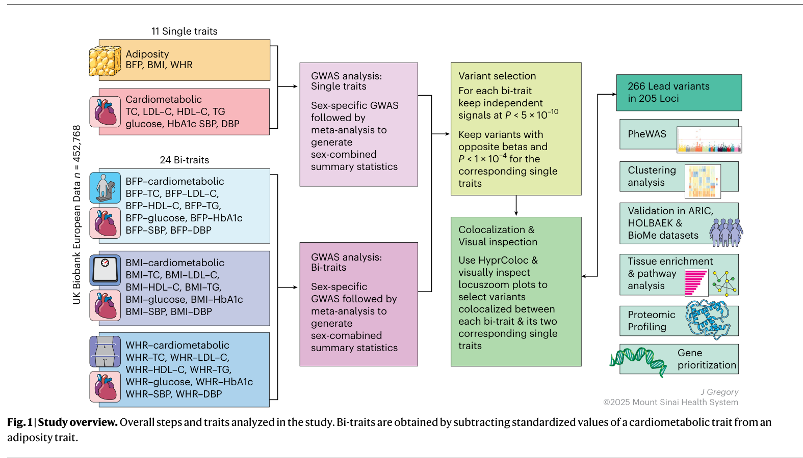
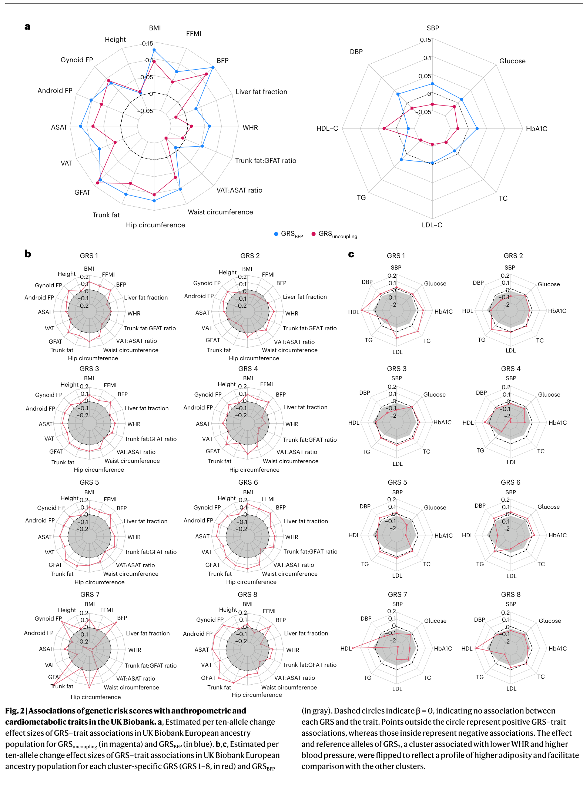
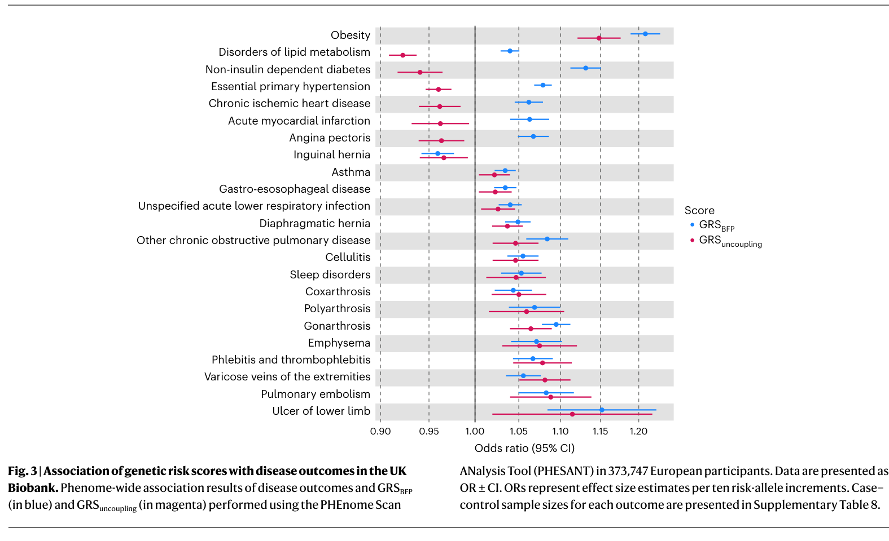
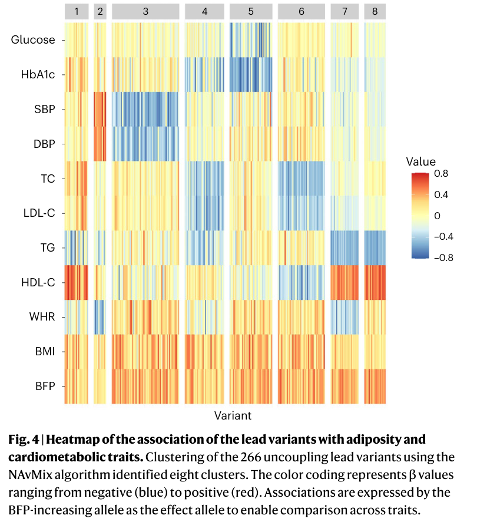
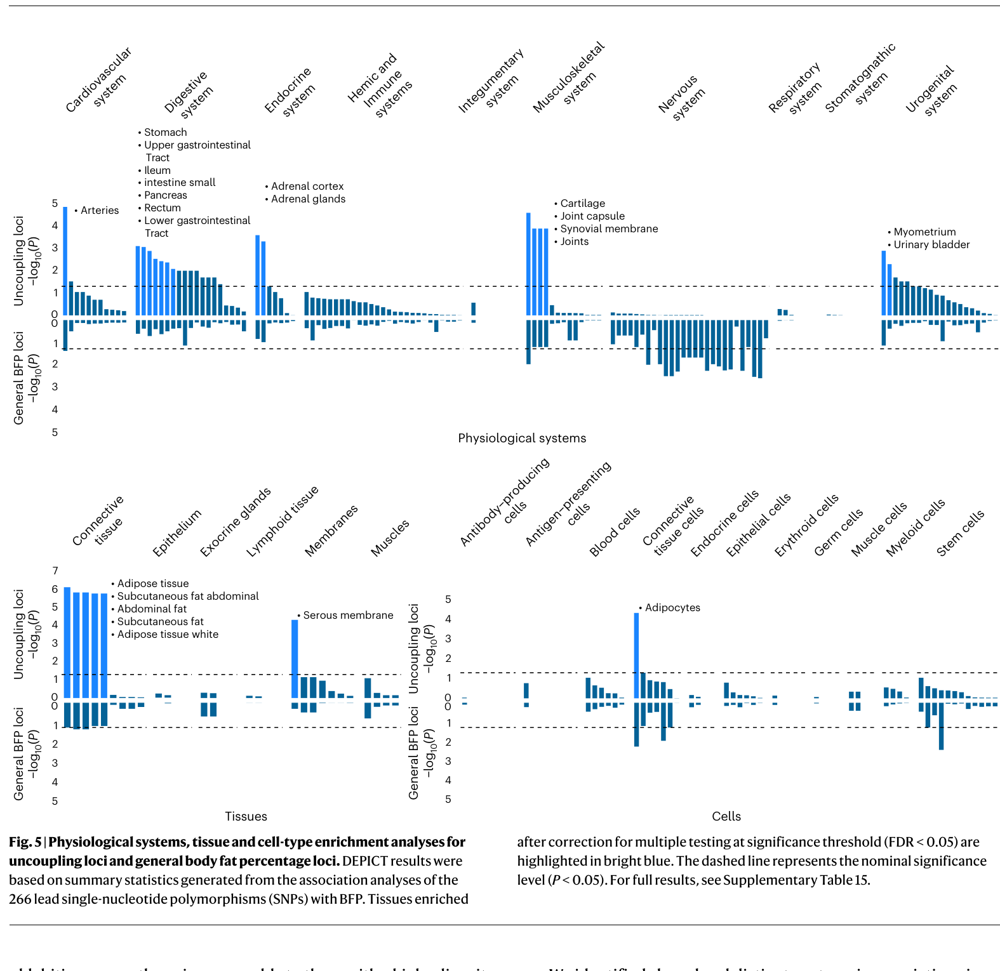
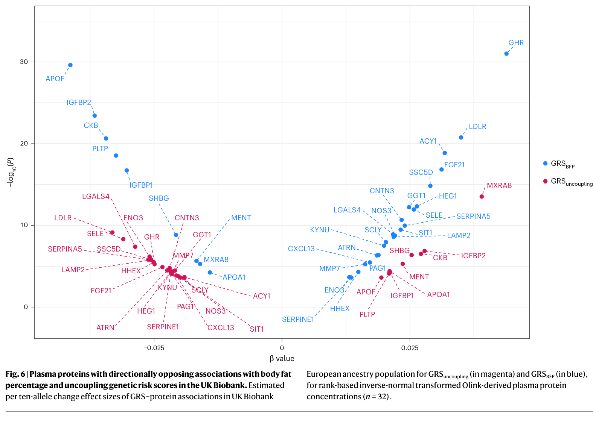

# Genetic subtyping of obesity reveals biological insights into the uncoupling of adiposity from its cardiometabolic comorbidities

<!-- wechat-style-reviewed: 2026-09-02 -->

门诊里两位 BMI 相近的人，可能走向完全不同的结局：一位同时出现高血糖、高血压和血脂异常，另一位暂时没有这些心代谢问题。只用 BMI 给两人贴上同一个“肥胖”标签，体重相近这个事实被保留了，风险为什么不同却被抹平了。

遗传研究也长期面临同样的压缩。已有全基因组关联研究找到了超过 1,000 个肥胖相关位点，但多数一次只分析 BMI、体脂率或腰臀比中的一个性状，难以区分“使脂肪增加”的遗传作用与“使脂肪增加并带来代谢损伤”的遗传作用。

真正的问题因此不是有没有“代谢健康型肥胖”，而是能否用连续数据把脂肪量和心代谢后果拆开，再判断这种差异对应哪些遗传路径。作者在最多 452,768 名 UK Biobank 欧洲祖源参与者中构造 24 个“解耦表型”，筛出 205 个位点上的 266 个变异，并把这些变异分成八个关联簇。

论文给出的答案是：肥胖的遗传结构确实包含多条可以让脂肪量与血脂、血糖或血压部分分离的路径。由 266 个变异构成的解耦遗传评分与较低的 2 型糖尿病和冠心病风险相关，但它没有消除高体重带来的关节、静脉和其他承重相关风险；八个簇目前也是“变异亚型”，还不是可以直接给患者使用的临床分型。

## 01｜为什么同一个 BMI 不能代表同一种风险

BMI 只回答体重相对身高有多高，不能回答脂肪储存在哪里、胰岛素敏感性怎样，或者同样的体脂会不会伴随高血压。把肥胖压成一个性状做 GWAS，容易把中枢食欲调控、脂肪组织扩张、脂肪分布、肝脏脂质清除和炎症等不同机制叠在一起。

作者关注的是一种“方向不一致”：某个等位基因增加 BMI、体脂率或腰臀比，却同时降低 LDL-C、甘油三酯、血糖、HbA1c 或血压，或提高保护性的 HDL-C。此前已有 87 个这类解耦位点，主要提示脂肪分布、脂肪细胞功能和炎症等外周机制；新研究试图用个体级数据和连续表型提高发现能力。

需要先划清概念边界。这里的“解耦”表示遗传关联方向相反，不等于一个人已经被临床确认是“健康型肥胖”，也不表示肥胖本身没有健康代价。

## 02｜这项研究到底做了多大规模

发现阶段纳入最多 452,768 名 UK Biobank 欧洲祖源参与者：血脂分析为 207,204 名男性和 245,564 名女性，血糖性状分析为 448,071 人。作者分析三种脂肪性状——BMI、体脂率（BFP）和腰臀比（WHR）——以及八种心代谢性状，包括四项血脂、两项血糖指标和收缩压/舒张压。

在 UK Biobank 内，373,747 名无亲缘关系的欧洲祖源参与者用于遗传评分和覆盖 10,965 个疾病结局的 PheWAS；30,271 人的 Olink 2,920 蛋白数据用于区分“脂肪量驱动”和“健康状态驱动”的蛋白关联。

外部或跨生命阶段证据来自三处。ARIC 中 9,240 名欧洲祖源参与者用于连续性状验证；ARIC 与 BioMe 的事件分析合并评估 2 型糖尿病和冠心病，其中 BioMe 纳入 23,208 人，包括欧洲、Hispanic 和非洲祖源；HOLBAEK 则包括 1,646 名肥胖门诊儿童/青少年和 1,811 名人群样本，共 3,457 人。

图 1 的关键是研究顺序：先把三种脂肪性状分别与八种心代谢性状配对，再做变异筛选与共定位，最后才进入 PheWAS、聚类、外部队列、组织通路、蛋白组和候选基因分析。后半段多数是关联与计算注释，不能倒过来当作因果实验。

## 03｜作者怎样从 24 个表型筛到 266 个变异

每个解耦表型都由标准化后的“脂肪性状减去心代谢性状”得到。例如 BMI−LDL-C 得分高，表示 BMI 相对更高而 LDL-C 相对更低；HDL-C 与健康方向相反，因此作者先翻转其符号。这样的定义把连续人群保留下来，没有先用任意阈值把人分成“健康”和“不健康”两组。

作者分别在男性和女性中对 24 个双性状和 11 个单性状做 70 次 BOLT-LMM GWAS，再用固定效应 meta-analysis 合并。候选信号需满足双性状 \(P<5\times10^{-10}\)、两个单性状均 \(P<10^{-4}\) 且效应方向相反，还要通过 HyPrColoc 支持同一局部信号同时驱动双性状和两个单性状关联。

1,103 个初始关联信号中，602 个信号、对应 425 个不重复 SNP 通过自动共定位；作者又人工检查 LocusZoom，并对 32 个信号调整窗口后重跑。最终保留 266 个变异、分布于 205 个相距超过 1 Mb 的位点，其中 139 个此前没有在心代谢解耦语境中报告，66 个复现了既有 87 个位点中的大多数，另外 21 个未达到本研究更严格的标准。

这一流程比只看双性状 GWAS 多了两道约束，却仍不能证明变异通过某一组织或分子产生保护作用。共定位支持“同一局部遗传信号”的解释，不等于已经锁定因果变异、因果基因或生物机制。

## 04｜心代谢风险较低，是否就意味着肥胖变得无害

作者把 266 个变异聚合为 \(GRS_{uncoupling}\)，并用 647 个一般体脂率相关变异构成 \(GRS_{BFP}\) 作为比较。两种评分都与多数脂肪性状升高相关，但解耦评分更偏向较低的内脏脂肪/腹部皮下脂肪比、较低肝脂和更多臀股部脂肪；一般体脂评分则更偏向不利脂肪分布。

性别分层后，这种较有利的脂肪分布关联在女性中更明显，主要来自女性腹部脂肪累积的效应更小；臀围和臀股部脂肪的效应、以及心代谢性状关联在男女间没有明显差异。一般体脂评分则未见同样的性别特异效应。

心代谢方向更清楚。评分每增加一个“十等位基因”等尺度单位，较高的解耦评分与更低 LDL-C、总胆固醇、甘油三酯、HbA1c、血糖和血压，以及更高 HDL-C 相关；一般体脂评分的方向大多相反。这里是以 BFP GWAS 效应加权后再缩放的评分，不是简单多出十个未加权风险等位基因。两种整体关联轮廓差异为 \(P<0.0001\)，但论文没有给出可以用于个人诊断的绝对分数阈值。

更接近临床结局的 PheWAS 纳入 373,747 人。与较高解耦评分相关的风险下降包括脂蛋白代谢障碍（OR 0.92）、非胰岛素依赖型糖尿病（OR 0.94）、原发性高血压（OR 0.96）、缺血性心脏病（OR 0.96）和急性心肌梗死（OR 0.96）；这些均按加权评分的“每十等位基因”等尺度变化计算，并不代表大幅度个体风险重分类。

保护没有覆盖所有疾病。蜂窝织炎（OR 1.05）、膝关节病（OR 1.06）和下肢静脉曲张（OR 1.08）仍随解耦评分升高，方向和一般体脂评分相近。换句话说，代谢负担可能较轻，承重、机械和其他高体重相关负担仍然存在。

图 3 因此不能被读成“肥胖保护评分”。它展示的是心代谢结局与部分非心代谢结局的分离，而且所有效应仍是遗传关联，不是减重、药物或生活方式干预的效果。

## 05｜八个遗传簇到底有什么不同

NAvMix 根据 266 个变异对 11 个单性状的相对效应，用 Bayesian Information Criterion 选择出八个簇。簇 4、7 和 8 同时覆盖两组或以上心代谢性状；其余五个簇主要只在血脂、血糖或血压中的某一组表现出相对保护。

例如，簇 4 同时关联更高总体脂肪、较有利脂肪分布、较低 LDL-C/总胆固醇/甘油三酯和较低 HbA1c；簇 7 更突出臀股部储脂和较低甘油三酯、较高 HDL-C；簇 8 也有有利血脂、较低 HbA1c 和血压，却没有同样明显的脂肪分布优势。簇 3 以较低血压为主，簇 5 以较低血糖和 HbA1c 为主。

另外三簇并不是单向“保护”。簇 1 同时关联较低甘油三酯、较高 HDL-C，以及较高 LDL-C、总胆固醇和 HbA1c；簇 6 的总体体型效应最强，但较低 LDL-C/总胆固醇伴随较高甘油三酯、较低 HDL-C、较高血压和糖代谢指标。簇 2 主要由 WHR 驱动并关联较低血压；原文却把同时升高的 WHR、VAT:ASAT 和 trunk fat:GFAT 写成“higher gynoid fat accumulation”，指标方向与文字标签存在张力，因此不能据此追加脂肪分布机制解释。

这些是“变异簇”，不是研究者从患者临床数据中稳定复现出的八类人。每个人会同时携带来自多个簇的等位基因；把簇内变异汇总成八个评分能描述不同遗传倾向，但论文没有证明它们能把个体无歧义地分到一个亚型，更没有验证亚型特异治疗反应。

## 06｜这些信号能在外部人群和儿童期看到吗

ARIC 的 9,240 名欧洲祖源参与者中，解耦评分再次与更低血糖、总胆固醇、LDL-C、甘油三酯和血压，以及更高 HDL-C 相关；八个簇的整体方向也与 UK Biobank 相符。这里复现的是关联轮廓，不是一个预先锁定阈值的临床分类器。

在 ARIC 与 BioMe 合并的事件分析中，解耦评分每增加一个“十等位基因”等尺度单位，冠心病 HR 为 0.95（95% CI 0.92–0.98），2 型糖尿病 HR 为 0.96（95% CI 0.92–0.99）；一般体脂评分对应的 2 型糖尿病 HR 为 1.04（95% CI 1.01–1.07），冠心病 HR 为 1.01（95% CI 0.99–1.04）。研究没有报告绝对风险、校准、判别能力或临床净获益。

身体活动分层提示环境可能改变遗传关联：ARIC 活跃组中，解耦评分与 2 型糖尿病的 HR 为 0.88（95% CI 0.80–0.97），一般体脂评分为 0.99（95% CI 0.92–1.05）；冠心病未出现同样现象。原文没有在主文给出正式的基因评分×活动交互效应，因此不能仅凭一组显著、另一组不显著就确认效应修饰。

HOLBAEK 的 3,457 名儿童和青少年提供了时间更早的横断面证据。两种评分都与较高 BMI 相关；人群样本中，解耦评分的 BMI 标准化效应在 UK Biobank 为 0.09、HOLBAEK 为 0.08。较高解耦评分还与较低血脂异常概率相关（OR 0.89，95% CI 0.82–0.97），但这不是从儿童期前瞻预测成年疾病的验证。

同一儿童样本中，一般体脂评分与较高 HOMA-IR、胰岛素和 C-peptide 相关；解耦评分没有同样的不利糖代谢轮廓，并与较低碱性磷酸酶相关。原文没有在主文给出这些比较的精确效应量，完整结果仍依赖本地缺失的补充表。

## 07｜为什么脂肪增加后，代谢后果可能不同

组织富集把一般体脂位点和解耦位点分到了不同方向。一般体脂位点富集于中枢神经系统（\(P=0.002\)）；解耦位点在中枢并不富集（\(P=0.74\)），而主要指向脂肪组织（\(P=7\times10^{-7}\)）、心血管、消化、内分泌和肌肉骨骼系统。

基因集结果也支持这种分离。解耦位点涉及胰岛素信号、糖稳态、脂质代谢、免疫炎症和脂肪组织生物学，并新增血管、骨骼肌和肝发育、昼夜节律及性别分化等候选过程；一般体脂位点则更偏神经发育。簇特异分析分别提示簇 1 的甘油三酯脂肪酶活性、簇 2 的心血管过程、簇 4 的肌肉过程和簇 7 的白脂肪转录调控，但这里只使用未校正 nominal \(P<0.05\)，完整 FDR 又依赖缺失的补充表，不能把这些路径视为确定机制。

蛋白组进一步把“脂肪量”和“健康后果”分层。2,920 种蛋白中，一般体脂评分关联 915 种（31.3%），解耦评分关联 337 种（11.5%）；两者共有 208 种，其中 176 种（85%）方向一致，更像脂肪量共同驱动。另有 32 种方向相反，涉及 LDLR、APOA1、IGFBP1/2、SHBG 和 FGF21；还有 129 种只与解耦评分相关，包括 ADIPOQ、LPL 和 myostatin。

这些蛋白不能自动升级为机制。作者把较低循环 LDLR 解释为肝脏膜上 LDLR 可能更多、脂质清除可能更有效，但本研究没有测量肝细胞表面 LDLR 或直接做通量实验；ADIPOQ、LPL 和 myostatin 的解释也来自关联及既有文献。

候选基因排序同样如此。14 种计算或功能基因组学工具从 1,623 个候选基因中给出 82 个高分基因，PCSK1 和 SMG6 获得 11 种工具支持；作者同时承认，两者如何解耦肥胖与心代谢风险并不清楚。本研究没有对这些候选基因做新的敲除、编辑或救援实验。

## 08｜这项研究真正改变了什么

最可迁移的变化不是“发现了健康肥胖”，而是把一个看似单一的暴露拆成两个连续维度：脂肪量有多高，以及心代谢后果相对有多重。这样可以发现单性状 GWAS 难以区分的外周路径，也能避免先用临床阈值制造过于粗糙的二分类。

第二个价值是提供条件化风险表达。同样是遗传性脂肪增加，有的路径更偏血脂，有的更偏血糖或血压；这为机制实验和精准预防提出了更具体的假设。当前可用的是“优先研究哪条路径”，还不是“按评分给谁用哪种药”。

八个评分确实容易在有基因型的队列中计算，但可计算不等于可临床实施。研究没有给出个体层面的 AUC、校准、阈值、决策曲线、增量预测价值或亚型特异治疗效应，也没有证明一个人应被唯一归入八类中的哪一类。

## 09｜对我们的研究有什么可借鉴

在癌症流行病学中，同样可以把一个粗暴暴露拆成“暴露量”和“生物学后果”。例如，对肥胖与肿瘤风险的研究，不应只比较 BMI 高低，还可以预先定义脂肪分布、胰岛素抵抗、炎症或肝脂相对不一致的连续表型，再检验它们是否对应不同癌症风险、癌前进展或治疗毒性。

分析顺序值得保留：先在发现队列构造连续不一致表型，再对单性状方向、共定位和独立信号加约束；随后在独立队列复现完整风险轮廓，而不是只复现几个显著位点；最后才用组织、多组学和扰动实验追机制。

迁移时必须重新校准祖源、年龄、性别、用药和检测平台，并预先定义临床结局与交互检验。本文没有癌症结局，因此不能据此声称某个解耦评分会降低或升高肿瘤风险；它提供的是研究设计，不是肿瘤学结论。

## 10｜这些结果仍需要冷静看待

第一，核心发现、UK Biobank 性状分析和蛋白组主要限于欧洲祖源。BioMe 的事件分析虽然含欧洲、Hispanic 和非洲祖源并调整 ancestry，却没有提供充分的祖源分层复现；作者自己也把向其他人群外推列为首要限制。

第二，266 个变异和八个簇在同一 UK Biobank 发现框架中产生。ARIC 验证了关联方向，但论文没有在独立队列重新发现八簇，也没有评估评分的临床校准和阈值；UK Biobank 内的效应还可能受发现样本重用和 winner's curse 影响。

第三，解耦表型是标准化脂肪性状与标准化心代谢性状的代数差。高分可以由脂肪更高、代谢指标更低或两者共同造成，不能直接对应一个固定临床状态。共定位和单性状方向约束减少了伪解释，却没有把统计构造变成诊断实体。

第四，蛋白组受 Olink 面板限制且是观察性关联；候选基因排序依赖既有注释，容易偏向已知基因。簇特异 DEPICT 因位点较少只使用 nominal \(P<0.05\)，Extended Data Fig. 6 的可视化阈值又是未校正 \(P<10^{-3}\)，不能把所有通路写成多重校正后确定的机制。

第五，身体活动分析只是分层结果；儿童数据也是横断面关联。两者都没有证明改变活动能定向抵消某一遗传亚型，也没有证明儿童评分可以预测成年心代谢结局。

最后，本地主 PDF 没有随附 Supplementary Tables 1–21、构建 GRS 的 R 文件和其他在线 source data。完整变异清单、八簇成员、性别分层、通路 FDR 和部分队列细节因而无法在本地闭合；文内还存在补充表数量、一般体脂评分阈值、GCTA 版本和 Extended Data Fig. 3 队列标注不一致，详见技术附录。

---

## 技术附录

### 论文基本信息

- 期刊：Nature Medicine 31, 3801–3812
- 在线发表：2025-09-12
- DOI：10.1038/s41591-025-03931-0
- 共同第一作者：Nathalie Chami、Zhe Wang
- 通讯作者：Ruth J. F. Loos
- 研究领域：肥胖遗传学、心代谢风险异质性、多性状 GWAS、遗传评分、蛋白组、精准医学
- 关键词：obesity、adiposity、cardiometabolic uncoupling、bi-trait、GWAS、genetic risk score、NAvMix、PheWAS、proteomics
- 数据来源：UK Biobank、ARIC、BioMe、HOLBAEK；原文只为 UK Biobank、ARIC 和 HOLBAEK 给出访问或申请说明，没有提供 BioMe 个体级数据的申请路径
- 代码来源：原文只声明构建肥胖遗传亚型 GRS 所需的 R 代码位于 accompanying supplementary file；本地 PDF 未包含该文件，也没有完整分析仓库或 commit
- 本地 PDF：`pdfs/processed/obesity-genetic-subtypes-cardiometabolic-uncoupling-nature-medicine-2025.pdf`
- 全文证据包：`tmp/2025-obesity-genetic-subtypes-llm-pack.md`
- 解析清单：`tmp/2025-obesity-genetic-subtypes-manifest.json`

### PDF 解析质量与全文覆盖

- 抽取引擎：PyMuPDF；本地 PDF 共 29 页、1,359 个句子 ID。
- 可读内容：主文、Methods、Fig. 1–6、Extended Data Fig. 1–8、Nature Portfolio Reporting Summary、数据/代码声明均能抽取。
- 本地缺失：Supplementary Tables 1–21、随附 GRS R code 和其他在线 supplementary/source-data 文件。完整 SNP/簇清单、性别分层、通路 FDR 和部分样本明细无法本地核验。
- 自动分节严重失真：manifest 报告 `results=47`、`methods=189`。47 个自动 Results 标签实际由 15 个语义 Results、6 个 Fig. 1 流程图 ID（`P002.S0024–P002.S0029`）和 26 个 Reporting Summary 假阳性组成。人工复位后，实际 Results 区域为 242 个 ID，其中语义 Results 正文 160 个；实际 Methods 为 254 个 ID。自动标签把 145/160 个语义 Results 误标为 `supplementary`。
- 版面问题：双栏顺序把 Fig. 5 打断的 Discussion 跨到下一页，把 Fig. 6 图注与正文合并；图轴、页眉、页脚和参考文献被混入章节；常见断词包括 `bio logy`、`individuallevel`、`under lying` 和 `Supple mentary`。
- 低置信原子：`P002.S0030` 同时含 Fig. 1 版权前缀和 Results；`P005.S0008` 同时含 Fig. 3 图注尾部与 Results；`P007.S0020` 同时含 Fig. 5 图注前缀和 Discussion 的 `phlebitis...`；`P008.S0008` 同时含 Fig. 6 图注和 Discussion。笔记按上下文拆义，但不改动原 ID。

| 互斥内容块 | 来源 ID | 数量 | 处理 |
|---|---|---:|---|
| 前页、摘要、引言和 Fig. 1 前置内容 | `P001.S0001–P001.S0029`、`P002.S0001–P002.S0014` | 43 | 题名、背景、摘要交叉检查 |
| 实际 Results 区域 | `P002.S0015–P006.S0068` | 242 | 160 个语义 Results + 82 个图轴/图注/页脚全部分类 |
| Discussion 物理区域（含 Fig. 5/6 图层、页眉和页脚） | `P006.S0069–P009.S0009` | 101 | 严格语义 Discussion 为 55 个纯 ID 加 2 个混合 ID，共涉及 57 个；其余版面对象另行归类 |
| Online content 截断句 | `P009.S0010` | 1 | 标记版面截断 |
| 主文参考文献 | `P009.S0011–P011.S0103` | 386 | 识别为引文，不当作 Results |
| 出版说明与许可 | `P011.S0104–P011.S0110` | 7 | CC BY-NC-ND 4.0 与出版声明 |
| 作者单位与联系信息 | `P011.S0111–P011.S0117`、`P012.S0001–P012.S0009` | 16 | 作者贡献和通讯信息交叉核对 |
| 页脚 | `P011.S0118`、`P012.S0010` | 2 | 页面伪影 |
| Methods 页眉 | `P013.S0001` | 1 | DOI 页眉 |
| 实际 Methods | `P013.S0002–P017.S0010` | 254 | 按研究对象、模型、参数和复现信息完整审计 |
| Reporting/Data/Code availability | `P017.S0011–P017.S0018` | 8 | 资源边界 |
| Methods 参考文献 | `P017.S0019–P018.S0045` | 129 | 识别为引文 |
| 致谢、贡献、利益冲突与补充入口 | `P018.S0046–P018.S0079` | 34 | 资助、申请号和声明 |
| Extended Data Fig. 1–8 | `P019.S0001–P026.S0004` | 59 | 图注、样本和阈值审计 |
| Reporting Summary | `P027.S0001–P029.S0019` | 76 | 软件清单、设计说明和报告边界 |
| **全文** | 以上互斥范围 | **1,359/1,359** | **无未分类 ID** |

### 主图与完整图注

| 原文图表 | 样本与比较 | 核心信息 | 图像文件 | 正文位置 |
|---|---|---|---|---|
| Fig. 1 | UK Biobank 最多 452,768 人；3 个脂肪性状×8 个心代谢性状 | 24 个双性状经 GWAS、方向约束和共定位得到 266 个变异 | `assets/precision-medicine/2025-obesity-genetic-subtypes/fig1-study-overview.png` | [02｜这项研究到底做了多大规模](#02｜这项研究到底做了多大规模) |
| Fig. 2 | UK Biobank 373,747 名无亲缘欧洲祖源参与者；每十等位基因变化 | 比较总体解耦、一般体脂和八个簇评分的脂肪/代谢轮廓 | `assets/precision-medicine/2025-obesity-genetic-subtypes/fig2-grs-trait-profiles.png` | [04｜心代谢风险较低，是否就意味着肥胖变得无害](#04｜心代谢风险较低，是否就意味着肥胖变得无害) |
| Fig. 3 | UK Biobank 373,747 人；PheWAS 扫描 10,965 个结局，图中展示 23 个 | 心代谢保护与承重/机械性风险并存 | `assets/precision-medicine/2025-obesity-genetic-subtypes/fig3-phewas-disease-outcomes.png` | [04｜心代谢风险较低，是否就意味着肥胖变得无害](#04｜心代谢风险较低，是否就意味着肥胖变得无害) |
| Fig. 4 | 266 个 lead variants×11 个单性状 | NAvMix 得到八种不同关联轮廓 | `assets/precision-medicine/2025-obesity-genetic-subtypes/fig4-eight-genetic-clusters.png` | [05｜八个遗传簇到底有什么不同](#05｜八个遗传簇到底有什么不同) |
| Fig. 5 | 266 个解耦 lead variants（205 loci）与 647 个一般 BFP lead variants | 解耦变异偏外周组织，一般 BFP 变异偏中枢 | `assets/precision-medicine/2025-obesity-genetic-subtypes/fig5-tissue-cell-enrichment.png` | [07｜为什么脂肪增加后，代谢后果可能不同](#07｜为什么脂肪增加后，代谢后果可能不同) |
| Fig. 6 | UK Biobank 30,271 人的 Olink 数据；32 个方向相反蛋白 | 区分脂肪量共同关联与健康方向相反关联 | `assets/precision-medicine/2025-obesity-genetic-subtypes/fig6-opposing-proteomic-signatures.png` | [07｜为什么脂肪增加后，代谢后果可能不同](#07｜为什么脂肪增加后，代谢后果可能不同) |

#### Fig. 1 完整注释

Fig. 1 为单面板流程图。输入为 BFP、BMI、WHR 三个脂肪性状和 TC、LDL-C、HDL-C、TG、glucose、HbA1c、SBP、DBP 八个心代谢性状，共 11 个单性状和 24 个双性状。男女分别 GWAS 后合并；筛选要求双性状 \(P<5\times10^{-10}\)、对应单性状方向相反且 \(P<10^{-4}\)，再做 HyPrColoc 和人工区域检查。输出 205 个位点的 266 个 lead variants，并进入 PheWAS、NAvMix、ARIC/HOLBAEK/BioMe、DEPICT、蛋白组和基因排序。sentence 表漏抽图内 BMI/BFP–SBP/DBP 四个标签，24 个组合由 PDF 视觉复核并以 Methods 的完整枚举补回。来源：`P002.S0001–P002.S0008`、`P002.S0015–P002.S0034`、`P002.S0041–P002.S0043`、`P014.S0043–P014.S0044`。

#### Fig. 2 完整 panel 注释

- A：比较 \(GRS_{uncoupling}\)（洋红）和 \(GRS_{BFP}\)（蓝）对 16 个脂肪/人体测量性状及 8 个心代谢性状的每十等位基因标准化效应；虚线为 \(\beta=0\)。解耦评分对 VAT:ASAT、trunk fat:GFAT、肝脂和多数代谢性状方向更有利。来源：`P002.S0035–P004.S0014`、`P003.S0023`、`P003.S0043–P003.S0046`。
- B：八个簇评分对脂肪性状的轮廓；灰色为一般 BFP 评分。图内 a/b/c 文字在句子抽取中交错，不能把 graphic IDs 互斥分给单个 panel；这里以完整图页和 caption 定义分面。来源：`P003.S0001–P003.S0047`、caption `P003.S0023`、`P003.S0043–P003.S0046`，以及 Results `P004.S0027–P004.S0044`。
- C：八个簇评分对血压、血糖、HbA1c 和血脂的轮廓。GRS2 为便于与其他簇比较而翻转效应/参考等位基因；图中不是原始聚类方向。图内 graphic IDs 同样不能互斥分配。来源：`P003.S0001–P003.S0047`、caption `P003.S0023`、`P003.S0043–P003.S0046`、`P015.S0034–P015.S0035`。

#### Fig. 3 完整注释

森林图比较 \(GRS_{uncoupling}\)（洋红）和 \(GRS_{BFP}\)（蓝）对疾病结局的 OR 和 95% CI，效应均按加权评分的“每十等位基因”等尺度变化。图示 23 项结局：肥胖、脂代谢障碍、非胰岛素依赖型糖尿病、原发性高血压、慢性缺血性心脏病、急性心肌梗死、心绞痛、腹股沟疝、哮喘、胃食管疾病、未特指急性下呼吸道感染、膈疝、其他慢阻肺、蜂窝织炎、睡眠障碍、髋关节病、多关节病、膝关节病、肺气肿、静脉炎/血栓性静脉炎、下肢静脉曲张、肺栓塞和下肢溃疡。10,965 是全部扫描结局数，图注没有说明 23 项的展示规则；病例/对照数仅在缺失的 Supplementary Table 8 中。来源：`P004.S0015–P004.S0022`、`P005.S0001–P005.S0008`、`P005.S0022–P005.S0026`。

#### Fig. 4 完整注释

热图以 BFP-increasing allele 统一 266 个变异方向，行是 glucose、HbA1c、SBP、DBP、TC、LDL-C、TG、HDL-C、WHR、BMI 和 BFP，列为变异；红/蓝分别表示正/负 \(\beta\)。NAvMix 按比例效应分成八簇，图只展示关联结构，不展示成员概率、簇稳定性或患者分配。来源：`P004.S0023–P004.S0048`、`P006.S0001–P006.S0010`、`P015.S0020–P015.S0029`。

#### Fig. 5 完整 panel 注释

- 上：按 physiological systems 比较解耦位点和一般 BFP 位点的 DEPICT 富集；解耦位点突出心血管、消化、内分泌和肌肉骨骼系统，一般 BFP 位点突出 nervous system。来源：`P005.S0020–P005.S0032`、`P007.S0001–P007.S0012`。
- 左下：组织层面突出 adipose tissue、腹部/皮下脂肪和 serous membrane。右下：细胞层面突出 adipocytes。亮蓝为多重校正后 FDR<0.05，虚线只代表 nominal \(P<0.05\)。来源：`P007.S0013–P007.S0019`、`P007.S0029–P007.S0040`。
- 图基于 266 个 lead SNP 对 BFP 的 summary statistics，而不是直接比较人体组织表达；完整结果依赖本地缺失的 Supplementary Table 15。来源：`P007.S0018–P007.S0019`、`P007.S0038–P007.S0040`。

#### Fig. 6 完整注释

横轴为“每十等位基因”等尺度的加权评分变化对应蛋白 \(\beta\)，纵轴为 \(-\log_{10}P\)；蛋白浓度先做 rank-based inverse-normal transformation。蓝色是 \(GRS_{BFP}\)，洋红是 \(GRS_{uncoupling}\)。图中 \(n=32\) 指两种评分方向相反的蛋白数，不是参与者数。图内完整标签为 APOF、IGFBP2、CKB、PLTP、GHR、LDLR、ACY1、FGF21、SSC5D、IGFBP1、MXRA8、SHBG、CNTN3、LGALS4、GGT1、HEG1、SELE、NOS3、SERPINA5、ENO3、MENT、KYNU、SCLY、SIT1、LAMP2、CXCL13、ATRN、MMP7、PAG1、APOA1、HHEX 和 SERPINE1；部分标签只存在于图内 line-level extraction，没有独立 sentence ID。该图支持关联方向分类，却不证明这些蛋白介导遗传效应。Results 来源：`P006.S0011–P006.S0019`；图注来源：`P008.S0007`、`P008.S0008` 前半及 `P008.S0019`。

### Results 证据覆盖审计

人工复核将 Results 区域 `P002.S0015–P006.S0068` 的 242 个 ID 分为 160 个语义 Results 和 82 个图轴、图注、版权/页脚 ID。两类均已处理；下表按论文 Results 顺序覆盖全部 160 个语义 ID。

| 原文句子 ID | 数量 | 忠实中文含义 | 正文对应 | 证据边界 |
|---|---:|---|---|---|
| `P002.S0015–P002.S0023` | 9 | 研究对象、3+8 个性状、24 个双性状与 GWAS 起点 | 02–03 | `S0023` 被流程图打断 |
| `P002.S0030–P002.S0040` | 11 | 筛出 266 个变异/205 个位点，139 个新位点；构建两种总体 GRS | 03–04 | `S0030` 混入 Fig. 1 版权；`S0040` 跨页 |
| `P004.S0001–P004.S0057` | 57 | 两种 GRS 的脂肪/代谢轮廓、性别差异、PheWAS、八簇、ARIC/BioMe | 04–06 | 外部连续性状验证与事件 meta 不是同一分析样本 |
| `P005.S0008–P005.S0021` | 14 | 事件结局、活动分层、HOLBAEK 与组织富集开端 | 06–07 | `S0008` 混入 Fig. 3 图注；无正式活动交互检验 |
| `P005.S0027–P005.S0037` | 11 | CNS/外周组织和通路富集、2,920 蛋白分析开端 | 07 | 簇特异通路为探索性，完整 FDR 表缺失 |
| `P006.S0011–P006.S0068` | 58 | 915/337/208/176/32/129 蛋白、82 个候选基因及簇机制解释 | 07 | 基因排序和蛋白方向不等于因果机制 |
| **语义 Results** | **160/160** | 原始顺序全部覆盖 | — | **无未覆盖语义 ID** |

其余 82 个 Results 区域 ID 为 `P002.S0024–P002.S0029`、`P002.S0041–P003.S0048`、`P004.S0058`、`P005.S0001–P005.S0007`、`P005.S0022–P005.S0026`、`P005.S0038`、`P006.S0001–P006.S0010`，已分别归入 Fig. 1–4 完整注释或页脚/轴标签审计。因此 Results 区域覆盖为 **242/242**。

#### 候选基因结果的具体保留

为避免把 `P006.S0023–P006.S0068` 只压缩成“82 个候选基因”，这里保留原文的功能归类。既往已与肥胖—心代谢反向效应相关的候选包括 PPARG、FAM13A、PEPD 和 IRS1；其余高分基因被既有文献分别连接到脂肪组织扩张（PPARG、IRS1、RSPO3、HLX、MED19、SENP2、MLXIPL、ARNT、PIK3R1、PNPLA2）、胰岛素分泌和 β 细胞功能（PIK3R1、GPRC5B、MEF2D、FBN1、LDB1、SENP2、MAPT、PBX1）、白脂肪棕化或棕色脂肪功能（CSK、SLC22A3、SENP2、MED19、LDB1、HLX、CRHR1），以及炎症和纤维化（PEPD、原文 `BCN2`〔上下文指向 BNC2〕、MST1、GPRC5B、MAFF、CTSS、NPEPPS、CSK、FBN1）。这些是文献和计算注释，不是本文新做的功能实验。

作者另把 ARNT、CTSS、YWHAB、FBN1、LDB1、SENP2 归入肝脏糖稳态，把 JMJD1C、NPEPPS、MLXIPL 归入肝脂积累，把 PPP3R1、CTSS、CXXC5、NPEPPS、SENP2、FBN1 归入骨骼肌生长与功能。簇内映射中，簇 7 的 FAM13A/RSPO3 指向区域脂肪扩张，簇 3 的 CSK/HLX/LDB1/MED19/SENP2 指向脂肪棕化，簇 8 的 PPARG/IRS1/TIMP4/CTSS/ARNT/PIK3R1 同时涉及脂肪扩张、营养摄取和肝糖控制。完整成员和证据来源仍依赖缺失的 Supplementary Table 21，不能把这些映射当作已验证机制。来源：`P006.S0023–P006.S0068`。

### Methods 与复现信息

#### 队列、表型和纳排

- UK Biobank：40–69 岁、2007–2010 年在 21 个中心招募。以约 121,000 个 QC 位点、488,377 名参与者及 1000 Genomes phase 3 v5 投影做 PCA 和四类 k-means，限定欧洲祖源。脂质分析 452,768 人，糖代谢分析 448,071 人。腰/臀围超出 50–150 cm、妊娠女性，以及 Sheffield 中心 121 名 BFP>55% 且 BMI>40 的女性被排除；糖代谢分析排除 4,697 名胰岛素治疗者，以及 glucose>15 mmol l⁻¹ 或 HbA1c>100 的 804 人，但原文没有交代两组是否重叠。服用降脂药者 LDL-C÷0.7、TC÷0.8；TC 和 TG 对数变换；SBP/DBP 取两次基线测量均值，降压药使用者分别加 15/10 mmHg。约 45 万人使用 UK Biobank Axiom、约 5 万人使用 UK BiLEVE 芯片，缺失 SNP 由 UKB 团队以 UK10K 参考面板填补。来源：`P013.S0007–P013.S0040`。
- ARIC：原队列 15,792 人；连续性状复现使用 9,240 名无亲缘欧洲祖源者。CHD 由死亡、住院、ECG 和血运重建界定；T2D 由血糖、诊断或用药界定，基线 T2D 从事件分析排除。基因分型使用 Affymetrix 6.0，QC 后以 IMPUTE v2.3.2 和 1000 Genomes phase 3 参考数据填补。来源：`P013.S0041–P013.S0053`、`P015.S0043–P015.S0046`。
- BioMe：多祖源电子病历队列；GSA-24v1-0_A1 分型 32,595 人，排除重复样本、性别不一致、杂合度偏离人群均值>6 s.d.、位点或个体 call rate<95% 以及 HWE 偏离后，保留 31,705 人和 604,869 个变异；以 impute2 和 1000 Genomes 参考面板填补。事件分析纳入 23,208 人（欧洲 8,985、Hispanic 7,984、非洲祖源 6,239）。首个门诊后需至少一年在系统中，既往或首年内 CHD/T2D 排除。来源：`P013.S0054–P013.S0065`、`P015.S0047–P016.S0001`。
- HOLBAEK：肥胖门诊 1,646 人、人群样本 1,811 人；5–19 岁、欧洲祖源、有基因型，排除减重/糖尿病药物和达到 T2D 阈值者。HRC1.1 缺失位点以随机抽取 20,000 名 UKB White British、无亲缘者（KING<0.0884）的 \(R^2>0.8\) 代理；参考面板要求 SNP missingness<5%、INFO>0.3。\(GRS_{BFP}\) 的 142 个缺失位点找到 123 个代理，\(GRS_{uncoupling}\) 的 58 个找到 56 个，代理 median \(R^2=0.99\)；最终分别含 628 和 264 个变异，HOLBAEK median INFO=0.98。23 个结局用线性/逻辑回归，调整年龄、性别、4 PCs 和 genetic batch（3 批）；连续性状除 BMI、WHR、WHtR、SBP、DBP SDS 外先对数变换再标准化，按队列及性别分层、逆方差合并，并跨 23 个性状做 BH 校正。来源：`P013.S0066–P014.S0026`。

#### 双性状 GWAS、条件分析与共定位

单性状先按性别分别调整年龄、年龄平方、genotyping array 和原文所写的 `sequencing center`，残差做 inverse-normal transform；后一个协变量名称是否其实意指 assessment center，原文未解释。24 个双性状为脂肪 z-score 减心代谢 z-score；HDL-C 先翻转。共做 35 性状×2 性别的 70 次 BOLT-LMM v2.4.1，另调 10 个 PCs；MAF<0.1% 排除，imputation INFO≥0.3。男女由 METAL 固定效应合并。

LDSC v1.0.1 初始截距 1.09–1.18，作者以 `SE×sqrt(LDSC intercept)` 做 genomic control 后降至 1.03–1.08。GCTA v1.94.4 在 lead SNP 两侧各 1 Mb 做近似联合/条件分析；条件与原始结果均要求 \(P<5\times10^{-10}\)。来源：`P014.S0027–P014.S0063`。

1,103 个候选信号进入 HyPrColoc：输入 \(\beta\)、SE、3×3 表型相关矩阵、lead SNP 周围总长 1 Mb 的 LD 矩阵，以及用途未解释的全 1 矩阵。602 个信号/425 个唯一 SNP 共定位；作者人工修改 32 个信号的区域并重跑。高 LD（\(r^2>0.9\)）候选会随机选一个，但未给 seed。来源：`P014.S0064–P015.S0019`。

#### 聚类、遗传评分和临床结局模型

NAvMix 用 266 个变异对 11 个单性状的 \(\beta\) 做方向聚类，以 BFP-increasing allele 统一方向、最大成员概率分配、BIC 选簇数并允许 noise cluster。软件版本、候选簇数、初始化、seed、成员概率和 noise cluster 最终处理没有报告。来源：`P015.S0020–P015.S0029`。

十个 GRS 为总体解耦、八簇和一般 BFP；全部以本研究 BFP GWAS \(\beta\) 加权并缩放到“每十等位基因”等尺度。Methods 中一般 BFP 评分由 647 个 lead variants 构成，阈值写作 \(P<5\times10^{-9}\)，并在 1 Mb 内按 \(r^2<0.1\) clumping、移除 MHC；这与 Results 的 \(P<5\times10^{-10}\) 冲突。GRS2 在聚类时对应较低 WHR，后续分析翻转效应/参考等位基因，以统一为较高脂肪方向。连续性状调整年龄、性别、芯片、中心和 10 PCs 后逆正态化。PHESANT 对连续/二元结局分别做线性/逻辑回归，但 Methods 未给 PheWAS 多重校正阈值。来源：`P015.S0030–P015.S0042`。

ARIC/BioMe 的 incident T2D/CHD 用 Cox，调整年龄、性别和 10 PCs，BioMe 另调 ancestry，再逆方差合并。原文未给 Cox 时间起点、删失、事件数、比例风险检验或分祖源异质性。ARIC 活动量以休闲中高强度 MET-hours/week 前 30% 和后 70% 分层，没有正式交互项。来源：`P015.S0043–P016.S0003`。

#### 蛋白组、基因排序和富集

Olink 使用 30,271 名 UK Biobank 无亲缘欧洲祖源参与者、batches 1–6。PCOLCE（缺失 62%）、NPM1（73%）和 GLIPR1（>99%）因缺失>25%而排除；保留 2,920 种蛋白，median missingness 为 2.8%。低于 LOD 的值保留，但缺失值具体处理未写。29,200 个 protein–GRS 回归调整年龄及平方、性别、中心、10 PCs、芯片、批次、空腹时间和采样到处理间隔，以 BH 控制 FDR 0.005。来源：`P016.S0004–P016.S0013`。

基因优先级把最多 14 种证据的命中数相加，分数≥7 入选；这些证据互相关联，不能视作 14 次独立验证。工具包括 VEP 最近基因/coding proxy、ABC/FUMA、PoPS v0.1、DEPICT、fastENLOC/GTEx v8、脂肪库特异 CS2G、AMSC ATAC-seq、eQTL、enhancer-capture Hi-C、DNase 和分化表达。主要阈值包括代理 \(r^2>0.8\)、fastENLOC RCP>0.1、CS2G score 0.05、MACS3 v3.0.0 和 BEDtools v2.29.2/2.30.0。ABC/FUMA 以 UKB release 2b 的 10,000 名欧洲祖源者为 LD 参考，共交叠 10,095 个 lead/proxy SNP；PoPS 另用随机 10,000 名 UKB 参与者作参考。AMSC 来自腹部手术患者，分化 14 天并在 day 14 取样；ATAC-seq 合并 15 个皮下和 14 个内脏 AMSC 样本。来源：`P016.S0014–P017.S0003`。

DEPICT 只纳入至少 10 个基因的 GO、KEGG、REACTOME 条目；全体 266 个变异使用 FDR<0.05，簇特异分析因功效较低仅使用未校正 nominal \(P<0.05\)。来源：`P017.S0004–P017.S0010`。

#### 软件、版本和缺失参数

主 Methods 明确给出 BOLT-LMM 2.4.1、LDSC 1.0.1、GCTA 1.94.4、IMPUTE 2.3.2、GenomeStudio 2011.1/Genotyping Module 1.9.4、EAGLE2 2.0.5、HRC1.1、PoPS 0.1、MACS3 3.0.0、BEDtools 2.29.2/2.30.0、GTEx v8 和 1000 Genomes phase 3 v5。Reporting Summary 还给出 HyPrColoc 1.0、LocusZoom 0.12.0、DEPICT 1.release194、fastENLOC 3.1 和 METAL 2020-05-05；但其中 GCTA 写作 1.94.2，与主 Methods 的 1.94.4 冲突。来源：`P014.S0055`、`P027.S0014–P027.S0016`。

未给版本的关键工具包括 NAvMix、PHESANT、VEP、FUMA、CS2G、LDlinkR、GenomicRanges、BioMe impute2、PBWT、R 及统计包。原文写 `BEDtools merge -I`，可执行参数通常应核对大小写；本笔记保留原文疑点，不静默修改。

### Methods 证据覆盖审计

| 原文句子 ID | 数量 | 忠实中文含义 | 方法学解释与复现注意点 |
|---|---:|---|---|
| `P013.S0002–P013.S0040` | 39 | 伦理、UK Biobank、欧洲祖源、表型、纳排和分型 | 多处 UKB QC 阈值引用外部流程 |
| `P013.S0041–P014.S0026` | 53 | ARIC、BioMe、HOLBAEK、GRS 代理位点和儿童统计 | 队列样本口径不同；HOLBAEK 的 \(GRS_{BFP}\) 少 19 个、\(GRS_{uncoupling}\) 少 2 个变异 |
| `P014.S0027–P015.S0019` | 61 | 双性状构造、70 次 GWAS、LDSC、GCTA、HyPrColoc 与人工复核 | 双性状不是联合多变量模型；人工窗口和随机挑 SNP 无可复现规则 |
| `P015.S0020–P015.S0042` | 23 | NAvMix、十个 GRS、24 性状和 PheWAS | NAvMix 版本/seed/稳定性与 PheWAS 校正缺失 |
| `P015.S0043–P016.S0003` | 10 | ARIC/BioMe Cox meta 和活动分层 | 缺事件数、删失、PH 检验和交互项 |
| `P016.S0004–P016.S0013` | 10 | Olink QC、回归、FDR 和方向分组 | 低于 LOD 保留，但缺失值实现未写 |
| `P016.S0014–P017.S0003` | 51 | 14 类基因优先级证据和外部功能组学 | AMSC 供者数/样本关系不明；部分工具无版本 |
| `P017.S0004–P017.S0010` | 7 | DEPICT 组织/基因集富集 | 簇特异仅 nominal \(P<0.05\) |
| **Methods 合计** | **254/254** | 真正 Methods 全部覆盖 | **无未覆盖 ID** |

### Extended Data Fig. 1–8 审计

- Extended Data Fig. 1：以 BMI−TC 为例说明双性状构造，只是表型定义，不是结果验证。来源：`P019.S0002–P019.S0004`。
- Extended Data Fig. 2：UK Biobank 总体及八簇 GRS 的性别特异关联；精确值依赖缺失的补充表。主文相关 GRS 上下文指向 Supplementary Table 7，而 Reporting Summary 又把 Table 4 关联到 sex-specific analyses，本地材料无法确定精确映射。来源：`P020.S0002–P020.S0009`、`P028.S0016–P028.S0017`。
- Extended Data Fig. 3：标题写 ARIC 且 A 明确为 n=9,240；B–C 图注却写 UK Biobank，无法仅据本地 PDF 判断是混合队列面板还是文字错误。来源：`P021.S0002–P021.S0010`。
- Extended Data Fig. 4：HOLBAEK 的连续与二元性状；连续性状标准化，二元结局以 OR=1 为零效应线，星号部分只在人群队列分析。来源：`P022.S0002–P022.S0010`。
- Extended Data Fig. 5：总体解耦与一般 BFP 位点通路，图示 nominal、未校正 \(P<0.01\)；完整 FDR 依赖缺失的 Supplementary Table 16。来源：`P023.S0002–P023.S0010`。
- Extended Data Fig. 6：八簇通路图采用 nominal、未校正 \(P<10^{-3}\)，不能把所有条目称作校正后显著。来源：`P024.S0002–P024.S0008`。
- Extended Data Fig. 7：176 个对两种总体评分方向一致的蛋白，更像脂肪量共同关联。来源：`P025.S0002–P025.S0004`。
- Extended Data Fig. 8：129 个只与解耦评分、而非一般 BFP 评分关联的蛋白。来源：`P026.S0002–P026.S0004`。

### 数据、代码和材料可用性

- UK Biobank 需通过正式申请访问，本研究申请号 1251；HOLBAEK 需丹麦数据保护和 Region Zealand 伦理审批；ARIC 提供受控申请入口及 dbGaP `phs000223`。来源：`P017.S0012–P017.S0017`、`P018.S0046–P018.S0062`。
- 原文没有说明 BioMe 个体级数据的申请路径。代码声明只覆盖构建 GRS 的 R code，未开放 GWAS、HyPrColoc 人工区域修改、NAvMix、PheWAS、Cox、蛋白组或基因优先级完整流水线。来源：`P017.S0018`。
- 本地缺少 Supplementary Tables 和 Supplementary Code，无法独立核对变异清单、簇成员、人工窗口及完整模型实现。
- 作者声明资助方未参与设计、采集、分析或写作；J.C.H. 披露 Novo Nordisk、Rhythm Pharmaceuticals 相关酬金和肥胖业务，其余作者声明无冲突。来源：`P018.S0067–P018.S0073`。

### 证据强度、原文冲突和不可外推结论

**直接数据支持较强的结论**

- 连续解耦表型在 UK Biobank 找到 266 个方向受约束、经共定位筛选的变异，形成八种不同的性状关联簇。
- 总体解耦 GRS 与一般体脂 GRS 的脂肪分布、心代谢指标及 PheWAS 轮廓不同；ARIC 的连续性状方向、ARIC/BioMe 的事件关联和 HOLBAEK 的儿童横断面关联提供了部分外部支持。
- 解耦位点相对一般 BFP 位点更偏外周组织；蛋白组可分出共同方向、相反方向和解耦特异关联。

**合理但尚未直接证明的推断**

- 较有利脂肪分布“部分介导”心代谢保护；本文没有正式中介模型。
- 较低循环 LDLR 代表肝细胞表面 LDLR 更多和清除更强；本文未测膜蛋白或通量。
- 八个变异簇对应八种稳定患者亚型，并能指导亚型特异治疗或预防。
- 分层看到的身体活动差异是真实 GRS×环境交互；主文没有正式交互检验。

**原文内部冲突或复现歧义**

- \(GRS_{BFP}\) 变异阈值：Results 为 \(P<5\times10^{-10}\)（`P002.S0036`），Methods 为 \(P<5\times10^{-9}\)（`P015.S0031`）。
- GCTA 版本：主 Methods 为 1.94.4（`P014.S0055`），Reporting Summary 为 1.94.2（`P027.S0014`）。
- 补充表数量：Data availability 写 Supplementary Tables 1–21（`P017.S0012`），Reporting Summary 写 1–20（`P028.S0002`）。
- BioMe Methods 写“生成十个 GRS”，随后只列总体解耦和一般 BFP 两个评分（`P015.S0047`）。
- 糖代谢样本从 452,768 到 448,071 恰差 4,697 名胰岛素治疗者，Methods 又称另排除 804 名极端 glucose/HbA1c 者，未说明重叠（`P013.S0028`、`P013.S0033`）。
- 作者限制称研究限欧洲祖源，Reporting Summary 也称仅欧洲祖源；但 BioMe incident 分析明确含 Hispanic 和非洲祖源。可以解释为核心发现/多数分析限欧洲祖源，但原文口径不完整一致（`P008.S0028`、`P015.S0047`、`P028.S0017–P028.S0018`）。
- Extended Data Fig. 3 标题是 ARIC，B–C 图注却写 UK Biobank（`P021.S0002`、`P021.S0006–P021.S0007`）。
- GRS2 在后续图表中翻转了效应等位基因；Results 又把更高 WHR、VAT:ASAT 和 trunk fat:GFAT 写成“higher gynoid fat accumulation”，指标方向与该文字标签存在语义张力（`P003.S0046`、`P004.S0043–P004.S0044`、`P015.S0034–P015.S0035`）。
- Fig. 1 图内把 `sex-combined` 拼作 `sex-comabined`；正文另出现 `PSCK1`/`BCN2`，上下文与引文分别指向 PCSK1/BNC2。笔记保留为原文拼写问题，不把错误拼写当新基因。
- Cluster 7 的 WHR/脂质解释交叉引用到 Fig. 3，但 Fig. 3 是 PheWAS；对应证据实际位于 Fig. 2/4 和 Supplementary Table 21（`P006.S0053–P006.S0057`）。
- Reporting Summary 遗漏 BioMe、用单一 452,768 表示所有样本，并把 clinical data 和 eukaryotic cell lines 勾为 n/a；与 BioMe 电子病历结局及外部 hBM-MSC-TERT4 数据存在张力。
- HyPrColoc prior/判定阈值、32 个窗口修改规则、NAvMix 版本/seed/稳定性、PheWAS 校正、Cox 事件/删失/PH 检验、Olink 缺失值实现均未报告。

**不能从本研究外推的结论**

- 不能把高解耦评分称为“健康肥胖”，或据此弱化减重和承重疾病管理。
- 不能把八个变异簇当作已验证的八类患者，也不能据此选择药物。
- 不能把相关蛋白、富集组织或高分基因直接称为介导机制或治疗靶点。
- 不能认为儿童期横断面信号已证明成年结局预测，也不能认为多祖源可计算就等于跨祖源校准完成。
- 本研究未分析癌症结局，不能外推任何肿瘤风险方向。

### 发布前检查

- [x] 一级标题为论文正式英文原题；
- [x] 开头从同 BMI、不同心代谢风险的具体困境切入；
- [x] 前五段出现论文核心答案；
- [x] 正文使用连续问题式编号；
- [x] 关键结果包含样本、数字和比较对象；
- [x] 六张主图紧跟相邻 Results 叙事并保留完整注释；
- [x] 明确写出“这些结果仍需要冷静看待”；
- [x] Results 区域 242/242、语义 Results 160/160、Methods 254/254、全文 1,359/1,359 覆盖；
- [x] 原文冲突、低置信解析和缺失补充材料完整保留；
- [x] `SUMMARY.md`、分类 README、`STYLE_REVIEW_LOG.md` 已更新；
- [x] HonKit 构建和内部链接已验证。
