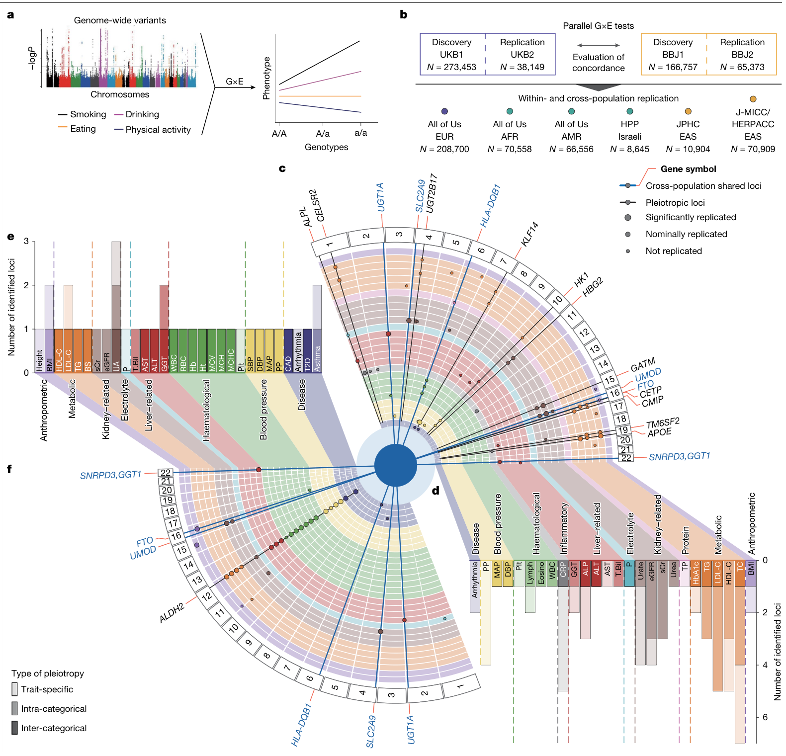
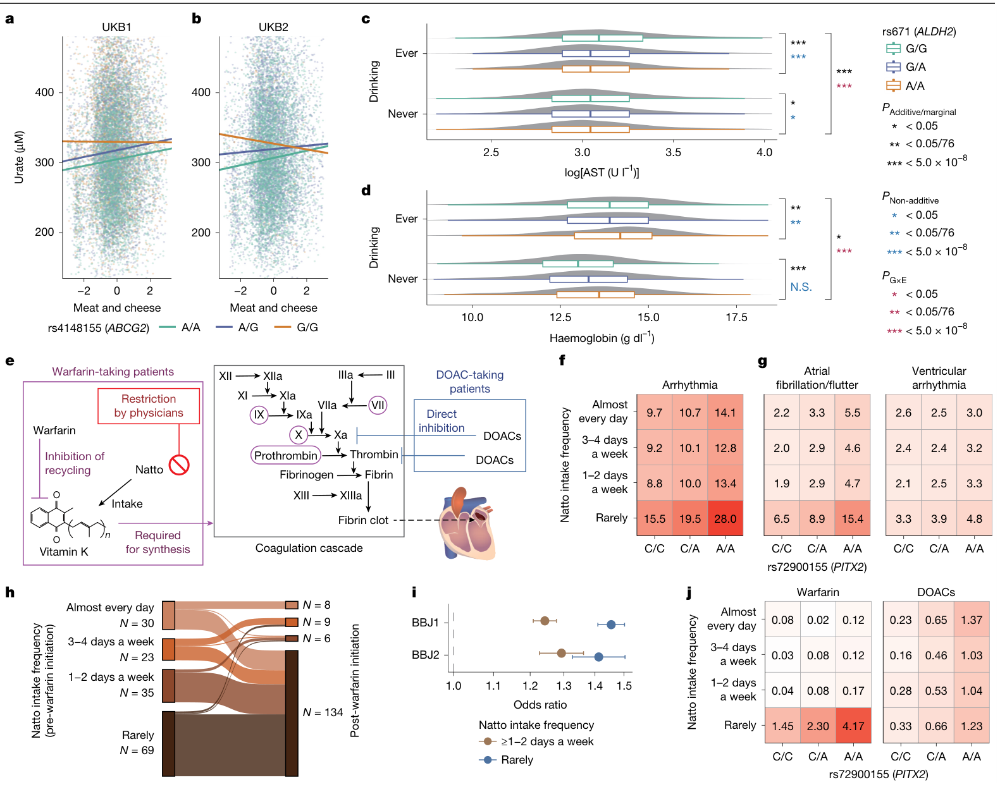
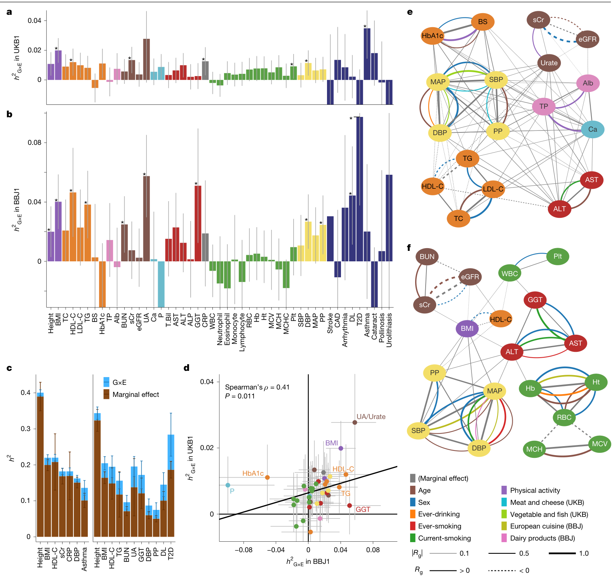
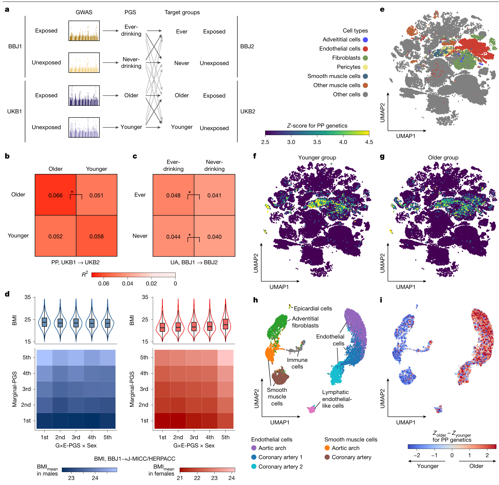
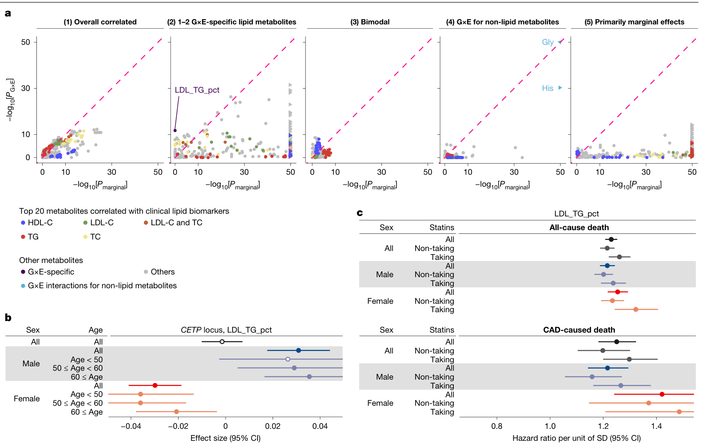

# A cross-population compendium of gene–environment interactions

<!-- wechat-style-reviewed: 2026-09-17 -->

一份遗传风险报告通常把某个变异写成一个固定效应：风险升高多少、指标改变多少。但同一个变异落在较年轻和较年长、男性和女性、饮酒和不饮酒的人身上，效应未必一样。把这些差异全部平均掉，得到的“人群平均效应”可能并不适合眼前这个人。

真正难的是，这类基因–环境相互作用（G×E）很容易在发现队列显著、换一个队列就消失。年龄、性别和生活方式彼此相关，问卷口径又不一致；如果还要对全基因组、几十个性状和多个环境同时检验，多重比较和统计功效会迅速成为瓶颈。

作者把这个问题放到 440,210 名英国和日本发现人群中，平行分析 38 项生物标志物、9 种疾病和 9 个环境因素，再到 539,794 名不同人群中复现。结果不是得到一张处处通用的相互作用清单：跨英国与日本人群的保守共享比例只有 0.41，其中一个信号还会由患病后的饮食改变制造出来。

论文给出的答案更克制，也更有用：遗传效应确实会随年龄、性别和生活方式系统性变化，这些变化会影响遗传度、跨人群多基因预测和候选细胞类型；但 G×E 首先是一个需要复现和因果辨析的统计现象，不能看到“基因×饮食”就直接写成饮食改变了基因作用。

## 01｜为什么固定的全基因组关联效应会漏掉真实差异

常规全基因组关联研究（GWAS）估计的是边际效应：把不同年龄、性别和生活方式的人放在一起，求一个平均的基因型–表型关联。若一个等位基因只在某类人群中起作用，或者在两类人群中方向相反，平均后可能变小甚至接近零。

G×E 检验问的是另一件事：遗传效应是否随某个环境量改变。本文把年龄、性别、饮酒、吸烟以及饮食和运动模式都放在“环境”这个统计学总称下；其中年龄和性别是效应修饰因素，并不等同于可干预暴露。

过去常用方差数量性状位点（vQTL）先筛一遍候选变异，以减轻全基因组检验负担。本文发现 G×E 位点相对一般 GWAS 位点确实富集 vQTL 14.6 倍，但这种预筛仍漏掉 UK Biobank 中 54.8%、Biobank Japan 中 80.6% 的 G×E 信号。换句话说，没有显式环境数据，许多动态遗传效应根本不会进入下一步分析。

## 02｜这项研究到底覆盖了多大范围

发现阶段包括 UK Biobank 发现队列（UKB1）的最多 273,453 人和 Biobank Japan 发现队列（BBJ1）的最多 166,757 人，共 440,210 人；队列内复现使用对应的 UKB2 最多 38,149 人和 BBJ2 最多 65,373 人。外部复现又纳入 All of Us 的欧洲、非洲和美洲人群，以及日本 J-MICC/HERPACC、JPHC 和以色列 HPP，连同队列内复现合计 539,794 人。

作者分析 38 项生物标志物和 9 种疾病，覆盖体格、代谢、肾功能、肝功能、血液、血压和疾病等 10 类性状。9 个环境因素包括年龄、性别、曾经饮酒、曾经吸烟、当前吸烟，以及由问卷聚类得到的 4 个饮食或运动模式；不同性状的有效样本并不相同，所以文中的大多数规模都是 \(N_{max}\)，不是每次回归的固定人数。

图 1 先给出英国与日本的平行发现/队列内复现，再展开到四组外部队列。环形图展示 UKB1 和 BBJ1 的全基因组显著位点、性状类别、跨性状多效性和复现状态；它是一张发现图谱，不代表每个点都已跨人群稳定复现。

## 03｜发现的相互作用能在别的人群中站住吗

UKB1 找到 64 个 G×E 相互作用、分布于 45 个位点；采用研究级 Bonferroni 阈值 \(P<5.3\times10^{-10}\) 后，保留 31 个相互作用、23 个位点。BBJ1 找到 36 个相互作用、15 个位点，Bonferroni 后为 26 个相互作用、8 个位点；其中 21/36 集中在东亚人群特异性较强的 ALDH2 rs671 区域。

队列内复现并不完美。UKB2 对 64 个信号中的 23 个达到名义 \(P<0.05\)，仅 6 个通过校正；BBJ2 对 36 个信号中的 28 个达到名义显著，19 个通过校正。作者还要求贡献环境和效应方向一致，因此这里的“未复现”不只表示 P 值没有过线。

外部复现中，All of Us 欧洲人群通过校正的比例为 17/64（27%），J-MICC/HERPACC 为 20/36（56%）；ALDH2 相关信号在后者复现 17/21（81%）。但把英国和日本放在一起看，排除东亚特异的 ALDH2 后，73 个相互作用中只有 22 个名义复现、9 个通过 \(P<6.8\times10^{-4}\)，保守共享比例 \(\pi_1=0.41\)。非洲人群复现 3 个，美洲人群复现 2 个，以色列 HPP 没有信号达到校正阈值。

因此，这篇论文最重要的跨人群结论不是“相互作用普遍通用”，而是共享与人群特异同时存在。等位基因频率、环境分布、问卷口径和样本量都可能影响一个信号能否被看到；下采样分析还显示检出位点尚未饱和。

## 04｜看到“基因×饮食”，就能解释生物机制吗

局部位点能提供线索，也最容易被过度解释。ABCG2 位点的效应在低“肉类和奶酪”模式人群中更明显，作者用 ABCG2 参与肠道尿酸外排、肉类嘌呤可能遮蔽遗传效应来解释。可是正文把结局写成估算肾小球滤过率（eGFR），Fig. 2a,b 和 Extended Data Fig. 6 的纵轴、图注却都是尿酸；这个图文冲突使机制叙事只能作为候选解释，不能静默选定一个结局。

ALDH2 的情况更复杂。即使调整饮酒相互作用，多个环境仍参与其多效性；曾饮酒者中 19 项标志物有 12 项呈强非加性效应。可是在从不饮酒者中，红细胞、血红蛋白、血细胞比容和白细胞反而呈加性遗传模式。该区域约 2.44 Mb 的长连锁不平衡还覆盖 SH2B3、PTPN11 等造血相关基因，不能把所有现象都归给 rs671 或 ALDH2。

更具警示性的例子是 PITX2、纳豆与心律失常。BBJ1 中 PITX2 位点对总体心律失常的聚合 G×E 为 \(P=2.8\times10^{-12}\)，主要由纳豆驱动；单独检验 G×纳豆时为 \(P=2.1\times10^{-10}\)。Fig. 2i 的分层比较在 BBJ1 纳入 109,642 名纳豆食用者和 49,116 名不食用者，在 BBJ2 纳入 44,954 名食用者和 18,155 名不食用者；真正提供用药前后时间顺序的 Fig. 2h 却只是 157 名有年度 PT-INR 记录的房颤/房扑患者。华法林启动后，“几乎每天”吃纳豆者由 30 人降至 8 人，“很少”吃者由 69 人升至 134 人，不能把前述十余万人的分层样本当作纵向证据。

rs72900155 对房颤/房扑的边际效应量为 0.49（95% CI 0.46–0.52），高于其他心律失常亚型的 0.13（0.10–0.15）；总体效应会随各纳豆摄入层中房颤/房扑所占比例而变化，作者据此解释总体心律失常信号。分开后两类的 G×纳豆分别为 \(P=0.84\) 和 \(2.6\times10^{-4}\)，都未达到研究的多重校正门槛；BBJ2 的总体信号也未复现（\(P=0.40\)）。BBJ2 有 84.9% 的参与者在 2013–2017 年入组，当时直接口服抗凝药（DOAC）已替代超过一半房颤患者的华法林，而这类药物不要求限制纳豆。

图 2 的前半比较 ABCG2、ALDH2 的分层遗传效应，后半把 PITX2、纳豆、华法林/DOAC 和心律失常亚型连起来。纳豆例子支持的是“疾病与用药改变饮食，从而制造统计相互作用”，不是“纳豆导致心律失常”。

补充材料把时间方向检查扩展到有重复测量或可做发病分析的候选。按校正阈值 \(P<5\times10^{-4}\)，至少间隔半年后，BBJ1 的最近一次复测在 31 个“性状–位点”对中有 15 个再次达阈值（\(N_{max}=105{,}339\)，中位间隔 4.0 年），J-MICC/HERPACC 为 11/27（\(N_{max}=37{,}398\)，间隔 5 年），All of Us 欧洲人群为 4/62（\(N_{max}=47{,}292\)，中位间隔 2.2 年）；UKB 重复访视却为 0（\(N_{max}=50{,}958\)）。同一 UKB 子集连基线数据也无法复现，作者把它解释为重复访视者更健康等选择偏倚，而不是简单归因于随访时点。

发病 Cox 分析也提供了一个有用对照：BBJ1 的 ALDH2–2 型糖尿病相互作用仍达到阈值（\(P=5.3\times10^{-5}\)），PITX2–心律失常则没有（\(P=0.077\)），与后者由疾病和用药反向改变纳豆摄入的解释一致。不过，暴露和指标可能长期稳定或同时变化，重复测量仍不能单独证明因果方向。

## 05｜这些动态效应在全基因组层面有多大

把各环境合并估计后，UKB1 有 7 个性状、BBJ1 有 11 个性状呈显著 G×E 遗传度，重叠的是身高、体质指数（BMI）、高密度脂蛋白胆固醇（HDL-C）和舒张压。G×E 与边际遗传度之比在 BMI 明显高于身高：UKB1 为 0.100（95% 置信区间（CI）：0.057–0.142）对 0.028（0.007–0.048），BBJ1 为 0.245（0.130–0.360）对 0.062（0.009–0.115）。

两个人群的 G×E 遗传度相关为 Spearman \(\rho=0.41\)、\(P=0.011\)，仍然只是中等一致。跨性状分析中，UKB1 和 BBJ1 分别有 20 和 29 个显著的“性状–环境”相关对；常规边际遗传相关形成一个较密的网络，G×E 相关则更按肝功能、肾功能、血压等性状类别聚集。

图 3 展示的是模型估计及其 95% CI，不是某个环境“解释了固定百分比疾病风险”。人群间 \(\rho=0.41\) 和类别化网络说明存在共同结构，也同时保留了明显异质性。

## 06｜环境差异会怎样改变多基因预测

作者按环境把发现和复现人群各分成两层，在发现队列的每一层分别做 GWAS、构建多基因评分（PGS），再交叉投到复现队列。预测准确度通常在“构建 PGS 的环境层”与“应用 PGS 的环境层”一致时最高，跨人群后总体衰减。26 个 G×E 遗传度显著的“性状–环境–队列”组合中，20 个至少在一个层内出现显著预测准确度差异；排除英国特异的 BMI–鱼蔬模式后，25 个组合中有 11 个在跨人群预测时也出现差异。

直接由相互作用构建的 G×E-PGS 在独立数据中也有增量信息：25 个性状–环境对中，显著解释表型方差者在人群内有 11 个、跨人群有 9 个。补充表中这些模型的样本量为 27,401–205,759。最突出的 BMI 例子中，加入性别 G×E-PGS 后 \(R^2\) 从 0.110 增至 0.128，相对提高 16%、绝对增加 0.018；除 BMI 外，表中报告的绝对 \(R^2\) 增量为 0–0.005。Fig. 4d 的示例包括 J-MICC/HERPACC 中 30,683 名男性和 40,226 名女性。

## 07｜年龄变化能把遗传效应定位到不同细胞吗

作者以脉压为例：UKB1 的 4 个脉压 G×E 位点都主要由年龄驱动，英国和日本队列都被平分为年轻、年长两组；每个年龄层的脉压样本在 UKB1 为 127,933 人，在 BBJ1 为 73,480 人。跨人群 MAGMA 分析（把 GWAS 信号聚合到基因和通路）提示，年轻组更偏血管平滑肌收缩通路，年长组更偏细胞衰老通路。

将遗传效应投影到人体单细胞参考图谱 Tabula Sapiens 后，两组都富集血管细胞，但相对强度不同。作者从 10x 数据中按“组织–解剖区域–细胞类型”最多抽取 100 个细胞，最终纳入 50,075 个细胞、118 类细胞。猴动脉数据来自 GSE117715，原论文质控后保留 7,989 个细胞；年轻组关联两个平滑肌细胞亚型（\(P=8.3\times10^{-3}\) 和 \(9.4\times10^{-3}\)），年长组关联一个冠状动脉内皮细胞亚群（\(P=2.3\times10^{-3}\)）。补充材料仍没有交代猴的动物数与年龄构成，这些 P 值不能被理解为主要队列的直接组织测量。

脉压与舒张压的遗传相关从年轻组的 0.46（95% CI 0.40–0.53）降到年长组的 0.27（0.19–0.35），而跨年龄脉压遗传相关为 0.42（0.35–0.49）。这些结果支持“调控重心随年龄不同”的模型，但年龄分层是横断面的，单细胞数据来自外部人和猴参考图谱，不能据此证明个体随衰老发生了平滑肌到内皮的机制转换。

图 4a–d 比较 PGS 在同环境层和跨环境层的准确度，并展示 BMI 的二维分层；e–i 把不同年龄层的脉压遗传效应投影到人和猴的单细胞参考图谱。前者尚未提供临床阈值、校准或净获益，后者是富集分析，不是细胞谱系追踪。

## 08｜多组学为什么把性别差异推到了药物边界

以 Results 报告的 57 个临床 G×E 先导变异为遗传侧候选，作者分析 2,924 种蛋白和 325 种代谢物：蛋白组 \(N_{max}\) 在 UKB1/BBJ1 分别为 28,561/2,153，代谢组为 153,410/89,040。蛋白层得到 13 个显著“蛋白–位点”对、覆盖 8 个位点；代谢层得到 2,326 个显著“代谢物–位点”对、覆盖 38 个位点，其中 650 对、15 个位点达到全基因组阈值。合计 40/57（70%）临床位点能在至少一个分子层看到相同环境驱动的信号。

胆固醇酯转运蛋白（CETP）是最需要克制的案例。CETP 位点对低密度脂蛋白（LDL）中甘油三酯占比（LDL_TG_pct）的 G×E 为 \(P=1.8\times10^{-12}\)，边际关联却为 \(P=0.98\)，且男女效应方向相反。效应量分析共 152,356 人，其中女性 81,521 人、男性 70,835 人；死亡分析共 152,584 人，其中女性 81,633 人、男性 70,951 人，他汀使用者 28,876 人、未使用者 123,708 人。LDL_TG_pct 每升高 1 个标准差，与全因死亡和冠心病死亡的风险比（hazard ratio，HR）分别为 1.23（95% CI 1.21–1.25）和 1.25（1.18–1.32）。补充表给出了分层人数，却仍没有逐层事件数。

图 5 以 5 个代表位点展示 5 种“边际效应–相互作用”模式，完整 15 个位点见 Extended Data Fig. 10；图中还展开 CETP–LDL_TG_pct 的性别/年龄分层和死亡关联。作者由此推测 CETP 抑制可能在男女中产生不同代谢后果，甚至帮助理解既往 III 期试验失败；但本文没有重分析药物试验，也没有证明该代谢物介导药物死亡风险，这一层只能保留为假设。

## 09｜这项研究真正改变了什么

第一，它把跨人群 G×E 从零散的“一个位点×一个暴露”扩展为统一框架：同一套流程同时比较英国、日本和其他人群，并把复现标准、贡献环境、遗传度、PGS、单细胞和多组学串起来。公开的汇总统计也使后续研究不必只从显著位点开始。

第二，它把相互作用的用途从“找显著 P 值”推进到模型诊断。环境分层可以指出 PGS 在哪里失准，局部例子可以暴露连锁、反向因果和用药时代变化，多组学则帮助提出更具体的细胞或代谢物假设。

但当前真正可用的仍是研究设计和候选排序，而不是临床工具。论文没有给出跨人群个人风险阈值、校准、决策曲线或前瞻干预效果；BMI 的 16% 是单个例子的相对 \(R^2\) 增益，不能扩写成所有性状或所有人群的普遍改善。

## 10｜对肿瘤流行病学有什么可借鉴

肿瘤研究里最容易照搬的不是某个 G×E 位点，而是四步验证顺序。先预注册暴露定义和时间窗，再在发现队列同时估计边际效应与交互效应；复现时要求暴露口径、效应方向和比较人群一致；最后才用纵向数据、药物记录或多组学拆分因果方向。

对饮酒、吸烟、肥胖、感染和用药等暴露，还应把“诊断后改变行为”当作默认竞争解释。例如癌症或癌前病变会改变饮食、体重和药物使用，如果只分析基线附近的横断面问卷，完全可能复制 PITX2–纳豆式的反向因果。

迁移到中国肿瘤队列时，需要重新校准等位基因频率、暴露分布、问卷聚类、分层阈值和 PGS；还要保留绝对风险、校准和决策效用，而不只报告交互 P 值。本文没有肿瘤预防干预，也不能据其 CETP、ALDH2 或其他位点直接提出治疗建议。

## 11｜这些结果仍需要冷静看待

第一，发现阶段主要是英国欧洲祖源和日本人群。外部复现增加了非洲、美洲和以色列人群，但样本量和环境测量远小于两大生物样本库；\(\pi_1=0.41\) 本身就说明跨人群共享只是中等，不能把英国或日本的环境分层直接移植到其他人群。

第二，年龄、性别和自报生活方式被放在同一个“环境”框架中。问卷项目先经过数值化、聚类和第一主成分压缩，诸如“肉类和奶酪”只是复合模式标签，不是单一食物剂量；相关暴露下的逐步选择还可能受顺序和共线性影响。

第三，G×E 不等于环境引起基因效应变化。PITX2–纳豆明确展示了疾病、用药和行为改变造成的反向因果；ABCG2 的正文结局与图轴还存在 eGFR/尿酸冲突。重复测量只验证了部分信号，UKB 重复访视还出现明显选择偏倚；指标与暴露长期稳定时，先后测量也未必能定因果。

第四，PGS、遗传度和细胞类型结果仍是统计模型。本文没有证明 G×E-PGS 改善临床结局；脉压的年龄二分不是纵向衰老，Tabula Sapiens 和猴动脉投影也不是对生物样本库参与者血管的直接测量。

第五，CETP 的药物推论跨越了“遗传变异—代谢物—观察性死亡—药理抑制”多层证据。Fig. 5 的先导变异是 rs12720908，正文机制推断又引用 rs1801706；没有共定位、药物随机化或试验级性别交互，就不能声称已经解释女性风险或试验失败。

最后，官方补充 PDF 和 Supplementary Tables 1–34 已能闭合外部队列、逐性状样本、遗传度、PGS、scRNA、精细定位与共定位的大部分参数，但仍没有单独的 Source Data、作者全流程仓库、容器和随机种子。All of Us 没有饮食/运动问卷，JPHC 与 J-MICC/HERPACC 又用自报糖尿病代替 2 型糖尿病；Reporting Summary 还把 UKB2 两次写成 8,149，而主文、Fig. 1 和复现总数均支持 38,149。完整缺口和冲突见技术附录。

---

## 技术附录

### 论文基本信息

- 期刊：Nature 651, 688–697
- 在线发表：2026-01-28；卷期日期：2026-03-19
- DOI：10.1038/s41586-025-10054-6
- 第一作者与通讯作者：Shinichi Namba
- 末位作者与通讯作者：Yukinori Okada
- 作者：Shinichi Namba、Kyuto Sonehara、Yuriko N. Koyanagi、Takezo Kikuchi、Takafumi Ojima 等；完整作者名单见 PDF 首页
- 研究领域：遗传流行病学、基因–环境相互作用、跨人群遗传学、多基因预测、多组学
- 关键词：G×E、UK Biobank、Biobank Japan、cross-population、polygenic score、heritability、scRNA-seq、metabolomics
- 数据来源：UK Biobank、Biobank Japan、All of Us、J-MICC/HERPACC、JPHC、Human Phenotype Project；另使用 Tabula Sapiens 和猴动脉单细胞参考数据
- 汇总统计：NBDC Human Database `hum0197.v26.374-traits.v1`；GWAS Catalog `GCST90681837–GCST90690020`
- 受控数据：UK Biobank application 47821；BBJ `JGAS000114`、`JGAS000412`、`JGAS000561`、`JGAS000785`
- 代码来源：原文只列公共软件及版本，没有作者完整分析仓库、commit、容器或随机种子
- 本地 PDF：`pdfs/processed/cross-population-gene-environment-interactions-nature-2026.pdf`
- 全文证据包：`tmp/2026-cross-population-gxe-llm-pack.md`
- 解析清单：`tmp/2026-cross-population-gxe-manifest.json`
- inbox/processed SHA-256：`0be64f026249e0e6acb10e2864e5e7b2579d9a829c1de58d614d92d145971930`
- 官方补充 PDF：[Supplementary Information](https://media.springernature.com/original/springer-static/esm/art%3A10.1038%2Fs41586-025-10054-6/MediaObjects/41586_2025_10054_MOESM1_ESM.pdf)，45 页，SHA-256 `279a6a3925a0f6e81da9300233e9415b26cf6e28f2e889fda8cf14607e6bc435`
- 官方补充表：[Supplementary Tables](https://media.springernature.com/original/springer-static/esm/art%3A10.1038%2Fs41586-025-10054-6/MediaObjects/41586_2025_10054_MOESM3_ESM.xlsx)，Table of contents + TableS1–S34，SHA-256 `6579f2cc213a01e08d9bba442b79b01a88ce6df42d3e2e424b5ac2e3847d376c`

### 主文与补充材料的解析质量和覆盖

- 抽取方式：运行 `scripts/build_pdf_llm_pack.py`，引擎为 PyMuPDF；PDF 33 页，33/33 页均有可读文字，共 1,074 个句子 ID。
- 可读内容：题名、摘要、主文、Fig. 1–5、主 Methods、数据/代码声明、Extended Data Fig. 1–13 和 Reporting Summary。
- 官方补充 PDF 同法抽取，45/45 页有可读文字，共 558 个句子 ID；另逐表读取 TableS1–S34。补充材料只在系统临时目录核验，没有写入仓库。
- 仍未定位到独立 Source Data；作者也没有提供完整分析仓库、容器、全流程随机种子和猴动脉数据的动物数/年龄构成。
- 自动分节严重失真：manifest 报 `results=298`、`methods=71`、`supplementary=393`。实际 220 个 Results prose 中仅 126 个被标为 results；`P010.S0084–P010.S0154` 的 71 个参考文献、出版说明和作者单位又被错标 Results。主 Methods 的 121 个 ID 中有 69 个被错标 supplementary；Reporting Summary 的 19 个模板/作者回答 ID 被错标 Methods。
- 版面问题：双栏文字、主图图层和正文交错；`P005.S0056` 与 `P006.S0016` 必须跨 Fig. 3 合读，`P008.S0025–P008.S0031` 被 Fig. 5 图层切断。`P004.S0030` 只有图轴文字，但正文残片被误塞入 heading 元数据；`P007.S0020` 为图注与正文续词混合。
- 低置信内容：首页摘要与引言顺序错置，Fig. 1/2/4/5 的轴标签和图注被拆成独立句子；Methods 的跨页断句见 `P011.S0002–S0003`、`P011.S0059–P012.S0001`、`P012.S0056–P013.S0001`。Reporting Summary 勾选框版面坍塌，`n/a`、`Confirmed`、`Involved` 不能可靠对应模板问题。

| 互斥内容块 | 来源 ID | 数量 | 处理 |
|---|---|---:|---|
| 题名、摘要与引言 | `P001.S0001–P001.S0027` | 27 | 题名、作者、核心问题与摘要交叉核对 |
| Results 物理区域 | `P002.S0001–P009.S0036` | 375 | 220 个 prose Results + 155 个图轴/图注/页脚/混合图层，375/375 已分类 |
| Discussion 与 Online content | `P009.S0037–P009.S0044` | 8 | 7 个 Discussion + 1 个在线材料入口 |
| 主文参考文献 | `P009.S0045–P010.S0131` | 216 | 不当作 Results |
| 出版说明与许可 | `P010.S0132–P010.S0138` | 7 | Publisher's note、CC BY-NC-ND 4.0 与版权 |
| 作者单位 | `P010.S0139–P010.S0154` | 16 | 作者与通讯信息核对 |
| 主 Methods | `P011.S0001–P013.S0006` | 121 | 121/121 完整分组 |
| Reporting pointer、数据与代码声明 | `P013.S0007–P013.S0021` | 15 | 数据/代码边界 |
| Methods 参考文献 | `P013.S0022–P013.S0089` | 68 | 不当作 Methods 参数 |
| 致谢、贡献、利益冲突与出版说明 | `P013.S0090–P014.S0031` | 55 | 资助与声明核对 |
| Extended Data Fig. 1–13 | `P015.S0001–P030.S0009` | 76 | 逐图审计；跨页图注合读 |
| Reporting Summary | `P031.S0001–P033.S0038` | 90 | 设计补充与模板解析边界 |
| **全文** | — | **1,074/1,074** | **无未分类 ID** |

补充 PDF 的自动分节同样不可靠，以下按物理页面和内容人工互斥分类。`SI:` 前缀专指补充 PDF，避免与主文同名页码 ID 混淆。

| 补充内容块 | 来源 ID | 数量 | 处理 |
|---|---|---:|---|
| 目录、作者与 BBJ 成员 | `SI:P001.S0001–P007.S0008` | 93 | 前置材料，不当作结果或方法 |
| Supplementary Notes 2–11 与 Supplementary Fig. 1–3 | `SI:P008.S0001–P029.S0004` | 171 | 逐 Note 审计，保留图层和正文混合边界 |
| Supplementary Methods | `SI:P030.S0001–P043.S0006` | 182 | 队列、复现、纵向、PGS、遗传度、fine-map 与单细胞参数 |
| 补充参考文献 | `SI:P044.S0001–P045.S0018` | 112 | 不当作 Methods 参数 |
| **补充 PDF** | — | **558/558** | **无未分类 ID** |

补充工作簿共 35 个工作表，即目录页加 TableS1–S34；34 个数据表共有 20,090 个非空行、447,536 个非空单元格。这里包括标题、表头和注释，不等于观察数。下列为各 sheet 的实际使用区域，所有数据 sheet 均无公式；目录页的超链接公式不参与数据核对。

| 内容 | Sheet 与使用区域 |
|---|---|
| 样本、表型、环境与通胀 | S1 `265×19`；S2 `45×8`；S3 `26×16`；S4 `128×6`；S5 `100×9` |
| 发现、既往研究与复现 | S6 `1206×41`；S7 `4586×8`；S8 `50×11`；S9 `92×11`；S10 `306×24`；S11 `68×12`；S12 `10×25`；S13 `33×12` |
| ALDH2 与纵向/PheWAS | S14 `47×24`；S15 `81×11`；S16 `64×27`；S17 `198×23`；S18 `65×13`；S19 `212×20`；S20 `25×27` |
| 遗传度、遗传相关与 vQTL | S21 `1132×8`；S22 `53×8`；S23 `1033×13` |
| PGS 与单细胞 | S24 `106×11`；S25 `25×15`；S26 `37×14` |
| 蛋白/代谢物与精确分母 | S27 `5851×20`；S28 `655×22`；S29 `19×72`；S30 `2332×71`；S31 `184×5`；S32 `94×5` |
| 全基因组代谢物扩展 | S33 `971×106`；S34 `55×5` |

关键数量可从工作簿闭合：S1 支持 UKB2 \(N_{max}=38{,}149\)。S27 有 5,846 个数据行，即两队列各 2,923 个 Olink ID；S28 有 650 行，即两队列各 325 个代谢物。S29 为 13 个显著“蛋白–位点”对、8 个位点；S30 为 2,326 个“代谢物–位点”对、38 个位点、322 个性状标签。两表合并为 40 个不同临床 G×E 位点，其中 6 个同时出现。S33 的阈值为 \(7.7\times10^{-11}\)，964 个数据行由 UKB1 736 个和 BBJ1 228 个“代谢物–位点”对组成，覆盖 37 个不同位点。

### 主图与完整图注

| 原文图表 | 样本与比较 | 核心信息 | 图像文件 | 正文位置 |
|---|---|---|---|---|
| Fig. 1 | UKB1/2、BBJ1/2 与四组外部队列 | 跨人群发现、复现、位点类别与多效性 | `assets/precision-medicine/2026-cross-population-gxe/fig1-cross-population-atlas.png` | [正文 02–03](#02｜这项研究到底覆盖了多大范围) |
| Fig. 2 | ABCG2、ALDH2、PITX2 的基因型×环境分层 | 局部解释、长 LD 与纳豆/抗凝治疗反向因果 | `assets/precision-medicine/2026-cross-population-gxe/fig2-representative-loci.png` | [正文 04](#04｜看到基因×饮食，就能解释生物机制吗) |
| Fig. 3 | UKB1 与 BBJ1 全基因组估计 | G×E 遗传度、边际遗传度和跨性状相关 | `assets/precision-medicine/2026-cross-population-gxe/fig3-genome-wide-consistency.png` | [正文 05](#05｜这些动态效应在全基因组层面有多大) |
| Fig. 4 | 环境分层 PGS；Tabula Sapiens 与猴动脉 scRNA | 预测迁移差异、BMI 性别分层、脉压年龄细胞投影 | `assets/precision-medicine/2026-cross-population-gxe/fig4-polygenic-prediction-and-aging.png` | [正文 06–07](#06｜环境差异会怎样改变多基因预测) |
| Fig. 5 | 15 个代谢物 G×E 位点；CETP 分层与死亡结局 | 性别不一致脂质遗传效应及药物假设边界 | `assets/precision-medicine/2026-cross-population-gxe/fig5-sexual-dimorphism-lipid-metabolites.png` | [正文 08](#08｜多组学为什么把性别差异推到了药物边界) |

#### Fig. 1 完整 panel 注释

- a：示意同一基因型效应随吸烟、饮酒、饮食和活动改变；这是概念图，不是估计值。b：UKB1/2、BBJ1/2 和外部复现队列；发现总数 440,210，全部复现总数 539,794。c、d：UKB1 的全基因组显著相互作用、复现点大小、跨人群共享位点、多效性和各性状检出数。e、f：BBJ1 的对应展示。来源：`P002.S0001–P002.S0038`、`P003.S0001–P003.S0017`。
- 圆图点大小反映复现 P 值/状态，颜色反映性状类别；“最近基因”不是因果基因。Fig. 1b 的 UKB2 为 38,149，与主文和总数闭合；Reporting Summary 的 8,149 作为冲突保留。

#### Fig. 2 完整 panel 注释

- a、b：UKB1/2 中 ABCG2 rs4148155、饮食模式与尿酸的散点；每个基因型随机展示 5,000 点，回归线使用全部参与者。正文却写 eGFR，图轴/图注写尿酸。c、d：BBJ1 中 ALDH2 rs671、饮酒与 AST/血红蛋白；箱线图为中位数、四分位和 1.5×IQR。来源：`P004.S0017–P004.S0029`、`P004.S0048–P004.S0053`。
- e：华法林、维生素 K、纳豆与 DOAC 作用关系。f、g：BBJ1 总体心律失常及房颤/房扑、室性心律失常的患病率热图。h：157 名有年度 PT-INR 记录的房颤/房扑患者在华法林前后纳豆频率；启动前四档为 30/23/35/69 人，启动后为 8/9/6/134 人，四档人数来自 Fig. 2h 图层的视觉读取。i：PITX2 rs72900155 对心律失常的 OR，按纳豆频率分层；BBJ1 纳豆食用/不食用为 109,642/49,116，BBJ2 为 44,954/18,155，Firth logistic regression 与 95% CI。j：BBJ2 按华法林/DOAC 分层的房颤/房扑热图。来源：`P004.S0013–P004.S0016`、`P004.S0044–P004.S0047`、`P005.S0001–P005.S0021`。

#### Fig. 3 完整 panel 注释

- a、b：UKB1、BBJ1 聚合全部环境后的 G×E 遗传度，星号为 FDR<0.05。c：G×E 与边际遗传度并列，误差线为 95% CI。d：两人群 G×E 遗传度散点，Deming regression 处理两轴估计误差，相关 P 值为双侧 Spearman。e、f：边际与 G×E 跨性状遗传相关网络；线宽为 \(|R_g|\)，虚线为负相关。来源：`P005.S0031–P005.S0044`、`P006.S0001–P006.S0037`。
- 逐性状、逐环境集样本量见 Supplementary Table 1。图中比例是遗传度模型估计，不是环境可干预的绝对风险份额。

#### Fig. 4 完整 panel 注释

- a：在发现队列按环境分层做 GWAS/PGS，再投向复现队列的同层和异层。b、c：脉压×年龄、尿酸×饮酒的人群内 \(R^2\)，星号为 FDR<0.05。d：BBJ1 性别 G×E-PGS 在 J-MICC/HERPACC 对男性/女性 BMI 的相反分层；男性 30,683、女性 40,226，箱线图为中位数、四分位与 1.5×IQR。来源：`P005.S0053–P007.S0024`、`P007.S0037`。
- e–g：Tabula Sapiens 10x 子集；每个 tissue–anatomy–cell type 随机下采样 100 个细胞，显示年轻/年长组脉压遗传效应。h、i：猴动脉细胞图谱及两年龄组差值。它们是 scDRS/MAGMA 富集投影，不是参与者组织的纵向测量。来源：`P007.S0025–P008.S0034`。各血压性状的年龄层样本量属于 Extended Data Fig. 9 h、i，见下方 ED9 条目。

#### Fig. 5 完整 panel 注释

- a：5 个代表位点展示代谢物边际 P 与 G×E P，三角表示 \(P<10^{-50}\)；完整 15 位点见 Extended Data Fig. 10。五类是描述性模式，不是预注册分类器。b：CETP rs12720908 对 LDL_TG_pct 的性别和年龄分层效应。c：LDL_TG_pct 与全因/冠心病死亡的 Cox HR，按性别和基线他汀分层，均给 95% CI。来源：`P008.S0001–P008.S0011`、`P008.S0026–P008.S0030`、`P009.S0001–P009.S0018`。
- Supplementary Table 31 的效应量分析为 152,356 人，Table 32 的死亡分析为 152,584 人；后者按性别为 81,633/70,951，按他汀为 28,876/123,708，但没有逐层事件数。他汀分层不是随机化，存在适应证混杂；遗传–代谢物结果不能直接等同 CETP 抑制药效。

### Results 证据覆盖审计

严格 prose Results 共 220 个 ID。物理 Results 区域 `P002.S0001–P009.S0036` 还含 155 个图轴、图注、页脚和混合图层，已在主图与解析质量部分分类，因此区域覆盖为 375/375。

| 原文句子 ID | 数量 | 忠实中文含义 | 正文对应 | 证据边界 |
|---|---:|---|---|---|
| `P002.S0016`、`P002.S0035–P003.S0017` | 22 | 四个发现/复现子队列、38+9 个性状、9 个环境；UKB1 64/45、BBJ1 36/15，Bonferroni 后 31/23 与 26/8 | 01–03 | 均为 \(N_{max}\)；联合 Cauchy 检验不指定单一机制 |
| `P003.S0018–P003.S0026` | 9 | UKB2 与 BBJ2 队列内复现；ALDH2×饮酒对血红蛋白和 T2D | 03 | 调整血红蛋白后仍显著不等于排除全部中介 |
| `P003.S0027`、`P003.S0029–P003.S0059` | 32 | All of Us/J-MICC/JPHC 外部复现、跨人群共享、AFR/AMR/HPP 与下采样 | 03 | `P003.S0027–S0029` 错栏，70,909 需视觉核对；共享度中等 |
| `P003.S0060–P003.S0061`、`P004.S0021–P004.S0029`、`P004.S0048–P004.S0055` | 19 | 饮食相关位点、ABCG2/ALDH2、非加性模式、长 LD 和候选基因排序 | 04 | ABCG2 正文 eGFR 与图中尿酸冲突；Enformer 仅优先级排序 |
| `P005.S0001–P005.S0030` | 30 | PITX2–纳豆反向因果、ALDH2 生存和疾病多效性 | 04 | 观察性时间顺序；疾病 PheWAS 是预选变异扫描 |
| `P005.S0031–P005.S0052` | 22 | G×E 遗传度、跨性状相关和 vQTL 漏检 | 01、05 | 遗传度比例不是可干预风险比例；vQTL 受正态化影响 |
| `P005.S0053–P005.S0056`、`P006.S0016–P006.S0022`、`P006.S0038–P006.S0043`、`P007.S0021–P007.S0024`、`P007.S0041` | 22 | 环境分层 PGS、跨人群迁移、BMI 16% 相对 \(R^2\) 增益 | 06 | 多处被图层切断；其他组合增益较小，缺临床校准 |
| `P007.S0042–P007.S0043`、`P008.S0011–P008.S0025`、`P008.S0031–P008.S0036` | 23 | 脉压年龄分层、通路、单细胞与遗传相关变化 | 07 | 横断面年龄二分、跨物种参考投影，不证明细胞转变 |
| `P008.S0037–P008.S0041`、`P009.S0001–P009.S0036` | 41 | 蛋白/代谢物 G×E、CETP、TNFAIP8 和全基因组代谢组扩展 | 08 | Results/Methods 有 2,924/2,923 与 57/56 口径差；药物推论未直接验证 |
| **prose Results** | **220/220** | 按原始顺序全部覆盖 | — | **未覆盖 0** |

#### 主叙事外仍需保留的 Results 细节

| 原文句子 ID | 忠实中文含义 | 解释与边界 |
|---|---|---|
| `P005.S0022–P005.S0023` | 作者用重复生物标志物、发病 Cox 和总生存分析检查其他位点的时间方向；ALDH2 位点总生存 G×E 为 \(P=1.7\times10^{-11}\)，贡献项为性别、曾经饮酒和年龄。 | 这是观察性生存相互作用，未给效应量，也不能据 P 值断言这些因素延长或缩短寿命。 |
| `P005.S0024–P005.S0030` | 候选位点 PheWAS 在 UKB1 新见 APOE–血脂异常 G×E（\(P=3.8\times10^{-7}\)，FDR<0.05）；BBJ1 有 11 项显著结果，含 ALDH2–食管癌；HLA-DQB1–类风湿关节炎 G×年龄为 \(P=1.2\times10^{-6}\)。 | 这是对预先选定先导变异的疾病扫描，不是全基因组 PheWAS；多效性与共享机制仍需区分。 |
| `P009.S0007`、`P009.S0019–P009.S0022` | 在第二类脂质位点中，性别是 568/664（86%）个“代谢物–位点”对的首要贡献项；同类 G×E-specific 信号均呈男女相反方向，部分效应还随年龄变化。 | “均相反”限于作者定义的该模式，不代表全部代谢物或全部性别差异；年龄解释仍属待验证假设。 |

补充 Note 6 还显示，ALDH2 的每个信号平均由 3.38 个环境贡献（范围 2–7），高于 BBJ 其他位点的 2.00（1–4）和 UKB 的 2.17（1–5）。在对饮酒状态的 G×E 作条件调整后，21 个信号仍有 13 个达到全基因组阈值；进一步以 \(\log(1+\text{每周饮酒克数})\) 调整后仍有 8 个。来源：`SI:P016.S0001–P016.S0006`、Supplementary Table 14。这里支持“饮酒不足以解释全部信号”，并不排除长 LD、测量误差或其他相关暴露。

补充 Note 9 将 vQTL 结果拆得更清楚：UKB1/BBJ1 分别有 246/71 个显著“性状–位点”对；UKB1 的 eGFR 与 GGT 占 100 个，其中 73 个在 rank-based inverse normal transformation 后消失。排除这两类性状后，vQTL 与 G×E 重叠 26/169（15.4%），相对一般 GWAS 的 66/6,251（1.1%）富集 14.6 倍，但仍只捕获 26/80（32.5%）个 G×E。来源：`SI:P023.S0001–P024.S0006`、Supplementary Table 23。偏态、异方差和 G×G 同样可能产生 vQTL，因此“富集”与“可替代显式环境检验”不是同一结论。

物理区域中不计入 prose 的 155 个 ID 为：`P002.S0001–S0015`、`P002.S0017–S0034`（33）；`P003.S0028`（1）；`P004.S0001–S0020`、`P004.S0030–S0047`、`P004.S0056`（39）；`P006.S0001–S0015`、`P006.S0023–S0037`（30）；`P007.S0001–S0020`、`P007.S0025–S0040`（36）；`P008.S0001–S0010`、`P008.S0026–S0030`、`P008.S0042`（16）。其中 `P004.S0021`、`P006.S0016`、`P008.S0011` 等仍是正文/图注混合原子，按其 Results 语义纳入上表并在主图注释中同时审计。

### Supplementary Notes 证据覆盖审计

| 补充内容 | 来源 ID | 数量 | 关键结论与边界 |
|---|---|---:|---|
| Note 2 + Supplementary Fig. 1 | `SI:P008.S0001–P011.S0002` | 21 | 人工筛选既往 G×E 文献；排除疑似膨胀研究含主观判断 |
| Note 3 | `SI:P012.S0001–P013.S0005` | 19 | 与近期 UKB 研究重叠；检验集合与环境定义不同 |
| Note 4 | `SI:P014.S0001–P014.S0011` | 11 | G×E 与 GWAS 复现率比较；P 值匹配属于事后可比性分析 |
| Note 5 | `SI:P015.S0001–P015.S0006` | 6 | 跨 UKB/BBJ meta 新增信号；正文表号与工作簿编号冲突 |
| Note 6 | `SI:P016.S0001–P016.S0007` | 7 | ALDH2 多环境贡献；条件调整不能消除长 LD 和残余混杂 |
| Note 7 + Supplementary Fig. 2 | `SI:P017.S0001–P019.S0003` | 16 | Enformer 筛选 ALDH2 区域候选；预测不是功能验证 |
| Note 8 | `SI:P020.S0001–P022.S0006` | 34 | 重复测量、发病和总生存检查时间方向；选择偏倚与暴露稳定性仍限制因果解释 |
| Note 9 + Supplementary Fig. 3 | `SI:P023.S0001–P026.S0009` | 30 | vQTL 只覆盖 26/80 个 G×E 对；偏态和其他非加性机制也会产生 vQTL |
| Note 10 | `SI:P027.S0001–P027.S0010` | 10 | TNFAIP8 精细定位/共定位均未锁定因果变异 |
| Note 11 | `SI:P028.S0001–P029.S0004` | 17 | 跨分辨率 G×E 的临床与生物学含义；属于解释框架而非临床证据 |
| **Supplementary Notes** | — | **171/171** | **未覆盖 0** |

Note 10 的失败结果本身需要保留：SuSiE 对边际效应和 G×E 各估计 1 个因果变异，但 95% credible set 分别含 9 和 14 个变异；FINEMAP 两边都推断 5 个，恰好达到默认上限。coloc 的 H3/H4 后验概率为 33%/67%，不足以区分“不同”或“相同”因果变异，作者因此把该位点定性为复杂 LD 下未解析，而不是定位成功。

### Methods 与复现信息

#### 队列、基因型与人群定义

- BBJ 是医院型生物样本库，共 267,289 名至少被诊断一种目标疾病的参与者。BBJ1 182,536 人使用 Illumina HumanOmniExpressExome，或 HumanOmniExpress 加 HumanExome 芯片；BBJ2 68,534 人使用 Illumina Asian Screening Array。完成 QC 和人群/亲缘筛选后，BBJ1 分析 166,757 名日本人，BBJ2 分析 65,373 人。BBJ1 以 Minimac3、1000 Genomes phase 3 加 1,037 份日本 WGS 插补，保留 Rsq≥0.7、MAF≥0.01 的 7,444,735 个常染色体变异；BBJ2 使用 Shapeit4/Minimac4 和同一参考，另有 call rate、MAC、HWE 与二级亲缘过滤。来源：`P011.S0001–P011.S0020`。
- UKB 约 50 万名 40–69 岁参与者，使用 UK BiLEVE Axiom 或 UK Biobank Axiom 芯片；基因型由 IMPUTE4 以 Haplotype Reference Consortium、UK10K 和 1000 Genomes Project phase 3 的联合参考插补。UKB1 取自报 British 与遗传学 `Caucasian` 的交集，排除三级以内亲缘的一人；UKB2 使用其余遗传学 `Caucasian` 参与者，并排除与 UKB1 二级以内亲缘者。保留 imputation quality>0.7、MAF>0.01 的 9,813,264 个常染色体变异，并排除性染色体非整倍体、遗传/自报性别不一致及杂合度/缺失异常者。来源：`P011.S0021–P011.S0031`。
- J-MICC 是 2005 年启动的约 10 万人前瞻性人群队列，入组年龄 35–69 岁；HERPACC 是 2001–2013 年癌症中心初诊、年龄 ≥18 岁的医院队列，本分析为贴近人群队列而排除癌症或肿瘤史。多种芯片数据分别检验后做固定效应 meta，插补参考来自 11,942 名日本人的 WGS。来源：`SI:P030.S0002–P031.S0010`。
- JPHC 于 1990–1994 年在 11 个地区招募 40–69 岁居民，本研究从 9 个地区随机抽取 13,024 名完成体检和问卷者；三种芯片合并 QC 后同样用 11,942 名日本人 WGS 参考插补。来源：`SI:P032.S0001–P033.S0001`。
- All of Us 使用 version 8 WGS ACAF-threshold 数据，祖源归属概率需 >0.5，并排除 KING kinship coefficient >0.1 的亲属。HPP 则是以色列 40–70 岁志愿者、以 Ashkenazi Jewish 为主；其纳入条件排除近期抗生素、胃肠道疾病和目标结局，颊拭子经 0.5×/1× low-pass WGS、150-bp paired-end 测序和 1000 Genomes 插补。来源：`SI:P033.S0003–P034.S0007`。

#### 表型、疾病与时间结构

- UKB 使用基线评估，BBJ 使用最接近基线的病历测量；时间顺序分析改用至少距基线半年、且尽可能晚的重复测量。两库都排除 <18 或 >85 岁、特定影响表型的疾病，并将低于 \(Q1-3\times IQR\)、高于 \(Q3+3\times IQR\) 或超出均值 ±3 s.d. 的测量视为极值；同时对降压药/他汀用药作数值校正，右偏性状取自然对数。来源：`P011.S0037–P011.S0043`。
- UKB 疾病结合 ICD-10、OPCS-4 和自报；BBJ 使用合作医院诊断与病历既往史。T2D 分型排除其他糖尿病，缺血性卒中限制为有非自报证据者。PheWAS 只测试每队列病例数 >1,000 的疾病：UKB1 为 35 种疾病×49 个先导变异，BBJ1 为 52×38，不是全基因组疾病扫描。来源：`P011.S0044–P011.S0050`、`P012.S0010–P012.S0014`。
- 外部队列沿用主队列表型 QC，但 All of Us 使用最新电子病历值，并根据各单位标签的中位数纠正频繁出现的单位误标；JPHC 与 J-MICC/HERPACC 只有自报糖尿病史，因此以 diabetes mellitus 代替 T2D 做复现。来源：`SI:P034.S0007–P035.S0001`。
- 纵向生物标志物验证取至少半年后的最近测量：BBJ1 中位 4.0 年、\(N_{max}=105{,}339\)，J-MICC/HERPACC 为 5 年、\(N_{max}=37{,}398\)，UKB1 中位 5.0 年、\(N_{max}=50{,}958\)，All of Us 中位 2.2 年、\(N_{max}=47{,}292\)。发病分析排除基线或半年内病例；总生存 Cox 测试 54 个发现位点。来源：`SI:P020.S0003–P022.S0006`、Supplementary Tables 17–18。

#### 环境问卷与聚类

- 饮食和活动问卷缺失率为 UKB1 0.01–0.27%、BBJ1 1.4–13.3%。类别频率转为连续值，例如“几乎每天/每周 3–4 天/每周 1–2 天/很少”映射为 7/3.5/1.5/0；不知道或拒答记为缺失。来源：`P011.S0051–P011.S0057`。
- 聚类前回归年龄、性别、年龄平方、年龄×性别、年龄平方×性别；以 \(1-r_{Pearson}\) 为距离、Ward 层次法做 ConsensusClusterPlus，候选簇数 2–10，依据 CDF 稳定性和 item tracking 选择。每簇取第一主成分、统一方向、标准化并排除 ±3 s.d.；UKB 咖啡值先乘 −1 以匹配茶的方向。来源：`P011.S0058–P012.S0009`。
- 因此“肉类和奶酪”“日本料理”等是多个问卷项目的潜在模式，不是单一食物摄入量。复现队列预先把体力活动单列成簇，只对饮食题项再聚类；JPHC 只使用两版问卷共有题项，All of Us 没有饮食和体力活动问卷、不能做这部分聚类。来源：`SI:P035.S0005–P035.S0010`、Supplementary Table 4。

#### G×E 模型、阈值与环境归因

- 定量和二分类性状用 GEM 线性/逻辑回归和 model-robust sandwich SE；二分类候选达到 \(P<5\times10^{-8}\) 后以 Firth logistic regression 重估。时间结局用 `survival` Cox；基线已有或半年内发病者从 incident 分析排除。除另有说明外，检验均为双侧；Extended Data Fig. 9 的 MAGMA/scDRS 明确使用单侧检验。来源：`P012.S0027–P012.S0034`、`P025.S0006–P025.S0008`。
- 对不同环境集合分别检验后，使用 Cauchy/ACAT 聚合每变异 P 值；P 被计算为 0（<\(10^{-300}\)）时用 Rmpfr、最高 10,000-bit 精度重算。变异级阈值为 \(5\times10^{-8}\)，另报告研究级 Bonferroni。ACAT 不是效应量 meta，且不要求任一单独环境项先显著。来源：`P012.S0035–P012.S0042`。
- 贡献环境通过 backward elimination 排序，再按顺序逐项加回；线性模型以 likelihood improvement、Firth 模型以 Wald P 排除，最终加回要求 likelihood-ratio \(P<0.05\)。相关环境下该程序可能顺序依赖。来源：`P012.S0043–P012.S0047`。
- UKB 协变量为前 20 个 PCs、芯片、年龄平方及年龄×性别/年龄平方×性别；其他队列用前 10 PCs 和后三项。作为交互项的年龄、性别和环境主效应自动入模；BBJ 定量性状/生存另调目标疾病，代谢组另调他汀。性别特异疾病的 PheWAS 去掉性别环境项及年龄×性别、年龄平方×性别协变量。同一 locus 定义为显著变异相距 <500 kb。来源：`P012.S0048–P012.S0054`。
- G×E 总遗传度不是直接相加相关环境的估计：作者先以 Gram–Schmidt 正交化环境，再汇总各交互项遗传度；G×E/边际遗传度比用 delta method，两个生物样本库的 liability 转换统一采用 UKB 患病率，标准误为 200-block jackknife。遗传度使用单侧检验，遗传相关使用双侧检验。来源：`SI:P038.S0008–P039.S0002`。

#### 代谢组、蛋白组、PGS 与单细胞投影

- Nightingale NMR 数据用 `ukbnmr` 去除样本准备到检测时长、96 孔板位置和分光仪日期批次；249 个直接标志物加 76 个派生比值，共 325 个。除年龄和上述极值规则外，肌酐分析排除 eGFR<15，白蛋白排除肝病、血液恶性肿瘤、肾病综合征或自身免疫病，葡萄糖排除糖尿病，GlycA 排除自身免疫病；其后取对数并标准化。来源：`P012.S0015–P012.S0021`。
- Olink Explore 3072 已跨批 bridge-normalized，并同样排除 <18 或 >85 岁及超出 IQR/标准差规则的极值。Methods 说两队列共有 2,923 种有效蛋白；Results 说分析 2,924 种。omics G×E 先检 56 个临床先导变异，代谢组再扩展到分型、HapMap3 和跨库 meta 变异；Results 又称 57 个先导变异。来源：`P012.S0022–P012.S0026`、`P012.S0055–P013.S0003`、`P008.S0038`。
- 环境分层 PGS 对二元环境直接分组，对连续环境等人数二分；发现队列还随机下采样较大组以平衡功效。组内 GWAS 用 PLINK2，权重用 PRS-CS-auto 和对应祖源 1000 Genomes LD 参考；复现时比较 PGS 与协变量残差表型的相关，并以双侧 Hotelling t 检验层间差异。来源：`SI:P039.S0010–P040.S0008`。
- G×E-PGS 采用 GxEprs 框架；交互项需 Wald 与 10,000 次置换两类 P 值都达到 FDR<0.05。表型预测比较 baseline 与加入 additive PGS、G×E-PGS 及交互项的 full elastic-net；补充方法写 `glmnet` 4.1.8，惩罚参数在 0–1 间以 0.1 为步长网格搜索，10 折交叉验证以最小均方误差选参并报告 \(R^2\)。来源：`SI:P040.S0008–P041.S0009`。补充表 25 共 20 个显著结果：人群内 11 个、跨人群 9 个，分析 N 为 27,401–205,759。
- MAGMA 以 gene body 映射变异，用样本量加权 Stouffer 法合并两库 gene-level P，并从 gene-set 与 scDRS 分析排除 chr6 25–34 Mb 的 MHC 区域。Tabula Sapiens 只用 10x 子集并按“组织–解剖区域–细胞类型”最多抽 100 个细胞，得到 50,075 个细胞、118 类；猴动脉数据来自 GSE117715，Seurat 标准化后为 7,989 个细胞。来源：`SI:P041.S0009–P042.S0011`。
- scDRS 使用 MAGMA Z 值加权的前 2,000 个基因，以细胞分数前 5% 分位数作为细胞类型统计量，做 10,000 次单侧 Monte Carlo，并以每细胞表达基因数为协变量；Tabula Sapiens 中少于 75 个细胞的类别和误标到心脏的 `hepatocytes` 被排除。来源：`SI:P042.S0011–P043.S0006`。补充材料仍未报告猴的动物数/年龄构成，也没有交代随机下采样 seed。
- ALDH2 区域的 Enformer 扫描覆盖 29,356 个可检验“基因–变异”对、62 个基因和 10,783 个变异；21 对达到预测 \(|\log_2 FC|>0.1\)，其中 7 对又在从不饮酒者的血液性状中有 \(P<0.05\) 且与 rs671 的 \(|D'|>0.1\)。这是 CD34+ 成人骨髓 CAGE track 的序列模型排序，不是实验功能验证。来源：`SI:P017.S0001–P019.S0003`、`SI:P037.S0003–P038.S0008`。

#### 软件、版本与数据可用性

- 软件：GEM 1.1、OSCA 0.46、bgenie 1.3、LocusZoom 1.4、LDSC 1.0.0、PRScs（2021-06-04）、MAGMA 1.09a、scDRS 1.0.2、Shapeit4 4.1.2、Minimac4 1.0.1、plink2 2.00a6LM、king 2.2.5、FINEMAP 1.4.2、GenomeStudio 2.0.5、Applied Biosystems Analysis Power Tools 2.12.0、Transanno 0.4.5；Enformer 数据段称 model v1，代码清单未给版本；BCFtools/liftover 未给版本。来源：`P013.S0013–P013.S0019`。
- R 包：logistf 1.24、mixmeta 1.2.0、GxEprs 1.2、survival 3.2-3、ukbnmr 2.2、glmnet 3.1-1、Rmpfr 0.9-4、ConsensusClusterPlus 1.50.0、ACAT 0.91、Seurat 4.3.0.1、susieR 0.12.35。未给 R/Python 总版本、操作系统、容器或全流程种子。来源：`P013.S0020–P013.S0021`。
- 参考资源包括人参考基因组 GRCh38、日本人参考基因组 JG2.1.0、Enformer model v1 和公开的 East Asian LD blocks；原文给出下载入口但未锁定所有文件哈希。来源：`P013.S0013–P013.S0016`。
- 研究公开临床性状和代谢组 G×E 汇总统计，但未公开一套作者分析仓库。受控个体数据仍需 UKB/BBJ 申请；官方补充材料闭合了逐性状样本、环境簇、PGS 和 fine-mapping/colocalization 的报告参数，但原始个体数据、Source Data、容器与随机种子仍不齐，不能据论文附件端到端重跑。

### Methods 证据覆盖审计

| 原文句子 ID | 数量 | 内容 | 复现注意点 |
|---|---:|---|---|
| `P011.S0001–P011.S0020` | 20 | BBJ 队列、芯片、插补、QC 与亲缘 | BBJ1/2 入组年代和芯片不同 |
| `P011.S0021–P011.S0036` | 16 | UKB 定义/QC 与外部复现入口 | 外部队列细节另在 Supplementary Methods 审计 |
| `P011.S0037–P011.S0050` | 14 | 临床表型、重复测量、用药校正和疾病定义 | 逐性状纳排另见 Supplementary Tables |
| `P011.S0051–P012.S0009` | 18 | 问卷数值化、残差化、consensus clustering、PC1 | 聚类命名和方向需重新校准 |
| `P012.S0010–P012.S0014` | 5 | 预选变异的疾病 PheWAS | 每病 >1,000 cases；非全基因组扫描 |
| `P012.S0015–P012.S0021` | 7 | NMR 代谢物 QC 与 325 个指标 | 派生比值相关性高 |
| `P012.S0022–P012.S0026` | 5 | Olink 蛋白数据 | 与 Results 的蛋白数冲突 |
| `P012.S0027–P013.S0003` | 33 | GEM/Firth/Cox、ACAT、阈值、环境选择、协变量和 omics targets | PGS、遗传度、scRNA、fine-map 参数另在补充审计 |
| `P013.S0004–P013.S0006` | 3 | 伦理审批 | University of Osaka 734-18；University of Tokyo 2023405G-(4) |
| **主 Methods** | **121/121** | 全部覆盖 | **未覆盖 0** |

Data/Code 与 Reporting pointer `P013.S0007–P013.S0021` 另计 15/15；Reporting Summary `P031.S0001–P033.S0038` 另计 90/90，不混入主 Methods。作者声明未预先估算样本量、纳入全部通过 QC 的可用样本（`P032.S0027–P032.S0031`），表型或环境缺失者被排除（`P033.S0009`），观察性关联研究不做随机化（`P033.S0014–P033.S0018`），且因没有干预而不实施样本盲法（`P033.S0026`）。`P033.S0020–P033.S0038` 被 manifest 错标 Methods，实际由材料模板、盲法作者回答及植物材料模板组成。

Supplementary Methods 的 182 个 ID 另做互斥覆盖，不与主 Methods 121 个 ID 合并计数。

| 补充 Methods 内容 | 来源 ID | 数量 | 复现注意点 |
|---|---|---:|---|
| 外部队列/QC、表型环境与 meta | `SI:P030.S0001–P036.S0003` | 85 | J-MICC/HERPACC、JPHC、All of Us、HPP 抽样框不同 |
| 生存、环境分层关联与非加性 | `SI:P036.S0004–P037.S0002` | 14 | 生存事件数未逐层报告；非加性基因型以 Gram–Schmidt 编码 |
| Enformer 调控优先级 | `SI:P037.S0003–P038.S0008` | 18 | 序列预测不是功能验证；末个 ID 为跨标题混合原子 |
| 遗传度与 vQTL | `SI:P038.S0009–P039.S0009` | 15 | 相关环境先正交化；vQTL 先对表型做协变量残差化 |
| 分层 PGS、G×E-PGS、elastic net、MAGMA 与 scRNA | `SI:P039.S0010–P043.S0006` | 50 | 首个 ID 为跨标题混合原子；下采样/置换 seed 未报告 |
| **Supplementary Methods** | — | **182/182** | **未覆盖 0** |

### Extended Data Fig. 1–13 审计

| 图 | 来源 ID | 样本、比较与统计 | 关键边界 |
|---|---|---|---|
| ED1 | `P015.S0001–P015.S0003` | GEM/Firth、环境集合 ACAT、逐步归因流程；无独立样本 | 组合 P 不是效应 meta；stepwise 顺序依赖 |
| ED2 | `P016.S0001–P016.S0003` | UKB1/BBJ1 问卷 consensus clusters，PC1 解释方差 | 簇名不是单一食物剂量；逐性状/环境集 N 见 S1，并不存在一个通用 complete-case N |
| ED3 | `P017.S0001–P017.S0004` | UKB1 的 ALPL、HK1、APOE 跨类别多效位点 | 最近基因和 LocusZoom 不等于因果；图注 panel 写法有 a–i/g–j 冲突 |
| ED4 | `P018.S0001–P018.S0004` | J-MICC/HERPACC、JPHC、HPP 的饮食问卷簇 | 宽泛模式可重现不等于量表等价；题项与聚类细节见补充 Methods/S4 |
| ED5 | `P019.S0001–P020.S0011` | 队列内/外复现、UMOD、MAF、环境分布和下采样 | 仅展示至少名义复现者；\(N_{max}\)/\(N_{mean}\) 非逐性状 N |
| ED6 | `P021.S0001–P021.S0004` | ABCG2 rs4148155 与 8 个食物项目下的尿酸；每基因型随机 5,000 点 | 支持性可视化；正文 eGFR 与图/图注尿酸冲突 |
| ED7 | `P022.S0001–P022.S0004` | PITX2–心律失常模型逐步加入纳豆、饮酒、性别等 | 累计拟合改进不是独立环境效应；纳豆为反向因果 |
| ED8 | `P023.S0001–P023.S0006` | UKB1 35病×49变异、BBJ1 52×38；Firth、队列内 FDR | 候选变异预筛且病例>1,000；跨库疾病定义不同 |
| ED9 | `P024.S0001–P025.S0009` | PGS \(R^2\) ratio/Hotelling t；MAGMA、scDRS；PP/SBP/DBP 每年龄层在 UKB1 为 127,933/128,369/128,530 人、BBJ1 为 73,480/73,815/73,750 人 | PGS 缺校准；年龄非纵向，scRNA 为外部人/猴投影 |
| ED10 | `P026.S0001–P026.S0004` | 325 个 NMR 指标、15 个全基因组显著临床先导位点的 5 类模式 | 模式为描述性；大量相关代谢物，最近基因非靶点 |
| ED11 | `P027.S0001–P027.S0003` | CETP 临床脂质分层和全因/CAD 死亡 Cox HR | 同一 UKB，死亡分析 N=152,584 但事件数未给；他汀分层非随机 |
| ED12 | `P028.S0001–P029.S0006` | APOE/PLTP/TM6SF2 与 TNFAIP8 的性别/年龄代谢物效应 | top-5 winner selection；fine-map/coloc 未定位 TNFAIP8 因果变异 |
| ED13 | `P030.S0001–P030.S0009`；`P009.S0030–P009.S0031` | 全基因组代谢物 G×E：阈值 \(7.7\times10^{-11}\)；UKB1 30 loci/736 pairs，BBJ1 11/228；Bonferroni 16/4 | 吸烟/饮酒特异及 G×E-only 部分未过 Bonferroni、未独立复现 |

ED5、ED9、ED12 的图和图注跨两页，引用时合并两个页面 ID。主 PDF 的 Extended Data 被自动标为 `supplementary`，但它们仍属于主 PDF；本次取得的独立 Supplementary Information 与 Tables 已在前述两套覆盖表中另行审计。

### 证据强度、原文冲突与不可外推结论

**直接数据支持较强的结论**

- 在英国欧洲祖源和日本人群中，全基因组 G×E 检验发现多类生物标志物/疾病信号；部分在队列内和外部人群复现，但跨英国/日本共享度中等。
- G×E 遗传度和跨性状结构随性状类别不同，显式环境分层会系统性改变部分 PGS 的 \(R^2\) 和跨人群迁移。
- 局部信号可以识别不同遗传模式，并在 PITX2–纳豆案例中揭示用药相关反向因果。
- 多组学能在 40/57 个临床位点看到相同环境驱动的分子关联，并发现多种性别不一致的脂质代谢物效应。

**合理但尚未直接证明的推断**

- 低肉类摄入“解除”ABCG2 遗传效应遮蔽；正文结局与图不一致，且没有饮食干预。
- 年龄使脉压遗传调控从平滑肌转向内皮；现有证据是横断面通路/细胞富集和跨物种参考投影。
- CETP 抑制在女性中提高 LDL_TG_pct 并增加死亡，进而解释 III 期试验失败；本文没有药物随机化、试验重分析或中介验证。
- 多组学同环境信号代表分子介导；共现仍可能由连锁、水平多效性或共同环境结构造成。

**原文内部冲突与解析歧义**

- UKB2：主文和 Fig. 1b 为 \(N_{max}=38,149\)（`P002.S0016`），摘要复现总数也满足 38,149 + 65,373 + 436,272 = 539,794；Reporting Summary 两次写 8,149（`P033.S0010`、`P033.S0016`）。正文采用 38,149，但保留表单冲突。
- ABCG2：Results 称与 eGFR 的关联只在不吃“肉类和奶酪”者出现（`P004.S0022`），Fig. 2a,b、ED6 和另一处跨人群说明均写尿酸。无法从本地材料确定是正文笔误还是图文对应错误。
- 蛋白数：Results 为 2,924 proteins（`P008.S0038`），Methods 为 2,923（`P012.S0026`）；Supplementary Table 27 恰有两队列各 2,923 个不同 Olink ID，支持 Methods 口径，但不能静默改写 Results。
- 先导变异：Results 为 57（`P008.S0038`），Methods 为 56（`P012.S0055`）。Supplementary Table 6 有 54 个不同 locus ID，Table 12 的 5 个 meta 信号只新增 3 个 locus，54+3 可闭合 Results 的 57；Methods 的 56 仍未解释。
- CETP：Fig. 5b 标示 rs12720908，正文药物机制推断引用已知 causal variant rs1801706；补充 fine-map/coloc 只分析 TNFAIP8，并未建立这两个 CETP 变异间的因果桥梁。
- 补充表号：Note 5 正文把 4 个 within-population meta 新信号指向 Supplementary Table 11，但官方工作簿将它们与 AST–HK1 一起列在 TableS12；属于正文–附件编号冲突。
- Enformer 阈值：Note 7 报告 21 对 \(|\log_2 FC|>0.1\)，TableS16 的显示精度下只有 19 对严格超过 0.1、另 2 对打印为 −0.100；以正文未四舍五入计数为主，保留表格显示歧义。TableS16 另有列名 `Never-drinver-specific` 拼写错误。
- PGS 软件版本：主文代码清单列 `glmnet` 3.1-1（`P013.S0020–P013.S0021`），补充 phenotype-prediction 方法列 4.1.8（`SI:P041.S0007`）；可能对应不同分析阶段，但作者没有解释。TableS25 标题还写 G×E-PRS，而正文和方法主要写 PGS/G×E-PGS。
- 表题与阈值：TableS11、S13 和 S18 的标题看似只列“复现”结果，实际脚注先按名义 \(P<0.05\) 展示；校正阈值分别为 \(5\times10^{-4}\)、\(2.1\times10^{-4}\) 和 \(5\times10^{-4}\)，不能把展示行数当成校正复现数。TableS32 对全因/CAD 重复相同分母，也不表示事件数相同。
- `P004.S0030` 的正文续片只进入 heading 元数据，`P007.S0020` 把 Fig. 4 样本量与正文续词粘在一起；正文依据页面视觉和相邻 ID 合读，不把抽取修复当新来源。
- Reporting Summary 的统计/材料勾选框顺序坍塌；其中 `n/a` 等状态不作作者结论。

**不能从本研究外推的结论**

- 不能把年龄或二元记录性别当作可干预“环境”，也不能把问卷聚类标签当作某一种食物的剂量效应。
- 不能把 G×E 显著直接写成环境导致疾病，或把最近基因、Enformer 排序、单细胞富集当作已验证机制。
- 不能把 BMI 一个例子的相对 \(R^2\) +16% 外推为普遍临床增益；研究未给个体阈值、绝对风险、校准、决策曲线或前瞻结局。
- 不能认为英国/日本发现的信号已经在所有祖源中校准；AFR、AMR 和 HPP 的样本及显著信号远少于主要队列。
- 不能据 CETP、ALDH2、PITX2 或其他位点直接制定饮食、抗凝、降脂或肿瘤预防治疗建议。

### 发布前检查

- [x] 一级标题为论文正式英文原题；
- [x] 开头从固定遗传风险在不同人群中失真的具体困境切入；
- [x] 前四段给出研究规模、核心答案和反向因果边界；
- [x] 正文使用连续 01–11 问题式标题，每节只回答一个核心问题；
- [x] 关键结果包含样本、数字、比较对象和不能说明什么；
- [x] Fig. 1–5 紧跟对应叙事，完整 panel/统计注释放入技术附录；
- [x] 有具体的“这些结果仍需要冷静看待”；
- [x] Results prose 220/220、物理 Results 375/375、主 Methods 121/121、全文 1,074/1,074 完成分类；
- [x] UKB2、ABCG2、蛋白/变异数和 CETP 变异等冲突完整保留；
- [x] Supplementary Notes 171/171、Supplementary Methods 182/182、TableS1–S34 全部审计，剩余 Source Data/仓库/seed 缺口已明确；
- [x] `SUMMARY.md`、分类 README、`STYLE_REVIEW_LOG.md` 已更新；
- [x] HonKit 构建、内部链接与生成页锚点已验证。
