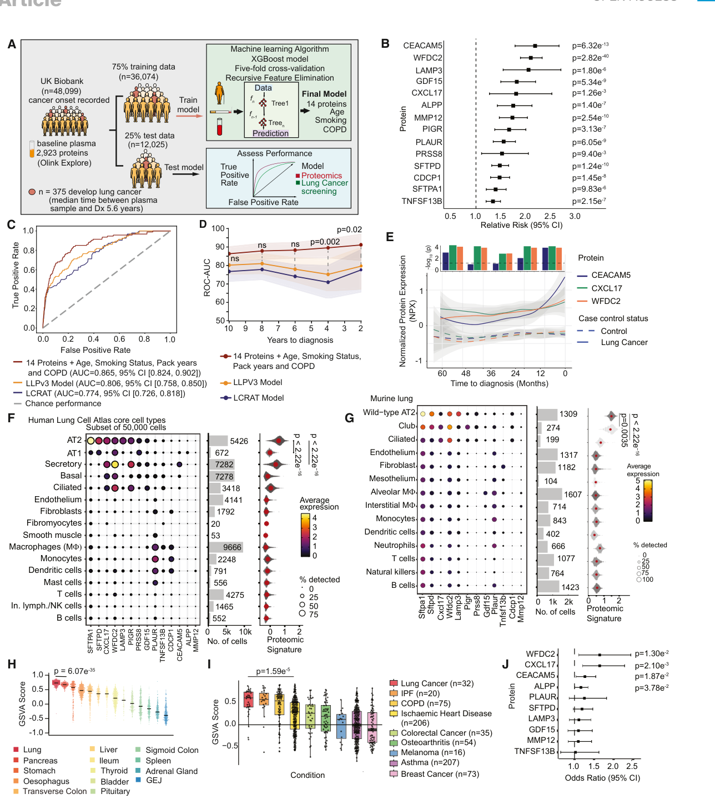
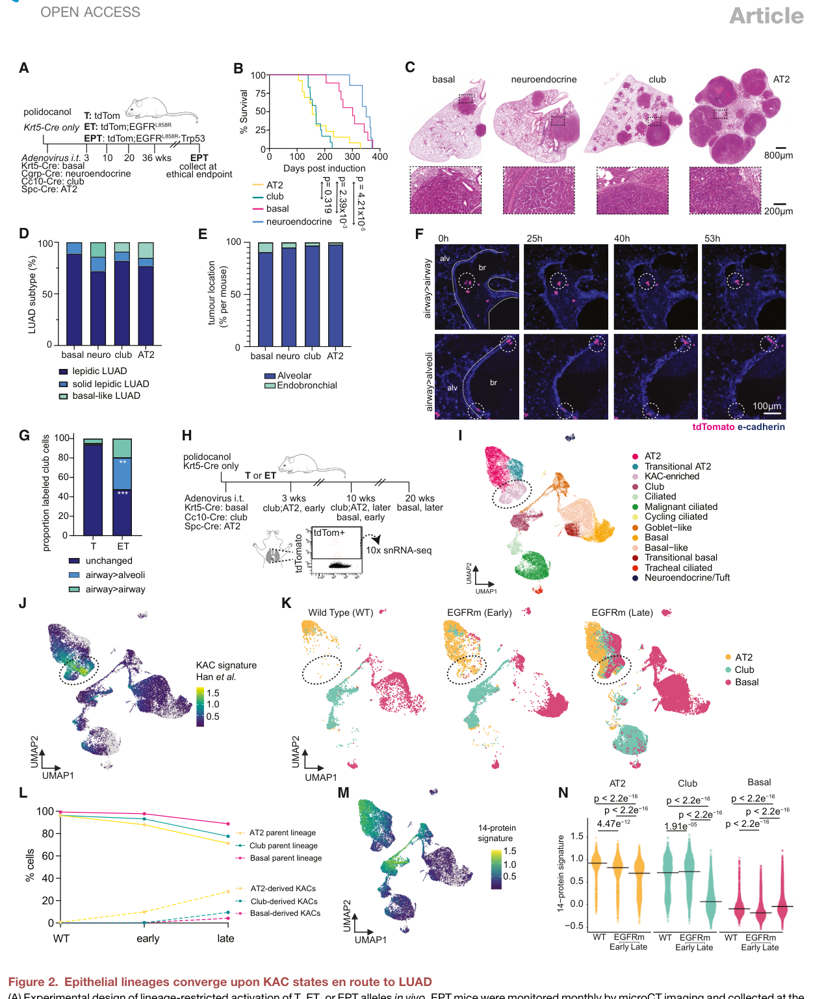
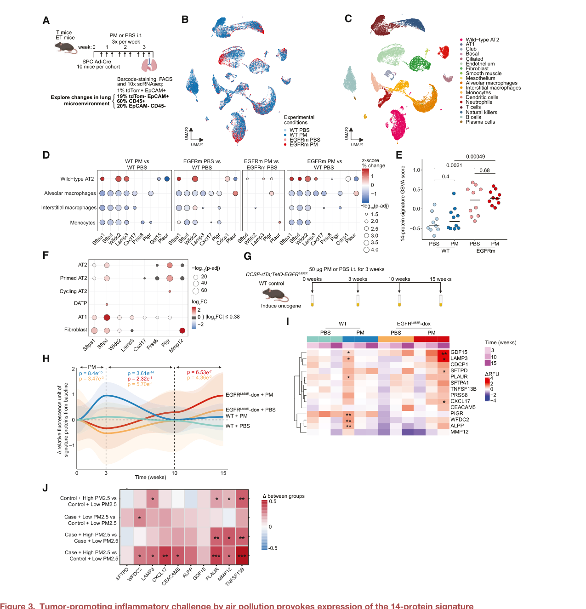
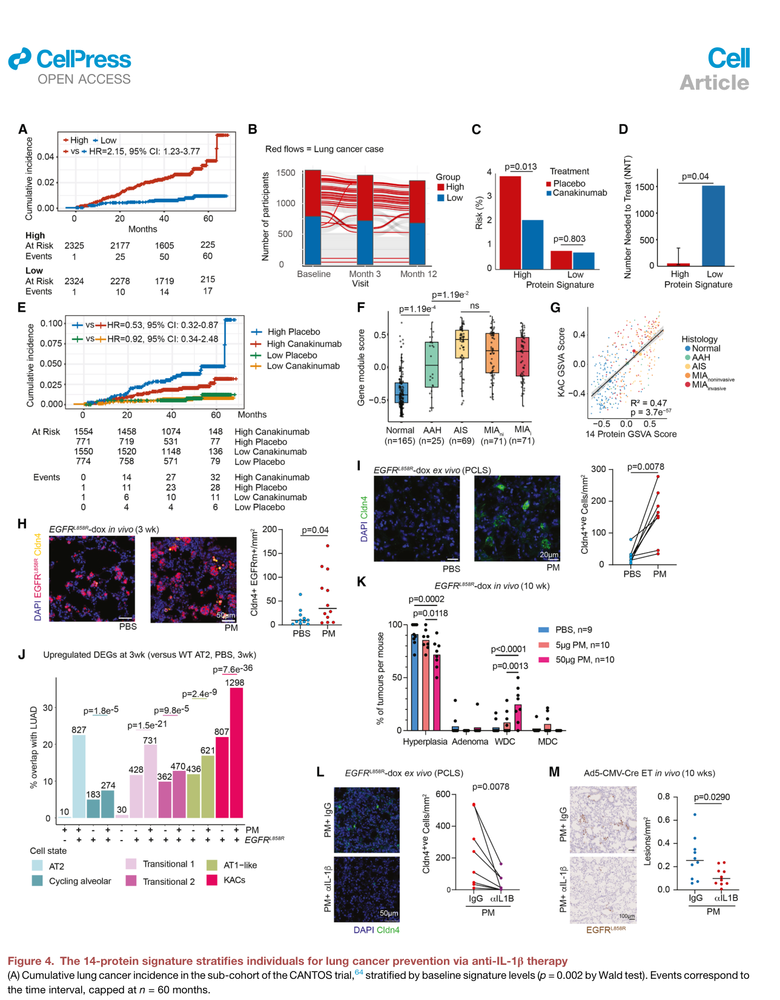

# Plasma signals of lung tumor promotion for molecular cancer prevention

<!-- wechat-style-reviewed: 2026-08-17 -->

一位有长期吸烟史、年龄超过 50 岁的人，可能符合肺癌筛查条件，却未必会在近期发生肺癌。把这类人全部纳入药物预防试验，真正发生终点事件的人仍然太少；只按年龄和重度吸烟史筛选，又会漏掉轻度或从不吸烟者。

CANTOS 随机试验的探索性分析曾提示，抗炎药 canakinumab 可能降低肺癌发生率，却没有改善已经形成的非小细胞肺癌。这提示 IL-1β 抑制可能存在一个很早的干预窗口，真正的问题是：怎样在临床可见肿瘤出现以前，找到更可能受益的人？

这项研究给出的答案不是一个“肿瘤释放量”指标，而是一组由 14 种血浆蛋白构成的肺部炎症信号。作者先在 48,099 名 UK Biobank 参与者中发现它，再用外部人群、肺组织单细胞数据、EGFR 驱动的小鼠模型、颗粒物暴露实验和 CANTOS 生物标志物亚组追问同一件事：这组信号是否在读取一个有利于肿瘤启动的肺泡微环境。

结果支持它用于风险富集，却还不足以成为临床用药伴随诊断。CANTOS 高签名亚组中，预防 1 例肺癌的估计需治疗人数从低签名组的 1,516 降至 55；但连续签名与治疗的交互检验为 \(p=0.19\)，这仍是需要前瞻验证的探索性结果。

## 01｜为什么只看年龄和吸烟史还不够

现行筛查主要覆盖有显著吸烟史的中老年人。它适合决定谁接受低剂量 CT，却不够精细到决定谁应长期接受抗炎药：高风险标签下的绝对肺癌发生率仍低，预防试验需要很大样本量。

另一端是轻度或从不吸烟者。TALENT 队列中 93.3% 的参与者从不吸烟，说明仅依赖重度吸烟史会遗漏一部分真实病例。

这篇论文因此寻找的不是“有没有吸烟暴露”，而是暴露、突变细胞与宿主肺部反应是否已经共同形成了一个可在血液中读出的促肿瘤状态。

## 02｜这项研究到底做了多大规模

发现阶段使用 UK Biobank 的 48,099 人，其中 375 人在随访中诊断肺癌。每人的基线血浆测量 2,923 种蛋白，采血到诊断的中位时间为 5.6 年；数据按 75:25 分为训练集和独立留出测试集。

外部证据来自 8 个蛋白组数据集，共 2,198 例后续肺癌和 53,641 名非癌对照。作者还分析了 UKCTOCS 的纵向样本、TRACERx 的术前术后样本、以从不吸烟者为主的 TALENT、4,651 名 CANTOS 生物标志物亚组参与者，以及人肺图谱和癌前病变转录组。

机制部分并非只做相关性解释。作者在多种肺上皮谱系中启动 EGFR-L858R，结合 Trp53 缺失、颗粒物暴露、IL-1β 刺激或阻断、单细胞/单核 RNA 测序、肺切片活成像和小鼠纵向血浆蛋白组，追踪信号从何而来。

## 03｜14 种蛋白比现有风险模型多提供了什么

模型最终保留 14 种蛋白，以及年龄、吸烟状态、包年数和既往 COPD。留出测试集有 12,025 人、75 例肺癌；图中报告的组合模型 AUC 为 0.865，LLPv3 为 0.806，LCRAT 为 0.774。

蛋白单独模型与临床变量单独模型的区分能力相近（DeLong \(p=0.26\)），但把两类信息合并后，模型显著优于任一单独模型。蛋白的增量因此不是替代年龄和吸烟史，而是补上临床变量未捕获的生物学状态。

在固定 20% 假阳性率时，组合模型灵敏度为 0.776（95% CI 0.687–0.857），高于 LLPv3 的 0.622（95% CI 0.518–0.718；\(p=0.0012\)）。相对 LLPv3，最明显的增益出现在诊断前 2–4 年。

图 1 的关键不是单独某一种蛋白，而是三层一致性：14 种蛋白在 8 个外部数据集中都与后续肺癌正相关；UKCTOCS 中 WFDC2、CXCL17 和 CEACAM5 在 98 例未来病例里于诊断前约 2 年开始高于 150 名对照；基因表达又主要定位于肺上皮、髓系细胞和成纤维细胞。

需要区分两种“验证”。外部数据复现的是单个蛋白及签名方向，不是完整 XGBoost 模型在 8 个队列中的校准、灵敏度和临床净获益；完整模型的性能比较仍主要来自 UK Biobank 留出集。

## 04｜这组信号来自已经形成的肿瘤吗

数据更像是在读取肺部损伤和促肿瘤微环境，而不是单纯读取肿瘤体积。GTEx 的 19,788 个样本中，这组基因在肺组织的表达高于其他组织；Human Lung Cell Atlas 的 50,000 个细胞子集中，信号以肺泡Ⅱ型细胞和分泌型上皮细胞最突出。

如果信号主要由成熟肿瘤释放，它理应随分期升高，并在切除后下降。TRACERx 可用血浆蛋白组全队列纳入 482 人，签名没有随肿瘤分期升高；在至少 2 年未复发且有术后样本的子集中，切除肿瘤后也未显著下降，但论文没有报告这一配对子集的确切 n。

但“不是肿瘤负荷”不等于“肺癌特异”。这组签名在 COPD、特发性肺纤维化、吸烟和柴油尾气暴露中也升高。它更适合作为肺部炎症和肿瘤促进状态的风险读数，不能直接当作确诊肺癌的检测。

## 05｜不同起源的上皮细胞为什么会走向同一危险状态

作者分别在基底细胞、神经内分泌细胞、club 细胞和肺泡Ⅱ型细胞中启动 EGFR-L858R，并在 EPT 模型中同时删除 Trp53；用于生存与终点组织学比较的四组分别为 n=9、7、12 和 13。四种谱系都能形成肺腺癌；club 和肺泡Ⅱ型细胞起病更快，但终点肿瘤在组织学和 bulk RNA 层面难以按起源区分。

真正共同的地点是肺泡。基底细胞来源的突变细胞可在气管中停留 12 个月而不形成病灶，同一只小鼠却在肺泡区形成 SPC 阳性肺腺癌。论文展示的一次代表性肺切片活成像实验使用 n=4 只小鼠、每只 2–3 个视野，并重复 2 次且方向一致；其中 EGFR 突变 club 细胞向肺泡迁移的比例为 33%，对照为 1%。

37,627 个细胞核、100 只小鼠的谱系追踪显示，不同起源的突变细胞在腺瘤形成前逐渐进入 KAC——一种 Krt8、Cldn4 和 Itga2 较高的肺泡过渡状态。它们保留部分起源记忆，却共享同一条高可塑性轨迹。

反直觉的是，14 蛋白对应基因在野生型 club/肺泡Ⅱ型细胞中较高，进入突变细胞和 KAC 后反而下降。这个结果把血浆信号的来源进一步指向周围未突变细胞，而不是 KAC 本身。

## 06｜颗粒物和 IL-1β 怎样把血浆信号与癌变连起来

作者分析了 39 只小鼠的 42,463 个未发生重组、未表达 EGFR-L858R 的 tdTomato 阴性/EGFR-wild-type 肺细胞。颗粒物单独使野生型肺泡Ⅱ型细胞上调 Sftpa1、Wfdc2 和 Lamp3；仅有邻近 EGFR 突变克隆时，野生型上皮和髓系细胞也会上调多种签名基因；两者共同存在时，肺泡Ⅱ型细胞和肺泡巨噬细胞的反应更广。

IL-1β 是这条联系的候选中介。小鼠肺泡类器官中 12 个可测签名基因有 8 个在 IL-1β 后升高；在 2 份独立人胎肺样本、2 次独立实验的肺泡Ⅱ型类器官中，4 个高表达候选有 3 个升高。颗粒物处理肺切片还会增加 Lamp3 蛋白释放。

小鼠血浆提供了时间维度。野生型小鼠的信号在颗粒物暴露 3 周后短暂升高，停止暴露 7 周后回到基线；EGFR-dox 小鼠则在第 3–10 周持续升高。人群中，当前吸烟者的签名高于既往或从不吸烟者；6 人交叉暴露实验中，2 小时柴油尾气相对过滤空气使 MMP12、PLAUR 和 TNFSF13B 升高。

TALENT 蛋白组总队列包括 251 例未来病例与 501 名匹配对照，但 PM2.5 分层后的各组 n 没有单列。病例类型也有原文冲突：Methods 把 251 例都写作 incident invasive LUAD，Results 却称其中 62.1% 为 adenocarcinoma。对照中有 4/10 个可测蛋白与较高 PM2.5 相关；高 PM 的未来病例相对低 PM 对照有 7/10 个蛋白升高，10 蛋白总分也最高。病例内部高 PM 与低 PM 的总分差异为 \(p=0.014\)。这仍是按住址估算的一年暴露关联，不能当作个体剂量—反应实验。

这些结果建立的是“暴露或突变克隆—IL-1β 炎症—周围肺细胞—血浆信号”的证据链。它们仍未证明 14 种蛋白本身推动癌变，也未证明人血浆的全部变化都来自 KAC 周围生态位。

## 07｜它真的能筛出更适合抗 IL-1β 预防的人吗

CANTOS 生物标志物亚组共 4,651 人，只能测到 14 种蛋白中的 10 种。基线高签名组后来发生肺癌 62/2,326（2.67%），低签名组为 17/2,325（0.73%）；高低组的调整 HR 为 2.15（95% CI 1.23–3.77）。

在高签名组，安慰剂与 canakinumab 的肺癌发生率分别为 3.88% 和 2.06%，OR 为 0.52（95% CI 0.31–0.86）；低签名组分别为 0.78% 和 0.72%，OR 为 0.91（95% CI 0.34–2.48）。由绝对风险差换算，NNT 在高签名组为 55（95% CI 30–343），低签名组为 1,516。

在人组织中，165 个癌前病变及其 165 个邻近正常样本把两条线接在一起：签名从正常到非典型腺瘤样增生（AAH）升高（\(p=1.19\times10^{-4}\)），从 AAH 到原位腺癌（AIS）继续升高（\(p=1.19\times10^{-2}\)），到微浸润腺癌（MIA）不再明显增加。签名与 KAC 转录特征的线性相关为 \(R^2=0.47\)、\(p=3.7\times10^{-57}\)。这是 bulk RNA 的共变关系，不能证明 KAC 制造了血浆信号或驱动病变进展。

这是一个值得继续验证的富集信号，却不是已经证实的治疗预测标志物。高组 HR 为 0.53、低组为 0.92，但连续签名与治疗的交互检验 \(p=0.19\)，未达到常用显著性阈值。不能因为一个亚组显著、另一个亚组不显著，就断言两组治疗效应确有差异。

小鼠干预结果支持生物学合理性：在同一只小鼠来源的配对肺切片中，抗 IL-1β 相对 IgG 降低 Cldn4 阳性细胞，但本地 PDF 图注没有单列这一比较的 n；补充类器官实验汇总 3 次独立实验，抗 IL-1β 组 8 只小鼠相对 IgG 组 7 只小鼠的类器官形成效率下降；体内阻断实验为 n=10/组，抗 IL-1β 相对 IgG 降低第 10 周 EGFR-L858R 阳性病灶密度。但这些结果仍不是一项按签名前瞻入组的人体肺癌预防试验。

## 08｜这项研究真正改变了什么

最重要的概念变化，是把肺癌预防标志物从“尽早发现一个已经存在的肿瘤”转向“发现一个正在帮助肿瘤启动的组织状态”。这一解释与信号可早于诊断多年、与分期关系不强，且在 TRACERx 最后可用的术后随访样本中未显著下降相符，但组织来源仍是机制推断。

在试验设计上，它提出一种可执行的富集路径：先用临床危险因素定义候选人群，再用相对稳定的血浆信号提高事件率，最后检验 IL-1β 等干预是否只在特定生物学状态中有效。近期价值是优化预防试验入组，而不是直接给个人开具 canakinumab。

这套框架也比单纯追求更高 AUC 多走了一步。作者用组织定位、谱系追踪、环境暴露和药物阻断解释模型为何可能有效；即便最终 14 蛋白组合需要调整，“风险模型—组织机制—可干预靶点”的连接方式仍可迁移。

## 09｜这些结果仍需要冷静看待

首先，UK Biobank 分析是回顾性的，而且缺少基线 CT。中位采血至诊断约 5 年降低了全部病例均为隐匿肿瘤的可能，却不能完全排除这一解释；TALENT 的中位诊断间隔只有 144 天，更接近发现已经存在的早期病灶。

其次，CANTOS 参与者有既往心肌梗死且 hsCRP 不低于 2 mg/L，并不是普通肺癌筛查人群。生物标志物分析没有预设充分效能，治疗交互 \(p=0.19\)，NNT 分层只能用于产生假设。

第三，Olink 和 SomaScan 给出相对定量，不同队列使用血浆或血清、不同平台和蛋白面板，不能直接共享一个绝对阈值。作者也没有在 8 个外部数据集中完整验证最终 XGBoost 的校准和临床净获益。

第四，颗粒物暴露由居住邮编和卫星年均值近似，不能代表工作场所、个体防护或终生暴露。柴油交叉实验只有 6 人，人胎肺类器官 qPCR 只有 2 次独立实验。

第五，小鼠结论依赖腺病毒 Cre、EGFR-L858R、部分模型中的 Trp53 缺失和基底细胞实验所需的 polidocanol 损伤。病毒和组织损伤本身可能制造炎症；KAC 只占突变细胞约 7.3%–9.8%，如此少的细胞如何对应系统血浆信号仍不清楚。

最后，本地 PDF 的数据存储 DOI 存在内部不一致，纵向小鼠蛋白组的模型公式也有语义歧义；补充表和视频没有随本地 PDF 提供。这些问题不推翻主结果，但会影响独立复现和精确定标。

## 10｜对我们的研究有什么可借鉴

迁移到胃癌或胃癌前病变时，可以把“吸烟史—肺部促肿瘤签名—短期肺癌”改写为“Hp/病理分层—黏膜或血浆促癌状态—异型增生/早癌”。重点不是病例与健康人的横断面 AUC，而是在已知高风险人群中预测谁将在可干预时间窗内进展。

队列应预先保留临床基线模型，再检验蛋白组、免疫组库、克隆性造血或微生物信号带来的增量。外部验证必须复制完整模型的校准、阈值和决策净获益，不能只复现单个分子方向。

机制上可采用同样的三角验证：前瞻血液信号提供时间顺序，单细胞/空间组学定位信号来源，类器官或动物扰动验证候选通路。真正进入预防试验前，还需要按标志物分层的随机设计来检验治疗交互，而不是事后比较两个亚组的显著性。

---

## 技术附录

### 论文基本信息

- 期刊：Cell 189, 3903–3921
- 年份：2026
- DOI：10.1016/j.cell.2026.05.005
- 第一作者：Tej Pandya 等
- 共同资深/通讯作者：William Hill、Clare E. Weeden、Charles Swanton
- Lead contact：Charles Swanton
- 研究领域：肺癌风险预测、血浆蛋白组、精准预防、空气污染、IL-1β、肺泡过渡状态
- 关键词：lung cancer prevention、plasma proteomics、CANTOS、canakinumab、particulate matter、EGFR、KAC、IL-1β、XGBoost
- 本地 PDF：`pdfs/processed/plasma-lung-tumor-promotion-cell-2026.pdf`
- 全文证据包：`tmp/2026-plasma-lung-tumor-promotion-llm-pack.md`
- 解析清单：`tmp/2026-plasma-lung-tumor-promotion-manifest.json`

### PDF 解析质量与全文覆盖

- 抽取引擎：PyMuPDF；PDF 共 46 页，抽取 1,690 个句子 ID。
- 可读内容：主文、Fig. 1–4、STAR Methods、Key Resources、资源可用性、Fig. S1–S9 及其图注均可读取。
- 本地缺失：正文引用的 Table S1–S9、Data supplements 和 Videos S1–S11 未随本地 PDF 提供，因此详细队列人口学、部分超参数和视频轨迹不能在本地核验。
- 版面问题：双栏阅读顺序会把正文与图注拼接；图内标签、参考文献和 Key Resources 被错误分类；上下标、基因型和跨页句子有断裂。正文数字优先取可恢复的叙述句和完整图注，无法恢复的图内指数不静默补写。
- 章节误判：解析器报告 `results=807`、`methods=296`。人工复位后，实质 Results 为 243 个 ID；真实实验/分析 Methods 为 290 个 ID。55 个 Results 被误标为 Methods，参考文献与 Key Resources 又被大量误标为 Results。

| 内容块 | 真实 ID 范围 | 覆盖 | 处理方式 |
|---|---|---:|---|
| 标题、作者和 Introduction | `P001.S0001–P005.S0022` | 137/137 | 用于题名、问题背景、摘要交叉检查 |
| Results | `P005.S0023–P013.S0026` | 243/243 | 按原文顺序逐段翻译、解释并映射正文 |
| Discussion、限制、资源、致谢、贡献与利益声明 | `P013.S0027–P017.S0002` | 174/174 | 用于边界、冲突和资源审计 |
| Supplement 在线提示 | `P017.S0003` | 1/1 | 记录在线补充材料存在 |
| References | `P017.S0004–P020.S0139` | 531/531 | 识别为文献条目，不当作 Results |
| Key Resources | `P021.S0001–P023.S0034` | 78/78 | 提取试剂、数据集、引物和软件 |
| Methods | `P023.S0035–P031.S0031` | 290/290 | 逐段翻译、解释并保留参数 |
| Additional Resources | `P031.S0032–P031.S0033` | 2/2 | 核对注册试验编号 |
| 页脚伪影 | `P032.S0001` | 1/1 | 标记为 `ll`，不作为证据 |
| 内嵌补充图 | `P032.S0002–P046.S0007` | 233/233 | 检查 Fig. S1–S9 图注、样本和统计说明 |
| **全文** | 以上互斥范围 | **1690/1690** | 无未覆盖 ID |

### 主图索引

| 原文图表 | 样本与比较 | 核心信息 | 图像文件 | 正文位置 |
|---|---|---|---|---|
| Fig. 1 | UKBB 48,099 人；8 个外部数据集；UKCTOCS、GTEx、HLCA、TALENT | 14 蛋白+临床变量预测未来肺癌，信号富集于肺上皮和髓系/基质细胞 | `assets/precision-medicine/2026-plasma-lung-tumor-promotion/fig1-plasma-risk-signature.png` | [03｜14 种蛋白比现有风险模型多提供了什么](#03｜14-种蛋白比现有风险模型多提供了什么) |
| Fig. 2 | 基底、神经内分泌、club、AT2 谱系；EPT 生存 n=9/7/12/13；37,627 nuclei | 不同起源细胞进入肺泡并汇聚于 KAC，签名在突变细胞内反而下降 | `assets/precision-medicine/2026-plasma-lung-tumor-promotion/fig2-lineage-kac-convergence.png` | [05｜不同起源的上皮细胞为什么会走向同一危险状态](#05｜不同起源的上皮细胞为什么会走向同一危险状态) |
| Fig. 3 | T/ET × PBS/PM；42,463 野生型肺细胞；小鼠纵向血浆；TALENT | PM、EGFR 克隆和 IL-1β 诱导周围细胞及血浆签名 | `assets/precision-medicine/2026-plasma-lung-tumor-promotion/fig3-pm-signature-induction.png` | [06｜颗粒物和 IL-1β 怎样把血浆信号与癌变连起来](#06｜颗粒物和-il-1β-怎样把血浆信号与癌变连起来) |
| Fig. 4 | CANTOS 4,651 人；165 个癌前病变及 165 个邻近正常；KAC 干预 | 高签名亚组的探索性 canakinumab 获益及 KAC/IL-1β 干预证据 | `assets/precision-medicine/2026-plasma-lung-tumor-promotion/fig4-cantos-prevention-stratification.png` | [07｜它真的能筛出更适合抗 IL-1β 预防的人吗](#07｜它真的能筛出更适合抗-il-1β-预防的人吗) |

### Fig. 1 完整 panel 注释

- A：UKBB 机器学习流程。48,099 人的基线 Olink 2,923 蛋白与临床变量进入 75% 训练/25% 测试；递归特征消除和 XGBoost 得到 14 蛋白加年龄、吸烟状态、包年数和 COPD 的组合模型。来源：`P004.S0060–P004.S0062`、`P005.S0023–P005.S0026`。
- B：8 个外部蛋白组数据集对 14 种蛋白做随机效应 meta-analysis，展示相对风险和 95% CI，Wald 检验。来源：`P004.S0063`、`P005.S0027–P006.S0003`。
- C：UKBB 留出集 12,025 人、75 例肺癌的 ROC，对比组合模型、LLPv3 和 LCRAT，DeLong 检验。图内 AUC 分别为 0.865、0.806、0.774。来源：`P004.S0014`、`P004.S0064`、`P006.S0004–P006.S0006`。
- D：按诊断前 2 年窗口计算 AUC 和 95% CI；组合模型在诊断前 2–4 年相对 LLPv3 增益最大。来源：`P004.S0065`、`P006.S0007`。
- E：UKCTOCS 中 98 例未来病例和 150 名对照每年测量 WFDC2、CXCL17、CEACAM5，平均每人 5 次；LOESS 显示诊断前变化，Wilcoxon 的 \(-\log_{10}p\) 截断于 4。来源：`P005.S0027–P005.S0028`、`P006.S0009–P006.S0010`。
- F：Human Lung Cell Atlas 50,000 个细胞子集的单基因表达、聚合分数和细胞数，Wilcoxon 检验。来源：`P005.S0029`、`P006.S0014`。
- G：健康小鼠肺 scRNA-seq 中对应 12 个可检出基因的细胞类型表达。来源：`P005.S0029`、`P006.S0015–P006.S0018`。
- H：GTEx 19,788 个样本、946 名供者的组织 GSVA；肺相对其他组织最高，Wilcoxon 检验。来源：`P005.S0030–P005.S0031`、`P006.S0013`。
- I：UKBB 留出集中采血后 5 年内不同疾病的签名 GSVA，显示 COPD/IPF 等呼吸病也可升高。来源：`P005.S0032–P005.S0033`、`P006.S0019–P006.S0020`。
- J：TALENT 251 例、501 名对照中可测 10 种蛋白的 OR 和 95% CI，仅标注 \(p<0.05\) 的 Wald 检验。来源：`P005.S0034`、`P006.S0023–P006.S0025`。

### Fig. 2 完整 panel 注释

- A：以谱系限制性 Cre 在 T、ET、EPT 小鼠中启动报告、EGFR-L858R 和/或 Trp53 缺失，按时间做 microCT 和取材。来源：`P006.S0030–P008.S0004`、`P007.S0027–P007.S0028`。
- B：EPT 生存曲线，基底/神经内分泌/club/AT2 分别 n=9/7/12/13，log-rank 检验。来源：`P007.S0029–P007.S0030`、`P008.S0007`。
- C：四种谱系终点代表性组织学。D：每只小鼠最高病理等级。E：终点病灶位于肺泡或支气管内；D/E 用 two-way ANOVA+Sidak，差异不显著。来源：`P007.S0031–P007.S0035`、`P008.S0008–P008.S0013`。
- F：club 靶向 ET 小鼠在诱导后 6 周的 PCLS 三维活成像，E-cadherin 为蓝、tdTomato 为粉，显示气道内分裂和气道向肺泡迁移。来源：`P008.S0029–P008.S0031`。
- G：T 与 ET club 细胞在 6 周时向肺泡迁移的比例；n=4 小鼠、每只 2–3 个视野，重复 2 次；two-way ANOVA+Tukey。来源：`P008.S0032–P008.S0033`。
- H：分选基底、club、AT2 来源 tdTomato 阳性野生型或突变细胞做 snRNA-seq；每个基因型/时间/谱系汇集 10 只小鼠。来源：`P008.S0034`。
- I：37,627 nuclei 的细胞簇 UMAP。J：投射既有小鼠 KAC signature。K：按野生型、早期、晚期和起源拆分，虚线圈出 KAC 富集簇。来源：`P008.S0035–P008.S0036`。
- L：起源谱系主要细胞群及 KAC 比例随时间变化。M：14 蛋白基因集在 UMAP 上的分数。N：各谱系从野生型到早晚期的分数，t 检验+Bonferroni。来源：`P008.S0037–P008.S0038`、`P010.S0001–P010.S0006`。

### Fig. 3 完整 panel 注释

- A：T/ET 小鼠接受 PBS 或 PM 3 周，每组计划 10 只；分选 tdTomato 阴性细胞做 scRNA-seq。B/C：按条件和细胞类型显示 UMAP；实际分析 39 只小鼠、42,463 个细胞、18 类细胞。来源：`P009.S0004–P009.S0006`、`P010.S0008–P010.S0010`。
- D：野生型 AT2、肺泡/间质巨噬细胞和单核细胞中 12 个可检出基因的条件差异；颜色为标准化百分比变化，大小为调整后 \(-\log_{10}p\)，只显示 Wilcoxon \(p<0.05\)。来源：`P009.S0007–P009.S0008`、`P010.S0011–P010.S0014`。
- E：按小鼠 pseudobulk 后的签名 GSVA，Wilcoxon 检验。来源：`P009.S0009`、`P010.S0014–P010.S0016`。
- F：既有小鼠 AT2+基质细胞类器官数据中 IL-1β 对 12 个基因的影响，Wilcoxon 调整后 \(p<0.05\)。来源：`P009.S0010–P009.S0014`、`P010.S0019`。
- G：EGFR-dox 或野生型小鼠接受 PBS/PM，基线及第 3、10、15 周取血做 SomaScan。来源：`P009.S0015–P009.S0016`、`P010.S0024–P010.S0025`。
- H：相对基线的 14 蛋白签名 LOESS，n=4–6/组，阴影为 95% CI，linear mixed-effects model。I：各蛋白在 3/10/15 周相对基线变化热图。来源：`P010.S0028–P010.S0030`、`P012.S0001–P012.S0004`。
- J：TALENT 中未来病例和对照按 PM2.5 中位数分层，比较可测 10 种蛋白，Wilcoxon 检验。来源：`P010.S0031–P010.S0032`、`P012.S0009–P012.S0013`。

### Fig. 4 完整 panel 注释

- A：CANTOS 亚组按基线签名高低的累计肺癌发生率，最多 60 个月，Wald \(p=0.002\)。B：安慰剂组从基线到 3/12 月的高低分类变化，红线为发生肺癌者。来源：`P011.S0004–P011.S0007`、`P012.S0019–P012.S0022`。
- C：基线签名×治疗组的肺癌风险，卡方检验。D：按签名组计算 NNT，Wald 检验。E：按签名和治疗分层的累计发生率，log-rank；只在高签名组显著。来源：`P011.S0008–P011.S0010`、`P013.S0002–P013.S0006`。
- F：165 个癌前病变及 165 个邻近正常组织的 bulk RNA GSVA；AAH 25、AIS 69、MIA 71，Dunn 检验。来源：`P011.S0011–P011.S0013`、`P013.S0008–P013.S0010`。
- G：14 蛋白与 KAC signature 的线性回归和 95% CI，较大点表示条件均值；\(R^2=0.47\)。来源：`P012.S0026–P012.S0027`、`P013.S0011`。
- H：EGFR-dox 小鼠 PM/PBS 3 周后的 CLDN4+EGFR-L858R+ 细胞，n=11–12/组，Mann–Whitney。I：8 只小鼠配对 PCLS 接受 PBS/PM，paired Wilcoxon。来源：`P012.S0028–P012.S0030`、`P013.S0016`。
- J：不同上皮状态上调基因与晚期 LUAD 的重叠，Fisher 检验。来源：`P012.S0031`、`P013.S0021`。
- K：EGFR-dox 小鼠接受 PBS、5 或 50 μg PM 3 周，在第 10 周比较增生、腺瘤和不同等级癌，two-way ANOVA+Tukey。来源：`P012.S0032–P012.S0034`、`P013.S0022`。
- L：同一只小鼠来源 PM 暴露 PCLS 的 IgG 与抗 IL-1β 配对比较，检测 Cldn4+ 细胞，paired Wilcoxon。M：PM 暴露 ET/CMV-Cre 小鼠同步接受 IgG 或抗 IL-1β，第 10 周用人 EGFR-L858R 抗体染色并计数病灶，n=10/组，Welch t test。这里是小鼠组织中的人 EGFR-L858R 转基因染色，不是人患者组织。来源：`P012.S0035–P012.S0038`、`P013.S0024–P013.S0025`。

### Results 证据覆盖审计

| 原文句子 ID | 忠实中文含义 | 正文对应位置 | 证据边界 |
|---|---|---|---|
| `P005.S0023–P005.S0035`（13） | UKBB 数据、模型输入、14 种蛋白及 Fig. 1E–J 图注开端 | 02–04 | `P005.S0027` 把外部验证正文与 Fig. 1E 图注拼接 |
| `P006.S0001–P006.S0011`（11） | 8 队列 meta、留出集模型比较、UKCTOCS 纵向蛋白 | 03 | 外部复制不等于完整 XGBoost 外部验证 |
| `P006.S0012–P006.S0027`（16） | 人/鼠组织来源、疾病特异性、TRACERx、TALENT | 03–04 | TALENT 中位诊断间隔仅 144 天 |
| `P006.S0028–P007.S0035`（39） | 谱系限制性 EGFR 模型和 Fig. 2A–E | 05 | p7 含大量图内标签；基因型跨页断裂 |
| `P008.S0001–P008.S0021`（21） | 四谱系肿瘤起始、肺泡定位、迁移及 Wnt 抑制 | 05 | 基底迁移事件太少，不能定量 |
| `P008.S0022–P008.S0039`（18） | 37,627 nuclei 的早期谱系追踪和 Fig. 2F–N | 05 | 神经内分泌谱系因细胞少未进入 snRNA |
| `P009.S0001–P009.S0016`（16） | Fig. 3 图内标签及 A–G 图注 | 06 | 计划 40 只、实际分析 39 只 |
| `P010.S0001–P010.S0007`（7） | KAC 轨迹完成，签名在突变/KAC 内下降 | 04–05 | 支持但不证明肿瘤外来源 |
| `P010.S0008–P010.S0022`（15） | PM/EGFR 对微环境、IL-1β 类器官和 Lamp3 释放 | 06 | 多处 heading 吞并正文，已按上下句恢复 |
| `P010.S0023–P011.S0003`（13） | 小鼠纵向血浆及 Fig. 3H–J 图注 | 06 | `P010.S0027` 跨整页图后续接 `P012.S0001` |
| `P011.S0004–P011.S0013`（10） | Fig. 4A–F 图注 | 07 | 图注本身不提供所有效应量 |
| `P012.S0001–P012.S0015`（15） | 小鼠持续签名、吸烟、柴油和 TALENT PM | 06 | `STAR Methods` 触发误分类；4/10 蛋白名已按跨句恢复 |
| `P012.S0016–P012.S0025`（10） | CANTOS 亚组、风险关联与时间稳定性 | 07 | 只覆盖 10/14 蛋白，事后分析 |
| `P012.S0026–P012.S0038`（13） | Fig. 4G–M 图注 | 07 | 被误标为 Methods，仍属于 Results |
| `P013.S0001–P013.S0012`（12） | canakinumab 亚组效应、NNT、癌前病变和 KAC 相关 | 07 | 治疗交互 \(p=0.19\) |
| `P013.S0013–P013.S0026`（14） | PM 推动 KAC、34,459 细胞 snRNA、抗 IL-1β 阻断 | 06–07 | 小鼠机制不能替代人体预防验证 |
| **合计** | 真实 Results 全部覆盖 | — | **243/243，无缺口** |

### Methods 与复现信息

#### 人群队列和数据结构

- UKBB：总队列 502,401 人、37–73 岁、2006–2010 年招募；54,219 人有基线 Olink 2,923 蛋白，按预先癌症等规则排除后分析 48,099 人。375 人后续肺癌、47,724 人未发生；无 formal power calculation。来源：`P024.S0010–P024.S0014`、`P028.S0043`。
- 8 个外部数据集为 EPIC、EPIC-Norfolk 两批、ARIC、CKB、LC3、UKCTOCS 和 deCODE。平台相对定量不允许直接跨队列比较；未做有充分效能的性别或 ancestry 分层。来源：`P024.S0015–P024.S0020`。
- TRACERx：N=482，术前和至少 2 年未复发者的术后随访样本；无 formal power。Olink NPX 用 GSVA R v3.23、默认参数、`kcdf="Gaussian"`。来源：`P024.S0021–P024.S0023`、`P030.S0016–P030.S0017`。
- CANTOS：原试验 10,061 人，既往心肌梗死且 hsCRP≥2 mg/L，39 国，2011–2017 年，中位随访 3.7 年；生物标志物亚组使用 baseline SomaScan v3 的 4,785 蛋白，无 formal power。本文使用其中 4,651 人的 10/14 aptamer 平均 RFU，以队列中位数二分。Cox 调整 BMI、吸烟和年龄；NNT 为绝对风险差倒数。来源：`P024.S0024–P025.S0003`、`P030.S0030–P031.S0004`。
- TALENT：台湾 17 个中心、2015–2019 年；入组胸片阴性。Methods 将 251 例称为 incident invasive LUAD，并与 501 名对照按年龄、性别、基线吸烟 1:2 匹配，81.3% 女性；但 Results 又称这 251 例中 62.1% 为 adenocarcinoma，病例类型存在内部不一致。设计效能为 \(\alpha=0.05\)、80% power 检出每 SD OR 约 1.25–1.30；4 个 Olink Target 96 panel 只覆盖 10/14 蛋白。QC 排除带 warning 的样本、样本中位 NPX 偏离总体中位数超过 ±5 SD，以及超过 50% 测量低于板特异 LOD 的蛋白。来源：`P006.S0023–P006.S0025`、`P025.S0004–P025.S0011`、`P030.S0011–P030.S0012`。
- UKCTOCS：248 名女性，98 例未来肺癌、150 名对照，诊断前 5 年逐年血清；Olink Oncology II，蛋白标准化为均值 0、SD 1，以默认 span 的 LOESS 拟合纵向轨迹，再做年龄调整 Cox HR/SD。来源：`P029.S0010–P029.S0015`。
- LC3：6 个前瞻队列，731 例、731 名按吸烟、年龄、性别和入组日期匹配的对照，conditional logistic OR/SD。deCODE：610 incident 与 232 prevalent cases、37,892 controls 合并做 SomaScan v4 logistic regression；距诊断时间只在 incident cases 中定义。来源：`P029.S0016–P029.S0022`。
- EPIC 使用 SomaScan v4 并调整吸烟量/年数、BMI、教育，baseline hazard 按年龄、性别、中心分层。EPIC-Norfolk 是 EPIC 子集，两批分别为 291/749 和 698/1,010 例/对照，无 bridging sample。LC3 与 EPIC、EPIC-Norfolk 与 EPIC 存在人群重叠，不应仅因检测平台不同就视为完全独立。来源：`P029.S0023–P029.S0031`。
- CKB：排除 13 名基线癌症史者和 3 名无 Olink 数据者后纳入 2,029 人、31 例，4 个 Olink panel/2,941 蛋白；Cox 按性别和地区分层并调整年龄、末次进食、温度及平方项和教育。ARIC 使用 SomaScan 5k、log2 RFU 和多变量 Cox，协变量包括中心、性别、吸烟与包年数、BMI、腰臀比、糖尿病、身高、体力活动指标、饮酒、蛋白推断吸烟评分、PEER 因子和遗传主成分。来源：`P030.S0001–P030.S0010`。

#### 机器学习和统计验证

UKBB 按吸烟、性别、收入、教育、结局、年龄、BMI 和包年数做 75:25 多标签分层；后三项先四分位化，使用 `iterative-stratification` v0.1.7 的 `MultilabelStratifiedShuffleSplit()`。待插补变量及缺失率为吸烟状态 <1%、被动吸烟 10.0%、包年数 15.4%、BMI <1%、家庭年收入 14.6%（按 £31,000 二分）和教育 1.3%（学位/专业资质二分）。MICE v3.17.0 还把肺癌结局、随访时长、土地利用回归 PM 暴露、基线年龄和性别作为预测变量；生成 15 套完整数据，连续变量用 predictive mean matching，多分类用 random forest，二分类用 logistic regression，每套数据独立进入同一分析流程。来源：`P028.S0023–P028.S0035`。

蛋白缺失超过 25% 者排除。Probatus v3.1.2 递归特征消除使用 5-fold×5 repeats；Optuna v3.5 TPE 做 100 次 trial，每轮去除 SHAP 最低 20% 特征；XGBoost v2.0.3 以 ROC-AUC 为目标。完整分析队列的 375 例与 47,724 名非病例提示严重失衡，因此只在各交叉验证训练折内把病例和对照随机下采样至 1:1；100 个交叉验证模型的概率取均值，留出集保持原始类比例。

最终模型与 `lcmodels` v4.1.1 实现的风险模型比较，`pROC` v1.18.5 做 DeLong 检验，并按诊断前 2 年窗口分析。外部队列按设计使用 Cox HR、logistic OR 或 conditional OR，再用 `metafor` v5.0-1 随机效应 meta-analysis。

复现时需核对两点：Methods 一处称训练/测试集分别插补，随后又称只在训练集拟合插补模型并应用测试集；插补预测变量还包含后续肺癌结局和随访时间。PDF 未给最终搜索空间、最终超参数，也未说明 15 套插补结果如何合并，需以公开代码为准。来源：`P028.S0023–P029.S0009`。

#### 动物模型、暴露和组织学

- 功能实验用雌雄 6–15 周小鼠；单细胞/单核实验只用雌鼠以降低性别转录差异。C57BL/6J、免疫完整、SPF、实验前 naïve。T=`Rosa26 LSL-tdTomato/+`；ET=`Rosa26 LSL-tTA/LSL-tdTomato;TetO-EGFR-L858R`；EPT 为 ET 再加 `Trp53fl/fl`；EGFR-dox=`CCSP-rtTA;TetO-EGFR-L858R`。来源：`P023.S0035–P023.S0045`。
- 小鼠肺类器官每孔使用 2,000–10,000 个分选的 tdTomato+ 活细胞，与 MLg2908 肺成纤维细胞按 1:5 混合。培养基为 DMEM/F12、10% FBS、100 U/mL penicillin–streptomycin、1× ITS、1 mM L-glutamine 和 1 mM HEPES；与 growth-factor-reduced Matrigel 按 1:1 混合，100 μL 接种于 24-well、0.4 μm Transwell，14 天计数。MLg2908 在 37°C、5% CO₂ 培养，并做 mycoplasma 和 STR 质控。来源：`P024.S0001–P024.S0005`。
- CMV-Cre 为 \(2.5\times10^7\) particles/50 μL；谱系限制性 Cre 为 \(2.5\times10^8\)/50 μL；snRNA 为 \(1\times10^{10}\)/50 μL。基底细胞模型先给 2% polidocanol 13.5 μL。PM SRM2786 为 50 μg/50 μL、每周 3 次、连续 3 周。来源：`P025.S0025–P025.S0032`。
- microCT 每月一次，结节需最大径≥0.3 mm 且下一次扫描继续增大。组织 10% formalin 过夜、4 μm 切片；检测 EGFR-L858R、RFP、Cldn4、SPC、Krt5、synaptophysin、CC10，以及 IL-1β RNAscope+CD68。病理由兽医病理学家判读并对基因型/处理盲法。来源：`P025.S0033–P026.S0009`。
- 流式制样时，肺组织用 Liberase TM/TH 各 75 μg/mL 和 DNase I 25 μg/mL，在 37°C、180 rpm 消化 30 min，经 100 μm 滤膜后于 4°C、300g 离心 5 min；气管先以 dispase 16 U/mL 室温处理 40 min，再以 trypsin-EDTA 在 37°C 处理 20 min。分选仪为 BD Influx、Aria Fusion 或 Aria III。来源：`P026.S0013–P026.S0019`。

#### 单细胞、单核和组织扰动

- snRNA/multiome 使用 10x Epi Multiome ATAC+GEX。T 条件为 CC10 3 周 n=10、basal/Krt5 10 周 n=10、SPC 3 周 PBS n=20/PM n=10；ET 条件为 basal 10/20 周各 n=10、CC10 3/10 周各 n=10、SPC 3/10 周 PBS/PM 各 n=10；EPT-SPC 25 周肿瘤 n=2，分别分析。同一 SPC-PBS 数据同时用于 Fig. 2 和 Fig. 4。CellRanger-ARC 2.0.1，自定义 mm10 GENCODE vM23/Ensembl 98+tdTomato+EGFR-L858R；R 4.3.2、Seurat 4.4、DoubletFinder 2.0.4。QC：\(200<nFeature<7500\)，线粒体/核糖体<20%，血红蛋白/血小板<10%；SCTransform v2，Bonferroni。来源：`P026.S0020–P026.S0035`。
- scRNA 每组计划 10 只，用 TotalSeq hashtag；混样固定为 60% immune、19% tdTomato− epithelium、1% tdTomato+ epithelium、20% other。CellRanger 7.1，沿用相同 QC；一个 WT-PBS 小鼠因细胞组成异常在分析前排除。按 mouse hashtag 用 `AggregateExpression` pseudobulk 和 DESeq2。来源：`P027.S0001–P027.S0018`。
- PCLS：2% agarose，300 μm 切片，LGK974 100 nM，活成像 72 h。PM 试验用 EGFR-dox 小鼠预先 doxycycline 5 天，6 mm core/400 μm 切片，tetracycline 2.5 μg/mL，PM 100 μg/mL，抗 IL-1β 或 IgG 100 μg/mL；LAMP3 ELISA 和 CLDN4 成像。来源：`P027.S0025–P028.S0003`。
- 补充图 S9 的体内阻断为 anti-IL-1β 200 μg 或 hamster IgG，与 PM 50 μg 同期给药，每周 3 次、连续 3 周；类器官形成率汇总自 3 次独立实验，IgG n=7、anti-IL-1β n=8。来源：`P046.S0006–P046.S0007`。
- 人胎肺 AT2 类器官来自 17 和 20 周男性胎肺。qPCR 每次 4 孔（2 对照、2 个 IL-1β 100 ng/mL 48 h），2 次独立实验；5 ng RNA/反应、45 cycles、comparative Ct，two-way ANOVA+Sidak。来源：`P025.S0019–P025.S0024`、`P031.S0018–P031.S0025`。
- 小鼠 bulk RNA：约 2 mm³ EPT 肿瘤，25 million PE100、polyA；Kallisto 0.45/GRCm38、DESeq2 1.38.3。人癌前 RNA：Cutadapt、STAR 2.5.2a two-pass ENCODE3/hg38+GENCODE v42、RSEM 1.3.3；保留 duplicate reads <80% 的文库，并排除表达蛋白编码基因不足 75% 的样本。来源：`P028.S0004–P028.S0022`。
- 对既有小鼠肺类器官数据 GSE144468 的复分析使用 DoubletFinder 2.0.4、SCTransform v2、Seurat integration 和 `FindMarkers`；小鼠品系、年龄等实验细节仍需回查原始数据论文。来源：`P024.S0007–P024.S0009`、`P027.S0020–P027.S0024`。

#### 环境暴露与蛋白组

- 人柴油交叉实验 n=6（4 男、2 女，40–66 岁），300 μg/m³ 柴油或过滤空气暴露 2 h、间隔 1 月、24 h 后采血；70 μL 血浆，SomaScan v1.3/1,307 蛋白。log2 RFU、Welch t，FC≥1.5 且 \(p\le0.05\)。来源：`P025.S0014–P025.S0016`、`P030.S0018–P030.S0023`。
- TALENT PM2.5 用入组前一年居住邮编连接 0.01° 卫星网格，并取 11 km 半径均值；模型调整年龄、BMI、肺癌家族史和性别。来源：`P030.S0011–P030.S0015`。
- GTEx 分析覆盖 946 名供者、最多 54 个非病变组织位点；先算签名 GSVA，再用 Wilcoxon 比较肺与表达次高的非肺组织。HLCA 下采样 50,000 个细胞，采用 `ann_level_3`；将 FAM83D+ smooth muscle 重标为 fibromyocyte，以 normalized counts 和 `AddModuleScore` 计算签名。来源：`P030.S0024–P030.S0029`。
- 小鼠血浆在基线及 3/10/15 周采样，SomaScan 11K v5 同批、两板均分；4 个盲法技术重复，CV 超过第 95 百分位的 539 个蛋白去除，PCA 排除 1 只小鼠。RFU 先 log 转换，再逐鼠计算第 3/10/15 周减 baseline 的 \(\Delta RFU\)；lme4 1.1-37、emmeans 1.11.1 比较 time 0 vs 3/10/15 周并做 BH 校正。来源：`P031.S0005–P031.S0017`。
- 胎肺类器官 RNA 用 RNeasy Mini Kit（100 μL RLT Plus）提取、TURBO DNA-free Kit 做 DNase I 处理、DeNovix 测浓度；Luna Universal One-Step RT-qPCR Kit 在 QuantStudio 3 上运行。来源：`P031.S0018–P031.S0025`。
- 全局统计通常双侧、BH 校正、\(p<0.05\)；主要环境为 R 4.4.3/Python 3.13.2，单细胞 R 4.3.2，小鼠 bulk RNA R 4.2.3；正态性用 Q-Q plot 或 Shapiro–Wilk。来源：`P031.S0026–P031.S0031`。

#### Key Resources 与复现标识

- 主要组织学抗体：human EGFR-L858R（Cat#3197，RRID:AB_1903955）、RFP（600-401-379，AB_2209751）、Cldn4（36-4800，AB_2533262）、SPC（ab211326，AB_2927746）、Krt5（ab64081，AB_1139385）、synaptophysin（SAB4200544，AB_3718600）、CC10（sc-130411，AB_2183388）和 CD68（ab283654，AB_2922954）。体内阻断用 anti-mouse/rat IL-1β（BE0246，AB_2687727），对照为 Armenian hamster IgG（BE0091，AB_1107773）。来源：`P021.S0002–P021.S0017`；双栏抽取错位，标识按 PDF 第 21 页资源表逐行复核。
- 细胞分选抗体为 CD16/CD32（553142，AB_394657）、CD45-BV421（103133，AB_10899570）、CD31-BV421（102423，AB_2562186）、TER-119-BV421（116234，AB_2562917）、CD326/EpCAM-APC-Fire750（118230，AB_2629758）、CD45.2-AF647（109817，AB_492871）和 E-cadherin-AF647（147308，AB_2563955）；TotalSeq-A0301–A0310 的 Cat# 为 155801、155803、155805、155807、155809、155811、155813、155815、155817、155819。来源：`P021.S0004–P021.S0016`；同样按原表复核。
- 病毒标识为 Ad5-CMV-Cre `#VVC-U of Iowa-5`、Ad5-mSPC-Cre `#VVC-Berns-1168`、Ad5-CC10-Cre `#VVC-Berns-1166`、Ad5-CGRP-Cre `#VVC-Berns-1160`、Ad5-bk5-Cre `#VVC-Berns-1547`；关键化学品包括 polidocanol Cat#P9641、SRM2786 Cat#NIST2786、Liberase TH/TM Cat#5401135001/5401119001。来源：`P021.S0018–P021.S0025`；名称—标识按 PDF 原表复核。
- 关键 assay 为 IL-1β RNAscope Cat#316898、10x Multiome bundle CG000338、10x 3′ v3.1 dual-index CG000315、murine LAMP3 ELISA abx530670、RNeasy Mini Kit 74104、Luna One-Step RT-qPCR E3005 和 TURBO DNA-free AM1907。小鼠品系标识为 TetO-EGFR-L858R MGI:3690078、Rosa26-tTA #008600、Rosa26-LSL-tdTomato #007914、Trp53fl/fl #008462、CCSP-rtTA #006232。来源：`P022.S0001–P023.S0007`。
- qPCR 引物（5′→3′）：WFDC2 `AGAACTGCACGCAAGAGTG` / `TTGAGGTTGTCGGCGCATT`；CXCL17 `TGCTGCCACTAATGCTGATGT` / `CTCAGGAACCAATCTTTGCACT`；LAMP3 `GCGTCCCTGGCCGTAATTT` / `TGCTTGCTTAGCTGGTTGCT`；SFTPD `CCTTACAGGGACAAGTACAGCA` / `CTGTGCCTCCGTAAATGGTTT`；GAPDH `GGATTTGGTCGTATTGGG` / `GGAAGATGGTGATGGGATT`。来源：`P023.S0008–P023.S0012`。

### Methods 证据覆盖审计

| 原文句子 ID | 忠实中文含义 | 方法学解释 | 复现注意点 |
|---|---|---|---|
| `P023.S0035–P024.S0009`（21） | 小鼠模型、饲养、基因型、肺类器官及既有类器官数据 | 定义 T/ET/EPT/EGFR-dox 和 3D organoid | 多个引用号/页眉为抽取碎片 |
| `P024.S0010–P025.S0012`（31） | UKBB、8 个外部队列、TRACERx、CANTOS、TALENT | 人群来源、纳排、样本量、伦理和检测平台 | 多队列无 formal power；相对定量不可直接跨平台 |
| `P025.S0013–P026.S0012`（38） | 柴油、癌前 RNA、人胎类器官、动物处理、microCT、组织学 | 暴露与动物实验输入—输出 | `P025.S0038` 跨页接 `P026.S0001` |
| `P026.S0013–P027.S0024`（47） | 流式、snRNA/multiome、scRNA 及既有类器官 scRNA | 细胞制备、QC、聚类和差异表达 | 多组 pooled mice，限制生物学重复；seed 未给具体值 |
| `P027.S0025–P028.S0022`（38） | PCLS、Wnt/PM/抗 IL-1β、ELISA、mouse/human bulk RNA | 活成像和转录组处理 | `P027.S0040` 跨页；Cutadapt/Fiji 版本未给 |
| `P028.S0023–P029.S0006`（28） | UKBB ML 开发与留出验证 | 分层、MICE、RFE、Optuna、XGBoost、下采样、bagging | 结局参与插补、最终超参数与 15 套插补合并方式需代码核查 |
| `P029.S0007–P030.S0017`（42） | 外部 meta、各队列模型、TALENT PM、TRACERx GSVA | 处理异质队列的 HR/OR 与随机效应 | 队列重叠、效应尺度和平台不同 |
| `P030.S0018–P031.S0004`（18） | 柴油、GTEx、HLCA、CANTOS score/Cox/NNT | 人暴露、组织定位和试验亚组统计 | CANTOS 事后中位数二分，不能替代交互验证 |
| `P031.S0005–P031.S0031`（27） | 小鼠血浆、胎肺 qPCR、全局统计 | 纵向 mixed model 与实验统计 | 原文 mixed-model 响应名称存在歧义 |
| **合计** | 真实 Methods 全部覆盖 | — | **290/290，无缺口** |

### 数据、代码和材料可用性

- 论文称小鼠 sn/scRNA、bulk RNA、蛋白组、processed TRACERx 数据和原始代码公开于 Zenodo。
- 正文 Resource availability 两次给出 `10.5281/zenodo.15800192`（`P014.S0028–P014.S0029`、`P014.S0044–P014.S0045`）；Key Resources deposited-data 行却给出 `10.5281/zenodo.19372114`（`P022.S0003–P022.S0006`）。这是 PDF 内部冲突，本笔记不替作者选择其一。
- UKBB 为 application 82693；ARIC/BioLINCC、EPIC、EPIC-Norfolk 和 CKB 按各自程序申请，TALENT 需联系 P.C. Yang。CANTOS 个体数据不能公开，须经 Novartis 独立科学审查；UKCTOCS 的同意范围不允许公开入库，申请联系 Usha Menon；TRACERx 由数据访问委员会控制。来源：`P014.S0030–P014.S0043`。
- 已有小鼠类器官 scRNA 为 GSE144468；人癌前病变 RNA 为 EGAD50000000637。来源：`P024.S0007–P024.S0008`、`P025.S0017–P025.S0018`。
- 论文称未产生新的独特试剂，其他复分析信息可向 Charles Swanton 索取。来源：`P014.S0025–P014.S0027`、`P014.S0046`。
- Additional Resources 登记号：CANTOS `NCT01327846`、TALENT `NCT02611570`、TRACERx `NCT01888601`、COPA `NCT02236039`。来源：`P031.S0032–P031.S0033`。

### 证据强度、原文冲突和不可外推结论

**直接支持较强的结论**

- 14 种蛋白在 UKBB 中与临床变量共同提高留出集排序性能，所有蛋白在外部 meta 中方向一致。
- 信号与肺上皮、髓系/基质细胞、吸烟和 PM 暴露相关，不随肿瘤分期或切除明显改变。
- 多种 EGFR 突变上皮谱系在小鼠肺泡生态位汇聚到 KAC；PM/IL-1β 可扩大或重编程这一状态，IL-1β 阻断可抑制部分早期表型。

**合理但尚未直接证明的推断**

- 14 蛋白血浆信号主要由 KAC 周围未突变肺细胞产生。
- 高签名可作为 canakinumab 人体肺癌预防的治疗预测标志物。
- KAC 是不同人类肺腺癌驱动和细胞起源共有、必需的预防瓶颈。

**原文内部冲突或歧义**

- Zenodo DOI：正文为 `10.5281/zenodo.15800192`，Key Resources 为 `10.5281/zenodo.19372114`。
- 小鼠纵向蛋白组先计算各时间点相对基线的 \(\Delta RFU\)，随后公式写为 `Baseline RFU ~ Time + (1 | Individual Mouse)`，并把响应解释为 baseline value（`P031.S0014–P031.S0015`）。公式的响应名称与前一步描述不一致，不能静默修正。
- MICE 一处写训练/测试分别插补，另一处写训练集拟合后应用于测试集；结局和随访时间被列为插补预测变量。是否存在泄漏取决于代码实现。
- TALENT Methods 把 251 例写作 incident invasive LUAD（`P025.S0007`），Results 却称同一病例集只有 62.1% 为 adenocarcinoma（`P006.S0024`）。本地缺少 Table S，无法判断是术语、纳入范围还是文本错误。
- PDF 未报告 QuPath、Fiji、AnalyzeDirect、APEX 和 Cutadapt 的版本，也未给单细胞预处理所称随机 seed 的具体数值；这些是现有方法文本之外的复现缺口，不能由本笔记补全。

**不能从本研究外推的结论**

- 不能把签名当作肺癌确诊指标，或给出跨平台通用绝对阈值。
- 不能据此建议普通筛查人群接受 canakinumab，也没有完整评估预防的获益—伤害平衡。
- 不能把 EGFR/Trp53/病毒 Cre 小鼠中的谱系结论直接推广到所有驱动类型、所有人类肺腺癌和其他器官。
- 不能把 CANTOS 亚组内显著性差异解释为已经证实的治疗交互。

### 发布前检查

- [x] 一级标题为论文正式英文原题；
- [x] 开头从肺癌预防入组困境切入；
- [x] 前五段给出论文核心答案；
- [x] 正文使用连续问题式编号；
- [x] 关键结果包含样本、数字和比较对象；
- [x] 图表紧跟对应 Results 叙事；
- [x] 明确写出“这些结果仍需要冷静看待”；
- [x] Results 243/243、Methods 290/290、全文 1690/1690 覆盖；
- [x] 原文冲突、低置信解析和缺失补充材料已保留；
- [x] `SUMMARY.md`、分类 README、`STYLE_REVIEW_LOG.md` 已更新；
- [x] HonKit 构建和内部链接已验证。
