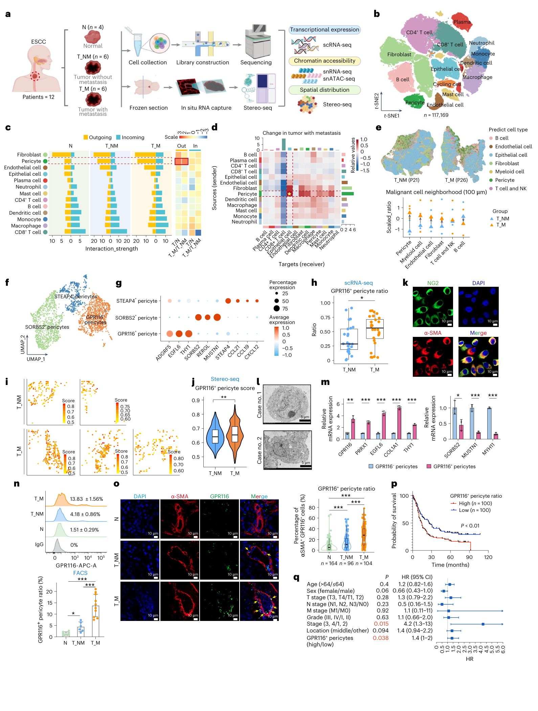
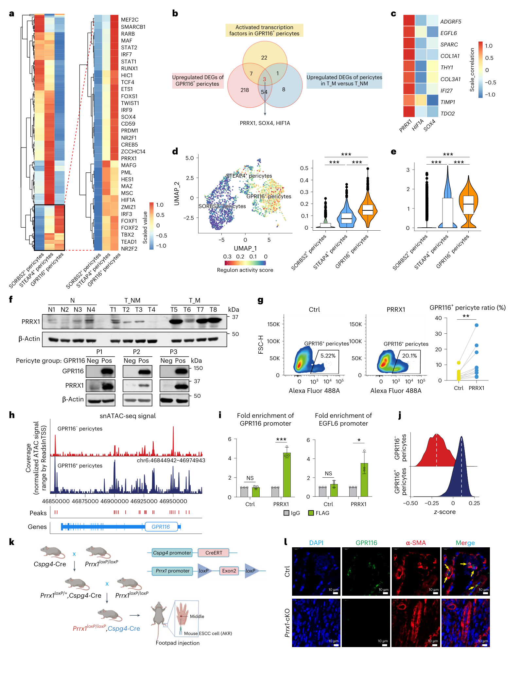
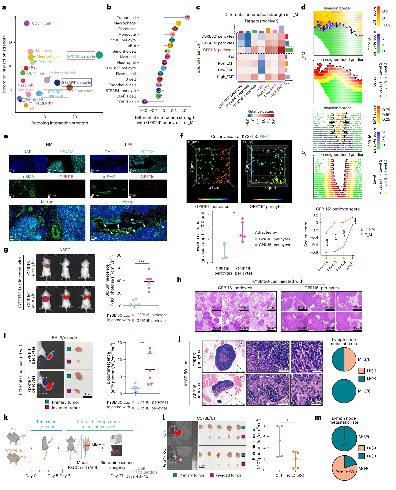
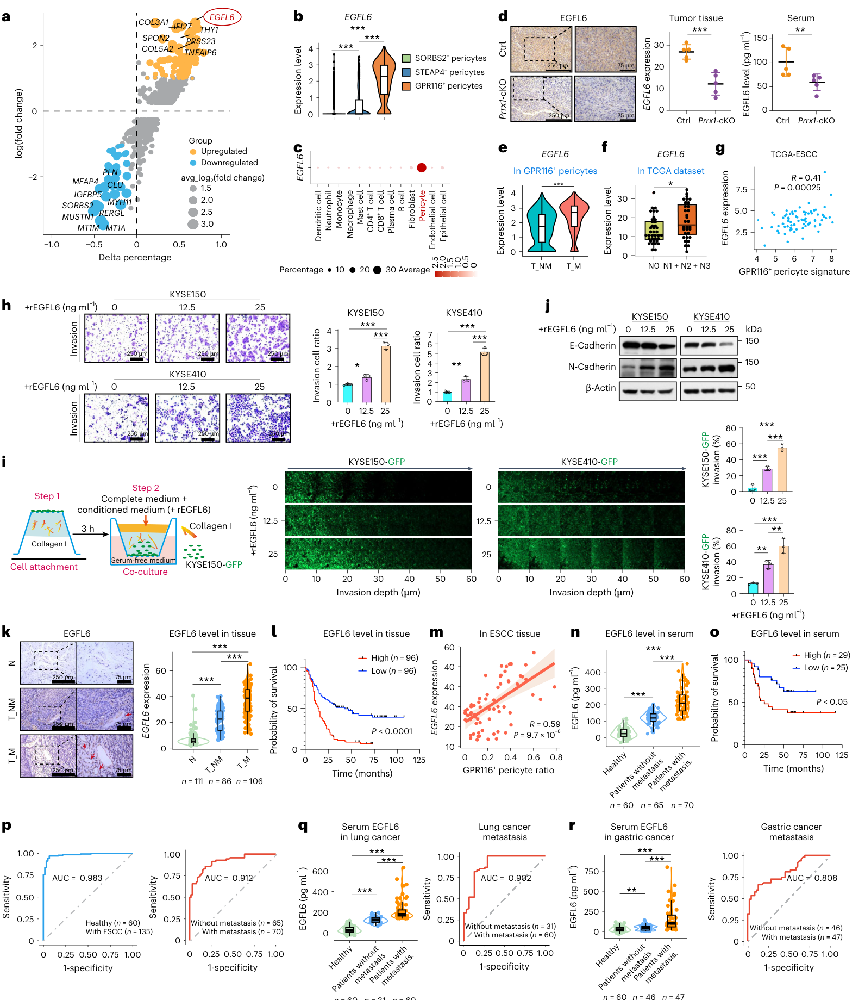
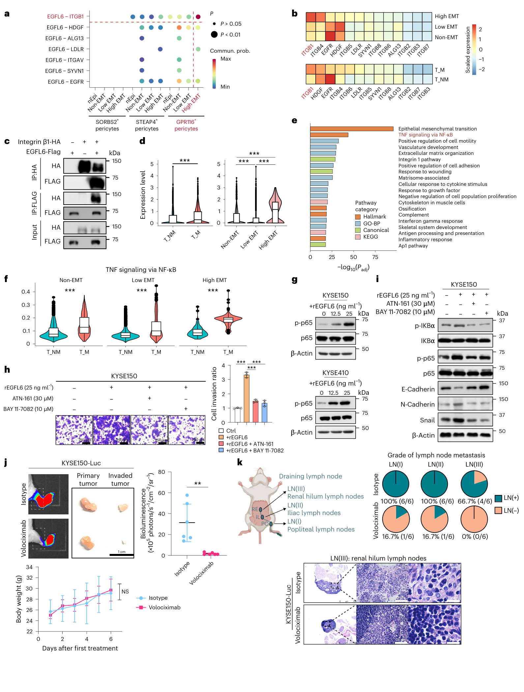
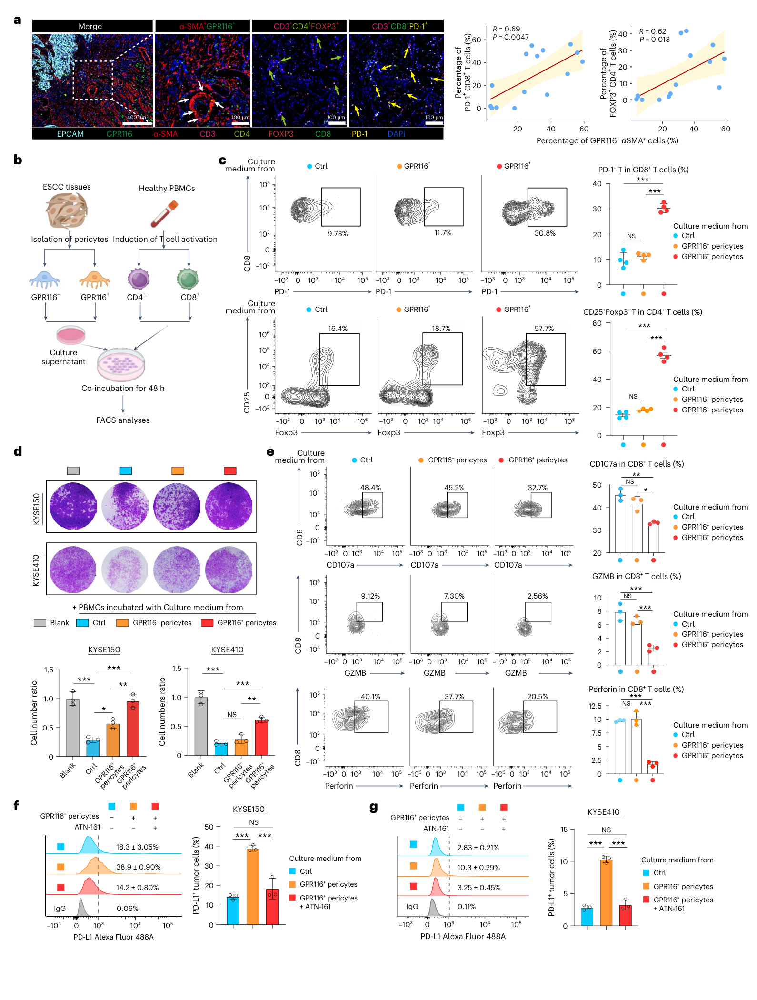
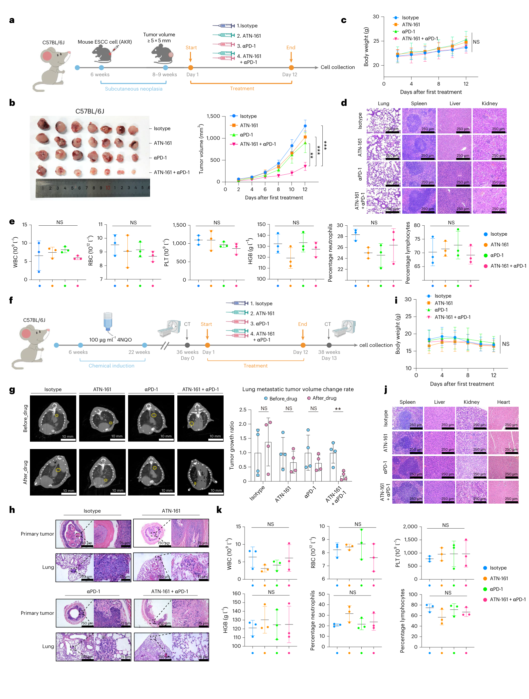

# Single-cell multi-omic and spatial profiling of esophageal squamous cell carcinoma reveals the immunosuppressive role of GPR116+ pericytes in cancer metastasis

## 本文目录

- [基本信息](#基本信息)
  - [PDF 解析质量](#pdf-解析质量)
  - [图像文件状态](#图像文件状态)
  - [句子 ID 依据与覆盖口径](#句子-id-依据与覆盖口径)
- [本论文主图](#本论文主图)
- [Extended Data 与补充材料状态](#extended-data-status)
- [生物学故事前情](#生物学故事前情)
- [重要缩写表](#重要缩写表)
- [论文详细解读](#论文详细解读)
  - [研究问题与科学背景](#研究问题与科学背景)
  - [研究设计与数据结构](#研究设计与数据结构)
  - [方法速览与分析框架](#方法速览与分析框架)
  - [原文 Results（按论文顺序逐句覆盖）](#original-results)
    - [1. Cellular interaction dynamics within the prometastatic TME in ESCC](#result-1-cellular-interaction-dynamics)
    - [2. Clinical significance of GPR116+ pericytes in ESCC metastasis](#result-2-clinical-significance)
    - [3. PRRX1 drives the differentiation of GPR116+ pericytes](#result-3-prrx1-differentiation)
    - [4. GPR116+ pericytes contribute to ESCC metastasis](#result-4-gpr116-pericytes-metastasis)
    - [5. GPR116+ pericyte-derived EGFL6 aids ESCC diagnosis and prognosis](#result-5-egfl6-diagnosis-prognosis)
    - [6. GPR116+ pericytes induce metastasis via the EGFL6–integrin β1–NF-κB axis](#result-6-egfl6-integrin-nfkb)
    - [7. GPR116+ pericytes exhibit immunosuppressive properties](#result-7-immunosuppression)
    - [8. Integrin β1 inhibitor enhances the antitumor effect of αPD-1](#result-8-atn161-pd1)
  - [作者结论与证据强度](#作者结论与证据强度)
- [独立方法学详解](#独立方法学详解)
  - [主文 Methods 逐句覆盖表（183/183）](#methods-sentence-table)
  - [研究对象、样本和数据结构](#method-module-1)
  - [实验流程和数据生成](#method-module-2)
  - [数据预处理和特征构建](#method-module-3)
  - [统计学分析方法](#method-module-4)
  - [统计模型、机器学习模型或计算框架](#method-module-5)
  - [验证策略、稳健性和混杂控制](#method-module-6)
  - [可重复性资源和迁移注意点](#method-module-7)
- [生物学与临床意义](#生物学与临床意义)
- [局限性与危险假设](#局限性与危险假设)
- [深度研究洞察](#深度研究洞察)
- [可借鉴或迁移的思路](#可借鉴或迁移的思路)
- [可复用学术表达](#可复用学术表达)
- [相关论文与概念](#相关论文与概念)
- [统一覆盖审计](#unified-coverage-audit)
  - [Results 三分审计](#results-coverage-audit)
  - [Methods 逐句覆盖与误标审计](#methods-coverage-audit)
  - [低置信解析与缺失补充材料](#low-confidence-materials)

## 基本信息

- 原文题名：*Single-cell multi-omic and spatial profiling of esophageal squamous cell carcinoma reveals the immunosuppressive role of GPR116+ pericytes in cancer metastasis*。（来源：`P001.S0001`）
- 中文题名：单细胞多组学与空间图谱揭示 GPR116+ 周细胞在食管鳞状细胞癌转移中的免疫抑制作用。（忠实译自 `P001.S0001`）
- 期刊：*Nature Genetics*，Volume 57，2494–2508。（来源：`P001.S0001`、`P001.S0024`）
- 年份：2025；在线发表日期为 2025 年 10 月 10 日。（来源：`P001.S0002` 的页内标题、`P001.S0024`）
- DOI：10.1038/s41588-025-02341-9。（来源：`P001.S0001`）
- 作者（按 PDF 作者栏顺序完整转录）：Xiaoya Pei、Zhichao Liu、Lin Tang、Junpeng Zhang、Yan He（单位 3）、Xiaowan Zhuang、Yuxiang Song、Shaocong Peng、Yan He（单位 1）、Yahui Zhao、Xuanzhang Huang、Yiwei Xu、Junyi Li、Liang Peng、Xingyuan Shi、Fan Zhang、Chong Liu、Mingliang He、Wei Dai、Liang Wu、Simon Law、Jinbao Liu、Zhenning Wang、Zhigang Li、Wenwen Xu、Zhihua Liu、Bin Li。PDF 作者栏确实出现两位同名的 Yan He，故以单位编号区分，不擅自合并。（来源：PDF 第 1 页作者栏；对应抽取块 `P001.S0007–P001.S0010`）
- 共同第一作者标记：Xiaoya Pei、Zhichao Liu、Lin Tang、Junpeng Zhang 均带脚注 15。（来源：PDF 第 1 页作者栏；对应抽取块 `P001.S0007`）
- 通讯作者栏列出 Zhenning Wang、Zhigang Li、Wenwen Xu、Zhihua Liu 与 Bin Li 的联系邮箱。（来源：`P001.S0009–P001.S0010`、`P001.S0023`）
- 研究领域：食管鳞状细胞癌、转移性肿瘤微环境、周细胞异质性、单细胞转录组、单核转录组/染色质可及性、空间转录组、免疫抑制、转化生物标志物与联合免疫治疗。（来源：`P001.S0012–P001.S0017`、`P003.S0012–P003.S0015`）
- 关键词：ESCC、GPR116/ADGRF5、pericyte、PRRX1、EGFL6、integrin β1、NF-κB、EMT、Stereo-seq、Treg、PD-1/PD-L1、ATN-161、volociximab。（来源：`P003.S0012–P003.S0014`、`P003.S0048–P003.S0050`、`P009.S0066–P009.S0069`、`P011.S0030–P011.S0064`）
- 本地 PDF：`pdfs/processed/escc-gpr116-pericytes-metastasis-nature-genetics-2025.pdf`。

### PDF 解析质量

- 文字抽取方式：使用 `scripts/build_pdf_llm_pack.py --engine pymupdf` 生成 `tmp/2025-escc-gpr116-pericytes-llm-pack.md` 与 `tmp/2025-escc-gpr116-pericytes-manifest.json`。解析元数据为 39 页、2,012 个句子 ID；自动分类计数为 Results 574、Methods 398、Discussion 110、Supplementary 271、References 557、Other 78、Title 24。以上是 manifest 元数据，不是论文正文句子。
- PDF 的真实结构不能直接由自动分类计数推断：主文 Fig. 1–7 的图像页、相邻图注、双栏 Results 和 Discussion 经常在抽取时交错；例如 Fig. 2 图注插入 `P003.S0020–P003.S0028`，Fig. 4 与 Fig. 3 图注在 `P006.S0034–P006.S0039` 交错，Fig. 6 与 Fig. 5 图注在 `P009.S0035–P009.S0040` 交错，Fig. 7 图注又切入 `P011.S0043–P011.S0047` 和 Discussion 的 `P011.S0074–P011.S0079`。这些区段必须按 PDF 版面人工复位，不能把自动顺序当作原文叙事顺序。
- 主文图像内的坐标、基因名、显著性星号和 panel 标签被拆成大量非叙事 ID，例如 Fig. 1 图像页的 `P002.S0001–P002.S0063`、Fig. 2 的 `P004.S0001–P004.S0049`、Fig. 3 的 `P005.S0001–P005.S0079`。这些 ID 可用于图内审计，但不应伪造成完整英文句子。
- Extended Data Fig. 1–7 随 PDF 提供，位于 PDF 第 20–32 页；自动分类把其中一部分标成 `supplementary`、另一部分标成 `references`，因此自动 section 标签不可靠。（来源：`P020.S0024–P021.S0012`、`P022.S0026–P023.S0017`、`P024.S0021–P024.S0022`、`P025.S0023–P026.S0002`、`P027.S0031–P028.S0002`、`P029.S0019–P030.S0017`、`P031.S0023–P032.S0017`）
- Nature Portfolio Reporting Summary 位于 PDF 第 33–39 页，而且同一段文字常被抽取两次，例如随机化描述在 `P035.S0001–P035.S0006`、盲法描述在 `P035.S0007–P035.S0014` 重复。重复 ID 按“已审计但不重复解释”处理。
- 一处需要人工保留的原文内部冲突：Fig. 4 图注把 ESCC 血清组写为 M = 65、NM = 70（`P006.S0067`），但图内标签和两中心队列构成给出 NM = 65、M = 70（`P007.S0035`、`P016.S0021–P016.S0022`）。按队列加总应为 NM 65、M 70；本笔记并列报告图注冲突，不作静默修正。
- PDF 原始版面还有两处内部文本错误：Methods 在人工扩充 CellChat 受体库时把 `EGFL6` 写成 `EGLF6`（`P017.S0001`），Fig. 7 图注把正文和图内一致使用的 `ATN-161` 写成 `ANT-161`（`P011.S0046`、`P011.S0050–P011.S0053`）。本笔记在叙事中使用一致的分子/药物名，同时把两处原文笔误显式留档；它们不是 PDF 抽取噪音。
- 另一处方法学内部冲突：正文 Methods 写明分选 `CD146+GPR116+` 周细胞（`P017.S0024–P017.S0027`），Reporting Summary 的 gating strategy 却写成保留 `CD146-negative, GPR116-positive` 群（`P039.S0001–P039.S0010`）。这很可能是报告表填写或抽取层面的错误，但在无 Supplementary gating figure 的情况下不能擅自裁决。
- 随机化报告有三层不一致：主文总括句称实验未随机化（`P018.S0045–P018.S0049`），同一主文的皮下模型和 4NQO 模型却分别写明按肿瘤大小随机分组及随机分组（`P017.S0051`、`P017.S0061`），Reporting Summary 又称动物按窝、出生日期和性别平衡后随机分组，细胞实验也随机分组（`P035.S0001–P035.S0006`）。本笔记并列保留三种表述。
- 动物伦理机构同样不一致：主文写瑞业生物科技实验动物伦理委员会，Reporting Summary 写广州医科大学动物实验伦理委员会；PDF 没有逐模型审批号足以说明二者分工，本笔记并列报告两种表述。（`P016.S0005`、`P038.S0030–P038.S0031`）

### 图像文件状态

- 主文 Fig. 1–7 已按 panel 区域截取为 7 个 PNG 文件，置于 `assets/spatial-transcriptomics/2025-escc-gpr116-pericytes/`，并在对应 Results 小节实际嵌入。
- 图像页依次来自 PDF 第 2、4、5、7、8、10、12 页；图片只保留主图 panel 区域，中文图注依据相邻正式图注逐 panel 重组。（来源：`P003.S0002–P003.S0009`、`P003.S0021–P003.S0028`、`P006.S0002–P006.S0005`、`P006.S0035–P006.S0039`、`P009.S0002–P009.S0005`、`P009.S0036–P009.S0040`、`P011.S0044–P011.S0047`、`P011.S0074–P011.S0079`）

### 句子 ID 依据与覆盖口径

- 全文句子 ID 依据来自 `scripts/build_pdf_llm_pack.py --engine pymupdf` 生成的 `tmp/2025-escc-gpr116-pericytes-llm-pack.md` 与 manifest；PDF 共 39 页、2,012 个句子 ID。
- Results 的 574 个自动分类 ID 经版面复位后分为 228 个真实叙事 ID、39 个正式图注 ID、307 个图内标签/坐标/单值/页眉页脚或错序 ID；228 个真实叙事 ID 均在逐句表覆盖。
- 主文 Methods 的真实范围为 `P016.S0002–P018.S0063`，183/183 个 ID 均逐句覆盖。reporting summary 的 215 个 ID 被脚本误标为 Methods，作为报告质量材料审计，不混入主文 Methods 分母。
- Discussion 用于作者结论、局限和证据边界，核心范围为 `P011.S0065–P013.S0037`。
- 本地 PDF 未提供正文引用的 Supplementary Note、Supplementary Tables 1–7、Supplementary Figs. 1–2 或独立 Source Data 文件；依赖这些材料的参数、门控图、队列明细和原始数值均明确标为材料缺失。（来源：`P016.S0013`、`P016.S0018`、`P016.S0025–P016.S0026`、`P016.S0038–P016.S0039`、`P016.S0050`、`P017.S0008–P017.S0011`、`P018.S0009`、`P009.S0071–P009.S0072`、`P018.S0062`）

## 本论文主图

| 原文图表 | 原文图题/核心信息 | 是否截取 | 实际图像文件 | 放置位置 |
|---|---|---|---|---|
| Fig. 1 | *Cellular dynamics reveal the role of GPR116+ pericytes in ESCC metastasis*：从 12 例患者的多组学设计、117,169 个 scRNA-seq 细胞和细胞通讯/空间邻近，推进到三个周细胞亚群、GPR116+ 周细胞的临床富集、组织验证、生存与多变量 Cox。（来源：`P003.S0002–P003.S0009`、`P003.S0024–P003.S0028`、`P003.S0029–P003.S0050`、`P006.S0005–P006.S0016`） | 是 | `fig1-cellular-landscape-gpr116-pericytes.png` | [Results 1：细胞互动与空间图谱](#result-1-cellular-interaction-dynamics) |
| Fig. 2 | *PRRX1 drives the differentiation of GPR116+ pericytes*：SCENIC 与三重候选交集锁定 PRRX1，继而以表达、蛋白、过表达/敲低、snATAC、ChIP 和 Cspg4-CreERT;Prrx1 cKO 验证其调控作用；荧光素酶报告实验位于 Extended Data Fig. 3i，而非主图 Fig. 2。（来源：`P003.S0021–P003.S0023`、`P003.S0051–P003.S0055`、`P006.S0017–P006.S0064`、`P024.S0038–P024.S0041`） | 是 | `fig2-prrx1-differentiation.png` | [Results 3：PRRX1 驱动分化](#result-3-prrx1-differentiation) |
| Fig. 3 | *GPR116+ pericytes contribute to ESCC metastasis*：CellChat、high-EMT 肿瘤细胞、侵袭前沿空间梯度、多重 IF、3D/2D 侵袭，以及尾静脉肺转移、足垫淋巴转移和 Prrx1 cKO 模型构成“定位—功能—在体干预”证据链。（来源：`P006.S0002–P006.S0005`、`P006.S0038–P006.S0039`、`P006.S0065–P007.S0007`、`P007.S0038–P007.S0042`、`P009.S0005–P009.S0027`） | 是 | `fig3-escc-metastasis.png` | [Results 4：周细胞促进转移](#result-4-gpr116-pericytes-metastasis) |
| Fig. 4 | *The prometastatic role and clinical implications of EGFL6*：EGFL6 的周细胞来源、Prrx1 cKO 后组织/血清下降、重组蛋白促侵袭与 EMT、组织队列/生存、ESCC 血清 ROC，以及肺癌和胃癌转移预测。（来源：`P006.S0035–P006.S0038`、`P006.S0067–P006.S0069`、`P009.S0028–P009.S0065`） | 是 | `fig4-egfl6-biomarker.png` | [Results 5：EGFL6 诊断与预后](#result-5-egfl6-diagnosis-prognosis) |
| Fig. 5 | *GPR116+ pericytes induce metastasis via the EGFL6–integrin β1–NF-κB axis*：配体–受体推断、EGFL6–integrin β1 免疫共沉淀、ITGB1/EMT/NF-κB 状态、EGFL6 剂量反应、ATN-161 或 BAY 11-7082 拯救，以及 volociximab 抑制多级淋巴结转移。（来源：`P009.S0002–P009.S0005`、`P009.S0037–P009.S0040`、`P009.S0066–P011.S0029`） | 是 | `fig5-egfl6-integrin-nfkb.png` | [Results 6：EGFL6–integrin β1–NF-κB 轴](#result-6-egfl6-integrin-nfkb) |
| Fig. 6 | *Immunosuppressive properties of GPR116+ pericytes*：组织空间相关、周细胞–T 细胞共培养、PD-1+CD8+ 与 FOXP3+CD4+ Treg 扩增、PBMC 杀伤和 CD8 效应分子下降，以及肿瘤 PD-L1 上调被 integrin β1 抑制剂逆转。（来源：`P009.S0036–P009.S0039`、`P009.S0069–P009.S0073`、`P011.S0030–P011.S0047`） | 是 | `fig6-immunosuppression.png` | [Results 7：免疫抑制](#result-7-immunosuppression) |
| Fig. 7 | *Integrin β1 inhibitor enhances the antitumor effect of αPD-1*：在 AKR 皮下移植模型和 4NQO 自发 ESCC 模型中比较 isotype、ATN-161、αPD-1 与联合治疗，同时评估原发瘤、肺转移、体重、血液学和脏器组织学。（来源：`P011.S0044–P011.S0064`、`P011.S0074–P011.S0079`） | 是 | `fig7-atn161-pd1-combination.png` | [Results 8：ATN-161 联合 αPD-1](#result-8-atn161-pd1) |

## Extended Data 与补充材料状态

### Extended Data

本地 PDF 含 Extended Data Fig. 1–7，没有 Extended Data Fig. 8 或更高编号。部分图跨两页，第一页为大图、后一页为续图或完整图注。

| Extended Data | PDF 页 | 原文主题 | 与主图关系 |
|---|---:|---|---|
| Extended Data Fig. 1 | 20–21 | 人食管癌 scRNA-seq 与 Stereo-seq profiling。（来源：`P020.S0024–P020.S0025`、`P021.S0001–P021.S0012`） | 支撑 Fig. 1 的细胞注释、组成和空间分布 |
| Extended Data Fig. 2 | 22–23 | 人食管癌周细胞亚群的详细刻画。（来源：`P022.S0026–P022.S0027`、`P023.S0001–P023.S0017`） | 支撑 Fig. 1 的三个周细胞亚群、整合数据与临床关联 |
| Extended Data Fig. 3 | 24 | PRRX1 对 GPR116+ 周细胞分化的贡献。（来源：`P024.S0021–P024.S0022`） | 支撑 Fig. 2 的 PRRX1 候选、扰动和启动子调控 |
| Extended Data Fig. 4 | 25–26 | snRNA-seq 与 snATAC-seq 数据和质量信息。（来源：`P025.S0023–P025.S0024`、`P026.S0001–P026.S0002`） | 支撑 Fig. 2 的染色质可及性与转录因子活性 |
| Extended Data Fig. 5 | 27–28 | GPR116+ 周细胞促进肿瘤侵袭与 EMT。（来源：`P027.S0031–P027.S0032`、`P028.S0001–P028.S0002`） | 支撑 Fig. 3 的通讯、EMT、体外侵袭和在体转移 |
| Extended Data Fig. 6 | 29–30 | EGFL6 结合肿瘤细胞 integrin β1 并激活 NF-κB，从而促进 EMT。（来源：`P029.S0019–P029.S0020`、`P030.S0001–P030.S0017`） | 支撑 Fig. 5 的受体、抑制剂拯救和 volociximab |
| Extended Data Fig. 7 | 31–32 | GPR116+ 周细胞与 PD-1+CD8+ T 细胞及 CD4+ Treg 的相关性。（来源：`P031.S0023–P031.S0024`、`P032.S0002–P032.S0017`） | 支撑 Fig. 6 的免疫相关和泛癌分析 |

### 未随本地 PDF 提供的材料

- Supplementary Note：正文把 scRNA-seq、Stereo-seq 和 snATAC-seq 的详细 protocol 指向该文件，但本地 PDF 不含其内容。（来源：`P016.S0026`、`P016.S0039`、`P016.S0050`）
- Supplementary Tables 1–7：分别承载测序队列临床特征、TMA/生存队列、血清队列、周细胞 DEG、signature gene 和 siRNA 序列等关键信息；本地 PDF 只有引用，没有表体。（来源：`P016.S0013`、`P016.S0018`、`P016.S0025`、`P016.S0038`、`P017.S0009–P017.S0011`、`P018.S0009`）
- Supplementary Figs. 1–2：正文称其展示 flow cytometry sequential gating strategies，但本地 PDF 未包含。（来源：`P009.S0071–P009.S0072`、`P039.S0011–P039.S0012`）
- Source Data：正文声明 “Source data are provided with this paper”，但 inbox/processed PDF 本身不含独立 Source Data 工作簿或文件。（来源：`P018.S0062`）

## 生物学故事前情

1. 作者从临床问题出发：肿瘤转移是治疗失败和死亡的主要原因，食管癌起病隐匿，超过一半患者初诊时已有转移，5 年总生存率约为 20%；因此需要从转移性肿瘤微环境中寻找新的靶点和生物标志物。（来源：`P001.S0002–P001.S0006`、`P001.S0018–P001.S0019`）
2. 转移不是只由肿瘤细胞自身决定，而是依赖 TME 多种成分的动态协作；但“哪些细胞在转移性 ESCC 中改变、怎样接近并影响侵袭性肿瘤细胞”仍不清楚。（来源：`P001.S0004–P001.S0005`、`P003.S0016–P003.S0019`）
3. 周细胞是位于血管基底膜中的血管壁细胞，已有研究提示其参与血管发育、重塑和肿瘤相关互动，但由于数量少，常被当作均一群体；既往研究甚至同时存在“促肿瘤参与者”和“抗肿瘤 gatekeeper”两类描述。（来源：`P001.S0020–P001.S0022`、`P003.S0009–P003.S0011`）
4. 本文由此提出一个自然的主线：先在转移与非转移原发灶中定位最显著改变的 TME 细胞，再把周细胞拆成亚群，追问其上游分化因子、对肿瘤细胞的下游配体–受体机制、对 T 细胞和免疫治疗的影响，以及能否形成血清标志物与可干预靶点。（来源：`P003.S0034–P003.S0048`、`P006.S0017–P006.S0065`、`P009.S0028–P009.S0066`、`P011.S0030–P011.S0064`）
5. 阅读全文时应抓住“PRRX1 → GPR116+ 周细胞 → EGFL6 → 肿瘤细胞 integrin β1 → NF-κB/EMT”这一促转移轴，同时并行跟踪免疫支线：Treg 增加、CD8+ T 细胞耗竭/效应下降和肿瘤 PD-L1 上调。（来源：`P006.S0053–P006.S0064`、`P009.S0066–P011.S0020`、`P011.S0030–P011.S0047`）
6. 这条故事线最终分成两个转化出口：组织/血清层面的 GPR116+ 周细胞和 EGFL6 标志物，以及 integrin β1 阻断联合 αPD-1 的动物治疗策略；两者都仍处于验证或临床前阶段，不能写成已可用于临床。（来源：`P009.S0048–P009.S0065`、`P011.S0048–P011.S0064`、`P013.S0029`）

## 重要缩写表

| 缩写 | 中文含义 | 本文语境中的具体指代 | 阅读时注意 |
|---|---|---|---|
| ESCC | 食管鳞状细胞癌 | 本文患者、细胞系和小鼠研究对应的疾病实体。（来源：`P001.S0012`、`P003.S0017`） | 不能把 ESCC 机制直接外推到所有食管癌亚型 |
| TME | 肿瘤微环境 | 肿瘤细胞、免疫细胞、周细胞、成纤维细胞、内皮细胞等构成的细胞生态。（来源：`P001.S0004–P001.S0005`、`P003.S0029–P003.S0038`） | CellChat 的“互动”是表达推断，不等于直接接触 |
| T_M / T_NM | 转移患者肿瘤 / 非转移患者肿瘤 | 按患者是否存在转移对原发 ESCC 肿瘤进行分组。（来源：`P003.S0017`） | 是横断面分组，不是同一患者随时间转移前后配对 |
| N | 邻近正常组织 | 主要为距原发肿瘤 5 cm 的配对邻近组织。（来源：`P016.S0012`） | “正常”是邻近组织，不等同于健康食管 |
| scRNA-seq | 单细胞 RNA 测序 | 117,169 个质控后细胞的主要细胞图谱。（来源：`P016.S0026–P016.S0038`） | 大细胞数不替代患者层重复 |
| snRNA-seq | 单核 RNA 测序 | 与 snATAC-seq 配对用于周细胞转录状态和染色质状态分析。（来源：`P003.S0018`、`P006.S0046–P006.S0052`） | 具体样本分配依赖缺失的 Supplementary Table 1 |
| snATAC-seq | 单核染色质可及性测序 | 109,183 个质控后细胞用于 peak、motif 与转录因子活性分析。（来源：`P016.S0050–P016.S0056`） | 可及性和 motif 活性不等于直接转录调控，需 ChIP/报告基因补强 |
| Stereo-seq | 时空增强分辨组学测序 | 5 例 ESCC、195,366 个 bin50 pseudo-spots/cells 的空间分析。（来源：`P003.S0039`、`P016.S0039–P016.S0046`） | bin50 直径约 25 μm，论文虽写“近单细胞”，仍可能混合多个细胞 |
| GPR116 / ADGRF5 | GPR116 表面标志 | 三个周细胞亚群之一的命名标志，作者将其作为促转移周细胞状态的核心标签。（来源：`P003.S0048–P003.S0050`） | “GPR116+”在本文是细胞群标签，不能自动等同于 GPR116 本身是功能驱动 |
| PRRX1 | 转录因子 PRRX1 | 作者提出其驱动 GPR116+ 周细胞分化，并调控 GPR116 与 EGFL6 启动子。（来源：`P006.S0017–P006.S0064`） | 其上游激活机制仍未解析（`P013.S0033`） |
| EGFL6 | 分泌蛋白 EGFL6 | GPR116+ 周细胞高表达的配体、血清候选标志物和促侵袭效应分子。（来源：`P009.S0028–P009.S0065`） | 肺癌/胃癌中的来源细胞和相同机制未在本文证明 |
| ITGB1 / integrin β1 | 整合素 β1 | 高 EMT 肿瘤细胞上的 EGFL6 受体候选和药物干预节点。（来源：`P009.S0066–P011.S0017`） | CellChat 候选由 IP 和抑制剂实验补强，但仍属模型内机制 |
| NF-κB | 核因子 κB 通路 | EGFL6–integrin β1 下游，以 p-p65 增加和抑制剂拯救支持。（来源：`P011.S0010–P011.S0020`） | 通路激活与转移因果需依赖抑制剂实验，而非仅富集分析 |
| EMT | 上皮–间质转化 | 肿瘤细胞按 mesenchymal score 减 epithelial score 分层的侵袭相关状态。（来源：`P007.S0004–P007.S0007`、`P017.S0008–P017.S0010`） | 是 signature score，不等于完整谱系转换 |
| Treg | 调节性 T 细胞 | 文中主要指 FOXP3+CD4+ T 细胞，并在 GPR116+ 周细胞邻近/共培养后增加。（来源：`P011.S0030–P011.S0037`） | 相关与共培养证据不能单独证明患者内长期扩增动力学 |
| ICB | 免疫检查点阻断 | 本文用 αPD-1，并与 ATN-161 联合。（来源：`P011.S0048–P011.S0055`） | 疗效证据来自小鼠，不是人群临床结局 |
| PBMC | 外周血单个核细胞 | 用于检测周细胞条件培养基对肿瘤杀伤的影响。（来源：`P011.S0038–P011.S0040`） | PBMC 杀伤是体外复合 readout，不定位到单一免疫细胞机制 |
| TMA | 组织芯片 | 用于 GPR116+ 周细胞、EGFL6、预后和组织验证。（来源：`P016.S0018`、`P006.S0009–P006.S0015`、`P009.S0049–P009.S0054`） | 队列明细在缺失的 Supplementary Tables 2–3 |
| cKO | 条件性敲除 | Cspg4-CreERT 驱动的周细胞 Prrx1 条件敲除。（来源：`P017.S0038–P017.S0048`） | 需保留 Cre 特异性与重组效率的验证边界 |
| ROC / AUC | 受试者工作特征曲线 / 曲线下面积 | 用于评估血清 EGFL6 区分 ESCC、转移状态及肺癌/胃癌转移的能力。（来源：`P009.S0055–P009.S0064`） | AUC 不等于已确定临床阈值、校准度或前瞻性效用 |
| 4NQO | 4-硝基喹啉-1-氧化物 | 用于建立自发食管肿瘤并在可见肺转移后开始治疗。（来源：`P011.S0058–P011.S0063`、`P017.S0057–P017.S0064`） | 仍是小鼠模型 |

## 论文详细解读

### 研究问题与科学背景

本文不是简单绘制 ESCC 单细胞图谱，而是连续回答五个层层递进的问题：

1. 转移性与非转移性 ESCC 原发灶的 TME 中，哪类细胞的通讯和空间位置变化最突出？作者的初筛把周细胞定位为转移状态中 outgoing interaction 增幅和肿瘤邻近变化最明显的基质细胞。（来源：`P003.S0034–P003.S0047`）
2. 周细胞是否包含与转移特异相关的亚群？重聚类得到 STEAP4+、SORBS2+、GPR116+ 三群，GPR116+ 群在转移病例中富集，并与较差生存相关。（来源：`P003.S0048–P005.S0078`、`P006.S0005–P006.S0016`）
3. GPR116+ 周细胞怎样形成？作者通过 SCENIC、表达交集、snATAC、ChIP/报告基因和条件性敲除，把 PRRX1 提为上游转录调控因子。（来源：`P006.S0017–P006.S0064`）
4. 这一亚群怎样促进转移和免疫抑制？作者提出 EGFL6–integrin β1–NF-κB/EMT 轴，并把 Treg、CD8+ T 细胞效应下降和肿瘤 PD-L1 上调作为并行免疫表型。（来源：`P009.S0066–P011.S0047`）
5. 机制能否转化为标志物和治疗？作者测试血清 EGFL6 的 ROC/预后关联，并在小鼠中测试 volociximab 或 ATN-161、以及 ATN-161 联合 αPD-1。（来源：`P009.S0048–P009.S0065`、`P011.S0021–P011.S0029`、`P011.S0048–P011.S0064`）

### 研究设计与数据结构

#### 研究总体结构

| 层级 | 数据/实验 | 原文关键数字 | 回答的问题 |
|---|---|---:|---|
| 人体发现队列 | 12 例病理确诊 ESCC 的原发肿瘤：T_NM 6 例、T_M 6 例；另有 4 份来自转移患者、距原发灶 5 cm 的配对邻近正常组织 | 12 位患者、16 份组织样本 | 建立转移/非转移 TME 的单细胞多组学框架。（来源：`P001.S0012`、`P016.S0010–P016.S0013`） |
| scRNA-seq | 质控后整合并注释主要细胞类型 | 117,169 个细胞、14 个主要细胞类型 | 比较细胞组成、周细胞亚群和 CellChat 通讯。（来源：`P003.S0029–P003.S0038`、`P016.S0026–P016.S0038`） |
| snRNA-seq/snATAC-seq | 配对转录与染色质可及性分析 | snATAC 质控后 109,183 个细胞 | 验证 GPR116+ 状态、peak、motif 和 PRRX1 调控。（来源：`P006.S0046–P006.S0060`、`P016.S0050–P016.S0056`） |
| Stereo-seq | 5 例 ESCC：T_NM 2 例、T_M 3 例 | 195,366 个 bin50 pseudo-spots/cells；其中图注比较 GPR116+ 周细胞为 T_M 1,712、T_NM 244 个 | 空间注释、侵袭前沿距离和 GPR116+ 周细胞/high-EMT 肿瘤细胞邻近。（来源：`P003.S0039–P003.S0045`、`P003.S0024`、`P016.S0039–P016.S0049`） |
| 公共单细胞整合 | 合并作者数据与 4 个公开 ESCC scRNA-seq 数据集 | GPR116+ 周细胞比例比较：转移患者 29 例、非转移患者 25 例 | 检验亚群富集是否跨数据集复现。（来源：`P003.S0009`、`P005.S0074–P005.S0078`） |
| 新鲜组织流式 | 邻近正常、非转移肿瘤、转移肿瘤 | N 7、T_NM 6、T_M 10 | 在新鲜样本中验证 GPR116+ 周细胞比例。（来源：`P003.S0024`） |
| GPR116+ 周细胞 TMA/IF | 邻近正常、非转移肿瘤、转移肿瘤；另作生存和 Cox | N 164、T_NM 96、T_M 104，共 364；生存/Cox 队列 200 | 组织层富集、预后和独立关联。（来源：`P003.S0024–P003.S0026`、`P006.S0009–P006.S0015`） |
| EGFL6 组织验证 | ESCC TMA/IHC 与生存 | N 111、T_NM 86、T_M 106，共 303；生存 192 | 验证组织 EGFL6 与转移、预后及 GPR116+ 周细胞相关。（来源：`P006.S0067`、`P009.S0049–P009.S0054`） |
| ESCC 血清 EGFL6 | ESCC 患者来自上海胸科医院与汕头大学医学院肿瘤医院；健康对照来自广州医科大学附属第五医院 | 健康 60；ESCC NM 65、M 70，总 ESCC 135 | 评估 ESCC 检出、转移区分和生存关联。（来源：`P016.S0021–P016.S0023`、`P009.S0055–P009.S0061`；Fig. 4 图注的 NM/M 数字冲突见解析质量） |
| 跨癌种血清 EGFL6 | 肺癌与胃癌队列 | 肺癌：HC 60、NM 31、M 60；胃癌：NM 46、M 47，并复用图示健康对照 60 | 探索 EGFL6 的跨癌种转移区分能力。（来源：`P006.S0068`、`P016.S0023–P016.S0024`、`P009.S0062–P009.S0064`） |
| 组织免疫空间验证 | ESCC 多重 IF | 总 n = 15；Extended Data Fig. 7m 图注原文写“有转移 T_M，n=8；无转移 T_M，n=7”，第二个 `T_M` 与“无转移”文字冲突，疑为原文笔误，不能静默改成 T_NM | 检验 GPR116+ 周细胞与 PD-1+CD8+、FOXP3+CD4+ 细胞的空间相关。（来源：`P009.S0036`、`P032.S0017`、`P011.S0033–P011.S0035`） |
| 体外机制 | 原代 GPR116−/+ 周细胞、ESCC 细胞、T 细胞/PBMC；PRRX1 操作、重组 EGFL6、IP、ChIP/报告基因、侵袭、流式、免疫印迹 | 多数定量为每组 n = 3–5；具体 panel 数字见 Fig. 2–6 图注 | 从候选相关推进到转录调控、配体–受体、EMT/NF-κB 和免疫功能。（来源：`P003.S0052–P003.S0053`、`P006.S0036–P006.S0038`、`P009.S0036–P009.S0039`） |
| 在体因果与治疗 | 尾静脉肺转移、足垫淋巴转移、Prrx1 cKO、volociximab、AKR 皮下瘤、4NQO 自发模型 | 周细胞比较通常 n = 5–6/组；皮下联合治疗 n = 7/组；4NQO 治疗 n = 4/组 | 检验促转移因果、integrin β1 阻断和与 αPD-1 联合的临床前效应。（来源：`P006.S0038`、`P009.S0015–P009.S0026`、`P009.S0037–P009.S0038`、`P011.S0045–P011.S0064`、`P011.S0075–P011.S0078`） |

#### 队列数字的阅读边界

- 117,169 个 scRNA-seq 细胞、109,183 个 snATAC-seq 细胞和 195,366 个空间 pseudo-spots 提供高维观测量，但患者层发现队列仍只有 12 人、空间队列只有 5 人；统计独立单位不能默认等于每个细胞或 spot。（来源数字：`P016.S0010–P016.S0012`、`P016.S0031`、`P016.S0042`、`P016.S0055`）
- 摘要把空间数据表述为“195,366 cells”，Methods 则明确称 “195,366 pseudo-spots/cells”，且 bin50 直径约 25 μm；本笔记宜用“pseudo-spots/cells”而不是无条件称单细胞。（来源：`P001.S0012`、`P016.S0041–P016.S0042`）
- 不同测序模态在 16 份组织之间的具体分配和完整逐例临床特征依赖缺失的 Supplementary Table 1；Reporting Summary 只给出部分年龄、性别、回顾性招募时间与入组描述，不能从摘要或表单补齐逐例信息。（来源：`P016.S0010–P016.S0013`、`P034.S0040–P034.S0053`）

### 方法速览与分析框架

#### 1. 从原始测序到细胞图谱

- scRNA-seq 用 Cell Ranger 7.1.0 对 GRCh38 比对计数，再用 R 4.2.2/Seurat 4.3.0 整合；剔除基因数 <200 或 >6,000、UMI <500 或 >130,000、线粒体基因 >20% 的细胞，保留 117,169 个细胞；选择 2,000 个高变基因、Harmony 批次校正、前 20 个 PC、resolution 0.5 聚类，并以经典标志人工注释。（来源：`P016.S0026–P016.S0038`）
- 周细胞从总图谱中再聚类，三个 cluster 的前 200 个 DEG 被放入缺失的 Supplementary Table 5；因此本笔记可以解释聚类框架，但不能补写未见的完整 DEG 列表。（来源：`P016.S0037–P016.S0038`）

#### 2. 空间定位与侵袭前沿

- Stereo-seq 原始数据经 SAW 和 GRCh38 处理；把直径 220 nm 的 DNA nanoball 合并为 50×50 的 bin50，约 25 μm，得到 195,366 个 pseudo-spots/cells。（来源：`P016.S0039–P016.S0043`）
- 每个 bin50 的细胞组成由 SPOTlight 0.1.7 参考公开 scRNA-seq 数据 GSE160269 推断，SpaCET 1.2.0 区分恶性与正常上皮；两者边界定义为侵袭前沿。（来源：`P016.S0044–P016.S0047`）
- 非恶性细胞按距边界“最近 5 个”、5–10、11–15 和“超过 16 个” bin50 分为 level 1–4，用以描绘 GPR116+ 周细胞和其他细胞在侵袭边界附近的梯度；原文前两档在端点 5 处可能重叠，也没有交代恰好等于 16 的归属。（来源：`P016.S0048–P016.S0049`）
- 方法边界：空间细胞类型是参考映射/去卷积结果，且参考数据来自 GSE160269，不是每个 spot 的直接单细胞身份测量。（来源：`P016.S0041–P016.S0046`）

#### 3. 染色质与转录调控

- Cell Ranger ARC 2.0.2 联合处理表达和染色质信息，ArchR 1.0.2 进行下游分析；纳入标准为 TSS enrichment >6、unique fragments >1,000，并以 ArchR 函数移除 doublets，保留 109,183 个细胞。（来源：`P016.S0050–P016.S0055`）
- 随后实施 LSI、批次校正、resolution 0.6 聚类、t-SNE、peak calling 和单细胞转录因子活性推断。（来源：`P016.S0056`）
- PRRX1 的证据并非只靠 motif：作者还做过表达/敲低、GPR116/EGFL6 启动子 ChIP 和 luciferase reporter，并在 Cspg4-CreERT;Prrx1 cKO 小鼠中观察 GPR116+ 周细胞减少。（来源：`P006.S0040–P006.S0064`）

#### 4. 细胞通讯和 EMT 状态

- CellChat 1.6.1 使用 log-normalized scRNA-seq 表达矩阵和组织/细胞类型 metadata；先以 Wilcoxon 检验找差异信号基因，再计算稳健平均表达和配体–受体/通路 communication probability，以置换细胞群标签评估显著互动。（来源：`P016.S0057–P017.S0007`）
- 作者手工向 CellChat 数据库加入 21 个 EGFL6 受体候选；Methods 原始版面在此处写成 “EGLF6”，这是论文正文内部笔误而非抽取异常，本笔记不沿用错误拼写。（来源：`P017.S0001`）
- 肿瘤细胞 EMT score 定义为 mesenchymal score 减 epithelial score，两部分均用 Seurat AddModuleScore 和 Supplementary Table 6 的 signature genes 计算。（来源：`P017.S0008–P017.S0010`）
- TCGA 中的 PD-1+CD8+、CD4+ Treg 和 GPR116+ 周细胞 signature 通过 GEPIA2 用于生存和相关分析。（来源：`P017.S0011`）

#### 5. 原代周细胞与体外功能

- 原代周细胞来自新鲜 ESCC 组织中的血管片段，在 Matrigel/PDGF-BB 和周细胞培养基中培养 14 天，再消化、洗涤和扩增。（来源：`P017.S0012–P017.S0023`）
- 主文 Methods 写明以 PE-CD146 和 488-GPR116 染色，从单细胞悬液中分选 CD146+GPR116+ 周细胞，并用 FlowJo 10.8.1 分析。（来源：`P017.S0024–P017.S0027`）
- 机制实验包括 PRRX1 操作、snATAC/ChIP/报告基因、EGFL6 重组蛋白、IP、2D/3D 侵袭、EMT/NF-κB 免疫印迹、周细胞条件培养基、T 细胞/PBMC 共培养和流式 readout。（来源：`P006.S0040–P006.S0060`、`P009.S0044–P009.S0047`、`P009.S0066–P011.S0020`、`P011.S0036–P011.S0042`）
- 这些实验的详细试剂步骤并未全部出现在主文 Methods；正文多次指向 Supplementary Note/Figs，故本笔记只能忠实写出可见设计和 panel 样本量。（来源：`P016.S0026`、`P016.S0039`、`P016.S0050`、`P009.S0071–P009.S0072`）

#### 6. 小鼠模型和干预

- 尾静脉肺转移：NSFG 小鼠直接注入 5×10^5 KYSE150 或 KYSE150+周细胞混悬液，以 IVIS 和肺组织学评估。（来源：`P017.S0028–P017.S0030`）
- 足垫/淋巴转移：BALB/c nude 小鼠足垫注入 1×10^6 KYSE150 或其与周细胞的混合物；论文把足垫至踝关节间取出的肿物定义为 “lymph node metastases (local tumor invasion)”。（来源：`P017.S0031–P017.S0035`）
- volociximab：足垫肿瘤发生转移后，以 4 mg kg−1、每 2 天一次、共 5 次处理。（来源：`P017.S0036–P017.S0037`）
- Prrx1 cKO：Prrx1^loxP/loxP 与 Cspg4-CreERT 杂交，4–5 周龄小鼠接受 tamoxifen 5 天，第 7 天足垫注入 2×10^5 AKR-Luc。（来源：`P017.S0038–P017.S0048`）
- 皮下联合治疗：C57BL/6J 小鼠皮下注入 3×10^5 AKR，肿瘤达到 ≥5×5 mm 后按体积进入 isotype 5 mg kg−1、ATN-161 1 mg kg−1、αPD-1 5 mg kg−1 或联合组，每 2 天一次、共 6 次。（来源：`P017.S0049–P017.S0056`）
- 4NQO 自发模型：雄性 C57BL/6 小鼠饮用 100 μg ml−1 4NQO 至 22 周，随后换水至 34 周；Results 进一步写明在第 36 周 micro-CT 已见肺转移后开始四组治疗，再比较治疗前后影像。（来源：`P017.S0057–P017.S0064`、`P011.S0058–P011.S0063`）

#### 7. 统计和可重复性

- R 4.2.2 用于生物信息学，Prism 9 用于实验数据；至少三次独立实验的柱状图以 mean ± s.d. 表示。（来源：`P018.S0010–P018.S0014`）
- 作者以 Kolmogorov–Smirnov 检验正态性，随后按 panel 使用双侧非配对 t 检验、Wilcoxon rank-sum/signed-rank、单因素或双因素 ANOVA+Tukey、多种相关检验、Kaplan–Meier/log-rank 和多变量 Cox。（来源：`P018.S0024–P018.S0044`）
- 作者未预先用统计方法确定样本量，称没有排除数据或动物；主文总括句同时写“实验未随机化”。（来源：`P018.S0045–P018.S0049`）
- 但主文的皮下模型和 4NQO 模型分别明确写了按肿瘤大小随机分组和随机分组（`P017.S0051`、`P017.S0061`）；Reporting Summary 又写动物和细胞实验有随机分组，IHC/IF 计数及临床样本实验由盲法技术人员执行，并称所有实验至少以独立生物样本成功复现三次（`P035.S0001–P035.S0016`）。三层表述互相冲突，应并列报告。

#### 8. 数据与代码

- 新测序数据存入 GSA-Human HRA007518 与 CNGBdb CNP0006713，访问需 DAC 审批，作者称通常约 4 周；公开复用数据包括 TCGA/Xena、GSE160269、GSE188955、PRJNA777911 与 HRA003312。（来源：`P018.S0052–P018.S0061`）
- R 下游分析代码在 GitHub `peixiaoya/ESCC_metastasis` 和 Zenodo 10.5281/zenodo.16757909 提供。（来源：`P018.S0063`）

### 原文 Results（按论文顺序逐句覆盖）

> 本节以全文句子 ID 为事实锚点，按论文真实 Results 顺序复位双栏正文。逐句表覆盖 228 个真实 Results 叙事 ID；正式主图与 Extended Data 图注按 panel 单列，图内坐标、基因名、显著性星号和单个数值不冒充叙事句。`EXTRACTION_CHECK` 表示正文与图注混排、跨栏打断或 heading 字段错位，译文只保留 pack 中可辨认内容。

#### 1. Cellular interaction dynamics within the prometastatic TME in ESCC

##### 中文图注（基于原文图注）

**图 1a–e｜细胞动态揭示 GPR116+ 周细胞在 ESCC 转移中的作用**（图注来源：`P003.S0001–P003.S0009`、`P003.S0023–P003.S0028` 中的图 1 图注片段）

- a：总体研究设计；示意图由 BioRender.com 创建。
- b：scRNA-seq 获得的 117,169 个细胞的 t-SNE 可视化。
- c：不同组织间各细胞类型的双向细胞间相互作用强度；N 为正常组织，T_NM 为非转移患者肿瘤组织，T_M 为转移患者肿瘤组织。
- d：T_M 相对 T_NM 的细胞类型差异相互作用；黄色星号标示 T_M 中增加最多的相互作用。
- e：肿瘤周围 100 μm 区域内细胞类型分布的变化；纵轴为归一化细胞比例，橙/蓝点分别代表非转移/转移患者，叠加三角形为各组缩放后的均值。

**扩展数据图 1｜人食管癌 scRNA-seq 与 Stereo-seq 图谱**（`P021.S0001–P021.S0015`）

- a：scRNA-seq 捕获的全部细胞按组织和样本着色的 t-SNE。
- b：scRNA-seq 各细胞类型所选判别标志基因的点图。
- c：主要细胞类型比例；N（正常，n=4）、T_NM（非转移患者肿瘤，n=6）、T_M（转移患者肿瘤，n=6）。
- d：各样本细胞类型组成的堆叠条形图。
- e：不同疾病状态下，周细胞指向其他细胞类型的显著配体–受体相互作用强度。
- f：不同食管癌原发肿瘤 Stereo-seq 数据的 H&E 染色、UMI 数和基因数。
- g：注释空间 spot 中不同细胞类型标志基因表达水平的热图。
- h：不同食管癌原发肿瘤中的空间细胞类型分布，与图 1e 相关。
- i：Stereo-seq 各样本细胞类型组成的堆叠条形图。

##### 原文结果梳理与逐句覆盖

作者以转移与非转移 ESCC 原发灶及配对正常组织建立单细胞、多组学和空间数据集。细胞组成、细胞通讯与空间邻近三条观察链均把周细胞指向转移相关 TME：周细胞在转移组的外向信号增加最强，与上皮细胞的相互作用增幅最大，并且在空间上更靠近肿瘤细胞。这里主要是分组关联与空间/计算推断，尚不能单独证明周细胞驱动转移。

| 原文句子 ID | 忠实中文翻译 | 结果含义与证据边界 |
|---|---|---|
| `P003.S0016` | ESCC 促转移肿瘤微环境中的细胞相互作用动态。 | `EXTRACTION_CHECK`：原始小标题在 “in” 后断开，“ESCC”落入后续 heading；标题本身不构成结果证据。 |
| `P003.S0017` | 为系统刻画 ESCC 转移，我们采集了临床标本，包括转移性 ESCC 患者的原发肿瘤（T_M，n=6）、非转移性 ESCC 患者的原发肿瘤（T_NM，n=6），以及配对正常组织。 | 给出发现队列分组；样本量较小，且是按临床转移状态分组的观察性比较。 |
| `P003.S0018` | 采用 scRNA-seq、snRNA-seq、单核 ATAC-seq（snATAC-seq）和 Stereo-seq 等多组学，在单细胞与空间层面解析 ESCC 促转移 TME 的细胞组成和功能多样性（图 | `EXTRACTION_CHECK`：图号跨 ID；说明研究设计，不等于多种模态均覆盖同一批样本。 |
| `P003.S0019` | 1a）。 | 仅补全上一行的图 1a 引用，无独立结果。 |
| `P003.S0020` | 无偏…… | `EXTRACTION_CHECK`：正文仅保留 “Unbiased”，其后混入图 2 图注的 “Fig.”；句子续至 `P003.S0029`，不能据此补写额外内容。 |
| `P003.S0029` | 聚类利用经典标志物，在 117,169 个单细胞中鉴定出 14 种主要细胞类型（图 | 承接 `P003.S0020`；报告细胞图谱规模和粗粒度分类，分类依赖经典标志物。 |
| `P003.S0030` | 1b 和扩展数据图 | 仅为跨 ID 图号片段。 |
| `P003.S0031` | 1a、b）。 | 仅补全图 1b 与扩展数据图 1a、b 的引用。 |
| `P003.S0032` | 与正常组织相比，肿瘤组织中的成纤维细胞、周细胞、内皮细胞和中性粒细胞比例发生显著改变，提示它们可能在肿瘤生长中具有重要作用（扩展数据图 | 报告组织组间的细胞比例差异；“重要作用”是作者据关联作出的提示，不是功能因果证明。 |
| `P003.S0033` | 1c、d）。 | 仅补全扩展数据图 1c、d 的引用。 |
| `P003.S0034` | 细胞相互作用分析表明，基质细胞主要作为信号发送者；在转移患者中，周细胞的外向相互作用信号增幅最大（图 | 计算推断将周细胞列为转移组最突出的外向信号来源；CellChat 类推断不等于直接测得配体分泌或功能效应。 |
| `P003.S0035` | 1c）。 | 仅补全图 1c 引用。 |
| `P003.S0036` | 在转移患者中，周细胞与上皮细胞之间的相互作用增幅最大（图 | 报告相互作用强度的组间推断；未单独给出具体配体–受体或效应量。 |
| `P003.S0037` | 1d 和扩展数据图 | 仅为图号片段。 |
| `P003.S0038` | 1e），提示在转移过程中，上皮细胞是周细胞释放信号的关键信号接收方。 | “信号接收方”来自通讯分析的解释；不能据此确认所有上皮信号均来自周细胞。 |
| `P003.S0039` | 随后，我们对 5 名 ESCC 患者（n_T_NM=2，n_T_M=3）实施 Stereo-seq，以研究 ESCC 促转移 TME 的空间组织动态。 | 给出空间队列规模；仅 5 名患者，患者层外推受限。 |
| `P003.S0040` | 空间细胞类型注释以 scRNA-seq 数据为参考（扩展数据图 | 说明空间注释是参考映射而非原位独立金标准。 |
| `P003.S0041` | 1f–i）。 | 仅补全扩展数据图 1f–i 引用。 |
| `P003.S0042` | 就空间邻近性而言， | 过渡片段；需与下一行连读。 |
| `P003.S0043` | 结果显示，T 细胞与肿瘤细胞的距离不依赖转移状态，而在转移患者中，B 细胞与肿瘤细胞的距离略远。 | 报告空间距离的分组趋势；“不依赖”与“略远”均未在该句给出效应量或检验值。 |
| `P003.S0044` | 在转移患者中，基质细胞和髓系细胞更靠近肿瘤细胞，其中周细胞的空间邻近增幅最显著（图 | 支持周细胞与转移肿瘤空间共定位；邻近不能证明信号方向或因果。 |
| `P003.S0045` | 1e）。 | 仅补全图 1e 引用。 |
| `P003.S0046` | 总体而言，这些结果全面刻画了 ESCC 促转移 TME 的细胞组成、相互作用和空间组织。 | 作者的综合性总结；“全面”受样本量、平台覆盖和注释方法限制。 |
| `P003.S0047` | 与其他细胞类型相比，转移患者中的周细胞表现出占优势的外向相互作用、与肿瘤细胞显著更近的空间距离及更强相互作用，提示周细胞是研究转移性 ESCC 机制的关键候选对象。 | 三类关联证据共同支持后续聚焦周细胞；本句仍是候选优先级判断，不是因果结论。 |

#### 2. Clinical significance of GPR116+ pericytes in ESCC metastasis

> 本节继续解读 Fig. 1 的 f–q panels；图像已置于 [Results 第 1 小节](#result-1-cellular-interaction-dynamics)，此处不重复嵌入。

##### 中文图注（基于原文图注）

**图 1f–q｜GPR116+ 周细胞的亚群、空间分布与临床关联**（图注来源同图 1）

- f：scRNA-seq 周细胞重聚类的 UMAP。
- g：周细胞亚群标志物点图。
- h：整合 ESCC 数据集中，转移患者（n=29）的 GPR116+ 周细胞比例高于非转移患者（n=25）。
- i：Stereo-seq 显示 ESCC 肿瘤区域的 GPR116+ 周细胞评分空间分布。
- j：Stereo-seq 中转移患者（n=1,712 个细胞）与非转移患者（n=244 个细胞）的全部周细胞 GPR116+ 评分统计比较。
- k：分离周细胞的周细胞标志物 NG2、α-SMA 免疫荧光染色。
- l：透射电镜观察分离周细胞的亚细胞结构。
- m：分离的 GPR116+ 与 GPR116− 周细胞标志物 RT–qPCR（每组 n=3）。
- n：ESCC 新鲜组织中 GPR116+ 周细胞的流式分析（N，n=7；T_NM，n=6；T_M，n=10）。
- o：不同组织中 GPR116+ 周细胞的免疫荧光染色与定量（N，n=164；T_NM，n=96；T_M，n=104）。
- p：按肿瘤组织中 GPR116+ 周细胞百分比分层的 200 名 ESCC 患者生存分析。
- q：200 名 ESCC 患者 9 个临床相关因素的多变量 Cox 回归。图注阈值：*P<0.05，**P<0.01，***P<0.001。

**扩展数据图 2｜人食管癌周细胞亚群的详细刻画**（`P023.S0001–P023.S0026`）

- a：周细胞簇标志基因表达热图。
- b：密度分布显示 GPR116+ 周细胞富集于转移患者的肿瘤。
- c：GPR116+ 周细胞在不同组织中分布的优势比。
- d：收集并整合 5 个 ESCC scRNA-seq 数据集中周细胞的示意图。
- e：整合周细胞数据集按聚类和数据来源着色的 t-SNE。
- f：整合数据集中各簇 3 种周细胞亚群评分的小提琴图。
- g：整合数据集各簇相关矩阵。
- h：整合数据集中簇注释映射的 t-SNE。
- i：定义整合数据集中各周细胞亚群的代表基因点图。
- j：本研究数据集与整合数据集周细胞亚群分配的一致性矩阵。
- k：整合数据集中非转移（n=25）与转移（n=29）患者肿瘤内 SORBS2+、STEAP4+ 周细胞比例箱线图；t 检验，ns 表示不显著。
- l：从 ESCC 肿瘤组织分选 GPR116+ 周细胞的示意图。
- m：分离周细胞表达内皮标志物 CD31 和周细胞标志物 CD146、α-SMA 的流式分析。
- n：TCGA 队列中按 GPR116+ 周细胞特征分层的 ESCC 疾病特异性生存 Kaplan–Meier 图。

##### 原文结果梳理与逐句覆盖

周细胞被重聚类为 STEAP4+、SORBS2+ 和 GPR116+ 三个亚群。GPR116+ 亚群在转移样本中富集，这一趋势在整合的公共 scRNA-seq、Stereo-seq、流式、组织微阵列和 TCGA 相关分析中得到重复；高 GPR116+ 周细胞比例与较短生存相关，并在多变量 Cox 模型中呈独立预后关联。证据链跨数据集但主要仍是观察性关联，Cox 结果不能自动排除全部残余混杂。

| 原文句子 ID | 忠实中文翻译 | 结果含义与证据边界 |
|---|---|---|
| `P003.S0048` | GPR116+ 周细胞在 ESCC 转移中的临床意义。为进一步探索 ESCC 周细胞异质性，我们对周细胞进行亚聚类，鉴定出 3 个表达谱不同的亚群，并按表面标志物 STEAP4、SORBS2 和 GPR116（ADGRF5）命名（图 | 同一 ID 包含小标题和首句；亚群定义基于表达与所选表面标志物。 |
| `P003.S0049` | 1f、g 和扩展数据图 | 仅为跨 ID 图号片段。 |
| `P003.S0050` | 2a）。 | 仅补全图 1f、g 与扩展数据图 2a 引用。 |
| `P003.S0051` | 而 SORBS2+ 周细胞…… | `EXTRACTION_CHECK`：真实正文仅到该片段，随后混入图 2g 图注；句子续至 `P005.S0041`，不能从本 ID 单独判断完整分布。 |
| `P005.S0041` | ……主要分布于正常组织，STEAP4+ 周细胞分布较均匀，而 GPR116+ 周细胞在转移患者中显著富集（扩展数据图 | `EXTRACTION_CHECK`：承接 `P003.S0051`，同一行 heading 混有图内标签；支持亚群分布差异，但来自分组观察。 |
| `P005.S0042` | 2b、c）。 | 仅补全扩展数据图 2b、c 引用。 |
| `P005.S0043` | 转移患者中 GPR116+ 周细胞的增加…… | `EXTRACTION_CHECK`：句子被整页图内文字打断，续至 `P005.S0074`。 |
| `P005.S0074` | ……通过将我们的数据与 4 个公开 ESCC scRNA-seq 数据集整合，在更大样本中得到进一步验证（图 | `EXTRACTION_CHECK`：承接 `P005.S0043`；公共数据整合扩大样本，但仍可能受批次、队列构成与注释映射影响。 |
| `P005.S0075` | 1h 和扩展数据图 | 仅为图号片段。 |
| `P005.S0076` | 2d–k）。 | 仅补全图 1h 与扩展数据图 2d–k 引用。 |
| `P005.S0077` | 空间转录组测序也显示，转移患者中的 GPR116+ 周细胞丰度更高（图 | 提供空间模态的一致性证据；患者数仍少，且评分依赖空间注释。 |
| `P005.S0078` | 1i、j）。 | 仅补全图 1i、j 引用。 |
| `P006.S0005` | 随后，经验证后从 ESCC 肿瘤中分离周细胞，并分选为 GPR116+ 与 GPR116− 周细胞（图 | `EXTRACTION_CHECK`：该 ID 前半是图 3g 图注，后半才是正文；本译文只处理可辨认正文。分选纯度/验证细节需结合方法与相应图。 |
| `P006.S0006` | 1k、l 和扩展数据图 | 仅为图号片段。 |
| `P006.S0007` | 2l、m）；并用逆转录定量 PCR（RT–qPCR）确认标志物表达（图 | 说明分选后以标志物表达作验证；并非全转录组纯度证明。 |
| `P006.S0008` | 1m）。 | 仅补全图 1m 引用。 |
| `P006.S0009` | 流式细胞术和包含 364 份 ESCC 样本的组织微阵列表明，GPR116+ 周细胞在转移患者中显著富集（图 | 以较大组织队列重复富集关联；“364”是样本数，不能直接等同于独立患者数，除非方法另有说明。 |
| `P006.S0010` | 1n、o）。 | 仅补全图 1n、o 引用。 |
| `P006.S0011` | 重要的是，生存分析显示，更高的 GPR116+ 周细胞比例与更短生存相关（图 | 生存分层显示预后关联；不能据此断定 GPR116+ 周细胞导致死亡风险上升。 |
| `P006.S0012` | 1p）。 | 仅补全图 1p 引用。 |
| `P006.S0013` | 这一相关性也在癌症…… | `EXTRACTION_CHECK`：句子在 “The Cancer” 后断开，完整队列名称落入下一 ID 的 heading。 |
| `P006.S0014` | ……基因组图谱（TCGA）ESCC 队列中观察到（扩展数据图 2n）。多变量 Cox 回归进一步显示，GPR116+ 周细胞是 ESCC 的独立预后因素（HR=1.4；图 | `EXTRACTION_CHECK`：前半来自该 ID 的 heading、后半来自 source sentence；HR=1.4 是模型内调整后的关联，并不保证无未测混杂。 |
| `P006.S0015` | 1q）。 | 仅补全图 1q 引用。 |
| `P006.S0016` | 这些数据有力凸显了 GPR116+ 周细胞在 ESCC 转移中的临床意义。 | 作者总结跨队列关联；“临床意义”尚不等同于已建立临床检测效用。 |

#### 3. PRRX1 drives the differentiation of GPR116+ pericytes

##### 中文图注（基于原文图注）

**图 2｜PRRX1 驱动 GPR116+ 周细胞分化**（图注来源：`P003.S0021–P003.S0023`、`P003.S0051–P003.S0055`；这些 ID 与图 1 图注/正文发生跨栏混排）

- a：用 SCENIC 计算 3 个周细胞亚群的转录因子活性热图（左）；右侧展示 GPR116+ 周细胞中高度活化的转录因子。
- b：取 3 个特异基因集的交集，筛出与 GPR116+ 周细胞分化相关的 3 个转录因子。
- c：热图显示，与 SOX4 和 HIF1A 相比，PRRX1 与 GPR116+ 周细胞顶部代表基因的相关性最高。
- d：PRRX1 估计转录调控活性的 UMAP 特征表达图（左）及 3 个周细胞亚群间比较（右）。
- e：3 个周细胞亚群 PRRX1 表达水平的统计检验。
- f：ESCC 患者正常/肿瘤组织来源周细胞（上）及分离的 GPR116−/GPR116+ 周细胞（下）的 PRRX1 免疫印迹。
- g：流式分析显示，PRRX1 过表达显著提高 GPR116+ 周细胞百分比（n=10）。
- h：GPR116− 与 GPR116+ 周细胞中 GPR116 基因座的 snATAC-seq 信号轨迹和 peaks。
- i：HEK293T 细胞中 PRRX1 与 GPR116、EGFL6 启动子结合的 ChIP 分析（每组 n=3）。
- j：用 snATAC-seq 推断的 GPR116− 与 GPR116+ 周细胞 PRRX1 转录因子结合偏差。
- k：Cspg4 驱动、周细胞特异性 Prrx1 诱导敲除小鼠及足垫注射异种移植模型构建示意图；由 BioRender.com 创建。
- l：对照小鼠（Prrx1^loxP/loxP）与周细胞特异性 Prrx1 诱导敲除小鼠肿瘤组织中 GPR116+ 周细胞的代表性荧光图。图注阈值：*P<0.05，**P<0.01，***P<0.001；NS，不显著。

**扩展数据图 3｜PRRX1 参与 GPR116+ 周细胞分化**（`P024.S0021–P024.S0027`、`P024.S0039–P024.S0042`；中间 ID 为图内标签）

- a：TCGA 队列中 3 个候选转录因子与 GPR116+ 周细胞评分的相关性及显著性比较。
- b：TCGA 队列中 PRRX1 与 GPR116+ 周细胞评分的相关散点图。
- c：整合周细胞数据集中，不同周细胞亚群及有/无转移患者之间 PRRX1 表达的统计检验。
- d–e：人体周细胞系（HBVP）和 ESCC 周细胞中，PRRX1 对 GPR116+ 周细胞代表标志物表达影响的免疫印迹与 qRT–PCR（每组 n=3）。
- f–g：在分选 GPR116− 或 GPR116+ 周细胞中操纵 PRRX1 表达，代表标志物表达随之正向变化的 qRT–PCR（每组 n=3）。
- h：TCGA 队列中 PRRX1 与 GPR116+ 周细胞代表标志物 EGFL6、GPR116 的相关散点图。
- i：PRRX1 与 GPR116、EGFL6 启动子结合的荧光素酶活性定量（每组 n=3）。

**扩展数据图 4｜snRNA-seq 与 snATAC-seq 数据信息**（`P026.S0001–P026.S0013`）

- a：snRNA-seq 捕获周细胞分为 GPR116−/GPR116+ 亚群的 t-SNE。
- b：snRNA-seq 中定义各周细胞亚群的代表标志物表达点图。
- c：snATAC-seq 捕获周细胞分为 GPR116−/GPR116+ 亚群的 t-SNE。
- d：snATAC-seq 中定义各亚群的代表标志物预测基因评分热图。
- e：snRNA-seq 与 snATAC-seq 细胞类型分配的一致性矩阵。
- f：各样本 snATAC-seq 测序数据质量展示。
- g：snATAC-seq 周细胞亚群中注释 peak 组成的堆叠条形图。
- h：GPR116− 与 GPR116+ 周细胞中 EGFL6、THY1、MUSTN1 基因座的 snATAC-seq 信号轨迹和 peaks。

##### 原文结果梳理与逐句覆盖

SCENIC、差异表达和转移组上调基因三重筛选共同指向 PRRX1、SOX4、HIF1A，作者再依据与 GPR116+ 标志物的相关性聚焦 PRRX1。过表达、分选细胞操纵、流式、snATAC-seq、ChIP、报告基因和周细胞特异性条件敲除形成从关联到调控的证据链，支持 PRRX1 调控 GPR116/EGFL6 等标志并对 GPR116+ 周细胞形成必需。边界是：体外启动子结合实验使用 HEK293T，条件敲除后的“缺失”由代表性异种移植图像支持，不能仅凭本节推断所有肿瘤或所有周细胞谱系中的充分性。

| 原文句子 ID | 忠实中文翻译 | 结果含义与证据边界 |
|---|---|---|
| `P006.S0017` | PRRX1 驱动 GPR116+ 周细胞分化。为阐明其分化机制，我们进行单细胞调控网络推断与聚类（SCENIC）分析，按 3 个条件筛选潜在调控因子：（1）SCENIC 鉴定为在 GPR116+ 周细胞中活化（33 个基因）；（2）在 GPR116+ 相对 GPR116− 周细胞中表达更高（282 个基因）；（3）在转移患者周细胞中上调（66 个基因）。 | 同一 ID 含标题与筛选设计；三集合交集缩小候选，但各集合均来自表达/推断数据。 |
| `P006.S0018` | 值得注意的是，PRRX1、SOX4 和 HIF1A 同时满足全部条件（图 | 报告三候选的交集结果；不证明三者均为功能驱动因子。 |
| `P006.S0019` | 2a、b）。 | 仅补全图 2a、b 引用。 |
| `P006.S0020` | 在这些候选因子中，PRRX1 与 GPR116+ 周细胞顶部标志物的相关性最强（图 | 相关强度用于候选排序；不能由相关性推出转录调控。 |
| `P006.S0021` | 2c）。 | 仅补全图 2c 引用。 |
| `P006.S0022` | TCGA 队列也验证了 PRRX1 与 GPR116+ 周细胞之间最强的正相关。 | 跨队列相关性支持稳健性；TCGA 为 bulk 数据，周细胞比例和混合细胞成分可能影响相关。 |
| `P006.S0023` | 因此，PRRX1 成为我们的研究重点（扩展数据图 | 候选选择逻辑的总结，不是独立证据。 |
| `P006.S0024` | 3a、b）。 | 仅补全扩展数据图 3a、b 引用。 |
| `P006.S0025` | scRNA-seq…… | `EXTRACTION_CHECK`：句子在该 ID 后被 heading 字段打断，续至 `P006.S0026`。 |
| `P006.S0026` | ……结果显示，GPR116+ 周细胞中的 PRRX1 活性和表达均显著升高（图 | `EXTRACTION_CHECK`：句首主要位于本 ID 的 heading，source sentence 从断词 “sion” 开始；结论是亚群间表达/推断活性差异。 |
| `P006.S0027` | 2d、e）。 | 仅补全图 2d、e 引用。 |
| `P006.S0028` | 临床组织和分离周细胞的免疫印迹也显示，转移患者及 GPR116+ 周细胞中的 PRRX1 显著上调（图 | 蛋白层和分离细胞证据与单细胞结果一致；样本量需见图/方法。 |
| `P006.S0029` | 2f），这与整合周细胞数据集一致（扩展数据图 | 跨数据集一致性增强关联可信度，但不是独立功能验证。 |
| `P006.S0030` | 3c）。 | 仅补全扩展数据图 3c 引用。 |
| `P006.S0031` | 为检验 PRRX1 是否驱动 GPR116+ 周细胞分化，需要回答两个问题。 | 提出功能验证框架，无独立结果。 |
| `P006.S0032` | PRRX1 是否改变 GPR116+ 周细胞丰度？ | 研究问题，无独立证据。 |
| `P006.S0033` | 它是否还调控 GPR116+ 周细胞标志基因？ | 研究问题，无独立证据。 |
| `P006.S0034` | 免疫印迹和 RT–qPCR 结果证实…… | `EXTRACTION_CHECK`：正文在 “verified” 后混入图 4 图注；完整宾语续至 `P006.S0040`。 |
| `P006.S0040` | ……在人体周细胞系和原代 ESCC 周细胞中过表达 PRRX1，会上调 GPR116 及一系列 GPR116+ 周细胞代表基因的表达（扩展数据图 | `EXTRACTION_CHECK`：承接 `P006.S0034`；过表达支持调控充分性，但体外系统不等同于体内分化。 |
| `P006.S0041` | 3d、e）。 | 仅补全扩展数据图 3d、e 引用。 |
| `P006.S0042` | 在分选的 GPR116− 周细胞中过表达 PRRX1 会上调这些代表基因；在 GPR116+ 周细胞中反向操纵时结果相反（扩展数据图 | 原文仅写 “vice versa”，未在该句明示具体反向操纵方式；不能扩写为特定试剂或剂量。 |
| `P006.S0043` | 3f、g）。 | 仅补全扩展数据图 3f、g 引用。 |
| `P006.S0044` | 流式细胞术进一步证实，PRRX1 过表达显著提高 GPR116+ 周细胞比例（图 | 直接支持 PRRX1 改变表面定义亚群比例；仍可能反映标志物诱导而非完整谱系转换。 |
| `P006.S0045` | 2g）。 | 仅补全图 2g 引用。 |
| `P006.S0046` | 为验证 PRRX1 对 GPR116+ 周细胞的转录调控效应，在配对 snRNA-seq 与 snATAC-seq 数据中进一步将周细胞分为 GPR116+ 和 GPR116− 两类（扩展数据图 | 给出跨模态亚群映射设计；分类仍依赖标志物与整合算法。 |
| `P006.S0047` | 4a–e）。 | 仅补全扩展数据图 4a–e 引用。 |
| `P006.S0048` | 在 snATAC-seq 数据中完成 peak calling 后（扩展数据图 | 分析步骤片段；质量与阈值见方法/扩展图。 |
| `P006.S0049` | 4f、g），GPR116、EGFL6、THY1（GPR116+ 周细胞标志物）在 GPR116+ 周细胞中的染色质可及性升高，而 MUSTN1（GPR116− 周细胞标志物）在 GPR116− 周细胞中的染色质可及性更高（图 | 表观染色质结果与亚群标志物方向一致；可及性不等同于直接转录因子占位。 |
| `P006.S0050` | 2h 和扩展数据图 | 仅为图号片段。 |
| `P006.S0051` | 4h）。 | 仅补全图 2h 与扩展数据图 4h 引用。 |
| `P006.S0052` | 这些结果与 scRNA-seq 分析一致，表明 snATAC-seq 聚类具有可靠性。 | 跨模态一致性支持聚类注释；属于内部一致性而非完全独立验证。 |
| `P006.S0053` | 此外，在 scRNA-seq 和 TCGA 队列中均观察到 PRRX1 与 GPR116、以及 PRRX1 与 EGFL6 的正相关（图 | 相关性支持选择靶基因，但 bulk TCGA 可能受细胞组成影响。 |
| `P006.S0054` | 2c 和扩展数据图 | 仅为图号片段。 |
| `P006.S0055` | 3h）。 | 仅补全图 2c 与扩展数据图 3h 引用。 |
| `P006.S0056` | ChIP 和荧光素酶报告实验进一步证实 PRRX1 与 GPR116、EGFL6 启动子的结合（图 | ChIP/报告基因提供启动子层功能证据；图注说明 ChIP 在 HEK293T 中完成，细胞背景需谨慎外推。 |
| `P006.S0057` | 2i 和扩展数据图 | 仅为图号片段。 |
| `P006.S0058` | 3i）。 | 仅补全图 2i 与扩展数据图 3i 引用。 |
| `P006.S0059` | 与其转录激活相应，PRRX1 在 GPR116+ 周细胞中显示更强的转录因子 motif 结合活性富集（图 | motif 偏差来自 snATAC-seq 推断，不是直接的全基因组占位测定。 |
| `P006.S0060` | 2j）。 | 仅补全图 2j 引用。 |
| `P006.S0061` | 在他莫昔芬诱导、Cspg4 驱动的周细胞特异性 Prrx1 敲除小鼠（Prrx1^loxP/loxP, Cspg4-CreERT）中（图 | 给出体内遗传模型；Cspg4 驱动的特异性与重组效率需由方法/对照评估。 |
| `P006.S0062` | 2k），肿瘤异种移植物中未见 GPR116+ 周细胞（图 | 体内遗传干预支持 PRRX1 对该亚群形成/维持的必要性；“未见”基于检测限和所示组织。 |
| `P006.S0063` | 2l）。 | 仅补全图 2l 引用。 |
| `P006.S0064` | 综合而言，这些数据提示 PRRX1 是 GPR116+ 周细胞特异性转录因子，并且对其分化至关重要。 | “至关重要”得到多层证据支持；“特异性”不应扩展为只在该细胞表达或对所有组织均绝对特异。 |

#### 4. GPR116+ pericytes contribute to ESCC metastasis

##### 中文图注（基于原文图注）

**图 3｜GPR116+ 周细胞促进 ESCC 转移**（图注来源：`P006.S0001–P006.S0005`、`P006.S0038–P006.S0039`；与正文/图 4 图注混排）

- a：用 CellChat 计算 TME 各细胞类型的外向（x 轴）和内向（y 轴）细胞间相互作用强度。
- b：棒棒糖图显示，转移患者中肿瘤细胞与 GPR116+ 周细胞的相互作用增幅最高。
- c：热图显示，转移患者中高 EMT 潜能肿瘤细胞与 GPR116+ 周细胞的相互作用增幅最高。
- d：有/无转移患者肿瘤侵袭边缘附近 GPR116+ 周细胞评分的渐变趋势。
- e：有/无转移 ESCC 患者原发肿瘤中 GPR116+ 周细胞与肿瘤细胞的代表性多重免疫荧光图像。
- f：3D 凝胶侵袭实验，显示 GPR116−（n=4）与 GPR116+（n=5）周细胞对 ESCC KYSE150-GFP 细胞系侵袭的影响。
- g：NSFG 小鼠经静脉注射 KYSE150-Luc 与 GPR116− 或 GPR116+ 周细胞混合物后的肺转移动物生物发光成像与定量（每组 n=6）。
- h：上述肺组织的 H&E 染色。`EXTRACTION_CHECK`：pack 图注写 “shown in f”，但版面图注原样如此；不自行改为其他 panel。
- i：BALB/c 裸鼠足垫皮下注射 KYSE150-Luc 与 GPR116− 或 GPR116+ 周细胞混合物后，肿大腹股沟淋巴结的生物发光成像与定量（每组 n=6）。
- j：代表性 H&E 染色及腘窝引流淋巴结比较；图注原样指称 “in h”。
- k：Prrx1 条件敲除小鼠足垫注射与淋巴结转移模型构建示意图；由 BioRender.com 创建。
- l：对照与 Prrx1 cKO 小鼠足垫注射 AKR 细胞后，肿大腹股沟淋巴结的生物发光成像与定量（每组 n=5）。
- m：对照与 Prrx1 cKO 小鼠腘窝引流淋巴结转移率饼图。图注阈值：*P<0.05，**P<0.01，***P<0.001；nEpi，正常上皮细胞。

**扩展数据图 5｜GPR116+ 周细胞促进肿瘤侵袭与 EMT**（`P028.S0001–P028.S0021`）

- a：scRNA-seq 捕获上皮细胞按样本着色的 t-SNE。
- b：scRNA-seq 上皮细胞推断 CNV 热图，以 B 细胞和 T 细胞为参考。
- c：CNV 评分和肿瘤细胞分类映射到 t-SNE。
- d：不同疾病状态下周细胞亚群与上皮细胞之间的差异相互作用强度。
- e：按 EMT 评分将肿瘤细胞划分为不同 EMT 能力的小提琴图。
- f：有/无转移患者中不同 EMT 能力肿瘤细胞组成的堆叠条形图。
- g：不同 EMT 能力肿瘤细胞中 EMT 进程相关基因表达热图。
- h：Stereo-seq 显示有/无转移患者恶性细胞 EMT 评分与非恶性细胞 GPR116+ 周细胞评分分布。
- i：GPR116+ 周细胞对 KYSE150、KYSE410 侵袭影响的实验（每组 n=3；比例尺 250 μm）。
- j：GPR116+ 周细胞对 KYSE150、KYSE410 EMT 影响的免疫印迹。
- k：TCGA 队列中 GPR116+ 周细胞特征与 EMT 进程代表基因的相关散点图。
- l：对照与 Prrx1 cKO 小鼠腘窝引流淋巴结的代表性 H&E 染色（比例尺 75 μm、20 μm）。

##### 原文结果梳理与逐句覆盖

计算通讯与空间组学先将 GPR116+ 周细胞连接到高 EMT 潜能肿瘤细胞；体外 2D/3D 侵袭与 EMT 实验、尾静脉肺转移、足垫淋巴转移，以及周细胞特异性 Prrx1 敲除模型进一步给出功能证据。GPR116+ 周细胞与肿瘤细胞共注射会增加肺/淋巴结转移，而 Prrx1 条件敲除降低淋巴结转移。边界是共注射模型无法完全区分周细胞直接作用、存活/归巢差异与其他系统效应；Prrx1 敲除也可能改变 GPR116+ 亚群之外的周细胞状态。

| 原文句子 ID | 忠实中文翻译 | 结果含义与证据边界 |
|---|---|---|
| `P006.S0065` | GPR116+ 周细胞促进 ESCC 转移。转移患者中 GPR116+ 周细胞丰度升高，促使我们探索其生物学功能。 | 同一 ID 含标题与动机；丰度关联本身不证明功能。 |
| `P006.S0066` | CellChat 分析显示，GPR116+ 周细胞在全部细胞类型中具有最高的外向相互作用强度（图 | 计算通讯提示其为强信号发送者；不等于直接测量分泌量。 |
| `P006.S0067` | 3a），并且…… | `EXTRACTION_CHECK`：真实正文在 “with drastically” 后混入图 4j–r 图注；句子续至 `P007.S0001`。 |
| `P007.S0001` | ……在转移患者中，与肿瘤细胞的相互作用大幅增强（图 | 承接上一行；报告转移组通讯增强，仍是模型推断。 |
| `P007.S0002` | 3b 和扩展数据图 | 仅为图号片段。 |
| `P007.S0003` | 5a–d）。 | 仅补全图 3b 与扩展数据图 5a–d 引用。 |
| `P007.S0004` | 我们按上皮–间质转化（EMT）特征表达，将肿瘤细胞分为 3 个模块（扩展数据图 | 分类依据为 EMT 表达评分，描述的是潜能/状态而非直接运动能力。 |
| `P007.S0005` | 5e–g）。 | 仅补全扩展数据图 5e–g 引用。 |
| `P007.S0006` | 值得注意的是，在转移患者中，最强相互作用发生于 GPR116+ 周细胞与高 EMT 潜能肿瘤细胞之间（图 | 将 GPR116+ 亚群与高 EMT 状态联系起来；通讯强度不能确定因果方向。 |
| `P007.S0007` | 3c）。 | 仅补全图 3c 引用。 |
| `P007.S0008` | 接下来， | `EXTRACTION_CHECK`：真实过渡词后混入图 4a、b 的 panel 标签；句子续至 `P007.S0038`。 |
| `P007.S0038` | 我们探索了 GPR116+ 周细胞与高 EMT 潜能肿瘤细胞之间的空间关系。 | `EXTRACTION_CHECK`：该 ID 前半是图 4 内 ROC/分组文字，后半才是正文；仅处理正文。 |
| `P007.S0039` | 基于空间转录组观察到一些有趣现象。 | 过渡性总结，无定量结果。 |
| `P007.S0040` | 第一，与非转移患者相比，转移患者的高 EMT 潜能肿瘤细胞分布范围扩大且丰度增加（扩展数据图 | 空间组学显示状态分布差异；未在该句给出患者层统计量。 |
| `P007.S0041` | 5h）。 | 仅补全扩展数据图 5h 引用。 |
| `P007.S0042` | 第二，GPR116+ 周细胞…… | `EXTRACTION_CHECK`：正文后混入图 4d 标签，句子跨整页图续至 `P009.S0005`。 |
| `P009.S0005` | ……特征随着逐渐接近肿瘤侵袭边界而逐步升高，并且在转移患者中更高（图 | `EXTRACTION_CHECK`：该 ID 前部是图 5d–f 图注，末部才是正文续句；梯度是空间关联，不能确定迁移方向。 |
| `P009.S0006` | 3d）。 | 仅补全图 3d 引用。 |
| `P009.S0007` | 多重免疫荧光染色进一步证实，转移患者中两者空间邻近（图 | 组织成像提供正交空间证据；“邻近”仍非直接分子互作证明。 |
| `P009.S0008` | 3e）。 | 仅补全图 3e 引用。 |
| `P009.S0009` | 这些结果提示，GPR116+ 周细胞与高 EMT 潜能肿瘤细胞彼此接近并接触，暗示其可能在驱动肿瘤侵袭和转移中发挥关键作用。 | “接触”与“驱动”是由空间邻近向机制的推断，后续功能实验用于加强而非由本句单独证明。 |
| `P009.S0010` | 3D 凝胶侵袭实验和 2D 小室侵袭实验显示，与 GPR116− 周细胞相比，GPR116+ 周细胞更强地促进 ESCC 细胞侵袭和 EMT 过程（图 | 体外功能证据支持亚群差异；共培养系统不能完整再现体内 TME。 |
| `P009.S0011` | 3f 和扩展数据图 | 仅为图号片段。 |
| `P009.S0012` | 5i、j）。 | 仅补全图 3f 与扩展数据图 5i、j 引用。 |
| `P009.S0013` | TCGA 队列中 GPR116+ 周细胞特征与 EMT 标志物的强相关进一步支持该发现（扩展数据图 | bulk 队列相关性提供人群一致性，但可能受细胞组成和共同上游程序影响。 |
| `P009.S0014` | 5k）。 | 仅补全扩展数据图 5k 引用。 |
| `P009.S0015` | 此外，我们将 ESCC 细胞与不同周细胞的混合物经小鼠尾静脉注射，构建肺转移模型。 | 给出实验性转移设计；尾静脉模型绕过原发灶侵袭和入血步骤。 |
| `P009.S0016` | 与 GPR116− 周细胞相比，混入 GPR116+ 周细胞显著增加肺转移（图 | 体内共注射支持促转移功能；不能排除两组细胞存活/滞留差异。 |
| `P009.S0017` | 3g、h）。 | 仅补全图 3g、h 引用。 |
| `P009.S0018` | 我们还建立足垫淋巴转移模型，以模拟 ESCC 常见的淋巴结转移（图 | 给出第二种体内模型；足垫模型并非食管原位微环境。 |
| `P009.S0019` | 3i）。 | 仅补全图 3i 引用。 |
| `P009.S0020` | 结果显示，GPR116− 周细胞组仅 50%（3/6）小鼠发生转移，而 GPR116+ 周细胞组全部小鼠（6/6）均在腘窝淋巴结发生转移（图 | 提供明确事件数；每组 n=6，比例估计不精确。 |
| `P009.S0021` | 3j）。 | 仅补全图 3j 引用。 |
| `P009.S0022` | 此外，在周细胞特异性 Prrx1 敲除小鼠中建立了足垫淋巴转移模型（图 | 引入遗传验证模型；Prrx1 敲除是对上游调控因子的干预，不是直接特异清除 GPR116+ 周细胞。 |
| `P009.S0023` | 3k）。 | 仅补全图 3k 引用。 |
| `P009.S0024` | 值得注意的是，在周细胞中去除 PRRX1“消除了”淋巴结转移（原文措辞；淋巴结转移率：对照小鼠 100.0%，5/5；周细胞特异性 Prrx1 敲除小鼠 20.0%，1/5；图 | 体内遗传干预把 Prrx1/GPR116+ 状态与转移相联系；原文的 “abolished” 并非绝对为零，数据仍有 1/5。 |
| `P009.S0025` | 3l、m 和扩展数据图 | 仅为图号片段。 |
| `P009.S0026` | 5l）。 | 仅补全图 3l、m 与扩展数据图 5l 引用。 |
| `P009.S0027` | 这些发现共同凸显了 PRRX1 驱动的 GPR116+ 周细胞在促进 ESCC 转移中的关键作用。 | 多模型综合结论；PRRX1 的其他下游效应仍可能参与。 |

#### 5. GPR116+ pericyte-derived EGFL6 aids ESCC diagnosis and prognosis

##### 中文图注（基于原文图注）

**图 4｜EGFL6 的促转移作用与临床意义**（图注来源：`P006.S0035–P006.S0038`、`P006.S0067–P006.S0069`；与图 3 图注/正文混排）

- a：GPR116+ 与 GPR116− 周细胞之间的基因表达差异。
- b：3 个周细胞亚群 EGFL6 表达的统计检验。
- c：ESCC 各细胞类型 EGFL6 表达及表达比例的点图。
- d：用 IHC 或 ELISA 定量对照与 Prrx1 cKO 小鼠肿瘤组织及血清中的 EGFL6（每组 n=5）。
- e：无转移（n=467 个细胞）与有转移（n=542 个细胞）ESCC 患者 GPR116+ 周细胞中 EGFL6 表达的统计检验。
- f：TCGA-ESCC 队列中转移患者 EGFL6 显著上调（N0，n=38；N+，n=32）。
- g：TCGA-ESCC 队列中 EGFL6 与 GPR116+ 周细胞特征的相关性。
- h：EGFL6 对 KYSE150、KYSE410 侵袭影响的代表图像与定量（各组 n=3）。
- i：左，反向侵袭模型示意图（BioRender.com）；中，激光诱导荧光成像；右，EGFL6 对 KYSE150-GFP、KYSE410-GFP 侵袭影响的定量。
- j：梯度浓度 EGFL6 处理后 E-cadherin、N-cadherin 的免疫印迹。
- k：不同组织中 EGFL6 的 IHC 染色与定量（N，n=111；T_NM，n=86；T_M，n=106）。
- l：按肿瘤组织 EGFL6 表达分层的 192 名 ESCC 患者生存分析。
- m：ESCC 组织中 EGFL6 表达与 GPR116+ 周细胞比例的相关性。
- n：健康个体（HC，n=60）和无转移（NM，n=70）/有转移（M，n=65）ESCC 患者血清 EGFL6 水平的统计检验。
- o：按血清 EGFL6 水平分层的 ESCC 患者生存分析（log-rank 检验）。
- p：血清 EGFL6 预测 ESCC 发生（左，n=195）及转移（右，n=135）的 ROC 曲线。
- q–r：左为健康个体及有/无转移癌症患者血清 EGFL6 的统计检验，右为预测转移的 ROC；q，肺癌（HC，n=60；NM，n=31；M，n=60）；r，胃癌（HC，n=60；NM，n=46；M，n=47）。图注阈值：*P<0.05，**P<0.01，***P<0.001。

##### 原文结果梳理与逐句覆盖

EGFL6 是 GPR116+ 相对 GPR116− 周细胞中上调最强的基因，并主要由周细胞表达；Prrx1 条件敲除降低组织和血清 EGFL6。重组 EGFL6 以剂量依赖方式增强 ESCC 细胞侵袭和 EMT。组织及血清队列进一步显示 EGFL6 与转移和较差生存相关，血清 EGFL6 在本队列区分 ESCC、ESCC 转移以及肺癌/胃癌转移时具有较高 AUC。诊断性能来自研究内 ROC，未见独立前瞻性外部验证、预设阈值或校准信息，因此不能直接视为已可临床应用。

| 原文句子 ID | 忠实中文翻译 | 结果含义与证据边界 |
|---|---|---|
| `P009.S0028` | GPR116+ 周细胞来源的 EGFL6 有助于 ESCC 诊断和预后判断。GPR116+ 周细胞促进转移的分子机制值得研究。 | 同一 ID 含标题与研究动机；标题中的临床含义需由后续队列证据支持。 |
| `P009.S0029` | 比较基因表达谱后，我们鉴定出 EGFL6 是 GPR116+ 相对 GPR116− 周细胞中上调幅度最大的基因（图 | 候选来自亚群差异表达；“最上调”不等于唯一功能分子。 |
| `P009.S0030` | 4a、b）。 | 仅补全图 4a、b 引用。 |
| `P009.S0031` | EGFL6 特异表达于周细胞，在其他细胞类型中表达很少（图 | 单细胞表达分布支持细胞来源；“特异”受检测灵敏度和数据集细胞覆盖限制。 |
| `P009.S0032` | 4c）。 | 仅补全图 4c 引用。 |
| `P009.S0033` | 周细胞特异性 Prrx1 敲除小鼠的肿瘤组织和血清 EGFL6 水平下降，提示 GPR116+ 周细胞是 EGFL6 的主要来源（图 | 遗传干预支持主要来源推断；Prrx1 可能同时改变周细胞数量和转录状态，不能证明来源绝对唯一。 |
| `P009.S0034` | 4d）。 | 仅补全图 4d 引用。 |
| `P009.S0035` | 此外，EGFL6 表达…… | `EXTRACTION_CHECK`：真实正文在 “was” 后混入图 6 图注的 “Fig.”；句子续至 `P009.S0041`。 |
| `P009.S0041` | ……在转移患者的 GPR116+ 周细胞中显著高于非转移患者（图 | `EXTRACTION_CHECK`：该 ID 的 heading 是图 5 缩写释义续文，source sentence 才是正文；报告亚群内分组差异。 |
| `P009.S0042` | 4e），TCGA-ESCC 队列中也观察到这一现象（图 | 跨队列一致；TCGA 证据为 bulk 表达及临床分组。 |
| `P009.S0043` | 4f）。 | 仅补全图 4f 引用。 |
| `P009.S0044` | 随后，我们检验 EGFL6 是否介导 GPR116+ 周细胞对癌细胞的促侵袭作用。 | 提出机制问题，无独立结果。 |
| `P009.S0045` | 反向侵袭和 Boyden 小室实验均显示，EGFL6 重组蛋白以剂量依赖方式显著增强 ESCC 细胞侵袭（图 | 两种体外实验支持 EGFL6 的促侵袭作用；重组蛋白浓度与体内暴露的可比性需谨慎。 |
| `P009.S0046` | 4h、i），并伴随 EMT 特征增加（图 | 侵袭与 EMT 标志同步变化，但未由本句区分 EMT 是原因还是伴随状态。 |
| `P009.S0047` | 4j），从而凸显 EGFL6 在促进侵袭与转移中的作用。 | “转移”由体外侵袭/EMT 外推，本句本身未报告体内 EGFL6 特异干预。 |
| `P009.S0048` | 随后，我们探索 EGFL6 作为 ESCC 诊断和预后生物标志物的潜力。 | 临床评估目的，无独立结果。 |
| `P009.S0049` | 对 303 份 ESCC 样本的组织微阵列分析显示，转移患者的 EGFL6 表达显著更高（图 | 组织队列显示转移关联；样本选择、分期及协变量可能混杂。 |
| `P009.S0050` | 4k）。 | 仅补全图 4k 引用。 |
| `P009.S0051` | 更关键的是，EGFL6 高表达预示 ESCC 患者预后更差（图 | 生存分层是预后关联，不说明独立性或因果；本句未给 HR。 |
| `P009.S0052` | 4l）。 | 仅补全图 4l 引用。 |
| `P009.S0053` | 在 TCGA 数据集和组织队列中，均观察到 EGFL6 表达与 GPR116+ 周细胞之间的强正相关（图 | 跨数据源支持 EGFL6 与该亚群相联；相关可能部分来自细胞丰度共同变化。 |
| `P009.S0054` | 4g、m）。 | 仅补全图 4g、m 引用。 |
| `P009.S0055` | 鉴于 EGFL6 是分泌蛋白，我们收集了 135 名 ESCC 患者和 60 名健康对照的血清样本。 | 给出血清评估人群；病例–对照构成可能高估现实筛查性能。 |
| `P009.S0056` | ELISA 显示，健康个体中几乎检测不到 EGFL6，而 ESCC 患者中显著升高，并在转移患者中进一步呈梯度升高（图 | 支持血清水平与疾病/转移状态相关；“几乎检测不到”依赖试剂检测下限。 |
| `P009.S0057` | 4n）。 | 仅补全图 4n 引用。 |
| `P009.S0058` | 重要的是，血清 EGFL6 区分 ESCC 患者与健康个体的预测价值很高（AUC=0.983），同时对转移也具有有价值的诊断潜力（AUC=0.912；图 | 研究内 ROC 区分度高；未报告外部验证、阈值、敏感度/特异度或校准。 |
| `P009.S0059` | 4p）。 | 仅补全图 4p 引用。 |
| `P009.S0060` | 血清 EGFL6 高水平患者的生存也更短（图 | 提供血清标志物的预后关联；样本较小，分界值和调整因素未在该句给出。 |
| `P009.S0061` | 4o）。 | 仅补全图 4o 引用。 |
| `P009.S0062` | 血清 EGFL6 对肺癌转移也显示预测潜力（AUC=0.902；图 | 跨癌种探索性结果；不能直接证明 ESCC 中同一生物机制。 |
| `P009.S0063` | 4q），对胃癌转移亦然（AUC=0.808；图 | 胃癌区分度低于肺癌/ESCC，但仍为单队列探索。 |
| `P009.S0064` | 4r）。 | 仅补全图 4r 引用。 |
| `P009.S0065` | 综合而言，这些结果提示血清 EGFL6 是用于人类癌症早期诊断和预后判断的有效无创生物标志物。 | 作者的广泛临床推断；“早期”与“有效”在缺少前瞻性筛查和外部验证时应谨慎表述为候选潜力。 |

#### 6. GPR116+ pericytes induce metastasis via the EGFL6–integrin β1–NF-κB axis

##### 中文图注（基于原文图注）

**图 5｜GPR116+ 周细胞通过 EGFL6–integrin β1–NF-κB 轴诱导转移**（图注来源：`P009.S0001–P009.S0005`、`P009.S0037–P009.S0040`；与正文/图 6 图注混排）

- a：3 个周细胞亚群中，EGFL6 与其受体在不同 EMT 能力肿瘤细胞上的细胞间相互作用；颜色梯度表示相互作用强度。
- b：指定各组肿瘤细胞中 EGFL6 受体表达热图。
- c：显示 EGFL6 与 integrin β1 相互作用的 IP 实验。
- d：ESCC 无转移/有转移患者肿瘤细胞的 ITGB1 表达比较（左：T_NM，n=6,225 个细胞；T_M，n=2,627 个细胞），以及不同 EMT 能力肿瘤细胞的表达比较（右：non_EMT，n=5,493；low_EMT，n=3,037；high_EMT，n=322）。
- e：高 EMT 潜能肿瘤细胞上调差异基因的通路富集分析。
- f：GSEA 显示 NF-κB 通路在转移患者中具有显著更高的富集评分，并在高 EMT 潜能肿瘤细胞中得分最高；细胞数：T_NM 中 non_EMT=3,975、low_EMT=2,130、high_EMT=120；T_M 中 non_EMT=1,518、low_EMT=907、high_EMT=202。
- g：KYSE150、KYSE410 经 EGFL6 处理后 p65 与磷酸化 p65 的免疫印迹。
- h：代表图像与定量显示，integrin β1 或 NF-κB 抑制剂削弱 EGFL6 对 KYSE150 侵袭的促进作用（每组 n=3）。
- i：有/无 integrin β1 或 NF-κB 抑制剂时 EMT 与 NF-κB 通路标志物的免疫印迹。
- j：生物发光成像与定量显示 volociximab 抑制小鼠肿瘤淋巴转移，且不影响体重（每组 n=6）。
- k：volociximab 与对照小鼠三级引流淋巴结肿瘤浸润比例的示意及比较（示意图由 BioRender.com 创建）；底部为远端肾门淋巴结 H&E。图注阈值：**P<0.01，***P<0.001。

**扩展数据图 6｜EGFL6 与癌细胞 integrin β1 结合并激活 NF-κB，促进 EMT**（`P030.S0001–P030.S0020`）

- a：高 EMT 潜能肿瘤细胞上调基因的通路富集网络。
- b：EGFL6 结合结构示意图。
- c：免疫印迹显示，高侵袭、高转移 ESCC 亚系中 integrin β1 更高。
- d：代表图像与定量显示，integrin β1 或 NF-κB 抑制剂削弱 EGFL6 对 KYSE410 侵袭的促进作用（每组 n=3；对应图 5h；比例尺 250 μm）。
- e：免疫印迹显示，integrin β1 或 NF-κB 抑制剂削弱 EGFL6 在 KYSE410 中促进 EMT 和 NF-κB 激活的作用（对应图 5i）。
- f：免疫印迹显示，GPR116+ 周细胞培养基在 KYSE150、KYSE410 中促进 EMT 和 NF-κB 激活的作用可被 integrin β1 或 NF-κB 抑制剂阻断。
- g：volociximab 与对照小鼠 WBC、RBC、PLT、HGB、中性粒细胞和淋巴细胞水平比较（每组 n=3）。
- h：volociximab 与对照小鼠腘窝及髂淋巴结 H&E（对应图 5k；比例尺 75 μm、15 μm）。

##### 原文结果梳理与逐句覆盖

配体–受体分析将 EGFL6–integrin β1 指向 GPR116+ 周细胞与高 EMT 肿瘤细胞的通讯轴。IP 支持物理结合，表达/富集分析和免疫印迹将 integrin β1 与 NF-κB 激活、EMT 和转移状态连接起来；integrin β1 或 NF-κB 抑制剂可逆转 EGFL6 诱导的侵袭/EMT。体内使用 volociximab 抑制 integrin β1 后，三级引流淋巴结转移明显下降。边界是药理抑制可能存在靶外效应，volociximab 结果来自小鼠模型；本节不提供人类 ESCC 疗效证据。

| 原文句子 ID | 忠实中文翻译 | 结果含义与证据边界 |
|---|---|---|
| `P009.S0066` | GPR116+ 周细胞通过 EGFL6–integrin β1–NF-κB 轴诱导转移。为研究周细胞–肿瘤细胞串扰，我们分析配体–受体相互作用，发现 GPR116+ 周细胞通过 EGFL6–integrin β1 相互作用与高 EMT 肿瘤细胞强烈通讯（图 | 同一 ID 含标题和首句；配体–受体通讯首先来自计算推断。 |
| `P009.S0067` | 5a）。 | 仅补全图 5a 引用。 |
| `P009.S0068` | 高 EMT 肿瘤细胞上调基因的通路网络分析显示，integrin β1 与…… | 句子跨 ID；通路网络是基因集关联，不能独立证明受体功能。 |
| `P009.S0069` | ……EMT 通路紧密相连（扩展数据图 6a）。在 EGFL6 的受体中， | `EXTRACTION_CHECK`：真实正文仅存在于本 ID 的 heading，source sentence 已混入图 6e 图注；句子续至 `P011.S0001`。 |
| `P011.S0001` | integrin β1 与 EMT 能力和转移的相关性最强，因此成为研究重点（图 | `EXTRACTION_CHECK`：该 ID 前含页眉 URL；相关性用于受体候选排序，不能单独证明因果。 |
| `P011.S0002` | 5b）。 | 仅补全图 5b 引用。 |
| `P011.S0003` | 由于 EGFL6 含有可与 integrin 结合的精氨酸–甘氨酸–天冬氨酸（RGD）基序，我们用 IP 实验证实 EGFL6 与 integrin β1 的物理结合（图 | IP 提供复合物/物理关联证据；不能仅凭 IP 确认直接结合界面或体内亲和力。 |
| `P011.S0004` | 5c 和扩展数据图 | 仅为图号片段。 |
| `P011.S0005` | 6b）。 | 仅补全图 5c 与扩展数据图 6b 引用。 |
| `P011.S0006` | integrin β1 主要表达于高 EMT 肿瘤细胞，并在转移患者中显著过表达（图 | 单细胞分组表达支持受体定位与疾病关联；表达不等于通路实际激活。 |
| `P011.S0007` | 5d）。 | 仅补全图 5d 引用。 |
| `P011.S0008` | 高侵袭、高转移亚系中更高的 integrin β1 表达进一步支持其在转移中的作用（扩展数据图 | 细胞亚系关联与患者数据方向一致；亚系可能存在多种共同改变。 |
| `P011.S0009` | 6c）。 | 仅补全扩展数据图 6c 引用。 |
| `P011.S0010` | 从机制上看，除 EMT 通路外，NF-κB 信号是高 EMT 肿瘤细胞中富集最强的通路（图 | 富集排名提示候选机制，依赖基因集与背景模型。 |
| `P011.S0011` | 5e），并且在转移患者中活性更高（图 | 患者分组一致性支持转移相关；仍是通路评分而非直接酶活测定。 |
| `P011.S0012` | 5f）。 | 仅补全图 5f 引用。 |
| `P011.S0013` | 免疫印迹显示，EGFL6 以剂量依赖方式激活 ESCC 细胞中的 NF-κB 通路，表现为 p-p65 水平升高（图 | 蛋白磷酸化支持通路激活；单一 readout 不覆盖 NF-κB 全部功能输出。 |
| `P011.S0014` | 5g）。 | 仅补全图 5g 引用。 |
| `P011.S0015` | 重要的是，integrin β1 抑制剂 ATN-161 或 NF-κB 抑制剂 BAY 11-7082 均显著消除了 EGFL6 对细胞侵袭和 EMT 的增强作用（图 | 药理救援支持该轴对表型必要；抑制剂选择性和剂量相关靶外效应需考虑。 |
| `P011.S0016` | 5h、i 和扩展数据图 | 仅为图号片段。 |
| `P011.S0017` | 6d、e）。 | 仅补全图 5h、i 与扩展数据图 6d、e 引用。 |
| `P011.S0018` | 用 GPR116+ 周细胞上清处理癌细胞时也观察到一致结果（扩展数据图 | 将重组蛋白结果扩展到周细胞条件培养基；上清含多种分泌物，不能把全部效应归因于 EGFL6。 |
| `P011.S0019` | 6f）。 | 仅补全扩展数据图 6f 引用。 |
| `P011.S0020` | 这些发现共同提示，GPR116+ 周细胞通过 EGFL6–integrin β1–NF-κB 轴促进转移。 | 多层关联和抑制实验支持机制链；仍需遗传性受体/配体救援来进一步排除药理非特异性。 |
| `P011.S0021` | 基于这些发现，我们评估靶向 integrin β1 的治疗潜力。 | 治疗实验动机，无独立结果。 |
| `P011.S0022` | Volociximab 是一种嵌合单克隆抗体，总体耐受良好，并在 I、II 期试验中以 15 mg kg 的剂量显示初步疗效。 | `EXTRACTION_CHECK`：pack 中单位为 “15 mg kg”，可能缺少指数，不能静默补为 mg kg⁻¹；这是引用既往试验的背景，不是本研究 ESCC 临床数据。 |
| `P011.S0023` | 本研究中，volociximab 在 ESCC 模型中显著减少淋巴结转移（图 | 提供小鼠药效证据；未证明对人类 ESCC 有同等疗效。 |
| `P011.S0024` | 5j 和扩展数据图 | 仅为图号片段。 |
| `P011.S0025` | 6g）。 | 仅补全图 5j 与扩展数据图 6g 引用。 |
| `P011.S0026` | 对照小鼠中转移发生率较高［腘窝淋巴结 100.0%（6/6）、髂淋巴结 100.0%（6/6）、肾门淋巴结 66.7%（4/6）］；相比之下，volociximab 组在近端腘窝和髂淋巴结仅检测到少量肿瘤浸润［16.7%（1/6）］，且未见远端肾门淋巴结转移（图 | 提供三级淋巴结的明确事件数；每组样本小，区间会较宽，且“少量”取决于检测判定。 |
| `P011.S0027` | 5k 和扩展数据图 | 仅为图号片段。 |
| `P011.S0028` | 6h）。 | 仅补全图 5k 与扩展数据图 6h 引用。 |
| `P011.S0029` | 总体而言，这些数据提示 EGFL6–integrin β1–NF-κB 轴在肿瘤转移中具有关键作用，并提供了一种治疗策略。 | 机制与小鼠治疗结果的综合结论；“治疗策略”仍处于临床前阶段。 |

#### 7. GPR116+ pericytes exhibit immunosuppressive properties

##### 中文图注（基于原文图注）

**图 6｜GPR116+ 周细胞的免疫抑制性质**（图注来源：`P009.S0035–P009.S0037`、`P009.S0069–P009.S0073`；与正文/图 5 图注混排）

- a：ESCC 肿瘤组织中不同细胞亚群的代表性多重免疫荧光图像（左）及相关分析（右；n=15）。
- b：GPR116− 或 GPR116+ 周细胞与 CD4+ 或 CD8+ T 细胞共培养策略示意图；由 BioRender.com 创建。
- c：流式显示，与 GPR116+ 周细胞共培养显著提高 PD-1+CD8+ T 细胞（上）和 Foxp3+CD4+ Treg（下）比例（每组 n=4）。
- d：代表图像和定量显示，与 GPR116+ 周细胞共培养显著降低 PBMC 的肿瘤杀伤能力（每组 n=3）。
- e：流式显示，与 GPR116+ 周细胞共培养显著抑制 CD8+ T 细胞效应分子 CD107a、GZMB、perforin 的表达（每组 n=3）。
- f–g：与 GPR116+ 周细胞共培养显著提高 PD-L1+ 肿瘤细胞比例，integrin β1 抑制剂有效挽救该效应（每组 n=3）；f 为 KYSE150，g 为 KYSE410。顺序 gating 策略见补充图 1、2。图注阈值：*P<0.05，**P<0.01，***P<0.001。

**扩展数据图 7｜GPR116+ 周细胞与 PD-1+CD8+ T 细胞和 CD4+ Treg 的相关性**（`P032.S0002–P032.S0020`）

- a：CD8+ T 与 NK 细胞亚群的 UMAP。
- b：CD8+ T 与 NK 细胞亚群代表标志物点图。
- c：各样本 CD8+ T 与 NK 细胞亚群组成的堆叠条形图。
- d：GPR116+ 周细胞比例与 CTLA4+CD8+ T 细胞比例正相关的散点图。
- e：CD4+ T 细胞亚群 UMAP。
- f：CD4+ T 细胞亚群代表标志物点图。
- g：各样本 CD4+ T 细胞亚群组成的堆叠条形图。
- h：GPR116+ 周细胞比例与 FOXP3+CD4+ T 细胞比例正相关的散点图。
- i–j：食管癌数据集及 TCGA 全部 33 个癌种中，GPR116+ 周细胞特征与 PD-1+CD8+ T 细胞特征的相关性。
- k–l：食管癌数据集及 TCGA 全部 33 个癌种中，GPR116+ 周细胞特征与 CD4+ Treg 特征的相关性。
- m：多重免疫荧光鉴定的不同细胞类型在有转移（T_M，n=8）与无转移 ESCC 肿瘤组织中的百分比比较；`EXTRACTION_CHECK`：原图注把无转移组也写作 “T_M，n=7”，本笔记不静默改成 T_NM。原图注精确 P 值为 0.0095、0.00021、0.011。

##### 原文结果梳理与逐句覆盖

单细胞相关和组织多重免疫荧光显示，GPR116+ 周细胞邻近耗竭 CD8+ T 细胞与 Treg。共培养进一步使 PD-1+CD8+ 和 FOXP3+CD4+ 细胞比例上升，并降低 PBMC 杀瘤及 CD8+ 效应分子；GPR116+ 周细胞还通过可被 integrin β1 抑制剂逆转的方式上调癌细胞 PD-L1。证据支持免疫抑制表型，但体外共培养不能完整还原体内抗原特异性、细胞迁移和其他免疫成分；pan-cancer TCGA 仍是 bulk 特征相关。

| 原文句子 ID | 忠实中文翻译 | 结果含义与证据边界 |
|---|---|---|
| `P011.S0030` | GPR116+ 周细胞具有免疫抑制性质。免疫逃逸是癌症进展和转移的主要机制。scRNA-seq 分析显示，GPR116+ 周细胞与耗竭 CD8+ T 细胞（CTLA4+CD8+ T 细胞）及 Treg（FOXP3+CD4+ T 细胞）均显著正相关（扩展数据图 | 同一 ID 含标题、背景与结果；单细胞比例相关不确定细胞间因果方向。 |
| `P011.S0031` | 7a–h），这一关系在 TCGA 泛癌分析中也成立（扩展数据图 | 泛癌 bulk 特征相关扩大观察范围，但可能受肿瘤纯度和共同免疫浸润影响。 |
| `P011.S0032` | 7i–l）。 | 仅补全扩展数据图 7i–l 引用。 |
| `P011.S0033` | 多重免疫荧光染色证实，PD-1+CD8+ T 细胞和 Treg 富集在 GPR116+ 周细胞周围并呈强相关；转移性 ESCC 患者中的富集更高（图 | 组织空间证据支持邻近关系；“周围富集”不能单独证明周细胞诱导细胞状态。 |
| `P011.S0034` | 6a 和扩展数据图 | 仅为图号片段。 |
| `P011.S0035` | 7m）。 | 仅补全图 6a 与扩展数据图 7m 引用。 |
| `P011.S0036` | 与 GPR116− 周细胞相比，与 GPR116+ 周细胞共培养使 PD-1+CD8+ 与 FOXP3+CD4+ T 细胞增加（图 | 体外共培养支持亚群诱导/维持免疫抑制表型；比例增加可能来自状态转变、选择性存活或增殖。 |
| `P011.S0037` | 6b、c）。 | 仅补全图 6b、c 引用。 |
| `P011.S0038` | GPR116+ 周细胞条件培养基处理显著降低 PBMC 的肿瘤杀伤活性（图 | 分泌物可降低功能性杀瘤 readout；PBMC 是混合细胞群，不能定位全部效应到 CD8+ T 细胞。 |
| `P011.S0039` | 6d），并减少 CD8+ T 细胞的细胞毒效应分子分泌（图 | CD8+ 效应分子结果与杀瘤降低一致；图注具体指标为 CD107a、GZMB、perforin。 |
| `P011.S0040` | 6e）。 | 仅补全图 6e 引用。 |
| `P011.S0041` | 重要的是，GPR116+ 周细胞显著上调癌细胞 PD-L1 表达，而 integrin β1 抑制剂可逆转这一效应（图 | 药理逆转将 PD-L1 上调与 integrin β1 联系起来；仍需考虑抑制剂非特异效应。 |
| `P011.S0042` | 6f、g）。 | 仅补全图 6f、g 引用。 |
| `P011.S0043` | 综合而言，这些结果…… | `EXTRACTION_CHECK`：正文在此处混入图 7 标题的 “Fig.”，总结续至 `P011.S0047`。 |
| `P011.S0047` | ……凸显了 GPR116+ 周细胞的免疫抑制作用：（1）促进 Treg 扩增；（2）诱导 CD8+ T 细胞耗竭并降低其细胞毒性；（3）上调肿瘤细胞 PD-L1 以逃避免疫监视，而该作用可被 integrin β1 抑制所减弱。 | `EXTRACTION_CHECK`：该 ID 前半 “One-way analysis of variance” 属图 7 图注，译文只处理正文续句；三条机制中“扩增/耗竭”由比例、标志物和功能 readout 支持，未做完整谱系追踪。 |

#### 8. Integrin β1 inhibitor enhances the antitumor effect of αPD-1

##### 中文图注（基于原文图注）

**图 7｜Integrin β1 抑制剂增强 αPD-1 的抗肿瘤作用**（图注来源：`P011.S0043–P011.S0047`、`P011.S0074–P011.S0079`；后半被脚本误分到 Discussion）

- a：皮下肿瘤小鼠模型建立和治疗方案示意图；由 BioRender.com 创建。
- b：代表图像与定量显示，integrin β1 抑制剂和 αPD-1 联合比单药更有效抑制肿瘤生长（每组 n=7）。`EXTRACTION_CHECK`：图注原文此处写 “ANT-161”，正文与其他位置写 “ATN-161”，本笔记不静默统一。
- c：各组小鼠体重监测（每组 n=7）。
- d：各组主要器官 H&E 组织学分析。
- e：各组 WBC、RBC、PLT、HGB、中性粒细胞和淋巴细胞水平比较（每组 n=3）；单因素方差分析。
- f：自发成瘤小鼠模型构建及治疗方案示意图；由 BioRender.com 创建。
- g：治疗前后肺转移的代表性 micro-CT 图像与定量（每组 n=4）。
- h：各组原发肿瘤与肺转移组织的代表性 H&E 染色。
- i：各组小鼠体重监测（每组 n=4）；双因素方差分析。
- j：各组主要器官组织学分析。
- k：各组 WBC、RBC、PLT、HGB、中性粒细胞和淋巴细胞水平比较（每组 n=3）。图注阈值：**P<0.01，***P<0.001。

##### 原文结果梳理与逐句覆盖

作者在皮下 AKR 同系小鼠模型中比较同型对照、ATN-161、αPD-1 与联合治疗，联合组较单药显著延缓肿瘤生长，且体重、血液和器官组织学未见明显安全信号。随后在 4NQO 自发 ESCC/肺转移模型中，于 micro-CT 可见肺转移后开始治疗，联合组对原发进展与远处转移的抑制均优于单药。证据支持临床前联合潜力，但两个模型样本量小，安全观察周期有限，也没有人类随机试验结果。

| 原文句子 ID | 忠实中文翻译 | 结果含义与证据边界 |
|---|---|---|
| `P011.S0048` | Integrin β1 抑制剂增强 αPD-1 的抗肿瘤作用。GPR116+ 周细胞的免疫抑制能力促使我们研究 integrin β1 抑制剂与免疫检查点阻断（ICB）联合治疗的协同效应。 | 同一 ID 含标题和研究动机；“协同”需由正式交互作用分析支持，后文主要报告联合优于单药。 |
| `P011.S0049` | αPD-1 是晚期转移性食管癌的一线治疗，但疗效有限。 | 引用临床背景，不是本研究试验结果。 |
| `P011.S0050` | ATN-161 是具有抗肿瘤活性的安全 integrin α5β1 拮抗剂，已在一项 I/II 期试验中接受联合治疗评估（ClinicalTrials.gov 注册号 | 既往试验背景；“safe”不保证在本研究联合方案或所有人群中安全。 |
| `P011.S0051` | NCT00352313）。 | 仅补全注册号。 |
| `P011.S0052` | 本研究将皮下接种小鼠 ESCC AKR 细胞的 C57BL/6J 小鼠分为 4 个治疗组：同型对照、ATN-161（1 mg kg⁻¹）、αPD-1（5 mg kg⁻¹）或联合治疗（图 | 给出同系皮下模型和剂量分组；皮下肿瘤不能完整复制食管原位与转移 TME。 |
| `P011.S0053` | 7a）。 | 仅补全图 7a 引用。 |
| `P011.S0054` | 与同型对照或任一单药相比，联合治疗显著延缓肿瘤生长（图 | 联合组优于单药支持增益；未在该句提供统计交互项，谨慎使用“协同”。 |
| `P011.S0055` | 7b）。 | 仅补全图 7b 引用。 |
| `P011.S0056` | 从体重、血液参数和器官组织学看，所有治疗均呈良好安全性（图 | 临床前短期安全 readout 未见明显异常；不能替代系统毒理或临床安全评价。 |
| `P011.S0057` | 7c–e）。 | 仅补全图 7c–e 引用。 |
| `P011.S0058` | 为模拟伴转移的晚期 ESCC，我们通过给予 4-硝基喹啉-1-氧化物（4NQO）建立自发成瘤小鼠模型（图 | 4NQO 模型增加疾病过程相关性；仍有物种与致癌机制差异。 |
| `P011.S0059` | 7f）。 | 仅补全图 7f 引用。 |
| `P011.S0060` | 在第 36 周 micro-CT 可检测到肺转移时开始治疗。 | 说明干预发生于影像可见转移之后，较接近治疗性而非预防性设计。 |
| `P011.S0061` | 肺肿瘤大小测量和 H&E 染色显示，与单药相比，ATN-161 联合 αPD-1 显著抑制原发肿瘤进展和远处转移（图 | 在自发模型中重复联合增益；样本量及盲法需见图注/方法。 |
| `P011.S0062` | 7g、h），且未观察到不良作用（图 | “未观察到”受样本量、观察期和检测面板限制。 |
| `P011.S0063` | 7i–k）。 | 仅补全图 7i–k 引用。 |
| `P011.S0064` | 这些临床前结果显示，ATN-161 联合 αPD-1 对晚期 ESCC 具有治疗潜力。 | 准确边界为临床前潜力；不能表述为患者疗效已证实。 |

### 作者结论与证据强度

| 主张 | 主要证据 | 本笔记判断的证据强度 | 不能支持什么 |
|---|---|---|---|
| GPR116+ 周细胞在转移性 ESCC 中富集并与差预后相关 | 自有与 4 个公开 scRNA 数据、Stereo-seq、流式、364 例 TMA、200 例生存/多变量 Cox、TCGA。（来源：`P005.S0074–P006.S0016`） | 中高：多模态、多队列关联一致 | 不能证明患者中该亚群先于转移出现，也不能仅凭 HR = 1.4 认定临床可用标志物 |
| PRRX1 驱动 GPR116+ 周细胞状态 | SCENIC/表达三重交集、snATAC 可及性、过表达/敲低、ChIP/报告基因、Prrx1 cKO。（来源：`P006.S0017–P006.S0064`） | 高（在所用细胞和小鼠模型内） | 不能解释 PRRX1 的上游激活，也未覆盖所有周细胞状态 |
| GPR116+ 周细胞促进 ESCC 侵袭和转移 | 空间邻近、2D/3D 侵袭、尾静脉肺转移、足垫淋巴转移、Prrx1 cKO。（来源：`P007.S0038–P009.S0027`） | 中高（临床关联+体外+在体） | 不能把 GPR116 表面分子本身写成已证明的效应分子；功能可能属于整个细胞状态 |
| EGFL6 是 GPR116+ 周细胞的候选促侵袭分泌因子 | 亚群 DEG、Prrx1 cKO 后组织/血清下降、重组 EGFL6 剂量效应、EMT readout。（来源：`P009.S0028–P009.S0047`） | 中 | 研究未做 EGFL6 特异性 loss-of-function，不能证明其必要性，也不能排除其他来源或共同分泌因子 |
| EGFL6 通过 integrin β1–NF-κB 促进 EMT/侵袭 | CellChat 候选、EGFL6–integrin β1 IP、ITGB1 状态、p-p65 剂量响应、ATN-161/BAY 11-7082 拯救。（来源：`P009.S0066–P011.S0020`） | 中高（模型内机制链） | 结合与依赖证据主要来自 IP 和药理抑制，未做 ITGB1 遗传扰动；不能证明患者体内的唯一或必要通路 |
| GPR116+ 周细胞呈现并支持免疫抑制表型 | 组织相关、多重 IF、T 细胞/肿瘤细胞共培养、PBMC 杀伤、CD107a/GZMB/perforin、PD-L1 及 integrin β1 抑制剂拯救。（来源：`P011.S0030–P011.S0047`） | 中：有空间与功能证据，但主要是体外/相关分析 | 不能证明患者内免疫抑制或免疫治疗耐药完全由该亚群造成 |
| 血清 EGFL6 在本研究合并横断面队列显示 ESCC/转移区分能力 | ESCC 135 例+健康 60，ESCC 检出 AUC 0.983、转移 AUC 0.912；高值与较短生存相关。（来源：`P009.S0055–P009.S0061`） | 中：研究内区分关联较强，但仍是候选标志物 | 不能写成已验证临床检测；未见独立测试集、预设阈值、校准或前瞻验证 |
| EGFL6 在 ESCC、肺癌和胃癌三个队列呈探索性跨癌种信号 | 肺癌转移 AUC 0.902、胃癌转移 AUC 0.808，连同 ESCC 构成三个癌种的研究内观察。（来源：`P009.S0062–P009.S0065`） | 探索性 | 三个癌种不等于泛癌验证，也不能证明肺癌/胃癌中 EGFL6 同样来自 GPR116+ 周细胞或遵循同一机制 |
| integrin β1 阻断可抑制转移并增强 αPD-1 | volociximab 足垫/淋巴模型；ATN-161+αPD-1 的 AKR 皮下和 4NQO 自发模型。（来源：`P011.S0021–P011.S0029`、`P011.S0048–P011.S0064`） | 中高（临床前） | 不能写成改善患者临床结局；作者在 Discussion 的临床化措辞超出当前证据 |

## 独立方法学详解

> 主文 Methods 的真实边界为 PDF 第 16–18 页、`P016.S0002–P018.S0063`，共 183 个句子 ID；`P018.S0064` 已进入 References。逐句表对 183/183 个真实 Methods ID 分别翻译和解释，reporting summary 被脚本误标的 215 个 ID 不混入本表。

### 主文 Methods 逐句覆盖表（183/183）

| 原文句子 ID | 忠实中文翻译 | 方法学解释 |
|---|---|---|
| `P016.S0002` | 本研究测序的所有人体样本，均在上海交通大学附属上海市胸科医院伦理委员会批准的方案下取得。 | 给出测序队列的人体伦理审批机构；本句未提供批件编号。 |
| `P016.S0003` | 所有样本采集流程均遵循临床实践的常规程序；采样前已从每位参与者（或其法定监护人）取得书面知情同意。 | 说明临床采样与知情同意要求；未进一步列明同意书版本或特殊人群规则。 |
| `P016.S0004` | 本研究用于免疫荧光和组织化学染色的人体组织微阵列样本，获上海芯超生物样本库伦理委员会批准。 | 组织微阵列验证队列使用独立伦理来源，不能与测序队列审批混同。 |
| `P016.S0005` | 动物实验获瑞业生物科技实验动物伦理委员会批准。 | 给出动物研究审批机构；本句无批准编号。 |
| `P016.S0006` | 所有动物实验均严格按照机构和国际指南开展。 | 是动物福利合规声明，未在本句列出具体指南版本。 |
| `P016.S0007` | 按获批动物方案，允许的最大肿瘤尺寸不超过直径 20 mm 或体积 2,000 mm³。 | 给出动物实验的人道终点上限之一；直径与体积为并列限制。 |
| `P016.S0008` | 出现溃疡、坏死或严重痛苦迹象的动物，按要求实施人道安乐死。 | 给出临床状态触发的人道终点。 |
| `P016.S0009` | 本研究遵守所有相关伦理规范。 | 总括性合规声明，不增加新的操作参数。 |
| `P016.S0010` | **测序样本采集与初始处理。**采集 12 例经病理诊断为 ESCC 患者的肿瘤样本，用于 scRNA-seq、snRNA-seq/ATAC-seq 和 Stereo-seq。 | 给出发现队列规模与三类数据模态；小标题被抽取并入句首。 |
| `P016.S0011` | 肿瘤样本取自非转移性（6 例）和转移性（6 例）ESCC 患者同一原发食管肿瘤病灶。 | 两组病例数平衡，取材限定为原发灶；这不是同一患者的转移灶配对设计。 |
| `P016.S0012` | 从转移性患者的原发肿瘤区域外 5 cm 处，采集 4 份配对癌旁正常组织。 | 给出正常组织数量、配对关系和距离；正常对照只来自转移组。 |
| `P016.S0013` | 单细胞测序队列的临床特征汇总于补充表 1。 | 完整临床协变量依赖未随 PDF 提供的补充表；Reporting Summary 仅给出部分性别、年龄、回顾性招募时间与入组描述，不能替代逐例表格。 |
| `P016.S0014` | 所有样本采集流程均遵循临床实践常规，具体如作者先前研究 23 所述。 | 关键采样细节部分外引至既往研究，正文自身不足以完全复现。 |
| `P016.S0015` | 新鲜样本采集后 30 min 内在冰上处理。 | 规定冷链与处理时间窗，旨在限制离体变化；本句未给运输距离。 |
| `P016.S0016` | 新鲜组织被切成小块并置于 RPMI 1640 培养基（Gibco）中，随后按厂家方案使用人肿瘤解离试剂盒（Miltenyi Biotec）进行温和酶消化。 | 从组织到细胞悬液的核心步骤；“温和”和厂家方案未给具体酶浓度、时间。 |
| `P016.S0017` | 随后使用 40-µm 细胞滤网和死细胞去除试剂盒（Miltenyi Biotec），过滤并保留消化后的活细胞。 | 进行机械过滤和活细胞富集，可能改变不同细胞类型的回收率。 |
| `P016.S0018` | **实验验证的人体样本队列。**采用含原发 ESCC 肿瘤及其配对癌旁正常组织的人体 ESCC 组织微阵列（Shanghai Outdo Biotech），通过免疫荧光和 IHC 分析 GPR116+ 周细胞比例及 EGFL6 表达；生存分析队列的临床病理特征见补充表 2、3。 | 给出组织层面的正交验证平台和终点；样本数及协变量需补充表支持。 |
| `P016.S0019` | 收集血清样本，并用 ELISA 检测 EGFL6 水平。 | 定义非侵入性蛋白检测的样本类型与技术；未给试剂盒、重复数或标准曲线范围。 |
| `P016.S0020` | “The Shanghai（上海……）”。`EXTRACTION_CHECK` | 仅是下一句机构名被分栏切断的前半，不能独立解释为样本来源。 |
| `P016.S0021` | ……交通大学医学院附属上海市胸科医院提供 75 例 ESCC 患者，其中无转移 35 例、有转移 40 例。`EXTRACTION_CHECK` | 与上一 ID 合读后才形成完整机构名；给出一个 ESCC 血清队列的分组数。 |
| `P016.S0022` | 汕头大学医学院肿瘤医院提供 60 例 ESCC 患者，其中无转移 30 例、有转移 30 例。 | 第二个独立 ESCC 血清队列，分组数相等。 |
| `P016.S0023` | 广州医科大学附属第五医院提供 60 例健康个体，以及 91 例肺癌患者，其中无转移 31 例、有转移 60 例。 | 扩展至健康对照和肺癌队列；各组规模不平衡。 |
| `P016.S0024` | 中国医科大学提供 93 例胃癌患者，其中无转移 46 例、有转移 47 例。 | 提供胃癌跨癌种血清验证队列，转移分组近似平衡。 |
| `P016.S0025` | 各癌种血清检测队列的临床病理特征汇总于补充表 4。 | 人群构成和潜在混杂变量不可从当前 pack 进一步核实。 |
| `P016.S0026` | **scRNA-seq 数据处理、聚类与注释。**scRNA-seq 的详细实验方案见 Supplementary Note。 | 正文只给下游分析，建库等细节外引至不可见补充说明；不得臆补平台参数。 |
| `P016.S0027` | 使用 10x Genomics Cell Ranger（v.7.1.0）将 reads 比对到人参考基因组 GRCh38，并定量计数。 | 定义原始 reads 到基因计数矩阵的软件、版本和参考基因组。 |
| `P016.S0028` | 在 R（v.4.2.2）中，对每个样本使用 Seurat 流程（v.4.3.0）进行后续整合分析。 | 明确逐样本进入 Seurat 后再整合的计算环境；具体归一化调用见后句。 |
| `P016.S0029` | 为获得高质量数据，过滤低质量细胞：检测到的基因特征数少于 200 或多于 6,000；唯一分子标识符数少于 500 或多于 130,000；线粒体基因比例……`EXTRACTION_CHECK` | 质控阈值被分页/分栏断在“线粒体基因”处，需与下一 ID 合读。 |
| `P016.S0030` | ……超过 20%。`EXTRACTION_CHECK` | 补全上一 ID：线粒体基因比例 >20% 的细胞被排除。 |
| `P016.S0031` | 去除低质量细胞后，共保留 117,169 个细胞用于分析。 | 是 QC 后总体细胞数，不等同于每个样本均匀贡献。 |
| `P016.S0032` | 所有检测到的基因均被过滤为至少在 3 个细胞中表达。 | 低支持基因过滤阈值为 3 个细胞；会去除极稀有表达事件。 |
| `P016.S0033` | 质控后，按均值–方差比选择前 2,000 个高变基因，并使用 ScaleData 函数进行基因表达归一化。 | 给出高变特征数及缩放函数；原文把 ScaleData 描述为归一化，未另报 NormalizeData 参数。 |
| `P016.S0034` | 随后使用 Harmony 算法 61，尽量降低所有样本间的批次效应。 | 跨样本批次校正步骤；正文未给 Harmony 参数或批次变量。 |
| `P016.S0035` | 为下游聚类和可视化，使用 RunPCA 对整合表达矩阵进行主成分降维；提取前 20 个主成分，并以分辨率 0.5 聚类。 | 明确 PCA 输入、PC 数和聚类分辨率；聚类算法的其他参数未列出。 |
| `P016.S0036` | 使用前 20 个主成分，通过 t-SNE 二维降维展示聚类结果。 | t-SNE 在此承担二维表征；不能据此直接推断连续谱系或距离的全局意义。 |
| `P016.S0037` | 依据既往报道的常规标志基因，人工注释细胞类型。 | 注释依赖 marker 与人工判断；未给盲法、双人一致性或完整 marker 表。 |
| `P016.S0038` | 随后重新聚类周细胞以进一步分析；3 个簇各自前 200 个 DEG 汇总于补充表 5。 | 周细胞二次聚类提高亚群分辨率；DEG 列表依赖不可见补充表。 |
| `P016.S0039` | **Stereo-seq 数据处理与分析。**Stereo-seq 的详细实验方案见 Supplementary Note。 | 正文给计算流程但不含完整湿实验方案，复现有明确资料缺口。 |
| `P016.S0040` | 使用 SAW 工作流 62 处理原始数据，以 GRCh38 为参考基因组，生成汇总的伪 spot 表达矩阵。 | 定义空间数据从原始信号到表达矩阵的主要流程和参考基因组；未给 SAW 版本。 |
| `P016.S0041` | 为从原始 RNA 信号获得接近单细胞的分辨率，将单个 DNA nanoball bin（直径 220 nm）的表达谱，按 50×50 DNA nanoball 方阵合并为更大的伪 spot（bin50，直径 25 µm）63。 | 明确空间分箱粒度；bin50 仍可能混合多个细胞，不能等同真实单细胞。 |
| `P016.S0042` | 共使用 195,366 个伪 spot/细胞进行分析。 | 报告空间分析单位总数；原文以“伪 spot/细胞”并称，解释时应保留混合边界。 |
| `P016.S0043` | 将汇总后的伪 spot 表达矩阵导入 Seurat R 包（v.4.3.0）进行下游分析。 | 把空间计数接入 Seurat 流程；本句未另报 spot 级 QC 阈值。 |
| `P016.S0044` | 随后用 SPOTlight 64（v.0.1.7），以 GSE160269 scRNA-seq 数据中分解得到的细胞类型特异 topic profile 为参考，推断每个 bin50 spot 的细胞类型组成（参考文献……）。`EXTRACTION_CHECK` | 句末参考文献号被切至下一 ID；说明空间去卷积的单细胞参考、软件和版本。 |
| `P016.S0045` | ……13）。`EXTRACTION_CHECK` | 仅补全上一句的参考文献号，不含独立分析步骤。 |
| `P016.S0046` | 推断并分配 7 类主要细胞用于可视化：B 细胞、内皮细胞、上皮细胞、成纤维细胞、髓系细胞、T 细胞和自然杀伤（NK）细胞；使用 SpaCET 65（v.1.2.0）从正常上皮细胞中识别恶性细胞。 | SPOTlight负责组成推断，SpaCET负责恶性/正常上皮区分；两步输出承担不同任务。 |
| `P016.S0047` | 将恶性细胞与非恶性细胞之间的边界定义为肿瘤侵袭前沿。 | 是操作性空间定义，并非直接测量真实组织学侵袭动力学。 |
| `P016.S0048` | 在该区域内，量化非恶性细胞到肿瘤侵袭前沿的距离；再据此对侵袭前沿的非恶性细胞分层。 | 输出是基于 bin50 坐标的距离层级，用于空间梯度分析。 |
| `P016.S0049` | 具体而言，距边界最近 5 个 bin50、5–10 个、11–15 个及超过 16 个 bin50 范围内的非恶性细胞，分别定义为 1–4 级。 | 给出四层距离规则；原文“最近 5”与“5–10”存在端点重叠风险，而“超过 16”又没有交代恰好等于 16 的归属。 |
| `P016.S0050` | **snATAC-seq 数据处理与聚类。**snATAC-seq 的详细实验方案见 Supplementary Note。 | 建库与测序细节未在正文中呈现，不能从下游软件反推。 |
| `P016.S0051` | 为在同一细胞中获得 ATAC 与转录组测量，使用 Cell Ranger ARC（v.2.0.2）分析基因表达、染色质可及性及二者联系。 | 明确配对多组学的处理软件和版本；输入来自同细胞双模态。 |
| `P016.S0052` | 将所有已比对的测序片段文件输入 R 包 ArchR 66（v.1.0.2）。 | 定义 ArchR 的输入与版本。 |
| `P016.S0053` | 为去除低质量细胞，在 `createArrowFiles` 函数中按以下参数过滤：转录起始位点富集度 >6，唯一片段数 >1,000。 | 两项均为保留阈值；阈值方向不可写反。 |
| `P016.S0054` | 使用 ArchR 的 `addDoubletScores` 和 `filterDoublets` 函数识别并去除双细胞。 | 指明双细胞评分与过滤函数；未报告最终阈值或删除数量。 |
| `P016.S0055` | 共 109,183 个细胞用于后续分析。 | 是 snATAC/配对多组学质控后的分析规模。 |
| `P016.S0056` | 随后依标准工作流以默认参数完成一组分析：潜在语义索引降维、批次效应校正、聚类（分辨率 0.6）、t-SNE 嵌入、peak calling，以及逐细胞预测转录因子活性富集。 | 保留唯一显式聚类参数 0.6；其余依赖 ArchR 默认值和版本。 |
| `P016.S0057` | **细胞–细胞互作分析。**使用 R 包 CellChat 67（v.1.6.1）系统预测并可视化不同组织中细胞类型之间的串话。 | 指明通信分析软件、版本和比较范围；“预测”不等同实验证实的物理结合。 |
| `P017.S0001` | 从文献和蛋白互作数据库人工注释 EGFL6 配体的 21 个受体，并将其加入 CellChat 内置的配体–受体库；PDF 原始版面写作 “EGLF6”。 | 这是论文原文内部笔误而非抽取异常；本笔记按 EGFL6 理解。这一步扩展了默认数据库，但未列出 21 个受体清单或筛选规则。 |
| `P017.S0002` | 将 log 归一化的 scRNA-seq 表达矩阵及包括组织来源、细胞类型在内的元数据输入 CellChat。 | 明确通信推断的表达输入和分组标签。 |
| `P017.S0003` | 为推断细胞状态特异的通信，使用 Wilcoxon 秩和检验识别所有细胞组之间差异表达的信号基因。 | 检验输入是细胞组表达；未报告多重检验校正或效应阈值。 |
| `P017.S0004` | 随后使用统计稳健的均值方法，计算给定细胞组中信号基因的集成平均表达。 | 该聚合降低离群值影响；具体稳健均值函数未在正文展开。 |
| `P017.S0005` | 某信号通路的通信概率通过汇总其相关配体–受体对的概率计算，并代表互作强度。 | 说明 CellChat 通路级输出的构成与解释，不是直接实验测得的结合概率。 |
| `P017.S0006` | 随机置换细胞的组标签，以置换检验识别两个细胞组之间的显著互作。 | 零假设是互作信号与组标签无关；未报告置换次数和显著性阈值。 |
| `P017.S0007` | 对不同组织，通过互作强度之差比较细胞组间互作网络。 | 差值是跨组织比较量；未说明是否对细胞数或组成差异额外校正。 |
| `P017.S0008` | **基因特征评分。**定义肿瘤细胞的 EMT 能力取决于 EMT 评分的计算。 | 引出操作性 EMT 指标；小标题被并入句首。 |
| `P017.S0009` | 使用 Seurat（v.4.3.0）的 `AddModuleScore` 函数和特征基因（补充表 6），计算 `epithelial_score` 与 `mesenchymal_score`。 | 两个模块分数依赖不可见的基因集和 Seurat 背景基因选择。 |
| `P017.S0010` | 每个肿瘤细胞的 EMT score 定义为 `mesenchymal_score − epithelial_score`。 | 明确评分公式；它是相对表达指标，不是迁移能力的直接实验测量。 |
| `P017.S0011` | 对 TCGA 数据集中的特征评分，将 PD-1+CD8+ T 细胞、CD4+ Treg 细胞和 GPR116+ 周细胞特征（补充表 6）输入 GEPIA2 网页服务器 68，进行生存和相关分析。 | 外部 bulk 队列用于签名关联与生存的外部检查；基因清单及 GEPIA2 具体设置未在 pack 中可见。 |
| `P017.S0012` | **原代周细胞分离与培养。**从 ESCC 患者切取新鲜肿瘤组织，并立即置于冷 DMEM 中。 | 给出原代培养起始材料和即时冷保存条件。 |
| `P017.S0013` | 用预冷 Hanks 平衡盐溶液（货号……）清洗后……`EXTRACTION_CHECK` | 厂家货号缩写把完整操作切成多段；与后续 `P017.S0014`–`P017.S0016` 连读。 |
| `P017.S0014` | ……88284，Thermo Fisher Scientific）清洗液清洗，在显微镜下分离血管，并置于预先以 Matrigel（货号……）包被的 24 孔板中。`EXTRACTION_CHECK` | 补全清洗液货号并给出显微分离、24 孔板和包被基质；Matrigel 货号续于下一 ID。 |
| `P017.S0015` | ……354234，Corning）；包被液由预冷 DMEM 与 Matrigel 按 2:1 混合，并加入 1% 人血小板衍生生长因子-BB（货号……）。`EXTRACTION_CHECK` | 保留基质比例和生长因子比例；生长因子货号续于下一 ID。 |
| `P017.S0016` | ……300-02，Thermo Fisher Scientific），每孔约加入 100 µl，随后将板在 37 °C 孵育 30 min。`EXTRACTION_CHECK` | 补全生长因子货号及包被体积、温度和时间。 |
| `P017.S0017` | 随后轻柔加入 1 ml 周细胞培养基（货号……）。`EXTRACTION_CHECK` | 培养基货号和培养条件被切至下一 ID。 |
| `P017.S0018` | ……1201，ScienCell Research Laboratories），在培养箱中孵育 14 d（37 °C、5% CO₂、95% 湿度）。`EXTRACTION_CHECK` | 补全培养基货号、初始培养时长和环境条件。 |
| `P017.S0019` | 此后加入 200 µl 分散酶（货号……）。`EXTRACTION_CHECK` | 酶货号、孵育与终止条件续于下一 ID。 |
| `P017.S0020` | ……7932，STEMCELL Technologies），在 37 °C 孵育 2 h，随后加入 800 µl 的“10 Mm EDTA”（原抽取单位如此）。`EXTRACTION_CHECK` | 补全酶消化条件和 EDTA 体积/浓度；“Mm”可能是单位大小写抽取异常，不能静默改成 mM。 |
| `P017.S0021` | 混合物以 1,500g 离心 5 min，弃去上清。 | 给出收集细胞的离心力和时长。 |
| `P017.S0022` | 将细胞重悬于 PBS，通过离心清洗 3 次，再重悬于周细胞培养基并铺入 6 孔板。 | 描述洗涤和传代入板流程；未给每次离心参数或接种密度。 |
| `P017.S0023` | 随后在 37 °C、5% CO₂、95% 湿度的培养箱中培养细胞。 | 给出后续培养环境，未报传代次数上限。 |
| `P017.S0024` | **原代周细胞亚群的流式分选。**染色前对原代周细胞的处理如上所述。 | 样本制备回指前文；具体流式染色孵育条件未在主文重述。 |
| `P017.S0025` | 使用 PE-CD146（克隆 P1H12）和 488-GPR116（克隆 1055815）染色后，用 FACSAria Fusion 流式细胞仪（BD Biosciences）从单细胞悬液中分离 CD146+GPR116+ 周细胞。 | 给出标志组合、克隆号、分选仪器和目标门；主文未给完整 gating 顺序或纯度。 |
| `P017.S0026` | 将分离的周细胞亚群置于周细胞培养基，在 37 °C、5% CO₂、95% 湿度培养箱中培养。 | 说明分选后恢复培养条件。 |
| `P017.S0027` | 使用 FlowJo（v.10.8.1；FlowJo LLC）分析流式细胞术数据。 | 给出下游分析软件和版本；门控阈值未在主文中报告。 |
| `P017.S0028` | **肺转移小鼠模型。**经尾静脉向 NSFG 小鼠（Ruiye Bio-tech）注射 5×10⁵ 个 KYSE150 细胞，或注射 KYSE150 与周细胞的混合悬液。 | 两组比较肿瘤细胞单独与联合周细胞；混合比例和每组样本量未在本句给出。 |
| `P017.S0029` | 腹腔注射 D-Luciferin（D-Luciferin potassium salt，Gold Biotechnology）后，在麻醉下用 IVIS 100 成像系统（PerkinElmer）检测荧光信号。 | 以荧光素底物和活体成像追踪肿瘤相关信号；本句未直接说明报告基因构建，也未给成像时点。 |
| `P017.S0030` | 随后收集小鼠全部肺组织进行组织学分析。 | 以肺组织学作为终点验证；未说明盲法或定量规则。 |
| `P017.S0031` | **淋巴结转移小鼠模型。**将 1×10⁶ 个 KYSE150，或 KYSE150 与周细胞的混合物，直接接种于 BALB/c 裸鼠（SPF Biotechnology）后足垫。 | 足垫模型用于比较周细胞对局部/淋巴播散的影响；混合比例和组大小未报。 |
| `P017.S0032` | 孵育一段时间后，小鼠接受 D-Luciferin 腹腔注射。 | 原文未给该“孵育期”的精确时长。 |
| `P017.S0033` | 随后在麻醉下使用 IVIS 100 成像系统检测荧光信号。 | 与肺模型相同的活体成像读出；未给曝光参数。 |
| `P017.S0034` | 从足垫区域至踝关节之间取出的肿瘤被定义为淋巴结转移（局部肿瘤侵袭）。 | 这是作者的操作性终点定义；“淋巴结转移”与“局部侵袭”被并置，解释需谨慎。 |
| `P017.S0035` | 随后收集全部足垫肿瘤和淋巴结进行组织学分析。 | 终点组织覆盖原发接种部位和区域淋巴结。 |
| `P017.S0036` | 治疗时，在足垫肿瘤发生转移后，给予 volociximab（4 mg kg⁻¹，货号……）。`EXTRACTION_CHECK` | 药物货号和给药周期被分页切至下一 ID。 |
| `P017.S0037` | ……HY-P99333，MCE），每 2 d 给药一次，共 5 次；治疗结束时收集全部足垫肿瘤和淋巴结用于组织学分析。`EXTRACTION_CHECK` | 补全药物货号、剂量频率、总次数和终点取材。 |
| `P017.S0038` | **Cspg4 驱动的周细胞特异性 Prrx1 KO 小鼠。**Prrx1^loxP/loxP 小鼠由 Cyagen Biosciences 采用 CRISPR–Cas9 技术构建。 | 给出条件等位基因来源和构建技术；靶位点细节未报。 |
| `P017.S0039` | 随后与 The Jackson Laboratory 生成的 Cspg4-CreERT 小鼠（品系号……）杂交。`EXTRACTION_CHECK` | 品系号和杂交结果续于下一 ID。 |
| `P017.S0040` | ……008538），由此生成周细胞中的 Prrx1 条件敲除（cKO）小鼠。`EXTRACTION_CHECK` | 补全 CreERT 品系号，并说明遗传交配产物。 |
| `P017.S0041` | 在此过程中筛选携带目标等位基因的后代，并通过 PCR 基因分型评估潜在脱靶效应。 | 给出基因型筛选和脱靶检查方式；PCR 覆盖范围未说明。 |
| `P017.S0042` | 使用 4–5 周龄的 Prrx1^loxP/loxP 小鼠及 Prrx1^loxP/loxP; Cspg4-CreERT 小鼠建立淋巴结转移模型。 | 前者作为遗传对照、后者为条件敲除背景；本句未给性别。 |
| `P017.S0043` | 每日向每只小鼠腹腔注射 tamoxifen（货号……）。`EXTRACTION_CHECK` | 药物货号、浓度和疗程被断到下一 ID。 |
| `P017.S0044` | ……T5648，Sigma-Aldrich），浓度 20 mg ml⁻¹，共 5 d。`EXTRACTION_CHECK` | 补全诱导剂来源、浓度和连续给药时间；单次注射体积未报。 |
| `P017.S0045` | 第 7 天将 2×10⁵ 个 AKR-Luc 细胞直接注射入小鼠足底垫。 | 规定 tamoxifen 诱导后的接种时点、细胞数和部位。 |
| `P017.S0046` | 孵育一段时间后，经腹腔注射 D-Luciferin。 | 未报告从接种到成像的确切时间。 |
| `P017.S0047` | 随后在麻醉下用 IVIS 100 成像系统检测荧光信号。 | 活体成像用于比较条件敲除与对照的肿瘤负荷/播散信号。 |
| `P017.S0048` | 最后收集全部足底垫肿瘤和淋巴结进行组织学分析。 | 提供组织学终点，正文未报评分者盲法。 |
| `P017.S0049` | **皮下成瘤小鼠模型。**将 6 周龄 C57BL/6J 小鼠（SPF Biotechnology）在右侧皮下接种 3×10⁵ 个 AKR 细胞，细胞以 Matrigel 与 PBS 1:1 混合；7 d 后用游标卡尺测量肿瘤体积。 | 给出免疫完整背景、接种数量、基质比例、部位和首次测量时点。 |
| `P017.S0050` | 当肿瘤大小等于或大于 5×5 mm 时，开始腹腔注射治疗。 | 这是治疗入组阈值；原文称“体积”但给出两个线性尺寸，需按原样保留。 |
| `P017.S0051` | 按肿瘤大小随机分为 4 组：同型对照（5 mg kg⁻¹，货号……）。`EXTRACTION_CHECK` | 四组清单被货号缩写切成 `P017.S0051`–`P017.S0054`；此处给第一组。 |
| `P017.S0052` | ……BE0089，Bio X Cell）、ATN-161（1 mg kg⁻¹，货号……）。`EXTRACTION_CHECK` | 补全同型对照货号并给第二组药物剂量。 |
| `P017.S0053` | ……S8454，Selleck Chemicals）、αPD-1（5 mg kg⁻¹，货号……）。`EXTRACTION_CHECK` | 补全 ATN-161 货号并给第三组药物剂量。 |
| `P017.S0054` | ……BE0146，Bio X Cell），以及 ATN-161 联合 αPD-1。`EXTRACTION_CHECK` | 补全 αPD-1 货号并给第四个联合治疗组。 |
| `P017.S0055` | 每 2 d 治疗一次，共 6 次；治疗期间测量肿瘤体积〔体积 = 宽²×长/2〕和体重。 | 给出给药节律、总次数、肿瘤体积公式与安全性监测。 |
| `P017.S0056` | 治疗结束时收集小鼠肿瘤组织进行组织学分析。 | 规定末次取材终点，未报预设观察窗口。 |
| `P017.S0057` | **自发性成瘤小鼠模型。**获得 6 周龄雄性 C57BL/6 小鼠（Cyagen Biosciences），在无病原体条件下饲养，每笼最多 5 只，并严格遵守动物福利和伦理标准。 | 给出性别、年龄、品系、来源和饲养密度；本模型只使用雄鼠。 |
| `P017.S0058` | 给小鼠施用 100 µg ml⁻¹ 的 4-NQO（货号……）。`EXTRACTION_CHECK` | 化合物货号被缩写断为三段，需与后两 ID 合读。 |
| `P017.S0059` | “no.”。`EXTRACTION_CHECK` | 仅为 `cat. no.` 的残片，没有独立方法信息。 |
| `P017.S0060` | ……N8141，Sigma-Aldrich），持续至 22 周龄，此后改饮无菌水直至 34 周龄。`EXTRACTION_CHECK` | 补全 4-NQO 货号、暴露终点和无菌水观察期；原文未在此句明确给药载体。 |
| `P017.S0061` | 随机处死小鼠，采集食管组织观察并进行病理分析，以确认自发性食管癌模型成功建立；随后将小鼠随机分为同型对照、ATN-161、αPD-1、ATN-161+αPD-1 四组。 | 含模型确认和随机分组两步；未给每组数量及随机化算法。 |
| `P017.S0062` | 每 2 d 治疗一次，共 6 次，期间监测小鼠体重。 | 给出治疗周期与全身耐受性读出。 |
| `P017.S0063` | 用小动物 micro-CT（SNC-100，PINGSENG）评估治疗前后小鼠肺转移的 CT 图像；再测量肿瘤区域宽和长，按体积 = 宽²×长/2 计算肿瘤体积。 | 形成治疗前后纵向影像读出；二维尺寸近似体积受肿瘤形状假设限制。 |
| `P017.S0064` | 最后收集小鼠肿瘤组织用于组织学分析。 | 以组织学终点补充 micro-CT 与体积测量。 |
| `P018.S0001` | **质粒、转染与感染。**针对人 PRRX1 的 siRNA 和对照质粒购自 Hanyi Biotechnology。`EXTRACTION_CHECK` | 给出 PRRX1 干预试剂及来源；pack 同一 ID 还混入页顶 DOI，译文只保留真实 Methods 文本；具体 siRNA 序列后引至补充表 7。 |
| `P018.S0002` | 按厂家说明使用 Lipofectamine 3000（Thermo Fisher Scientific）转染 siRNA。 | 指明转染试剂，但未报细胞密度、siRNA 浓度和转染时长。 |
| `P018.S0003` | PRRX1、GPR116 和 EGFL6 质粒由实验室获得。 | 三类表达构建体的具体载体骨架和序列未在正文报告。 |
| `P018.S0004` | 简言之，将质粒与第三代包装质粒（货号……）共同转染入 HEK 293T 细胞。`EXTRACTION_CHECK` | 包装质粒货号被切至下一 ID；该步骤用于产生感染性上清。 |
| `P018.S0005` | ……12251、12253 和 12259，均来自 Addgene。`EXTRACTION_CHECK` | 补全三种第三代包装质粒货号。 |
| `P018.S0006` | 48 h 后收集上清，以 800g 离心 5 min，经 0.45-μm 滤膜过滤，并用于感染 ESCC 细胞以建立稳定细胞系。 | 给出病毒上清收集、澄清、过滤和目标细胞感染流程；未给感染复数。 |
| `P018.S0007` | 以 puromycin 筛选 7 d（1 μg ml⁻¹，货号……）后……`EXTRACTION_CHECK` | 筛选药货号和验证读出被切到下一 ID。 |
| `P018.S0008` | ……ST551，Beyotime），使用免疫印迹检测蛋白水平。`EXTRACTION_CHECK` | 补全 puromycin 来源，并说明稳定株通过蛋白表达验证。 |
| `P018.S0009` | siRNA 序列列于补充表 7。 | 序列不在当前 pack 可见范围，不能补写或验证脱靶设计。 |
| `P018.S0010` | **统计学与可重复性。**生物信息学数据使用 R（v.4.2.2）分析和可视化。 | 给出计算分析环境；各包版本见相应方法句。 |
| `P018.S0011` | 实验数据使用 Prism 9（GraphPad Software）分析和可视化。 | 指明湿实验统计软件，未给完整分析文件。 |
| `P018.S0012` | 定量数据的柱状图（图……）。`EXTRACTION_CHECK` | 柱状图图号列表及汇总方式横跨 `P018.S0012`–`P018.S0014`。 |
| `P018.S0013` | ……1m,n、2i、3f,i,l、4d,h–i、6c–g、7b,c,e,i,g,k，以及扩展数据图……`EXTRACTION_CHECK` | 补充主图 panel 清单；扩展数据图号及统计表达续于下一 ID。 |
| `P018.S0014` | ……3d–g,i、5i、6d,g）均以至少 3 次独立实验的均值 ± s.d. 表示。`EXTRACTION_CHECK` | 完整定义这些柱状图的汇总量和最低独立重复数；每个 panel 的确切 n 仍需图注。 |
| `P018.S0015` | 对以箱线图呈现的数据（图……）。`EXTRACTION_CHECK` | 箱线图图号和几何定义横跨 `P018.S0015`–`P018.S0018`。 |
| `P018.S0016` | ……1h、4f、5h,j，以及扩展数据图……`EXTRACTION_CHECK` | 给出部分 panel 列表，续句补全。 |
| `P018.S0017` | ……1c、2k、7m），中线表示中位数，下、上箱体边界分别表示第一、第三四分位数；上须从箱体延伸至不超过距箱体 1.5 倍 IQR 的最大值，下须延伸至距箱体至多 1.5 倍 IQR 的最小值。`EXTRACTION_CHECK` | 定义箱线图的中位数、四分位数和 1.5×IQR 须线规则。 |
| `P018.S0018` | 超出须线末端的数据为单独绘制的离群值。 | 完成箱线图离群点定义；不表示这些点被分析排除。 |
| `P018.S0019` | 对以小提琴图呈现的数据（图……）。`EXTRACTION_CHECK` | 小提琴图 panel 列表及图形定义横跨 `P018.S0019`–`P018.S0023`。 |
| `P018.S0020` | ……1j,o、2d,e、4e,k,n,q,r、5d,f，以及扩展数据图……`EXTRACTION_CHECK` | 给出主图与扩展图列表的前段。 |
| `P018.S0021` | ……2f、3c、5e），中线表示中位数；图形在不同数值处的宽度表示数据密度，较宽处密度较高、较窄处密度较低。`EXTRACTION_CHECK` | 补全图号并定义小提琴宽度与中位线。 |
| `P018.S0022` | 下、上箱体边界分别表示第一和第三四分位数。 | 说明小提琴图内嵌箱体的四分位范围。 |
| `P018.S0023` | 两个四分位数之间为 IQR；须线从箱体延伸至 1.5×IQR 范围内最远数据点，超出须线的离群值单独绘为点。 | 补全小提琴图内箱线元素规则。 |
| `P018.S0024` | 使用 Kolmogorov–Smirnov 检验评估数据的正态分布。 | 正态性检查决定参数检验合理性；正文未报逐项检验结果或小样本适用性处理。 |
| `P018.S0025` | 生存分析采用 Kaplan–Meier 方法，并以 log-rank 检验进行比较。 | 输入是时间–事件数据；log-rank 比较生存曲线，不能自动校正协变量。 |
| `P018.S0026` | 图……使用双侧非配对 Student’s t 检验。`EXTRACTION_CHECK` | t 检验的完整 panel 清单横跨下一两个 ID；比较对象须结合各图。 |
| `P018.S0027` | ……1h,j,m,o、2d,e,i、3d,f,g,l、4b,d–f,h,k,n,q,r、5d,f,h、6f,g、7g，以及扩展数据图……`EXTRACTION_CHECK` | t 检验图号列表前段；扩展数据 panel 及下一种检验续于下句。 |
| `P018.S0028` | ……1c、2f,k、3c–g,j、5i、6d,g、7m；图 1n、3i、5j 使用双侧 Wilcoxon 秩和检验；图……`EXTRACTION_CHECK` | 补全 t 检验清单并切换到非参数独立样本检验；下一句继续。 |
| `P018.S0029` | ……图 1n、3i、5j 使用双侧 Wilcoxon 秩和检验；图……使用双侧 Wilcoxon 符号秩检验。`EXTRACTION_CHECK` | 给出秩和检验 panel，并把符号秩检验的 panel 号切至下一 ID。 |
| `P018.S0030` | ……2g；图……使用单因素 ANOVA，随后行 Tukey 多重比较检验。`EXTRACTION_CHECK` | 补全符号秩检验 panel，并引出单因素 ANOVA 的图号清单。 |
| `P018.S0031` | ……4i、6c–e、7e,k；图……使用双因素 ANOVA，随后行 Tukey 多重比较检验。`EXTRACTION_CHECK` | 给出单因素 ANOVA panel，并把双因素 ANOVA 的 panel 切至下一 ID。 |
| `P018.S0032` | ……7b,c,j；扩展数据图……使用双侧 Spearman 相关分析。`EXTRACTION_CHECK` | 补全双因素 ANOVA panel，并引出 Spearman 相关的图号。 |
| `P018.S0033` | ……7i,k；图……使用双侧 Pearson 相关分析。`EXTRACTION_CHECK` | 补全 Spearman panel，并引出 Pearson 主图清单。 |
| `P018.S0034` | ……4g,m、6a，以及扩展数据图……`EXTRACTION_CHECK` | 给出 Pearson 主图 panel，扩展数据 panel 续于下一 ID。 |
| `P018.S0035` | ……3b,h、5k、7d,h；图……使用 log-rank 检验。`EXTRACTION_CHECK` | 补全 Pearson 扩展数据 panel，并引出 log-rank 主图清单。 |
| `P018.S0036` | ……1p、4l,o，以及扩展数据图……`EXTRACTION_CHECK` | 给出 log-rank 主图 panel，扩展图号续于下一 ID。 |
| `P018.S0037` | ……2n；扩展数据图……使用双侧卡方检验。`EXTRACTION_CHECK` | 补全 log-rank 扩展图，并引出卡方检验 panel。 |
| `P018.S0038` | ……5f；扩展数据图……使用双侧 Fisher 精确检验。`EXTRACTION_CHECK` | 补全卡方检验 panel，并引出 Fisher 精确检验 panel。 |
| `P018.S0039` | ……2c。`EXTRACTION_CHECK` | 补全 Fisher 精确检验对应的扩展数据图 2c。 |
| `P018.S0040` | P 值标记为：*P<0.05、**P<0.01、***P<0.001，NS 表示 P>0.05。 | 给出图中显著性符号阈值；未报告全局多重检验控制。 |
| `P018.S0041` | 对森林图数据（图……）。`EXTRACTION_CHECK` | 森林图 panel 与 Cox 模型说明续于下一 ID。 |
| `P018.S0042` | ……1q），使用多变量 Cox 回归模型计算 HR：每个方块表示某一基因或通路的 HR，方块大小对应分析权重。`EXTRACTION_CHECK` | 给出模型类型、输出和图形编码；协变量集合与权重算法未在正文列出。 |
| `P018.S0043` | 从每个方块延伸的水平线表示 HR 的 95% 置信区间，即真实 HR 被认为有 95% 置信度落入的范围。 | 说明区间估计的图示解释；不能把置信区间读成个体风险范围。 |
| `P018.S0044` | HR=1 的竖直虚线为参考；位于左侧的 HR 表示事件风险降低，右侧表示风险增加。 | 给出 HR 方向解释；是否显著仍需看置信区间是否跨 1。 |
| `P018.S0045` | 未使用统计方法预先确定样本量。 | 表明无正式功效/精度驱动的样本量设计，阴性结果可能受功效限制。 |
| `P018.S0046` | 分析中未排除任何数据。 | 报告数据排除政策；不等同于前处理 QC 未过滤细胞。 |
| `P018.S0047` | 实验未随机化。 | 是关键内部效度限制；与前文个别模型中“随机分组”的表述存在层级不一致，应按原文并列保留。 |
| `P018.S0048` | 没有动物因任何理由从……`EXTRACTION_CHECK` | 句子被页栏/页眉切断，需与下一 ID 合读。 |
| `P018.S0049` | ……分析中排除。`EXTRACTION_CHECK` | 与上一 ID 合为“无动物因任何理由被排除出分析”。 |
| `P018.S0050` | 对结果可能存在变异的分析进行重复，以确保可重复性。 | 给出重复原则，但未说明哪些分析、重复次数或预设一致性标准。 |
| `P018.S0051` | **报告摘要。**关于研究设计的更多信息，见与本文关联的 Nature Portfolio Reporting Summary。 | 指向另附报告表；该表第 35–39 页不属于主文 Methods 逐句边界。 |
| `P018.S0052` | **数据可用性。**本文报告的原始测序数据已存入 Genome Sequence Archive 69（National Genomics Data……）。`EXTRACTION_CHECK` | 数据库全名、登录号与网址横跨后两个 ID。 |
| `P018.S0053` | ……Center 70，China National Center for Bioinformation/Beijing Institute of Genomics, Chinese Academy of Sciences；GSA-Human：HRA007518，`https://ngdc.cncb.ac.cn/gsa-human/browse/HRA007518`），并存入 China National GeneBank DataBase（CNP0006713，`https://db.cngb.`……）。`EXTRACTION_CHECK` | 补充两个原始数据存储库和登录号；第二个网址续于下一 ID。 |
| `P018.S0054` | ……`org/data_resources/project/CNP0006713`）。`EXTRACTION_CHECK` | 补全 CNGB 项目网址。 |
| `P018.S0055` | 因政策限制〔依据《人类遗传资源管理条例实施细则》；pack 抽取网址为 `https:// ngdc.cncb.ac.cn/gsa-human/policy`〕，访问数据须经数据访问委员会（DAC）批准。`EXTRACTION_CHECK` | 明确人类数据不是即时开放下载，复现需先申请授权；网址中的空格疑为跨行抽取噪音，本表不在“忠实翻译”列静默修复。 |
| `P018.S0056` | 任何研究者均可通过网站提交申请；数据库管理员和 DAC 的审核通常需要 4 周。 | 给出申请资格和典型等待时间，不保证每次审批结果或时长。 |
| `P018.S0057` | 本研究使用的公开数据如下：来自 XENA 数据门户 71（`http://xena.ucsc.edu/`）的 TCGA bulk RNA-seq 数据；GEO 中的人 ESCC scRNA-seq 数据 GSE160269（参考文献……）。`EXTRACTION_CHECK` | 公开外部数据清单被参考文献号切成多个 ID。 |
| `P018.S0058` | ……13）和 GSE188955（参考文献……）。`EXTRACTION_CHECK` | 补全第一个数据集文献号并给出第二个 GEO 登录号。 |
| `P018.S0059` | ……22），位于……`EXTRACTION_CHECK` | 仅连接第二个数据集与后续数据库清单。 |
| `P018.S0060` | ……Gene Expression Omnibus；Sequence Read Archive 中的 PRJNA777911（参考文献 21），以及 Genome Sequence Archive 中的 HRA003312（参考文献……）。`EXTRACTION_CHECK` | 给出另外两个公开项目登录号及其数据库。 |
| `P018.S0061` | ……23），该 Genome Sequence Archive 属于中国国家基因组数据中心。`EXTRACTION_CHECK` | 补全 HRA003312 的参考文献号和数据库机构。 |
| `P018.S0062` | 本文提供源数据。 | 表明图表相关 source data 随文提供；未说明具体文件格式。 |
| `P018.S0063` | **代码可用性。**用于在 R 中进行下游数据分析、生成本文全部分析与图形的代码，已在 GitHub（`https://github.com/peixiaoya/ESCC_metastasis.git`）和 Zenodo（`https://doi.org/10.5281/zenodo.16757909`）72 免费提供。 | 给出代码仓库和带 DOI 的归档版本；应优先锁定 Zenodo 版本以避免代码漂移，本文不额外断言仓库当前维护状态。 |

### 研究对象、样本和数据结构

#### 1. 发现队列是“患者分组 + 多模态组织测量”，不是纵向随访设计

研究的核心测序材料来自 12 例病理确诊 ESCC：非转移和转移患者各 6 例，肿瘤均取自原发食管病灶；另外只在转移患者中取得 4 份、距肿瘤 5 cm 的配对癌旁正常组织。由此，转移状态是患者间分组，而癌旁正常并非两组均衡配对。Methods 声明这些材料用于 scRNA-seq、同细胞 snRNA-seq/ATAC-seq 和 Stereo-seq，但没有逐例列明每种模态与每名患者如何一一对应；完整临床特征又在不可见的补充表 1 中，Reporting Summary 只补充了部分年龄、性别、招募时间和入组说明。因此，迁移或复现时不能仅凭“12 例”假设所有样本都具有完整三模态数据，也不能把正常–肿瘤差异与转移–非转移差异视为完全正交。（`P016.S0010`–`P016.S0013`、`P034.S0040`–`P034.S0053`）

采样后 30 min 内在冰上处理；组织在 RPMI 1640 中切碎、按厂家方案酶消化，再经 40-µm 滤网和死细胞去除。这保证了可进入单细胞流程的活细胞悬液，却也意味着消化耐受性、组织硬度和细胞大小可能影响回收组成。正文没有给出消化时长、酶浓度或每例活率，完整实验方案被外引至既往研究或 Supplementary Note。（`P016.S0014`–`P016.S0017`、`P016.S0026`）

#### 2. 验证资源分为组织、血清和跨癌种队列

组织微阵列用免疫荧光/IHC 测量 GPR116+ 周细胞比例与 EGFL6 表达，并承担生存队列验证；样本数、分期和其他协变量位于补充表 2、3，当前 pack 不可见。血清 EGFL6 以 ELISA 检测，包括两个 ESCC 队列〔上海市胸科医院 75 例（35 无转移、40 有转移）；汕头大学医学院肿瘤医院 60 例（30/30）〕、健康个体 60 例、肺癌 91 例（31/60）及胃癌 93 例（46/47）。这些跨机构、跨癌种样本支持技术与疾病范围的外部检查，但正文没有给统一采血时点、治疗状态、批次、年龄/性别匹配或 ELISA 试剂信息；对应临床病理特征仍在不可见补充表 4。（`P016.S0018`–`P016.S0025`）

#### 3. 动物模型回答不同层级的问题

- **尾静脉肺转移模型：**NSFG 小鼠接受 5×10⁵ KYSE150，或 KYSE150+周细胞混合物，随后 IVIS 成像并取全肺做组织学。它比较周细胞存在与否对实验性肺定植终点的影响，但 Methods 未给混合比例、组样本量或成像时点。（`P017.S0028`–`P017.S0030`）
- **足垫/区域淋巴结模型：**BALB/c 裸鼠接受 1×10⁶ KYSE150 或 KYSE150+周细胞；足垫至踝部之间的肿瘤被操作性定义为“淋巴结转移（局部肿瘤侵袭）”。另在形成转移后给予 volociximab 4 mg kg⁻¹、每 2 d 一次、共 5 次。（`P017.S0031`–`P017.S0037`）
- **遗传学模型：**CRISPR–Cas9 构建的 Prrx1^loxP/loxP 与 Cspg4-CreERT 杂交；4–5 周龄小鼠经 tamoxifen 连续 5 d 诱导，第 7 天足底接种 2×10⁵ AKR-Luc，再以 IVIS 和组织学读取。PCR 用于后代分型及评估潜在脱靶，但正文没有报告重组效率或周细胞特异性定量。（`P017.S0038`–`P017.S0048`）
- **皮下治疗模型：**6 周龄 C57BL/6J 小鼠右侧皮下接种 3×10⁵ AKR；肿瘤达到至少 5×5 mm 后，按肿瘤大小随机进入同型对照、ATN-161、αPD-1 或联合组，每 2 d 给药、共 6 次，监测体重与按 `宽²×长/2` 计算的体积。（`P017.S0049`–`P017.S0056`）
- **4-NQO 自发模型：**雄性 C57BL/6 小鼠接受 100 µg ml⁻¹ 4-NQO 至 22 周龄，之后饮无菌水至 34 周龄；经随机处死确认模型后分四个治疗组。Results 另说明第 36 周 micro-CT 已见肺转移时才开始治疗，随后结合治疗前后 micro-CT、体积测量、体重和末端组织学读出。（`P017.S0057`–`P017.S0064`、`P011.S0058`–`P011.S0063`）

这些模型使用了不同免疫背景、肿瘤细胞系、接种部位和终点，不能把它们视为同一模型的简单重复。Methods 还同时写到皮下和自发模型存在随机分组，却在总的可重复性声明中称“experiments were not randomized”；缺少更细层级说明时，应保留这项不一致，而不是替作者统一解释。（`P017.S0028`–`P017.S0064`、`P018.S0047`）

### 实验流程和数据生成

#### 1. 原代周细胞培养与流式分选

新鲜 ESCC 肿瘤先置于冷 DMEM，经预冷 HBSS 清洗后，在显微镜下分离血管。24 孔板以预冷 DMEM:Matrigel=2:1 配制的基质包被，加入 1% 人 PDGF-BB，每孔约 100 µl，37 °C 30 min；血管组织在每孔 1 ml 周细胞培养基中于 37 °C、5% CO₂、95% 湿度培养 14 d。随后用 200 µl 分散酶在 37 °C 处理 2 h，再加入 800 µl EDTA；pack 原样抽取浓度为“10 Mm”，疑似单位大小写噪音，不能静默规范成 10 mM。之后以 1,500g 离心 5 min，PBS 洗 3 次后转入 6 孔板培养。（`P017.S0012`–`P017.S0023`）

分选时使用 PE-CD146（P1H12）和 488-GPR116（1055815）染色，并由 FACSAria Fusion 分离主文写明的 CD146+GPR116+ 周细胞；数据以 FlowJo v.10.8.1 分析。Reporting Summary 却写成保留 CD146−GPR116+ 群，并另报 4.7% 事件及 >94.5% 纯度，和主文标志组合直接冲突；在 Supplementary gating 图缺失时不能替作者裁决。正文也没有给抗体用量、孵育时长、补偿矩阵或完整 gating。因此，当前材料足以复述冲突，却不足以从零复现门控。（`P017.S0024`–`P017.S0027`、`P038.S0066`–`P038.S0069`、`P039.S0004`–`P039.S0010`）

#### 2. PRRX1/GPR116/EGFL6 的细胞扰动

PRRX1 siRNA 和对照质粒来自 Hanyi Biotechnology，siRNA 用 Lipofectamine 3000 按厂家说明转染；PRRX1、GPR116、EGFL6 质粒来自作者实验室。稳定株流程为：目标质粒与 Addgene 第三代包装质粒 12251/12253/12259 共转染 HEK 293T；48 h 后收上清，800g 5 min、0.45-μm 过滤后感染 ESCC 细胞；1 µg ml⁻¹ puromycin 筛 7 d，再以免疫印迹检查蛋白水平。siRNA 序列仅在不可见补充表 7，载体骨架、感染复数、筛选存活率和独立克隆数均未在主文报告。（`P018.S0001`–`P018.S0009`）

#### 3. 数据生成环节的已知与未知

主文没有重新描述 scRNA-seq、Stereo-seq 和 snATAC-seq 的完整建库/测序方案，而三次明确指向 Supplementary Note。可见正文只能确认：scRNA-seq 用 Cell Ranger v.7.1.0 对 GRCh38 比对计数；Stereo-seq 原始数据由 SAW 对 GRCh38 处理；配对 ATAC+转录组由 Cell Ranger ARC v.2.0.2 处理。测序仪、读长、测序深度、建库批次及 snRNA/snATAC 核提取条件均不能从当前 pack 可靠补齐。（`P016.S0026`–`P016.S0028`、`P016.S0039`–`P016.S0040`、`P016.S0050`–`P016.S0052`）

### 数据预处理和特征构建

#### 1. scRNA-seq：计数、质控、整合、聚类、注释

可复现的硬阈值依次为：排除检测基因 `<200` 或 `>6,000` 的细胞；排除 UMI `<500` 或 `>130,000` 的细胞；排除线粒体基因比例 `>20%` 的细胞；基因至少在 3 个细胞中表达。过滤后保留 117,169 个细胞。随后选择按均值–方差比排序的前 2,000 个高变基因，使用 `ScaleData`，以 Harmony 减少跨样本批次效应；在整合矩阵上执行 `RunPCA`，用前 20 个 PC、分辨率 0.5 聚类，再用同样 20 个 PC 做 t-SNE。细胞类型按既往常规 marker 人工注释，周细胞再聚类为 3 簇。（`P016.S0027`–`P016.S0038`）

迁移时有三个不可忽略的缺口：正文未给 Harmony 的批次变量/参数，未给完整 marker 表，也未说明 `ScaleData` 之前的计数归一化步骤。故不能仅依这些 Methods 句子假定作者使用了某个 Seurat 默认流程；应以公开代码的确切调用为准。（`P016.S0028`、`P016.S0033`–`P016.S0037`、`P018.S0063`）

#### 2. Stereo-seq：bin50、去卷积和侵袭前沿距离

SAW 将原始数据转为汇总伪 spot 矩阵。作者把直径 220 nm 的 DNA nanoball 按 50×50 方阵汇总为直径约 25 µm 的 bin50，得到 195,366 个伪 spot/细胞，并导入 Seurat v.4.3.0。SPOTlight v.0.1.7 使用 GSE160269 scRNA-seq 的细胞类型特异 topic profile 推断每个 bin50 的组成；7 类主要细胞用于可视化，SpaCET v.1.2.0 用于区分恶性细胞与正常上皮。（`P016.S0039`–`P016.S0046`）

恶性/非恶性边界被定义为侵袭前沿。非恶性细胞按到该边界的 bin50 距离分 4 层：最近 5 个、5–10、11–15、超过 16。该设计把空间位置变成有序特征，但两点需保留：bin50 是伪 spot 而非严格单细胞；“最近 5”与“5–10”的端点可能重叠，“超过 16”又没有说明恰好等于 16 的归属，复现时应从代码确认。（`P016.S0041`–`P016.S0049`）

#### 3. snATAC/配对多组学：ArrowFiles、双细胞、LSI 和 peak

Cell Ranger ARC v.2.0.2 生成同细胞表达与可及性信息；比对片段输入 ArchR v.1.0.2。`createArrowFiles` 的保留阈值为 TSS enrichment `>6`、unique fragments `>1,000`；`addDoubletScores` 与 `filterDoublets` 去除双细胞，最终保留 109,183 个细胞。标准工作流随后执行 LSI、批次校正、分辨率 0.6 聚类、t-SNE、peak calling 和逐细胞转录因子活性富集预测，其余均写作默认参数。（`P016.S0050`–`P016.S0056`）

复现时必须锁定 ArchR v.1.0.2，因为“默认参数”随软件版本可能变化；还需从公开代码核对批次变量、双细胞阈值、peak calling 分组和 TF motif/富集配置。Methods 没有报告这些细节。（`P016.S0052`–`P016.S0056`、`P018.S0063`）

#### 4. EMT 与免疫/周细胞签名

Seurat `AddModuleScore` 用补充表 6 的基因集分别计算 `epithelial_score` 和 `mesenchymal_score`，单细胞 EMT score 明确定义为二者之差。TCGA 中则把 PD-1+CD8+ T、CD4+ Treg 和 GPR116+ 周细胞签名输入 GEPIA2 做生存与相关分析。两种场景都依赖基因集，但基因列表不在 pack 中；因此分数公式可复述，数值却不能仅据主文重算。（`P017.S0008`–`P017.S0011`）

### 统计学分析方法

#### 1. 数据展示与正态性

至少 3 次独立实验的指定柱状图以均值±s.d. 展示。指定箱线图以中位数、Q1、Q3、1.5×IQR 须线和单独离群点呈现；指定小提琴图的宽度表示密度，并嵌入相同的四分位/IQR 规则。离群点被绘出而非删除，与“无数据被排除”声明相容。数据正态性以 Kolmogorov–Smirnov 检验评估，但 Methods 未给每个比较的检验结果，也未说明后续检验选择是否由该结果预先决定。（`P018.S0012`–`P018.S0024`、`P018.S0046`）

#### 2. 两组和多组比较

- **双侧非配对 Student’s t 检验：**用于 Methods 列出的多数两组 panel。输入应是两个独立组的连续定量结果，零假设是两组均值相等；输出为双侧 P 值。该检验不能单独控制批次、患者内配对或其他协变量，且正文未提方差齐性处理。（`P018.S0026`–`P018.S0028`）
- **双侧 Wilcoxon 秩和检验：**用于图 1n、3i、5j，比较独立组分布位置，避免依赖正态性，但不自动提供均值差或因果效应。（`P018.S0028`–`P018.S0029`）
- **双侧 Wilcoxon 符号秩检验：**用于图 2g，针对成对/匹配观测的差值秩，零假设是差值分布以 0 为中心。（`P018.S0029`–`P018.S0030`）
- **单因素 ANOVA + Tukey：**用于图 4i、6c–e、7e,k；先检验多组均值是否全部相同，再进行 Tukey 成对多重比较。（`P018.S0030`–`P018.S0031`）
- **双因素 ANOVA + Tukey：**用于图 7b,c,j；可分解两个因素及其组合结构，但 Methods 未明确模型公式、交互项或重复测量结构。（`P018.S0031`–`P018.S0032`）
- **双侧卡方与 Fisher 精确检验：**分别用于扩展数据图 5f 和 2c，输入为分类计数。卡方依赖期望频数近似，Fisher 适用于精确列联表概率；二者只检验关联而非机制。（`P018.S0037`–`P018.S0039`）

#### 3. 相关、通信置换与差异信号基因

Spearman 相关只用于扩展数据图 7i,k，目标是秩单调关联；Pearson 相关用于图 4g,m、6a 及扩展数据图 3b,h、5k、7d,h，目标是线性相关。两者都是双侧检验，均不自动控制第三变量，相关也不能建立因果方向。（`P018.S0032`–`P018.S0035`）

CellChat 先以 Wilcoxon 秩和检验找各细胞组的差异信号基因，再以稳健均值聚合组内表达；通路通信概率来自相关配体–受体对概率汇总，显著细胞组互作通过随机置换组标签检验。这里的零假设是标签置换下仍可得到同等或更强互作；Methods 未报告置换次数、多重检验校正、最小细胞数或扩展的 21 个 EGFL6 受体清单。（`P017.S0001`–`P017.S0007`）

#### 4. 生存与 Cox 模型

Kaplan–Meier 曲线以 log-rank 检验比较，具体用于图 1p、4l,o 和扩展数据图 2n。它比较组间生存过程，但不能像回归模型那样同时调整多个临床协变量。（`P018.S0025`、`P018.S0035`–`P018.S0037`）

图 1q 使用多变量 Cox 回归输出 HR 与 95% CI：HR=1 为参照，左侧表示风险降低，右侧表示风险增加。模型的估计目标是协变量条件下的相对瞬时风险，但主文 Methods 没有列出全部协变量、编码方式、比例风险假设检查、缺失数据处理或事件数；因此“多变量”本身不足以证明混杂已被充分控制。（`P018.S0041`–`P018.S0044`）

#### 5. 显著性与多重比较边界

图中符号阈值为 `*P<0.05`、`**P<0.01`、`***P<0.001`、`NS=P>0.05`。Tukey 明确处理相应 ANOVA 后的成对比较，但 Methods 没有报告单细胞差异基因、CellChat 互作、多个相关 panel 或全研究范围的统一 FDR 控制。因此，不能把所有名义 P 值都当作已跨分析校正。（`P017.S0003`–`P017.S0006`、`P018.S0030`–`P018.S0040`）

### 统计模型、机器学习模型或计算框架

#### 1. Harmony + Seurat 的单细胞表示框架

输入是逐样本 scRNA-seq 计数经 QC 和高变基因筛选后的表达矩阵；Harmony 的任务是尽量降低样本批次效应，PCA 将整合矩阵映射到 20 维主成分空间，聚类使用分辨率 0.5，t-SNE只负责二维展示。输出是细胞簇及人工细胞类型标签。模型依赖“批次校正不会抹去真正生物差异”的假设，而转移状态若与样本批次高度重合，Harmony 无法由 Methods 中已知信息保证可辨识。（`P016.S0028`–`P016.S0038`）

#### 2. SPOTlight + SpaCET 的空间映射框架

SPOTlight 的输入为 bin50 表达矩阵和 GSE160269 单细胞参考生成的细胞类型特异 topic profile，输出是每个 spot 的细胞组成估计；SpaCET 再对上皮空间信号进行恶性/正常判别。后续侵袭前沿和四级距离完全依赖这些预测标签。参考队列与目标组织的细胞状态差异、bin50 混合以及恶性判别误差会逐层传到空间距离结果。（`P016.S0040`–`P016.S0049`）

#### 3. ArchR 的染色质可及性框架

输入为已比对片段文件；经 TSS/fragment QC 和双细胞过滤后，ArchR 用 LSI 表示稀疏可及性，执行批次校正、分辨率 0.6 聚类、t-SNE、peak calling 及 TF 活性富集预测。输出是可及性簇、peak 与逐细胞 TF 活性分数。除聚类分辨率外使用默认参数，且 Methods 未说明 motif 集合或 peak 分组策略，故 TF“活性”应解释为基于可及性富集的计算预测。（`P016.S0051`–`P016.S0056`）

#### 4. CellChat 的配体–受体网络

CellChat 接收 log 归一化表达、组织来源和细胞类型元数据；作者另向数据库添加人工整理的 21 个 EGFL6 受体。框架先识别差异信号基因、聚合组内表达，再估计配体–受体概率和通路级通信强度，最后以标签置换筛显著边。输出适合产生“候选细胞串话”与跨组织强度差，而不能替代配体–受体结合实验。人工扩库的来源清单不可见，是该框架最关键的可复现缺口之一。（`P016.S0057`、`P017.S0001`–`P017.S0007`）

#### 5. 模块分数、GEPIA2 与 Cox

单细胞 EMT 是 `mesenchymal_score − epithelial_score` 的明确构造特征；TCGA 中三类细胞签名进入 GEPIA2 做相关和生存，图 1q 再以多变量 Cox 估计 HR。它们依次回答细胞状态量化、外部 bulk 队列关联和协变量条件下生存风险关联，不能相互替代：模块分数不是细胞比例，bulk 签名不是直接单细胞计数，Cox 关联也不是机制因果。（`P017.S0008`–`P017.S0011`、`P018.S0041`–`P018.S0044`）

### 验证策略、稳健性和混杂控制

#### 1. 多层验证链

Methods 显示的验证链包括：scRNA-seq、Stereo-seq 与配对 snRNA+ATAC 的多模态测量；组织微阵列上的免疫荧光/IHC；两个机构的 ESCC 血清队列及肺癌、胃癌、健康跨癌种比较；原代周细胞分选与基因/质粒扰动；周细胞共注射模型、条件性 Prrx1 遗传模型、药物阻断及 αPD-1 联合治疗；最终以活体成像、micro-CT、肿瘤体积和组织学提供互补读出。（`P016.S0010`–`P016.S0025`、`P017.S0024`–`P018.S0009`）

这条链的优点是观察、空间定位、体外扰动、遗传学和药理学并用；但每一层的样本量、盲法、排除、批次平衡和完整阴性对照并未全部在主文 Methods 报告。不能因为“多模态”自动推定统计独立或完全排除共同偏倚。

#### 2. 已报告的稳健性措施

- 单细胞明确使用基因数、UMI、线粒体比例和最小表达细胞数做 QC；snATAC 使用 TSS enrichment、unique fragments 和双细胞过滤。（`P016.S0029`–`P016.S0032`、`P016.S0052`–`P016.S0055`）
- scRNA-seq 用 Harmony 处理跨样本批次；snATAC 标准流程也包含批次校正。（`P016.S0034`、`P016.S0056`）
- 动物实验设有人道终点，报告无动物从分析中排除；结果可能波动的分析会重复。（`P016.S0007`–`P016.S0008`、`P018.S0048`–`P018.S0050`）
- 部分皮下和 4-NQO 治疗模型明确写有随机分组，且监测体重；皮下模型按基线肿瘤大小分组。（`P017.S0050`–`P017.S0063`）
- 代码同时在 GitHub 与 Zenodo 公开，原始数据有稳定登录号。（`P018.S0052`–`P018.S0063`）

#### 3. 未解决或表述冲突的混杂

- 发现队列中正常组织只来自转移患者；组织状态、转移状态和患者来源可能部分重合。（`P016.S0011`–`P016.S0012`）
- 多中心血清队列的采血时间、治疗状态和人口学匹配未在主文呈现。（`P016.S0019`–`P016.S0025`）
- 手工细胞注释、人工新增 EGFL6 受体和依赖外部 GSE160269 的空间去卷积均含主观或参考集依赖。（`P016.S0037`、`P016.S0044`–`P016.S0046`、`P017.S0001`）
- 主文总声明称未进行实验随机化，却有两个具体模型写明随机分组；Reporting Summary 又称动物按窝、出生日期和性别平衡后随机分组，细胞实验也随机分组，并另报告若干实验实施盲法。三处材料层级相互不一致，不能用报告表替主文自动消解。（`P017.S0051`、`P017.S0061`、`P018.S0047`、`P035.S0001`–`P035.S0014`）
- 动物伦理机构也不一致：主文写瑞业生物科技实验动物伦理委员会，Reporting Summary 写广州医科大学动物实验伦理委员会；两者可能对应不同实验或填表差异，但 PDF 没有逐模型审批号可供裁决。（`P016.S0005`、`P038.S0030`–`P038.S0031`）
- 未以统计方法预定样本量，阴性结果与复杂多变量模型都可能受功效或事件数限制。（`P018.S0045`）
- “无数据排除”应与预定义细胞 QC 区分：前者指分析阶段声明，后者是原始单细胞数据进入分析前的规则性过滤。（`P016.S0029`–`P016.S0032`、`P016.S0053`–`P016.S0055`、`P018.S0046`）

### 可重复性资源和迁移注意点

#### 1. 数据与代码资源

原始测序数据登录号为 GSA-Human `HRA007518` 与 CNGB `CNP0006713`；前者因人类遗传资源政策需要 DAC 审批，任何研究者可在线申请，作者称典型审核约 4 周。外部数据包括 TCGA/XENA、GSE160269、GSE188955、PRJNA777911 和 HRA003312。下游 R 分析代码在 GitHub `peixiaoya/ESCC_metastasis` 和 Zenodo `10.5281/zenodo.16757909` 提供，且随文有 source data。（`P018.S0052`–`P018.S0063`）

复现时应先使用 Zenodo 归档固定代码版本，再核对 GitHub 是否有后续修订；申请受控数据时预留审批时间。当前 pack 没有代码内容，故不能在本笔记中断言仓库已包含原始建库流程、全部随机种子或所有图的中间对象。

#### 2. 软件与关键参数清单

| 模块 | 软件/版本 | 主文可见关键参数 | 迁移时必须重新核对 |
|---|---|---|---|
| scRNA 原始计数 | Cell Ranger 7.1.0 | GRCh38 | chemistry、命令行参数、测序深度 |
| scRNA 分析 | R 4.2.2；Seurat 4.3.0；Harmony | 2,000 HVG；20 PC；resolution 0.5；t-SNE | 归一化调用、Harmony 批次变量、随机种子、marker 表 |
| Stereo-seq | SAW（版本未报）；Seurat 4.3.0 | bin50=50×50 DNB、约 25 µm；195,366 spot | SAW 版本、spot QC、组织配准 |
| 空间去卷积 | SPOTlight 0.1.7；SpaCET 1.2.0 | 参考 GSE160269；7 大类 | topic 构建、恶性判别阈值、参考集匹配 |
| 配对 ATAC+RNA | Cell Ranger ARC 2.0.2；ArchR 1.0.2 | TSS>6；fragments>1,000；resolution 0.6 | doublet 阈值、批次变量、peak/motif 配置、默认参数 |
| 细胞通信 | CellChat 1.6.1 | 人工加入 21 个 EGFL6 受体 | 受体清单、置换次数、显著性/FDR |
| 签名评分 | Seurat 4.3.0 `AddModuleScore`；GEPIA2 | EMT=mesenchymal−epithelial | 补充表 6 基因集、背景基因、GEPIA2 设置 |
| 流式 | FACSAria Fusion；FlowJo 10.8.1 | CD146 P1H12；GPR116 1055815 | 完整 panel、补偿、gating、纯度 |
| 实验统计 | Prism 9 | 具体检验按 panel 映射；Tukey；双侧；P 阈值 | 原始 n、独立重复单位、配对结构、方差假设 |
| 生存 | Kaplan–Meier/log-rank；多变量 Cox | HR、95% CI、HR=1 | 协变量、事件数、缺失、比例风险检验 |

#### 3. 不可见补充材料造成的明确复现缺口

Supplementary Note 承载 scRNA-seq、Stereo-seq、snATAC-seq 详细方案；补充表 1–4 承载完整队列临床特征，补充表 5 是周细胞三簇各 200 个 DEG，补充表 6 是 EMT/免疫/周细胞签名，补充表 7 是 siRNA 序列。它们均被正文明确引用，却不在当前 PDF 中。Reporting Summary 虽提供部分年龄、性别、招募和入组描述，但不能替代逐例补充表。因此，本笔记只标出缺口，不补造测序平台、试剂浓度、基因列表、siRNA 序列或未报告的临床协变量。（`P016.S0013`、`P016.S0018`、`P016.S0025`–`P016.S0026`、`P016.S0038`–`P016.S0039`、`P016.S0050`、`P017.S0009`–`P017.S0011`、`P018.S0009`、`P034.S0040`–`P034.S0053`）

#### 4. 迁移到新队列时的最低要求

1. 先按新组织与平台重新评估细胞/核 QC 阈值，不能机械照搬基因数、UMI、TSS 和 fragment 门槛。
2. 锁定 Seurat、Harmony、ArchR、CellChat 版本和随机种子；所有“默认参数”应显式写入配置。
3. 在目标队列重新验证 GSE160269 参考和补充表 6 签名，检查细胞类型缺失、肿瘤状态漂移及平台差异。
4. 保持患者为生物学重复单位，避免把 117,169 个细胞或 195,366 个 spot 当作同等数量的独立患者重复。
5. 预先定义主要终点、效应量、样本量、随机化/盲法、排除规则和多重检验控制；这些恰是主文报告较弱的部分。
6. 若复用侵袭前沿四级距离，必须从公开代码确认 bin 边界的端点定义，并在本队列重新评估 bin50 的细胞混合程度。

## 生物学与临床意义

1. 本文把“周细胞”从一个笼统血管壁类别拆成具有不同转录状态和功能的亚群，并把 GPR116+ 状态连接到转移、免疫抑制和预后，强调稀有基质细胞也可能组织局部侵袭生态位。（来源：`P003.S0048–P005.S0078`、`P011.S0065–P011.S0069`）
2. 机制上，作者将周细胞内在转录调控（PRRX1）与跨细胞信号（EGFL6–integrin β1）连接起来，再接到肿瘤细胞 NF-κB/EMT；这比单纯报告一个差异亚群多了一条上游—细胞状态—分泌因子—受体—通路的完整链。（来源：`P006.S0017–P006.S0064`、`P009.S0066–P011.S0020`）
3. 免疫学上，同一基质亚群同时与 Treg 增加、CD8+ T 细胞效应下降和肿瘤 PD-L1 上调相连，提示促转移生态位和免疫逃逸生态位可以由共同的基质节点耦合。（来源：`P011.S0030–P011.S0047`）
4. 转化上，作者把细胞层指标 GPR116+ 周细胞、可循环检测的 EGFL6 和可药物化的肿瘤细胞受体 integrin β1 分开处理，形成“组织分层—血清监测—下游阻断”三个入口。（来源：`P006.S0009–P006.S0016`、`P009.S0048–P009.S0065`、`P011.S0021–P011.S0029`）
5. 临床边界必须明确：EGFL6 仍是候选标志物，integrin β1+αPD-1 仍是小鼠临床前方案；论文没有患者接受该联合方案的数据。（来源：`P009.S0055–P009.S0065`、`P011.S0052–P011.S0064`）

## 局限性与危险假设

### 作者明确承认的局限

- 目前刻画的三个周细胞亚群并未穷尽周细胞异质性。（来源：`P013.S0030–P013.S0031`）
- GPR116+ 周细胞信号对其他 TME 成分的更广泛影响仍需探索。（来源：`P013.S0032`）
- PRRX1 被激活的上游调控因子尚不清楚。（来源：`P013.S0033`）

### 本笔记基于原文设计提出的具体局限

1. **患者层发现样本较小。** 单细胞发现队列只有 12 位患者，Stereo-seq 只有 5 位；大量细胞/spot 会提升细胞层统计功效，却不会自动增加患者层独立重复。（来源数字：`P016.S0010–P016.S0012`、`P003.S0039`、`P016.S0031`、`P016.S0042`）
2. **病例分组是横断面而非纵向。** 作者比较已经有或没有转移的原发瘤，因此能发现与转移状态相关的 TME，却不能单凭人群数据确定 GPR116+ 周细胞是在转移前出现还是转移后的反应。（来源设计：`P003.S0017`、`P003.S0034–P003.S0047`）
3. **空间单位不是无争议的单细胞。** bin50 直径约 25 μm，195,366 个观测被称为 pseudo-spots/cells；细胞类型还依赖 GSE160269 参考映射和 SpaCET 推断。（来源：`P016.S0041–P016.S0046`）
4. **CellChat 先验扩展会影响候选受体。** 作者手工加入 21 个 EGFL6 受体，再以表达和置换构建通讯概率；这适合筛候选，但不是物理作用证据。integrin β1 之所以更可信，是因为后续有 IP 和抑制剂拯救，而非因为 CellChat 本身证明了结合。（来源：`P016.S0057–P017.S0007`、`P011.S0001–P011.S0017`）
5. **原代周细胞经历较长体外培养。** 血管片段在 Matrigel/PDGF-BB 条件下培养 14 天后才消化扩增和分选，培养选择可能改变亚群比例或状态；因此体外 GPR116−/+ 功能差异应与组织/空间证据共同解释。（来源：`P017.S0012–P017.S0026`）
6. **流式门控文字存在直接冲突。** 主文写 CD146+GPR116+，Reporting Summary 写 CD146−GPR116+；缺失的 Supplementary Figs. 1–2 本应帮助裁决。（来源：`P017.S0024–P017.S0027`、`P009.S0071–P009.S0072`、`P039.S0001–P039.S0012`）
7. **随机化报告有三层矛盾。** 主文总括句称实验未随机化，但同一主文的皮下和 4NQO 模型又明确写随机分组；Reporting Summary 还描述动物和细胞随机分组。这会影响偏倚风险判断，不能用任一层自动覆盖另外两层。（来源：`P017.S0051`、`P017.S0061`、`P018.S0045–P018.S0049`、`P035.S0001–P035.S0006`）
8. **没有预先确定样本量。** 作者明确称未用统计方法预定 sample size；多处小鼠实验每组仅 4–7 只，阴性安全性和组间差异的精度有限。（来源：`P018.S0045`、`P006.S0038`、`P009.S0037`、`P011.S0046`、`P011.S0075–P011.S0078`）
9. **尾静脉模型绕过转移早期步骤。** 因为 KYSE150/周细胞混合物被直接注入血循环，该模型能检验肺定植负荷，却不能测量原发灶局部侵袭和进入血管之前的过程。（来源设计：`P017.S0028–P017.S0030`）
10. **足垫模型终点定义含混。** Methods 把足垫与踝之间的肿物定义为 “lymph node metastases (local tumor invasion)”，把淋巴结转移和局部侵袭并列在同一定义中；本笔记按作者定义报告，不把所有信号都写成远处淋巴转移。（来源：`P017.S0031–P017.S0035`）
11. **药物证据跨不同分子和模型。** volociximab 用于足垫/淋巴模型，ATN-161 用于皮下和 4NQO 联合 αPD-1；两者共同指向 integrin β1/α5β1，但不是同一个药物、同一剂量或同一疾病模型。（来源：`P011.S0021–P011.S0029`、`P011.S0050–P011.S0064`、`P017.S0036–P017.S0037`、`P017.S0049–P017.S0064`）
12. **作者的部分临床化表述超出数据。** Discussion 写低剂量 volociximab 会减少毒性和耐药，并称 integrin β1 抑制剂+ICB “improves clinical outcome”，但本文展示的是小鼠肿瘤负荷、体重、血液学和组织学，没有患者治疗结局。（来源：`P013.S0012–P013.S0021`；实际动物证据：`P011.S0021–P011.S0029`、`P011.S0052–P011.S0064`）
13. **血清 EGFL6 仍缺独立临床验证链。** 两个 ESCC 中心合并得到 NM 65、M 70，论文报告高 AUC，但可见文本没有预设阈值、独立训练/测试划分、校准或前瞻性决策曲线；Fig. 4 图注还把 NM/M 样本数写反。（来源：`P016.S0021–P016.S0022`、`P006.S0067`、`P009.S0055–P009.S0061`）
14. **三个癌种的探索性信号不能称为泛癌验证。** ESCC、肺癌和胃癌队列支持血清 EGFL6 与转移状态相关，但本文没有覆盖更广癌种，也没有在肺癌/胃癌中证明 EGFL6 来自 GPR116+ 周细胞或复现 PRRX1–EGFL6–integrin β1 机制。（来源：`P009.S0062–P009.S0065`、`P013.S0028–P013.S0029`）
15. **关键复现材料缺失于本地 PDF。** Supplementary Note、Tables 1–7、Figs. 1–2 和独立 Source Data 文件不可见，限制对模态分配、临床协变量、signature genes、siRNA 序列和流式门控的完整审计。（来源：`P016.S0013`、`P016.S0018`、`P016.S0025–P016.S0026`、`P016.S0038–P016.S0039`、`P017.S0008–P017.S0011`、`P018.S0009`、`P009.S0071–P009.S0072`、`P018.S0062`）

## 深度研究洞察

以下内容是基于原文证据链的研究推理，不是作者逐字结论。

1. **真正的创新单位是“可干预细胞状态”，不是单个 marker。** GPR116 用于识别亚群，但功能链由 PRRX1、EGFL6、integrin β1、NF-κB/EMT 和免疫 readout 共同定义；因此后续研究不应只验证 GPR116 表达，而应验证整套状态是否稳定共现。（依据：`P003.S0048–P003.S0050`、`P006.S0017–P006.S0064`、`P009.S0066–P011.S0047`）
2. **作者采用了“上游去源头、下游堵输出”的双节点策略。** Prrx1 cKO 用于减少 GPR116+ 周细胞形成，integrin β1 抑制用于阻断其对肿瘤细胞的输出；这使“细胞来源因果”和“可药物化受体”分别得到验证。（依据：`P006.S0061–P006.S0064`、`P009.S0022–P009.S0027`、`P011.S0021–P011.S0029`）
3. **空间信息在这里不是装饰，而是候选优先级过滤器。** CellChat 给出通讯候选，Stereo-seq 进一步要求候选细胞在侵袭边界附近共现，多重 IF 再做组织层确认，最后才进入功能实验；这比只凭配体–受体表达筛选更严格。（依据：`P003.S0039–P003.S0047`、`P007.S0038–P009.S0009`）
4. **促转移与免疫抑制可能共享一个基质节点。** 同一 GPR116+ 周细胞状态既促进肿瘤 EMT/侵袭，也增加 Treg、削弱 CD8 效应并提高 PD-L1；这为联合“抗侵袭+免疫解除”提供了机制理由，但两支效应是否由同一个周细胞分泌因子完全解释仍未证明。（依据：`P009.S0066–P011.S0020`、`P011.S0030–P011.S0047`）
5. **组织标志物、循环标志物和治疗靶点应分别验证。** GPR116+ 周细胞比例回答“谁在生态位中增加”，血清 EGFL6回答“能否非侵入检测”，integrin β1回答“能否从肿瘤细胞端阻断”；三者的分析性能、因果层级和临床用途不同，不应合并成一个笼统 biomarker/target 结论。（依据：`P006.S0009–P006.S0016`、`P009.S0048–P009.S0065`、`P011.S0021–P011.S0029`）
6. **最值得补做的是患者层时间与治疗验证。** 当前证据已较充分回答“模型中能否促转移”，下一步真正缺口是 GPR116+ 状态是否在临床转移前上升、是否预测免疫治疗反应、以及阻断 integrin β1 是否在人群中保留相同机制。（缺口依据：横断面设计 `P003.S0017`；临床前治疗 `P011.S0052–P011.S0064`；作者仍称需进一步验证 `P013.S0029`）

## 可借鉴或迁移的思路

1. **稀有基质细胞研究流水线：** 先用全景单细胞数据找“通讯变化最大”的细胞，再做亚群重聚类、空间侵袭前沿定位、组织正交验证、体外功能和小鼠因果干预。（来源框架：`P003.S0029–P003.S0048`、`P005.S0074–P006.S0016`、`P007.S0038–P009.S0027`）
2. **转录调控候选的多重筛选：** 把“亚群内 regulon 活化”“目标亚群相对表达升高”“转移病例中同类细胞表达升高”三类集合求交，再用相关、染色质、ChIP/报告基因和 cKO 逐层验证。（来源：`P006.S0017–P006.S0064`）
3. **配体–受体机制的闭环：** 分泌配体的细胞特异表达 → 受体候选 → 物理结合 → 下游通路剂量反应 → 受体/通路抑制剂拯救 → 在体受体阻断。（来源：`P009.S0028–P009.S0047`、`P009.S0066–P011.S0029`）
4. **空间邻域可用于缩小候选而非直接宣称因果：** 可迁移到其他癌种时，应把“空间共定位”放在功能验证之前，并明确 pseudo-spot 分辨率、参考映射和患者层重复。（来源：`P016.S0039–P016.S0049`）
5. **胃癌迁移只宜迁移设计，不宜迁移机制。** 本文胃癌血清队列中 EGFL6 区分转移的 AUC 为 0.808，但没有证明其细胞来源或 PRRX1–GPR116+ 周细胞机制；胃癌项目可复用“空间周细胞状态—血清配体—受体阻断”的研究框架，必须重新确认细胞来源与通路。（来源：`P009.S0062–P009.S0065`）
6. **联合治疗应有机制 readout。** 本文不只比较肿瘤体积，还先显示 integrin β1 抑制逆转 PD-L1 上调，再进入与 αPD-1 联合的两种模型；迁移时也应预先定义“为何联合”以及相应药效标志。（来源：`P011.S0041–P011.S0064`）
7. **报告质量也需纳入复现。** 主文与 Reporting Summary 在随机化和门控上出现冲突，说明自动化文献入库不能只摘主要结果，还要交叉核对 reporting summary、图注与 Methods。（来源：`P018.S0045–P018.S0049`、`P035.S0001–P035.S0016`、`P039.S0001–P039.S0012`）

## 可复用学术表达

以下为根据原文论证句法改写的中文模板，不是逐字引文。

1. **问题—队列—模态：** “为系统刻画 X，我们收集 A 组与 B 组的同一解剖来源样本，并以 C、D、E 多模态从细胞组成、功能和空间三个层面解析。”（句法依据：`P003.S0017–P003.S0019`）
2. **候选筛选：** “我们将‘在目标亚群中活化’、‘相对对照亚群上调’和‘在目标临床表型中上调’三类基因集求交，从而把候选范围收敛到……”（句法依据：`P006.S0017–P006.S0019`）
3. **从关联到调控：** “除表达相关外，我们进一步结合染色质可及性、启动子结合、报告基因与条件性敲除，验证该转录因子的调控作用。”（证据组织依据：`P006.S0046–P006.S0064`）
4. **分泌蛋白的转化衔接：** “鉴于 X 为分泌蛋白，我们进一步收集血清样本，评估其区分疾病、转移状态和预后的潜力。”（句法依据：`P009.S0055–P009.S0061`）
5. **机制闭环：** “候选配体–受体关系先由通讯分析提出，再由物理结合、剂量响应和药理学拯救共同支持。”（证据组织依据：`P009.S0066–P011.S0020`）
6. **谨慎结论：** “这些结果支持 X 在所用模型中参与 Y，但尚不足以证明其在患者中的时间先后、唯一性或临床疗效。”（边界依据：发现设计 `P003.S0017`；临床前治疗 `P011.S0052–P011.S0064`）

## 相关论文与概念

本节只列出本文自身反复使用或直接生成的概念，不增补外部论文事实。

| 概念 | 与本文的关系 | 来源 |
|---|---|---|
| 周细胞功能异质性 | 从“均一周细胞”转向 STEAP4+、SORBS2+、GPR116+ 三种状态 | `P001.S0020–P003.S0011`、`P003.S0048–P003.S0050` |
| prometastatic TME | 以转移/非转移原发灶比较识别促转移细胞通讯和空间结构 | `P003.S0016–P003.S0047` |
| regulon 与 chromatin accessibility | SCENIC 和 snATAC 共同定位 PRRX1，并由 ChIP/报告基因补强 | `P006.S0017–P006.S0064` |
| invasion front | 恶性/非恶性空间边界及其 level 1–4 距离分层 | `P016.S0046–P016.S0049` |
| EMT signature | 以 mesenchymal score−epithelial score 给肿瘤细胞分层 | `P007.S0004–P007.S0007`、`P017.S0008–P017.S0010` |
| 配体–受体—通路轴 | EGFL6–integrin β1–NF-κB 把周细胞信号接到肿瘤侵袭 | `P009.S0066–P011.S0020` |
| 基质驱动免疫抑制 | GPR116+ 周细胞与 Treg、耗竭 CD8+ T 细胞和 PD-L1 相连 | `P011.S0030–P011.S0047` |
| 循环分泌蛋白 biomarker | 组织来源 EGFL6 被延伸为血清 ESCC/转移候选标志物 | `P009.S0028–P009.S0065` |
| 机制导向联合治疗 | integrin β1 抑制解除 PD-L1 上调，并与 αPD-1 联合 | `P011.S0041–P011.S0064` |
| 数据/代码可复现性 | 受控人类数据、公开复用队列、GitHub 与 Zenodo 代码 | `P018.S0052–P018.S0063` |

## 统一覆盖审计

- **全文解析基础：**PDF 共 **39 页**，全文 pack 共 **2,012** 个句子 ID。
- **Results 三分审计：**自动分类为 Results 的 **574** 个 ID，精确拆分为 **228 个真实叙事 ID + 39 个正式图注 ID + 307 个图内标签、坐标、单个数值、页眉页脚或跨栏错序 ID = 574**。其中 228/228 个真实叙事 ID 已逐句覆盖；307 个图内/错序 ID **不是原文叙事句**，不被伪装成正文翻译。
- **Methods 审计：**主文真实 Methods 为 **183/183** 个 ID，均有独立逐句表行；manifest 的自动 Methods 计数 398 还包含 reporting summary 被误标的 **215** 个 ID，这 215 个 ID 不进入主文 Methods 分母。
- **低置信和材料边界：**Results 有 26 个混排或低置信 ID，Methods 有 69 个断句或低置信 ID，均保留 `EXTRACTION_CHECK`；本地 PDF 缺 Supplementary Note、Supplementary Tables 1–7、Supplementary Figs. 1–2 和独立 Source Data 文件，因此不对其内容作推测性补写。

### Results：574 个 auto-results ID 的三分审计

#### 审计口径

- manifest 自动标为 `results` 的 ID 共 **574** 个，范围覆盖 PDF 第 3–11 页，但其中混有正式图注、整页图内标签、坐标、单个数值、页眉页脚和跨栏错序文本。
- 三分归类采用互斥优先级：**只要一个 ID 含可辨认的真实 Results 叙事片段，即归“真实叙事”**；否则，若含正式 figure legend 文本，归“正式图注”；其余归“纯图内标签或错序”。因此，混合 ID 的图注片段不会再在“正式图注 ID”类别重复计数。
- Extended Data 图注，以及图 1 开头、图 7 结尾落在自动 `results` 范围外的正式图注，已在各小节按 panel 翻译，但不进入这 574 个 auto-results ID 的三分分母。

| PDF 页 | 真实叙事 | 正式图注 | 纯图内标签或错序 | auto-results 合计 |
|---:|---:|---:|---:|---:|
| 3 | 28 | 12 | 1 | 41 |
| 4 | 0 | 0 | 49 | 49 |
| 5 | 8 | 0 | 71 | 79 |
| 6 | 58 | 11 | 1 | 70 |
| 7 | 13 | 0 | 64 | 77 |
| 8 | 0 | 0 | 56 | 56 |
| 9 | 60 | 13 | 1 | 74 |
| 10 | 0 | 0 | 64 | 64 |
| 11 | 61 | 3 | 0 | 64 |
| **合计** | **228** | **39** | **307** | **574** |

#### A. 核定真实 Results 叙事：228 个 ID

- 精确范围：`P003.S0016–P003.S0020`、`P003.S0029–P003.S0051`；`P005.S0041–P005.S0043`、`P005.S0074–P005.S0078`；`P006.S0005–P006.S0034`、`P006.S0040–P006.S0067`；`P007.S0001–P007.S0008`、`P007.S0038–P007.S0042`；`P009.S0005–P009.S0035`、`P009.S0041–P009.S0069`；`P011.S0001–P011.S0043`、`P011.S0047–P011.S0064`。
- 小节计数：第 1 节 24；第 2 节 24；第 3 节 43；第 4 节 39；第 5 节 33；第 6 节 33；第 7 节 15；第 8 节 17；合计 228。
- 逐句表覆盖：**228/228**；唯一 ID：**228**；未覆盖：**无**；重复行：**无**。

#### B. auto-results 范围内的正式主图图注：39 个 ID

- 精确范围：`P003.S0021–P003.S0028`、`P003.S0052–P003.S0055`；`P006.S0001–P006.S0004`、`P006.S0035–P006.S0039`、`P006.S0068–P006.S0069`；`P009.S0001–P009.S0004`、`P009.S0036–P009.S0040`、`P009.S0070–P009.S0073`；`P011.S0044–P011.S0046`。
- 这些 ID 的图注内容已重组到图 1–7 的 panel 级中文图注；跨栏混入叙事 ID 的图注片段按上述优先级随叙事 ID 归 A，不在此重复。
- panel 覆盖：主图 1–7 共 **89/89** 个字母 panel（图 1 a–q、图 2 a–l、图 3 a–m、图 4 a–r、图 5 a–k、图 6 a–g、图 7 a–k）；Extended Data 图 1–7 共 **73/73** 个字母 panel；合计 **162/162**。

#### C. 纯图内标签、坐标、单个数值、页眉页脚或错序：307 个 ID

- 精确范围：`P003.S0056`；`P004.S0001–P004.S0049`；`P005.S0001–P005.S0040`、`P005.S0044–P005.S0073`、`P005.S0079`；`P006.S0070`；`P007.S0009–P007.S0037`、`P007.S0043–P007.S0077`；`P008.S0001–P008.S0056`；`P009.S0074`；`P010.S0001–P010.S0064`。
- 排除理由：这些 ID 不构成可独立翻译的 Results 叙事句或正式 figure legend；主要是整页主图中的轴、分组名、基因名、比例、显著性星号、样本标签、比例尺，以及页眉/页脚。对其中可解释数值不从图内散乱抽取反推结论，避免把视觉标签误写成原文叙事。

#### 低置信与 `EXTRACTION_CHECK`

- 真实叙事表中低置信/混排 ID 共 **26** 个：`P003.S0016`、`P003.S0018`、`P003.S0020`、`P003.S0051`、`P005.S0041`、`P005.S0043`、`P005.S0074`、`P006.S0005`、`P006.S0013`、`P006.S0014`、`P006.S0025`、`P006.S0026`、`P006.S0034`、`P006.S0040`、`P006.S0067`、`P007.S0008`、`P007.S0038`、`P007.S0042`、`P009.S0005`、`P009.S0035`、`P009.S0041`、`P009.S0069`、`P011.S0001`、`P011.S0022`、`P011.S0043`、`P011.S0047`。
- 其中 `P009.S0069` 的真实正文仅落在 manifest 的 `Heading` 字段，source sentence 已是图 6 图注；`P006.S0014`、`P006.S0026` 的真实句首/句中也部分落入 `Heading`。翻译显式依据 pack 同一行的 heading 与相邻叙事 ID 连读，不补入外部事实。
- `P011.S0022` 的剂量单位在 pack 中为 “15 mg kg”，疑似丢失指数；本笔记保留并标记，不静默修成 mg kg⁻¹。
- 图注另有两处原文层面的可疑文本，均已原样保留并标注：扩展数据图 7m 把无转移组也写为 `T_M`；图 7b 把正文中的 `ATN-161` 写为 `ANT-161`。

#### 最终一致性

- 574 个 auto-results ID 三类并集：**574/574**。
- 三类交集：**空集**。
- 未分类 auto-results ID：**无**。
- 真实 Results 叙事未覆盖 ID：**无**。
- 真实 Results 逐句表重复 ID：**无**。

### Methods：183/183 逐句覆盖与 215 个 reporting summary 误标审计

#### `EXTRACTION_CHECK`：Methods 边界与脚本误分审计

1. **主文起点：**第 16 页页级文本明确依次出现 “Methods” 和 “Ethics”；故首个真实 Methods 句子为 `P016.S0002`，页面顶部 DOI/页眉 `P016.S0001` 不属于 Methods。
2. **主文终点：**`P018.S0063` 是 “Code availability” 唯一句；紧接着页面原文出现 “References”，`P018.S0064` 为参考文献 60 的期刊卷页。因此真实 Methods 边界不能延伸到 `P018.S0064`。
3. **Extended Data：**`P019.S0035`–`P027.S0032` 属于 Extended Data 图页。图页反复出现 “see Methods”，但它们是图题、panel 描述和页脚，不是新的 Methods 正文，不能因为字符串命中而纳入。
4. **参考文献与报告表前页：**`P027.S0033`–`P035.S0017` 属于参考文献及报告表前置内容，亦不在主文 Methods 范围。
5. **报告表误分：**`P035.S0018`–`P039.S0015` 是 Nature Portfolio reporting summary。其模板问题、作者填写内容、厂商抗体说明、流式门控说明和大量双份抽取被统一标为 `methods`，造成脚本统计从真实的 183 个膨胀到 398 个。这 215 个 ID 作为独立随文报告材料保留在 pack，但不冒充主文 Methods，也不计入逐句表覆盖分母。
6. **主文内部断句：**低置信/断句 ID 为 `P016.S0020`–`P016.S0021`、`P016.S0029`–`P016.S0030`、`P016.S0044`–`P016.S0045`、`P017.S0001`、`P017.S0013`–`P017.S0020`、`P017.S0036`–`P017.S0037`、`P017.S0039`–`P017.S0040`、`P017.S0043`–`P017.S0044`、`P017.S0051`–`P017.S0054`、`P017.S0058`–`P017.S0060`、`P018.S0001`、`P018.S0004`–`P018.S0005`、`P018.S0007`–`P018.S0008`、`P018.S0012`–`P018.S0017`、`P018.S0019`–`P018.S0021`、`P018.S0026`–`P018.S0039`、`P018.S0041`–`P018.S0042`、`P018.S0048`–`P018.S0049`、`P018.S0052`–`P018.S0055`、`P018.S0057`–`P018.S0061`。所有这些 ID 均在逐句表中单独保留。

- **脚本标记为 Methods 的总 ID：**398。
- **核定为主文真实 Methods 的 ID：**183，范围为 `P016.S0002`–`P016.S0057`（56 个）、`P017.S0001`–`P017.S0064`（64 个）、`P018.S0001`–`P018.S0063`（63 个）。
- **逐句表覆盖：**183/183（100%）；每个真实 Methods ID 均有独立一行“忠实中文翻译｜方法学解释”。
- **未覆盖 ID：**无。
- **逐句表行级重复 ID：**无。教学章节为溯源而再次引用 ID，不计作逐句表重复。
- **边界排除：**`P018.S0064` 起为 References；`P019.S0035`–`P027.S0032` 为 Extended Data；`P027.S0033`–`P035.S0017` 为参考文献/报告表前页；`P035.S0018`–`P039.S0015` 为 reporting summary 误标，共 215 个，不计入真实 Methods 分母。
- **低置信/断句 ID：**共 69 个：`P016.S0020`–`P016.S0021`、`P016.S0029`–`P016.S0030`、`P016.S0044`–`P016.S0045`；`P017.S0001`、`P017.S0013`–`P017.S0020`、`P017.S0036`–`P017.S0037`、`P017.S0039`–`P017.S0040`、`P017.S0043`–`P017.S0044`、`P017.S0051`–`P017.S0054`、`P017.S0058`–`P017.S0060`；`P018.S0001`、`P018.S0004`–`P018.S0005`、`P018.S0007`–`P018.S0008`、`P018.S0012`–`P018.S0017`、`P018.S0019`–`P018.S0021`、`P018.S0026`–`P018.S0039`、`P018.S0041`–`P018.S0042`、`P018.S0048`–`P018.S0049`、`P018.S0052`–`P018.S0055`、`P018.S0057`–`P018.S0061`。
- **不可见补充内容：**Supplementary Note；补充表 1–7。未对其内容作任何臆测补写。

### 低置信解析与缺失补充材料

- Results 的 26 个低置信/混排 ID 和 Methods 的 69 个低置信/断句 ID 均在对应逐句行或审计清单显式标出，没有通过无依据补词“修复”。
- Extended Data Fig. 1–7 随 PDF 可见并已按 panel 解读；Supplementary Note、Supplementary Tables 1–7、Supplementary Figs. 1–2 与独立 Source Data 文件不可见。缺失材料涉及模态分配、队列协变量、DEG/签名基因、siRNA 序列、完整流式门控和部分原始数值，故相关复现结论保持有限。
