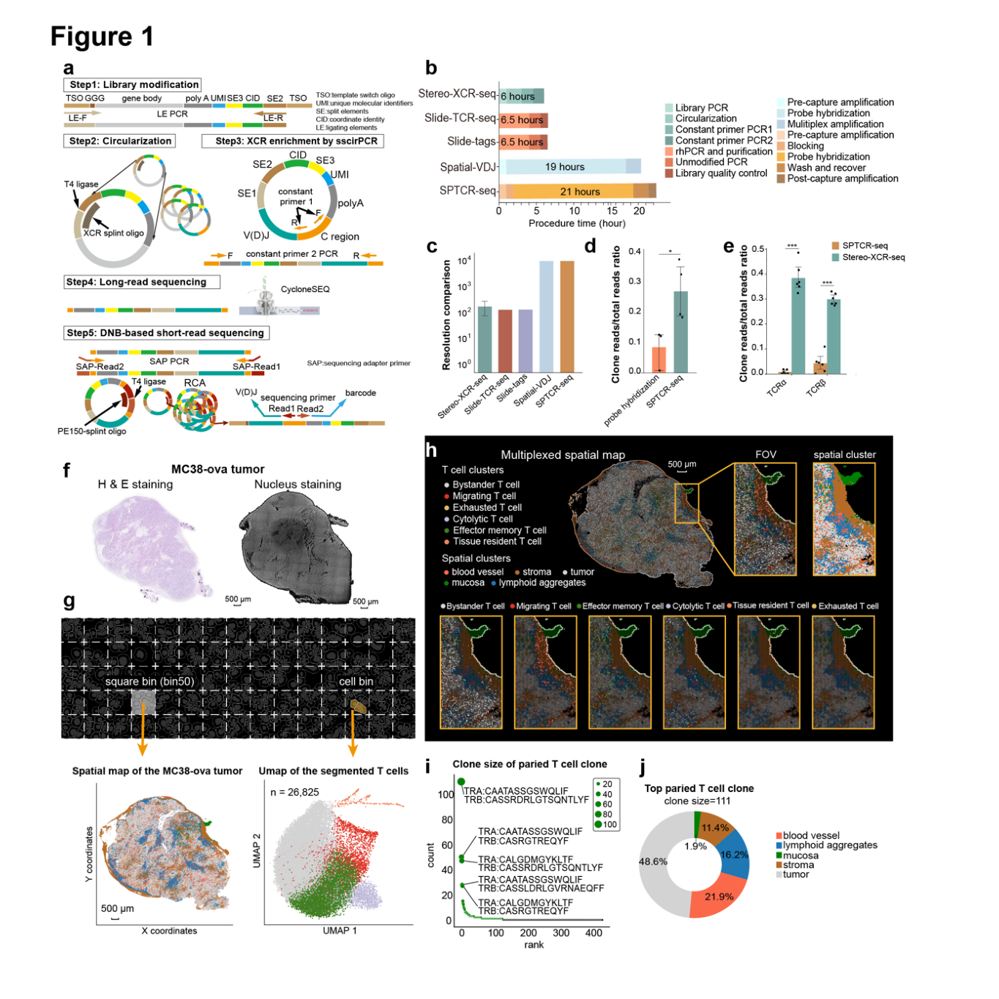
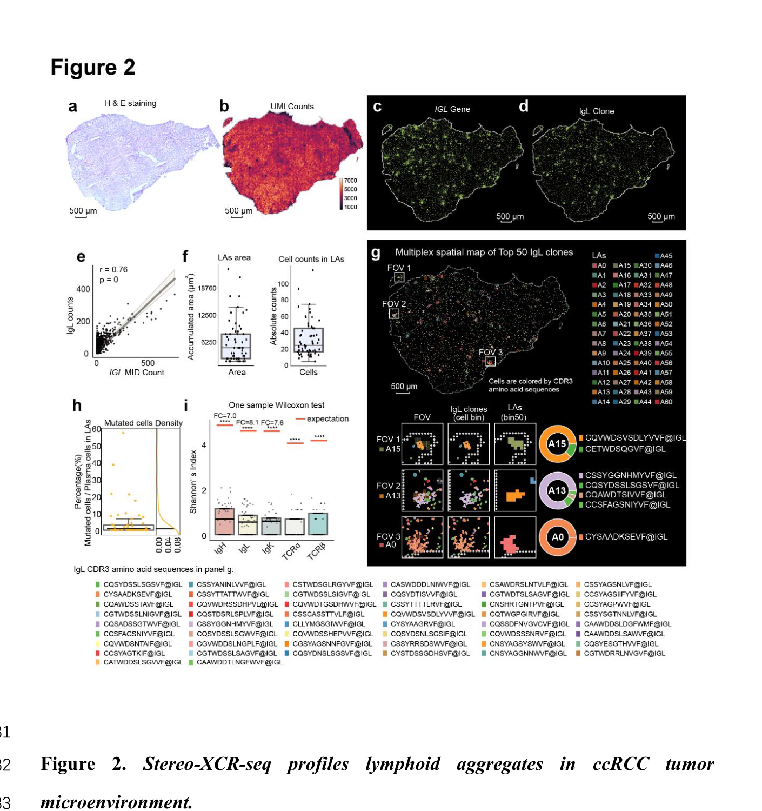
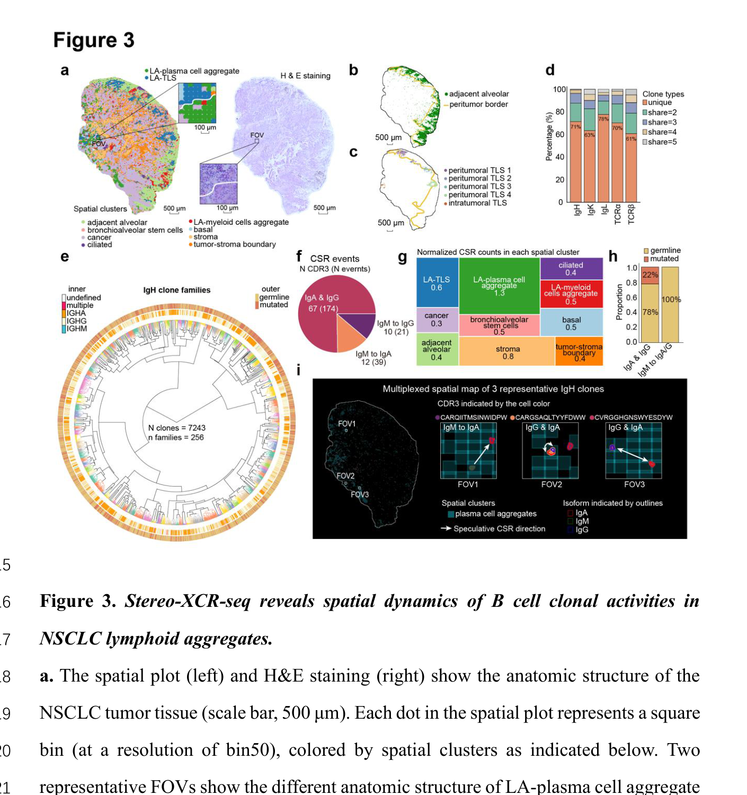
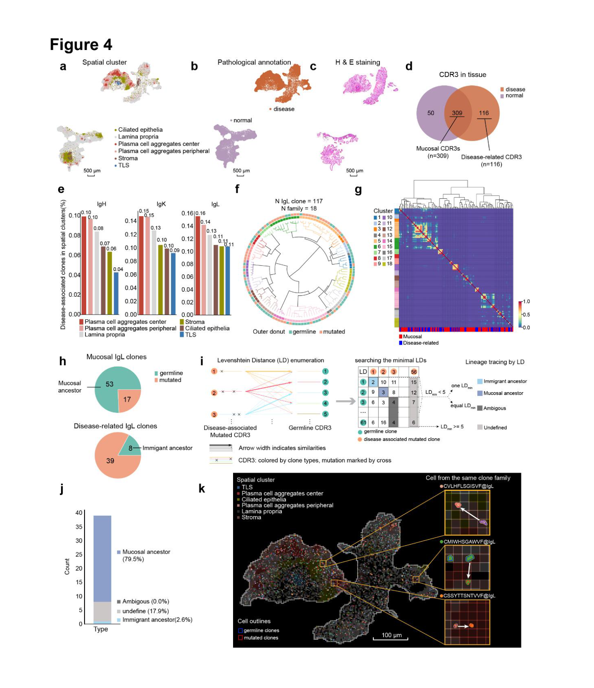

# Single cell resolved spatial immune repertoire unveils spatial heterogeneity of lymphoid aggregates in human immune disorders

<!-- wechat-style-reviewed: 2026-08-06 -->

一张肿瘤切片上，两群相邻的 T 细胞可能表达相似的活化基因，却来自完全不同的受体克隆。常规空间转录组能告诉我们细胞在哪里、表达了什么，却很难把完整 TCR/BCR 序列、细胞坐标和组织形态同时接起来。

真正的技术障碍很具体：TCR/BCR 转录本不足 cDNA 文库的 `0.01%`，而 V(D)J 区与空间条形码相距超过 `1,000 bp`。短读长通常够不到两端；依赖预设 V 区引物或恒定区探针的富集，又可能带来偏倚、低效率或较粗的空间分辨率。

作者因此开发 Stereo-XCR-seq：先把 Stereo-seq cDNA 环化，再从恒定区富集 TCR/BCR，最后用长读长补全 V(D)J 与恒定区、用短读长提高通量和校正可靠性。研究展示了 1 张 OVA-MC38 小鼠肿瘤切片（独立小鼠与肿瘤数量未报告），并分析 1 份透明细胞肾癌、1 份非小细胞肺癌，以及同一名 Crohn 病患者的 2 份配对黏膜活检。

论文给出的答案是：这套方法可以把克隆身份放回亚细胞尺度的空间转录组，在单个肿瘤内分辨出克隆组成不同的微小淋巴聚集体、TLS 和浆细胞聚集体。但它目前仍是一项小样本预印本；多数人体结论分别来自单个肿瘤或单名患者，低配对率、缺失补充材料和缺少抗原特异性实验都限制了外推。

## 01｜为什么现有空间转录组看不清免疫克隆？

免疫受体的核心信息在 CDR3 和 V(D)J 区，而 Stereo-seq 的空间坐标保存在转录本另一端的 coordinate ID（CID）中。二者物理距离超过 `1,000 bp`，普通短读长很难在同一分子上同时读到“它是什么克隆”和“它来自哪里”。

已有空间免疫组库方法还要在三个维度取舍：是否预设引物或探针、能否捕获 BCR、以及能否到单细胞尺度。作者比较的 Slide-TCR-seq、Slide-tags、Spatial VDJ 和 SPTCR-seq 中，只有 Spatial VDJ 与 Stereo-XCR-seq 能捕获 BCR；前者依赖探针杂交，其他方法多建立在更早的约 `55 μm` Visium 分辨率上。

因此，这篇论文真正要解决的不是“组织里有没有 T/B 细胞”，而是能否在同一张切片上回答：哪条受体序列属于哪个细胞、位于哪个组织结构、是否在局部扩增，以及它与转录状态是否一致。

## 02｜这项研究到底用了多大规模？

技术验证以 1 张 OVA-MC38 原位小鼠结直肠肿瘤切片作 proof of concept。作者在这个已知抗原模型中检验 TCR 配对、细胞分割与空间定位，但 Methods 没有报告独立小鼠或肿瘤数量，也没有报告性别、年龄、随机化、盲法或样本量估算。

人体材料不是一个可做患者层面统计的队列，而是 4 份组织：1 份透明细胞肾癌（ccRCC）、1 份非小细胞肺癌（NSCLC），以及同一名 Crohn 病患者的 2 份黏膜活检。后一对分别来自作者标注的“正常/轻度炎症”区域和炎症区域；将它们直接称为健康与患病人群比较并不准确。

这组材料更适合回答“方法能否在不同组织里工作”和“可以提出哪些空间克隆假说”，不适合估计疾病效应、患者异质性、预后或诊断性能。

## 03｜作者怎样把坐标、受体序列和转录组接起来？

第一步是在 Stereo-seq cDNA 两端加入连接元件，再用 XCR splint oligo 把分子变成单链环状 DNA。第二步用恒定区反向引物进行 single-strand circle DNA PCR（sscirPCR），避免逐个预设 V 区引物，并把 CID、UMI、V(D)J 和恒定区重新组织到可测的构建体中。

第三步把富集产物分成两路。CycloneSEQ 长读长用于读完整 V(D)J 和恒定区；DNB-based PE150 短读长用于更高通量地确认 CDR3、体细胞突变和空间坐标。为减少长读长错误形成的人工克隆，作者只保留得到短读长支持的 CDR3 类型，这提高了特异性，也牺牲了对 long-read-only CDR3 的检出敏感性；其中可能包含真实低丰度克隆，但本文没有证明其真实性。

最后，作者把 `500 nm` bin1 的 mRNA 图像与核染图像手工配准，用 Cellpose V2 训练每个样本的分割模型，再按坐标把受体读段分配到细胞。这里的“单细胞”不是测序直接给出的天然单位，而是依赖图像配准、分割和读段坐标共同重建。

## 04｜Stereo-XCR-seq 的性能提升有多大？

每份样本组装出 `2,536–16,910` 个 CDR3 克隆，其中 `25.09%–66.58%` 同时得到长、短读长支持。长读长的坐标覆盖为 `62.35%–94.34%`，高于短读长的 `8.67%–48.47%`；两者因此更像互补，而不是相互替代。

在直接富集实验中，sscirPCR 相对 probe hybridization 的富集效率提高 `3.164 倍`，但比较只有 probe hybridization `N=3`、sscirPCR `N=4` 个独立重复。其余跨平台结论主要来自不同方法的已发表结果，不是同一组织、同一深度、同一批次的完整头对头 benchmark。

最明显的代价是链配对率。所有样本的配对率为 `0.21%–15.80%`；B/浆细胞为 `6.20%–15.80%`，T 细胞仅 `0.21%–3.63%`。作者后续许多克隆分析因此改用单条 CDR3，而不是严格的成对 TCRα/β 或 IgH/IgK/L 定义。

简明图注：Fig. 1 展示五步工作流、`N=3` 对 `N=4` 的富集比较，以及 OVA-MC38 中 26,825 个带 TCR 读段的 T 细胞。跨平台柱状图并非统一条件下的完整 benchmark，链配对仍是主要瓶颈。

## 05｜已知抗原模型能证明空间定位可靠吗？

在 OVA-MC38 肿瘤中，作者识别了 `26,825` 个至少带 1 条 TCR 克隆读段的 T 细胞和 `2,536` 种 CDR3，并按转录状态分为迁移、耗竭、细胞毒、效应记忆、组织驻留和旁观者 6 类。几乎所有组织驻留 T 细胞位于邻近正常黏膜，超过 `60%` 的细胞毒 T 细胞位于淋巴聚集体，超过 `60%` 的旁观者 T 细胞位于肿瘤区。

其中 `974/26,825` 个细胞获得成对 TCRα/β；最大成对克隆包含 `111` 个细胞。其 TCRα `CAATASSGSWQLIF`、TCRβ `CASSRDRLGTSQNTLYF` 已在既往研究中被报道识别 OVA 肽 SIINFEKL，因此它为坐标—克隆连接提供了合理的阳性锚点。

但本文没有重新完成肽-MHC 结合或功能激活实验。Results 另写“top expanded T cell clone”有 `87` 个细胞、`16%` 位于淋巴聚集体；Fig. 1j 则给 top paired clone `N=111`，其中淋巴聚集体占 `16.2%`（约 18 个细胞）。`87/111` 并不接近 `16%`，Results 也未交代 87 的分母，因此两组数字无法统一。

## 06｜ccRCC 的微小淋巴聚集体只是细胞扎堆吗？

在 1 份 ccRCC 肿瘤中，每个 bin50 中位数检测到 `1,862` 个基因和 `4,289` 个 UMI；全片获得 `1,831` 个 TCR CDR3、`7,317` 个 BCR CDR3。IGL 转录读数与 IgL 克隆读数在 bin50 层面相关，`r=0.76，P<0.0001`，说明富集后的克隆坐标与原空间转录信号大体一致。

作者用 KDTree 去噪和密度聚类识别出 `61` 个地理离散聚集体。其面积中位数为 `5,000 μm²`（IQR `2,500–8,125 μm²`），细胞数中位数为 `21`（IQR `13–42`）；`45/61` 个聚集体由单一克隆占据超过一半细胞，`18/61` 只含一种克隆。

聚集体外仅 `0.95%` 的 B/浆细胞带突变 IgL；21 个聚集体中的对应比例中位数为 `6.67%`，范围 `1.38%–57.14%`。BCR Shannon 多样性也低于肿瘤区。这些结果支持“局部克隆富集”，却不能证明聚集体主动驱动了克隆扩增；61 个空间结构仍来自同一个患者肿瘤。

简明图注：Fig. 2 从同一 ccRCC 肿瘤识别 61 个聚集体，并比较聚集体内外的 IgL 突变比例与免疫受体多样性；空间结构数量不能替代患者数量。

## 07｜同一肺癌里的五个 TLS 真的相同吗？

在 1 份 NSCLC 肿瘤中，无监督聚类得到 10 种空间结构，并识别出 5 个地理分离的 TLS：4 个位于肿瘤边缘，1 个位于肿瘤中心。每个 TLS 中超过 `60%` 的克隆只在该结构出现，五个 TLS 全部共享的 CDR3 少于 `5%`。

作者把 `7,243` 个 IgH 克隆聚成 `256` 个家族。肿瘤内 TLS 的 germline 克隆比例为 `3.45%`，高于 4 个肿瘤周 TLS 的 `0.89%–1.92%`；突变克隆比例为 `1.38%`，也高于后者的 `0.22%–0.65%`。其中一个肿瘤内 TLS 家族含 1 个 germline 与 47 个 mutated clone。

这说明同一肿瘤中的 TLS 在克隆组成和局部成熟迹象上并不等价。但“肿瘤内 TLS 预后更好”的背景来自既有文献，本文只有一个肿瘤，不能把位置差异外推为患者结局。

## 08｜浆细胞聚集体与 TLS 承担的是同一种功能吗？

不是同一幅空间图景。作者定义了 `234` 个 class-switch recombination（CSR）事件，涉及 `89` 个 IgH 克隆：67 个克隆同时出现 IgG/IgA，10 个出现 IgM/IgG，12 个出现 IgM/IgA。按空间区域面积归一化后，浆细胞聚集体的 CSR 频率高于 TLS 和其他组织区。

更值得注意的是，IgG/IgA 共现克隆中 `78%` 仍被归为 germline，所有 IgM 与 IgG/A 共现也只出现在 germline clone。作者据此提出 CSR 可能先于亲和力成熟，而浆细胞聚集体可能更偏向决定抗体效应类型。

这个“先后顺序”尚未被直接观察。本文把同一空间 cluster 内、相同 CDR3 检出两个以上 isotype 操作性地定义为 CSR；它能证明共现，不能仅凭横断面切片确定 IgM→IgA、IgM→IgG 或 IgA↔IgG 的真实时间方向。

简明图注：Fig. 3 比较同一 NSCLC 肿瘤内 4 个肿瘤周 TLS、1 个肿瘤内 TLS 及浆细胞聚集体。图中 CSR 箭头是推测方向；共现证据本身不提供时间顺序。

## 09｜Crohn 病变克隆来自哪里？

作者比较同一名 Crohn 病患者的 2 份活检：一份来自被标注为“正常/轻度炎症”的区域，另一份来自炎症区域。共获得 `425` 个 T 细胞和 `11,474` 个 B/浆细胞；Fig. 4d 显示两组织共享 `309` 个克隆、对照活检特有 `50` 个、炎症活检特有 `116` 个。作者把共享克隆定义为 mucosal clone，把炎症活检特有克隆定义为 disease-related clone。

两块组织的 mucosal clone 丰度高度相关，`r=0.86，P<0.0001`。炎症组织中的 `159/159` 个 TLS-related clone 有 `153/159（96.2%）` 也能在对照活检中找到；与疾病区域更一致的信号反而是扩大浆细胞聚集体及其较高比例的 disease-related IgH/IgK/IgL 克隆。

炎症组织中的 `117` 个 IgL 克隆被聚成 `18` 个家族。mucosal clone 的突变比例为 `24.3%`，disease-related clone 为 `83.0%`；在 39 个 disease-related mutated IgL 中，最小 Levenshtein distance 推断 `79.5%` 来自高扩增 mucosal germline clone，`17.9%` 无法追溯，另有 `2.6%` 被归为 immigrant ancestor。

简明图注：Fig. 4 将两组织共享与炎症区特有克隆映射到浆细胞聚集体，并用最近距离推断谱系来源。“disease-related”只表示另一块活检未检出，不等于已验证的致病克隆。

## 10｜为什么这些空间克隆信号可能成立？

方法层面有三重相互校验：长读长保留完整 V(D)J 与恒定区，短读长提供更高通量并筛掉缺少短读支持的 CDR3，原始空间转录组则提供独立的基因表达坐标。ccRCC 中 IGL 转录与 IgL 克隆读段的 `r=0.76`，以及 OVA-MC38 中已知 SIINFEKL 相关 TCR 的检出，都说明三条信息链没有完全脱节。

生物学层面的结果也互相呼应：ccRCC 聚集体内克隆更集中，NSCLC 中不同 TLS 的克隆共享有限，浆细胞聚集体富集 CSR，Crohn 炎症区的 disease-related clone 更常发生突变。它们共同支持“淋巴聚集体并非单一结构，而是带有不同克隆活动的局部生态位”。

仍要区分三种证据：空间共定位是直接观察，克隆家族与来源是序列距离推断，抗原刺激、迁移方向和疾病驱动则主要是作者解释。后两层不能因为图像精细就自动升级为因果机制。

## 11｜它真正改变了什么？

对空间组学而言，这项工作的价值是把“细胞状态”推进到“克隆身份”。研究者不再只能看到一个区域有多少 T/B 细胞，还可以追问同一克隆是否跨 TLS、是否局部扩增、是否发生 isotype 共现，以及克隆状态与组织结构如何对应。

对实验设计而言，它还提供了利用既有 Stereo-seq cDNA 文库追加免疫组库富集的可能。若原始适配子和文库质量满足条件，历史样本或同一组织切片可以增加 TCR/BCR 维度，而不必重新进行完整单细胞建库。

真正可执行的价值仍是发现与排序：定位值得进一步做配对链恢复、pMHC 染色、重组受体、抗原结合和功能验证的空间克隆。现有证据不足以把某条 CDR3 直接视为治疗靶点，也不足以把某类聚集体当作临床生物标志物。

## 12｜这些结果仍需要冷静看待

首先，人体证据极小。ccRCC 和 NSCLC 各只有 1 份肿瘤，Crohn 分析只有同一患者的 2 份活检；大量 bin、细胞、克隆或 61 个聚集体不是独立患者。相关系数和空间结构比较可能受到空间自相关、测序深度与同一样本内重复观测影响。

其次，链配对率最低只有 `0.21%`，T 细胞最高也只有 `3.63%`。用单条 CDR3 定义克隆扩大了覆盖，却降低了受体唯一性；同时，作者只保留短读长支持的 CDR3，会偏向较易被短读捕获的序列。图像还依赖 Photoshop 手工配准、逐样本 Cellpose 训练和多个经验阈值。

第三，论文没有直接测定大多数克隆的抗原特异性，也没有扰动聚集体、追踪细胞迁移或纵向观察 CSR。所谓 hypermutation 只要求 V 或 J 区至少 1 个突变位点；所谓 lineage tracing 是最近 Levenshtein distance 推断；所谓 disease-related 是配对活检未检出，均比这些名称在直觉上更弱。

最后，这是一篇 2025 年 bioRxiv 预印本，尚未同行评审。本地主 PDF 没有 Supplementary Table 1 和 Supplementary Figs. 1–11，因而无法核对引物/oligo 序列、多个 QC、配对和 marker 结果；原文还存在引图、IgH/IgL 链型和图注环层定义等冲突。具体位置和复现边界见技术附录。

## 13｜若迁移到胃癌或癌前病变，设计上应先补什么？

最值得迁移的不是某个聚类阈值，而是“同片转录组—克隆—病理结构”三联设计。可在 H. pylori 相关胃炎、肠化、异型增生和早癌中预设腺体、TLS、浆细胞聚集体、病灶边缘等空间单位，再比较配对多区域和纵向样本中的 TCR/BCR 共享、突变与 isotype。

患者层面必须扩展为独立发现与验证队列，并把组织区域、测序深度、链配对率和病理分区纳入设计。对“病变特异克隆”的定义至少要做下采样或检出概率校正，避免把另一块组织中的漏检当成新生克隆。

后续验证应按证据链推进：先确认成对受体和空间定位，再做 pMHC 或重组抗体结合，最后才讨论 H. pylori 抗原、肿瘤抗原、病变进展或治疗价值。Stereo-XCR-seq 可以缩小候选范围，但不能替代这条验证链。

---

## 技术附录

### 论文基本信息

- 文章类型：bioRxiv 预印本，2025 年 1 月 19 日发布；未同行评审。
- DOI：10.1101/2025.01.16.630222。
- 作者：Xiaojuan Zhan、Yi Liu、Yanying Guo、Wenwen Zhou、Yixin Yan、Hui Zeng、Xuan Dong、Xiaoyu Chen、Rong Ma、Zhong Liu、Fan Zhu、Xubin Zheng、Xinxing Li、Jinwen Yin、Francis Ka-ming Chan、Chuanyu Liu、Longqi Liu、Xun Xu、Yong Hou、Haoran Tao、Yuliang Dong、Tao Zeng、Young Li、Jingying Zhou、Zexian Zeng、Yu Feng。
- 共同通讯作者：Young Li、Jingying Zhou、Zexian Zeng、Yu Feng。
- 研究领域：空间转录组、TCR/BCR repertoire、肿瘤免疫、TLS、浆细胞聚集体、炎症性肠病。
- 原始 FASTQ：GSA-Human BioProject `HRA009729`。
- 处理后矩阵、表达矩阵与 barcode whitelist：STOmicsDB/CNGBdb `STT0000123`；该编号在 PDF 第 30 页原始行中可见，但被解析器误识别为 heading，没有独立 sentence ID。
- 外部 scRNA-seq：GEO `GSE148071`。
- 代码声明：原文只给出 GitHub 用户页 `https://github.com/fengyu9481`，没有固定具体仓库、版本或 commit。
- 本地 PDF：`pdfs/processed/stereo-xcr-seq-spatial-immune-repertoire-biorxiv-2025.pdf`。
- 利益冲突：Stereo-XCR-seq 的流程和应用涉及 pending patents；BGI Research Shenzhen/Hangzhou 员工持有 BGI 股票，其余作者声明无竞争性利益。

### PDF 解析质量

- 已运行 `scripts/build_pdf_llm_pack.py`，生成 `tmp/spatial-immune-repertoire-llm-pack.md` 和 JSON manifest。PDF 共 43 页、1,044 个句子 ID；抽取引擎为 PyMuPDF。
- 自动标签为 title 17、other 24、abstract 12、introduction 35、results 111、supplementary 65、methods 339、references 441。自动分节不能直接用于审计。
- 真正 Results 的物理范围为 `P006.S0008-P015.S0009`，共 150 个 ID：113 个内容型 Results、36 个重复页眉/版权行、1 个纯行号；正文内容实际结束于 `P015.S0008`。
- `P007.S0014-P011.S0013` 被误标为 supplementary，实际是 Results；`P015.S0010-P016.S0017` 被误标为 results，实际是 Discussion；`P016.S0018-P018.S0006` 被误标为 methods，仍是 Discussion。
- PDF 第 19–30 页的 Methods/availability 物理区域共 275 个 ID，其中 213 个为语义方法/数据句，49 个为页眉或 DOI，13 个为纯行号空壳。自动 methods 还混入 25 个 Discussion、8 个第 31 页声明区 ID 和 31 个第 43 页参考文献 ID。
- `P006.S0008-P006.S0013`、`P009.S0013`、`P011.S0014` 存在跨栏吞句或两个小节共用一个 ID；TCRα 序列、PCR 列表、Shannon 公式与 `STT0000123` 被识别为 heading，须回看 PDF 原页或 manifest `pages[].lines`。
- 主图 1–4 和图注均在主 PDF 中；Supplementary Table 1 与 Supplementary Figs. 1–11 不在 inbox，也未嵌入主 PDF。前者包含全部 primer/oligo 序列，缺失会直接阻断完整湿实验复现。

### 主图索引

| 原文图 | 样本与比较 | 核心信息 | 图像文件 | 正文位置 |
|---|---|---|---|---|
| Fig. 1 | 技术流程；富集 `N=3` vs `N=4`；OVA-MC38 | 长短读长互补、sscirPCR 富集、26,825 个 T 细胞与 974 个配对细胞 | `assets/spatial-transcriptomics/2025-stereo-xcr-seq-spatial-immune-repertoire/fig1-workflow-benchmark-mc38.png` | [性能与小鼠验证](#04｜stereo-xcr-seq-的性能提升有多大？) |
| Fig. 2 | 1 份 ccRCC | 61 个微小聚集体的面积、细胞数、克隆优势与突变比例 | `assets/spatial-transcriptomics/2025-stereo-xcr-seq-spatial-immune-repertoire/fig2-ccrcc-lymphoid-aggregates.png` | [ccRCC 聚集体](#06｜ccrcc-的微小淋巴聚集体只是细胞扎堆吗？) |
| Fig. 3 | 1 份 NSCLC，4 个肿瘤周 TLS vs 1 个肿瘤内 TLS | TLS 克隆异质性与浆细胞聚集体 CSR | `assets/spatial-transcriptomics/2025-stereo-xcr-seq-spatial-immune-repertoire/fig3-nsclc-clonal-dynamics.png` | [NSCLC TLS](#07｜同一肺癌里的五个-tls-真的相同吗？) |
| Fig. 4 | 同一 Crohn 病患者的 2 份活检 | 共享/病变相关克隆、突变比例与计算谱系来源 | `assets/spatial-transcriptomics/2025-stereo-xcr-seq-spatial-immune-repertoire/fig4-ibd-clonal-origins.png` | [Crohn 病克隆](#09｜crohn-病变克隆来自哪里？) |

### 完整主图 panel 注释

#### Figure 1｜Stereo-XCR-seq profiles spatial T/BCR repertoires and transcriptomics at single-cell resolution

来源：`P032.S0005`、`P032.S0007-P032.S0012`、`P033.S0005-P033.S0029`。

- a：五步流程，包括文库改造、环化、sscirPCR、长读长和短读长测序；两种读长均可生成带坐标的克隆读段，功能互补。
- b：比较不同空间免疫组库富集流程耗时；颜色代表方法，阴影代表具体步骤。
- c：比较不同技术的空间分辨率，原图按 median ± SD 表示；这不是统一实验条件下的组织性能测试。
- d：在 Stereo-seq cDNA 上比较 probe hybridization 与 sscirPCR 富集效率；每点为独立实验重复，前者 `N=3`、后者 `N=4`，以 median ± SD 表示。
- e：比较 Stereo-XCR-seq 与 SPTCR-seq 的数据利用率；原文未在正文或图注给出精确数值与重复数。
- f：OVA-MC38 相邻切片 H&E 与 Stereo-seq 芯片核染图，比例尺 500 μm。
- g：说明 bin50（25 μm）与 cell bin 的生成；空间图显示肿瘤解剖结构，UMAP 显示按核图分割的 T 细胞。每个细胞至少有 1 条 TCRα 或 TCRβ 读段，`N=26,825`。
- h：将 bin50 解剖结构与 cell-bin T 细胞亚群叠加，展示各 T 细胞状态在组织中的分布。
- i：配对 TCRα/β 克隆的大小与排名；成对细胞 `N=974`。
- j：最大成对 T 细胞克隆在不同组织区的分布，`N=111`；图内淋巴聚集体占 `16.2%`，约合 18 个细胞。Results 却写 87 个细胞占 16%，分母无法统一，属于原稿冲突。

#### Figure 2｜Stereo-XCR-seq profiles lymphoid aggregates in ccRCC tumor microenvironment

来源：`P034.S0005`、`P034.S0007-P034.S0016`、`P035.S0005-P035.S0023`。

- a：ccRCC 肿瘤 H&E，比例尺 500 μm。
- b：bin50 空间转录组 UMI 丰度图；每点为一个 square bin，比例尺 500 μm。
- c–d：在 500 nm bin1 分辨率下分别显示 IGL 转录本与 IgL 克隆；绿色点至少有 1 个相应转录或克隆读段。
- e：以每个 bin50 的 IGL UMI 与 IgL 克隆读段做 Pearson 相关；正文报告 `r=0.76，P<0.0001`。空间 bin 并非完全独立观测。
- f：61 个聚集体的面积和细胞数箱线图；中位数、IQR、极值与离群点按原图表示。
- g：top 50 IgL 克隆的 cell-bin 图叠加 bin50 聚集体；FOV 和 donut 显示代表性聚集体中的克隆组成与大小。
- h：各聚集体中突变浆细胞占比；黑线为聚集体外比例，fold change 用聚集体中位数对该期望值计算。
- i：各聚集体的 IgH、IgL、IgK、TCRα、TCRβ Shannon 指数；红线为聚集体外期望，原图说明使用 one-sample Wilcoxon test。

#### Figure 3｜Stereo-XCR-seq reveals spatial dynamics of B cell clonal activities in NSCLC lymphoid aggregates

来源：`P036.S0005`、`P036.S0007-P036.S0017`、`P037.S0005-P037.S0027`。

- a：NSCLC 空间结构与 H&E；两个 FOV 分别展示浆细胞聚集体和 TLS，主图比例尺 500 μm、FOV 100 μm。
- b：拟合的肿瘤周边界与邻近正常肺泡区。
- c：4 个肿瘤周 TLS 与 1 个肿瘤内 TLS 的位置。
- d：五个 TLS 之间的克隆共享；各链超过 60% 为单个 TLS 独有。
- e：`7,243` 个 IgH 克隆、`256` 个家族的径向树。图注说内圈为 germline/mutated、外圈为 isotype，但图内图例显示相反；两者冲突，本文不擅自修正。
- f：CSR 类型；A&G、IgM/IgA、IgM/IgG 都按同一 CDR3 在同一空间 cluster 中的 isotype 共现定义。
- g：各空间 cluster 面积归一化 CSR 频率。
- h：各 CSR 类型中 germline 与 mutated clone 比例。
- i：三个代表 IgH 克隆的空间共现模式：germline `CARQIITMSINWIDPW` 为 IgM/IgA；germline `CVRGGHGNSWYESDYW` 为 IgG/IgA；mutated `CARGSAQLTYYFDWW` 为 IgG/IgA。箭头为推测方向。

#### Figure 4｜Stereo-XCR-seq reveals the origins and clonal dynamics of lymphoid aggregates in IBD

来源：`P038.S0005`、`P038.S0007-P038.S0009`、`P039.S0005-P039.S0027`。

- a–c：同一 Crohn 病患者两份活检的空间 cluster、病理标注和 H&E；每个点为 bin50，比例尺 500 μm。
- d：两组织共享 `309` 个克隆、对照活检特有 `50` 个、炎症活检特有 `116` 个；只计入已分配到分割细胞的 TCR/BCR 链。
- e：各空间 cluster 中 disease-related IgH、IgK、IgL 克隆比例。
- f：炎症组织 `117` 个 IgL 克隆、`18` 个家族的径向树；末端为 clone type，内圈标家族，外圈标 germline/mutated。
- g：CDR3 两两相似度、家族、mucosal/disease-related 分类及同一谱系树。
- h：mucosal 与 disease-related IgL 中 germline/mutated 的数量和比例。
- i：最近 Levenshtein distance 谱系归类规则。
- j：39 个 disease-related mutated IgL 的推断来源：79.5% mucosal ancestor、2.6% immigrant ancestor、17.9% undefined、0% ambiguous。
- k：disease-related IgL 在组织中的空间分布；颜色代表 CDR3，外框红/蓝代表 mutated/germline，FOV 展示同一推断家族的相邻细胞，比例尺 100 μm。

### Results 证据覆盖审计

Results 的连续物理范围为 `P006.S0008-P015.S0009`，共 150 个 ID。下表将 113 个内容型 ID 分配到原始小节；36 个重复页眉为 `P007-P015` 各页 `S0001-S0004`，`P015.S0009` 为纯行号。`P009.S0013` 同时含 MC38 结尾与 ccRCC 小节开头，`P011.S0014` 同时含 ccRCC 结尾与 NSCLC 小节开头，表中各只计一次。

| 原文 Results 小节 | 来源 ID | 内容型 ID 数 | 正文与证据边界落点 |
|---|---|---:|---|
| Stereo-XCR-seq 原理 | `P006.S0008-P006.S0016`; `P007.S0005-P007.S0009` | 14 | [03｜工作流](#03｜作者怎样把坐标、受体序列和转录组接起来？)；短读筛选与分割边界见 [12｜冷静看待](#12｜这些结果仍需要冷静看待) |
| Application and benchmarking | `P007.S0010-P007.S0015`; `P008.S0005-P008.S0011` | 13 | [02｜样本规模](#02｜这项研究到底用了多大规模？)、[04｜性能](#04｜stereo-xcr-seq-的性能提升有多大？)；跨平台非同批头对头比较见同节 |
| OVA-MC38 high-resolution mapping | `P008.S0012-P008.S0018`; `P009.S0005-P009.S0013` | 16 | [05｜已知抗原模型](#05｜已知抗原模型能证明空间定位可靠吗？)；87/16% 与 111/16.2% 冲突及抗原验证边界均在该节 |
| ccRCC lymphoid aggregates | `P009.S0014-P009.S0017`; `P010.S0005-P010.S0015`; `P011.S0005-P011.S0014` | 25 | [06｜ccRCC 聚集体](#06｜ccrcc-的微小淋巴聚集体只是细胞扎堆吗？)；单患者、空间相关与机制推断边界见该节及 [12](#12｜这些结果仍需要冷静看待) |
| NSCLC clonal activities | `P011.S0015-P011.S0016`; `P012.S0005-P012.S0019`; `P013.S0005-P013.S0010` | 23 | [07｜TLS](#07｜同一肺癌里的五个-tls-真的相同吗？)、[08｜浆细胞聚集体](#08｜浆细胞聚集体与-tls-承担的是同一种功能吗？)；CSR 时序与图注冲突在正文/附录保留 |
| IBD clonal origins | `P013.S0011-P013.S0016`; `P014.S0005-P014.S0016`; `P015.S0005-P015.S0008` | 22 | [09｜Crohn 克隆](#09｜crohn-病变克隆来自哪里？)；对照特有 50 个、39 个 mutated IgL 分母、检出概率与最近邻推断边界均已写明 |
| **语义 Results 合计** |  | **113** | **113/113 均映射到上述正文落点；未逐句转述的 marker、算法解释和作者机制措辞保留于主图注、方法参数或下方冲突/边界清单** |

### Methods 与复现信息

#### 样本、模型与伦理

- MC38-OVA 细胞在 DMEM、10% FBS、1% penicillin/streptomycin、37°C、5% CO2 培养，每月做支原体检测；`5×10^6` 个细胞植入 C57BL/6J 小鼠盲肠，14 天后 CO2 处死取瘤。原文同一句支原体检测重复两次，且没有给小鼠数量、性别、年龄、随机化、盲法或排除标准。
- 人体组织包括 2 个癌症标本和同一 Crohn 病患者的 2 个黏膜活检，均来自未治疗供者的根治切除或肠镜。Methods 不逐项写明两个癌症标本是否来自不同供者；“推定 3 位人供者”只能作为推断，不能当作明确报告。
- 组织用预冷 PBS 清洗两次、OCT 包埋、干冰转运并存于 −80°C。动物伦理 `BGI-IRB A23027`；人伦理包括 BGI `BGI-IRB24066`、`BGI-IRB24012`，北京大学 `IRB00001052-24061`，浙江大学 `IR2023396`；均书面知情同意。

#### Stereo-seq 切片与建库

- −20°C cryostat；先取 10–15 张 50 μm 切片测 RNA/RIN，再取 5 μm H&E；仅 `RIN>6.5` 的组织进入后续流程。
- 连续切片厚度为 5/5/10/5/5 μm；第 2、4 张 H&E，第 1、5 张 −80°C 保存，第 3 张贴 Stereo-seq 芯片。
- 芯片 37°C 4 min 干燥，absolute methanol −20°C 30 min 固定；核染后 10× 扫描，0.1× SSC 清洗；37°C、pH 2.0、5 min 渗透；42°C 1.5 h 原位逆转录；55°C 1 h 去组织；释放 CID/UMI cDNA 并 PCR，原始 Stereo-seq 文库在 DNBSEQ-T10 测序。

#### 环化、XCR 富集与测序

- 文库改造：20 ng dsDNA，LE-F/LE-R；95°C 5 min；`95°C 20 s、50°C 20 s、72°C 3 min` ×15；72°C 5 min；0.6× beads 纯化。
- sscirDNA：400 ng modified cDNA + 20 μM XCR splint；95°C 5 min，−20°C 快速冷却 10 min；T4 ligase 37°C 1 h；exonuclease I/III 37°C 30 min；1.5× PEG32 beads。
- 两轮恒定区 PCR：第一轮 40 ng、第二轮 20 ng，primer 均为 0.5 μM，各 T/BCR chain 分开；95°C 5 min；`98°C 20 s、50°C 20 s、72°C 3 min` ×15；72°C 5 min；0.6× beads。
- 长读长：每条 chain 起始 1 μg，每份样本每条 chain 至少 2 个文库；CycloneSEQ H940-000001-00，0.6× beads，30 μL 洗脱后上 CycloneSEQ。
- 短读长：每条 chain 50 ng，adapter primer 0.8 μM；95°C 5 min；`98°C 20 s、65°C 20 s、72°C 3 min` ×15；72°C 5 min；0.7× beads。各 chain 等质量混合后取 60 ng，加 20 μM PE150 splint 生成 DNB，在 MGISEQ-2000 上测序；Read1 为 1–150 bp（dark 1–20），Read2 为 151–302 bp（dark 152–181）。
- 所有 primer/oligo 的具体序列位于缺失的 Supplementary Table 1；上述 PCR 列表中的部分行被解析成 heading，参数经 PDF 第 21–22 页目视复核。

#### 长短读长处理与坐标映射

- Stereo raw：Read1 中 CID 为 1–25 bp，原文字面写 `MID` 为 26–35 bp，而全文其他位置使用 UMI；Read2 为 cDNA。使用 DCScloud `spatial_RNA_visualization_v5`，未给 pipeline commit 或容器。
- 长读长用 edlib 查找三个 split elements；原文给出的 LD 阈值分别为 ≤3、字面“minimum LD≤5”、字面“minimum LD≤3”，只保留 1-2-3 顺序。CID 长 20–30 bp、insert ≤10 kb；MiXCR 4.6.0 `--preset generic-ont`，CDR3 assembly 分开 V/J/C，`minimalQuality=5`。
- whitelist mapping 用 k=5 的 MinHash/LSH forest，ANN 先取 10,000 个近邻，再用 edlib 仅保留唯一、LD≤4 的 CID。CDR3 长度保留 5–30 aa；只有 1 条 read 支持的坐标丢弃，同坐标 UMI 以 LD≤2 聚类，只保留 dominant UMI cluster。
- 短读长固定序列允许 LD≤1；其后 25 bp 为 CID、其前 10 bp 为 UMI。ST_BarcodeMap 参数为 `--mismatch 1 --umiStart 25`；MiXCR 4.6.0 使用 RNA-seq preset、允许 partial alignment、保存原始 reads，并以 `VTranscriptWithout5UTRWithP` 对齐，按 V/J 分开组装 CDR3。
- 只保留同时具有坐标和 CDR3 的 reads。短读长缺少 C 区时，用相同 CID+UMI 的长读长补 isotype；仅由长读长支持的 CDR3 被全部丢弃。

#### 分割、克隆、聚集体与谱系规则

- bin1（500 nm）UMI 图由 OpenCV 生成，再在 Photoshop 中手工调整角度、缩放和镜头畸变以配准核染图。Cellpose V2 每个样本训练 10–20 张 crop，每张 10–30 个细胞；人工校正 mask；`chan=0`、secondary channel 0、learning rate 0.1、weight decay 0.0001、100 epochs。原文未给初始 model、留出验证、模型文件或分割性能。
- 同一 cell 中同时检出 TCRα+β 或 IgH+IgK/L 才算配对。hypermutation 只用短读长，V 或 J 区至少 1 个 mutated locus 即判定 hypermutated；每个 CDR3 amino-acid sequence 定义为一个 clone。这个阈值很宽，不能自动等同严格 SHM 或亲和力成熟。
- clone family 使用同 isotype CDR3 的 pairwise Levenshtein distance、SciPy squareform、Ward hierarchical clustering 和 threshold 20。原文字面写 `hierarchy.linage` 与 `cluster.hierarchy.fdluster`，疑似函数拼写错误，但本文不替作者改写；threshold 的单位和 criterion 未给。
- CSR 定义为同一空间 cluster、同一 IgH CDR3 出现两个以上 isotype；这是共现规则，不给方向。
- ccRCC 聚集体：bin50 BCR UMI（IGH/IGK/IGL，手工排除 IGLON5 等），原文“top 85%”保留规则措辞含糊；KDTree `k=10`，取距离最小的 top 20%，DBSCAN `eps=100, min_samples=3`，eps 单位未说明。
- NSCLC 边界：alveolar bin 用 `k=5`，原文又写按升序丢弃 “least 5%” 距离点，逻辑反常；随后 interp1d、Concaveman 和 Gaussian `sigma=10`。TLS 用 `k=150`，丢弃高于中位距离的点，DBSCAN `eps=300, min_samples=5`；在边界上称 peritumoral，否则 intratumoral，但无距离容差。
- NSCLC deconvolution 使用 GSE148071、Scanpy 手工标 13 类、RCTD full mode，Stereo minimal UMI=0。原文字面版本为 `spacexr-2.0.018`，格式异常；补充 marker 图缺失。
- IBD 谱系：Methods 写 IgH，Results/Fig. 4 明确写 117 个 IgL clone，构成链型冲突。到所有 germline 的 LD≥5 定义 undefined；LD<5 后按更接近 mucosal 或 immigrant ancestor 分类，等距为 ambiguous。该最近邻规则不是纵向谱系追踪。
- Shannon index 按分割细胞几何中心分配空间 cluster，再以 CDR3 细胞频率计算 `−ΣPi ln(Pi)`；公式被解析为 heading。

#### 统计报告与可重复性缺口

- 原文没有独立 Statistics 小节。Fig. 1d 仅给 `N=3`、`N=4` 与 median ± SD，虽标显著但未说明检验；Fig. 2e 用 Pearson correlation；聚集体箱线图用 median ± IQR；Fig. 2i 说明 one-sample Wilcoxon test。
- 未见系统报告双侧性、置信区间、多重检验、缺失值、随机种子、效应量、power/sample-size、随机化或盲法。bin、细胞和聚集体共享同一组织，不能按独立患者解释其 P 值。
- 多个软件没有版本：edlib、datasketch、ST_BarcodeMap、OpenCV、Photoshop、RapidFuzz/Levenshtein、SciPy、RadialTree、Squarify、scikit-learn、Concaveman、Scanpy；没有环境锁、container 或 test。

### Methods 证据覆盖审计

下表只统计 213 个语义 Methods/availability ID；49 个页眉/DOI 与 13 个纯行号在下一节单独闭合。混合句只计一次，因此各行互斥。

| 方法模块 | 来源 ID | 语义 ID 数 | 参数与边界落点 |
|---|---|---:|---|
| Tissue/cohort/ethics | `P019.S0005-P019.S0021`; `P020.S0005` | 18 | [样本、模型与伦理](#样本、模型与伦理) |
| Stereo-seq tissue/library | `P020.S0006-P020.S0021` | 16 | [Stereo-seq 切片与建库](#stereo-seq-切片与建库) |
| sscirDNA 与两轮 XCR enrichment | `P021.S0005-P021.S0027`，排除 `S0007,S0008,S0010,S0017` | 19 | [环化、XCR 富集与测序](#环化、xcr-富集与测序)；缺失 oligo 序列已标注 |
| Long-/short-read library 与 sequencing | `P022.S0005-P022.S0025`，排除 `S0005,S0006,S0008,S0013,S0024`; `P023.S0005-P023.S0010` | 22 | [环化、XCR 富集与测序](#环化、xcr-富集与测序) |
| Stereo-seq raw pipeline | `P023.S0011-P023.S0014` | 4 | [长短读长处理与坐标映射](#长短读长处理与坐标映射)；MID/UMI 冲突已保留 |
| Long-read XCR processing | `P023.S0015-P023.S0018`; `P024.S0005-P024.S0010`; `P024.S0012-P024.S0025` | 24 | [长短读长处理与坐标映射](#长短读长处理与坐标映射)；异常 LD 原文措辞未擅改 |
| Short-read XCR processing | `P024.S0011`; `P025.S0005-P025.S0019` | 16 | [长短读长处理与坐标映射](#长短读长处理与坐标映射) |
| XCR metadata | `P025.S0020-P025.S0021`; `P026.S0005-P026.S0012` | 10 | [长短读长处理与坐标映射](#长短读长处理与坐标映射)；仅长读支持 CDR3 的过滤边界见正文 03/12 |
| Cell segmentation/pairing | `P026.S0013-P026.S0028`; `P027.S0005-P027.S0009`; `P027.S0012-P027.S0013` | 23 | [分割、克隆、聚集体与谱系规则](#分割、克隆、聚集体与谱系规则)；手工配准与未报告验证见该节 |
| Hypermutation/family | `P027.S0010-P027.S0011`; `P027.S0014-P027.S0024` | 13 | [分割、克隆、聚集体与谱系规则](#分割、克隆、聚集体与谱系规则)；宽松突变定义与函数拼写冲突已保留 |
| CSR | `P027.S0025-P027.S0026`; `P028.S0005-P028.S0006` | 4 | [分割、克隆、聚集体与谱系规则](#分割、克隆、聚集体与谱系规则)；只支持共现、不支持方向 |
| ccRCC aggregates 与 NSCLC border/TLS | `P028.S0007-P028.S0019`; `P029.S0005-P029.S0006` | 15 | [分割、克隆、聚集体与谱系规则](#分割、克隆、聚集体与谱系规则)；含糊阈值和 eps 单位已标注 |
| NSCLC deconvolution | `P029.S0008-P029.S0019` | 12 | [分割、克隆、聚集体与谱系规则](#分割、克隆、聚集体与谱系规则)；异常版本号与缺失 marker 图已标注 |
| IBD lineage | `P029.S0020-P029.S0024`; `P030.S0005-P030.S0007` | 8 | [分割、克隆、聚集体与谱系规则](#分割、克隆、聚集体与谱系规则)；IgH/IgL 冲突及最近邻边界已保留 |
| Shannon index | `P030.S0009`; `P030.S0011-P030.S0014` | 5 | [分割、克隆、聚集体与谱系规则](#分割、克隆、聚集体与谱系规则) |
| Data/code remaining IDs | `P030.S0015-P030.S0018` | 4 | [论文基本信息](#论文基本信息)；未提供固定代码仓库与环境锁 |
| **语义 Methods/availability 合计** |  | **213/213** | **全部映射到上方参数小节；原文未报告的默认值、版本、重复数和统计细节不作推定，并集中列入统计缺口与冲突边界** |

### 原文冲突、低置信解析与证据边界

- `P009.S0016` 把 1,831 个 TCR 与 7,317 个 BCR CDR3 引向 Fig. 1b，但 Fig. 1b 实际是流程耗时图，属于原稿引图冲突。
- `P009.S0012` 写 top expanded T cell clone 有 87 个细胞、16% 位于淋巴聚集体；Fig. 1j 则给 top paired clone `N=111`、其中淋巴聚集体占 16.2%（约 18 个细胞）。87、16% 和 111 无法共用同一分母，原稿也未说明两处是否为不同克隆。
- Fig. 3e 的图内图例与完整图注对内外圈含义相反；Results 将 `CARQIITMSINWIDPW` 写作 IgM→IgA/G，Fig. 3i 图注只写 IgM→IgA。
- IBD lineage 的 Methods 写 IgH，Results 与 Fig. 4 写 IgL；正文以 Results/Fig. 4 的 `117 IgL clones` 叙述，并保留冲突。
- 原文字面还包括 `MID` vs UMI、`spacexr-2.0.018`、`hierarchy.linage`、`fdluster`、若干 “minimum LD≤” 和 NSCLC “least 5%” 过滤。它们可能是术语、版本、函数或排版错误，复现时必须核代码，不应静默改正。
- Crohn 对照被同时描述为 “mildly inflamed normal”；disease-related 只表示另一块活检未检出。取样范围、深度和低配对率都可能制造表观特异性。
- CSR 是 isotype 共现，hypermutation 是至少 1 个 V/J 变异位点，谱系是最近距离推断；三者都不应被写成已验证的时间顺序、亲和力成熟或细胞迁移。
- OVA 特异性来自既有序列报告；论文没有系统完成 pMHC、抗体结合、功能杀伤或体内扰动。
- 缺失 Supplementary Table 1 与 Figs. 1–11；主文多处关键 benchmark、pairing、cluster marker、QC 和算法验证无法独立复核。

### 全文 ID 闭合

| 语义区域 | 连续来源范围 | ID 数 | 说明 |
|---|---|---:|---|
| 题名、作者与前置信息 | `P001.S0001-P003.S0007` | 41 | 双栏作者/机构展平，题名以 PDF 原页核对 |
| Abstract | `P003.S0008-P004.S0006` | 12 | 含页眉与跨页断句 |
| Introduction | `P004.S0007-P006.S0007` | 35 | 已用于技术困境与研究问题 |
| Results 物理区域 | `P006.S0008-P015.S0009` | 150 | 113 内容型、36 页眉、1 纯行号 |
| Discussion | `P015.S0010-P018.S0006` | 51 | 自动误标 results/methods 的部分已校正 |
| Methods/availability 物理区域 | `P019.S0001-P030.S0019` | 275 | 213 语义方法、49 页眉/DOI、13 纯行号 |
| 声明、致谢与作者贡献 | `P031.S0001-P031.S0023` | 23 | 非 Methods |
| Fig. 1–4 与完整图注区域 | `P032.S0001-P039.S0027` | 160 | 144 图注内容 ID + 16 重复页眉 |
| References | `P040.S0001-P043.S0051` | 297 | 最后 31 个被自动误标 methods |
| **全文合计** |  | **1,044** | **1,044/1,044 已完成语义分类** |

## 发布前检查

- [x] 一级标题使用预印本英文原题；
- [x] 开头从空间免疫组库的具体技术困境切入；
- [x] 前四段出现样本范围与核心答案；
- [x] 正文采用连续问题式标题；
- [x] 关键结果包含样本、数字和比较对象；
- [x] 四张主图紧跟对应叙事，完整 panel 注释放入技术附录；
- [x] 有具体的“这些结果仍需要冷静看待”；
- [x] 113/113 语义 Results、213/213 语义 Methods 和 1,044/1,044 全文 ID 已闭合；
- [x] 缺失补充材料、低置信解析、原文冲突和证据边界均已保留；
- [x] `STYLE_REVIEW_LOG.md`、目录、HonKit 构建与链接检查已完成。
