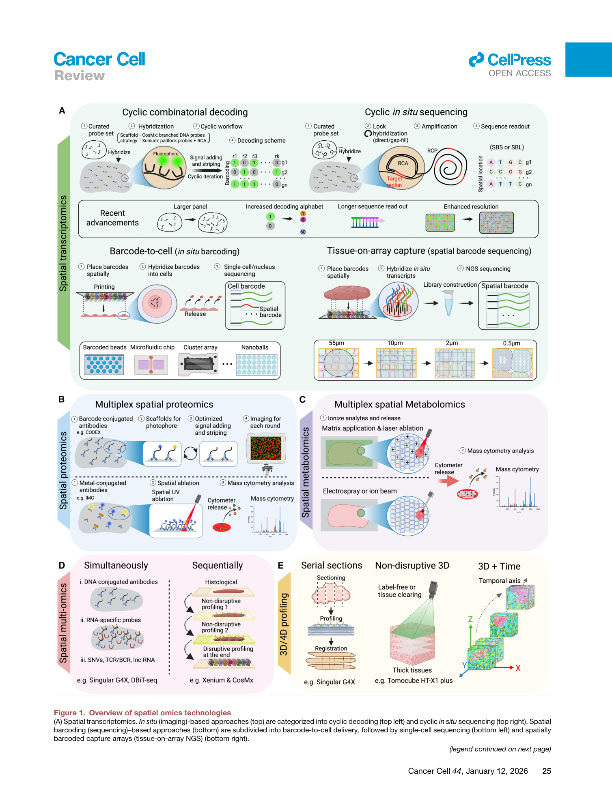
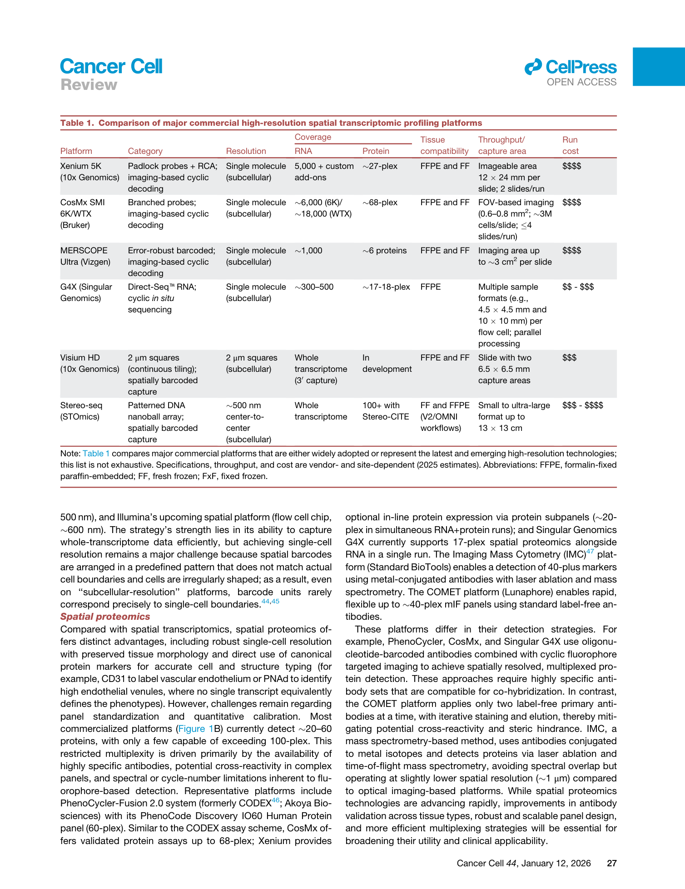
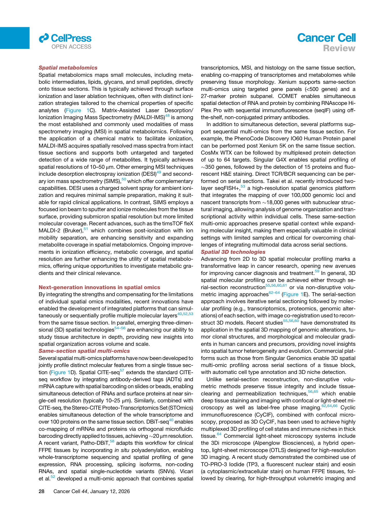
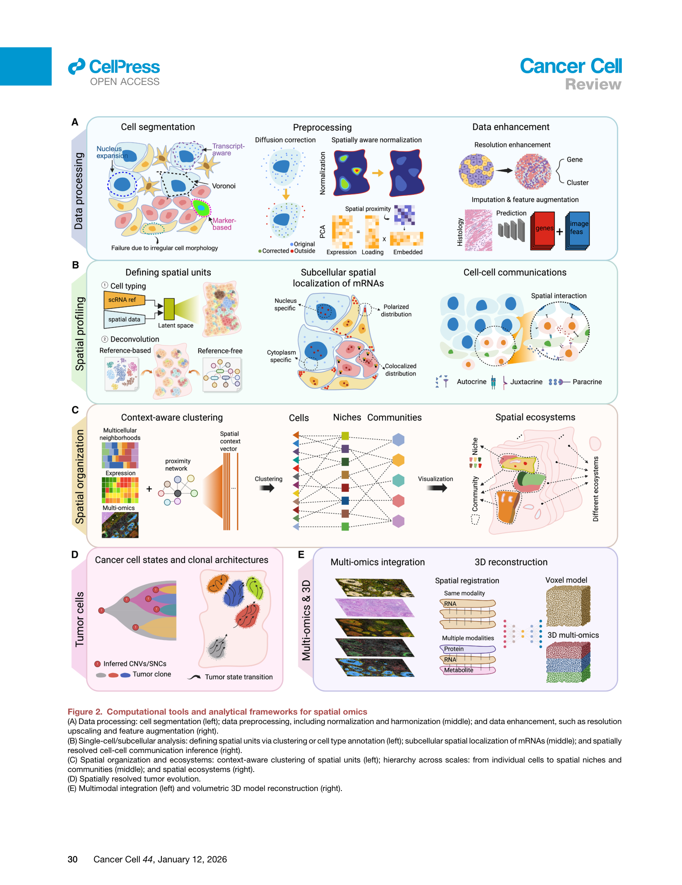
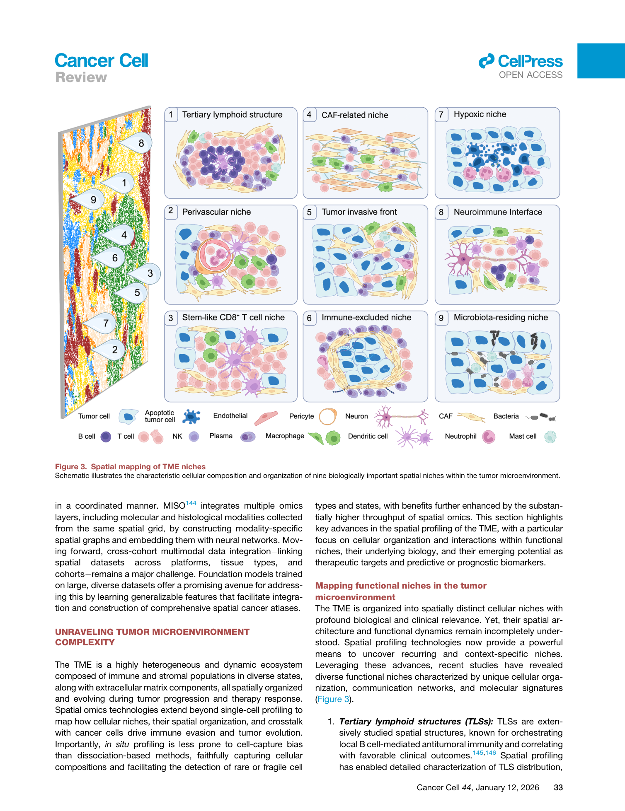
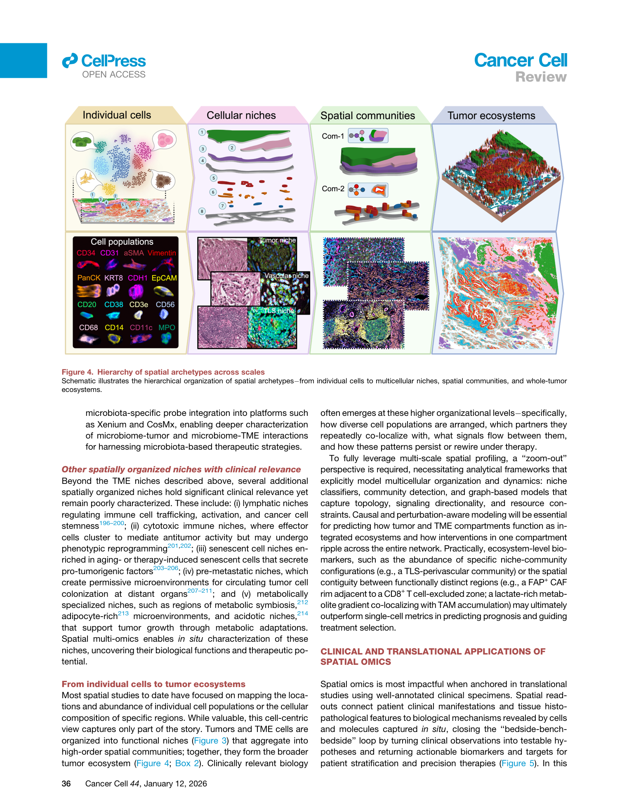
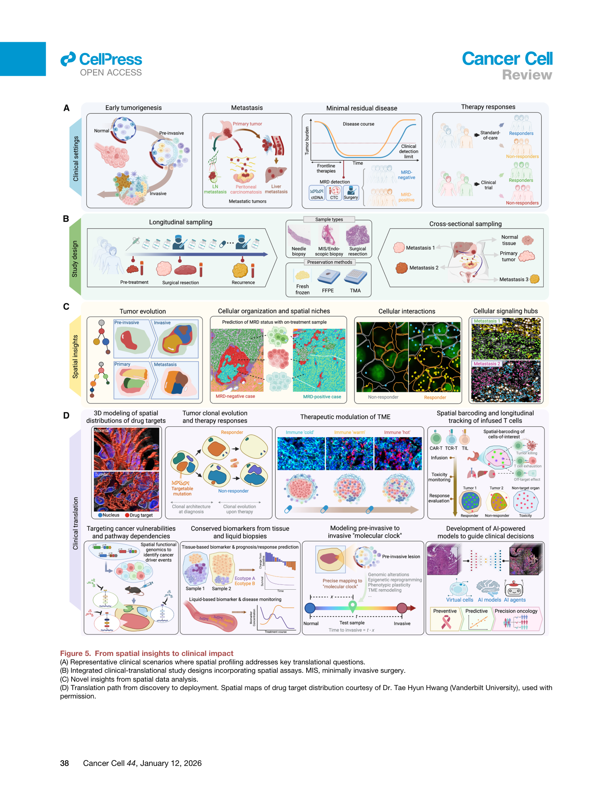

# Spatial omics at the forefront: emerging technologies, analytical innovations, and clinical applications

<!-- wechat-style-reviewed: 2026-08-04 -->

一块肿瘤组织被消化成单细胞以后，研究者可以知道里面有哪些肿瘤细胞、T 细胞和成纤维细胞，却很难再回答一个病理学上极具体的问题：T 细胞真的进入了肿瘤核心，还是被挡在基质边界之外？

空间技术试图保住这层关系，但选择本身已经变成新的难题。综述列出的空间转录组尺度从早期约 55 μm 的捕获区域推进到 2 μm bin、约 500 nm 阵列；成像型平台的基因 panel 可从约 5,000 扩展到约 18,000，而多数商业空间蛋白组仍集中在约 20–60 个蛋白。分辨率、分子覆盖、组织面积、FFPE 兼容性和成本不能同时最大化。

真正需要解决的因此不是“要不要做空间组学”，而是怎样从临床或生物学问题反推样本、平台和分析单位：该看一个细胞、一个 niche，还是整个肿瘤生态？又该怎样把一张高维空间图谱变成能在独立队列验证的标志物？

这篇文章不是一项新的患者队列研究，而是一篇 26 页的叙述性综述。作者用 5 张主图、1 张平台比较表和 241 篇参考文献给出的答案是：先把形态、位置和分子放进同一坐标系，再从 cell 逐级组织到 niche、community 和 ecosystem；临床转化则必须从预设终点出发，把高维发现蒸馏为可标准化、可质控、可部署的读数。

## 01｜单细胞已经能分清细胞，为什么还不够？

解离型单细胞测序擅长回答“有哪些细胞状态”，却会切断细胞原来的邻近关系、组织边界和区域梯度。两个肿瘤可以具有相似的 T 细胞比例，但一个肿瘤的 T 细胞与抗原呈递细胞形成免疫 hub，另一个肿瘤的 T 细胞被 CAF 和髓系细胞隔离；细胞清单相近，组织机制可能完全不同。

病理图像保留了结构，却通常缺少足够的分子维度；bulk 组学覆盖广，却混合了不同细胞和区域。空间组学新增的不是一个坐标装饰，而是让细胞状态、邻近关系、肿瘤—基质边界、代谢梯度和临床结局有机会在同一组织框架下比较。

这层信息仍然以取样区域为边界。活检、ROI 或组织芯片没有覆盖到的生态位，任何空间算法都无法补回；模型重建出的高分辨率结构也不等于直接测量。

## 02｜这篇综述到底整合了多大范围的证据？

作者按“技术平台—计算分析—肿瘤微环境—临床转化”组织全文。Fig. 1 和 Table 1 比较空间转录组、蛋白组、代谢组、多模态及 3D/4D profiling；Fig. 2 梳理计算流程；Fig. 3–4 把空间结构提升到 niche、community 和 whole-tumor ecosystem；Fig. 5 再把这些读数放回临床研究设计。

这里没有一个可汇总的患者样本量，也没有作者原创的效应量、P 值或 pooled comparison。26 页、5 张图、1 张表和 241 篇参考文献描述的是领域覆盖范围，不是“1598 个句子等于 1598 个实验结果”，更不能把不同癌种、平台和队列的发现当作同一条件下的横向排名。

因此，阅读重点不是寻找一个最高 AUC，而是判断每一类技术和空间单位能回答什么问题、需要什么样本，以及其证据在哪一步仍停留在被引研究或作者路线图。

## 03｜分辨率越高，平台就一定越好吗？

不是。成像型空间转录组可以获得单细胞或亚细胞定位，并较好保留形态，但通常需要预设 panel 和多轮成像。综述列举的产品规格中，Xenium Prime 约 5,000 个基因，CosMx 6K 约 6,000 个，CosMx WTX 约 18,000 个；这些是不同产品配置的厂商规格，不是统一样本、统一流程下的实测性能比较。

测序型平台更接近全转录组发现，却要在捕获效率、区域大小和单细胞边界之间取舍。tissue-on-array 路线的名义尺度从约 55 μm 发展到约 500 nm，Visium HD 使用 2 μm bin；但 2 μm bin 通常只覆盖细胞的一部分，“亚细胞 bin”不能自动等同于准确分割出的单细胞。

其他模态有不同的取舍。多数商业空间蛋白组约覆盖 20–60 个蛋白，少数超过 100-plex；MALDI-IMS 常见分辨率约 10–50 μm，SIMS 可以进入亚微米尺度，却通常牺牲分子覆盖。Spatial CITE-seq 类同切片方案约为 10–25 μm；相关 Stereo-CITE 方案可把全转录组与超过 100 个蛋白连接起来，但配准、组织消耗和批次也随之增加。

简明图注：Fig. 1 比较转录组、蛋白组、代谢组、多模态和 3D/4D 路线；它展示能力边界，不提供统一 benchmark 下的优胜排名。

简明图注：Table 1 应被当作平台选择矩阵。其规格来自 2025 年时点的厂商资料或网站，分辨率、panel、捕获面积、组织兼容性和成本并非同一实验条件下测得，后续也可能更新。

## 04｜拿到空间坐标后，怎样避免停在“漂亮地图”？

第一步不是聚类，而是确认坐标中的分子究竟属于哪个空间单位。成像型数据依赖细胞分割；spot 或 bin 数据常需去卷积、bin-to-cell reconstruction 或分辨率增强。分割边界一旦偏移，后面的细胞类型、邻近关系和配体—受体推断都会继承误差。

第二步才是归一化、批次校正和跨样本 harmonization，再把数据组织成 cell、subcellular compartment、niche、community 或 whole-tumor region。一个算法输出的 domain 是模型构建的空间单位，需要用标志物、病理区域、独立样本或功能实验验证，不能因为颜色边界清楚就把它当成天然实体。

第三步是把 RNA、蛋白、代谢、DNA 变异和 H&E 图像配准到同一组织结构。多模态整合与 spatial foundation model 可以增强表示能力，也会引入训练集偏倚、模态缺失和跨平台泛化问题；增强后的图谱必须与原始测量并列保留。

简明图注：Fig. 2 的逻辑是“分割/预处理—空间单位—互作与生态—克隆演化—多模态/3D”；每一步既增加解释力，也可能传播上一步的技术误差。

## 05｜九类空间生态位，真正新增了什么信息？

综述用 9 类 niche 说明“组成”与“组织”不是一回事：三级淋巴结构、血管周围 niche、干样 CD8 T 细胞 niche、CAF 相关区、肿瘤侵袭前沿、免疫排斥区、缺氧区、神经—免疫界面和微生物定植区。这个“9”是作者的概念整理，不是九组样本的头对头实验。

例如，三级淋巴结构的价值不只是同时存在 B 细胞和 T 细胞，而是这些细胞是否形成有组织的抗原呈递和局部免疫成熟结构。免疫排斥区也不是“T 细胞少”，而是细胞聚集在基质或肿瘤边缘却未进入实质。空间邻近使这些假说可被定位，但邻近本身仍不能证明真实接触、信号传递或因果作用。

Fig. 4 进一步把空间单位从 cell 扩展到 neighborhood、niche、community、region、zonation、ecotype、archetype 和 tumor ecosystem。临床相关信号可能出现在较高层级：不是某个细胞独自决定治疗反应，而是肿瘤细胞、抗原呈递细胞、T 细胞和基质是否组成了可重复的结构。

简明图注：Fig. 3 总结九类具有生物学意义的空间结构；它是跨研究的概念图，不代表本综述新生成的患者数据。

简明图注：Fig. 4 强调空间结论依赖分析尺度；cell、niche、community 与 ecosystem 回答的是不同问题，不能相互替代。

## 06｜怎样从临床问题反推样本和平台？

作者提出的顺序是：先写清 clinical question 和 endpoint，再决定患者、时间点、部位、保存方式、平台和验证策略。癌前病变需要阶段性或纵向采样；转移研究需要原发灶、不同转移灶、正常组织和血液配对；MRD 与治疗反应则需要治疗前、治疗中、治疗后及复发前窗口。

样本保存直接限制可用技术。fresh-frozen 更适合全转录组、代谢组和 discovery-level 多组学；FFPE 更容易获得大规模回顾队列、长期结局和病理配准，却通常依赖 probe-based 或 targeted assay。缺血时间、固定方式、切片厚度、区域选择和配对血液都应在 protocol 中预先规定。

空间终点也应预设，例如特定 niche 的密度、免疫排斥表型、靶点阳性肿瘤比例或肿瘤—基质界面状态。若先生成海量特征再寻找最显著关联，平台批次、ROI 选择和多重比较很容易被误当成生物学发现。

简明图注：Fig. 5 把癌前、转移、MRD 和治疗反应连接到取样、空间分析和临床部署；这是一条研究设计路线，不是已经完成验证的临床产品清单。

## 07｜空间发现怎样变成可用的标志物或靶点？

临床部署通常不会原样报告成千上万个空间特征。更现实的路径是先用 high-plex 平台发现稳定结构，再把它蒸馏为 low-plex 多重免疫荧光、标准病理图像、有限 marker panel 或可重复的组织评分，并在独立队列完成阈值、校准和结局验证。

组织芯片可以提高验证通量：综述讨论的 TMA core 常为 1.5–2 mm，可覆盖数千细胞并扩展到数百病例。但它只取肿瘤的一小块，恰好说明“扩大患者数”与“覆盖完整空间异质性”仍是一组取舍。

空间分析也可以提出药物靶点、治疗组合或风险模型假说，但被引研究启动试验、发现相关 niche，和试验证明疗效是三件不同的事。作者真正强调的是从 discovery 到 deployable assay 的连续验证，而不是把高维图谱直接送入临床决策。

## 08｜这些结果仍需要冷静看待

首先，这是一篇叙述性综述。原文没有报告系统检索、纳排标准、偏倚评价或 meta-analysis；被引研究跨癌种、平台、保存方式和分析流程，不能合并成一个统一效应，也没有可供本综述独立验证的作者 cohort。

其次，空间图谱仍受取样和算法共同限制。活检、ROI 与 1.5–2 mm TMA core 都可能遗漏全肿瘤生态；分割、去卷积、配准和分辨率增强会传播误差。细胞相邻、配体—受体共表达或 niche 与生存相关，只能支持机制假说，不能替代扰动实验和纵向验证。

再次，Table 1 是 2025 年时点的平台规格概览，不是统一条件下的 benchmark。名义分辨率、基因 panel、蛋白 plex、捕获面积和价格会随产品版本变化；跨平台复现必须报告版本、样本处理、深度、分割和空间零模型。

最后，high-plex 空间多组学仍受到成本、通量和标准化限制。空间 AI 还面临训练集偏倚、跨中心泛化、校准、可解释性和责任边界；癌前“molecular clock”、用液体活检推断组织空间结构等方向在本文中仍是路线图，不是完成的临床验证。本地主 PDF 的 Table 1 跨页展平，P001、P008–P010 与 P017 存在双栏/heading 错序，参考文献还被大面积误标为 Methods；具体来源边界见技术附录。

## 09｜对胃癌癌前病变研究，哪些设计可以迁移？

可以把 H. pylori 感染、慢性炎症、萎缩、肠化、异型增生和早癌当作阶段轴，但不要只做横断面“图谱比赛”。先预设可验证终点，例如肠化进展、异型增生发生、早癌检出或根除后的逆转，再决定每个阶段需要的病例数、随访和取样位置。

发现与验证可以分层：fresh-frozen 小规模队列用于全转录组或多模态发现，FFPE 回顾队列用于 targeted spatial transcriptomics、空间蛋白组和病理图像验证。对同一患者尽量保留多区域黏膜、病灶邻近区和配对血液，并记录固定时间、切片厚度和病理区域。

最终输出应是可复核的空间终点，而不是一张更复杂的图。任何候选 epithelial state、immune niche、stromal boundary 或 microbial interface 都需要独立队列、平台重测、阈值校准和功能证据；这是从该综述迁移出的研究设计建议，不是原文已经证明的胃癌标志物。

---

## 技术附录

以下完整保留原笔记的论文信息、主图与 Table 1、技术分类、计算与统计解释、临床路线、局限和迁移建议；这些内容是对叙述性综述的可审计展开，不冒充作者未提供的 Results、Methods 或原创队列。

## 本文目录

- [基本信息](#基本信息)
- [本论文主图](#本论文主图)
- [生物学故事前情](#生物学故事前情)
- [重要缩写表](#重要缩写表)
- [论文详细解读](#论文详细解读)
- [研究问题与科学背景](#研究问题与科学背景)
- [研究设计与数据结构](#研究设计与数据结构)
- [方法与分析框架](#方法与分析框架)
- [原文结果完整梳理](#原文结果完整梳理)
  - [Recent advances in spatial omics technologies](#recent-advances-in-spatial-omics-technologies)
  - [Analytical breakthroughs in tumor spatial profiling](#analytical-breakthroughs-in-tumor-spatial-profiling)
  - [Unraveling tumor microenvironment complexity](#unraveling-tumor-microenvironment-complexity)
  - [Clinical and translational applications of spatial omics](#clinical-and-translational-applications-of-spatial-omics)
  - [Conclusions and future directions](#conclusions-and-future-directions)
- [作者结论与证据强度](#作者结论与证据强度)
- [独立方法学详解](#独立方法学详解)
  - [综述型文章的证据结构](#综述型文章的证据结构)
  - [空间组学平台选择方法](#空间组学平台选择方法)
  - [空间数据处理流程](#空间数据处理流程)
  - [统计学分析方法](#统计学分析方法)
  - [空间计算模型和多模态整合](#空间计算模型和多模态整合)
  - [临床转化研究设计](#临床转化研究设计)
  - [可重复性资源和迁移注意点](#可重复性资源和迁移注意点)
- [生物学与临床意义](#生物学与临床意义)
- [局限性与危险假设](#局限性与危险假设)
- [深度研究洞察](#深度研究洞察)
- [可借鉴或迁移的思路](#可借鉴或迁移的思路)
- [可复用学术表达](#可复用学术表达)
- [相关论文与概念](#相关论文与概念)
- [覆盖审计](#覆盖审计)

## 基本信息

- 原文题名：Spatial omics at the forefront: emerging technologies, analytical innovations, and clinical applications
- 期刊：Cancer Cell 44, 24-49
- 年份：2026
- DOI：10.1016/j.ccell.2025.12.009
- 作者：Yunhe Liu、Yibo Dai、Linghua Wang
- 通讯作者：Linghua Wang
- 研究领域：空间组学、肿瘤微环境、空间转录组、空间蛋白组、空间代谢组、多模态整合、精准肿瘤学
- 关键词：spatial omics、spatial transcriptomics、spatial proteomics、spatial metabolomics、tumor microenvironment、multimodal integration、clinical translation、precision oncology
- PDF 归档：`pdfs/processed/cancer-cell-spatial-omics-review-2026.pdf`
- 文章类型：叙述性综述；无作者原创 cohort、传统 Results/Methods、系统综述流程或 meta-analysis。
- 数据与代码：原文没有作者原创数据集或代码可用性声明。
- PDF 解析质量：
  - 使用 `scripts/build_pdf_llm_pack.py --engine pymupdf` 建立句子级解析包；共 26 页、1,598 个句子 ID。
  - `P001` 的摘要/作者/正文、`P008-P010` 的正文/Fig. 2/Box 1、`P017` 的 heading 存在双栏错序或吞句。
  - Table 1 跨 `P003-P004` 展平，列名和平台规格错序；本文以两张截图核对，不逐项重排未确认的表格内容。
  - 自动标签将 1,013 个参考文献 ID 错分为 Methods；文末按综述真实结构完成语义校正审计。
- 图像截取说明：已截取主文 Fig. 1-5 和 Table 1 两页截图，图像位于 `assets/spatial-transcriptomics/2026-spatial-omics-review/`。

## 本论文主图

| 原文图表 | 原文图题/核心信息 | 是否截取 | 图像文件 | 放置位置 |
|---|---|---|---|---|
| Fig. 1 | Overview of spatial omics technologies：空间转录组、蛋白组、代谢组、多组学和 3D/4D profiling 技术全景 | 是 | `assets/spatial-transcriptomics/2026-spatial-omics-review/fig1-overview-spatial-omics-technologies.png` | [Recent advances in spatial omics technologies](#recent-advances-in-spatial-omics-technologies) |
| Table 1 | Comparison of major commercial high-resolution spatial transcriptomic profiling platforms：高分辨率商业空间转录组平台比较 | 是 | `assets/spatial-transcriptomics/2026-spatial-omics-review/table1-commercial-spatial-transcriptomics-platforms-p1.png`; `table1-commercial-spatial-transcriptomics-platforms-p2.png` | [Recent advances in spatial omics technologies](#recent-advances-in-spatial-omics-technologies) |
| Fig. 2 | Computational tools and analytical frameworks for spatial omics：空间组学数据处理、单细胞/亚细胞分析、空间组织、进化、多模态整合和 3D 重建 | 是 | `assets/spatial-transcriptomics/2026-spatial-omics-review/fig2-computational-tools-frameworks.png` | [Analytical breakthroughs in tumor spatial profiling](#analytical-breakthroughs-in-tumor-spatial-profiling) |
| Fig. 3 | Spatial mapping of TME niches：肿瘤微环境中九类重要空间 niche | 是 | `assets/spatial-transcriptomics/2026-spatial-omics-review/fig3-spatial-mapping-tme-niches.png` | [Unraveling tumor microenvironment complexity](#unraveling-tumor-microenvironment-complexity) |
| Fig. 4 | Hierarchy of spatial archetypes across scales：从细胞、niche、community 到 whole-tumor ecosystem 的空间层级 | 是 | `assets/spatial-transcriptomics/2026-spatial-omics-review/fig4-spatial-archetypes-hierarchy.png` | [Unraveling tumor microenvironment complexity](#unraveling-tumor-microenvironment-complexity) |
| Fig. 5 | From spatial insights to clinical impact：空间组学从临床场景、研究设计、空间洞察到临床部署的路线图 | 是 | `assets/spatial-transcriptomics/2026-spatial-omics-review/fig5-spatial-insights-clinical-impact.png` | [Clinical and translational applications of spatial omics](#clinical-and-translational-applications-of-spatial-omics) |

## 生物学故事前情

癌症不是一团均质细胞，而是由肿瘤克隆、免疫细胞、成纤维细胞、血管、神经、微生物和细胞外基质共同构成的组织生态系统。单细胞测序解决了“有哪些细胞状态”的问题，却经常丢失这些细胞在组织中如何排列、谁和谁相邻、哪些细胞群形成免疫抑制或免疫激活结构、肿瘤克隆如何沿空间边界扩展等信息。

空间组学出现之前，病理学能看见组织结构，但分子维度有限；bulk 多组学能测分子，但混合了不同细胞和区域；单细胞测序能拆细胞状态，但缺空间坐标。肿瘤学真正需要的是把“形态、位置、分子、细胞互作和临床结局”放到同一个坐标系里。空间组学正是为了补上这个断层。

这篇综述的前情是：空间技术已经从少数研究型平台扩展到商业化空间转录组、空间蛋白组、空间代谢组、多模态和 3D/4D 成像；计算方法也从简单细胞注释发展到空间 niche、community、生态系统、空间 foundation model 和临床可部署 assay。作者要讲的不是某一个实验结果，而是整个领域如何从“能在组织上测分子”走向“用空间读数解释肿瘤演化、治疗反应和精准肿瘤学决策”。

## 重要缩写表

| 缩写 | 中文含义 | 本文语境中的具体指代 | 阅读时注意 |
|---|---|---|---|
| ST | 空间转录组 | 保留组织空间坐标的 RNA profiling 技术总称 | 不同平台的分辨率、通量和 FFPE 兼容性差异很大 |
| TME | 肿瘤微环境 | 肿瘤细胞周围免疫、基质、血管、神经、微生物等生态成分 | TME 不是单一细胞类型，而是空间组织系统 |
| NGS | next-generation sequencing | 基于测序读出空间条形码或 transcript 的技术路线 | 高通量不等于高空间分辨率 |
| FFPE | 福尔马林固定石蜡包埋 | 临床病理样本最常见保存形式 | 适合回顾性队列，但 RNA 质量和平台选择受限 |
| FISH | 荧光原位杂交 | 成像型空间转录组的基础技术逻辑 | 目标基因 panel 选择会限制发现范围 |
| IMC | imaging mass cytometry | 金属标记抗体结合质谱成像的空间蛋白组技术 | 蛋白 panel 通常低于转录组，但蛋白更接近功能状态 |
| CODEX | co-detection by indexing | 循环荧光抗体成像平台 | 适合高维蛋白空间定位，依赖抗体质量 |
| MALDI-MSI | 基质辅助激光解吸电离质谱成像 | 空间代谢组/脂质组常用技术 | 分子注释和空间分辨率是关键限制 |
| CNV | 拷贝数变异 | 可从空间表达或基因组信号中推断肿瘤克隆结构 | 表达推断 CNV 只是近似，不等同于 DNA 测序 |
| TLS | 三级淋巴结构 | 肿瘤内 B/T 细胞组织化免疫结构 | TLS 的位置、成熟度和癌种背景影响临床意义 |
| MRD | 微小残留病灶 | 治疗后未被常规检测发现但可能导致复发的残留肿瘤 | 空间读数可帮助解释 MRD 生态位，不一定直接替代 ctDNA |
| TMA | tissue microarray | 组织芯片 | 适合高通量验证，但取样区域有限 |
| MIS | minimally invasive surgery | 微创手术 | Fig. 5 中作为临床取样场景之一 |
| AI | 人工智能 | 用于图像、空间组学和临床决策整合的模型 | 需要标准化数据和可解释临床验证 |

## 论文详细解读

### 研究问题与科学背景

这篇综述的核心问题是：空间组学怎样把肿瘤研究从“细胞类型清单”推进到“组织生态系统机制图谱”，并最终进入临床研究和精准肿瘤学。作者从三个层面展开：第一，空间组学平台本身如何演进；第二，空间数据分析如何从细胞注释走向 niche、community、生态系统和多模态整合；第三，空间读数如何服务于癌前病变、转移、MRD、治疗反应、 biomarker 和 target discovery。

文章把空间组学定义为下一代预测和精准肿瘤学的基础设施之一。它的意义不只是“保留坐标”，而是用坐标把肿瘤克隆、免疫反应、基质结构、微生物、神经接口、代谢状态和治疗压力连接起来。相比单细胞 RNA-seq，空间组学最关键的新增信息是细胞邻近关系、区域结构和组织层级。

### 研究设计与数据结构

本文是综述，不是原始实验研究，没有单一 cohort、纳排标准或统计分析队列。作者整合了空间转录组、空间蛋白组、空间代谢组、多模态空间组学、3D/4D profiling、空间计算方法和肿瘤临床转化研究的代表性文献。

从结构上看，文章按“技术平台 -> 计算分析 -> 肿瘤生态机制 -> 临床转化”的路径组织。Fig. 1 和 Table 1 负责平台层；Fig. 2 负责计算框架；Fig. 3 和 Fig. 4 负责肿瘤微环境和空间生态层级；Fig. 5 负责临床转化设计。这个结构本身就是作者的论证：空间组学要进入临床，不能只靠单个平台或单个算法，必须同时解决样本、技术、分析、验证和部署问题。

### 方法与分析框架

这篇文章的方法框架不是实验流程，而是综述式的技术-分析-转化框架。技术层面，作者把空间组学分为 transcriptomics、proteomics、metabolomics、multi-omics 和 3D/4D profiling；其中空间转录组又分为 imaging-based 和 sequencing-based，前者包括 cyclic decoding 和 cyclic in situ sequencing，后者包括 barcode-to-cell 和 tissue-on-array capture。

计算层面，作者把空间分析拆成数据处理、数据增强、单细胞/亚细胞分析、空间细胞互作、空间 niche/community、肿瘤克隆演化、多模态整合和 3D 重建。临床层面，作者强调 study design 必须从临床问题和 endpoint 出发，再反推样本类型、保存方式、平台选择、空间分辨率、分析框架和验证策略。

### 原文结果完整梳理

#### Recent advances in spatial omics technologies

中文图注（基于原文图注）：Fig. 1 总结空间组学技术类型。A：空间转录组分为 in situ imaging-based 和 spatial barcoding sequencing-based。成像型方法又包括 cyclic combinatorial decoding 和 cyclic in situ sequencing，区别在于通过荧光编码还是碱基读取识别目标；测序型方法包括 barcode-to-cell delivery 后进行单细胞/单核测序，以及 tissue-on-array 的空间条形码捕获和 NGS。B：空间蛋白组包括多重荧光抗体成像和金属标记抗体质谱成像等。C：空间代谢组通过激光、离子束、电喷雾或质谱成像测量组织中的小分子、脂质和代谢物。D：空间多组学可同时或连续测量 DNA/RNA/蛋白/组织形态等信号。E：3D/4D profiling 通过连续切片、组织透明化或时间轴数据重建空间结构。

作者首先梳理平台层的变化。空间转录组不再只是早期低分辨率 capture array，而是形成了高分辨率 imaging-based 和 sequencing-based 两大路线。成像型方法的优势是单细胞或亚细胞分辨率、形态保留和 FFPE 兼容性较强；限制是 panel 需要预设，通量和循环次数有成本。测序型方法的优势是更接近全转录组或高通量发现；限制是分辨率、捕获效率和单细胞边界解析依赖平台。

中文图注（基于原文表格）：Table 1 比较主要商业高分辨率空间转录组平台，包括 imaging-based、in situ sequencing、tissue-on-array capture 和 barcode-to-cell 等类别。表格重点比较平台机制、分辨率、基因通量、组织兼容性、样本类型、读出方式和应用场景。该表不是性能排名，而是平台选择矩阵：不同研究问题需要在分辨率、capture area、whole-transcriptome 能力、FFPE 兼容性、成本和多组学扩展之间取舍。

空间蛋白组和代谢组补充了 RNA 与功能状态并非完全等价的问题。蛋白组能更接近受体、配体、免疫检查点和磷酸化等功能层；代谢组能读出局部营养、脂质、药物分布和代谢微环境。空间多组学进一步把 DNA/RNA/蛋白/形态或 TCR/BCR 信息连接起来，但也带来配准、批次、模态尺度和组织消耗的困难。

#### Analytical breakthroughs in tumor spatial profiling

中文图注（基于原文图注）：Fig. 2 展示空间组学分析框架。A：数据处理包括细胞分割、归一化、harmonization、分辨率增强和特征增强。B：单细胞/亚细胞分析包括空间单位定义、mRNA 亚细胞定位和空间细胞互作推断。C：空间组织和生态系统分析包括 context-aware clustering、从细胞到 niche/community/ecosystem 的层级建模。D：空间解析肿瘤演化。E：多模态整合和 3D 体积模型重建。

作者将空间计算的第一步定义为数据处理和增强。对于成像型平台，细胞分割决定了转录本或蛋白信号归属到哪个细胞；对于 spot/bin 型平台，数据需要 deconvolution、resolution enhancement 或 cell reconstruction。归一化、批次校正和跨平台 harmonization 是后续比较的前提，否则空间差异很容易混入技术差异。

第二层是空间单位的定义。空间单位可以是 spot、cell、subcellular compartment、niche、community 或 whole-tumor region。不同单位回答不同问题：亚细胞定位回答 RNA 或蛋白在细胞内何处富集；细胞邻近关系回答谁和谁互动；niche/community 回答多细胞结构如何组织；ecosystem 回答整个肿瘤空间结构和临床结局如何相关。

第三层是多模态和 3D。空间转录组、蛋白组、代谢组、病理图像和基因组变异需要共同配准到组织结构上。作者特别强调 multimodal integration 和 spatial foundation models，因为未来临床部署很可能不是单一 marker，而是组织形态、空间细胞生态和分子特征共同构成的风险模型。

#### Unraveling tumor microenvironment complexity

中文图注（基于原文图注）：Fig. 3 示意肿瘤微环境中九类重要空间 niche 的细胞组成和组织方式。图中强调 TLS、肿瘤-基质边界、免疫抑制区、血管/缺氧相关 niche、神经接口、微生物相关区域等结构如何通过空间组织影响肿瘤生物学和临床结局。

作者把空间组学对 TME 的贡献概括为：它不仅识别细胞类型，还识别细胞如何组织成功能结构。TLS 是最典型例子，它不是“有 B 细胞和 T 细胞”这么简单，而是局部抗原呈递、B 细胞成熟、T cell help 和抗肿瘤免疫被组织起来的结构。不同癌种中 TLS 的位置、成熟状态和免疫细胞组成与预后和免疫治疗反应相关，具体方向仍依赖癌种和队列。

空间组学也揭示肿瘤-基质边界、CAF niche、髓系免疫抑制区、血管周围结构、缺氧区域、微生物生态位和神经-肿瘤接口。这些结构用 dissociated single-cell sequencing 很难完整恢复，因为一旦消化组织，邻近关系和区域边界就丢失了。

中文图注（基于原文图注）：Fig. 4 展示空间 archetype 的层级结构：从 individual cells 到 multicellular niches，再到 spatial communities 和 whole-tumor ecosystems。该图强调空间结构不是单一尺度现象，而是由细胞邻近、功能 niche、多区域组织和整个肿瘤生态共同构成。

Fig. 4 是全篇概念核心。作者提出 spatial archetypes across scales，意思是空间模式应按层级理解。单个细胞状态很重要，但许多临床相关现象发生在多细胞 niche 或 whole-tumor ecosystem 层面。例如免疫治疗反应可能取决于肿瘤细胞、抗原呈递细胞、T 细胞和 CAF 是否形成有利的接触结构；转移适应可能取决于某个器官微环境中肿瘤克隆、基质和免疫屏障的组合。

#### Clinical and translational applications of spatial omics

中文图注（基于原文图注）：Fig. 5 展示空间组学临床转化路线。A：空间 profiling 可用于早期肿瘤发生、转移、MRD 和治疗反应等临床场景。B：临床转化设计包括纵向采样、横断面多部位采样、样本类型和保存方式选择。C：空间数据可揭示肿瘤演化、MRD 预测、细胞组织和 niche、细胞互作与信号 hub。D：从发现到部署包括药物靶点空间分布、肿瘤克隆演化和治疗反应、TME 调控、细胞治疗追踪、target discovery、biomarker 转化、癌前到浸润癌分子时钟，以及 AI 驱动临床决策。

作者强调临床空间组学必须从 clinical question 和 endpoint 开始，而不是先做最炫的平台。不同问题需要不同设计：癌前病变需要纵向和阶段性采样；转移研究需要 primary tumor、不同 metastasis、正常组织和血液配对；MRD 需要治疗前后和复发前窗口；治疗反应研究需要 responder/non-responder 和治疗前/中/后样本。

样本保存方式直接决定平台选择。Fresh-frozen 更适合 discovery-level whole-transcriptome、metabolome 和 neoantigen 研究；FFPE 是临床回顾队列的主力，更适合 probe-based spatial transcriptomics 和高质量 histology。作者特别提醒 ischemia time、固定方式、切片厚度、paired blood/plasma、FFPE/fresh-frozen 配对等 pre-analytical variables 必须 protocolized。

临床应用方面，文章讨论了 pre-cancer、multi-site metastasis、MRD、biomarker 和 target discovery。对于癌前病变，空间组学可定位早期上皮状态变化、免疫抑制 niche 和 stromal remodeling；对于转移，可比较器官特异性微环境和克隆适应；对于 biomarker，作者提出可把空间发现蒸馏为更可部署的组织检测，或探索其与液体活检读数的联系，但这仍是转化路线而非已验证产品。

#### Conclusions and future directions

作者最后认为，空间组学的瓶颈正在从“能不能测”转向“能不能标准化、扩展、解释和部署”。未来真正有临床价值的空间组学，不一定把高维原始空间数据原样推入临床，而是把 discovery-level 高维空间发现蒸馏为可扩展、可质控、AI-enabled、临床可部署的 assay。

关键挑战包括平台标准化、样本前处理一致性、跨平台可比性、成本和通量、空间数据分析 benchmark、空间模式的生物学可解释性、以及临床 endpoint 验证。作者的判断是，空间组学会成为 next-generation predictive and precision oncology 的核心组成，但前提是从漂亮图谱走向标准化临床研究设计。

### 作者结论与证据强度

作者较有力说明的是：空间组学技术已经形成多平台生态，能够在 RNA、蛋白、代谢、多模态和 3D 层面解析肿瘤组织；计算分析正在从细胞注释扩展到空间 niche、community、ecosystem 和临床关联；空间读数对癌前病变、转移、MRD、治疗反应和 biomarker discovery 具有明确转化潜力。

需要注意的是，本文是综述，不是单一原始研究。它的证据强度来自大量代表性研究和领域趋势整合，而不是作者自己生成的验证 cohort。因此，文中的 roadmap 和 conceptual hierarchy 很有指导价值，但某个具体空间 biomarker 是否能临床部署，仍需要癌种特异、平台特异、队列特异的独立验证。

## 独立方法学详解

### 综述型文章的证据结构

本文没有传统 Methods 章节，也没有单一原始数据集。它的方法学价值在于整理空间组学领域的技术分类、分析流程和临床研究设计原则。阅读时应把它当作“领域方法框架”和“临床转化路线图”，而不是把每个结论都当作同一实验体系下的统计结果。

综述的证据结构可以分为三层：第一，平台层证据，来自商业平台和技术论文；第二，分析层证据，来自空间数据处理、niche detection、多模态整合和 foundation model 相关方法；第三，肿瘤生物学和临床层证据，来自不同癌种的空间 profiling 研究。三层证据之间不是同质数据合并，因此不能做简单横向排名。

### 空间组学平台选择方法

平台选择首先取决于研究问题。若问题是“哪些细胞状态在组织里出现”，whole-transcriptome 或高通量 ST 更合适；若问题是“免疫检查点、靶点蛋白或细胞互作在哪里发生”，空间蛋白组更直接；若问题是“药物、脂质或代谢微环境如何分布”，空间代谢组不可替代；若问题是“空间结构如何影响克隆演化和治疗反应”，多模态整合更有价值。

第二个维度是样本。FFPE 支持大量临床回顾队列和病理图像配准，但通常适合 probe-based 或 targeted assay；fresh-frozen 支持更广发现层面的 RNA、代谢和部分多组学，但临床样本获取和保存要求更高。第三个维度是分辨率和区域大小。单细胞/亚细胞分辨率适合细胞互作和亚细胞定位，大面积低分辨率 capture 更适合全组织区域结构和大样本 cohort。

### 空间数据处理流程

空间数据处理的第一步是质量控制和坐标体系建立，包括图像质量、组织区域识别、背景去除、spot/cell/bin 的空间坐标和分子计数矩阵。成像型平台需要细胞分割；分割错误会直接影响细胞类型注释和细胞互作推断。spot/bin 平台需要 deconvolution 或 bin-to-cell reconstruction，否则一个空间单位可能混合多个细胞。

第二步是 normalization、batch correction 和 harmonization。空间数据的技术噪声来自组织厚度、探针效率、成像轮次、测序深度、组织保存和区域差异。第三步是特征增强，包括 resolution upscaling、missing gene imputation、feature augmentation 和 histology-aware enhancement。这些方法能提高可解释性，但也可能引入模型假设，因此必须保留原始数据对照。

### 统计学分析方法

作为综述，本文没有作者原创的统计检验、P 值或回归模型结果。它讨论的统计学和计算分析主要是空间组学研究中常用的方法框架。第一类是空间邻近和共定位分析：输入是细胞坐标、细胞类型或分子表达，目标是判断某些细胞类型是否比随机期望更常相邻或共定位。常见做法包括距离分布、nearest-neighbor enrichment、Ripley 类空间统计、permutation test 或 spatial autocorrelation。其局限是组织结构、细胞密度和采样区域会影响零分布。

第二类是空间 domain、niche 和 community 识别：输入是表达矩阵、细胞类型组成、空间邻接图和组织图像，目标是把组织划分成功能区域。方法可包括图聚类、隐变量模型、topic model、graph neural network 或 context-aware clustering。统计解释上，cluster/domain 是模型构建的空间单位，不是天然存在的实体；需要用 marker、病理区域、临床结局和独立样本验证。

第三类是空间细胞互作推断：输入是配体-受体表达、细胞坐标和邻接关系，目标是推断哪些细胞对可能发生信号通信。它比普通单细胞 ligand-receptor 分析多了空间约束，但仍不能证明真实蛋白接触或功能因果。更可靠的解释需要结合蛋白空间数据、功能实验或治疗扰动。

第四类是临床关联和预测模型：输入是空间特征，例如 TLS 成熟度、免疫 hub、CAF-tumor interface、MRD niche、drug target spatial distribution，以及患者结局或治疗反应。常见统计框架包括 Cox 回归、logistic regression、ROC/AUC、cross-validation、外部验证和 calibration。空间 biomarker 的最大风险是过拟合和平台依赖，因此必须有预设 endpoint、独立验证 cohort、标准化样本处理和可部署 assay。

### 空间计算模型和多模态整合

空间计算模型的核心挑战是把不同尺度的数据放到同一个组织坐标系。RNA、蛋白、代谢物、DNA 变异和 H&E 图像的空间分辨率、噪声结构和缺失机制不同。Horizontal integration 关注跨样本或跨 cohort 对齐；vertical integration 关注同一组织内不同模态整合；diagonal integration 关注不同样本、不同模态和不同空间分辨率同时对齐。

空间 foundation model 是未来方向之一。它试图从大量组织图像、空间表达和多模态数据中学习通用空间表示，再迁移到细胞注释、domain detection、预后预测和治疗反应建模。风险在于训练数据偏倚、跨平台泛化、模型可解释性和临床责任边界。对于医学应用，foundation model 不能只看 benchmark，还要看是否能提供稳定、可校准、可审计的临床输出。

### 临床转化研究设计

作者强调临床空间组学要从临床问题反推设计。如果目标是癌前病变进展预测，就需要 normal、precancer、invasive cancer 的阶段性样本和纵向随访；如果目标是转移机制，就需要 primary、multiple metastases、normal tissue 和血液/ctDNA 配对；如果目标是治疗反应，就需要治疗前、中、后样本，以及 responder/non-responder 的预设比较。

样本物流是临床空间组学成败的前提。需要预先规定 ischemia time、固定方法、切片厚度、染色流程、区域选择、病理标注和 paired biospecimen。分析上，应在 protocol 中预设 primary spatial endpoint，例如 TLS density、immune-excluded phenotype、target-positive tumor fraction、MRD niche score 或 spatial interaction signature，而不是事后在海量空间特征中寻找最显著结果。

### 可重复性资源和迁移注意点

迁移本文框架时，不能只复制某个平台名称。更重要的是把研究问题、样本类型、空间分辨率、模态选择和统计验证连成闭环。对于 FFPE 临床队列，优先考虑 probe-based ST、空间蛋白组和病理图像整合；对于 discovery 项目，fresh-frozen whole-transcriptome、代谢组或多模态平台更有价值。

复现空间组学研究时，必须报告平台版本、panel、组织保存方式、切片厚度、成像/测序深度、细胞分割方法、归一化流程、batch correction、空间邻接定义、统计零模型和验证 cohort。缺少这些信息时，空间图谱很难转化为可比较的 biomarker。

## 生物学与临床意义

这篇综述的生物学意义在于把肿瘤从“细胞组成问题”重新定义为“空间组织问题”。很多关键生物学现象不是某个细胞类型单独决定的，而是由细胞状态、邻近关系、组织结构和微环境压力共同决定。例如 TLS 是否成熟、T 细胞是否被排除在肿瘤边界外、CAF 是否形成免疫抑制屏障、药物靶点是否空间异质分布，这些都需要空间读数。

临床意义在于，空间组学可以帮助把 pathology、molecular oncology 和 AI 连接起来。作者设想，未来临床不会直接报告成千上万个空间基因，而可能报告经过验证的低维空间特征，例如免疫 hub、MRD niche、靶点空间覆盖或肿瘤—基质界面；这些名称在本文中是概念示例，不是已经定标的标准评分。

## 局限性与危险假设

第一，空间组学图谱不等于机制证明。看到两类细胞相邻或一个 niche 与预后相关，只能提出机制假说，仍需要功能实验、扰动实验或纵向验证。

第二，平台差异会强烈影响结论。分辨率、panel、组织保存、细胞分割和归一化都会改变空间特征，因此跨平台比较必须谨慎。

第三，临床部署不能直接搬运 discovery-level 高维数据。高维空间发现需要被蒸馏为可质控、可解释、成本可接受、能在独立 cohort 复现的 assay。

第四，空间 AI 模型容易过拟合组织来源、染色流程和平台批次。没有外部验证、校准和可解释性，模型输出不能直接进入临床决策。

## 深度研究洞察

本文最重要的启发是将空间结构视为肿瘤生物学的“中间层”。基因突变、细胞状态和临床结局之间往往缺少直接桥梁；空间 niche 和 ecosystem 可能就是连接这些层级的组织机制。

第二个启发是，空间组学的价值不在于生成更复杂的数据，而在于把临床问题定位到组织结构中。对于早筛、癌前病变、MRD、转移和治疗反应，真正关键的是找到哪些空间结构代表进展风险、治疗脆弱性或可干预生态位。

第三个启发是，未来空间组学会与病理 AI 深度合流。H&E 图像提供低成本、可扩展形态信息；高维空间组学提供 discovery 和分子锚点；AI 的任务是把二者连接成临床可部署模型。

## 可借鉴或迁移的思路

对胃癌预防和 GIMs 研究，最值得迁移的是 Fig. 5 的临床转化路线。胃黏膜从 H. pylori 感染、慢性炎症、萎缩、肠化、异型增生到早癌，是典型的空间组织重塑过程。空间组学可用于构建 normal-inflammation-atrophy-IM-dysplasia-cancer 的分子时钟，识别哪些 epithelial state、immune niche、stromal boundary 或 microbial interface 预测进展。

具体设计上，可以用 FFPE 回顾队列做 targeted spatial transcriptomics 或 spatial proteomics，结合病理分区和随访结局，筛选可部署 biomarker；再用 fresh-frozen discovery cohort 做 whole-transcriptome 或多组学空间图谱，解释机制。统计上应预设 endpoint，如 GIM 进展、异型增生发生、早癌检出或根除后逆转，而不是只做横断面分组差异。

对免疫治疗研究，本文提示不要只看总体 T cell infiltration，而要看 T cell 是否进入肿瘤核心、是否接近 antigen-presenting cells、是否被 CAF 或髓系细胞隔离、是否形成 TLS 或 immune hub。空间结构可能比单纯细胞比例更接近治疗反应机制。

## 可复用学术表达

本文值得学习的表达是把 spatial omics 写成能够 reveal how tumor cells and the microenvironment are organized, interact, and evolve within tissues。这句话把空间组学的价值压缩成组织、互作和演化三个关键词。

第二个表达是把 spatially organized features 从 immune hubs 扩展到 microbiota and neural interfaces。这提醒写空间组学文章时，不要把空间只理解成肿瘤和免疫两类细胞的距离，而应扩展到组织生态系统。

第三个表达是 high-plex spatial discoveries may be distilled into scalable, AI-enabled, clinically deployable assays。这个表达非常适合转化医学：高维发现不是终点，临床部署需要蒸馏、标准化和可扩展。

## 相关论文与概念

空间转录组平台相关概念包括 imaging-based ST、sequencing-based ST、cyclic decoding、cyclic in situ sequencing、tissue-on-array capture 和 barcode-to-cell delivery。理解这些平台差异是设计空间研究的第一步。

空间计算相关概念包括 cell segmentation、deconvolution、spatial domain detection、spatially constrained clustering、cell-cell communication、spatial autocorrelation、multimodal integration、3D reconstruction 和 spatial foundation models。

肿瘤生态相关概念包括 TLS、tumor-stroma interface、immune-excluded phenotype、CAF niche、myeloid suppressive niche、vascular niche、hypoxia niche、microbiota-tumor interface 和 neural-tumor interface。

临床转化相关概念包括 pre-cancer atlas、MRD、multi-site metastasis profiling、longitudinal sampling、FFPE-compatible assay、TMA validation、spatial biomarker calibration、pathology AI 和 clinically deployable spatial assay。

## 覆盖审计

本次审阅使用 `scripts/build_pdf_llm_pack.py --engine pymupdf` 生成 `tmp/spatial-omics-review-2026-llm-pack.md` 与 JSON manifest。本地主 PDF 共 26 页、1,598 个句子 ID。本文是叙述性综述，没有作者原创 cohort，也没有传统 Results 或 Methods 章节；因此真实 Results 覆盖与真实 Methods 覆盖均为“不适用”，不能把自动标签数包装成实验结果或方法句数。

自动解析把 `P017.S0009-P017.S0025` 的 17 个综述叙述 ID 标为 Results，又把 1,291 个 ID 标为 Methods。后者包含正文和大量参考文献：`P018.S0022-P026.S0016` 共 1,053 个 ID，语义上全部属于参考文献或页眉页脚。下表按综述真实结构闭合全部来源范围。

| 语义模块 | 来源范围 | ID 数 | 覆盖说明 |
|---|---|---:|---|
| 前置、引言、技术平台及 Fig. 1/Table 1 | `P001.S0001-P006.S0008` | 174 | 已覆盖技术分类、平台规格与分辨率—覆盖取舍；前置信息和表格展平另标低置信 |
| 计算分析与 Fig. 2/Box 1 | `P006.S0009-P010.S0004` | 127 | 已覆盖分割、去卷积、空间单位、互作、多模态和 foundation model 边界 |
| TME niche 与 Fig. 3–4/Box 2 | `P010.S0005-P013.S0013` | 104 | 已覆盖 9 类 niche、空间层级及被引研究边界 |
| 临床转化与 Fig. 5 | `P013.S0014-P017.S0025` | 107 | 已覆盖研究设计、癌前/转移/MRD/治疗反应和部署路线 |
| 结论与未来方向 | `P017.S0026-P018.S0012` | 24 | 已覆盖标准化、通量、AI 与前瞻方向 |
| 致谢、贡献、利益声明 | `P018.S0013-P018.S0021` | 9 | 已分类 |
| 参考文献及页眉页脚 | `P018.S0022-P026.S0016` | 1,053 | 已识别为非 Methods，不冒充正文证据 |
| **全文合计** |  | **1,598** | **1,598/1,598 已完成结构分类** |

### 主图、表格与定量锚点

- Fig. 1 图注来源为 `P002.S0004-P002.S0006`；Fig. 2 为 `P007.S0003-P007.S0007`；Fig. 3 为 `P010.S0017`；Fig. 4 为 `P013.S0017`；Fig. 5 为 `P015.S0003-P015.S0009`。完整 panel 解释和图像均在本文保留。
- Table 1 位于 `P003-P004` 的双栏跨页区域，线性抽取后列名、平台名和规格发生展平与错序；本文以两张原表截图为最终核对对象，不根据错列文本补造规格。
- 约 5,000/6,000/18,000 个基因的平台规格来源于 `P003.S0016`；in situ sequencing 约 100 bases、seqFISH+ 超过 10,000 基因和 ExSeq 约 4 倍分辨率来自 `P003.S0026-P003.S0030`；55 μm 至约 500 nm 及 2 μm bin 的尺度来自 `P003.S0041-P004.S0016`。
- 多数商业空间蛋白组约 20–60 proteins、少数超过 100-plex 的概括来自 `P004.S0020-P004.S0042`；MALDI-IMS 约 10–50 μm 与 SIMS 亚微米取舍来自 `P005.S0007-P005.S0010`；同切片多模态约 10–25 μm、全转录组加超过 100 个蛋白来自 `P005.S0016-P005.S0019`。这些数字是平台能力介绍，不是临床性能验证。

### 解析质量与证据边界

- `P001` 的摘要、作者信息与正文因双栏顺序交叉；`P008-P010` 的正文、Fig. 2 和 Box 1 交错；`P017.S0007-P017.S0009` 有 heading 吞句，均不能只按线性文本顺序解释。
- 多个 niche 标题被并入句首，包括 `P010.S0014`、`P011.S0014/P011.S0026/P011.S0032`、`P012.S0003/P012.S0010/P012.S0015/P012.S0023/P012.S0028`；本文保留其概念结构，不把标题残片计为独立结果。
- 原文没有系统综述检索式、纳排流程、偏倚评价或 meta-analysis，也没有补充材料、作者原创数据集或代码可用性声明。文中独立方法学和统计框架是编辑者对领域方法的解释，不冒充作者实际执行的 Methods。
- 未发现明确的原文内部数字冲突。CosMx 68-plex 与 WTX 后续最多 64 targets、Xenium `<500 genes + 27-marker` 与 5K/自定义 panel 属于不同产品或工作流；2026 年卷期与 `© 2025 The Authors` 也不是事实冲突。
- 邻近、共定位、配体—受体共表达和结局关联不证明功能接触或因果机制；高维空间发现进入临床仍需预设终点、独立队列、平台重测、校准和可部署 assay。
